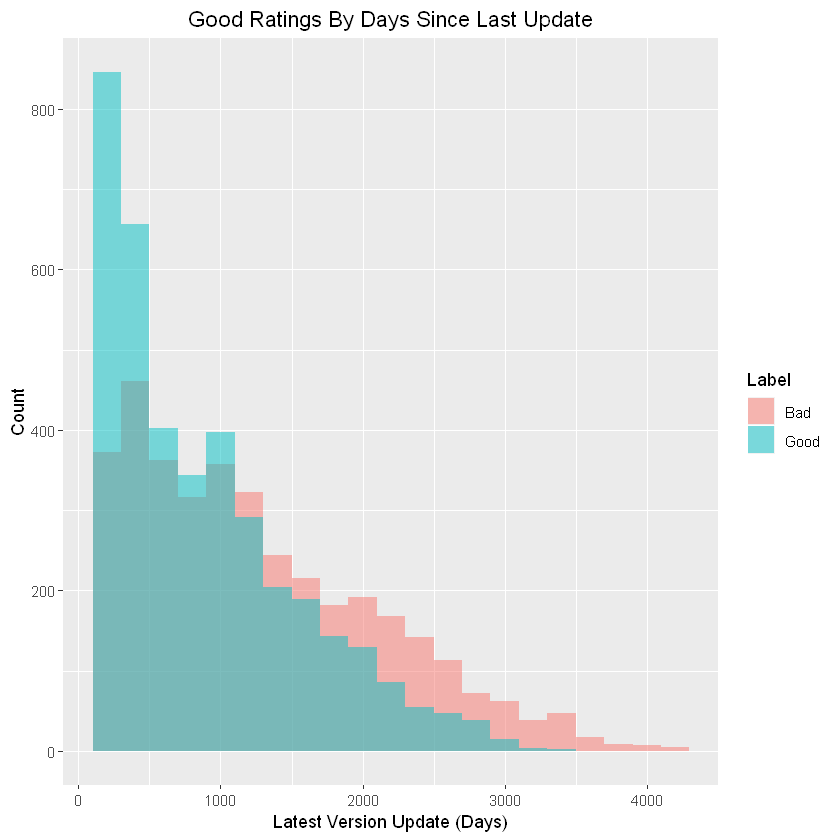

 

# 17K Games Review

## IMPORT LIBS


```R
library(tidyverse)
library(data.table)
library(lubridate)
library(tidytext)
```

    Warning message in init_libxml2():
    "'.Random.seed[1]' is not a valid integer, so ignored"-- Attaching packages --------------------------------------- tidyverse 1.2.1 --
    v ggplot2 3.0.0     v purrr   0.2.5
    v tibble  1.4.2     v dplyr   0.7.6
    v tidyr   0.8.1     v stringr 1.3.1
    v readr   1.1.1     v forcats 0.3.0
    -- Conflicts ------------------------------------------ tidyverse_conflicts() --
    x dplyr::filter()  masks stats::filter()
    x purrr::flatten() masks jsonlite::flatten()
    x dplyr::lag()     masks stats::lag()
    
    Attaching package: 'data.table'
    
    The following objects are masked from 'package:dplyr':
    
        between, first, last
    
    The following object is masked from 'package:purrr':
    
        transpose
    
    
    Attaching package: 'lubridate'
    
    The following objects are masked from 'package:data.table':
    
        hour, isoweek, mday, minute, month, quarter, second, wday, week,
        yday, year
    
    The following object is masked from 'package:base':
    
        date
    
    


```R
library(dplyr)
library(tidyr)
library(ggplot2)
library(formattable)

# Sum Stats install.packages('stargazer')
library(stargazer)
library(ggcorrplot)
library(car)

library(ellipse)

library(pastecs)
library(mlbench)
library(gridExtra)
library(gmodels)
library(caret)
```

    
    Please cite as: 
    
     Hlavac, Marek (2018). stargazer: Well-Formatted Regression and Summary Statistics Tables.
     R package version 5.2.2. https://CRAN.R-project.org/package=stargazer 
    
    Loading required package: carData
    
    Attaching package: 'car'
    
    The following object is masked from 'package:dplyr':
    
        recode
    
    The following object is masked from 'package:purrr':
    
        some
    
    
    Attaching package: 'ellipse'
    
    The following object is masked from 'package:car':
    
        ellipse
    
    The following object is masked from 'package:graphics':
    
        pairs
    
    
    Attaching package: 'pastecs'
    
    The following objects are masked from 'package:data.table':
    
        first, last
    
    The following objects are masked from 'package:dplyr':
    
        first, last
    
    The following object is masked from 'package:tidyr':
    
        extract
    
    
    Attaching package: 'gridExtra'
    
    The following object is masked from 'package:dplyr':
    
        combine
    
    Loading required package: lattice
    
    Attaching package: 'caret'
    
    The following object is masked from 'package:purrr':
    
        lift
    
    


```R
library(janitor)
# #library(ggthemes)
# library(treemap)
# library(waffle)
# library(scales)
# library(DT)
```

## IMPORT FILE


```R
# Set dir
setwd("/Users/MasterDK-Laptop/Desktop/Jupyter_Notebooks_1A/JupyterNB-winter/Bana277-Jup/Project")
```


```R
# Set df
data = read.csv('appstore_games.csv', stringsAsFactors=FALSE )
```

## REVIEW DATA


```R
#  CHANGE THE COL NAMES
data <- data %>%
    clean_names("snake")
```


```R
glimpse(data)
```

    Observations: 17,007
    Variables: 18
    $ url                          <chr> "https://apps.apple.com/us/app/sudoku/...
    $ id                           <int> 284921427, 284926400, 284946595, 28575...
    $ name                         <chr> "Sudoku", "Reversi", "Morocco", "Sudok...
    $ subtitle                     <chr> "", "", "", "", "", "Original brain tr...
    $ icon_url                     <chr> "https://is2-ssl.mzstatic.com/image/th...
    $ average_user_rating          <dbl> 4.0, 3.5, 3.0, 3.5, 3.5, 3.0, 2.5, 2.5...
    $ user_rating_count            <int> 3553, 284, 8376, 190394, 28, 47, 35, 1...
    $ price                        <dbl> 2.99, 1.99, 0.00, 0.00, 2.99, 0.00, 0....
    $ in_app_purchases             <chr> "", "", "", "", "", "1.99", "", "", ""...
    $ description                  <chr> "Join over 21,000,000 of our fans and ...
    $ developer                    <chr> "Mighty Mighty Good Games", "Kiss The ...
    $ age_rating                   <chr> "4+", "4+", "4+", "4+", "4+", "4+", "4...
    $ languages                    <chr> "DA, NL, EN, FI, FR, DE, IT, JA, KO, N...
    $ size                         <dbl> 15853568, 12328960, 674816, 21552128, ...
    $ primary_genre                <chr> "Games", "Games", "Games", "Games", "G...
    $ genres                       <chr> "Games, Strategy, Puzzle", "Games, Str...
    $ original_release_date        <chr> "11/07/2008", "11/07/2008", "11/07/200...
    $ current_version_release_date <chr> "30/05/2017", "17/05/2018", "5/09/2017...
    


```R
dim(data)
```


<ol class=list-inline>
	<li>17007</li>
	<li>18</li>
</ol>


```R
# check if there is any 'NA' value
check <- data %>%
    summarise_all(
        funs(sum(is.na(.)))
    ) %>%
    gather() %>%
    arrange(-value)
check
```


<table>
<thead><tr><th scope=col>key</th><th scope=col>value</th></tr></thead>
<tbody>
	<tr><td>average_user_rating         </td><td>9446                        </td></tr>
	<tr><td>user_rating_count           </td><td>9446                        </td></tr>
	<tr><td>price                       </td><td>  24                        </td></tr>
	<tr><td>size                        </td><td>   1                        </td></tr>
	<tr><td>url                         </td><td>   0                        </td></tr>
	<tr><td>id                          </td><td>   0                        </td></tr>
	<tr><td>name                        </td><td>   0                        </td></tr>
	<tr><td>subtitle                    </td><td>   0                        </td></tr>
	<tr><td>icon_url                    </td><td>   0                        </td></tr>
	<tr><td>in_app_purchases            </td><td>   0                        </td></tr>
	<tr><td>description                 </td><td>   0                        </td></tr>
	<tr><td>developer                   </td><td>   0                        </td></tr>
	<tr><td>age_rating                  </td><td>   0                        </td></tr>
	<tr><td>languages                   </td><td>   0                        </td></tr>
	<tr><td>primary_genre               </td><td>   0                        </td></tr>
	<tr><td>genres                      </td><td>   0                        </td></tr>
	<tr><td>original_release_date       </td><td>   0                        </td></tr>
	<tr><td>current_version_release_date</td><td>   0                        </td></tr>
</tbody>
</table>


```R
sapply(data, function(x){sum(is.na(x))})
```


<dl class=dl-horizontal>
	<dt>url</dt>
		<dd>0</dd>
	<dt>id</dt>
		<dd>0</dd>
	<dt>name</dt>
		<dd>0</dd>
	<dt>subtitle</dt>
		<dd>0</dd>
	<dt>icon_url</dt>
		<dd>0</dd>
	<dt>average_user_rating</dt>
		<dd>9446</dd>
	<dt>user_rating_count</dt>
		<dd>9446</dd>
	<dt>price</dt>
		<dd>24</dd>
	<dt>in_app_purchases</dt>
		<dd>0</dd>
	<dt>description</dt>
		<dd>0</dd>
	<dt>developer</dt>
		<dd>0</dd>
	<dt>age_rating</dt>
		<dd>0</dd>
	<dt>languages</dt>
		<dd>0</dd>
	<dt>size</dt>
		<dd>1</dd>
	<dt>primary_genre</dt>
		<dd>0</dd>
	<dt>genres</dt>
		<dd>0</dd>
	<dt>original_release_date</dt>
		<dd>0</dd>
	<dt>current_version_release_date</dt>
		<dd>0</dd>
</dl>


```R
datanorating = data %>% select(is.na(user_rating_count) == TRUE)
```


```R
ggplot(data)
```


```R
head(data2, 2)
```


<table>
<thead><tr><th scope=col>url</th><th scope=col>id</th><th scope=col>name</th><th scope=col>subtitle</th><th scope=col>icon_url</th><th scope=col>average_user_rating</th><th scope=col>user_rating_count</th><th scope=col>price</th><th scope=col>in_app_purchases</th><th scope=col>description</th><th scope=col>...</th><th scope=col>subtitleyes</th><th scope=col>pricebelow30</th><th scope=col>age_rating</th><th scope=col>tenure</th><th scope=col>latestversion</th><th scope=col>lang_count</th><th scope=col>freetostart</th><th scope=col>freetoplay</th><th scope=col>in_app_purchasesyes</th><th scope=col>ratedadult</th></tr></thead>
<tbody>
	<tr><td>https://apps.apple.com/us/app/sudoku/id284921427                                                                                                                                                                                                                                                                                                                                                                                                                                                                                                                                                                                                                                                                                                                                                                                                                                                                                                                                                                                                                                                                                                                                                                                                                                                                                                                                                                                                                                                                                                                                                                                                                                                                        </td><td>284921427                                                                                                                                                                                                                                                                                                                                                                                                                                                                                                                                                                                                                                                                                                                                                                                                                                                                                                                                                                                                                                                                                                                                                                                                                                                                                                                                                                                                                                                                                                                                                                                                                                                                                                               </td><td>Sudoku                                                                                                                                                                                                                                                                                                                                                                                                                                                                                                                                                                                                                                                                                                                                                                                                                                                                                                                                                                                                                                                                                                                                                                                                                                                                                                                                                                                                                                                                                                                                                                                                                                                                                                                  </td><td>                                                                                                                                                                                                                                                                                                                                                                                                                                                                                                                                                                                                                                                                                                                                                                                                                                                                                                                                                                                                                                                                                                                                                                                                                                                                                                                                                                                                                                                                                                                                                                                                                                                                                                                        </td><td>https://is2-ssl.mzstatic.com/image/thumb/Purple127/v4/7d/23/c6/7d23c660-aba8-308a-05c0-19385a377c0e/source/512x512bb.jpg                                                                                                                                                                                                                                                                                                                                                                                                                                                                                                                                                                                                                                                                                                                                                                                                                                                                                                                                                                                                                                                                                                                                                                                                                                                                                                                                                                                                                                                                                                                                                                                                </td><td>4.0                                                                                                                                                                                                                                                                                                                                                                                                                                                                                                                                                                                                                                                                                                                                                                                                                                                                                                                                                                                                                                                                                                                                                                                                                                                                                                                                                                                                                                                                                                                                                                                                                                                                                                                     </td><td>3553                                                                                                                                                                                                                                                                                                                                                                                                                                                                                                                                                                                                                                                                                                                                                                                                                                                                                                                                                                                                                                                                                                                                                                                                                                                                                                                                                                                                                                                                                                                                                                                                                                                                                                                    </td><td>2.99                                                                                                                                                                                                                                                                                                                                                                                                                                                                                                                                                                                                                                                                                                                                                                                                                                                                                                                                                                                                                                                                                                                                                                                                                                                                                                                                                                                                                                                                                                                                                                                                                                                                                                                    </td><td>0                                                                                                                                                                                                                                                                                                                                                                                                                                                                                                                                                                                                                                                                                                                                                                                                                                                                                                                                                                                                                                                                                                                                                                                                                                                                                                                                                                                                                                                                                                                                                                                                                                                                                                                       </td><td>Join over 21,000,000 of our fans and download one of our Sudoku games today!\n\nMakers of the Best Sudoku Game of 2008, Sudoku (Free), we offer you the best selling Sudoku game for iPhone with great features and 1000 unique puzzles! \n\nSudoku will give you many hours of fun and puzzle solving. Enjoy the challenge of solving Sudoku puzzles whenever or wherever you are using your iPhone or iPod Touch. \n\nOPTIONS\n\nAll options are on by default, but you can turn them off in the Options menu\n\u2022 Show Incorrect :: Shows incorrect answers in red.  \n\u2022 Smart Buttons :: Disables the number button when that number is completed on the game board.   \n\u2022 Smart Notes :: Removes the number from the notes in the box, column, and row that contains the cell with your correct answer.\n\nFEATURES\n\n\u2022 1000 unique handcrafted puzzles\n\u2022 ALL puzzles solvable WITHOUT guessing\n\u2022 Four different skill levels\n\u2022 Challenge a friend\n\u2022 Multiple color schemes\n\u2022 "ALL notes": tap the "All notes" button on to show all the possible answers for each square.  Tap the "All notes" button off to remove the notes.\n\u2022 Hints: shows the answer for the selected square or a random square when one is not selected\n\u2022 Pause the game at any time and resume where you left off\n\u2022 Best times, progress statistics, and much more\n\nDo you want more? Try one of our other versions of sudoku which have all the same great features!\n* Try Color Sudoku for a fun twist to solving sudoku puzzles. \n* For advanced puzzle solving, try Expert Sudoku to challenge your sudoku solving skills.</td><td>...                                                                                                                                                                                                                                                                                                                                                                                                                                                                                                                                                                                                                                                                                                                                                                                                                                                                                                                                                                                                                                                                                                                                                                                                                                                                                                                                                                                                                                                                                                                                                                                                                                                                                                                     </td><td>0                                                                                                                                                                                                                                                                                                                                                                                                                                                                                                                                                                                                                                                                                                                                                                                                                                                                                                                                                                                                                                                                                                                                                                                                                                                                                                                                                                                                                                                                                                                                                                                                                                                                                                                       </td><td>1                                                                                                                                                                                                                                                                                                                                                                                                                                                                                                                                                                                                                                                                                                                                                                                                                                                                                                                                                                                                                                                                                                                                                                                                                                                                                                                                                                                                                                                                                                                                                                                                                                                                                                                       </td><td>4+                                                                                                                                                                                                                                                                                                                                                                                                                                                                                                                                                                                                                                                                                                                                                                                                                                                                                                                                                                                                                                                                                                                                                                                                                                                                                                                                                                                                                                                                                                                                                                                                                                                                                                                      </td><td>4268                                                                                                                                                                                                                                                                                                                                                                                                                                                                                                                                                                                                                                                                                                                                                                                                                                                                                                                                                                                                                                                                                                                                                                                                                                                                                                                                                                                                                                                                                                                                                                                                                                                                                                                    </td><td>1023                                                                                                                                                                                                                                                                                                                                                                                                                                                                                                                                                                                                                                                                                                                                                                                                                                                                                                                                                                                                                                                                                                                                                                                                                                                                                                                                                                                                                                                                                                                                                                                                                                                                                                                    </td><td>17                                                                                                                                                                                                                                                                                                                                                                                                                                                                                                                                                                                                                                                                                                                                                                                                                                                                                                                                                                                                                                                                                                                                                                                                                                                                                                                                                                                                                                                                                                                                                                                                                                                                                                                      </td><td>0                                                                                                                                                                                                                                                                                                                                                                                                                                                                                                                                                                                                                                                                                                                                                                                                                                                                                                                                                                                                                                                                                                                                                                                                                                                                                                                                                                                                                                                                                                                                                                                                                                                                                                                       </td><td>0                                                                                                                                                                                                                                                                                                                                                                                                                                                                                                                                                                                                                                                                                                                                                                                                                                                                                                                                                                                                                                                                                                                                                                                                                                                                                                                                                                                                                                                                                                                                                                                                                                                                                                                       </td><td>0                                                                                                                                                                                                                                                                                                                                                                                                                                                                                                                                                                                                                                                                                                                                                                                                                                                                                                                                                                                                                                                                                                                                                                                                                                                                                                                                                                                                                                                                                                                                                                                                                                                                                                                       </td><td>1                                                                                                                                                                                                                                                                                                                                                                                                                                                                                                                                                                                                                                                                                                                                                                                                                                                                                                                                                                                                                                                                                                                                                                                                                                                                                                                                                                                                                                                                                                                                                                                                                                                                                                                       </td></tr>
	<tr><td>https://apps.apple.com/us/app/reversi/id284926400                                                                                                                                                                                                                                                                                                                                                                                                                                                                                                                                                                                                                                                                                                                                                                                                                                                                                                                                                                                                                                                                                                                                                                                                                                                                                                                                                                                                                                                                                                                                                                                                                                                                       </td><td>284926400                                                                                                                                                                                                                                                                                                                                                                                                                                                                                                                                                                                                                                                                                                                                                                                                                                                                                                                                                                                                                                                                                                                                                                                                                                                                                                                                                                                                                                                                                                                                                                                                                                                                                                               </td><td>Reversi                                                                                                                                                                                                                                                                                                                                                                                                                                                                                                                                                                                                                                                                                                                                                                                                                                                                                                                                                                                                                                                                                                                                                                                                                                                                                                                                                                                                                                                                                                                                                                                                                                                                                                                 </td><td>                                                                                                                                                                                                                                                                                                                                                                                                                                                                                                                                                                                                                                                                                                                                                                                                                                                                                                                                                                                                                                                                                                                                                                                                                                                                                                                                                                                                                                                                                                                                                                                                                                                                                                                        </td><td>https://is4-ssl.mzstatic.com/image/thumb/Purple128/v4/f7/e8/10/f7e810c8-72b4-cd85-e2d3-fbcb1e3ef381/source/512x512bb.jpg                                                                                                                                                                                                                                                                                                                                                                                                                                                                                                                                                                                                                                                                                                                                                                                                                                                                                                                                                                                                                                                                                                                                                                                                                                                                                                                                                                                                                                                                                                                                                                                                </td><td>3.5                                                                                                                                                                                                                                                                                                                                                                                                                                                                                                                                                                                                                                                                                                                                                                                                                                                                                                                                                                                                                                                                                                                                                                                                                                                                                                                                                                                                                                                                                                                                                                                                                                                                                                                     </td><td> 284                                                                                                                                                                                                                                                                                                                                                                                                                                                                                                                                                                                                                                                                                                                                                                                                                                                                                                                                                                                                                                                                                                                                                                                                                                                                                                                                                                                                                                                                                                                                                                                                                                                                                                                    </td><td>1.99                                                                                                                                                                                                                                                                                                                                                                                                                                                                                                                                                                                                                                                                                                                                                                                                                                                                                                                                                                                                                                                                                                                                                                                                                                                                                                                                                                                                                                                                                                                                                                                                                                                                                                                    </td><td>0                                                                                                                                                                                                                                                                                                                                                                                                                                                                                                                                                                                                                                                                                                                                                                                                                                                                                                                                                                                                                                                                                                                                                                                                                                                                                                                                                                                                                                                                                                                                                                                                                                                                                                                       </td><td>The classic game of Reversi, also known as Othello, is a much-loved strategy board game. It is often described as taking only a minute to learn but a lifetime to master. Each game only takes a few minutes, making it ideal for your iPhone or iPod Touch. It can be played by all ages. This continues to be one of the most sought-after versions of the game for the natural AI when playing against the CPU and the refreshing, crisp graphics.\n\nFEATURES:\n\n- One or two player mode\n- Six levels of difficulty from beginner to guru\n- Each level has its own style of play\n- Strong computer opponent at higher levels\n- Fast computer play!\n- Option for suggestions to help improve your game play\n- Four gorgeously styled boards\n- Unlimited undo and redo\n- Scoreboard\n- Auto-save game in progress\n- Can listen to your iPod whilst playing\n\n"There are several free Reversi games in the app store, but none have the breadth of options or depth of AI of this paid version. AppCraver looks forward to seeing what developer Kiss The Machine comes up with next" - www.appcraver.com\n\n"For those who are serious about playing Reversi and want a serious AI challenge get this one" - mrbass.org best iPhone and iPod Touch games                                                                                                                                                                                                                                                                                                                                                                                                                                </td><td>...                                                                                                                                                                                                                                                                                                                                                                                                                                                                                                                                                                                                                                                                                                                                                                                                                                                                                                                                                                                                                                                                                                                                                                                                                                                                                                                                                                                                                                                                                                                                                                                                                                                                                                                     </td><td>0                                                                                                                                                                                                                                                                                                                                                                                                                                                                                                                                                                                                                                                                                                                                                                                                                                                                                                                                                                                                                                                                                                                                                                                                                                                                                                                                                                                                                                                                                                                                                                                                                                                                                                                       </td><td>1                                                                                                                                                                                                                                                                                                                                                                                                                                                                                                                                                                                                                                                                                                                                                                                                                                                                                                                                                                                                                                                                                                                                                                                                                                                                                                                                                                                                                                                                                                                                                                                                                                                                                                                       </td><td>4+                                                                                                                                                                                                                                                                                                                                                                                                                                                                                                                                                                                                                                                                                                                                                                                                                                                                                                                                                                                                                                                                                                                                                                                                                                                                                                                                                                                                                                                                                                                                                                                                                                                                                                                      </td><td>4268                                                                                                                                                                                                                                                                                                                                                                                                                                                                                                                                                                                                                                                                                                                                                                                                                                                                                                                                                                                                                                                                                                                                                                                                                                                                                                                                                                                                                                                                                                                                                                                                                                                                                                                    </td><td> 671                                                                                                                                                                                                                                                                                                                                                                                                                                                                                                                                                                                                                                                                                                                                                                                                                                                                                                                                                                                                                                                                                                                                                                                                                                                                                                                                                                                                                                                                                                                                                                                                                                                                                                                    </td><td> 1                                                                                                                                                                                                                                                                                                                                                                                                                                                                                                                                                                                                                                                                                                                                                                                                                                                                                                                                                                                                                                                                                                                                                                                                                                                                                                                                                                                                                                                                                                                                                                                                                                                                                                                      </td><td>0                                                                                                                                                                                                                                                                                                                                                                                                                                                                                                                                                                                                                                                                                                                                                                                                                                                                                                                                                                                                                                                                                                                                                                                                                                                                                                                                                                                                                                                                                                                                                                                                                                                                                                                       </td><td>0                                                                                                                                                                                                                                                                                                                                                                                                                                                                                                                                                                                                                                                                                                                                                                                                                                                                                                                                                                                                                                                                                                                                                                                                                                                                                                                                                                                                                                                                                                                                                                                                                                                                                                                       </td><td>0                                                                                                                                                                                                                                                                                                                                                                                                                                                                                                                                                                                                                                                                                                                                                                                                                                                                                                                                                                                                                                                                                                                                                                                                                                                                                                                                                                                                                                                                                                                                                                                                                                                                                                                       </td><td>1                                                                                                                                                                                                                                                                                                                                                                                                                                                                                                                                                                                                                                                                                                                                                                                                                                                                                                                                                                                                                                                                                                                                                                                                                                                                                                                                                                                                                                                                                                                                                                                                                                                                                                                       </td></tr>
</tbody>
</table>


## EDA VIS AND STATS

### CROSS TABS


```R

```


```R
tabyl()
```


```R
datat = data3[-which(is.na(data3$price)),]
tabyl(datat, price, rating)
```


<table>
<thead><tr><th scope=col>price</th><th scope=col>0</th><th scope=col>1</th></tr></thead>
<tbody>
	<tr><td>  0.00</td><td>10940 </td><td>3272  </td></tr>
	<tr><td>  0.99</td><td>  939 </td><td> 139  </td></tr>
	<tr><td>  1.99</td><td>  418 </td><td>  97  </td></tr>
	<tr><td>  2.99</td><td>  345 </td><td> 126  </td></tr>
	<tr><td>  3.99</td><td>  105 </td><td>  58  </td></tr>
	<tr><td>  4.99</td><td>  143 </td><td>  94  </td></tr>
	<tr><td>  5.99</td><td>   29 </td><td>  13  </td></tr>
	<tr><td>  6.99</td><td>   18 </td><td>  14  </td></tr>
	<tr><td>  7.99</td><td>   12 </td><td>   5  </td></tr>
	<tr><td>  8.99</td><td>    9 </td><td>   4  </td></tr>
	<tr><td>  9.99</td><td>   64 </td><td>  24  </td></tr>
	<tr><td> 11.99</td><td>   57 </td><td>   2  </td></tr>
	<tr><td> 12.99</td><td>    3 </td><td>   0  </td></tr>
	<tr><td> 14.99</td><td>    4 </td><td>   0  </td></tr>
	<tr><td> 16.99</td><td>    2 </td><td>   0  </td></tr>
	<tr><td> 18.99</td><td>    1 </td><td>   0  </td></tr>
	<tr><td> 19.99</td><td>    7 </td><td>   2  </td></tr>
	<tr><td> 29.99</td><td>    2 </td><td>   0  </td></tr>
	<tr><td> 36.99</td><td>    1 </td><td>   0  </td></tr>
	<tr><td> 37.99</td><td>    1 </td><td>   0  </td></tr>
	<tr><td> 59.99</td><td>    1 </td><td>   0  </td></tr>
	<tr><td> 99.99</td><td>    1 </td><td>   0  </td></tr>
	<tr><td>139.99</td><td>    0 </td><td>   1  </td></tr>
	<tr><td>179.99</td><td>   30 </td><td>   0  </td></tr>
</tbody>
</table>


```R
#lets check out the primary genre of the whole dataset
data %>% select(PrimaryGenre) %>%
    count(PrimaryGenre,sort=T) %>%
    top_n(n=25,n) %>%
    ggplot(aes(x=reorder(PrimaryGenre,n),y=log(n),fill=rainbow(21)))+
    geom_col(show.legend=F,col="black")+xlab("Genre")+ylab("Log(count)")+
    ggtitle("Top 35 Primary Genre with count")+coord_flip() +geom_text(aes(label=n),hjust=0.7)
#using log for better visual and scale
```


```R
interested_games_gen <- c("puzzle","strategy","board","action","word","casual","card","family","adventure","games","entertainment")
mobile_games %>% select(Genres,Name,UserRatingCount,AverageUserRating,PrimaryGenre) %>%
filter(PrimaryGenre=="Games") %>%
unnest_tokens(input=Genres,output=gen) %>%
group_by(gen) %>% top_n(n=10,UserRatingCount) %>%
separate(Name,c("Name","Sec"),sep=":") %>%
separate(Name,c("Name","ther"),sep="-") %>%
mutate(Name=gsub("\\","--",Name,fixed=T)) %>%
separate(Name,c("Name","four"),sep="-") %>%
select(Name,gen,AverageUserRating) %>%
unique() %>% na.omit()  %>% 
filter(gen %in% interested_games_gen)-> graph
graph <- graph_from_data_frame(graph)
```


```R
names(data2)
```


<ol class=list-inline>
	<li>'url'</li>
	<li>'id'</li>
	<li>'name'</li>
	<li>'subtitle'</li>
	<li>'icon_url'</li>
	<li>'average_user_rating'</li>
	<li>'user_rating_count'</li>
	<li>'price'</li>
	<li>'in_app_purchases'</li>
	<li>'description'</li>
	<li>'developer'</li>
	<li>'languages'</li>
	<li>'size'</li>
	<li>'primary_genre'</li>
	<li>'genres'</li>
	<li>'original_release_date'</li>
	<li>'current_version_release_date'</li>
	<li>'rating'</li>
	<li>'ratinglab'</li>
	<li>'rated17over'</li>
	<li>'subtitleyes'</li>
	<li>'pricebelow30'</li>
	<li>'age_rating'</li>
	<li>'tenure'</li>
	<li>'latestversion'</li>
	<li>'lang_count'</li>
	<li>'freetostart'</li>
	<li>'freetoplay'</li>
	<li>'in_app_purchasesyes'</li>
	<li>'ratedadult'</li>
</ol>


```R
tabyl(data2, average_user_rating)
```


<table>
<thead><tr><th scope=col>average_user_rating</th><th scope=col>n</th><th scope=col>percent</th><th scope=col>valid_percent</th></tr></thead>
<tbody>
	<tr><td>1.0         </td><td>  14        </td><td>0.0008231905</td><td>0.001851607 </td></tr>
	<tr><td>1.5         </td><td>  60        </td><td>0.0035279591</td><td>0.007935458 </td></tr>
	<tr><td>2.0         </td><td> 158        </td><td>0.0092902922</td><td>0.020896707 </td></tr>
	<tr><td>2.5         </td><td> 317        </td><td>0.0186393838</td><td>0.041925671 </td></tr>
	<tr><td>3.0         </td><td> 514        </td><td>0.0302228494</td><td>0.067980426 </td></tr>
	<tr><td>3.5         </td><td> 925        </td><td>0.0543893691</td><td>0.122338315 </td></tr>
	<tr><td>4.0         </td><td>1722        </td><td>0.1012524255</td><td>0.227747652 </td></tr>
	<tr><td>4.5         </td><td>2861        </td><td>0.1682248486</td><td>0.378389102 </td></tr>
	<tr><td>5.0         </td><td> 990        </td><td>0.0582113247</td><td>0.130935061 </td></tr>
	<tr><td> NA         </td><td>9446        </td><td>0.5554183571</td><td>         NA </td></tr>
</tbody>
</table>


### VIS


```R
names(data2)
```


<ol class=list-inline>
	<li>'url'</li>
	<li>'id'</li>
	<li>'name'</li>
	<li>'subtitle'</li>
	<li>'icon_url'</li>
	<li>'average_user_rating'</li>
	<li>'user_rating_count'</li>
	<li>'price'</li>
	<li>'in_app_purchases'</li>
	<li>'description'</li>
	<li>'developer'</li>
	<li>'languages'</li>
	<li>'size'</li>
	<li>'primary_genre'</li>
	<li>'genres'</li>
	<li>'original_release_date'</li>
	<li>'current_version_release_date'</li>
	<li>'rating'</li>
	<li>'ratedadult'</li>
	<li>'subtitleyes'</li>
	<li>'age_rating'</li>
	<li>'tenure'</li>
	<li>'latestversion'</li>
	<li>'freetostart'</li>
	<li>'freetoplay'</li>
	<li>'in_app_purchasesyes'</li>
</ol>


```R
data %>%
  mutate(AverageUserRating = factor(AverageUserRating, levels=c(0, seq(1, 5, 0.5))))
```


```R
names(data2)
```


<ol class=list-inline>
	<li>'url'</li>
	<li>'id'</li>
	<li>'name'</li>
	<li>'subtitle'</li>
	<li>'icon_url'</li>
	<li>'average_user_rating'</li>
	<li>'user_rating_count'</li>
	<li>'price'</li>
	<li>'in_app_purchases'</li>
	<li>'description'</li>
	<li>'developer'</li>
	<li>'languages'</li>
	<li>'size'</li>
	<li>'primary_genre'</li>
	<li>'genres'</li>
	<li>'original_release_date'</li>
	<li>'current_version_release_date'</li>
	<li>'rating'</li>
	<li>'ratinglab'</li>
	<li>'rated17over'</li>
	<li>'subtitleyes'</li>
	<li>'pricebelow30'</li>
	<li>'age_rating'</li>
	<li>'tenure'</li>
	<li>'latestversion'</li>
	<li>'lang_count'</li>
	<li>'freetostart'</li>
	<li>'freetoplay'</li>
	<li>'in_app_purchasesyes'</li>
	<li>'ratedadult'</li>
</ol>


```R
ggplot(data2, aes(rating, fill=ratinglab)) +
    geom_bar(alpha=0.7)+
    geom_text(stat='count', aes(label=..count..), vjust=-1)+
    scale_fill_discrete(name = "Label")+
    ggtitle('Rating Good > 4') +
    theme(plot.title = element_text(hjust = 0.5)) +
    ylab('Rating Count') +
    xlab("Binary User Rating")
```


```R
ggplot(data2, aes(average_user_rating, fill=ratinglab)) +
    geom_histogram(alpha=0.7)+
    geom_text(stat='count', aes(label=..count..), vjust=-1)+
    scale_fill_discrete(name = "Label")+
    ggtitle('Rating Frequency') +
    theme(plot.title = element_text(hjust = 0.5)) +
    ylab('Rating Count') +
    xlab("Average User Rating")


```

    `stat_bin()` using `bins = 30`. Pick better value with `binwidth`.
    


```R
names(data2)
```


<ol class=list-inline>
	<li>'url'</li>
	<li>'id'</li>
	<li>'name'</li>
	<li>'subtitle'</li>
	<li>'icon_url'</li>
	<li>'average_user_rating'</li>
	<li>'user_rating_count'</li>
	<li>'price'</li>
	<li>'in_app_purchases'</li>
	<li>'description'</li>
	<li>'developer'</li>
	<li>'languages'</li>
	<li>'size'</li>
	<li>'primary_genre'</li>
	<li>'genres'</li>
	<li>'original_release_date'</li>
	<li>'current_version_release_date'</li>
	<li>'rating'</li>
	<li>'ratinglab'</li>
	<li>'rated17over'</li>
	<li>'subtitleyes'</li>
	<li>'pricebelow30'</li>
	<li>'age_rating'</li>
	<li>'tenure'</li>
	<li>'latestversion'</li>
	<li>'lang_count'</li>
	<li>'freetostart'</li>
	<li>'freetoplay'</li>
	<li>'in_app_purchasesyes'</li>
	<li>'ratedadult'</li>
</ol>


```R
ggplot(data2, aes(rating, latestversion, color= rating)) +
    geom_boxplot()
```


```R
dataplot = data2
dataplot$latestversion = ifelse(dataplot$latestversion >)
ggplot(data2, aes(latestversion, fill= rating)) +
geom_histogram(binwidth = 200, position='dodge2', alpha=0.7)+
 geom_text(stat='count', aes(label=..count..), vjust=-90)
```


```R
dataplot %>%
  tabyl(latestversioncat, rating) %>%
  #adorn_totals(c("row", "col")) %>%
  adorn_percentages("row") %>% 
  adorn_pct_formatting(rounding = "half up", digits = 0) %>%
  adorn_ns() %>%
adorn_title("combined") 
```


<table>
<thead><tr><th scope=col>latestversioncat/rating</th><th scope=col>0</th><th scope=col>1</th></tr></thead>
<tbody>
	<tr><td>1         </td><td>33% (544) </td><td>67% (1086)</td></tr>
	<tr><td>2         </td><td>45% (698) </td><td>55%  (858)</td></tr>
	<tr><td>3         </td><td>47% (621) </td><td>53%  (693)</td></tr>
	<tr><td>4         </td><td>53% (524) </td><td>47%  (466)</td></tr>
	<tr><td>5         </td><td>54% (384) </td><td>46%  (323)</td></tr>
	<tr><td>6         </td><td>60% (331) </td><td>40%  (219)</td></tr>
	<tr><td>7         </td><td>75% (608) </td><td>25%  (206)</td></tr>
</tbody>
</table>


```R
ggplot(dataplot, aes(rating, latestversion, color= rating)) +
    geom_boxplot() 
```


```R
tabyl(dataplot, latestversioncat, rating)
```


<table>
<thead><tr><th scope=col>latestversioncat</th><th scope=col>0</th><th scope=col>1</th></tr></thead>
<tbody>
	<tr><td>1   </td><td>698 </td><td> 858</td></tr>
	<tr><td>2   </td><td>621 </td><td> 693</td></tr>
	<tr><td>3   </td><td>524 </td><td> 466</td></tr>
	<tr><td>4   </td><td>384 </td><td> 323</td></tr>
	<tr><td>5   </td><td>939 </td><td> 425</td></tr>
	<tr><td>6+  </td><td>544 </td><td>1086</td></tr>
</tbody>
</table>


```R


```


```R
names(dataplot)
```


<ol class=list-inline>
	<li>'url'</li>
	<li>'id'</li>
	<li>'name'</li>
	<li>'subtitle'</li>
	<li>'icon_url'</li>
	<li>'average_user_rating'</li>
	<li>'user_rating_count'</li>
	<li>'price'</li>
	<li>'in_app_purchases'</li>
	<li>'description'</li>
	<li>'developer'</li>
	<li>'languages'</li>
	<li>'size'</li>
	<li>'primary_genre'</li>
	<li>'genres'</li>
	<li>'original_release_date'</li>
	<li>'current_version_release_date'</li>
	<li>'rating'</li>
	<li>'ratinglab'</li>
	<li>'rated17over'</li>
	<li>'subtitleyes'</li>
	<li>'pricebelow30'</li>
	<li>'age_rating'</li>
	<li>'tenure'</li>
	<li>'latestversion'</li>
	<li>'lang_count'</li>
	<li>'freetostart'</li>
	<li>'freetoplay'</li>
	<li>'in_app_purchasesyes'</li>
	<li>'ratedadult'</li>
	<li>'latestversioncat'</li>
</ol>


```R
ggsave(width=4, height=4, dpi=300)

```


    Error in plot_dev(device, filename, dpi = dpi): argument "filename" is missing, with no default
    Traceback:
    

    1. ggsave(width = 4, height = 4, dpi = 300)

    2. plot_dev(device, filename, dpi = dpi)

    3. tolower(tools::file_ext(filename))

    4. tools::file_ext(filename)

    5. regexpr("\\.([[:alnum:]]+)$", x)


```R
ggplot(dataplot, aes(tenure, fill= ratinglab)) +
    geom_histogram(position='identity',binwidth = 200, alpha=0.5 ) +
    scale_fill_discrete(name = "Label")+
    ggtitle('Good Ratings By Tenure (Days)') +
    theme(plot.title = element_text(hjust = 0.5)) +
    ylab('Count') +
    xlab("Days Since App Was Created") 
```


```R
ggplot(dataplot, aes(latestversion, fill= ratinglab)) +
    geom_histogram(position='identity',binwidth = 200, alpha=0.5 ) +
    scale_fill_discrete(name = "Label")+
    ggtitle('Good Ratings By Days Since Last Update') +
    theme(plot.title = element_text(hjust = 0.5)) +
    ylab('Count') +
    xlab("Latest Version Update (Days)")
```





```R
ggplot(dataplot, aes(latestversioncat, fill= ratinglab)) +
    geom_histogram(position='fill',binwidth = 1, alpha=0.6) +
    scale_fill_discrete(name = "Label")+
    ggtitle('Proportion of Good Ratings By Yearly Update Frequency') +
    theme(plot.title = element_text(hjust = 0.5)) +
    ylab('Proportion') +
    xlab("Latest Version Update (Years)")
    
```


```R
ggplot(dataplot, aes(tenurecat, fill= ratinglab)) +
    geom_histogram(position='fill',binwidth = 1, alpha=0.6) +
    scale_fill_discrete(name = "Label")+
    ggtitle('Proportion of Good Ratings By Tenure (Years)') +
    theme(plot.title = element_text(hjust = 0.5)) +
    ylab('Proportion') +
    xlab("Tenure of App (Years)")
    
```


```R
ggplot(data, aes(price)) +
geom_histogram(position='identity')
```

    ERROR while rich displaying an object: Error in FUN(X[[i]], ...): object 'price' not found
    
    Traceback:
    1. FUN(X[[i]], ...)
    2. tryCatch(withCallingHandlers({
     .     rpr <- mime2repr[[mime]](obj)
     .     if (is.null(rpr)) 
     .         return(NULL)
     .     prepare_content(is.raw(rpr), rpr)
     . }, error = error_handler), error = outer_handler)
    3. tryCatchList(expr, classes, parentenv, handlers)
    4. tryCatchOne(expr, names, parentenv, handlers[[1L]])
    5. doTryCatch(return(expr), name, parentenv, handler)
    6. withCallingHandlers({
     .     rpr <- mime2repr[[mime]](obj)
     .     if (is.null(rpr)) 
     .         return(NULL)
     .     prepare_content(is.raw(rpr), rpr)
     . }, error = error_handler)
    7. mime2repr[[mime]](obj)
    8. repr_text.default(obj)
    9. paste(capture.output(print(obj)), collapse = "\n")
    10. capture.output(print(obj))
    11. evalVis(expr)
    12. withVisible(eval(expr, pf))
    13. eval(expr, pf)
    14. eval(expr, pf)
    15. print(obj)
    16. print.ggplot(obj)
    17. ggplot_build(x)
    18. ggplot_build.ggplot(x)
    19. by_layer(function(l, d) l$compute_aesthetics(d, plot))
    20. f(l = layers[[i]], d = data[[i]])
    21. l$compute_aesthetics(d, plot)
    22. f(..., self = self)
    23. scales_add_defaults(plot$scales, data, aesthetics, plot$plot_env)
    24. lapply(aesthetics[new_aesthetics], rlang::eval_tidy, data = data)
    25. FUN(X[[i]], ...)
    


```R
normality(price)
```


    Error in normality(price): could not find function "normality"
    Traceback:
    


```R
ggplot(data2, aes(log(size), fill=rating)) +
geom_histogram()
```


    Error in ggplot(data2, aes(log(size), fill = rating)): could not find function "ggplot"
    Traceback:
    


```R
names(data2)
```


<ol class=list-inline>
	<li>'url'</li>
	<li>'id'</li>
	<li>'name'</li>
	<li>'subtitle'</li>
	<li>'icon_url'</li>
	<li>'average_user_rating'</li>
	<li>'user_rating_count'</li>
	<li>'price'</li>
	<li>'in_app_purchases'</li>
	<li>'description'</li>
	<li>'developer'</li>
	<li>'languages'</li>
	<li>'size'</li>
	<li>'primary_genre'</li>
	<li>'genres'</li>
	<li>'original_release_date'</li>
	<li>'current_version_release_date'</li>
	<li>'rating'</li>
	<li>'ratinglab'</li>
	<li>'rated17over'</li>
	<li>'subtitleyes'</li>
	<li>'pricebelow30'</li>
	<li>'age_rating'</li>
	<li>'tenure'</li>
	<li>'latestversion'</li>
	<li>'lang_count'</li>
	<li>'freetostart'</li>
	<li>'freetoplay'</li>
	<li>'in_app_purchasesyes'</li>
	<li>'ratedadult'</li>
</ol>


```R

```

    `stat_bin()` using `bins = 30`. Pick better value with `binwidth`.
    Warning message:
    "Removed 9446 rows containing non-finite values (stat_bin)."


```R
summary(data2$average_user_rating)
```


       Min. 1st Qu.  Median    Mean 3rd Qu.    Max.    NA's 
      1.000   3.500   4.500   4.061   4.500   5.000    9446 


```R
6325 /7561
```


0.836529559582066


```R
dim(data2)
```


<ol class=list-inline>
	<li>7561</li>
	<li>30</li>
</ol>


```R
tabyl(data2, price)
```


<table>
<thead><tr><th scope=col>price</th><th scope=col>n</th><th scope=col>percent</th></tr></thead>
<tbody>
	<tr><td>  0.00      </td><td>6325        </td><td>0.8365295596</td></tr>
	<tr><td>  0.99      </td><td> 352        </td><td>0.0465546885</td></tr>
	<tr><td>  1.99      </td><td> 201        </td><td>0.0265837852</td></tr>
	<tr><td>  2.99      </td><td> 252        </td><td>0.0333289247</td></tr>
	<tr><td>  3.99      </td><td> 105        </td><td>0.0138870520</td></tr>
	<tr><td>  4.99      </td><td> 185        </td><td>0.0244676630</td></tr>
	<tr><td>  5.99      </td><td>  28        </td><td>0.0037032139</td></tr>
	<tr><td>  6.99      </td><td>  26        </td><td>0.0034386986</td></tr>
	<tr><td>  7.99      </td><td>  10        </td><td>0.0013225764</td></tr>
	<tr><td>  8.99      </td><td>  12        </td><td>0.0015870917</td></tr>
	<tr><td>  9.99      </td><td>  48        </td><td>0.0063483666</td></tr>
	<tr><td> 11.99      </td><td>   3        </td><td>0.0003967729</td></tr>
	<tr><td> 12.99      </td><td>   3        </td><td>0.0003967729</td></tr>
	<tr><td> 14.99      </td><td>   2        </td><td>0.0002645153</td></tr>
	<tr><td> 16.99      </td><td>   1        </td><td>0.0001322576</td></tr>
	<tr><td> 19.99      </td><td>   5        </td><td>0.0006612882</td></tr>
	<tr><td> 36.99      </td><td>   1        </td><td>0.0001322576</td></tr>
	<tr><td> 59.99      </td><td>   1        </td><td>0.0001322576</td></tr>
	<tr><td>139.99      </td><td>   1        </td><td>0.0001322576</td></tr>
</tbody>
</table>


```R
data3 = data
data3$average_user_rating[is.na(data3$average_user_rating)] = 0
#data3$average_user_rating = ifelse(data3$average_user_rating == 'NA', 0, data3$average_user_rating)
data3$rating = ifelse(data3$average_user_rating > 4, 1, 0)
data3$ratinglab = ifelse(data3$rating == 1, "Good", "Bad")

ggplot(data3, aes(average_user_rating, fill=ratinglab)) +
    geom_histogram() +
    ggtitle('Rating Frequency') +
    theme(plot.title = element_text(hjust = 0.5)) +
    ylab('Rating Count') +
    xlab("Average User Rating")
```

    `stat_bin()` using `bins = 30`. Pick better value with `binwidth`.
    


```R

names(dataCLN)
```


<ol class=list-inline>
	<li>'x'</li>
	<li>'name'</li>
	<li>'average_user_rating'</li>
	<li>'user_rating_count'</li>
	<li>'price'</li>
	<li>'age_rating'</li>
	<li>'size'</li>
	<li>'tenure'</li>
	<li>'days_since_last_release'</li>
	<li>'lang_count'</li>
	<li>'adult'</li>
	<li>'sum_in_app_purchase'</li>
	<li>'mean_in_app_purchase'</li>
	<li>'rating'</li>
	<li>'ln_user_rating_count'</li>
	<li>'ln_price'</li>
	<li>'ln_size'</li>
	<li>'ln_mean_in_app_purchase'</li>
	<li>'treatment'</li>
	<li>'ln_lang_count'</li>
	<li>'treatmentYes'</li>
	<li>'ratingYes'</li>
	<li>'adultYes'</li>
</ol>


```R
ggplot(dataCLN, aes(lang_count, average_user_rating))+
geom_point() +
geom_smooth()
```

    `geom_smooth()` using method = 'gam' and formula 'y ~ s(x, bs = "cs")'
    


## REARRANGE AND MANIP - (USING DATA2)


```R
ggplot(data2, aes(in_app_purchases)) +
geom_histogram()
```

    `stat_bin()` using `bins = 30`. Pick better value with `binwidth`.
    


```R
glimpse(data)
```

    Observations: 17,007
    Variables: 18
    $ url                          <chr> "https://apps.apple.com/us/app/sudoku/...
    $ id                           <int> 284921427, 284926400, 284946595, 28575...
    $ name                         <chr> "Sudoku", "Reversi", "Morocco", "Sudok...
    $ subtitle                     <chr> "", "", "", "", "", "Original brain tr...
    $ icon_url                     <chr> "https://is2-ssl.mzstatic.com/image/th...
    $ average_user_rating          <dbl> 4.0, 3.5, 3.0, 3.5, 3.5, 3.0, 2.5, 2.5...
    $ user_rating_count            <int> 3553, 284, 8376, 190394, 28, 47, 35, 1...
    $ price                        <dbl> 2.99, 1.99, 0.00, 0.00, 2.99, 0.00, 0....
    $ in_app_purchases             <chr> "", "", "", "", "", "1.99", "", "", ""...
    $ description                  <chr> "Join over 21,000,000 of our fans and ...
    $ developer                    <chr> "Mighty Mighty Good Games", "Kiss The ...
    $ age_rating                   <chr> "4+", "4+", "4+", "4+", "4+", "4+", "4...
    $ languages                    <chr> "DA, NL, EN, FI, FR, DE, IT, JA, KO, N...
    $ size                         <dbl> 15853568, 12328960, 674816, 21552128, ...
    $ primary_genre                <chr> "Games", "Games", "Games", "Games", "G...
    $ genres                       <chr> "Games, Strategy, Puzzle", "Games, Str...
    $ original_release_date        <chr> "11/07/2008", "11/07/2008", "11/07/200...
    $ current_version_release_date <chr> "30/05/2017", "17/05/2018", "5/09/2017...
    


```R
#data2 = data
data2 = data %>% drop_na("user_rating_count")
# here we are creating a our treatment variable from zero subscriber friends = 0,
# and 1 or more =1
data2$rating = ifelse(data2$average_user_rating > 4, 1, 0)
data2$ratinglab = ifelse(data2$rating == 1, "Good", "Bad")
data2$rated17over = ifelse(data2$age_rating > "17+", 1, 0)
data2$subtitleyes = ifelse(data2$subtitle == "", 0, 1)
data2$pricebelow30 = ifelse(data2$price < 30, 1, 0)

data2 = data2 %>% select(-age_rating, age_rating)

data2$original_release_date <- dmy(data2$original_release_date)
data2$current_version_release_date <- dmy(data2$current_version_release_date)

data2$tenure = (today(tzone = "") - data2$original_release_date)
data2$tenure = as.numeric(data2$tenure)
data2$latestversion = (today(tzone = "") - data2$current_version_release_date)
data2$latestversion = as.numeric(data2$latestversion)
data2$lang_count = lengths(strsplit(as.character(data2$languages), ","))

data2$in_app_purchases = as.double(data2$in_app_purchases)
data2$in_app_purchases = data2$in_app_purchases %>% replace_na(0)
data2$freetostart = ifelse(data2$price == 0, 1, 0)
data2$freetoplay = ifelse(data2$price == 0 & data2$in_app_purchases == 0, 1, 0)
# data2$playnowpaylater = ifelse(data2$price == 0.00 & data2$in_app_purchases ==
# 0.00)
data2$in_app_purchasesyes = ifelse(data2$in_app_purchases == 0, 0, 1)

# # TURNING INTO FACTORS
data2$rating = as.factor(data2$rating)
data2$ratedadult = as.factor(data2$rated17over)
data2$age_rating = as.factor(data2$age_rating)
data2$primary_genre = as.factor(data2$primary_genre)
data2$genres = as.factor(data2$genres)
data2$ratinglab = as.factor(data2$ratinglab)

glimpse(data2)
```

    Warning message in eval(expr, envir, enclos):
    "NAs introduced by coercion"

    Observations: 7,561
    Variables: 30
    $ url                          <chr> "https://apps.apple.com/us/app/sudoku/...
    $ id                           <int> 284921427, 284926400, 284946595, 28575...
    $ name                         <chr> "Sudoku", "Reversi", "Morocco", "Sudok...
    $ subtitle                     <chr> "", "", "", "", "", "Original brain tr...
    $ icon_url                     <chr> "https://is2-ssl.mzstatic.com/image/th...
    $ average_user_rating          <dbl> 4.0, 3.5, 3.0, 3.5, 3.5, 3.0, 2.5, 2.5...
    $ user_rating_count            <int> 3553, 284, 8376, 190394, 28, 47, 35, 1...
    $ price                        <dbl> 2.99, 1.99, 0.00, 0.00, 2.99, 0.00, 0....
    $ in_app_purchases             <dbl> 0.00, 0.00, 0.00, 0.00, 0.00, 1.99, 0....
    $ description                  <chr> "Join over 21,000,000 of our fans and ...
    $ developer                    <chr> "Mighty Mighty Good Games", "Kiss The ...
    $ languages                    <chr> "DA, NL, EN, FI, FR, DE, IT, JA, KO, N...
    $ size                         <dbl> 15853568, 12328960, 674816, 21552128, ...
    $ primary_genre                <fct> Games, Games, Games, Games, Games, Gam...
    $ genres                       <fct> Games, Strategy, Puzzle, Games, Strate...
    $ original_release_date        <date> 2008-07-11, 2008-07-11, 2008-07-11, 2...
    $ current_version_release_date <date> 2017-05-30, 2018-05-17, 2017-09-05, 2...
    $ rating                       <fct> 0, 0, 0, 0, 0, 0, 0, 0, 0, 0, 0, 0, 0,...
    $ ratinglab                    <fct> Bad, Bad, Bad, Bad, Bad, Bad, Bad, Bad...
    $ rated17over                  <dbl> 1, 1, 1, 1, 1, 1, 1, 1, 1, 1, 1, 1, 1,...
    $ subtitleyes                  <dbl> 0, 0, 0, 0, 0, 1, 0, 0, 0, 0, 0, 0, 0,...
    $ pricebelow30                 <dbl> 1, 1, 1, 1, 1, 1, 1, 1, 1, 1, 1, 1, 1,...
    $ age_rating                   <fct> 4+, 4+, 4+, 4+, 4+, 4+, 4+, 4+, 4+, 4+...
    $ tenure                       <dbl> 4268, 4268, 4268, 4256, 4261, 4249, 42...
    $ latestversion                <dbl> 1023, 671, 925, 1023, 605, 324, 2316, ...
    $ lang_count                   <int> 17, 1, 1, 17, 15, 1, 0, 1, 1, 1, 1, 1,...
    $ freetostart                  <dbl> 0, 0, 1, 1, 0, 1, 1, 0, 1, 1, 1, 1, 0,...
    $ freetoplay                   <dbl> 0, 0, 1, 1, 0, 0, 1, 0, 1, 1, 1, 1, 0,...
    $ in_app_purchasesyes          <dbl> 0, 0, 0, 0, 0, 1, 0, 0, 0, 0, 0, 0, 0,...
    $ ratedadult                   <fct> 1, 1, 1, 1, 1, 1, 1, 1, 1, 1, 1, 1, 1,...
    


```R
dataplot = data2
dataplot$latestversioncat = ifelse(dataplot$latestversion >= 2190, 7,
                                ifelse(dataplot$latestversion >=1825, 6,
                                      ifelse(dataplot$latestversion >=1460, 5,
                                            ifelse(dataplot$latestversion >=1095, 4,
                                                  ifelse(dataplot$latestversion >=730, 3,
                                                        ifelse(dataplot$latestversion >=365, 2,
                                                              ifelse(dataplot$latestversion >=0, 1,8)))))))
#dataplot$latestversioncat = as.factor(dataplot$latestversioncat)
```


```R
dataplot = data2
dataplot$tenurecat = ifelse(dataplot$tenure >= 2190, 7,
                                ifelse(dataplot$tenure >=1825, 6,
                                      ifelse(dataplot$tenure >=1460, 5,
                                            ifelse(dataplot$tenure >=1095, 4,
                                                  ifelse(dataplot$tenure >=730, 3,
                                                        ifelse(dataplot$tenure >=365, 2,
                                                              ifelse(dataplot$tenure >=0, 1,8)))))))
#dataplot$latestversioncat = as.factor(dataplot$latestversioncat)
```


```R
data3 = data2
# //
# # Move reponse to begining
# //
data3 = data3 %>% select(-url)
data3 = data3 %>% select(-id)
data3 = data3 %>% select(-icon_url)
data3 = data3 %>% select(-original_release_date)
data3 = data3 %>% select(-current_version_release_date)

# data2 = data2 %>% select(-rating, rating)
data3 = select(data3, rating, everything())
glimpse(data3)
```

    Observations: 7,561
    Variables: 21
    $ rating              <fct> 0, 0, 0, 0, 0, 0, 0, 0, 0, 0, 0, 0, 0, 0, 0, 0,...
    $ name                <chr> "Sudoku", "Reversi", "Morocco", "Sudoku (Free)"...
    $ subtitle            <chr> "", "", "", "", "", "Original brain training", ...
    $ average_user_rating <dbl> 4.0, 3.5, 3.0, 3.5, 3.5, 3.0, 2.5, 2.5, 2.5, 2....
    $ user_rating_count   <int> 3553, 284, 8376, 190394, 28, 47, 35, 125, 44, 1...
    $ price               <dbl> 2.99, 1.99, 0.00, 0.00, 2.99, 0.00, 0.00, 0.99,...
    $ in_app_purchases    <dbl> 0.00, 0.00, 0.00, 0.00, 0.00, 1.99, 0.00, 0.00,...
    $ description         <chr> "Join over 21,000,000 of our fans and download ...
    $ developer           <chr> "Mighty Mighty Good Games", "Kiss The Machine",...
    $ languages           <chr> "DA, NL, EN, FI, FR, DE, IT, JA, KO, NB, PL, PT...
    $ size                <dbl> 15853568, 12328960, 674816, 21552128, 34689024,...
    $ primary_genre       <fct> Games, Games, Games, Games, Games, Games, Games...
    $ genres              <fct> Games, Strategy, Puzzle, Games, Strategy, Board...
    $ ratedadult          <fct> 1, 1, 1, 1, 1, 1, 1, 1, 1, 1, 1, 1, 1, 1, 1, 1,...
    $ subtitleyes         <dbl> 0, 0, 0, 0, 0, 1, 0, 0, 0, 0, 0, 0, 0, 0, 0, 0,...
    $ age_rating          <fct> 4+, 4+, 4+, 4+, 4+, 4+, 4+, 4+, 4+, 4+, 4+, 4+,...
    $ tenure              <dbl> 4257, 4257, 4257, 4245, 4250, 4238, 4238, 4234,...
    $ latestversion       <dbl> 1012, 660, 914, 1012, 594, 313, 2305, 521, 835,...
    $ freetostart         <dbl> 0, 0, 1, 1, 0, 1, 1, 0, 1, 1, 1, 1, 0, 1, 1, 1,...
    $ freetoplay          <dbl> 0, 0, 1, 1, 0, 0, 1, 0, 1, 1, 1, 1, 0, 1, 0, 0,...
    $ in_app_purchasesyes <dbl> 0, 0, 0, 0, 0, 1, 0, 0, 0, 0, 0, 0, 0, 0, 1, 1,...
    

##### WORKING CELLS - SCRAPCELLS


```R
// Working cells below
```


```R
head(testdf$languages, 5)
```


```R
#testdf = data2
glimpse(testdf)
```

    Observations: 7,561
    Variables: 27
    $ url                          <chr> "https://apps.apple.com/us/app/sudoku/...
    $ id                           <int> 284921427, 284926400, 284946595, 28575...
    $ name                         <chr> "Sudoku", "Reversi", "Morocco", "Sudok...
    $ subtitle                     <chr> "", "", "", "", "", "Original brain tr...
    $ icon_url                     <chr> "https://is2-ssl.mzstatic.com/image/th...
    $ average_user_rating          <dbl> 4.0, 3.5, 3.0, 3.5, 3.5, 3.0, 2.5, 2.5...
    $ user_rating_count            <int> 3553, 284, 8376, 190394, 28, 47, 35, 1...
    $ price                        <dbl> 2.99, 1.99, 0.00, 0.00, 2.99, 0.00, 0....
    $ in_app_purchases             <dbl> 0.00, 0.00, 0.00, 0.00, 0.00, 1.99, 0....
    $ description                  <chr> "Join over 21,000,000 of our fans and ...
    $ developer                    <chr> "Mighty Mighty Good Games", "Kiss The ...
    $ languages                    <chr> "DA, NL, EN, FI, FR, DE, IT, JA, KO, N...
    $ size                         <dbl> 15853568, 12328960, 674816, 21552128, ...
    $ primary_genre                <fct> Games, Games, Games, Games, Games, Gam...
    $ genres                       <fct> Games, Strategy, Puzzle, Games, Strate...
    $ original_release_date        <date> 2008-07-11, 2008-07-11, 2008-07-11, 2...
    $ current_version_release_date <date> 2017-05-30, 2018-05-17, 2017-09-05, 2...
    $ rating                       <fct> 0, 0, 0, 0, 0, 0, 0, 0, 0, 0, 0, 0, 0,...
    $ ratedadult                   <fct> 1, 1, 1, 1, 1, 1, 1, 1, 1, 1, 1, 1, 1,...
    $ subtitleyes                  <dbl> 0, 0, 0, 0, 0, 1, 0, 0, 0, 0, 0, 0, 0,...
    $ age_rating                   <fct> 4+, 4+, 4+, 4+, 4+, 4+, 4+, 4+, 4+, 4+...
    $ tenure                       <dbl> 4257, 4257, 4257, 4245, 4250, 4238, 42...
    $ latestversion                <dbl> 1012, 660, 914, 1012, 594, 313, 2305, ...
    $ freetostart                  <dbl> 0, 0, 1, 1, 0, 1, 1, 0, 1, 1, 1, 1, 0,...
    $ freetoplay                   <dbl> 0, 0, 1, 1, 0, 0, 1, 0, 1, 1, 1, 1, 0,...
    $ in_app_purchasesyes          <dbl> 0, 0, 0, 0, 0, 1, 0, 0, 0, 0, 0, 0, 0,...
    $ langEng                      <dbl> 0, 0, 0, 0, 0, 0, 0, 0, 0, 0, 0, 0, 0,...
    


```R
datatest2 = read.csv('appstore_games.csv', stringsAsFactors=FALSE )

datatest2 <- datatest2 %>%
    clean_names("snake")

```


```R
datatest2$inappsum <- sum(as.double(strsplit(as.character(datatest2$in_app_purchases),",")))

head(datatest2$inappsum, 6)
# df$inappsum <- lengths(df$languages)
```


    Error in eval(expr, envir, enclos): (list) object cannot be coerced to type 'double'
    Traceback:
    


```R
datatest2$in_app_purchases[datatest2$in_app_purchases > 0]
```


<ol class=list-inline>
	<li>'1.99'</li>
	<li>'0.99'</li>
	<li>'0.99'</li>
	<li>'1.99, 0.99, 1.99, 0.99, 4.99, 1.99, 1.99'</li>
	<li>'0.99, 0.99, 0.99'</li>
	<li>'0.99, 0.99, 0.99, 0.99'</li>
	<li>'1.99, 0.99'</li>
	<li>'0.99, 2.99, 1.99'</li>
	<li>'1.99'</li>
	<li>'0.0, 0.99, 5.99, 0.99, 0.99, 0.99, 0.99, 0.99, 0.99, 0.99'</li>
	<li>'2.99, 2.99, 5.99, 0.99, 0.0, 0.99, 0.99, 0.99, 0.99, 0.99'</li>
	<li>'9.99, 9.99, 0.99, 0.99, 0.99, 0.99, 0.99, 0.99, 0.99, 0.99'</li>
	<li>'0.99, 0.99, 0.99'</li>
	<li>'0.99, 1.99, 0.99, 0.99'</li>
	<li>'9.99, 2.99, 4.99, 19.99, 5.49, 23.49, 49.99, 36.99, 13.99, 99.99'</li>
	<li>'0.99, 0.99, 0.99, 0.99, 0.99, 0.99, 0.99, 0.99, 0.99, 0.99'</li>
	<li>'4.99, 0.99, 0.99, 0.99, 0.99, 0.99, 0.99, 0.99, 0.99, 0.99'</li>
	<li>'0.99, 0.99'</li>
	<li>'0.99, 0.99, 0.99, 1.99, 0.99, 2.99, 4.99, 0.99, 0.99, 0.99'</li>
	<li>'1.99, 1.99, 1.99, 1.99, 1.99, 1.99, 1.99, 1.99, 5.99'</li>
	<li>'0.99'</li>
	<li>'1.99, 9.99, 0.99, 9.99, 2.99, 0.99, 19.99, 0.99, 0.99, 9.99'</li>
	<li>'1.99, 7.99, 29.99, 19.99'</li>
	<li>'0.99, 0.99'</li>
	<li>'4.99, 9.99, 3.99, 4.99, 3.99, 9.99, 19.99, 49.99, 99.99'</li>
	<li>'0.99'</li>
	<li>'0.99, 5.99, 2.99'</li>
	<li>'2.99'</li>
	<li>'1.99'</li>
	<li>'2.99, 1.99, 1.99, 1.99, 1.99, 1.99, 1.99, 1.99, 1.99, 1.99'</li>
	<li>'19.99, 4.99, 9.99, 49.99, 99.99'</li>
	<li>'0.99, 0.99, 0.99'</li>
	<li>'0.99'</li>
	<li>'0.99'</li>
	<li>'0.99'</li>
	<li>'4.99, 2.99, 2.99'</li>
	<li>'99.99, 6.99, 14.99, 29.99, 49.99, 4.99'</li>
	<li>'0.99, 0.99'</li>
	<li>'0.99, 0.99, 0.99, 0.99, 0.99, 0.99, 0.99, 0.99, 0.99'</li>
	<li>'0.99'</li>
	<li>'1.99'</li>
	<li>'4.99, 9.99, 4.99, 1.99, 1.99'</li>
	<li>'1.99, 1.99, 1.99, 2.99, 1.99, 1.99, 1.99, 1.99, 1.99, 5.99'</li>
	<li>'0.99'</li>
	<li>'4.99, 2.99, 34.99, 2.99, 0.99, 0.99, 1.99, 24.99, 1.99, 2.99'</li>
	<li>'0.99'</li>
	<li>'0.99'</li>
	<li>'0.99'</li>
	<li>'3.99, 1.99, 1.99'</li>
	<li>'2.99'</li>
	<li>'0.99, 0.99'</li>
	<li>'0.99'</li>
	<li>'2.99, 3.99, 0.99, 0.99, 9.99, 3.99, 6.99, 3.99, 0.99, 0.99'</li>
	<li>'1.99, 1.99, 8.49, 3.99, 0.99, 1.99, 7.99'</li>
	<li>'37.99, 199.99, 0.99'</li>
	<li>'37.99, 199.99, 0.99'</li>
	<li>'0.99, 0.99'</li>
	<li>'0.99'</li>
	<li>'0.99'</li>
	<li>'2.99, 11.99'</li>
	<li>'4.99, 4.99, 49.99, 49.99'</li>
	<li>'4.99'</li>
	<li>'3.99, 1.99, 1.99'</li>
	<li>'0.99'</li>
	<li>'0.99, 0.99'</li>
	<li>'0.99, 0.99, 0.99'</li>
	<li>'0.99, 0.99'</li>
	<li>'3.99'</li>
	<li>'0.99, 0.99'</li>
	<li>'2.99, 0.99, 1.99, 3.99, 7.99'</li>
	<li>'0.99, 0.99, 0.99, 0.99'</li>
	<li>'4.99, 19.99, 9.99, 3.99, 13.99, 6.99, 7.99, 49.99, 15.99, 11.99'</li>
	<li>'0.99'</li>
	<li>'2.99'</li>
	<li>'1.99'</li>
	<li>'1.99, 1.99, 1.99, 1.99, 1.99, 1.99, 1.99, 1.99, 5.99'</li>
	<li>'0.99, 0.99'</li>
	<li>'4.99, 2.99, 2.99'</li>
	<li>'1.99, 0.99, 0.99, 0.99, 0.99, 0.99, 0.99'</li>
	<li>'1.99'</li>
	<li>'9.99, 4.99, 9.99, 0.99, 2.99, 0.99, 4.99, 0.99, 19.99, 19.99'</li>
	<li>'2.99'</li>
	<li>'0.99, 0.99, 1.99, 1.99'</li>
	<li>'1.99'</li>
	<li>'16.99, 4.99, 8.99, 0.99, 2.99, 1.99, 9.99, 4.99, 0.99, 19.99'</li>
	<li>'1.99, 4.99, 0.99'</li>
	<li>'1.99, 1.99, 4.99, 19.99, 99.99, 39.99, 34.99, 4.99'</li>
	<li>'3.99, 0.99, 4.99, 0.99, 0.99, 0.99, 1.99, 2.99, 0.99, 0.99'</li>
	<li>'0.99'</li>
	<li>'1.99, 1.99, 0.99'</li>
	<li>'1.99, 0.99, 0.99, 0.99, 0.99'</li>
	<li>'2.49'</li>
	<li>'0.99, 0.99, 1.99, 1.99, 1.99'</li>
	<li>'1.99, 4.99, 9.99, 34.99, 39.99'</li>
	<li>'0.99, 1.99, 0.99, 0.99'</li>
	<li>'2.99'</li>
	<li>'0.99, 2.99, 11.99, 5.99, 1.99, 0.99, 4.99, 4.99, 0.99, 1.99'</li>
	<li>'4.99, 9.99, 19.99, 49.99, 99.99, 4.99'</li>
	<li>'2.99, 0.99, 0.99, 7.99'</li>
	<li>'0.99, 0.99, 7.99'</li>
	<li>'1.99, 1.99, 1.99, 6.99, 6.99, 0.99, 16.99, 16.99, 0.99'</li>
	<li>'0.99, 0.99, 0.99, 0.99, 0.99, 0.99'</li>
	<li>'0.99, 0.99, 0.99'</li>
	<li>'0.99, 5.99, 1.99, 2.99'</li>
	<li>'0.99, 0.99, 2.99, 0.99, 4.99, 4.99, 9.99, 19.99, 9.99, 19.99'</li>
	<li>'0.99'</li>
	<li>'4.99, 4.99, 3.99, 11.99'</li>
	<li>'4.99, 2.99, 9.99, 0.99, 2.99, 0.99, 2.99, 0.99'</li>
	<li>'4.99, 4.99, 9.99, 1.99, 1.99'</li>
	<li>'1.99, 1.99, 7.99, 1.99, 1.99, 1.99, 1.99, 1.99, 1.99, 1.99'</li>
	<li>'0.0, 0.99, 0.0, 0.99'</li>
	<li>'0.99, 5.99, 1.99, 2.99'</li>
	<li>'0.99, 2.99, 1.99, 3.99, 4.99, 1.99, 9.99, 9.99, 19.99, 24.99'</li>
	<li>'0.99, 0.99, 0.99, 0.99, 0.99, 1.99, 1.99, 2.99, 3.99, 4.99'</li>
	<li>'0.99'</li>
	<li>'0.99, 0.99'</li>
	<li>'0.99, 5.99, 1.99, 3.99'</li>
	<li>'0.99'</li>
	<li>'0.99, 1.99, 5.99, 3.99'</li>
	<li>'0.99'</li>
	<li>'9.99, 4.99, 2.99, 0.99, 49.99, 99.99'</li>
	<li>'1.99, 0.99, 0.99, 0.99, 0.99'</li>
	<li>'0.99'</li>
	<li>'0.99, 2.99, 0.99, 9.99, 5.99, 5.99'</li>
	<li>'2.99, 4.99'</li>
	<li>'0.99'</li>
	<li>'0.0, 0.0, 0.99, 2.99, 0.99, 0.99, 0.99'</li>
	<li>'2.99, 0.99, 2.99, 0.99, 0.99, 0.99, 0.99, 0.99, 0.99, 3.99'</li>
	<li>'1.99, 1.99, 4.99, 19.99, 99.99, 39.99'</li>
	<li>'0.99, 0.99, 0.99, 0.99, 0.99, 9.99, 0.99, 0.99, 0.99, 0.99'</li>
	<li>'0.99'</li>
	<li>'0.99'</li>
	<li>'0.99, 0.99'</li>
	<li>'2.99, 2.99, 0.0, 0.0, 0.99, 0.99, 0.99, 0.99'</li>
	<li>'0.99'</li>
	<li>'2.99, 0.99, 1.99'</li>
	<li>'2.99'</li>
	<li>'19.99, 9.99, 4.99, 49.99, 99.99'</li>
	<li>'6.99, 1.99, 2.99, 0.99, 0.99, 1.99, 1.99, 0.99, 0.99, 0.99'</li>
	<li>'0.99'</li>
	<li>'0.99, 0.99, 2.99, 1.99'</li>
	<li>'0.99, 0.99, 0.99, 0.99, 0.99'</li>
	<li>'16.99'</li>
	<li>'0.99, 0.99, 0.99, 0.99, 0.99'</li>
	<li>'0.99'</li>
	<li>'2.99'</li>
	<li>'2.99'</li>
	<li>'0.99'</li>
	<li>'0.99, 2.99'</li>
	<li>'0.99, 0.99, 0.99, 0.99'</li>
	<li>'0.99, 0.99'</li>
	<li>'0.99, 2.99, 0.99, 0.99, 0.99'</li>
	<li>'0.99, 4.99, 1.99, 4.99, 9.99, 19.99, 0.99, 49.99, 22.99, 9.99'</li>
	<li>'0.99, 2.99, 5.99, 9.99, 49.99, 29.99'</li>
	<li>'0.99'</li>
	<li>'3.99, 9.99, 17.99, 13.99, 12.99, 17.99, 109.99, 129.99, 13.99, 9.99'</li>
	<li>'0.99, 0.99, 0.99'</li>
	<li>'2.99, 2.99, 0.99, 6.99, 2.99, 2.99'</li>
	<li>'0.99, 0.99'</li>
	<li>'0.99, 0.99'</li>
	<li>'0.99'</li>
	<li>'0.99'</li>
	<li>'2.99, 1.99, 0.99, 0.99, 0.99, 0.99'</li>
	<li>'0.99, 0.99, 0.99, 0.99, 0.99, 0.99, 0.99, 0.99, 0.99, 0.99'</li>
	<li>'3.99, 0.99'</li>
	<li>'0.99, 2.99, 1.99, 0.99'</li>
	<li>'0.99'</li>
	<li>'0.99, 0.99, 0.99, 1.99'</li>
	<li>'0.99, 0.99'</li>
	<li>'0.99'</li>
	<li>'0.99'</li>
	<li>'2.99'</li>
	<li>'2.99, 4.99'</li>
	<li>'11.99, 4.99, 0.99, 29.99, 49.99, 99.99'</li>
	<li>'0.99'</li>
	<li>'3.99, 9.99, 1.99, 27.99, 15.99'</li>
	<li>'1.99'</li>
	<li>'0.99, 9.99, 1.99, 4.99'</li>
	<li>'0.99'</li>
	<li>'1.99, 1.99, 1.99, 4.99, 4.99, 4.99, 9.99, 9.99, 4.99, 5.99'</li>
	<li>'0.99, 3.99, 1.99, 2.99'</li>
	<li>'0.99, 1.99, 4.99, 0.99, 0.99, 9.99, 24.99, 0.99'</li>
	<li>'0.99, 5.99, 11.99, 3.99, 19.99, 8.99, 13.99, 99.99, 24.99, 49.99'</li>
	<li>'0.99'</li>
	<li>'0.99'</li>
	<li>'0.99, 1.99, 0.99, 3.99, 1.99, 2.99, 1.99, 2.99, 2.99, 2.99'</li>
	<li>'5.99, 1.99, 4.99, 0.99, 0.99, 0.99, 0.99'</li>
	<li>'0.99'</li>
	<li>'0.99'</li>
	<li>'0.99'</li>
	<li>'0.99'</li>
	<li>'0.99, 9.99, 0.99, 0.99, 0.99, 0.99, 0.99, 0.99, 0.99, 0.99'</li>
	<li>'0.99, 14.99, 0.99, 4.99, 2.99, 2.99, 0.99, 4.99, 19.99, 0.99'</li>
	<li>'0.99'</li>
	<li>'2.99, 2.99'</li>
	<li>'6.99, 1.99, 2.99, 0.99, 0.99, 1.99, 1.99, 0.99, 0.99, 0.99'</li>
	<li>'8.99'</li>
	<li>'3.99, 0.99, 0.99, 0.99, 0.99, 0.99, 0.99'</li>
	<li>'0.99'</li>
	<li>'0.99, 0.99, 0.99, 0.99, 0.99'</li>
	<li>'0.99, 1.99, 4.99, 9.99, 94.99, 24.99, 49.99, 74.99'</li>
	<li>'2.99, 0.99, 1.99'</li>
	<li>'0.99'</li>
	<li>'4.99, 4.99, 6.99, 6.99, 6.99, 4.99, 8.99, 6.99, 6.99, 9.99'</li>
	<li>'2.99, 0.99, 1.99, 4.99'</li>
	<li>'0.99, 0.99, 0.99, 0.99'</li>
	<li>'0.99, 0.99, 0.99, 0.99, 0.99, 0.99, 0.99'</li>
	<li>'0.99'</li>
	<li>'4.99, 0.99, 9.99, 19.99'</li>
	<li>'11.99, 0.99, 4.99, 29.99, 49.99, 99.99'</li>
	<li>'4.99, 9.99, 19.99, 79.99, 9.99, 79.99, 15.99, 7.99, 4.99, 19.99'</li>
	<li>'4.99, 0.99, 1.99, 0.99, 0.99, 0.99, 1.99, 1.99, 1.99, 1.99'</li>
	<li>'0.99, 2.99, 2.99, 2.99, 2.99, 2.99, 2.99, 2.99, 2.99, 4.99'</li>
	<li>'0.99, 0.99, 0.99, 0.99, 0.99, 0.99'</li>
	<li>'3.99, 0.99, 1.99, 3.99, 0.99, 9.99, 1.99, 0.99'</li>
	<li>'7.99, 3.99, 3.99, 3.99, 3.99, 3.99, 1.99, 1.99, 1.99, 1.99'</li>
	<li>'1.99, 1.99, 4.99, 9.99, 4.99, 19.99, 9.99, 19.99, 14.99, 49.99'</li>
	<li>'1.99, 2.99, 2.99, 2.99, 2.99, 2.99, 2.99, 1.99, 1.99, 2.99'</li>
	<li>'0.99, 0.99, 0.99'</li>
	<li>'0.99, 4.99, 14.99, 2.99, 0.99, 2.99, 4.99, 0.99, 19.99, 4.99'</li>
	<li>'0.99, 0.99, 1.99, 0.99'</li>
	<li>'0.99, 0.99'</li>
	<li>'4.99, 1.99, 9.99, 19.99, 1.99, 0.99, 39.99, 4.99, 9.99'</li>
	<li>'4.99, 9.99, 4.99, 49.99, 1.99, 24.99, 49.99, 99.99'</li>
	<li>'2.99'</li>
	<li>'0.99, 0.99, 0.99'</li>
	<li>'0.99, 0.99'</li>
	<li>'2.99, 0.99, 1.99, 0.99, 0.99, 0.99'</li>
	<li>'2.99, 1.99'</li>
	<li>'2.99, 0.99, 0.99'</li>
	<li>'1.99, 1.99, 1.99, 1.99, 1.99, 1.99, 1.99, 1.99, 1.99, 1.99'</li>
	<li>'0.99, 1.99, 2.99, 3.99, 4.99'</li>
	<li>'0.99'</li>
	<li>'0.99'</li>
	<li>'1.99, 0.99, 1.99, 1.99'</li>
	<li>'0.99'</li>
	<li>'1.99, 4.99, 9.99, 0.99, 99.99, 74.99'</li>
	<li>'0.99, 1.99, 0.99, 0.99, 0.99'</li>
	<li>'0.99, 0.99, 0.99, 0.99, 2.99, 4.99'</li>
	<li>'0.99'</li>
	<li>'0.99'</li>
	<li>'2.99, 4.99, 0.99, 1.99, 2.99'</li>
	<li>'0.99, 0.99, 0.99'</li>
	<li>'0.99, 4.99, 9.99, 99.99, 49.99'</li>
	<li>'7.99, 7.99, 3.99'</li>
	<li>'2.99, 0.99, 0.99'</li>
	<li>'0.99, 0.99, 1.99, 4.99, 1.99, 7.99, 1.99, 0.99, 1.99, 7.99'</li>
	<li>'4.99, 19.99, 9.99, 49.99, 99.99, 4.99'</li>
	<li>'0.99'</li>
	<li>'1.99, 6.99, 0.99, 1.99, 1.99, 1.99, 1.99, 2.99, 1.99'</li>
	<li>'19.99, 4.99, 9.99, 99.99, 49.99'</li>
	<li>'0.99, 0.99, 0.99'</li>
	<li>'0.99, 0.99, 0.99, 0.99, 0.99'</li>
	<li>'1.99, 4.99, 0.99, 9.99, 1.99, 19.99, 4.99, 9.99, 19.99, 0.99'</li>
	<li>'1.99, 4.99, 9.99, 0.99, 1.99, 19.99, 4.99, 9.99, 19.99, 49.99'</li>
	<li>'0.99, 3.99, 14.99'</li>
	<li>'2.99'</li>
	<li>'4.99, 9.99, 19.99, 99.99, 19.99, 49.99, 99.99, 4.99, 9.99, 49.99'</li>
	<li>'2.99, 0.99, 1.99, 1.99'</li>
	<li>'0.99, 0.99, 2.99, 1.99'</li>
	<li>'1.99, 2.99, 0.99, 1.99'</li>
	<li>'9.99, 19.99, 4.99, 49.99, 99.99'</li>
	<li>'0.99, 1.99, 0.99, 4.99, 0.99, 0.99, 0.99, 0.99, 19.99, 0.99'</li>
	<li>'2.99, 0.99'</li>
	<li>'0.99, 0.99, 0.99'</li>
	<li>'1.99'</li>
	<li>'0.99, 0.99, 4.99, 4.99, 2.99, 19.99, 9.99'</li>
	<li>'0.99, 1.99, 4.99, 2.99'</li>
	<li>'4.99, 0.99, 1.99, 4.99, 2.99, 8.99, 0.99, 12.99, 2.99, 4.99'</li>
	<li>'1.99'</li>
	<li>'4.99'</li>
	<li>'0.99, 0.99'</li>
	<li>'0.99, 1.99, 2.99, 4.99, 9.99'</li>
	<li>'0.99'</li>
	<li>'1.99'</li>
	<li>'1.99, 0.99'</li>
	<li>'2.99, 2.99'</li>
	<li>'1.99, 2.99, 2.99, 8.99, 7.99, 0.99, 0.99, 35.99, 64.99'</li>
	<li>'0.99, 2.99, 0.99, 0.99, 0.99, 0.99, 1.99, 0.99'</li>
	<li>'0.99, 0.99'</li>
	<li>'1.99'</li>
	<li>'4.99, 1.99, 17.99'</li>
	<li>'2.99, 0.99, 1.99'</li>
	<li>'2.99, 0.99, 1.99'</li>
	<li>'0.99'</li>
	<li>'0.99, 1.99, 3.99, 19.99, 9.99'</li>
	<li>'4.99'</li>
	<li>'1.99, 3.99, 0.99, 9.99, 19.99'</li>
	<li>'0.99, 0.99, 0.99, 1.99, 0.99, 3.99, 5.99, 11.99'</li>
	<li>'9.99, 0.99, 1.99, 19.99, 24.99, 2.99, 4.99, 49.99, 5.99, 29.99'</li>
	<li>'0.99, 0.99'</li>
	<li>'0.99'</li>
	<li>'4.99, 0.99, 4.99, 0.99, 1.99, 9.99, 19.99, 9.99, 22.99, 49.99'</li>
	<li>'1.99, 2.99, 4.99, 99.99, 9.99'</li>
	<li>'0.99'</li>
	<li>'0.99, 0.99, 0.99, 0.99, 1.99, 0.99, 0.99'</li>
	<li>'1.99, 4.99, 2.99, 9.99, 9.99, 19.99, 19.99, 29.99, 29.99, 49.99'</li>
	<li>'0.99'</li>
	<li>'12.99, 39.99, 6.99, 1.99, 3.99, 0.99'</li>
	<li>'0.99, 0.99, 0.99, 0.99, 0.99'</li>
	<li>'0.99, 0.99, 0.99, 0.99, 2.99, 1.99, 1.99, 4.99, 1.99, 0.99'</li>
	<li>'0.99, 0.99'</li>
	<li>'0.99, 0.99, 0.99, 0.99, 0.99, 0.99, 0.99, 0.99, 0.99, 0.99'</li>
	<li>'1.99'</li>
	<li>'1.99, 0.99, 2.99, 2.99, 0.99, 0.99, 4.99, 2.99, 4.99, 7.99'</li>
	<li>'4.99, 1.99, 9.99, 0.99, 19.99, 0.99, 39.99'</li>
	<li>'1.99'</li>
	<li>'0.99'</li>
	<li>'4.99, 9.99, 19.99, 19.99, 4.99, 9.99, 49.99, 99.99, 49.99, 99.99'</li>
	<li>'19.99, 9.99, 99.99, 4.99, 49.99'</li>
	<li>'8.99'</li>
	<li>'1.99'</li>
	<li>'4.99'</li>
	<li>'0.99, 3.99, 0.99, 0.99'</li>
	<li>'1.99, 59.99, 5.99, 9.99, 19.99, 15.99'</li>
	<li>'2.99, 0.99, 0.99, 2.99, 0.99, 0.99'</li>
	<li>'0.99, 0.99, 1.99, 0.99, 0.99, 0.99, 1.99, 1.99, 0.99, 0.99'</li>
	<li>'0.99, 4.49, 1.99'</li>
	<li>'0.99, 2.99, 0.99, 0.99, 0.99, 0.99, 0.99, 1.99'</li>
	<li>'1.99, 0.99, 0.99, 0.99, 3.99, 1.99, 0.99, 4.99, 9.99, 39.99'</li>
	<li>'0.99, 0.99, 0.99, 0.99, 0.99, 0.99'</li>
	<li>'1.99'</li>
	<li>'0.99, 0.99, 4.99, 1.99'</li>
	<li>'2.99, 0.99, 9.99, 4.99, 0.99, 4.99, 14.99, 7.99, 2.99, 9.99'</li>
	<li>'4.99, 19.99, 9.99, 79.99, 15.99, 7.99, 99.99, 79.99, 59.99, 3.99'</li>
	<li>'1.99, 0.99, 0.99'</li>
	<li>'0.99, 2.99, 4.99, 9.99, 49.99, 29.99'</li>
	<li>'0.99'</li>
	<li>'4.99, 1.99, 19.99, 49.99, 99.99'</li>
	<li>'2.99, 0.99, 0.99, 0.99, 0.99, 0.99, 0.99, 0.99, 0.99, 0.99'</li>
	<li>'4.99'</li>
	<li>'3.99, 1.99, 0.99, 9.99, 19.99'</li>
	<li>'0.99'</li>
	<li>'5.99, 4.99, 11.99, 34.99, 39.99, 39.99, 14.99, 0.99, 74.99'</li>
	<li>'1.99, 1.99'</li>
	<li>'1.99, 0.99, 7.99, 14.99, 19.99, 49.99'</li>
	<li>'1.99, 0.99, 7.99, 14.99, 19.99, 49.99'</li>
	<li>'0.99'</li>
	<li>'2.99, 2.99, 0.99, 1.99, 0.99, 1.99'</li>
	<li>'2.99, 2.99, 6.99'</li>
	<li>'0.99'</li>
	<li>'1.99'</li>
	<li>'0.99, 1.99'</li>
	<li>'0.99, 0.99, 0.99'</li>
	<li>'0.99, 0.99, 3.99, 0.99, 1.99, 0.99, 6.99, 0.99, 0.99'</li>
	<li>'0.99, 4.99, 9.99, 19.99, 49.99, 99.99, 0.99, 4.99, 4.99, 9.99'</li>
	<li>'0.99, 1.99, 2.99, 0.99, 4.99, 9.99, 14.99, 19.99, 6.99, 9.99'</li>
	<li>'0.99'</li>
	<li>'0.99'</li>
	<li>'0.99, 19.99'</li>
	<li>'1.99, 0.99'</li>
	<li>'7.99, 1.99, 4.99, 9.99, 2.99, 19.99, 0.99, 29.99'</li>
	<li>'1.99, 4.99, 9.99, 1.99, 19.99, 4.99, 9.99, 19.99, 49.99, 99.99'</li>
	<li>'0.99, 0.99, 2.99, 4.99'</li>
	<li>'19.99, 4.99, 9.99, 79.99, 15.99, 79.99, 99.99, 9.99, 7.99, 4.99'</li>
	<li>'3.99, 0.99, 0.99, 0.99, 2.99, 1.99'</li>
	<li>'2.99, 2.99, 2.99'</li>
	<li>'2.99, 2.99, 2.99'</li>
	<li>'4.99, 19.99, 44.99, 89.99, 9.99, 1.99'</li>
	<li>'0.99, 0.99'</li>
	<li>'0.99, 2.99, 1.99, 1.99, 1.99, 0.99, 4.99, 9.99'</li>
	<li>'1.99, 4.99, 9.99, 19.99, 39.99'</li>
	<li>'1.99, 4.99, 9.99, 19.99, 39.99'</li>
	<li>'0.99, 8.99, 1.99, 2.99, 1.99, 2.99'</li>
	<li>'19.99, 9.99, 4.99, 49.99, 99.99'</li>
	<li>'4.99'</li>
	<li>'19.99, 9.99, 4.99, 99.99, 29.99, 49.99, 1.99, 2.99, 0.99, 0.99'</li>
	<li>'0.99, 0.99'</li>
	<li>'1.99, 0.99, 0.99, 3.99, 4.99, 0.99, 1.99, 1.99'</li>
	<li>'0.99, 0.99, 0.99'</li>
	<li>'0.99, 0.99, 0.99, 0.99, 0.99, 0.99'</li>
	<li>'1.99, 4.99, 9.99, 19.99, 49.99, 99.99'</li>
	<li>'0.99, 0.99, 9.99, 4.99'</li>
	<li>'0.99, 1.99'</li>
	<li>'2.99, 2.99, 3.99, 2.99, 4.99, 2.99, 3.99, 4.99, 3.99, 3.99'</li>
	<li>'0.99, 2.99, 5.99, 9.99, 29.99, 49.99'</li>
	<li>'4.99'</li>
	<li>'1.99, 1.99, 1.99, 1.99, 1.99, 1.99, 1.99, 1.99, 1.99, 1.99'</li>
	<li>'0.99, 0.99'</li>
	<li>'2.99, 29.99, 4.99, 9.99, 1.99, 4.99, 1.99, 0.99, 3.99, 4.99'</li>
	<li>'1.99, 4.99, 1.99, 1.99, 1.99, 0.99, 1.99, 14.99, 2.99, 1.99'</li>
	<li>'7.99, 1.99, 2.99, 2.99, 2.99, 2.99, 3.99'</li>
	<li>'0.99, 2.99, 4.99, 6.99, 9.99, 39.99'</li>
	<li>'0.99, 0.99, 0.99, 1.99, 3.99, 0.99, 5.99, 11.99'</li>
	<li>'1.99, 1.99'</li>
	<li>'0.99, 0.99, 0.99, 0.99, 0.99, 2.99'</li>
	<li>'19.99, 9.99, 4.99, 79.99, 15.99, 14.99, 99.99, 7.99, 59.99, 49.99'</li>
	<li>'0.99, 1.99, 0.99, 0.99, 0.99'</li>
	<li>'19.99, 9.99, 4.99, 1.99, 99.99, 0.99, 49.99, 1.99, 0.99'</li>
	<li>'0.99, 0.99, 0.99, 0.99, 3.99, 1.99, 0.99, 6.99, 0.99, 0.99'</li>
	<li>'0.99, 3.99, 2.99, 9.99, 19.99, 49.99'</li>
	<li>'9.99, 1.99, 2.99, 0.99, 0.99, 4.99, 0.99, 0.99, 2.99, 19.99'</li>
	<li>'0.99, 0.99, 0.99, 1.99, 3.99, 5.99, 11.99'</li>
	<li>'0.99'</li>
	<li>'0.99, 0.99, 0.99, 0.99, 0.99, 0.99, 0.99, 0.99, 0.99, 0.99'</li>
	<li>'0.99, 1.99, 4.99'</li>
	<li>'19.99, 9.99, 4.99, 99.99, 49.99, 29.99'</li>
	<li>'2.99, 0.99, 0.99, 1.99, 2.99, 0.99, 0.99, 0.99, 1.99'</li>
	<li>'5.99'</li>
	<li>'2.99, 2.99'</li>
	<li>'1.99, 1.99'</li>
	<li>'9.99, 0.99, 4.99, 19.99, 49.99'</li>
	<li>'4.99, 11.99, 0.99, 25.99'</li>
	<li>'0.99'</li>
	<li>'2.99, 2.99, 2.99, 4.99, 4.99, 9.99, 0.99, 0.99, 0.99, 4.99, 2.99, 2.99, 4.99, 2.99, 2.99'</li>
	<li>'6.99, 0.99, 19.99'</li>
	<li>'1.99, 1.99, 1.99'</li>
	<li>'1.99, 1.99, 1.99, 1.99'</li>
	<li>'0.99, 0.99, 0.99'</li>
	<li>'0.99'</li>
	<li>'0.99, 1.99, 5.99, 9.99, 2.99, 14.99, 4.99, 9.99, 19.99, 9.99'</li>
	<li>'0.99, 2.99, 4.99, 9.99, 19.99'</li>
	<li>'1.99'</li>
	<li>'0.99'</li>
	<li>'0.99, 2.99, 5.99, 9.99, 49.99, 29.99'</li>
	<li>'1.99, 1.99, 1.99, 1.99, 1.99, 1.99'</li>
	<li>'0.99, 2.99, 3.99, 0.99, 4.99, 2.99, 2.99, 2.99, 2.99, 7.99'</li>
	<li>'1.99, 0.99, 4.99, 2.99'</li>
	<li>'0.99, 0.99, 1.99'</li>
	<li>'0.99, 1.99, 4.99, 9.99, 19.99'</li>
	<li>'0.99, 2.99, 1.99, 6.99'</li>
	<li>'1.99, 4.99, 9.99, 0.99, 19.99, 1.99, 7.99, 4.99, 39.99, 79.99'</li>
	<li>'0.99'</li>
	<li>'0.99, 5.99, 11.99, 3.99, 8.99, 4.99, 19.99, 13.99, 9.99, 33.99'</li>
	<li>'2.99'</li>
	<li>'0.99'</li>
	<li>'0.99, 0.99, 0.99'</li>
	<li>'0.99, 0.99, 15.99, 0.99, 2.99, 1.99, 0.99, 1.99, 2.99, 2.99'</li>
	<li>'1.99, 13.99, 8.99'</li>
	<li>'0.99, 0.99, 1.99'</li>
	<li>'2.99'</li>
	<li>'1.99, 1.99, 1.99, 9.99, 9.99, 1.99, 4.99, 9.99, 4.99, 9.99, 1.99, 9.99'</li>
	<li>'2.99, 0.99, 1.99, 6.99, 0.99, 1.99, 0.99, 1.99'</li>
	<li>'0.99, 4.99, 1.99, 29.99, 0.99, 0.99, 49.99'</li>
	<li>'0.99'</li>
	<li>'0.99'</li>
	<li>'0.99'</li>
	<li>'0.99, 1.99, 2.99, 9.99, 4.99'</li>
	<li>'1.99, 4.99, 2.99, 29.99, 29.99, 99.99, 69.99'</li>
	<li>'0.99, 1.99, 1.99, 3.99, 5.99, 1.99, 5.99, 3.99, 0.99, 9.99'</li>
	<li>'0.99, 1.99, 1.99, 3.99, 5.99, 1.99, 5.99, 3.99, 0.99, 9.99'</li>
	<li>'9.99, 4.99, 2.99, 1.99, 19.99, 39.99, 0.99'</li>
	<li>'2.99, 9.99, 29.99, 6.99'</li>
	<li>'0.99, 3.99, 6.99, 9.99'</li>
	<li>'1.99'</li>
	<li>'1.99, 4.99, 14.99, 29.99, 2.99'</li>
	<li>'1.99, 1.99, 0.99'</li>
	<li>'0.99'</li>
	<li>'0.99, 1.99, 3.99, 9.99, 19.99'</li>
	<li>'0.99, 3.99, 9.99, 19.99'</li>
	<li>'0.99, 1.99, 9.99, 3.99, 7.99'</li>
	<li>'3.99, 1.99, 1.99, 1.99, 1.99'</li>
	<li>'0.99, 2.99, 5.99, 9.99, 18.99, 28.99'</li>
	<li>'19.99, 9.99, 99.99, 1.99, 4.99, 0.99, 49.99, 1.99, 0.99'</li>
	<li>'7.99, 1.99, 4.99, 2.99, 0.99, 9.99, 19.99, 29.99'</li>
	<li>'0.99'</li>
	<li>'1.99, 0.99'</li>
	<li>'1.99'</li>
	<li>'0.99, 1.99, 4.99, 9.99, 0.99, 9.99, 1.99, 4.99, 9.99, 4.99'</li>
	<li>'2.99, 2.99, 2.99, 4.99, 2.99, 3.99, 2.99, 2.99, 2.99, 4.99'</li>
	<li>'0.99, 0.99, 1.99, 0.99, 3.99, 2.99'</li>
	<li>'0.99, 0.99, 4.99, 9.99'</li>
	<li>'3.99'</li>
	<li>'4.99, 2.99, 0.99, 9.99, 19.99, 0.99, 0.99, 0.99, 0.99, 2.99'</li>
	<li>'0.99, 9.99, 1.99, 3.99, 5.99'</li>
	<li>'9.99, 0.99, 1.99, 4.99'</li>
	<li>'0.99'</li>
	<li>'4.99'</li>
	<li>'0.99'</li>
	<li>'7.99'</li>
	<li>'7.99, 2.99, 2.99, 1.99, 2.99, 3.99, 2.99'</li>
	<li>'0.99'</li>
	<li>'19.99, 9.99, 4.99, 99.99, 49.99, 19.99, 99.99, 99.99, 19.99, 49.99'</li>
	<li>'0.99, 2.99, 4.99, 9.99, 19.99'</li>
	<li>'0.99, 1.99, 1.99, 1.99'</li>
	<li>'1.99, 1.99, 1.99, 1.99, 1.99'</li>
	<li>'1.99'</li>
	<li>'4.99, 2.99, 0.99'</li>
	<li>'0.99, 0.99, 0.99'</li>
	<li>'0.99, 0.99, 0.99, 0.99, 0.99, 0.99, 0.99, 0.99, 0.99, 0.99'</li>
	<li>'0.99, 0.99, 0.99, 0.99, 0.99, 0.99'</li>
	<li>'0.99, 1.99'</li>
	<li>'19.99, 4.99, 9.99, 99.99, 49.99, 0.99'</li>
	<li>'0.99, 0.99'</li>
	<li>'1.99, 0.99'</li>
	<li>'0.99, 3.99, 9.99, 6.99, 19.99, 0.99, 0.99, 2.99, 49.99, 14.99'</li>
	<li>'0.99, 3.99, 0.99, 5.99, 9.99, 1.99, 3.99, 19.99, 99.99, 49.99'</li>
	<li>'2.99, 0.99, 1.99'</li>
	<li>'1.99, 5.99, 9.99, 19.99, 99.99, 49.99, 94.99'</li>
	<li>'0.99, 4.99, 1.99, 2.99'</li>
	<li>'1.99'</li>
	<li>'0.99, 0.99, 1.99, 9.99, 4.99, 1.99, 0.99, 0.99, 4.99, 9.99'</li>
	<li>'0.99'</li>
	<li>'9.99, 4.99, 9.99, 4.99, 24.99, 0.99, 24.99, 49.99, 0.99, 49.99'</li>
	<li>'0.99'</li>
	<li>'0.99, 1.99, 4.99, 9.99, 24.99'</li>
	<li>'1.99, 14.99, 6.99, 24.99, 12.99, 24.99, 0.99, 49.99, 7.99, 0.99'</li>
	<li>'0.99, 0.99, 0.99'</li>
	<li>'0.99'</li>
	<li>'1.99, 4.99, 0.99, 2.99'</li>
	<li>'0.99'</li>
	<li>'3.99, 0.99, 1.99, 19.99, 9.99, 2.99, 4.99, 9.99, 19.99, 49.99'</li>
	<li>'0.99, 4.99, 49.99, 9.99'</li>
	<li>'1.99, 0.99, 1.99, 1.99, 0.99, 0.99, 0.99, 1.99, 1.99, 0.99'</li>
	<li>'0.99, 1.99, 3.99, 9.99, 19.99'</li>
	<li>'4.99, 9.99, 2.99, 3.99, 0.99, 0.99, 4.99, 2.99, 19.99, 3.99'</li>
	<li>'2.99, 6.99'</li>
	<li>'1.99'</li>
	<li>'2.99, 4.99, 2.99, 9.99, 4.99, 19.99, 9.99, 24.99, 49.99, 19.99'</li>
	<li>'1.99, 1.99, 1.99, 1.99'</li>
	<li>'0.99, 0.99, 1.99, 1.99, 2.99, 1.99, 1.99, 1.99, 0.99, 1.99'</li>
	<li>'1.99, 7.99, 14.99, 7.99, 9.99, 1.99, 3.99, 14.99, 29.99, 19.99'</li>
	<li>'25.99, 4.99, 11.99, 0.99'</li>
	<li>'0.99, 4.99, 9.99, 0.99, 19.99, 4.99, 9.99, 49.99, 19.99'</li>
	<li>'1.99, 0.99'</li>
	<li>'1.99, 1.99, 1.99, 1.99, 1.99, 1.99, 1.99'</li>
	<li>'2.99, 0.99, 1.99, 1.99'</li>
	<li>'4.99, 0.99, 1.99, 0.99, 4.99, 1.99'</li>
	<li>'1.99, 1.99, 0.99'</li>
	<li>'0.99, 3.99, 12.99, 6.99'</li>
	<li>'0.99, 2.99, 5.99, 9.99, 49.99, 29.99'</li>
	<li>'2.99, 2.99, 2.99, 4.99, 4.99, 0.99, 0.99, 9.99, 0.99, 4.99, 2.99, 4.99, 2.99, 2.99, 2.99'</li>
	<li>'1.99, 1.99, 1.99'</li>
	<li>'9.99, 1.99, 0.99, 4.99'</li>
	<li>'0.99, 2.99, 4.99, 9.99, 19.99'</li>
	<li>'4.99, 0.99'</li>
	<li>'0.99, 1.99'</li>
	<li>'0.99, 4.99, 9.99, 19.99'</li>
	<li>'2.99, 3.99, 3.99, 4.99, 2.99, 2.99, 3.99, 7.99, 2.99, 2.99'</li>
	<li>'4.99'</li>
	<li>'0.99, 1.99, 1.99, 0.99, 4.99, 9.99, 19.99, 49.99'</li>
	<li>'2.99, 9.99, 4.99, 29.99, 19.99, 14.99'</li>
	<li>'3.99'</li>
	<li>'7.99, 0.99, 2.99, 1.99, 4.99, 24.99, 14.99, 49.99'</li>
	<li>'4.99, 2.99, 9.99, 29.99, 19.99, 14.99'</li>
	<li>'1.99'</li>
	<li>'2.99, 0.99, 1.99'</li>
	<li>'4.99, 29.99, 9.99, 2.99, 19.99, 14.99'</li>
	<li>'29.99, 4.99, 9.99, 2.99, 19.99, 14.99'</li>
	<li>'0.99, 2.99, 0.99'</li>
	<li>'0.99'</li>
	<li>'9.99, 4.99, 1.99, 6.99, 6.99, 1.99, 4.99, 29.99, 7.99, 9.99'</li>
	<li>'0.99, 1.99, 4.99, 7.99, 39.99, 17.99'</li>
	<li>'4.99, 1.99, 1.99, 1.99, 1.99, 1.99, 1.99, 1.99'</li>
	<li>'0.99'</li>
	<li>'0.99'</li>
	<li>'0.99, 4.99, 14.99, 9.99, 3.99, 11.99, 1.99, 0.99, 7.99, 5.99'</li>
	<li>'0.99, 1.99, 4.99, 9.99, 19.99'</li>
	<li>'4.99, 3.99, 2.99, 5.99, 2.99, 0.99, 1.99'</li>
	<li>'4.99, 0.99, 2.99, 0.99, 0.99, 0.99, 0.99, 0.99, 0.99, 0.99'</li>
	<li>'0.99, 1.99, 4.99, 9.99, 24.99, 99.99, 49.99'</li>
	<li>'4.99, 9.99, 19.99, 49.99, 99.99'</li>
	<li>'1.99, 59.99'</li>
	<li>'3.99, 1.99, 1.99, 2.99'</li>
	<li>'0.99'</li>
	<li>'2.99, 0.99, 1.99, 2.99, 1.99, 0.99, 2.99, 0.99'</li>
	<li>'0.99'</li>
	<li>'0.99'</li>
	<li>'0.99'</li>
	<li>'0.99'</li>
	<li>'0.99'</li>
	<li>'0.99'</li>
	<li>'0.99'</li>
	<li>'0.99'</li>
	<li>'1.99, 0.99, 0.99, 4.99, 2.99, 0.99, 0.99, 2.99, 2.99, 0.99'</li>
	<li>'0.99, 9.99, 1.99'</li>
	<li>'4.99'</li>
	<li>'0.99'</li>
	<li>'4.99, 0.99, 0.99, 0.99, 2.99, 0.99, 0.99, 1.99, 2.99, 0.99'</li>
	<li>'0.99'</li>
	<li>'19.99, 9.99, 4.99, 1.99, 99.99, 49.99, 9.99, 19.99, 7.99, 9.99'</li>
	<li>'0.99, 0.99, 1.99, 1.99, 4.99, 4.99, 9.99, 9.99'</li>
	<li>'1.99, 0.99, 0.99, 1.99, 19.99'</li>
	<li>'2.99'</li>
	<li>'1.99'</li>
	<li>'3.99, 19.99, 9.99, 0.99'</li>
	<li>'1.99, 1.99, 1.99, 1.99, 1.99, 1.99, 2.99, 7.99, 9.99, 2.99, 1.99, 0.99, 12.99, 1.99'</li>
	<li>'0.99, 1.99, 3.99, 0.99, 9.99, 19.99'</li>
	<li>'4.99, 2.99, 0.99, 1.99'</li>
	<li>'4.99, 9.99, 19.99, 49.99, 99.99'</li>
	<li>'0.99, 0.99'</li>
	<li>'24.99, 14.99, 6.99, 39.99, 1.99, 9.99, 4.99, 19.99, 99.99, 49.99, 49.99, 69.99, 39.99, 0.99'</li>
	<li>'0.99'</li>
	<li>'7.99'</li>
	<li>'0.99'</li>
	<li>'2.99, 8.99, 12.99, 19.99, 39.99, 99.99'</li>
	<li>'1.99, 0.99, 0.99, 0.99, 0.99, 0.99, 4.99'</li>
	<li>'19.99, 3.99, 9.99, 1.99, 4.99, 3.99, 14.99, 9.99, 19.99, 6.99'</li>
	<li>'0.99, 9.99'</li>
	<li>'19.99, 9.99, 4.99, 1.99, 99.99, 49.99'</li>
	<li>'0.99'</li>
	<li>'4.99, 0.99, 1.99, 2.99'</li>
	<li>'0.99'</li>
	<li>'0.99, 4.99, 9.99, 19.99, 0.99, 49.99, 4.99, 9.99, 19.99, 49.99'</li>
	<li>'4.99, 0.99'</li>
	<li>'4.99, 0.99'</li>
	<li>'4.99, 9.99, 19.99, 0.99, 4.99, 0.99, 49.99, 99.99, 2.99, 4.99'</li>
	<li>'1.99, 4.99, 9.99, 19.99, 6.99, 49.99, 13.99, 11.99, 99.99, 9.99'</li>
	<li>'1.99, 0.99, 1.99, 4.99, 4.99, 9.99, 9.99, 24.99, 24.99, 49.99'</li>
	<li>'1.99, 1.99, 1.99, 1.99'</li>
	<li>'0.99'</li>
	<li>'0.99, 1.99, 9.99, 4.99'</li>
	<li>'0.99, 1.99, 9.99, 4.99'</li>
	<li>'0.99, 1.99, 1.99, 0.99, 4.99, 9.99, 19.99, 49.99'</li>
	<li>'3.99, 2.99, 1.99, 0.99, 1.99'</li>
	<li>'0.99'</li>
	<li>'1.99, 4.99, 9.99, 24.99, 49.99, 99.99'</li>
	<li>'1.99'</li>
	<li>'3.99, 0.99, 1.99, 2.99'</li>
	<li>'0.99, 4.99, 9.99, 29.99, 19.99'</li>
	<li>'0.99, 7.99'</li>
	<li>'0.99, 2.99, 6.99, 0.99, 2.99, 49.99'</li>
	<li>'0.99, 0.99'</li>
	<li>'2.99, 0.99, 9.99, 1.99, 0.99, 8.99, 4.99'</li>
	<li>'1.99, 4.99, 1.99, 4.99, 9.99, 9.99, 19.99, 19.99, 49.99, 49.99'</li>
	<li>'0.99, 9.99, 1.99, 4.99'</li>
	<li>'0.99'</li>
	<li>'0.99, 1.99, 2.99'</li>
	<li>'1.99'</li>
	<li>'0.99, 2.99, 0.99'</li>
	<li>'1.99'</li>
	<li>'1.99, 1.99, 1.99, 1.99, 0.99, 1.99, 1.99, 1.99, 3.99, 2.99'</li>
	<li>'0.99, 9.99, 4.99, 4.99, 4.99, 4.99, 1.99, 4.99, 1.99, 4.99'</li>
	<li>'2.99'</li>
	<li>'1.99'</li>
	<li>'2.99'</li>
	<li>'0.99, 1.99, 4.99, 9.99'</li>
	<li>'4.99'</li>
	<li>'1.99'</li>
	<li>'0.99, 1.99, 2.99, 1.99, 0.99, 4.99, 2.99'</li>
	<li>'0.99, 0.99, 0.99, 0.99, 0.99, 0.99, 0.99'</li>
	<li>'1.99, 0.99, 4.99, 1.99, 0.99, 5.99, 2.99, 4.99, 14.99, 29.99'</li>
	<li>'2.99'</li>
	<li>'0.99, 1.99, 4.99, 9.99, 6.99, 69.99, 17.99, 1.99, 3.99, 24.99'</li>
	<li>'4.99, 1.99, 2.99, 0.99, 0.99, 0.99, 2.99, 29.99'</li>
	<li>'0.99'</li>
	<li>'4.99, 0.99, 1.99, 2.99, 3.99'</li>
	<li>'1.99, 1.99, 4.99, 9.99, 19.99, 49.99, 99.99, 4.99, 19.99, 9.99'</li>
	<li>'1.99, 1.99, 3.99, 9.99, 0.99, 9.99, 39.99, 24.99, 2.99, 4.99'</li>
	<li>'4.99, 4.99, 4.99, 3.99, 3.99, 0.99, 0.99, 0.99, 0.99, 0.99'</li>
	<li>'0.99, 1.99, 0.99, 4.99, 9.99, 19.99, 49.99'</li>
	<li>'9.99, 1.99, 19.99, 4.99, 99.99, 49.99'</li>
	<li>'4.99, 0.99, 1.99, 2.99, 14.99, 3.99, 6.99'</li>
	<li>'0.99, 4.99, 1.99, 14.99'</li>
	<li>'1.99'</li>
	<li>'4.99, 0.99, 14.99, 27.99, 1.99'</li>
	<li>'3.99, 0.99, 1.99, 0.99, 0.99, 0.99, 0.99, 1.99, 0.99, 0.99'</li>
	<li>'1.99'</li>
	<li>'0.99, 0.99, 1.99'</li>
	<li>'0.99, 2.99, 5.99, 9.99, 49.99, 29.99'</li>
	<li>'0.99'</li>
	<li>'0.99'</li>
	<li>'0.99'</li>
	<li>'1.99, 0.99, 0.99, 2.99'</li>
	<li>'1.99'</li>
	<li>'0.99, 1.99, 0.99, 2.99, 1.99, 2.99, 0.99, 0.99, 8.99, 4.99'</li>
	<li>'1.99, 4.99, 4.99, 1.99, 9.99, 14.99'</li>
	<li>'4.99, 4.99, 9.99, 1.99, 49.99, 24.99, 49.99, 99.99'</li>
	<li>'0.99, 2.99'</li>
	<li>'2.99'</li>
	<li>'0.99, 4.99, 9.99, 24.99'</li>
	<li>'0.99'</li>
	<li>'0.99'</li>
	<li>'0.99'</li>
	<li>'0.99'</li>
	<li>'0.99, 1.99, 3.99, 9.99, 5.99, 7.99'</li>
	<li>'1.99, 8.99, 3.99, 3.99, 21.99, 39.99, 79.99'</li>
	<li>'0.99, 2.99, 4.99, 9.99, 19.99'</li>
	<li>'0.99'</li>
	<li>'0.99, 4.99, 9.99, 19.99, 4.99, 0.99, 99.99, 49.99, 4.99, 9.99'</li>
	<li>'0.99, 4.99, 19.99, 0.99, 19.99, 9.99, 64.99'</li>
	<li>'0.99, 2.99, 1.99, 4.99'</li>
	<li>'0.99, 1.99'</li>
	<li>'0.99, 4.99, 2.99, 39.99, 9.99, 19.99'</li>
	<li>'1.99, 1.99'</li>
	<li>'0.99, 1.99'</li>
	<li>'0.99'</li>
	<li>'1.99, 2.99, 9.99, 0.99, 9.99, 4.99, 0.99, 17.99, 29.99'</li>
	<li>'0.99, 0.99'</li>
	<li>'0.99, 9.99, 4.99, 4.99, 29.99, 5.99, 99.99, 49.99, 9.99, 9.99'</li>
	<li>'2.99, 4.99, 2.99, 13.99, 34.99, 69.99'</li>
	<li>'0.99, 0.99, 1.99, 24.99, 4.99, 9.99, 3.99, 2.99'</li>
	<li>'0.99, 0.99, 0.99, 2.99, 1.99, 0.99'</li>
	<li>'54.99, 4.99, 10.99, 27.99, 54.99, 54.99, 54.99, 27.99, 27.99, 54.99'</li>
	<li>'0.99, 4.99, 1.99, 49.99, 9.99, 14.99, 24.99'</li>
	<li>'0.99'</li>
	<li>'0.99, 4.99, 0.99, 14.99'</li>
	<li>'0.99, 0.99'</li>
	<li>'0.99, 2.99'</li>
	<li>'2.99, 4.99, 0.99, 3.99, 1.99, 19.99, 19.99, 9.99, 9.99, 49.99'</li>
	<li>'3.99, 0.99, 1.99, 2.99'</li>
	<li>'19.99, 4.99, 9.99, 99.99, 49.99, 4.99'</li>
	<li>'0.99, 0.99, 0.99'</li>
	<li>'2.99, 2.99'</li>
	<li>'54.99, 49.99, 10.99, 5.99, 27.99, 9.99, 24.99, 49.99, 4.99, 11.99'</li>
	<li>'0.99, 2.99'</li>
	<li>'1.99, 2.99, 3.99, 1.99, 2.99, 0.99, 0.99, 2.99, 0.99, 0.99'</li>
	<li>'2.99, 4.99, 0.99, 0.99, 0.99, 2.99, 0.99, 0.99, 9.99, 4.99'</li>
	<li>'0.99'</li>
	<li>'1.99, 2.99, 0.99'</li>
	<li>'2.99, 8.99, 12.99, 19.99, 39.99, 99.99'</li>
	<li>'2.99, 2.99, 0.99, 0.99, 0.99, 0.99, 0.99, 2.99, 2.99, 0.99'</li>
	<li>'0.99, 5.99, 0.99, 2.99'</li>
	<li>'0.99, 1.99'</li>
	<li>'19.99, 4.99, 9.99, 99.99, 29.99, 49.99, 0.99, 29.99, 99.99, 49.99'</li>
	<li>'5.99, 9.99, 19.99, 69.99, 79.99, 99.99'</li>
	<li>'3.99, 0.99, 1.99, 7.99, 15.99'</li>
	<li>'0.99, 2.99, 5.99, 9.99, 49.99, 29.99'</li>
	<li>'0.99, 0.99, 0.99, 0.99, 0.99, 0.99, 0.99, 0.99'</li>
	<li>'1.99'</li>
	<li>'1.99, 0.99, 0.99'</li>
	<li>'1.99, 1.99, 1.99, 2.99'</li>
	<li>'0.99, 2.99, 4.99, 9.99, 19.99'</li>
	<li>'0.99, 0.99, 0.99, 0.99, 0.99, 1.99, 1.99, 4.99, 0.99, 14.99'</li>
	<li>'1.99, 1.99, 3.99'</li>
	<li>'0.99, 0.99, 1.99'</li>
	<li>'0.99, 0.99'</li>
	<li>'2.99, 0.99, 0.99, 0.99, 0.99, 0.99'</li>
	<li>'0.99'</li>
	<li>'0.99, 2.99, 9.99, 5.99, 2.99, 9.99, 0.99, 5.99, 29.99, 29.99'</li>
	<li>'1.99, 0.99, 4.99, 0.99, 1.99, 0.99, 9.99, 0.99, 0.99, 19.99'</li>
	<li>'0.99, 0.99, 4.99, 2.99, 0.99, 9.99, 9.99, 19.99, 4.99, 1.99'</li>
	<li>'0.99'</li>
	<li>'0.99'</li>
	<li>'0.99, 5.99, 11.99, 3.99, 19.99, 4.99, 19.99, 13.99, 8.99, 24.99'</li>
	<li>'0.99'</li>
	<li>'1.99'</li>
	<li>'0.99, 2.99'</li>
	<li>'0.99, 2.99'</li>
	<li>'0.99, 4.99, 2.99, 0.99, 4.99, 2.99'</li>
	<li>'0.99, 0.99, 4.99, 2.99, 0.99, 19.99, 9.99, 9.99, 4.99, 1.99'</li>
	<li>'0.99'</li>
	<li>'0.99'</li>
	<li>'0.99, 3.99, 9.99, 6.99'</li>
	<li>'1.99, 1.99, 1.99, 1.99, 1.99, 1.99, 1.99, 0.99, 1.99, 2.99'</li>
	<li>'1.99, 5.99, 9.99, 19.99, 69.99, 99.99'</li>
	<li>'2.99'</li>
	<li>'5.99'</li>
	<li>'0.99, 0.99, 3.99, 9.99, 4.99, 4.99, 9.99, 1.99, 2.99, 19.99'</li>
	<li>'19.99, 4.99, 9.99, 99.99, 169.99, 59.99, 49.99, 99.99, 59.99, 99.99'</li>
	<li>'1.99, 1.99'</li>
	<li>'1.99, 1.99, 1.99'</li>
	<li>'0.99'</li>
	<li>'0.99, 1.99, 0.99, 0.99, 0.99'</li>
	<li>'1.99, 0.99, 0.99, 0.99'</li>
	<li>'4.99, 2.99, 0.99, 9.99, 2.99, 0.99, 19.99, 49.99, 11.99, 99.99'</li>
	<li>'0.99'</li>
	<li>'4.99, 0.99, 2.99, 1.99, 3.99'</li>
	<li>'0.99, 2.99, 1.99, 0.99, 0.99, 2.99, 0.99, 0.99, 0.99, 0.99'</li>
	<li>'2.99'</li>
	<li>'1.99, 2.99, 0.99, 1.99, 1.99, 0.99, 0.99, 9.99'</li>
	<li>'6.99, 2.99, 4.99, 1.99, 8.99, 1.99, 1.99, 19.99, 8.99, 2.99'</li>
	<li>'2.99, 0.99, 9.99, 11.99, 9.99'</li>
	<li>'3.99'</li>
	<li>'0.99, 0.99, 0.99, 0.99'</li>
	<li>'0.99'</li>
	<li>'2.99'</li>
	<li>'1.99, 1.99, 4.99, 4.99, 29.99, 9.99, 9.99, 29.99, 29.99, 19.99'</li>
	<li>'0.99'</li>
	<li>'2.99, 3.99, 0.99, 0.99, 6.99, 6.99, 9.99, 9.99'</li>
	<li>'0.99, 3.99, 0.99, 1.99'</li>
	<li>'3.99, 2.99, 0.99, 0.99, 0.99, 0.99, 0.99, 0.99, 0.99, 0.99'</li>
	<li>'9.99, 4.99, 24.99, 99.99, 49.99, 4.99, 5.99, 0.99, 0.99, 2.99'</li>
	<li>'4.99'</li>
	<li>'4.99'</li>
	<li>'4.99'</li>
	<li>'1.99, 0.99, 0.99, 1.99, 4.99, 9.99, 19.99, 0.99, 0.99'</li>
	<li>'4.99'</li>
	<li>'0.99, 0.99, 1.99, 4.99, 1.99, 9.99, 19.99'</li>
	<li>'1.99, 1.99, 1.99, 1.99, 1.99, 1.99, 1.99'</li>
	<li>'11.99, 0.99, 3.99, 5.99, 19.99, 8.99, 13.99, 49.99, 24.99, 32.99'</li>
	<li>'0.99'</li>
	<li>'0.99'</li>
	<li>'0.99, 0.99'</li>
	<li>'9.99, 1.99, 4.99, 19.99, 49.99, 99.99, 0.99'</li>
	<li>'0.99, 7.99'</li>
	<li>'19.99, 99.99, 9.99, 49.99, 29.99, 4.99'</li>
	<li>'4.99, 0.99, 2.99, 0.99'</li>
	<li>'4.99, 4.99, 19.99, 4.99, 0.99, 19.99, 49.99, 4.99, 99.99, 49.99'</li>
	<li>'0.99'</li>
	<li>'0.99, 8.99, 0.99, 4.99, 0.99, 1.99, 0.99, 2.99, 0.99, 2.99'</li>
	<li>'0.99, 1.99, 1.99, 4.99, 2.99, 4.99, 3.99, 2.99, 0.99, 0.99'</li>
	<li>'0.99'</li>
	<li>'1.99, 9.99, 4.99, 49.99, 29.99'</li>
	<li>'0.99, 0.99, 2.99, 0.99, 0.99, 0.99, 0.99, 9.99'</li>
	<li>'0.99, 0.99, 3.99, 0.99, 3.99, 2.99, 3.99, 1.99, 5.99, 9.99'</li>
	<li>'2.99, 0.99, 9.99, 3.99, 24.99, 3.99'</li>
	<li>'0.99, 0.99, 0.99'</li>
	<li>'0.99, 9.99, 4.99, 99.99, 29.99, 49.99, 9.99'</li>
	<li>'7.99, 2.99, 0.99'</li>
	<li>'1.99, 4.99, 9.99, 49.99, 1.99, 9.99, 4.99, 19.99, 0.99, 19.99, 9.99, 19.99, 4.99, 1.99'</li>
	<li>'0.99, 2.99, 1.99, 6.99, 14.99, 0.99'</li>
	<li>'0.99, 3.99, 0.99, 1.99'</li>
	<li>'0.99, 3.99, 0.99, 11.99, 0.99, 4.99, 0.99, 1.99, 4.99, 1.99'</li>
	<li>'2.99'</li>
	<li>'1.99, 1.99, 1.99, 1.99, 1.99, 1.99, 1.99, 1.99, 1.99, 1.99'</li>
	<li>'0.99'</li>
	<li>'0.99, 14.99, 89.99, 4.99, 46.99'</li>
	<li>'1.99, 11.99, 3.99, 5.99'</li>
	<li>'1.99, 4.99, 9.99, 1.99, 9.99, 49.99, 4.99, 49.99'</li>
	<li>'0.99, 1.99, 0.99, 0.99, 4.99, 9.99'</li>
	<li>'0.99'</li>
	<li>'0.99, 4.99, 4.99, 1.99, 0.99, 0.99, 9.99, 24.99, 14.99, 2.99'</li>
	<li>'0.99, 4.99, 0.99, 0.99, 2.99'</li>
	<li>'0.99, 1.99, 2.99, 4.99, 3.99'</li>
	<li>'4.99, 9.99, 19.99, 29.99, 49.99, 99.99, 1.99, 9.99, 4.99, 0.99'</li>
	<li>'2.99, 0.99, 0.99'</li>
	<li>'2.99, 0.99, 2.99, 0.99, 1.99, 14.99, 1.99, 3.99, 5.99, 7.99'</li>
	<li>'2.99, 0.99, 24.99'</li>
	<li>'2.99, 0.99, 24.99'</li>
	<li>'3.99, 0.99, 0.99, 0.99, 0.99, 0.99, 0.99, 1.99, 0.99, 4.99'</li>
	<li>'4.99, 9.99, 19.99, 4.99, 6.99, 8.99, 49.99, 19.99, 4.99, 99.99'</li>
	<li>'1.99, 0.99, 0.99, 0.99, 0.99, 0.99, 4.99, 9.99'</li>
	<li>'0.99'</li>
	<li>'5.99, 15.99, 9.99, 79.99, 5.99, 30.99'</li>
	<li>'1.99, 0.99, 4.99, 9.99, 24.99'</li>
	<li>'4.99, 0.99, 2.99, 1.99'</li>
	<li>'0.99'</li>
	<li>'0.99'</li>
	<li>'0.99'</li>
	<li>'3.99'</li>
	<li>'1.99, 0.99, 1.99, 5.99, 0.99, 5.99, 19.99, 11.99, 0.99, 15.99'</li>
	<li>'2.99, 0.99, 1.99, 4.99, 0.99, 2.99, 9.99, 19.99, 14.99'</li>
	<li>'1.99, 1.99, 1.99'</li>
	<li>'1.99, 7.99, 29.99, 19.99, 0.99'</li>
	<li>'9.99, 0.99, 2.99, 0.99, 0.99, 2.99, 0.99, 9.99, 99.99, 0.99'</li>
	<li>'0.99, 4.99, 19.99, 19.99, 0.99, 9.99, 64.99'</li>
	<li>'1.99, 4.99, 0.99, 4.99, 9.99, 19.99, 19.99, 49.99, 49.99'</li>
	<li>'0.99, 4.99, 0.99, 19.99, 4.99, 11.99, 11.99, 9.99, 9.99'</li>
	<li>'2.99, 9.99, 19.99, 9.99, 0.99, 49.99, 4.99, 99.99'</li>
	<li>'1.99, 4.99, 2.99, 19.99, 9.99, 4.99, 0.99, 6.99, 2.99, 1.99'</li>
	<li>'49.99, 9.99, 24.99, 4.99, 54.99, 10.99, 49.99, 49.99, 5.99, 27.99'</li>
	<li>'0.99'</li>
	<li>'3.99, 1.99, 4.99, 19.99, 0.99, 49.99, 9.99, 99.99'</li>
	<li>'0.99'</li>
	<li>'1.99, 4.99, 2.99, 9.99, 19.99'</li>
	<li>'0.99'</li>
	<li>'8.99, 139.99, 1.99, 9.99, 9.99, 139.99, 7.99, 2.99, 7.99, 7.99'</li>
	<li>'5.99'</li>
	<li>'0.99'</li>
	<li>'0.99, 0.99, 0.99, 0.99, 0.99, 0.99, 0.99, 3.99, 1.99'</li>
	<li>'0.99, 1.99, 4.99, 24.99, 9.99'</li>
	<li>'0.99, 1.99, 2.99, 3.99'</li>
	<li>'4.99, 3.99, 3.99, 0.99, 1.99'</li>
	<li>'0.99, 0.99, 1.99'</li>
	<li>'1.99, 4.99, 9.99, 49.99, 19.99, 9.99, 1.99, 4.99, 19.99, 0.99, 19.99, 9.99, 49.99, 4.99'</li>
	<li>'0.99, 0.99, 1.99, 4.99'</li>
	<li>'1.99, 0.99, 0.99, 0.99, 4.99, 14.99, 0.99'</li>
	<li>'2.99, 9.99, 19.99, 2.99, 4.99, 14.99'</li>
	<li>'0.99, 2.99, 1.99'</li>
	<li>'0.99, 0.99, 0.99, 0.99, 0.99, 0.99, 0.99, 0.99, 0.99, 0.99'</li>
	<li>'2.99, 0.99, 5.99, 9.99, 4.99'</li>
	<li>'1.99, 4.99, 9.99, 1.99, 4.99, 9.99, 49.99, 49.99'</li>
	<li>'0.99'</li>
	<li>'1.99'</li>
	<li>'19.99'</li>
	<li>'1.99'</li>
	<li>'1.99'</li>
	<li>'0.99, 0.99, 1.99, 9.99, 0.99, 4.99, 24.99'</li>
	<li>'1.99'</li>
	<li>'0.99, 0.99, 4.99, 4.99, 29.99, 29.99'</li>
	<li>'0.99, 2.99, 0.99, 9.99, 4.99'</li>
	<li>'0.99, 2.99, 4.99, 9.99, 29.99, 19.99'</li>
	<li>'12.99'</li>
	<li>'29.99, 8.99, 4.99, 19.99, 2.99, 99.99, 29.99, 8.99, 4.99, 19.99'</li>
	<li>'0.99, 0.99, 0.99, 0.99, 0.99, 0.99, 11.99, 0.99, 0.99, 0.99'</li>
	<li>'0.99, 1.99, 4.99, 9.99'</li>
	<li>'0.99, 0.99, 2.99, 4.99, 0.99'</li>
	<li>'1.99, 1.99, 1.99, 0.99, 4.99, 0.99'</li>
	<li>'5.99, 9.99, 1.99, 4.99, 0.99, 49.99, 99.99'</li>
	<li>'3.99, 3.99, 14.99, 14.99, 4.99, 9.99, 3.99, 13.99, 23.99, 13.99'</li>
	<li>'4.99, 1.99, 5.99'</li>
	<li>'9.99, 4.99, 19.99, 49.99, 0.99, 99.99'</li>
	<li>'4.99, 2.99, 9.99, 9.99, 4.99, 3.99, 3.99, 1.99, 2.99, 3.99'</li>
	<li>'0.99, 0.99, 0.99'</li>
	<li>'11.99, 4.99, 0.99, 49.99, 99.99'</li>
	<li>'2.99, 2.99, 6.99, 2.99, 6.99, 6.99, 6.99, 9.99, 2.99, 0.99, 4.99, 2.99, 4.99, 0.99, 4.99'</li>
	<li>'2.99, 2.99, 6.99, 2.99, 6.99, 9.99, 6.99, 6.99, 4.99, 2.99, 0.99, 2.99, 0.99, 0.99, 4.99'</li>
	<li>'9.99, 2.99, 4.99, 18.99, 89.99, 45.99'</li>
	<li>'1.99'</li>
	<li>'0.99, 0.99, 0.99, 0.99'</li>
	<li>'0.99'</li>
	<li>'1.99, 4.99, 2.99, 0.99'</li>
	<li>'4.99, 2.99, 0.99, 9.99, 14.99, 24.99'</li>
	<li>'0.99, 4.99, 11.99, 99.99, 49.99'</li>
	<li>'0.99, 1.99, 2.99, 7.99, 4.99'</li>
	<li>'2.99, 0.99, 0.99, 0.99, 0.99, 0.99, 0.99, 0.99, 0.99, 0.99'</li>
	<li>'0.99'</li>
	<li>'0.99, 1.99, 0.99'</li>
	<li>'0.99, 7.99, 17.99, 0.99, 0.99, 0.99, 0.99, 0.99, 0.99'</li>
	<li>'0.99, 0.99, 0.99, 2.99, 9.99, 4.99'</li>
	<li>'2.99, 0.99'</li>
	<li>'0.99, 3.99, 17.99, 0.99'</li>
	<li>'0.99, 2.99, 4.99, 9.99, 24.99, 14.99'</li>
	<li>'0.99'</li>
	<li>'0.99, 1.99, 2.99, 7.99, 4.99'</li>
	<li>'1.99, 6.99, 15.99, 29.99, 99.99, 54.99'</li>
	<li>'0.99, 4.99, 2.99, 4.99'</li>
	<li>'0.99, 1.99, 3.99, 9.99, 5.99'</li>
	<li>'0.99, 4.99, 0.99, 0.99, 1.99, 3.99, 0.99, 0.99, 2.99, 2.99'</li>
	<li>'4.99, 0.99, 2.99, 9.99, 14.99, 24.99'</li>
	<li>'4.99, 9.99, 0.99'</li>
	<li>'1.99'</li>
	<li>'0.99, 1.99, 1.99, 1.99, 0.99, 0.99, 0.99, 1.99, 0.99, 0.99'</li>
	<li>'1.99, 1.99, 9.99, 4.99, 34.99, 19.99'</li>
	<li>'0.99'</li>
	<li>'0.99, 0.99, 0.99'</li>
	<li>'0.99, 0.99, 1.99, 4.99, 4.99, 0.99, 9.99, 4.99, 2.99, 0.99'</li>
	<li>'3.99, 2.99, 1.99, 0.99'</li>
	<li>'3.99, 3.99, 2.99, 0.99, 1.99, 2.99, 1.99, 1.99, 2.99, 1.99'</li>
	<li>'0.99, 0.99, 0.99, 2.99, 1.99'</li>
	<li>'2.99, 1.99, 1.99, 1.99, 1.99, 1.99, 0.99, 0.99, 0.99, 0.99'</li>
	<li>'0.99, 2.99, 4.99, 9.99, 24.99, 14.99'</li>
	<li>'0.99'</li>
	<li>'0.99, 5.99, 19.99, 3.99, 1.99, 2.99, 0.99, 9.99, 1.99'</li>
	<li>'4.99, 9.99, 19.99, 49.99, 99.99'</li>
	<li>'1.99, 4.99, 0.99, 4.99, 4.99, 9.99, 4.99, 0.99, 4.99, 9.99'</li>
	<li>'3.99, 7.99, 15.99, 79.99, 39.99'</li>
	<li>'4.99, 1.99, 11.99, 4.99, 4.99, 4.99, 1.99, 11.99, 1.99, 34.99'</li>
	<li>'7.99, 2.99, 19.99, 49.99, 0.99, 0.99, 0.99'</li>
	<li>'0.99, 4.99, 9.99, 19.99, 49.99, 99.99'</li>
	<li>'1.99, 1.99, 1.99, 1.99, 1.99, 1.99, 1.99, 1.99, 1.99, 1.99'</li>
	<li>'3.99'</li>
	<li>'1.99, 1.99, 4.99, 4.99, 9.99, 9.99, 19.99, 19.99, 49.99, 49.99'</li>
	<li>'9.99, 4.99, 24.99, 49.99, 99.99'</li>
	<li>'0.99'</li>
	<li>'6.99'</li>
	<li>'0.99'</li>
	<li>'19.99, 4.99, 9.99, 2.99, 99.99, 49.99, 2.99, 19.99, 13.99, 99.99'</li>
	<li>'0.99'</li>
	<li>'0.99'</li>
	<li>'0.99'</li>
	<li>'2.99, 2.99, 1.99, 2.99, 4.99, 3.99, 5.99'</li>
	<li>'4.99, 0.99, 9.99, 19.99, 99.99, 49.99, 4.99, 9.99, 19.99, 99.99'</li>
	<li>'4.99, 1.99, 3.99, 0.99, 2.99, 0.99, 1.99'</li>
	<li>'0.99, 2.99'</li>
	<li>'1.99, 0.99, 0.99, 0.99, 1.99, 14.99, 0.99, 3.99, 0.99, 1.99'</li>
	<li>'2.99'</li>
	<li>'9.99, 4.99, 1.99, 0.99, 49.99'</li>
	<li>'4.99, 3.99, 1.99, 0.99, 0.99, 2.99, 1.99'</li>
	<li>'2.99, 2.99, 0.99'</li>
	<li>'2.99, 2.99, 0.99'</li>
	<li>'2.99'</li>
	<li>'2.99, 1.99'</li>
	<li>'0.99'</li>
	<li>'0.99, 0.99, 4.99, 2.99, 9.99, 19.99, 0.99, 2.99, 0.99, 0.99'</li>
	<li>'4.99, 0.99, 9.99, 2.99, 1.99, 3.99'</li>
	<li>'2.99'</li>
	<li>'0.99, 0.99'</li>
	<li>'3.99, 1.99, 6.99, 14.99, 9.99'</li>
	<li>'1.99, 1.99, 1.99, 1.99, 1.99'</li>
	<li>'0.99, 0.99'</li>
	<li>'4.99'</li>
	<li>'4.99, 19.99, 9.99, 99.99, 29.99, 4.99, 49.99, 19.99, 9.99, 99.99'</li>
	<li>'0.99'</li>
	<li>'0.99, 2.99, 5.99, 19.99'</li>
	<li>'0.99'</li>
	<li>'1.99, 2.99, 1.99'</li>
	<li>'2.99, 2.99'</li>
	<li>'1.99'</li>
	<li>'4.99, 9.99, 0.99, 1.99, 49.99'</li>
	<li>'0.99, 1.99, 4.99, 0.99, 9.99, 1.99, 19.99, 0.99, 0.99, 0.99'</li>
	<li>'4.99, 9.99, 4.99, 19.99, 29.99, 2.99, 2.99, 9.99, 14.99, 2.99'</li>
	<li>'1.99, 4.99, 2.99, 0.99'</li>
	<li>'0.99'</li>
	<li>'0.99'</li>
	<li>'11.99, 1.99, 5.99, 3.99, 3.99, 3.99, 3.99, 3.99, 3.99, 3.99'</li>
	<li>'0.99, 0.99, 0.99, 0.99, 0.99, 0.99'</li>
	<li>'1.99, 2.99, 9.99, 1.99, 4.99'</li>
	<li>'1.99, 4.99, 0.99'</li>
	<li>'2.99, 9.99, 1.99, 0.99, 4.99, 1.99, 24.99'</li>
	<li>'2.99, 2.99, 2.99, 9.99, 2.99, 9.99, 9.99, 9.99, 49.99, 49.99'</li>
	<li>'1.99, 1.99, 7.99, 5.99, 2.99, 0.99'</li>
	<li>'2.99, 9.99, 1.99, 4.99, 1.99, 0.99, 24.99, 99.99'</li>
	<li>'9.99, 6.99, 19.99, 0.99, 39.99'</li>
	<li>'9.99, 6.99, 19.99, 0.99, 39.99'</li>
	<li>'7.99, 1.99, 4.99, 4.99, 3.99, 2.99, 2.99, 3.99, 1.99, 19.99'</li>
	<li>'1.99, 9.99, 2.99, 19.99, 4.99, 49.99, 19.99, 9.99, 9.99, 19.99'</li>
	<li>'4.99, 0.99, 0.99, 1.99, 2.99, 0.99'</li>
	<li>'2.99, 4.99, 1.99, 3.99, 0.99'</li>
	<li>'2.99, 4.99, 1.99, 3.99, 0.99'</li>
	<li>'2.99'</li>
	<li>'2.99'</li>
	<li>'1.99'</li>
	<li>'4.99, 2.99, 0.99, 0.99, 9.99, 0.99, 4.99, 2.99, 0.99, 4.99'</li>
	<li>'0.99, 9.99, 29.99, 0.99, 29.99, 9.99'</li>
	<li>'4.99, 4.99, 0.99, 4.99, 2.99, 9.99, 2.99, 2.99, 7.99, 19.99'</li>
	<li>'1.99'</li>
	<li>'0.99, 1.99, 4.99, 9.99, 14.99, 49.99, 29.99'</li>
	<li>'5.99, 1.99, 4.99, 0.99, 9.99'</li>
	<li>'2.99, 4.99, 9.99, 29.99, 19.99, 14.99, 4.99, 2.99, 29.99, 9.99'</li>
	<li>'0.99, 0.99, 1.99, 4.99, 2.99, 2.99, 0.99, 0.99, 0.99, 0.99'</li>
	<li>'0.99, 1.99, 4.99, 1.99, 9.99, 39.99, 19.99'</li>
	<li>'1.99, 1.99, 4.99, 19.99, 49.99, 99.99'</li>
	<li>'0.99'</li>
	<li>'0.99'</li>
	<li>'0.99'</li>
	<li>'1.99, 4.99, 9.99, 19.99, 19.99, 4.99, 4.99, 4.99, 4.99, 4.99'</li>
	<li>'2.99, 0.99, 2.99, 9.99, 4.99, 9.99'</li>
	<li>'2.99, 0.99, 2.99, 9.99, 4.99, 9.99'</li>
	<li>'4.99, 0.99, 9.99, 19.99, 99.99, 49.99'</li>
	<li>'0.99, 1.99, 4.99, 1.99, 9.99, 0.99, 9.99, 4.99, 29.99, 49.99'</li>
	<li>'0.99'</li>
	<li>'1.99, 4.99, 0.99, 9.99, 2.99, 2.99, 2.99, 4.99, 7.99, 1.99'</li>
	<li>'1.99, 0.99, 0.99, 0.99'</li>
	<li>'1.99'</li>
	<li>'2.99, 2.99, 2.99, 2.99, 2.99, 2.99, 2.99, 2.99'</li>
	<li>'0.99, 1.99, 1.99, 4.99, 9.99, 2.99'</li>
	<li>'7.99, 3.99, 0.99, 1.99, 2.99, 0.99, 0.99, 1.99, 0.99, 0.99'</li>
	<li>'2.99, 0.99, 0.99, 0.99, 0.99, 0.99, 4.99, 0.99, 19.99, 49.99'</li>
	<li>'2.99, 0.99, 3.99'</li>
	<li>'4.99, 1.99, 9.99, 0.99, 19.99, 0.99, 0.99, 0.99, 0.99, 49.99'</li>
	<li>'2.99, 7.99'</li>
	<li>'2.99'</li>
	<li>'2.99'</li>
	<li>'1.99, 2.99'</li>
	<li>'0.99, 1.99, 4.99, 49.99'</li>
	<li>'0.99, 4.99, 9.99, 4.99, 1.99, 0.99, 1.99, 2.99, 4.99'</li>
	<li>'9.99, 2.99, 0.99, 0.99, 0.99, 99.99, 1.99'</li>
	<li>'0.99'</li>
	<li>'1.99, 3.99, 6.99'</li>
	<li>'1.99, 1.99, 4.99, 9.99, 19.99, 4.99, 9.99, 13.99, 2.99, 44.99'</li>
	<li>'4.99, 19.99, 9.99, 9.99, 19.99, 0.99, 99.99, 49.99, 49.99, 99.99'</li>
	<li>'0.99'</li>
	<li>'0.99, 0.99, 6.99, 0.99, 0.99, 0.99, 0.99, 0.99, 0.99, 0.99'</li>
	<li>'3.99, 1.99, 9.99, 19.99, 29.99, 0.99, 1.99, 99.99, 49.99, 9.99'</li>
	<li>'4.99, 1.99, 9.99, 0.99, 19.99, 0.99, 4.99, 1.99, 9.99, 99.99'</li>
	<li>'4.99, 0.99, 9.99, 1.99, 19.99, 4.99, 1.99, 0.99, 9.99, 49.99'</li>
	<li>'0.99, 4.99, 9.99, 24.99, 14.99, 19.99'</li>
	<li>'0.99'</li>
	<li>'2.99, 3.99, 9.99, 7.99, 2.99, 9.99, 6.99, 8.99, 18.99'</li>
	<li>'0.99, 0.99, 0.99'</li>
	<li>'0.99, 0.99, 0.99, 0.99, 0.99'</li>
	<li>'8.99, 0.99, 0.99, 0.99, 0.99, 1.99, 0.99, 0.99, 1.99, 3.99'</li>
	<li>'1.99, 6.99, 1.99, 6.99, 0.99, 37.99, 19.99, 19.99, 0.99, 99.99'</li>
	<li>'9.99, 4.99, 1.99, 24.99, 2.99, 99.99, 49.99, 2.99, 4.99, 9.99'</li>
	<li>'2.99, 0.99, 2.99'</li>
	<li>'0.99, 1.99, 0.99, 2.99, 1.99'</li>
	<li>'0.99, 8.99, 1.99, 3.99'</li>
	<li>'0.99'</li>
	<li>'3.99, 1.99, 11.99, 0.99, 29.99, 1.99, 59.99'</li>
	<li>'4.99, 1.99, 2.99, 0.99'</li>
	<li>'4.99, 1.99, 2.99, 0.99'</li>
	<li>'4.99, 1.99, 2.99, 0.99'</li>
	<li>'1.99, 1.99, 0.99, 0.99, 5.99, 4.99, 1.99, 14.99, 2.99, 99.99'</li>
	<li>'0.99, 4.99, 1.99, 0.99'</li>
	<li>'4.99, 4.99, 4.99, 9.99, 9.99, 24.99, 4.99, 14.99, 19.99, 9.99'</li>
	<li>'9.99, 1.99, 4.99, 24.99, 79.99, 49.99'</li>
	<li>'0.99'</li>
	<li>'8.99'</li>
	<li>'0.99'</li>
	<li>'9.99, 69.99, 24.99, 39.99'</li>
	<li>'4.99, 0.99, 2.99, 0.99, 4.99, 2.99, 29.99, 29.99'</li>
	<li>'0.99, 2.99, 4.99, 0.99, 8.99, 2.99, 8.99, 0.99, 2.99, 15.99'</li>
	<li>'0.99, 12.99, 3.99, 0.99, 0.99, 0.99, 2.99, 0.99, 1.99, 0.99'</li>
	<li>'4.99, 19.99, 9.99, 39.99, 99.99, 1.99, 0.99, 12.99, 12.99, 9.99'</li>
	<li>'0.99, 0.99'</li>
	<li>'1.99'</li>
	<li>'0.99'</li>
	<li>'0.99, 1.99, 7.99, 4.99'</li>
	<li>'3.99'</li>
	<li>'1.99, 1.99'</li>
	<li>'4.99, 1.99, 1.99, 2.99, 1.99, 1.99, 1.99, 1.99, 1.99, 1.99'</li>
	<li>'4.99, 0.99, 2.99, 2.99, 0.99'</li>
	<li>'6.99, 0.99, 4.99, 1.99, 2.99, 1.99, 1.99, 0.99, 1.99'</li>
	<li>'1.99'</li>
	<li>'0.99'</li>
	<li>'0.99'</li>
	<li>'0.99, 0.99, 0.99, 4.99, 4.99, 19.99, 9.99, 9.99, 19.99'</li>
	<li>'2.99, 9.99, 17.99, 29.99, 49.99, 79.99, 0.99, 4.99, 24.99'</li>
	<li>'1.99, 3.99, 2.99, 0.99'</li>
	<li>'0.99, 0.99, 6.99, 14.99, 2.99, 6.99'</li>
	<li>'0.99, 4.99, 9.99, 19.99, 49.99, 99.99, 2.99, 4.99'</li>
	<li>'1.99, 4.99, 0.99, 9.99, 19.99'</li>
	<li>'0.99, 0.99, 0.99, 0.99, 8.99, 1.99, 3.99, 0.99, 1.99'</li>
	<li>'2.99'</li>
	<li>'0.99, 0.99'</li>
	<li>'2.99, 4.99, 0.99, 0.99, 9.99, 19.99, 0.99, 0.99, 0.99, 0.99'</li>
	<li>'0.99, 1.99, 3.99, 6.99, 10.99, 14.99, 10.99'</li>
	<li>'0.99, 4.99, 19.99, 9.99, 99.99, 49.99, 19.99, 29.99, 9.99, 49.99'</li>
	<li>'0.99'</li>
	<li>'4.99, 0.99, 19.99, 9.99, 99.99'</li>
	<li>'0.99, 4.99, 9.99, 19.99, 99.99'</li>
	<li>'1.99'</li>
	<li>'0.99'</li>
	<li>'0.99'</li>
	<li>'0.0, 0.0, 0.99, 0.99'</li>
	<li>'1.99, 19.99, 0.99, 5.99, 0.99, 0.99, 15.99, 11.99, 0.99'</li>
	<li>'0.99, 4.99, 1.99'</li>
	<li>'2.99'</li>
	<li>'1.99, 0.99, 2.99, 1.99, 0.99, 4.99, 9.99, 0.99, 0.99, 5.99'</li>
	<li>'1.99'</li>
	<li>'0.99, 0.99, 2.99, 2.99, 9.99, 9.99'</li>
	<li>'9.99, 99.99, 19.99, 1.99, 4.99, 49.99'</li>
	<li>'3.99, 7.99, 15.99, 4.99, 44.99, 15.99, 79.99, 44.99, 10.99, 1.99'</li>
	<li>'1.99, 1.99, 1.99, 1.99, 1.99, 1.99, 1.99, 1.99, 1.99, 1.99'</li>
	<li>'19.99, 9.99'</li>
	<li>'2.99, 9.99, 4.99, 1.99, 0.99, 0.99, 1.99'</li>
	<li>'0.99'</li>
	<li>'9.99, 4.99, 0.99, 3.99, 1.99, 2.99, 49.99'</li>
	<li>'0.99, 4.99, 2.99, 0.99, 0.99, 2.99, 0.99, 9.99, 0.99, 0.99'</li>
	<li>'4.99, 1.99, 9.99, 19.99, 0.99, 0.99, 0.99, 49.99'</li>
	<li>'4.99, 1.99, 9.99, 19.99, 0.99, 0.99, 0.99, 49.99'</li>
	<li>'0.99, 0.99, 0.99, 0.99, 4.99, 4.99, 2.99, 4.99, 9.99, 0.99'</li>
	<li>'0.99, 0.99'</li>
	<li>'1.99, 0.99, 0.99, 1.99, 4.99, 0.99'</li>
	<li>'9.99, 4.99, 29.99, 4.99, 0.99, 1.99, 49.99, 19.99, 99.99, 4.99'</li>
	<li>'0.99, 0.99, 0.99, 0.99, 0.99, 19.99, 9.99, 4.99, 79.99, 49.99'</li>
	<li>'1.99, 0.99, 0.99'</li>
	<li>'0.99, 1.99, 6.99, 2.99'</li>
	<li>'0.99, 2.99, 1.99'</li>
	<li>'0.99'</li>
	<li>'0.99, 0.99, 1.99, 1.99, 4.99, 4.99, 9.99, 2.99, 9.99, 0.99'</li>
	<li>'0.99, 8.99, 4.99, 0.99, 3.99, 0.99, 0.99'</li>
	<li>'4.99, 1.99, 9.99, 24.99, 49.99, 99.99'</li>
	<li>'4.99, 0.99'</li>
	<li>'3.99, 0.99, 2.99, 2.99, 2.99, 0.99, 0.99, 0.99, 0.99, 0.99'</li>
	<li>'2.99, 0.99, 0.99, 0.99, 4.99, 2.99, 0.99, 0.99, 0.99, 0.99'</li>
	<li>'2.99'</li>
	<li>'1.99, 0.99, 0.99, 0.99, 0.99, 0.99'</li>
	<li>'2.99'</li>
	<li>'2.99'</li>
	<li>'19.99, 99.99, 4.99, 9.99, 49.99'</li>
	<li>'1.99, 0.99, 2.99, 2.99, 4.99, 2.99, 1.99, 2.99, 4.99, 0.99'</li>
	<li>'0.99'</li>
	<li>'9.99, 4.99, 19.99, 99.99, 49.99'</li>
	<li>'0.99'</li>
	<li>'4.99, 1.99, 9.99, 0.99, 0.99, 19.99, 0.99, 0.99, 0.99, 0.99'</li>
	<li>'2.99, 0.99, 4.99, 9.99, 14.99, 29.99, 49.99, 99.99'</li>
	<li>'9.99, 1.99, 4.99, 4.99, 9.99, 9.99'</li>
	<li>'19.99, 99.99, 49.99, 9.99, 99.99, 4.99, 19.99, 99.99, 4.99, 4.99'</li>
	<li>'0.99, 2.99, 1.99, 9.99, 4.99, 9.99, 4.99, 19.99, 39.99, 4.99'</li>
	<li>'2.99, 0.99, 0.99, 7.99, 3.99, 1.99'</li>
	<li>'0.99, 0.99, 0.99'</li>
	<li>'24.99, 3.99, 1.99, 3.99, 1.99'</li>
	<li>'29.99'</li>
	<li>'6.99, 1.99, 2.99, 5.99, 19.99, 9.99, 0.99, 29.99, 19.99, 39.99'</li>
	<li>'0.99, 0.99, 0.99, 0.99, 0.99, 0.99, 0.99, 0.99, 0.99, 0.99'</li>
	<li>'1.99, 0.99'</li>
	<li>'1.99, 4.99, 9.99, 19.99, 4.99, 4.99, 9.99, 1.99, 1.99, 9.99'</li>
	<li>'9.99, 4.99, 4.99, 24.99, 4.99, 0.99, 99.99, 9.99, 4.99, 4.99'</li>
	<li>'4.99, 1.99, 0.99'</li>
	<li>'4.99, 2.99, 9.99, 1.99, 6.99, 4.99, 9.99, 4.99, 0.99, 1.99'</li>
	<li>'3.99'</li>
	<li>'9.99, 4.99, 19.99, 4.99, 9.99, 2.99, 4.99, 0.99, 9.99, 49.99'</li>
	<li>'0.99, 1.99, 0.99, 0.99, 0.99, 1.99, 4.99, 9.99, 2.99'</li>
	<li>'4.99, 9.99, 19.99, 99.99, 49.99, 2.99, 0.99, 9.99'</li>
	<li>'1.99, 1.99, 1.99, 1.99, 1.99'</li>
	<li>'1.99, 4.99, 0.99, 9.99, 19.99, 1.99, 0.99, 4.99, 1.99, 4.99'</li>
	<li>'0.99'</li>
	<li>'0.99, 4.99, 0.99, 2.99, 0.99, 1.99'</li>
	<li>'2.99'</li>
	<li>'1.99, 2.99, 24.99, 4.99, 4.99'</li>
	<li>'0.99'</li>
	<li>'4.99, 9.99, 99.99, 4.99, 19.99, 99.99, 49.99, 4.99, 24.99, 4.99'</li>
	<li>'1.99'</li>
	<li>'4.99, 2.99, 0.99, 0.99, 9.99'</li>
	<li>'3.99'</li>
	<li>'0.99, 0.99, 0.99, 1.99, 1.99, 1.99, 0.99, 4.99, 4.99, 19.99'</li>
	<li>'1.99, 4.99, 1.99, 9.99, 19.99, 4.99, 9.99, 1.99, 19.99, 4.99'</li>
	<li>'1.99'</li>
	<li>'1.99, 0.99, 0.99, 0.99, 2.99, 1.99'</li>
	<li>'19.99, 0.99, 4.99, 9.99, 99.99, 49.99'</li>
	<li>'0.99, 3.99'</li>
	<li>'1.99, 2.99, 1.99, 0.99, 5.99, 4.99, 3.99, 0.99, 9.99, 4.99'</li>
	<li>'1.99, 1.99, 4.99, 0.99, 9.99, 4.99, 4.99, 24.99, 9.99, 99.99'</li>
	<li>'0.99, 2.99, 4.99, 4.99, 0.99, 9.99'</li>
	<li>'2.99'</li>
	<li>'0.99, 1.99, 2.99, 0.99, 1.99, 2.99, 0.99, 1.99, 2.99, 2.99'</li>
	<li>'2.99, 0.99, 1.99'</li>
	<li>'0.99'</li>
	<li>'0.99, 7.99, 3.99, 1.99'</li>
	<li>'11.99'</li>
	<li>'1.99, 0.99, 4.99, 9.99'</li>
	<li>'4.99, 9.99, 1.99, 3.99, 2.99'</li>
	<li>'2.99, 1.99, 4.99, 3.99'</li>
	<li>'0.99'</li>
	<li>'2.99'</li>
	<li>'0.99, 1.99, 0.99, 0.99, 4.99'</li>
	<li>'0.99, 0.99'</li>
	<li>'2.99'</li>
	<li>'1.99, 0.99, 0.99, 2.99, 4.99, 0.99, 2.99, 1.99, 5.99, 6.99'</li>
	<li>'0.99, 9.99, 4.99, 29.99'</li>
	<li>'1.99, 2.99, 4.99, 14.99, 8.99, 29.99'</li>
	<li>'4.99, 9.99, 19.99, 49.99, 99.99'</li>
	<li>'0.99, 5.99, 3.99'</li>
	<li>'0.99, 1.99, 0.99, 3.99, 1.99, 3.99, 9.99, 10.99, 0.99, 0.99'</li>
	<li>'2.99, 2.99, 1.99, 2.99, 7.99, 2.99, 7.99, 2.99, 2.99, 7.99'</li>
	<li>'15.99, 4.99'</li>
	<li>'0.99, 1.99, 2.99, 1.99, 0.99, 0.99, 0.99, 3.99, 1.99, 1.99'</li>
	<li>'4.99, 2.99, 9.99, 19.99, 49.99'</li>
	<li>'0.99'</li>
	<li>'0.99, 0.99, 1.99, 0.99, 0.99, 1.99, 0.99, 0.99, 0.99, 3.99'</li>
	<li>'0.99, 1.99, 4.99'</li>
	<li>'0.99, 0.99, 0.99, 0.99'</li>
	<li>'0.99, 0.99, 0.99'</li>
	<li>'0.99, 1.99'</li>
	<li>'9.99'</li>
	<li>'4.99, 0.99, 9.99, 19.99, 1.99, 0.99, 4.99, 9.99, 99.99, 19.99'</li>
	<li>'0.99, 0.99, 0.99, 0.99, 0.99, 2.99, 0.99, 1.99, 0.99'</li>
	<li>'9.99, 4.99, 19.99, 1.99, 4.99, 4.99, 49.99, 4.99, 4.99, 4.99'</li>
	<li>'1.99'</li>
	<li>'2.99'</li>
	<li>'2.99'</li>
	<li>'2.99, 4.99, 1.99, 0.99, 9.99, 4.99, 0.99, 1.99, 1.99, 1.99'</li>
	<li>'2.99, 1.99'</li>
	<li>'1.99, 4.99, 4.99, 1.99, 9.99, 9.99, 1.99, 19.99, 1.99, 7.99'</li>
	<li>'9.99'</li>
	<li>'4.99, 0.99, 1.99, 9.99, 19.99, 0.99, 0.99, 0.99, 0.99, 0.99'</li>
	<li>'1.99, 9.99, 29.99, 49.99, 99.99'</li>
	<li>'1.99, 4.99, 1.99, 9.99, 4.99, 15.99, 19.99, 24.99, 9.99, 36.99'</li>
	<li>'0.99, 9.99, 0.99'</li>
	<li>'2.99'</li>
	<li>'0.99, 2.99, 13.99, 4.99, 7.99, 9.99, 1.99, 28.99'</li>
	<li>'4.99, 19.99, 9.99, 99.99, 29.99, 49.99, 0.99, 24.99, 4.99, 4.99'</li>
	<li>'1.99, 1.99, 1.99, 1.99, 1.99, 1.99, 1.99'</li>
	<li>'2.99'</li>
	<li>'2.99'</li>
	<li>'0.99, 0.99, 0.99, 0.99, 0.99, 1.99, 4.99, 9.99'</li>
	<li>'2.99, 9.99, 2.99, 2.99, 9.99, 2.99, 19.99'</li>
	<li>'2.99'</li>
	<li>'1.99, 9.99, 19.99, 4.99, 9.99, 99.99, 49.99, 19.99, 0.99, 4.99'</li>
	<li>'0.99, 5.99, 4.99, 2.99, 0.99'</li>
	<li>'0.99, 0.99, 1.99, 9.99'</li>
	<li>'0.99, 3.99, 17.99, 1.99, 7.99'</li>
	<li>'3.99'</li>
	<li>'0.99'</li>
	<li>'2.99'</li>
	<li>'2.99'</li>
	<li>'2.99'</li>
	<li>'1.99'</li>
	<li>'2.99, 2.99, 0.99, 9.99, 0.99, 29.99, 4.99, 4.99, 29.99'</li>
	<li>'9.99'</li>
	<li>'4.99, 1.99, 9.99, 24.99, 7.99, 49.99, 99.99, 2.99, 2.99, 29.99'</li>
	<li>'9.99, 4.99, 19.99, 2.99, 2.99, 49.99, 99.99'</li>
	<li>'2.99'</li>
	<li>'2.99, 0.99, 9.99, 19.99, 49.99, 99.99'</li>
	<li>'0.99, 1.99, 3.99'</li>
	<li>'1.99'</li>
	<li>'7.99, 39.99, 79.99, 19.99, 4.99, 9.99, 99.99, 49.99, 0.99, 7.99, 79.99, 39.99, 19.99'</li>
	<li>'7.99, 2.99, 19.99, 49.99, 0.99, 0.99, 0.99'</li>
	<li>'2.99, 0.99'</li>
	<li>'2.99'</li>
	<li>'2.99'</li>
	<li>'0.99, 0.99, 8.99, 3.99, 0.99'</li>
	<li>'2.99'</li>
	<li>'2.99, 2.99, 4.99, 9.99, 29.99'</li>
	<li>'2.99, 1.99'</li>
	<li>'4.99, 0.99, 0.99, 19.99, 2.99, 8.99, 4.99, 2.99, 1.99, 49.99'</li>
	<li>'2.99, 4.99, 1.99, 1.99, 2.99'</li>
	<li>'2.99'</li>
	<li>'9.99, 1.99, 4.99, 9.99, 9.99, 4.99, 1.99, 19.99, 39.99, 2.99'</li>
	<li>'1.99, 0.99, 0.99, 0.99, 0.99, 0.99, 0.99'</li>
	<li>'3.99, 1.99, 1.99'</li>
	<li>'2.99'</li>
	<li>'2.99'</li>
	<li>'0.99, 0.99'</li>
	<li>'2.99'</li>
	<li>'2.99'</li>
	<li>'1.99, 0.99'</li>
	<li>'0.99, 11.99'</li>
	<li>'9.99, 0.99'</li>
	<li>'0.99'</li>
	<li>'2.99'</li>
	<li>'2.99, 7.99'</li>
	<li>'1.99, 4.99, 9.99, 19.99, 6.99, 49.99'</li>
	<li>'5.99, 2.99, 0.99, 1.99, 2.99, 0.99, 0.99, 2.99, 0.99, 0.99'</li>
	<li>'2.99'</li>
	<li>'0.99'</li>
	<li>'2.99'</li>
	<li>'0.99, 0.99, 0.99'</li>
	<li>'0.99, 0.99, 4.99, 9.99, 1.99, 24.99'</li>
	<li>'4.99, 2.99, 1.99, 9.99, 49.99'</li>
	<li>'0.99, 6.99'</li>
	<li>'4.99, 9.99, 3.99'</li>
	<li>'5.99, 11.99, 1.99, 4.99, 6.99, 6.99, 6.99, 6.99, 3.99, 4.99'</li>
	<li>'1.99, 0.99, 0.99, 1.99, 2.99, 3.99, 0.99, 3.99, 1.99, 5.99'</li>
	<li>'4.99, 9.99, 2.99, 19.99, 99.99, 49.99, 9.99, 19.99, 9.99, 9.99'</li>
	<li>'1.99, 9.99, 59.99'</li>
	<li>'0.99, 0.99, 0.99, 1.99, 0.99, 1.99, 1.99, 0.99, 2.99, 1.99'</li>
	<li>'4.99, 19.99, 9.99, 3.99, 4.99, 19.99, 29.99, 19.99, 9.99, 0.99'</li>
	<li>'1.99, 0.99'</li>
	<li>'1.99'</li>
	<li>'3.99'</li>
	<li>'0.99, 0.99, 1.99, 0.99, 1.99, 4.99, 9.99, 0.99'</li>
	<li>'4.99, 9.99, 0.99, 24.99, 19.99, 14.99'</li>
	<li>'19.99, 9.99, 4.99, 4.99, 99.99, 19.99, 49.99, 9.99, 49.99, 99.99'</li>
	<li>'5.99'</li>
	<li>'4.99, 1.99, 0.99, 0.99'</li>
	<li>'0.99'</li>
	<li>'0.99, 1.99, 4.99, 0.99, 0.99, 0.99, 19.99'</li>
	<li>'3.99, 19.99, 9.99, 4.99, 2.99, 79.99, 5.99, 49.99, 2.99, 19.99'</li>
	<li>'2.99'</li>
	<li>'2.99'</li>
	<li>'0.99, 0.99, 2.99, 4.99, 9.99, 39.99, 19.99'</li>
	<li>'0.99, 3.99, 9.99, 19.99, 38.99, 79.99'</li>
	<li>'0.99, 1.99, 0.99, 1.99, 0.99, 0.99, 4.99'</li>
	<li>'0.99, 0.99, 1.99, 0.99, 4.99, 0.99, 9.99'</li>
	<li>'0.99'</li>
	<li>'2.99, 0.99, 1.99'</li>
	<li>'4.99, 4.99, 0.99'</li>
	<li>'2.99'</li>
	<li>'0.99'</li>
	<li>'2.99'</li>
	<li>'0.99, 4.99, 0.99, 1.99, 1.99, 1.99, 4.99, 4.99, 9.99, 1.99'</li>
	<li>'0.99, 0.99, 0.99, 0.99, 2.99, 1.99, 2.99, 5.99, 2.99, 8.99'</li>
	<li>'2.99, 0.99, 2.99, 7.99, 19.99'</li>
	<li>'4.99, 2.99, 1.99'</li>
	<li>'9.99, 19.99, 9.99, 19.99, 0.99, 2.99, 4.99, 9.99, 19.99, 1.99, 4.99, 0.99, 2.99, 9.99'</li>
	<li>'0.99, 4.99, 9.99, 19.99'</li>
	<li>'4.99, 0.99, 1.99, 4.99, 0.99, 1.99'</li>
	<li>'2.99'</li>
	<li>'1.99'</li>
	<li>'2.99'</li>
	<li>'1.99, 1.99, 1.99, 1.99, 1.99, 1.99, 0.99, 0.99, 0.99, 0.99'</li>
	<li>'4.99, 99.99, 19.99, 49.99, 99.99, 49.99, 9.99, 4.99, 19.99, 4.99'</li>
	<li>'1.99, 3.99, 11.99, 6.99'</li>
	<li>'3.99'</li>
	<li>'0.99'</li>
	<li>'0.99, 5.99, 3.99, 1.99'</li>
	<li>'3.99, 1.99, 0.99, 1.99, 0.99, 4.99, 2.99'</li>
	<li>'2.99'</li>
	<li>'4.99, 19.99, 9.99, 99.99, 29.99, 0.99, 49.99'</li>
	<li>'2.99'</li>
	<li>'2.99'</li>
	<li>'0.99, 4.99, 4.99, 1.99'</li>
	<li>'4.99, 0.99, 1.99, 9.99, 19.99, 0.99, 0.99, 0.99, 0.99, 0.99'</li>
	<li>'4.99, 0.99, 1.99, 9.99, 19.99, 0.99, 0.99, 0.99, 0.99, 0.99'</li>
	<li>'9.99, 19.99, 1.99, 1.99, 9.99, 4.99, 4.99, 2.99, 49.99, 99.99'</li>
	<li>'4.99, 4.99, 1.99, 0.99'</li>
	<li>'2.99'</li>
	<li>'2.99, 0.99, 0.99, 0.99, 0.99'</li>
	<li>'0.99, 2.99, 1.99'</li>
	<li>'0.99, 1.99, 2.99'</li>
	<li>'1.99, 0.99, 2.99, 1.99'</li>
	<li>'1.99, 0.99, 0.99, 0.99'</li>
	<li>'11.99'</li>
	<li>'9.99, 4.99, 4.99, 9.99, 19.99, 24.99, 14.99, 9.99, 49.99, 19.99'</li>
	<li>'2.99, 1.99, 1.99, 4.99, 4.99, 9.99, 9.99, 19.99, 1.99, 19.99'</li>
	<li>'9.99, 4.99, 2.99, 4.99, 9.99, 19.99, 19.99, 49.99, 49.99, 99.99'</li>
	<li>'1.99, 2.99, 0.99, 9.99, 5.99'</li>
	<li>'2.99, 0.99, 4.99, 9.99, 19.99, 49.99'</li>
	<li>'2.99, 2.99'</li>
	<li>'2.99'</li>
	<li>'2.99'</li>
	<li>'3.99, 1.99, 1.99'</li>
	<li>'0.99, 0.99, 0.99, 0.99, 0.99, 0.99, 0.99, 0.99, 0.99, 0.99'</li>
	<li>'0.99, 0.99, 0.99, 2.99, 1.99'</li>
	<li>'2.99'</li>
	<li>'0.99, 1.99, 3.99, 2.99, 9.99, 4.99'</li>
	<li>'2.99, 0.99'</li>
	<li>'1.99, 4.99, 1.99, 3.99, 1.99, 0.99, 0.99, 4.99, 0.99, 3.99'</li>
	<li>'4.99, 99.99, 4.99, 19.99'</li>
	<li>'0.99, 2.99, 3.99, 1.99'</li>
	<li>'2.99, 1.99, 0.99, 0.99'</li>
	<li>'3.99'</li>
	<li>'0.99, 2.99, 0.99, 0.99, 1.99, 4.99'</li>
	<li>'0.99'</li>
	<li>'0.99, 4.99, 24.99, 9.99, 49.99'</li>
	<li>'0.99'</li>
	<li>'4.99'</li>
	<li>'1.99, 1.99, 9.99, 1.99'</li>
	<li>'2.99'</li>
	<li>'2.99'</li>
	<li>'1.99, 9.99, 4.99, 0.99, 0.99'</li>
	<li>'0.99, 3.99, 9.99, 19.99'</li>
	<li>'1.99, 2.99, 0.99'</li>
	<li>'0.99, 1.99, 9.99, 4.99, 19.99, 2.99, 49.99, 0.99, 99.99, 39.99'</li>
	<li>'0.99, 1.99, 0.99, 0.99, 0.99, 0.99, 0.99, 0.99, 3.99, 9.99'</li>
	<li>'2.99, 0.99, 2.99, 2.99, 1.99, 6.99, 4.99, 19.99, 0.99, 2.99'</li>
	<li>'0.99'</li>
	<li>'1.99'</li>
	<li>'2.99'</li>
	<li>'0.99, 0.99'</li>
	<li>'2.99'</li>
	<li>'0.99'</li>
	<li>'2.99'</li>
	<li>'1.99, 1.99, 7.99, 4.99, 0.99, 6.99, 1.99, 0.99, 3.99, 3.99'</li>
	<li>'1.99, 1.99, 7.99, 4.99, 0.99, 6.99, 1.99, 0.99, 3.99, 3.99'</li>
	<li>'4.99, 1.99, 0.99, 2.99, 0.99'</li>
	<li>'4.99'</li>
	<li>'11.99'</li>
	<li>'1.99'</li>
	<li>'0.99'</li>
	<li>'2.99'</li>
	<li>'9.99'</li>
	<li>'1.99'</li>
	<li>'0.99, 0.99, 2.99, 1.99, 0.99, 1.99'</li>
	<li>'9.99, 1.99, 4.99, 4.99, 9.99, 9.99'</li>
	<li>'1.99, 0.99, 1.99, 2.99, 14.99'</li>
	<li>'9.99'</li>
	<li>'4.99, 4.99, 9.99, 1.99, 1.99, 19.99, 4.99, 4.99, 9.99, 9.99'</li>
	<li>'1.99, 0.99, 0.99'</li>
	<li>'0.99, 0.99, 0.99'</li>
	<li>'2.99'</li>
	<li>'0.99, 1.99, 4.99, 24.99, 9.99'</li>
	<li>'1.99, 4.99, 9.99, 24.99, 1.99, 4.99, 9.99, 24.99'</li>
	<li>'0.99'</li>
	<li>'99.99, 19.99, 4.99, 9.99, 0.99, 29.99, 49.99'</li>
	<li>'3.99, 0.99, 1.99, 1.99, 1.99, 0.99, 1.99, 0.99, 0.99, 0.99'</li>
	<li>'3.99'</li>
	<li>'1.99'</li>
	<li>'0.99, 4.99, 1.99, 0.99, 0.99, 0.99, 0.99, 0.99, 3.99, 0.99'</li>
	<li>'0.99, 2.99, 12.99, 7.99, 2.99, 23.99'</li>
	<li>'99.99, 29.99, 7.99, 0.99'</li>
	<li>'1.99, 0.99, 2.99'</li>
	<li>'0.99, 2.99, 1.99, 6.99, 0.99, 14.99'</li>
	<li>'2.99, 8.99, 0.99'</li>
	<li>'0.99'</li>
	<li>'0.99'</li>
	<li>'36.99, 25.99, 16.99, 1.99, 5.99'</li>
	<li>'1.99, 0.99'</li>
	<li>'23.99, 5.99, 99.99, 11.99, 47.99, 44.99, 74.99, 21.99, 0.99, 4.99'</li>
	<li>'0.99, 0.99, 0.99, 1.99'</li>
	<li>'0.99, 4.99, 1.99'</li>
	<li>'0.99, 4.99, 9.99, 29.99, 49.99'</li>
	<li>'5.99, 1.99, 16.99, 25.99, 36.99'</li>
	<li>'5.99, 1.99, 16.99, 25.99, 36.99'</li>
	<li>'2.99, 0.99, 0.99, 0.99, 0.99, 6.99, 0.99, 0.99'</li>
	<li>'0.99, 0.99, 4.99, 1.99'</li>
	<li>'2.99, 0.99, 1.99, 1.99'</li>
	<li>'2.99, 0.99, 1.99, 1.99'</li>
	<li>'2.99'</li>
	<li>'1.99, 1.99, 4.99, 9.99, 0.99, 4.99, 4.99, 9.99, 24.99, 99.99'</li>
	<li>'0.99, 0.99, 4.99, 4.99, 0.99, 9.99, 9.99, 24.99, 14.99'</li>
	<li>'1.99'</li>
	<li>'4.99, 3.99, 0.99, 2.99, 1.99, 13.99, 27.99, 21.99, 10.99, 12.99'</li>
	<li>'0.99'</li>
	<li>'3.99, 1.99, 0.99, 1.99, 0.99, 3.99'</li>
	<li>'1.99'</li>
	<li>'0.99, 4.99, 1.99, 4.99, 0.99'</li>
	<li>'14.99, 59.99, 9.99, 14.99, 4.99, 14.99, 4.99, 4.99, 4.99, 59.99'</li>
	<li>'1.99, 1.99, 9.99, 4.99'</li>
	<li>'1.99, 3.99'</li>
	<li>'0.99, 2.99'</li>
	<li>'2.99'</li>
	<li>'1.99, 4.99, 0.99, 9.99, 6.99, 24.99'</li>
	<li>'0.99'</li>
	<li>'2.99'</li>
	<li>'2.99'</li>
	<li>'9.99'</li>
	<li>'0.99, 0.99'</li>
	<li>'4.99, 1.99, 4.99, 0.99, 9.99, 4.99, 4.99, 4.99, 9.99, 4.99'</li>
	<li>'2.99'</li>
	<li>'19.99, 0.99, 2.99, 9.99, 4.99, 1.99, 14.99'</li>
	<li>'0.99'</li>
	<li>'2.99'</li>
	<li>'4.99, 9.99, 19.99, 99.99, 4.99, 49.99, 24.99, 9.99, 4.99, 9.99'</li>
	<li>'4.99, 4.99, 89.99, 2.99, 2.99, 2.99, 9.99, 9.99, 2.99, 0.99'</li>
	<li>'0.99, 0.99, 2.99, 4.99, 0.99, 9.99, 4.99, 9.99, 19.99, 19.99'</li>
	<li>'0.99, 4.99, 2.99'</li>
	<li>'0.99, 14.99, 9.99, 19.99, 4.99, 2.99'</li>
	<li>'9.99, 4.99, 2.99'</li>
	<li>'4.99'</li>
	<li>'1.99, 2.99, 3.99, 0.99, 5.99, 9.99'</li>
	<li>'2.99'</li>
	<li>'0.99, 0.99, 0.99, 0.99, 0.99, 0.99'</li>
	<li>'0.99'</li>
	<li>'1.99, 1.99, 1.99, 9.99'</li>
	<li>'2.99, 2.99, 2.99, 2.99, 2.99, 1.99, 2.99'</li>
	<li>'2.99, 2.99'</li>
	<li>'0.99'</li>
	<li>'0.99, 2.99, 3.99'</li>
	<li>'7.99, 4.99, 2.99'</li>
	<li>'0.99'</li>
	<li>'0.99'</li>
	<li>'0.99'</li>
	<li>'1.99'</li>
	<li>'0.99, 2.99, 9.99, 4.99, 49.99, 29.99'</li>
	<li>'0.99'</li>
	<li>'4.99, 9.99, 3.99, 1.99, 2.99'</li>
	<li>'1.99'</li>
	<li>'1.99'</li>
	<li>'1.99, 5.99, 19.99, 0.99, 11.99, 15.99, 45.99, 99.99'</li>
	<li>'1.99, 4.99, 9.99, 19.99, 39.99'</li>
	<li>'0.99'</li>
	<li>'7.99, 2.99, 4.99, 4.99, 4.99, 8.99, 2.99, 4.99, 9.99'</li>
	<li>'6.99, 0.99, 1.99, 2.99, 1.99, 1.99, 4.99, 5.99, 2.99, 1.99'</li>
	<li>'0.99'</li>
	<li>'4.99'</li>
	<li>'0.99, 2.99, 1.99, 5.99, 1.99, 3.99'</li>
	<li>'0.99, 2.99, 1.99, 0.99, 0.99, 0.99, 0.99, 2.99'</li>
	<li>'2.99, 0.99, 0.99, 0.99, 0.99, 0.99, 4.99, 19.99, 49.99'</li>
	<li>'4.99'</li>
	<li>'0.99'</li>
	<li>'4.99, 1.99, 0.99, 29.99, 2.99'</li>
	<li>'0.99'</li>
	<li>'4.99, 2.99, 2.99, 0.99, 3.99, 3.99, 3.99, 3.99, 9.99, 2.99'</li>
	<li>'1.99'</li>
	<li>'0.99, 0.99'</li>
	<li>'2.99, 2.99, 0.99, 1.99'</li>
	<li>'1.99, 4.99'</li>
	<li>'0.99'</li>
	<li>'1.99, 9.99, 3.99, 0.99, 6.99, 2.99'</li>
	<li>'1.99'</li>
	<li>'0.99'</li>
	<li>'19.99, 99.99, 9.99, 4.99, 0.99, 49.99, 1.99'</li>
	<li>'2.99, 2.99, 2.99, 1.99, 7.99, 2.99, 7.99, 7.99, 2.99, 19.99'</li>
	<li>'0.99, 1.99, 4.99, 9.99, 0.99, 1.99, 4.99, 19.99, 9.99, 19.99'</li>
	<li>'0.99, 9.99, 3.99, 5.99, 19.99, 1.99, 0.99, 3.99, 99.99, 49.99'</li>
	<li>'0.99, 4.99, 14.99, 29.99, 99.99, 59.99'</li>
	<li>'0.99'</li>
	<li>'0.99'</li>
	<li>'3.99, 4.99, 0.99, 0.99, 0.99, 0.99, 1.99, 1.99'</li>
	<li>'3.99, 0.99, 7.99'</li>
	<li>'0.99, 0.99, 2.99, 4.99, 0.99, 0.99, 4.99, 3.99'</li>
	<li>'1.99, 0.99'</li>
	<li>'0.99, 0.99'</li>
	<li>'1.99'</li>
	<li>'2.99'</li>
	<li>'1.99, 1.99, 4.99, 9.99, 4.99, 9.99, 19.99, 19.99, 99.99, 2.99'</li>
	<li>'1.99, 4.99, 9.99, 19.99, 49.99, 99.99'</li>
	<li>'0.99'</li>
	<li>'4.99, 1.99, 0.99, 9.99, 19.99, 49.99, 4.99, 99.99, 0.99'</li>
	<li>'2.99'</li>
	<li>'3.99'</li>
	<li>'0.99'</li>
	<li>'1.99'</li>
	<li>'0.99'</li>
	<li>'2.99, 2.99, 2.99, 6.99, 2.99'</li>
	<li>'5.99, 1.99, 0.99, 4.99, 5.99, 19.99, 9.99, 5.99, 0.99, 5.99'</li>
	<li>'0.99, 0.99'</li>
	<li>'2.99, 1.99'</li>
	<li>'1.99'</li>
	<li>'0.99, 0.99, 0.99, 0.99, 0.99, 0.99'</li>
	<li>'0.99'</li>
	<li>'1.99, 1.99, 1.99, 2.99, 1.99, 1.99, 1.99'</li>
	<li>'2.99, 0.99, 1.99, 14.99, 29.99, 2.99, 0.99, 1.99, 14.99, 29.99'</li>
	<li>'1.99'</li>
	<li>'1.99, 5.99, 9.99, 9.99, 29.99'</li>
	<li>'2.99'</li>
	<li>'1.99, 1.99, 1.99, 1.99'</li>
	<li>'1.99, 1.99'</li>
	<li>'1.99'</li>
	<li>'2.99'</li>
	<li>'1.99'</li>
	<li>'2.99, 0.99, 0.99, 0.99, 0.99, 0.99'</li>
	<li>'0.99, 2.99, 5.99, 19.99, 0.99, 0.99, 2.99, 0.99'</li>
	<li>'0.99, 0.99, 0.99'</li>
	<li>'1.99'</li>
	<li>'4.99, 0.99, 9.99, 1.99, 4.99, 9.99, 0.99, 1.99'</li>
	<li>'1.99, 4.99, 1.99, 9.99, 2.99, 19.99, 4.99, 0.99, 1.99, 3.99'</li>
	<li>'0.99'</li>
	<li>'0.99, 0.99, 1.99, 0.99'</li>
	<li>'0.99'</li>
	<li>'1.99, 4.99, 8.99, 20.99'</li>
	<li>'2.99, 0.99'</li>
	<li>'1.99, 3.99, 1.99, 2.99'</li>
	<li>'0.99, 4.99, 1.99'</li>
	<li>'0.99, 9.99, 3.99, 1.99, 5.99, 19.99, 99.99, 49.99, 3.99'</li>
	<li>'6.99'</li>
	<li>'2.99, 4.99, 2.99, 7.99'</li>
	<li>'4.99'</li>
	<li>'0.99, 1.99, 6.99, 3.99, 2.99'</li>
	<li>'4.99, 9.99, 19.99, 49.99, 99.99, 0.99, 0.99, 0.99, 4.99, 2.99, 0.99, 9.99, 4.99, 2.99, 0.99, 0.99'</li>
	<li>'2.99'</li>
	<li>'0.99, 1.99, 4.99, 2.99, 6.99, 0.99'</li>
	<li>'0.99, 9.99, 4.99'</li>
	<li>'0.99, 9.99, 0.99, 2.99'</li>
	<li>'2.99'</li>
	<li>'2.99'</li>
	<li>'1.99'</li>
	<li>'4.99'</li>
	<li>'19.99, 4.99, 1.99'</li>
	<li>'1.99, 0.99, 4.99, 9.99'</li>
	<li>'9.99, 2.99, 39.99, 0.99, 9.99, 1.99, 1.99, 1.99, 1.99, 1.99'</li>
	<li>'19.99, 4.99, 9.99, 99.99, 24.99, 49.99, 9.99, 9.99, 4.99, 49.99'</li>
	<li>'19.99, 4.99, 99.99, 9.99, 49.99, 24.99, 4.99, 9.99, 4.99, 9.99'</li>
	<li>'0.99, 0.99'</li>
	<li>'0.99, 8.99, 0.99, 0.99, 0.99, 2.99, 1.99, 8.99, 2.99, 2.99'</li>
	<li>'0.99, 8.99, 0.99, 0.99, 0.99, 2.99, 1.99, 8.99, 2.99, 2.99'</li>
	<li>'0.99'</li>
	<li>'1.99, 4.99, 3.99, 6.99, 10.99'</li>
	<li>'2.99'</li>
	<li>'0.99, 7.99, 2.99, 8.99, 4.99, 19.99, 24.99, 49.99'</li>
	<li>'4.99, 0.99, 1.99'</li>
	<li>'2.99, 13.99, 35.99'</li>
	<li>'8.99, 9.99'</li>
	<li>'3.99, 1.99, 1.99, 9.99, 0.99, 4.99, 5.99, 0.99, 4.99, 4.99'</li>
	<li>'1.99, 1.99, 1.99, 1.99'</li>
	<li>'1.99, 9.99'</li>
	<li>'2.99'</li>
	<li>'0.99, 0.99'</li>
	<li>'0.99, 14.99, 2.99, 4.99'</li>
	<li>'0.99'</li>
	<li>'2.99'</li>
	<li>'0.99, 0.99, 0.99'</li>
	<li>'2.99'</li>
	<li>'0.99, 12.99'</li>
	<li>'1.99'</li>
	<li>'1.99, 1.99, 1.99'</li>
	<li>'1.99, 4.99, 9.99, 19.99, 49.99, 99.99'</li>
	<li>'4.99'</li>
	<li>'0.99'</li>
	<li>'4.99, 1.99, 9.99, 0.99, 0.99, 2.99, 19.99, 0.99, 0.99, 0.99'</li>
	<li>'0.99, 2.99, 0.99, 4.99'</li>
	<li>'0.99, 0.99, 0.99, 4.99, 0.99'</li>
	<li>'1.99, 0.99'</li>
	<li>'2.99'</li>
	<li>'0.99, 2.99, 4.99'</li>
	<li>'2.99'</li>
	<li>'2.99'</li>
	<li>'0.99, 4.99, 4.99, 2.99, 2.99'</li>
	<li>'0.99, 4.99, 0.99, 4.99, 9.99, 0.99, 9.99, 19.99, 0.99, 2.99'</li>
	<li>'1.99'</li>
	<li>'2.99'</li>
	<li>'4.99, 0.99, 0.99, 0.99, 4.99, 2.99'</li>
	<li>'0.99'</li>
	<li>'4.99, 0.99'</li>
	<li>'0.0, 0.0'</li>
	<li>'0.99, 0.99, 1.99, 1.99'</li>
	<li>'9.99'</li>
	<li>'2.99'</li>
	<li>'0.99, 1.99, 4.99, 0.99, 8.99, 20.99, 13.99, 2.99, 7.99'</li>
	<li>'2.99'</li>
	<li>'8.99, 1.99, 1.99, 1.99, 1.99, 1.99, 1.99, 1.99'</li>
	<li>'0.99'</li>
	<li>'2.99'</li>
	<li>'0.99, 4.99, 9.99, 22.99, 43.99, 59.99, 99.99, 14.99'</li>
	<li>'1.99, 0.99, 9.99'</li>
	<li>'0.99, 1.99, 2.99, 10.99, 3.99, 4.99, 6.99'</li>
	<li>'1.99, 0.99, 6.99'</li>
	<li>'0.99, 0.99, 19.99, 4.99, 0.99, 4.99, 0.99, 0.99, 4.99, 0.99'</li>
	<li>'2.99'</li>
	<li>'4.99, 9.99, 6.99, 0.99, 24.99, 4.99, 1.99'</li>
	<li>'1.99'</li>
	<li>'0.99'</li>
	<li>'0.99, 2.99'</li>
	<li>'0.99, 2.99, 14.99, 1.99, 29.99'</li>
	<li>'9.99, 99.99, 19.99, 4.99, 19.99, 4.99, 49.99, 99.99, 0.99, 9.99'</li>
	<li>'0.99, 0.99, 2.99, 0.99, 0.99, 0.99, 0.99, 1.99, 0.99, 0.99'</li>
	<li>'0.99, 2.99, 0.99, 0.99'</li>
	<li>'6.99, 4.99, 0.99, 2.99, 1.99, 1.99, 15.99, 1.99, 1.99, 1.99'</li>
	<li>'0.99, 1.99, 2.99, 2.99, 1.99, 0.99'</li>
	<li>'1.99, 4.99, 0.99, 49.99, 9.99'</li>
	<li>'0.99, 0.99'</li>
	<li>'1.99'</li>
	<li>'0.99'</li>
	<li>'2.99'</li>
	<li>'0.99, 2.99, 3.99, 1.99'</li>
	<li>'2.99'</li>
	<li>'1.99'</li>
	<li>'1.99, 9.99, 4.99'</li>
	<li>'2.99, 1.99, 7.99, 2.99, 3.99, 4.99'</li>
	<li>'2.99, 5.99, 9.99, 0.99, 0.99'</li>
	<li>'4.99, 0.99, 2.99, 9.99, 0.99, 19.99, 0.99, 0.99, 0.99, 0.99'</li>
	<li>'4.99, 9.99, 19.99, 49.99, 99.99'</li>
	<li>'2.99'</li>
	<li>'4.99, 4.99, 21.99, 14.99'</li>
	<li>'0.99, 0.99, 0.99, 0.99, 1.99'</li>
	<li>'2.99'</li>
	<li>'2.99'</li>
	<li>'1.99'</li>
	<li>'4.99'</li>
	<li>'21.99, 35.99, 99.99, 2.99, 11.99, 54.99'</li>
	<li>'2.99, 4.99, 8.99, 2.99, 9.99, 4.99, 9.99, 19.99, 19.99, 2.99'</li>
	<li>'13.99, 4.99'</li>
	<li>'1.99, 3.99, 3.99, 0.99, 2.99, 1.99, 2.99'</li>
	<li>'0.99'</li>
	<li>'5.99, 1.99, 11.99, 15.99, 19.99, 0.99, 45.99, 99.99'</li>
	<li>'1.99, 1.99, 0.99, 2.99, 4.99, 9.99, 2.99, 1.99, 4.99, 0.99, 9.99, 1.99, 19.99, 49.99'</li>
	<li>'0.99'</li>
	<li>'0.99'</li>
	<li>'1.99'</li>
	<li>'9.99, 1.99'</li>
	<li>'0.99, 39.99, 4.99, 12.99, 24.99, 99.99'</li>
	<li>'0.99'</li>
	<li>'1.99, 5.99, 4.99, 9.99, 2.99, 19.99, 5.99, 24.99, 1.99, 49.99'</li>
	<li>'2.99'</li>
	<li>'3.99'</li>
	<li>'1.99'</li>
	<li>'1.99, 2.99, 14.99, 4.99, 0.99, 19.99, 1.99, 9.99, 14.99, 1.99'</li>
	<li>'2.99'</li>
	<li>'0.99, 0.99, 1.99, 4.99, 0.99, 2.99, 2.99'</li>
	<li>'0.99, 0.99, 1.99, 2.99, 7.99, 9.99, 2.99, 14.99, 4.99'</li>
	<li>'1.99, 2.99, 3.99'</li>
	<li>'0.99'</li>
	<li>'0.99, 0.99, 0.99, 0.99, 9.99'</li>
	<li>'0.99, 4.99, 0.99, 0.99, 0.99, 0.99, 0.99, 0.99, 0.99, 1.99'</li>
	<li>'0.99, 0.99, 1.99, 1.99, 2.99, 3.99'</li>
	<li>'1.99, 17.99, 3.99, 15.99, 12.99, 9.99, 9.99, 3.99, 35.99, 1.99'</li>
	<li>'2.99, 17.99, 8.99, 0.99'</li>
	<li>'3.99, 1.99, 2.99'</li>
	<li>'2.99, 19.99, 8.99, 3.99'</li>
	<li>'2.99'</li>
	<li>'2.99'</li>
	<li>'1.99, 0.99'</li>
	<li>'3.99, 3.99'</li>
	<li>'9.99, 19.99, 4.99, 1.99, 99.99, 49.99, 29.99, 9.99, 0.99, 49.99'</li>
	<li>'2.99'</li>
	<li>'4.99, 1.99, 9.99, 24.99, 99.99, 49.99'</li>
	<li>'99.99, 4.99, 0.99, 19.99, 14.99, 9.99, 49.99, 4.99'</li>
	<li>'1.99, 0.99, 0.99, 2.99, 0.99'</li>
	<li>'2.99'</li>
	<li>'2.99'</li>
	<li>'0.99, 0.99, 0.99'</li>
	<li>'0.99, 2.99, 1.99, 2.99, 2.99, 2.99, 4.99, 0.99, 2.99, 1.99'</li>
	<li>'0.99, 2.99, 1.99, 4.99, 9.99, 0.99, 19.99, 49.99'</li>
	<li>'3.99'</li>
	<li>'20.99'</li>
	<li>'0.99, 0.99, 2.99, 4.99'</li>
	<li>'0.99, 1.99, 9.99, 1.99'</li>
	<li>'0.99, 1.99, 2.99, 16.99, 3.99'</li>
	<li>'0.99, 2.99'</li>
	<li>'1.99, 3.99, 0.99, 1.99, 1.99'</li>
	<li>'9.99, 19.99, 4.99, 0.99, 9.99, 0.99, 19.99, 49.99, 0.99, 99.99'</li>
	<li>'0.99, 0.99'</li>
	<li>'0.99, 89.99, 9.99, 19.99, 4.99, 49.99, 89.99, 0.99, 9.99, 4.99'</li>
	<li>'2.99'</li>
	<li>'0.99'</li>
	<li>'1.99, 9.99, 4.99, 49.99, 9.99, 1.99, 4.99, 49.99'</li>
	<li>'2.99'</li>
	<li>'0.99'</li>
	<li>'4.99, 1.99, 9.99, 19.99, 29.99, 49.99, 99.99'</li>
	<li>'1.99, 1.99, 4.99, 9.99, 49.99, 9.99, 4.99, 49.99, 24.99, 24.99'</li>
	<li>'0.99'</li>
	<li>'2.99'</li>
	<li>'0.99, 1.99, 2.99, 3.99, 3.99, 2.99, 0.99'</li>
	<li>'0.99, 1.99, 2.99, 3.99, 3.99, 2.99, 0.99'</li>
	<li>'0.99, 0.99, 0.99, 0.99, 0.99, 0.99'</li>
	<li>'0.99'</li>
	<li>'1.99, 2.99, 1.99, 4.99, 4.99, 9.99, 9.99, 19.99, 1.99, 4.99'</li>
	<li>'4.99, 1.99, 1.99, 1.99, 9.99, 9.99, 19.99, 7.99, 19.99, 9.99'</li>
	<li>'2.99'</li>
	<li>'4.99, 10.99, 1.99, 27.99, 54.99'</li>
	<li>'0.99'</li>
	<li>'0.99'</li>
	<li>'0.99'</li>
	<li>'0.99, 4.99, 2.99'</li>
	<li>'0.99, 2.99, 69.99, 12.99, 24.99, 6.99'</li>
	<li>'1.99'</li>
	<li>'4.99'</li>
	<li>'3.99'</li>
	<li>'1.99'</li>
	<li>'1.99, 1.99, 0.99, 1.99, 0.99, 3.99, 16.99, 0.99'</li>
	<li>'5.99, 2.99, 1.99, 3.99, 0.99'</li>
	<li>'2.99'</li>
	<li>'2.99, 0.99, 0.99'</li>
	<li>'4.99, 9.99, 2.99, 19.99, 94.99, 0.99, 29.99, 49.99'</li>
	<li>'2.99'</li>
	<li>'0.99'</li>
	<li>'4.99, 9.99, 19.99, 4.99, 49.99, 9.99, 99.99, 0.99, 0.99, 9.99'</li>
	<li>'4.99, 4.99, 14.99, 29.99'</li>
	<li>'2.99'</li>
	<li>'0.99, 0.99'</li>
	<li>'0.99, 0.99, 1.99'</li>
	<li>'1.99'</li>
	<li>'0.99'</li>
	<li>'1.99'</li>
	<li>'2.99'</li>
	<li>'1.99'</li>
	<li>'2.99'</li>
	<li>'2.99, 1.99, 0.99'</li>
	<li>'0.99, 2.99, 1.99'</li>
	<li>'1.99, 0.99, 2.99, 1.99'</li>
	<li>'2.99, 2.99, 7.99, 2.99, 1.99, 7.99, 7.99, 1.99, 2.99, 7.99'</li>
	<li>'0.99, 0.99, 2.99, 7.99, 3.99, 0.99'</li>
	<li>'0.99, 1.99, 1.99, 3.99'</li>
	<li>'9.99, 29.99, 0.99, 4.99, 99.99, 49.99, 9.99, 29.99'</li>
	<li>'6.99, 3.99, 3.99'</li>
	<li>'0.99, 1.99, 4.99, 9.99, 0.99, 1.99, 4.99, 9.99'</li>
	<li>'2.99'</li>
	<li>'0.99, 0.99, 1.99, 0.99, 0.99, 1.99, 0.99, 2.99, 4.99, 1.99'</li>
	<li>'1.99, 0.99, 0.99, 4.99, 9.99, 2.99, 19.99, 49.99, 2.99, 19.99'</li>
	<li>'2.99, 4.99, 1.99, 2.99, 0.99'</li>
	<li>'1.99, 4.99, 5.99, 7.99, 9.99'</li>
	<li>'2.99, 0.99, 3.99, 1.99'</li>
	<li>'0.99, 1.99, 4.99, 9.99, 19.99, 49.99, 99.99'</li>
	<li>'1.99, 2.99, 4.99, 2.99, 1.99'</li>
	<li>'4.99, 19.99, 9.99, 4.99, 49.99, 0.99, 5.99, 6.99, 99.99, 19.99'</li>
	<li>'1.99, 0.99, 1.99'</li>
	<li>'0.99, 0.99, 0.99, 0.99, 0.99, 0.99, 0.99, 0.99, 0.99, 0.99'</li>
	<li>'1.99, 1.99, 1.99, 1.99, 0.99'</li>
	<li>'1.99'</li>
	<li>'4.99, 4.99, 29.99, 14.99'</li>
	<li>'3.99, 0.99, 1.99'</li>
	<li>'0.99, 4.99, 39.99, 14.99, 7.99, 2.99'</li>
	<li>'5.99'</li>
	<li>'0.99'</li>
	<li>'0.99, 2.99'</li>
	<li>'0.99'</li>
	<li>'2.99'</li>
	<li>'0.99, 1.99'</li>
	<li>'3.99'</li>
	<li>'0.99, 0.99'</li>
	<li>'1.99, 4.99, 9.99, 19.99, 49.99, 99.99'</li>
	<li>'0.99'</li>
	<li>'0.99, 1.99, 2.99, 3.99'</li>
	<li>'2.99'</li>
	<li>'2.99'</li>
	<li>'0.99'</li>
	<li>'0.99'</li>
	<li>'1.99'</li>
	<li>'1.99, 0.99'</li>
	<li>'0.99, 3.99, 9.99, 19.99, 38.99, 79.99'</li>
	<li>'0.99'</li>
	<li>'0.99'</li>
	<li>'0.99'</li>
	<li>'0.99, 2.99, 5.99, 0.99'</li>
	<li>'0.99, 4.99, 9.99, 49.99, 29.99'</li>
	<li>'1.99, 2.99, 0.99, 1.99'</li>
	<li>'0.99, 7.99, 2.99, 1.99, 0.99'</li>
	<li>'0.99, 1.99, 0.99, 0.99'</li>
	<li>'0.99, 1.99, 0.99, 0.99'</li>
	<li>'3.99'</li>
	<li>'4.99, 19.99, 9.99, 99.99, 49.99, 9.99, 4.99, 4.99, 4.99, 9.99'</li>
	<li>'3.99, 0.99, 1.99'</li>
	<li>'2.99, 6.99, 2.99, 5.99, 6.99, 2.99, 8.99, 14.99, 4.99, 4.99'</li>
	<li>'4.99, 4.99, 29.99'</li>
	<li>'2.99'</li>
	<li>'2.99'</li>
	<li>'0.99, 1.99, 1.99, 0.99, 0.99, 0.99, 0.99, 0.99'</li>
	<li>'0.99, 0.99'</li>
	<li>'2.99'</li>
	<li>'19.99, 9.99, 4.99, 99.99, 49.99, 1.99, 19.99, 29.99, 5.99, 9.99'</li>
	<li>'4.99'</li>
	<li>'4.99, 19.99, 19.99, 9.99, 14.99, 9.99, 99.99, 49.99, 1.99, 4.99'</li>
	<li>'2.99, 2.99, 7.99, 7.99, 2.99, 2.99, 2.99, 7.99, 1.99, 19.99'</li>
	<li>'1.99, 4.99, 9.99, 19.99, 49.99, 99.99'</li>
	<li>'2.99'</li>
	<li>'3.99, 1.99, 0.99, 2.99'</li>
	<li>'1.99, 0.99'</li>
	<li>'0.99, 4.99'</li>
	<li>'19.99, 9.99, 4.99, 49.99, 9.99, 1.99, 99.99, 29.99, 4.99, 19.99'</li>
	<li>'2.99'</li>
	<li>'9.99, 4.99, 19.99'</li>
	<li>'2.99'</li>
	<li>'2.99, 3.99, 1.99, 4.99, 2.99'</li>
	<li>'2.99'</li>
	<li>'4.99, 0.99, 9.99, 19.99, 29.99'</li>
	<li>'0.99, 4.99, 9.99, 19.99'</li>
	<li>'9.99, 2.99, 19.99, 99.99, 29.99, 4.99, 29.99, 9.99, 29.99, 4.99'</li>
	<li>'2.99'</li>
	<li>'2.99'</li>
	<li>'3.99, 1.99, 2.99'</li>
	<li>'0.99, 4.99, 9.99, 1.99, 2.99, 19.99'</li>
	<li>'1.99, 0.99, 0.99'</li>
	<li>'2.99'</li>
	<li>'1.99, 2.99, 6.99, 9.99, 4.99, 9.99, 9.99, 4.99, 2.99, 9.99'</li>
	<li>'1.99, 4.99, 9.99, 2.99, 1.99, 4.99, 2.99, 2.99, 9.99, 24.99'</li>
	<li>'1.99, 49.99, 9.99, 2.99'</li>
	<li>'2.99'</li>
	<li>'0.99, 4.99, 2.99'</li>
	<li>'2.99'</li>
	<li>'1.99, 4.99, 9.99, 19.99, 99.99, 49.99'</li>
	<li>'99.99, 39.99, 0.99, 19.99, 4.99, 9.99, 79.99'</li>
	<li>'29.99, 49.99, 19.99, 19.99, 9.99, 9.99, 4.99, 4.99, 99.99, 19.99'</li>
	<li>'4.99, 9.99, 4.99, 4.99, 4.99, 4.99, 19.99, 49.99, 4.99, 4.99'</li>
	<li>'1.99, 0.99'</li>
	<li>'0.99'</li>
	<li>'0.99, 0.99, 1.99, 2.99, 0.99, 1.99, 2.99, 4.99'</li>
	<li>'4.99, 3.99, 2.99, 2.99'</li>
	<li>'0.99, 2.99, 9.99, 5.99, 2.99, 19.99, 0.99, 29.99, 0.99, 4.99'</li>
	<li>'2.99'</li>
	<li>'2.99'</li>
	<li>'2.99'</li>
	<li>'0.99'</li>
	<li>'0.99, 1.99, 9.99, 49.99, 9.99, 19.99'</li>
	<li>'3.99, 1.99, 4.99'</li>
	<li>'3.99, 15.99, 7.99, 79.99, 39.99'</li>
	<li>'1.99'</li>
	<li>'0.99, 4.99, 1.99, 1.99, 0.99, 19.99, 0.99, 9.99, 0.99, 0.99'</li>
	<li>'0.99'</li>
	<li>'3.99, 8.99, 3.99, 17.99, 8.99, 11.99, 13.99, 14.99, 31.99, 44.99'</li>
	<li>'2.99'</li>
	<li>'4.99, 9.99, 19.99, 5.99, 49.99, 23.99, 9.99, 2.99, 4.99, 19.99'</li>
	<li>'13.99, 9.99, 4.99, 3.99, 7.99, 4.99, 8.99, 3.99, 1.99, 9.99'</li>
	<li>'1.99, 1.99'</li>
	<li>'0.99'</li>
	<li>'99.99, 0.99, 4.99, 9.99, 19.99, 39.99, 79.99'</li>
	<li>'2.99'</li>
	<li>'0.99'</li>
	<li>'19.99, 0.99, 4.99, 1.99, 9.99, 0.99, 0.99, 1.99, 4.99, 4.99'</li>
	<li>'0.0, 0.99'</li>
	<li>'2.99'</li>
	<li>'2.99'</li>
	<li>'1.99, 4.99, 0.99, 9.99, 14.99, 19.99, 7.99, 0.99, 4.99, 0.99'</li>
	<li>'1.99, 0.99, 14.99, 3.99'</li>
	<li>'7.99, 19.99, 9.99, 4.99'</li>
	<li>'1.99, 1.99'</li>
	<li>'1.99, 0.99'</li>
	<li>'0.99'</li>
	<li>'2.99'</li>
	<li>'1.99, 3.99, 5.99, 9.99, 29.99, 4.99, 1.99'</li>
	<li>'2.99, 1.99, 1.99'</li>
	<li>'4.99, 7.99, 17.99, 0.99, 9.99, 0.99, 4.99, 19.99, 0.99, 0.99'</li>
	<li>'2.99'</li>
	<li>'2.99, 4.99, 0.99, 19.99, 9.99, 0.99, 1.99, 0.99'</li>
	<li>'2.99'</li>
	<li>'0.99, 1.99, 4.99, 9.99, 19.99, 49.99, 99.99'</li>
	<li>'3.99, 1.99, 0.99'</li>
	<li>'0.99, 4.99'</li>
	<li>'1.99'</li>
	<li>'1.99'</li>
	<li>'2.99, 1.99, 0.99, 1.99, 1.99, 0.99, 0.99'</li>
	<li>'2.99'</li>
	<li>'0.99, 4.99, 19.99'</li>
	<li>'0.0, 0.99, 4.99, 9.99'</li>
	<li>'0.99, 0.99'</li>
	<li>'9.99, 1.99, 24.99, 9.99, 4.99, 9.99, 49.99, 99.99, 0.99, 1.99'</li>
	<li>'2.99, 9.99'</li>
	<li>'0.99, 0.99'</li>
	<li>'4.99'</li>
	<li>'1.99, 0.99, 1.99, 0.99, 5.99, 2.99'</li>
	<li>'1.99, 0.99, 1.99, 0.99, 5.99, 2.99'</li>
	<li>'2.99'</li>
	<li>'0.99'</li>
	<li>'2.99'</li>
	<li>'4.99, 1.99, 9.99, 19.99, 49.99, 99.99'</li>
	<li>'2.99, 4.99, 9.99, 19.99, 2.99, 4.99, 9.99, 9.99, 49.99, 19.99'</li>
	<li>'2.99, 9.99, 0.99, 4.99, 0.99, 19.99, 0.99, 0.99, 1.99, 7.99'</li>
	<li>'1.99'</li>
	<li>'2.99, 2.99, 2.99, 2.99, 2.99, 2.99'</li>
	<li>'3.99, 2.99'</li>
	<li>'0.99'</li>
	<li>'4.99, 2.99, 9.99, 1.99, 19.99, 39.99'</li>
	<li>'4.99, 1.99, 2.99, 9.99, 19.99, 39.99'</li>
	<li>'0.99'</li>
	<li>'0.99, 2.99, 3.99, 9.99, 19.99'</li>
	<li>'0.99, 2.99, 29.99, 9.99'</li>
	<li>'8.99, 3.99, 1.99, 2.99, 0.99, 0.99, 17.99, 79.99'</li>
	<li>'4.99, 9.99, 19.99, 0.99, 19.99, 1.99, 49.99, 2.99, 2.99, 99.99'</li>
	<li>'2.99'</li>
	<li>'2.99'</li>
	<li>'1.99, 4.99, 14.99, 49.99, 1.99, 3.99'</li>
	<li>'0.99'</li>
	<li>'2.99, 2.99, 2.99, 2.99, 2.99, 2.99'</li>
	<li>'1.99, 4.99, 0.99'</li>
	<li>'0.99'</li>
	<li>'0.99, 0.99, 2.99'</li>
	<li>'2.99'</li>
	<li>'1.99, 4.99, 3.99, 0.99'</li>
	<li>'1.99'</li>
	<li>'1.99, 0.99, 1.99, 1.99, 4.99, 19.99, 0.99, 2.99, 1.99, 9.99'</li>
	<li>'3.99, 44.99'</li>
	<li>'1.99'</li>
	<li>'0.99'</li>
	<li>'0.99'</li>
	<li>'6.99'</li>
	<li>'2.99'</li>
	<li>'9.99, 4.99, 9.99, 4.99, 4.99'</li>
	<li>'1.99, 1.99, 4.99, 4.99, 19.99, 9.99, 19.99, 9.99, 19.99, 0.99'</li>
	<li>'11.99'</li>
	<li>'4.99, 9.99, 19.99, 49.99'</li>
	<li>'0.99, 2.99, 1.99, 1.99'</li>
	<li>'1.99, 1.99, 1.99'</li>
	<li>'0.99, 3.99, 1.99'</li>
	<li>'0.99'</li>
	<li>'0.99'</li>
	<li>'1.99, 1.99, 9.99, 2.99, 4.99, 1.99, 5.99, 3.99, 2.99'</li>
	<li>'1.99'</li>
	<li>'0.99'</li>
	<li>'2.99'</li>
	<li>'0.99, 19.99, 4.99, 9.99, 7.99, 49.99, 99.99'</li>
	<li>'2.99'</li>
	<li>'2.99'</li>
	<li>'0.99, 2.99, 9.99'</li>
	<li>'2.99'</li>
	<li>'9.99, 4.99, 19.99, 0.99, 29.99, 2.99, 8.99, 19.99, 4.99, 4.99'</li>
	<li>'0.99, 0.99, 3.99'</li>
	<li>'1.99, 10.99, 1.99'</li>
	<li>'1.99'</li>
	<li>'2.99'</li>
	<li>'0.99'</li>
	<li>'19.99, 4.99, 29.99, 9.99'</li>
	<li>'0.99'</li>
	<li>'0.99, 2.99, 4.99, 24.99, 9.99'</li>
	<li>'2.99'</li>
	<li>'0.99, 4.99, 2.99'</li>
	<li>'2.99'</li>
	<li>'2.99'</li>
	<li>'2.99, 2.99, 2.99, 2.99, 2.99, 2.99'</li>
	<li>'2.99, 2.99, 2.99, 2.99'</li>
	<li>'3.99, 5.99, 8.99, 9.99, 2.99, 0.99, 19.99, 4.99, 9.99, 9.99'</li>
	<li>'9.99, 1.99, 4.99, 19.99, 4.99, 99.99, 2.99, 9.99, 19.99, 49.99'</li>
	<li>'1.99, 3.99, 15.99, 7.99'</li>
	<li>'1.99, 1.99, 3.99, 6.99, 14.99, 1.99, 0.99, 6.99, 3.99'</li>
	<li>'1.99'</li>
	<li>'1.99'</li>
	<li>'4.99'</li>
	<li>'9.99, 4.99, 9.99, 19.99, 1.99, 4.99, 4.99, 9.99, 1.99, 19.99'</li>
	<li>'0.99'</li>
	<li>'0.99, 0.99'</li>
	<li>'9.99, 24.99, 4.99, 1.99'</li>
	<li>'19.99, 9.99, 4.99, 1.99, 39.99, 99.99'</li>
	<li>'0.99'</li>
	<li>'0.99, 4.99, 4.99, 0.99, 9.99, 0.99, 0.99, 0.99, 0.99, 0.99'</li>
	<li>'0.99, 1.99, 4.99, 9.99, 0.99, 1.99, 4.99, 9.99'</li>
	<li>'15.99, 9.99, 4.99, 19.99'</li>
	<li>'0.99'</li>
	<li>'19.99, 0.99, 4.99, 0.99, 19.99, 9.99, 0.99, 39.99, 6.99, 3.99'</li>
	<li>'4.99, 1.99, 9.99, 9.99, 2.99, 4.99, 2.99'</li>
	<li>'1.99, 0.99, 3.99, 9.99, 6.99'</li>
	<li>'2.99'</li>
	<li>'0.99'</li>
	<li>'0.99'</li>
	<li>'2.99, 2.99, 2.99, 2.99, 2.99'</li>
	<li>'9.99, 4.99, 29.99, 19.99'</li>
	<li>'2.99'</li>
	<li>'2.99, 2.99'</li>
	<li>'0.99, 0.99, 1.99'</li>
	<li>'0.99, 0.99, 0.99, 4.99, 0.99'</li>
	<li>'4.99, 2.99, 0.99, 1.99, 0.99, 1.99, 0.99, 2.99, 0.99, 0.99'</li>
	<li>'4.99, 4.99, 4.99'</li>
	<li>'0.99, 12.99, 3.99, 0.99, 2.99, 0.99, 6.99, 0.99, 14.99, 0.99'</li>
	<li>'1.99, 1.99'</li>
	<li>'2.99'</li>
	<li>'2.99'</li>
	<li>'2.99'</li>
	<li>'23.99, 2.99, 5.99, 14.99, 3.99'</li>
	<li>'2.99'</li>
	<li>'2.99, 1.99, 4.99, 9.99, 19.99, 39.99'</li>
	<li>'1.99, 0.99, 9.99, 4.99'</li>
	<li>'0.99'</li>
	<li>'9.99, 2.99, 2.99, 2.99, 2.99, 2.99, 2.99, 2.99, 2.99, 2.99'</li>
	<li>'2.99, 9.99, 19.99, 99.99, 49.99, 9.99, 9.99, 19.99, 2.99, 14.99'</li>
	<li>'0.99'</li>
	<li>'0.99, 0.99'</li>
	<li>'0.99, 2.99, 2.99, 2.99, 0.99, 16.99, 0.99, 1.99, 24.99, 1.99'</li>
	<li>'0.99, 2.99, 0.99, 0.99, 4.99, 15.99, 0.99, 2.99, 0.99, 1.99'</li>
	<li>'4.99, 9.99, 29.99, 49.99, 99.99'</li>
	<li>'1.99, 4.99, 9.99, 24.99, 4.99, 4.99, 49.99, 99.99, 29.99'</li>
	<li>'0.99'</li>
	<li>'7.99'</li>
	<li>'4.99, 0.99, 9.99, 19.99, 1.99'</li>
	<li>'1.99, 1.99, 0.99, 4.99, 3.99, 2.99'</li>
	<li>'0.99, 0.99'</li>
	<li>'0.99'</li>
	<li>'0.99, 0.0, 0.0, 0.0, 0.0, 0.0, 3.99, 6.99, 6.99, 6.99'</li>
	<li>'2.99, 2.99, 2.99, 2.99, 2.99, 2.99, 2.99'</li>
	<li>'2.99'</li>
	<li>'2.99'</li>
	<li>'1.99, 1.99, 4.99, 9.99, 4.99, 19.99, 9.99, 19.99, 49.99, 99.99'</li>
	<li>'4.99, 3.99, 9.99, 2.99, 1.99, 4.99, 19.99'</li>
	<li>'1.99, 0.99, 0.99'</li>
	<li>'0.99'</li>
	<li>'1.99, 1.99'</li>
	<li>'2.99'</li>
	<li>'2.99'</li>
	<li>'0.0, 0.0, 1.99'</li>
	<li>'4.99, 29.99, 9.99'</li>
	<li>'2.99, 0.99, 0.99'</li>
	<li>'2.99, 2.99, 2.99, 2.99, 2.99, 2.99'</li>
	<li>'0.99'</li>
	<li>'2.99, 4.99, 0.99, 49.99, 9.99, 1.99, 19.99, 1.99'</li>
	<li>'9.99, 4.99'</li>
	<li>'2.99'</li>
	<li>'0.99'</li>
	<li>'3.99, 0.99, 1.99, 3.99'</li>
	<li>'0.99, 19.99'</li>
	<li>'0.99'</li>
	<li>'0.99, 4.99, 9.99, 4.99'</li>
	<li>'2.99'</li>
	<li>'2.99'</li>
	<li>'2.99'</li>
	<li>'0.99'</li>
	<li>'2.99'</li>
	<li>'4.99, 9.99, 19.99, 49.99, 99.99'</li>
	<li>'0.99, 0.99, 0.99, 0.99'</li>
	<li>'0.99, 4.99, 9.99, 9.99, 0.99, 4.99'</li>
	<li>'0.99, 4.99, 9.99, 9.99'</li>
	<li>'3.99, 1.99, 44.99'</li>
	<li>'4.99, 0.99, 2.99, 9.99, 19.99, 0.99, 49.99, 0.99, 0.99, 0.99'</li>
	<li>'0.99, 0.99, 0.99'</li>
	<li>'0.99, 9.99, 4.99, 99.99, 29.99, 49.99'</li>
	<li>'2.99'</li>
	<li>'2.99, 1.99, 0.99'</li>
	<li>'0.99'</li>
	<li>'5.99, 20.99, 14.99, 4.99, 2.99, 6.99'</li>
	<li>'3.99'</li>
	<li>'4.99, 1.99, 0.99, 19.99, 4.99, 14.99, 2.99, 1.99, 4.99, 99.99'</li>
	<li>'2.99'</li>
	<li>'0.99, 4.99, 0.99, 0.99, 2.99, 4.99'</li>
	<li>'4.99, 0.99, 0.99, 0.99'</li>
	<li>'2.99'</li>
	<li>'19.99'</li>
	<li>'4.99, 19.99, 9.99, 49.99'</li>
	<li>'0.99, 1.99, 6.99, 2.99, 4.99, 0.99'</li>
	<li>'0.99, 4.99, 1.99, 0.99, 0.99, 0.99, 2.99, 1.99, 0.99, 3.99'</li>
	<li>'0.99'</li>
	<li>'1.99, 3.99, 1.99'</li>
	<li>'2.99'</li>
	<li>'9.99, 1.99, 1.99, 1.99, 1.99, 1.99, 1.99, 1.99, 1.99, 0.99'</li>
	<li>'0.99'</li>
	<li>'2.99'</li>
	<li>'0.99'</li>
	<li>'9.99, 4.99, 19.99, 1.99, 49.99'</li>
	<li>'3.99, 1.99, 4.99, 8.99, 1.99, 1.99, 9.99, 17.99, 2.99, 1.99'</li>
	<li>'0.99'</li>
	<li>'1.99, 10.99, 4.99, 25.99, 15.99'</li>
	<li>'1.99, 0.99, 9.99, 4.99, 2.99'</li>
	<li>'0.99, 4.99, 4.99, 14.99, 2.99, 49.99, 99.99'</li>
	<li>'0.99, 0.99'</li>
	<li>'0.99'</li>
	<li>'7.99, 3.99, 28.99, 59.99, 109.99, 2.99'</li>
	<li>'2.99, 4.99'</li>
	<li>'0.99, 1.99, 4.99, 9.99'</li>
	<li>'4.99, 3.99, 1.99, 1.99, 1.99, 1.99, 4.99, 3.99, 1.99, 1.99'</li>
	<li>'1.99, 2.99, 1.99, 4.99, 1.99, 8.99, 1.99, 4.99, 2.99, 1.99'</li>
	<li>'2.99'</li>
	<li>'0.99, 6.99, 4.99, 0.99'</li>
	<li>'1.99'</li>
	<li>'0.99'</li>
	<li>'0.99, 3.99, 5.99, 10.99, 27.99, 59.99'</li>
	<li>'2.99'</li>
	<li>'2.99'</li>
	<li>'4.99'</li>
	<li>'0.0, 0.0, 0.0, 0.0, 0.0, 0.0, 0.0, 0.0, 0.0, 0.0'</li>
	<li>'2.99'</li>
	<li>'1.99'</li>
	<li>'1.99'</li>
	<li>'2.99'</li>
	<li>'2.99'</li>
	<li>'0.99'</li>
	<li>'0.99, 0.99, 4.99, 0.99, 3.99, 9.99, 3.99, 2.99, 49.99, 19.99'</li>
	<li>'0.99, 1.99, 4.99, 19.99, 49.99, 99.99'</li>
	<li>'3.99'</li>
	<li>'2.99'</li>
	<li>'0.99'</li>
	<li>'5.99, 3.99, 1.99, 2.99, 0.99'</li>
	<li>'0.99, 1.99'</li>
	<li>'2.99, 1.99, 0.99, 7.99, 0.99, 4.99, 1.99, 2.99'</li>
	<li>'1.99, 4.99, 9.99, 2.99, 3.99, 0.99, 19.99, 1.99, 49.99, 9.99'</li>
	<li>'1.99'</li>
	<li>'0.99, 1.99, 2.99'</li>
	<li>'4.99, 0.99, 1.99, 4.99, 0.99, 1.99'</li>
	<li>'0.99'</li>
	<li>'0.99, 0.99, 0.99, 0.99'</li>
	<li>'0.99, 3.99, 5.99, 9.99, 1.99, 7.99, 17.99, 1.99, 23.99, 5.99'</li>
	<li>'0.99, 2.99'</li>
	<li>'1.99'</li>
	<li>'1.99, 1.99, 1.99, 1.99'</li>
	<li>'0.99, 4.99, 9.99'</li>
	<li>'0.99, 4.99, 2.99'</li>
	<li>'0.99'</li>
	<li>'0.99, 0.99, 0.99, 0.99, 0.99, 0.99, 0.99, 0.99, 0.99, 2.99'</li>
	<li>'1.99'</li>
	<li>'2.99'</li>
	<li>'0.99'</li>
	<li>'0.99, 1.99, 2.99, 1.99, 1.99, 3.99'</li>
	<li>'0.99'</li>
	<li>'0.99, 0.99'</li>
	<li>'0.99, 0.99, 0.99, 0.99, 0.99, 0.99, 0.99, 0.99, 1.99, 0.99'</li>
	<li>'1.99, 6.99, 0.99'</li>
	<li>'0.99, 0.99, 0.99, 0.99, 0.99, 0.99'</li>
	<li>'1.99, 1.99, 0.99'</li>
	<li>'1.99'</li>
	<li>'1.99, 5.99, 4.99, 1.99, 2.99, 9.99'</li>
	<li>'19.99, 4.99, 9.99, 99.99, 49.99, 19.99, 4.99, 1.99, 9.99, 14.99'</li>
	<li>'2.99'</li>
	<li>'4.99, 9.99, 49.99, 19.99'</li>
	<li>'1.99, 0.99'</li>
	<li>'2.99'</li>
	<li>'3.99, 0.99, 0.99, 0.99, 0.99, 0.99, 0.99, 0.99'</li>
	<li>'0.99'</li>
	<li>'19.99, 9.99, 4.99, 99.99, 49.99, 14.99, 59.99, 14.99, 29.99, 9.99'</li>
	<li>'1.99, 9.99, 4.99, 19.99, 99.99, 49.99'</li>
	<li>'0.99, 0.99, 2.99, 4.99, 14.99, 9.99'</li>
	<li>'5.99, 4.99, 4.99, 0.99, 0.99, 0.99, 2.99, 49.99'</li>
	<li>'2.99'</li>
	<li>'1.99'</li>
	<li>'2.99'</li>
	<li>'0.99'</li>
	<li>'0.99'</li>
	<li>'2.99'</li>
	<li>'2.99'</li>
	<li>'2.99'</li>
	<li>'0.99, 0.99, 2.99, 0.99, 0.99'</li>
	<li>'4.99, 9.99, 19.99, 49.99, 99.99, 12.99, 0.99'</li>
	<li>'2.99'</li>
	<li>'0.99, 1.99, 4.99, 9.99, 19.99, 49.99'</li>
	<li>'0.99, 4.99, 9.99, 19.99, 2.99, 5.99, 9.99, 49.99, 24.99'</li>
	<li>'2.99'</li>
	<li>'2.99'</li>
	<li>'0.99, 0.99, 3.99, 0.99, 0.99'</li>
	<li>'0.99'</li>
	<li>'2.99'</li>
	<li>'1.99, 4.99, 9.99, 0.99, 24.99, 99.99, 49.99'</li>
	<li>'2.99'</li>
	<li>'9.99, 19.99, 4.99, 4.99, 19.99, 9.99, 4.99, 1.99, 99.99, 49.99'</li>
	<li>'0.99, 0.99, 0.99, 0.99, 0.99, 4.99, 1.99'</li>
	<li>'2.99'</li>
	<li>'0.99'</li>
	<li>'1.99, 1.99, 4.99, 1.99, 1.99, 5.99, 1.99, 9.99, 0.99, 5.99'</li>
	<li>'2.99, 2.99, 1.99, 9.99, 9.99, 4.99, 0.99, 0.99, 1.99, 0.99'</li>
	<li>'2.99'</li>
	<li>'0.99, 2.99, 4.99, 0.99'</li>
	<li>'2.99'</li>
	<li>'0.99, 0.99, 1.99, 0.99'</li>
	<li>'2.99'</li>
	<li>'0.99'</li>
	<li>'0.99'</li>
	<li>'4.99, 1.99'</li>
	<li>'2.99, 1.99'</li>
	<li>'3.99, 0.99, 1.99'</li>
	<li>'0.99, 0.99, 0.99, 1.99, 2.99'</li>
	<li>'1.99, 1.99, 1.99, 1.99'</li>
	<li>'29.99, 0.99, 9.99, 2.99, 6.99, 14.99'</li>
	<li>'2.99'</li>
	<li>'2.99, 5.99'</li>
	<li>'0.99'</li>
	<li>'0.99, 0.99, 0.99, 0.99, 0.99'</li>
	<li>'0.99'</li>
	<li>'9.99, 4.99, 19.99, 29.99, 99.99, 49.99'</li>
	<li>'0.99'</li>
	<li>'2.99'</li>
	<li>'1.99, 3.99, 0.99, 1.99, 12.99, 0.99, 0.99, 1.99, 1.99, 39.99'</li>
	<li>'7.99, 19.99, 1.99, 5.99, 15.99, 17.99, 99.99, 33.99'</li>
	<li>'1.99'</li>
	<li>'1.99'</li>
	<li>'2.99'</li>
	<li>'0.99'</li>
	<li>'2.99, 0.99, 4.99, 1.99, 0.99, 0.99, 2.99, 4.99, 8.99, 2.99'</li>
	<li>'19.99, 11.99, 14.99, 14.99, 29.99, 19.99, 0.99, 4.99, 9.99, 5.99, 14.99, 24.99, 14.99, 14.99, 24.99, 0.99'</li>
	<li>'0.99, 0.99'</li>
	<li>'0.99, 4.99, 4.99, 2.99, 2.99'</li>
	<li>'2.99, 0.99, 1.99'</li>
	<li>'0.99'</li>
	<li>'1.99, 0.99'</li>
	<li>'4.99, 4.99, 4.99, 6.99, 6.99, 6.99, 19.99, 4.99, 4.99, 6.99, 1.99, 4.99, 4.99, 2.99, 4.99'</li>
	<li>'4.99, 6.99, 4.99, 4.99, 6.99, 6.99, 4.99, 4.99, 6.99, 1.99, 4.99, 4.99, 2.99, 4.99, 19.99'</li>
	<li>'2.99'</li>
	<li>'19.99, 9.99, 0.99, 4.99, 9.99, 0.99, 99.99, 29.99, 49.99, 4.99'</li>
	<li>'0.99, 2.99, 4.99, 9.99, 0.99, 2.99, 4.99, 9.99'</li>
	<li>'2.99'</li>
	<li>'0.99, 2.99'</li>
	<li>'9.99, 1.99'</li>
	<li>'0.99, 9.99'</li>
	<li>'0.99, 4.99, 9.99, 39.99, 6.99, 19.99, 0.99, 0.99, 3.99, 0.99'</li>
	<li>'0.99'</li>
	<li>'1.99, 4.99, 9.99, 24.99, 19.99, 49.99, 89.99, 59.99, 99.99, 0.99'</li>
	<li>'1.99, 1.99'</li>
	<li>'2.99'</li>
	<li>'2.99'</li>
	<li>'4.99, 9.99'</li>
	<li>'0.99, 1.99, 2.99, 0.99, 1.99, 5.99'</li>
	<li>'2.99'</li>
	<li>'0.99, 0.99, 0.99, 0.99, 0.99, 2.99'</li>
	<li>'4.99, 0.99, 7.99, 14.99, 19.99, 29.99, 49.99'</li>
	<li>'2.99'</li>
	<li>'19.99, 4.99'</li>
	<li>'2.99'</li>
	<li>'2.99'</li>
	<li>'2.99, 0.99'</li>
	<li>'0.99, 0.99, 2.99, 0.99, 1.99, 0.99'</li>
	<li>'0.99'</li>
	<li>'0.99, 0.99'</li>
	<li>'19.99, 9.99'</li>
	<li>'2.99'</li>
	<li>'2.99'</li>
	<li>'4.99, 19.99, 9.99'</li>
	<li>'2.99, 1.99'</li>
	<li>'0.99'</li>
	<li>'3.99, 17.99, 9.99, 19.99, 8.99, 2.99, 17.99, 7.99, 28.99, 19.99'</li>
	<li>'2.99, 0.99, 2.99, 4.99, 21.99, 12.99, 7.99'</li>
	<li>'2.99'</li>
	<li>'2.99'</li>
	<li>'0.99, 9.99, 1.99, 2.99, 2.99, 0.99, 0.99, 4.99, 0.99, 14.99'</li>
	<li>'1.99'</li>
	<li>'0.99'</li>
	<li>'0.99, 3.99, 2.99'</li>
	<li>'2.99'</li>
	<li>'1.99, 4.99, 2.99'</li>
	<li>'0.0, 3.99, 1.99, 0.99, 0.99, 0.99, 0.99, 0.99'</li>
	<li>'5.99'</li>
	<li>'2.99, 2.99, 0.99, 9.99, 21.99'</li>
	<li>'1.99'</li>
	<li>'2.99'</li>
	<li>'19.99, 29.99'</li>
	<li>'2.99'</li>
	<li>'2.99'</li>
	<li>'2.99'</li>
	<li>'2.99'</li>
	<li>'2.99'</li>
	<li>'19.99, 9.99, 4.99, 39.99, 99.99, 0.99'</li>
	<li>'0.99, 1.99, 2.99, 3.99, 0.99, 1.99, 2.99, 3.99'</li>
	<li>'0.99'</li>
	<li>'1.99, 9.99, 3.99, 7.99'</li>
	<li>'19.99, 4.99, 9.99, 1.99, 1.99, 49.99, 99.99'</li>
	<li>'2.99, 0.99, 2.99'</li>
	<li>'0.99'</li>
	<li>'9.99, 4.99, 27.99, 18.99'</li>
	<li>'0.99, 1.99, 1.99, 3.99, 4.99, 3.99, 4.99, 9.99, 0.99, 4.99'</li>
	<li>'2.99'</li>
	<li>'2.99'</li>
	<li>'1.99'</li>
	<li>'0.99'</li>
	<li>'4.99'</li>
	<li>'2.99'</li>
	<li>'0.99, 1.99, 4.99, 9.99, 19.99'</li>
	<li>'19.99, 9.99, 4.99, 4.99, 99.99, 49.99, 13.99, 9.99, 99.99, 29.99'</li>
	<li>'1.99'</li>
	<li>'1.99, 1.99, 13.99, 1.99, 4.99, 0.99, 1.99, 0.99, 3.99, 4.99'</li>
	<li>'2.99, 2.99, 0.99'</li>
	<li>'2.99, 1.99, 5.99, 3.99, 9.99, 22.99'</li>
	<li>'0.99'</li>
	<li>'2.99, 3.99, 1.99, 8.99, 44.99, 94.99, 18.99'</li>
	<li>'2.99'</li>
	<li>'4.99, 0.99, 0.99, 0.99'</li>
	<li>'2.99'</li>
	<li>'0.99'</li>
	<li>'3.99, 18.99, 64.99, 89.99, 89.99, 18.99, 8.99, 15.99, 0.99, 44.99'</li>
	<li>'0.99, 0.99'</li>
	<li>'4.99, 9.99, 29.99, 19.99'</li>
	<li>'2.99, 0.99'</li>
	<li>'2.99, 0.99, 0.99, 2.99, 0.99, 0.99, 0.99, 0.99, 0.99, 0.99'</li>
	<li>'1.99, 3.99, 0.99'</li>
	<li>'4.99, 9.99, 19.99, 34.99, 49.99, 4.99, 0.99, 99.99, 9.99, 1.99'</li>
	<li>'2.99, 0.99, 9.99, 24.99, 49.99'</li>
	<li>'0.99'</li>
	<li>'2.99, 1.99, 2.99, 3.99, 4.99, 5.99'</li>
	<li>'1.99, 0.99, 0.99, 0.99, 0.99'</li>
	<li>'2.99'</li>
	<li>'1.99'</li>
	<li>'2.99, 4.99, 4.99, 19.99, 9.99'</li>
	<li>'2.99'</li>
	<li>'0.99, 2.99, 4.99, 19.99, 4.99, 9.99, 9.99, 19.99, 2.99, 4.99'</li>
	<li>'2.99, 0.99, 0.99'</li>
	<li>'0.99, 3.99, 0.99, 14.99, 12.99, 29.99, 7.99, 4.99, 94.99, 74.99'</li>
	<li>'9.99, 0.99, 1.99, 3.99, 5.99'</li>
	<li>'0.99'</li>
	<li>'2.99'</li>
	<li>'0.99, 2.99, 12.99, 6.99, 2.99'</li>
	<li>'2.99'</li>
	<li>'0.99, 2.99, 9.99'</li>
	<li>'2.99'</li>
	<li>'1.99'</li>
	<li>'0.99'</li>
	<li>'0.99, 1.99, 4.99, 9.99'</li>
	<li>'0.99, 6.99'</li>
	<li>'1.99'</li>
	<li>'19.99, 9.99, 4.99'</li>
	<li>'79.99, 3.99, 7.99, 39.99'</li>
	<li>'1.99'</li>
	<li>'0.99'</li>
	<li>'1.99'</li>
	<li>'0.99, 1.99, 2.99, 0.99'</li>
	<li>'4.99, 0.99, 2.99, 2.99'</li>
	<li>'2.99'</li>
	<li>'0.99, 1.99, 8.99, 19.99, 69.99'</li>
	<li>'8.99, 2.99, 3.99, 17.99, 3.99, 3.99, 44.99, 89.99'</li>
	<li>'0.99, 9.99, 99.99, 19.99, 4.99, 49.99, 9.99, 7.99, 99.99, 19.99, 9.99'</li>
	<li>'2.99'</li>
	<li>'1.99'</li>
	<li>'2.99, 0.99, 1.99, 2.99, 3.99, 0.99, 1.99, 2.99, 3.99'</li>
	<li>'9.99'</li>
	<li>'0.99, 0.99'</li>
	<li>'2.99'</li>
	<li>'2.99'</li>
	<li>'1.99'</li>
	<li>'0.99, 0.99'</li>
	<li>'0.99, 4.99, 4.99, 4.99, 0.99, 0.99, 4.99, 2.99'</li>
	<li>'1.99, 1.99, 7.99, 2.99, 4.99, 3.99'</li>
	<li>'0.99, 1.99'</li>
	<li>'29.99, 4.99, 9.99, 19.99'</li>
	<li>'0.99'</li>
	<li>'1.99, 2.99, 4.99, 3.99, 1.99, 19.99, 1.99, 11.99, 19.99, 0.99'</li>
	<li>'2.99'</li>
	<li>'2.99'</li>
	<li>'0.99, 0.99, 4.99, 1.99, 3.99, 2.99'</li>
	<li>'1.99, 3.99, 0.99, 0.99, 0.99, 0.99'</li>
	<li>'0.99, 9.99, 0.99, 2.99, 2.99, 0.99, 1.99, 2.99, 1.99, 0.99'</li>
	<li>'0.99'</li>
	<li>'1.99'</li>
	<li>'0.99'</li>
	<li>'0.99, 1.99'</li>
	<li>'5.99, 0.99'</li>
	<li>'1.99, 4.99, 4.99, 4.99, 19.99, 1.99, 1.99, 19.99'</li>
	<li>'2.99'</li>
	<li>'0.99, 3.99, 0.99'</li>
	<li>'8.99'</li>
	<li>'22.99, 22.99, 22.99, 22.99, 22.99, 22.99, 22.99, 22.99, 22.99, 22.99'</li>
	<li>'1.99'</li>
	<li>'0.99'</li>
	<li>'0.99, 1.99, 4.99'</li>
	<li>'0.99'</li>
	<li>'9.99, 19.99, 29.99, 4.99'</li>
	<li>'3.99, 8.99, 9.99, 1.99, 19.99, 3.99, 4.99, 0.99, 3.99, 1.99'</li>
	<li>'19.99, 9.99, 4.99, 1.99, 99.99, 49.99, 10.99, 4.99, 19.99, 7.99'</li>
	<li>'0.99'</li>
	<li>'2.99'</li>
	<li>'5.99, 2.99, 2.99, 2.99, 2.99'</li>
	<li>'6.99, 3.99, 3.99'</li>
	<li>'2.99, 0.99, 1.99'</li>
	<li>'4.99, 0.99, 19.99, 9.99, 4.99, 39.99, 3.99, 9.99, 1.99, 99.99'</li>
	<li>'0.99, 4.99, 2.99, 20.99, 2.99, 12.99, 7.99'</li>
	<li>'3.99, 0.99, 0.99, 0.99, 0.99, 1.99'</li>
	<li>'0.99'</li>
	<li>'2.99'</li>
	<li>'2.99, 1.99, 2.99, 2.99, 6.99, 0.99'</li>
	<li>'1.99, 4.99, 9.99, 19.99, 49.99'</li>
	<li>'0.99, 0.99'</li>
	<li>'2.99, 0.99, 1.99, 3.99, 7.99, 17.99, 34.99'</li>
	<li>'9.99, 4.99, 19.99, 9.99, 99.99, 49.99, 5.99, 0.99, 19.99, 3.99'</li>
	<li>'9.99, 29.99, 4.99, 19.99'</li>
	<li>'0.99, 4.99, 2.99'</li>
	<li>'1.99, 4.99, 29.99, 4.99, 14.99, 99.99, 74.99'</li>
	<li>'2.99'</li>
	<li>'1.99, 9.99, 19.99, 0.99, 9.99, 49.99, 0.99, 11.99, 6.99, 4.99'</li>
	<li>'2.99, 0.99, 1.99, 2.99, 3.99, 4.99, 5.99'</li>
	<li>'2.99'</li>
	<li>'0.99, 0.99, 1.99, 1.99, 0.99, 1.99, 1.99'</li>
	<li>'4.99, 12.99, 39.99, 22.99, 2.99, 14.99, 2.99, 2.99, 9.99, 2.99'</li>
	<li>'1.99, 1.99'</li>
	<li>'1.99, 2.99, 4.99, 2.99, 1.99'</li>
	<li>'4.99, 9.99, 18.99'</li>
	<li>'2.99'</li>
	<li>'0.99'</li>
	<li>'2.99'</li>
	<li>'1.99, 4.99, 2.99, 8.99, 16.99'</li>
	<li>'0.99, 1.99'</li>
	<li>'2.99, 3.99, 3.99, 0.99, 0.99, 1.99, 1.99'</li>
	<li>'4.99, 19.99, 99.99, 49.99, 4.99, 4.99, 19.99, 9.99, 19.99, 99.99'</li>
	<li>'2.99'</li>
	<li>'3.99'</li>
	<li>'4.99, 4.99, 9.99, 11.99, 29.99, 99.99, 4.99, 11.99, 2.99, 4.99, 99.99, 9.99, 29.99, 4.99, 19.99, 7.99'</li>
	<li>'4.99, 9.99, 19.99, 0.99, 2.99, 34.99, 0.99, 99.99, 49.99, 99.99'</li>
	<li>'4.99, 0.99, 1.99'</li>
	<li>'1.99, 6.99, 10.99, 1.99, 2.99, 3.99'</li>
	<li>'2.99'</li>
	<li>'2.99'</li>
	<li>'1.99, 0.99'</li>
	<li>'0.99, 4.99, 9.99, 19.99, 39.99'</li>
	<li>'0.99'</li>
	<li>'2.99'</li>
	<li>'19.99, 3.99, 4.99, 8.99, 8.99, 39.99, 0.99, 1.99, 1.99, 2.99'</li>
	<li>'6.99, 6.99'</li>
	<li>'99.99, 19.99, 49.99, 4.99, 9.99, 2.99'</li>
	<li>'2.99'</li>
	<li>'0.99, 2.99, 0.99, 0.99'</li>
	<li>'2.99'</li>
	<li>'9.99, 4.99, 2.99, 2.99, 29.99, 9.99, 49.99, 99.99, 29.99, 2.99'</li>
	<li>'0.99'</li>
	<li>'0.99, 1.99'</li>
	<li>'1.99, 4.99, 9.99, 1.99, 4.99, 19.99, 9.99, 19.99, 49.99, 49.99'</li>
	<li>'2.99'</li>
	<li>'1.99'</li>
	<li>'0.99, 0.99, 0.99, 0.99, 0.99, 0.99, 0.99, 1.99, 3.99, 5.99'</li>
	<li>'0.99'</li>
	<li>'2.99'</li>
	<li>'2.99'</li>
	<li>'0.99'</li>
	<li>'2.99'</li>
	<li>'0.99, 1.99, 2.99'</li>
	<li>'0.99, 7.99, 1.99, 3.99, 39.99, 19.99'</li>
	<li>'19.99, 4.99, 9.99, 99.99, 49.99, 4.99, 19.99, 0.99, 9.99, 99.99'</li>
	<li>'1.99'</li>
	<li>'0.99, 0.99'</li>
	<li>'4.99, 1.99, 1.99, 4.99, 4.99, 9.99, 9.99, 9.99, 19.99, 19.99'</li>
	<li>'0.99'</li>
	<li>'9.99, 4.99, 19.99, 1.99, 4.99, 1.99, 1.99, 19.99, 4.99'</li>
	<li>'2.99'</li>
	<li>'4.99'</li>
	<li>'9.99, 4.99, 1.99, 4.99, 2.99, 9.99, 9.99, 0.99, 9.99, 24.99'</li>
	<li>'1.99, 1.99, 0.99'</li>
	<li>'0.99'</li>
	<li>'9.99, 2.99, 9.99, 19.99, 9.99, 1.99, 9.99, 2.99, 2.99, 59.99'</li>
	<li>'31.99, 6.99'</li>
	<li>'2.99'</li>
	<li>'3.99, 8.99, 4.99, 19.99, 0.99, 2.99, 8.99, 1.99, 1.99, 3.99'</li>
	<li>'0.99'</li>
	<li>'2.99'</li>
	<li>'0.99, 1.99, 2.99'</li>
	<li>'6.99, 1.99, 1.99, 13.99, 6.99, 1.99, 4.99, 1.99, 4.99, 9.99'</li>
	<li>'0.99'</li>
	<li>'9.99, 5.99, 2.99, 28.99, 16.99'</li>
	<li>'2.99'</li>
	<li>'0.99, 2.99, 1.99, 3.99, 7.99, 0.99, 16.99, 15.99, 1.99, 6.99'</li>
	<li>'4.99'</li>
	<li>'0.99, 0.99'</li>
	<li>'3.99, 8.99, 8.99, 2.99, 19.99, 1.99, 1.99, 4.99, 3.99, 4.99'</li>
	<li>'2.99, 4.99, 6.99, 17.99, 21.99, 6.99, 10.99, 2.99, 0.99'</li>
	<li>'19.99, 4.99, 9.99, 49.99, 99.99, 1.99, 4.99, 0.99, 4.99, 2.99'</li>
	<li>'0.99'</li>
	<li>'1.99, 4.99, 9.99, 1.99, 9.99, 2.99, 19.99, 9.99, 9.99, 1.99'</li>
	<li>'2.99'</li>
	<li>'2.99, 3.99, 8.99, 5.99'</li>
	<li>'0.99, 0.99, 0.99'</li>
	<li>'0.99, 0.99, 0.99, 0.99, 0.99'</li>
	<li>'0.99, 1.99, 2.99, 3.99, 5.99, 3.99, 3.99'</li>
	<li>'0.0, 0.0, 0.0, 0.0, 0.0, 0.0, 0.0, 0.0, 0.0, 0.0'</li>
	<li>'2.99, 0.99'</li>
	<li>'4.99, 19.99, 9.99'</li>
	<li>'4.99, 9.99'</li>
	<li>'1.99, 2.99, 0.99, 1.99, 0.99, 0.99, 0.99, 0.99'</li>
	<li>'0.99'</li>
	<li>'0.99, 0.99, 0.99'</li>
	<li>'0.99'</li>
	<li>'99.99, 4.99, 9.99, 19.99, 49.99'</li>
	<li>'0.99'</li>
	<li>'19.99, 19.99, 4.99, 19.99, 99.99, 9.99, 49.99, 4.99, 99.99, 19.99'</li>
	<li>'0.99'</li>
	<li>'9.99'</li>
	<li>'0.99, 19.99, 3.99'</li>
	<li>'1.99'</li>
	<li>'9.99, 4.99, 4.99, 4.99, 4.99, 4.99'</li>
	<li>'1.99, 2.99'</li>
	<li>'0.99'</li>
	<li>'4.99'</li>
	<li>'19.99, 19.99'</li>
	<li>'1.99'</li>
	<li>'0.99, 99.99, 4.99'</li>
	<li>'2.99'</li>
	<li>'1.99, 0.99, 2.99, 8.99, 6.99, 15.99, 20.99, 9.99, 4.99, 34.99'</li>
	<li>'0.99'</li>
	<li>'0.99, 1.99, 2.99, 3.99, 4.99'</li>
	<li>'0.99, 1.99, 0.99, 0.99, 2.99, 1.99'</li>
	<li>'2.99'</li>
	<li>'2.99'</li>
	<li>'2.99'</li>
	<li>'9.99, 3.99, 1.99, 3.99, 0.99, 1.99, 4.99'</li>
	<li>'2.99'</li>
	<li>'14.99, 9.99, 14.99, 14.99, 9.99, 14.99, 9.99, 9.99, 9.99, 19.99'</li>
	<li>'2.99'</li>
	<li>'0.99, 0.99, 0.99'</li>
	<li>'4.99'</li>
	<li>'4.99, 4.99, 4.99'</li>
	<li>'0.99, 1.99, 0.99'</li>
	<li>'2.99'</li>
	<li>'2.99'</li>
	<li>'9.99, 20.99, 2.99, 9.99'</li>
	<li>'2.99'</li>
	<li>'9.99, 2.99, 9.99, 89.99, 9.99, 2.99, 29.99, 89.99, 49.99, 89.99'</li>
	<li>'1.99, 0.99, 4.99, 9.99, 1.99, 4.99, 24.99, 4.99, 1.99, 9.99'</li>
	<li>'0.99, 1.99, 9.99, 4.99, 0.99, 1.99, 24.99, 0.99, 4.99, 9.99'</li>
	<li>'2.99'</li>
	<li>'1.99, 0.99, 1.99'</li>
	<li>'1.99, 0.99, 1.99'</li>
	<li>'1.99'</li>
	<li>'2.99'</li>
	<li>'0.99, 0.99, 1.99, 0.99, 1.99, 1.99, 1.99, 0.99'</li>
	<li>'2.99, 0.99, 0.99, 1.99, 4.99, 2.99, 0.99'</li>
	<li>'4.99, 9.99'</li>
	<li>'2.99, 7.99, 4.99, 2.99'</li>
	<li>'0.99'</li>
	<li>'0.99, 0.99, 0.99, 0.99'</li>
	<li>'0.99'</li>
	<li>'0.99'</li>
	<li>'0.99, 1.99, 9.99, 1.99, 0.99, 0.99, 0.99'</li>
	<li>'0.99, 0.99, 3.99'</li>
	<li>'4.99, 19.99, 1.99, 9.99, 99.99, 0.99, 49.99'</li>
	<li>'1.99, 1.99, 1.99, 4.99, 5.99, 1.99, 0.99, 5.99, 9.99, 1.99'</li>
	<li>'2.99'</li>
	<li>'1.99, 2.99, 3.99, 5.99'</li>
	<li>'4.99, 1.99, 11.99, 7.99'</li>
	<li>'2.99, 0.99, 1.99, 2.99, 3.99'</li>
	<li>'9.99, 2.99, 4.99, 18.99, 45.99, 89.99'</li>
	<li>'2.99'</li>
	<li>'1.99'</li>
	<li>'2.99'</li>
	<li>'1.99, 19.99, 1.99'</li>
	<li>'4.99, 29.99'</li>
	<li>'2.99, 0.99, 0.99, 0.99, 0.99'</li>
	<li>'4.99, 9.99, 19.99, 29.99, 49.99, 99.99, 5.99, 7.99, 15.99, 3.99'</li>
	<li>'2.99'</li>
	<li>'0.99, 1.99, 9.99, 4.99, 2.99'</li>
	<li>'0.99, 2.99, 5.99, 9.99, 19.99'</li>
	<li>'2.99, 0.99, 0.99, 0.99, 0.99, 0.99'</li>
	<li>'2.99, 0.99, 0.99, 0.99, 0.99, 0.99'</li>
	<li>'0.99'</li>
	<li>'0.99'</li>
	<li>'1.99, 1.99, 4.99, 2.99, 8.99, 9.99, 1.99, 15.99, 6.99, 4.99'</li>
	<li>'4.99, 3.99, 1.99, 2.99, 0.99'</li>
	<li>'4.99, 3.99, 2.99, 1.99, 0.99'</li>
	<li>'1.99'</li>
	<li>'0.99, 4.99, 9.99, 99.99, 19.99, 49.99, 24.99, 4.99, 4.99, 84.99'</li>
	<li>'2.99'</li>
	<li>'4.99'</li>
	<li>'3.99, 4.99, 9.99, 4.99, 4.99, 19.99, 1.99, 2.99, 9.99, 99.99'</li>
	<li>'0.99, 7.99, 19.99, 2.99'</li>
	<li>'1.99, 2.99, 0.99, 0.99, 4.99'</li>
	<li>'2.99'</li>
	<li>'2.99, 4.99, 1.99, 2.99, 5.99, 9.99, 11.99, 19.99'</li>
	<li>'0.99'</li>
	<li>'1.99'</li>
	<li>'0.99, 1.99, 4.99, 9.99'</li>
	<li>'0.99, 1.99, 3.99, 9.99, 19.99, 44.99'</li>
	<li>'5.99, 1.99, 1.99'</li>
	<li>'4.99, 2.99'</li>
	<li>'0.99, 1.99, 4.99, 9.99, 19.99, 49.99, 99.99'</li>
	<li>'3.99, 9.99, 29.99, 19.99'</li>
	<li>'3.99, 29.99, 9.99, 19.99'</li>
	<li>'2.99, 5.99, 9.99, 19.99, 49.99'</li>
	<li>'0.99, 1.99, 4.99'</li>
	<li>'0.99, 0.99'</li>
	<li>'0.99'</li>
	<li>'29.99, 2.99'</li>
	<li>'0.99'</li>
	<li>'4.99, 0.99, 0.99, 2.99, 1.99, 1.99, 1.99, 2.99, 1.99, 2.99'</li>
	<li>'0.99, 4.99, 9.99, 24.99, 49.99'</li>
	<li>'0.99'</li>
	<li>'5.99, 2.99, 9.99'</li>
	<li>'2.99'</li>
	<li>'1.99, 4.99, 4.99, 4.99, 0.99, 4.99, 4.99, 4.99, 9.99, 19.99'</li>
	<li>'5.99, 5.99, 14.99, 14.99, 29.99, 29.99, 69.99, 69.99'</li>
	<li>'3.99, 9.99, 1.99, 19.99, 59.99, 1.99'</li>
	<li>'19.99, 15.99, 5.99, 10.99, 11.99, 5.99, 9.99, 9.99, 15.99'</li>
	<li>'9.99, 99.99, 19.99, 2.99, 49.99'</li>
	<li>'1.99'</li>
	<li>'0.99, 1.99'</li>
	<li>'2.99'</li>
	<li>'2.99'</li>
	<li>'2.99'</li>
	<li>'2.99'</li>
	<li>'2.99'</li>
	<li>'1.99, 2.99, 5.99, 9.99, 19.99'</li>
	<li>'2.99, 5.99, 2.99, 19.99, 9.99, 1.99, 4.99, 1.99, 5.99, 49.99'</li>
	<li>'1.99, 13.99, 13.99'</li>
	<li>'0.99, 0.99, 0.99, 1.99, 0.99, 0.99'</li>
	<li>'0.99'</li>
	<li>'0.99'</li>
	<li>'0.99'</li>
	<li>'1.99, 2.99, 5.99, 9.99, 19.99, 49.99'</li>
	<li>'2.99, 0.99, 5.99, 4.99'</li>
	<li>'1.99, 1.99, 1.99, 9.99'</li>
	<li>'0.99'</li>
	<li>'0.99'</li>
	<li>'1.99, 0.99, 0.99, 4.99, 4.99, 1.99, 19.99, 19.99, 49.99'</li>
	<li>'4.99, 1.99, 7.99, 2.99, 4.99, 3.99'</li>
	<li>'4.99'</li>
	<li>'0.99, 0.99, 0.99, 0.99, 0.99, 0.99'</li>
	<li>'0.99, 0.99'</li>
	<li>'4.99, 9.99, 99.99, 19.99, 0.99, 49.99, 1.99, 9.99'</li>
	<li>'0.99'</li>
	<li>'0.99, 0.99, 0.99, 0.99, 1.99, 0.99, 3.99, 0.99, 1.99, 0.99'</li>
	<li>'1.99, 0.99, 2.99, 9.99, 14.99, 5.99'</li>
	<li>'0.99'</li>
	<li>'0.99, 9.99, 2.99, 9.99, 19.99'</li>
	<li>'9.99, 0.99, 0.99, 4.99'</li>
	<li>'1.99, 0.99'</li>
	<li>'2.99'</li>
	<li>'1.99, 4.99, 0.99, 19.99'</li>
	<li>'0.99, 3.99'</li>
	<li>'1.99'</li>
	<li>'19.99, 9.99, 0.99, 99.99, 5.99, 4.99, 49.99, 4.99, 19.99, 0.99'</li>
	<li>'0.99, 2.99, 4.99, 9.99, 19.99, 39.99'</li>
	<li>'2.99'</li>
	<li>'1.99, 9.99, 2.99, 9.99, 4.99'</li>
	<li>'0.99'</li>
	<li>'1.99, 4.99, 4.99, 0.99, 4.99, 9.99, 0.99, 4.99, 49.99'</li>
	<li>'2.99'</li>
	<li>'0.99, 0.99'</li>
	<li>'0.99'</li>
	<li>'0.99'</li>
	<li>'0.99'</li>
	<li>'2.99'</li>
	<li>'2.99, 0.99, 0.99, 0.99, 0.99'</li>
	<li>'4.99, 0.99'</li>
	<li>'2.99, 5.99, 2.99, 5.99, 5.99, 2.99, 2.99, 4.99, 5.99, 14.99'</li>
	<li>'0.99, 99.99, 19.99, 9.99, 4.99, 49.99'</li>
	<li>'4.99, 14.99, 9.99, 2.99, 9.99, 3.99, 19.99, 4.99, 1.99, 5.99'</li>
	<li>'1.99, 4.99, 1.99, 4.99, 9.99, 19.99, 4.99, 49.99, 2.99, 9.99'</li>
	<li>'6.99'</li>
	<li>'1.99, 0.99'</li>
	<li>'29.99, 9.99'</li>
	<li>'0.99'</li>
	<li>'0.99, 4.99, 0.99, 2.99, 2.99, 9.99, 2.99, 2.99, 29.99, 4.99'</li>
	<li>'0.99, 9.99, 2.99, 5.99, 0.99'</li>
	<li>'0.99'</li>
	<li>'2.99, 4.99, 2.99, 0.99, 0.99, 1.99, 2.99, 18.99, 2.99, 2.99'</li>
	<li>'9.99, 9.99, 1.99, 4.99, 4.99, 2.99, 19.99, 3.99, 19.99, 2.99'</li>
	<li>'0.99'</li>
	<li>'5.99, 0.99, 2.99, 15.99, 5.99, 29.99, 9.99, 0.99'</li>
	<li>'1.99, 0.99, 1.99, 0.99, 6.99, 4.99, 0.99, 0.99, 19.99, 1.99'</li>
	<li>'4.99, 49.99, 19.99, 9.99'</li>
	<li>'19.99, 9.99, 4.99'</li>
	<li>'19.99, 9.99, 4.99, 29.99'</li>
	<li>'0.99'</li>
	<li>'2.99'</li>
	<li>'2.99'</li>
	<li>'2.99'</li>
	<li>'1.99, 4.99, 7.99, 12.99'</li>
	<li>'0.99, 19.99, 3.99, 9.99, 1.99, 9.99, 49.99'</li>
	<li>'3.99, 1.99'</li>
	<li>'0.99, 0.99, 2.99, 0.99, 0.99'</li>
	<li>'0.99, 0.99, 9.99, 4.99, 2.99, 0.99'</li>
	<li>'1.99'</li>
	<li>'2.99'</li>
	<li>'4.99, 29.99, 19.99, 9.99'</li>
	<li>'4.99, 9.99, 29.99'</li>
	<li>'3.99, 8.99, 23.99'</li>
	<li>'2.99'</li>
	<li>'0.99, 2.99, 7.99, 29.99, 49.99, 99.99, 0.99, 4.99, 9.99, 19.99'</li>
	<li>'2.99, 1.99, 19.99, 9.99, 5.99, 19.99, 1.99, 2.99, 4.99, 49.99'</li>
	<li>'9.99, 29.99, 99.99, 4.99, 19.99, 49.99'</li>
	<li>'0.99, 2.99, 1.99, 0.99, 1.99, 4.99, 1.99, 1.99, 0.99, 2.99'</li>
	<li>'2.99'</li>
	<li>'0.99'</li>
	<li>'2.99, 4.99, 25.99, 9.99, 0.99, 49.99'</li>
	<li>'1.99, 2.99'</li>
	<li>'49.99, 19.99, 0.99, 4.99'</li>
	<li>'3.99, 1.99'</li>
	<li>'1.99, 0.99, 4.99, 1.99, 9.99, 29.99, 19.99, 49.99, 99.99, 11.99'</li>
	<li>'1.99'</li>
	<li>'0.99, 2.99'</li>
	<li>'2.99'</li>
	<li>'4.99, 1.99, 9.99, 5.99, 19.99'</li>
	<li>'2.99, 2.99, 0.99, 1.99, 1.99'</li>
	<li>'4.99, 29.99, 9.99'</li>
	<li>'1.99, 1.99, 1.99, 4.99, 5.99, 1.99, 0.99, 9.99, 5.99, 19.99'</li>
	<li>'1.99'</li>
	<li>'2.99, 0.99'</li>
	<li>'2.99, 0.99, 0.99, 0.99, 0.99, 0.99'</li>
	<li>'0.99, 1.99, 0.99, 2.99, 2.99, 0.99, 0.99, 3.99, 1.99'</li>
	<li>'0.99'</li>
	<li>'2.99, 0.99, 0.99, 0.99, 0.99, 0.99'</li>
	<li>'0.99, 4.99, 9.99, 0.99, 4.99, 0.99, 4.99, 4.99, 9.99, 9.99, 4.99, 4.99, 4.99'</li>
	<li>'0.99'</li>
	<li>'2.99, 10.99, 3.99, 6.99, 22.99, 89.99'</li>
	<li>'0.99'</li>
	<li>'0.99, 4.99, 14.99, 0.99'</li>
	<li>'1.99'</li>
	<li>'0.99'</li>
	<li>'3.99, 1.99, 3.99, 7.99, 4.99, 1.99, 9.99, 5.99, 19.99, 5.99'</li>
	<li>'1.99'</li>
	<li>'6.99, 13.99, 2.99, 34.99, 0.99, 6.99, 2.99, 5.99, 2.99, 99.99'</li>
	<li>'2.99'</li>
	<li>'2.99'</li>
	<li>'1.99'</li>
	<li>'0.99'</li>
	<li>'1.99'</li>
	<li>'5.99'</li>
	<li>'0.99'</li>
	<li>'4.99, 9.99, 4.99, 19.99, 49.99, 99.99'</li>
	<li>'9.99, 4.99, 19.99, 84.99, 49.99, 0.99, 89.99, 4.99, 84.99, 19.99'</li>
	<li>'2.99'</li>
	<li>'99.99, 4.99, 19.99, 19.99, 4.99, 4.99, 99.99, 1.99, 49.99, 49.99'</li>
	<li>'6.99, 6.99, 6.99, 6.99, 6.99, 6.99, 6.99, 6.99, 6.99, 6.99'</li>
	<li>'0.99, 4.99'</li>
	<li>'1.99, 4.99, 9.99'</li>
	<li>'2.99'</li>
	<li>'4.99, 9.99, 4.99, 19.99, 5.99, 49.99, 99.99, 24.99, 49.99, 29.99'</li>
	<li>'0.99, 3.99, 7.99, 16.99, 24.99, 40.99'</li>
	<li>'2.99, 0.99, 0.99, 0.99'</li>
	<li>'0.99'</li>
	<li>'0.99'</li>
	<li>'0.99'</li>
	<li>'99.99, 9.99, 4.99, 9.99, 2.99, 99.99, 9.99, 29.99, 9.99, 2.99'</li>
	<li>'0.99, 0.99, 0.99, 0.99, 0.99, 0.99, 0.99, 0.99, 0.99, 0.99'</li>
	<li>'2.99'</li>
	<li>'3.99, 5.99, 1.99'</li>
	<li>'0.99, 1.99, 2.99, 0.99, 0.99, 0.99, 0.99'</li>
	<li>'9.99, 0.99, 2.99, 4.99, 1.99, 19.99'</li>
	<li>'0.99, 0.99, 1.99'</li>
	<li>'19.99, 4.99, 0.99, 49.99'</li>
	<li>'0.99'</li>
	<li>'0.99'</li>
	<li>'1.99, 3.99, 5.99, 9.99, 29.99, 0.99'</li>
	<li>'3.99, 1.99, 1.99'</li>
	<li>'4.99, 9.99, 49.99'</li>
	<li>'1.99, 9.99, 4.99, 9.99, 4.99, 19.99, 1.99, 19.99, 0.99, 0.99'</li>
	<li>'2.99, 0.99, 4.99, 7.99'</li>
	<li>'4.99, 9.99, 1.99, 19.99, 39.99'</li>
	<li>'0.99, 3.99, 0.99, 9.99, 19.99, 3.99'</li>
	<li>'0.99, 0.99, 1.99'</li>
	<li>'4.99, 1.99, 0.99'</li>
	<li>'0.99, 1.99, 4.99, 6.99, 0.99'</li>
	<li>'14.99, 14.99, 2.99, 2.99, 2.99, 2.99, 2.99'</li>
	<li>'9.99, 19.99, 1.99, 9.99, 5.99, 3.99, 19.99, 3.99, 1.99'</li>
	<li>'0.99'</li>
	<li>'1.99, 0.99'</li>
	<li>'0.99, 1.99, 4.99, 9.99, 14.99, 1.99, 0.99'</li>
	<li>'0.99, 1.99, 4.99, 9.99, 14.99, 1.99, 0.99'</li>
	<li>'0.99'</li>
	<li>'0.99'</li>
	<li>'1.99'</li>
	<li>'1.99, 7.99, 0.99, 24.99, 49.99, 39.99'</li>
	<li>'4.99, 9.99, 19.99, 0.99, 99.99, 49.99'</li>
	<li>'2.99, 2.99, 4.99, 5.99, 9.99, 19.99, 1.99, 11.99'</li>
	<li>'2.99, 0.99, 3.99, 1.99, 2.99, 3.99, 0.99, 1.99'</li>
	<li>'0.99, 0.99, 0.99, 0.99, 0.99, 1.99, 2.99'</li>
	<li>'2.99'</li>
	<li>'0.99, 9.99'</li>
	<li>'0.99, 1.99, 0.99'</li>
	<li>'1.99, 1.99'</li>
	<li>'3.99, 0.99, 7.99, 1.99, 19.99, 3.99, 39.99, 0.99, 1.99, 2.99'</li>
	<li>'0.99, 0.99'</li>
	<li>'0.99'</li>
	<li>'0.99, 0.99, 0.99, 0.99, 0.99'</li>
	<li>'2.99, 0.99'</li>
	<li>'2.99, 0.99'</li>
	<li>'0.99'</li>
	<li>'0.99'</li>
	<li>'0.99, 4.99, 9.99, 19.99, 89.99, 49.99'</li>
	<li>'9.99, 4.99, 2.99, 19.99, 2.99, 9.99, 4.99, 4.99, 19.99, 19.99'</li>
	<li>'2.99, 0.99, 0.99, 0.99'</li>
	<li>'1.99'</li>
	<li>'0.99'</li>
	<li>'0.99, 0.99, 4.99'</li>
	<li>'2.99'</li>
	<li>'0.99, 0.99, 1.99, 0.99, 0.99, 3.99, 4.99, 0.99, 4.99, 0.99'</li>
	<li>'2.99'</li>
	<li>'0.99, 0.99, 1.99, 1.99, 4.99, 4.99, 9.99'</li>
	<li>'3.99, 0.99, 2.99, 7.99'</li>
	<li>'2.99, 0.99'</li>
	<li>'0.99, 9.99, 4.99, 22.99, 0.99, 4.99, 43.99, 14.99, 4.99, 9.99'</li>
	<li>'1.99, 9.99, 1.99, 0.99'</li>
	<li>'0.99, 1.99'</li>
	<li>'0.99, 1.99'</li>
	<li>'1.99, 0.99, 4.99, 4.99, 4.99, 4.99, 9.99, 1.99, 4.99, 4.99'</li>
	<li>'0.99, 2.99, 0.99'</li>
	<li>'1.99, 0.99'</li>
	<li>'0.99, 1.99, 4.99'</li>
	<li>'19.99'</li>
	<li>'4.99, 0.99, 9.99'</li>
	<li>'0.99'</li>
	<li>'5.99, 5.99, 0.99'</li>
	<li>'2.99'</li>
	<li>'5.99'</li>
	<li>'1.99'</li>
	<li>'0.99'</li>
	<li>'0.99'</li>
	<li>'0.99'</li>
	<li>'4.99'</li>
	<li>'0.99, 0.99, 1.99, 4.99, 9.99, 19.99'</li>
	<li>'0.99, 1.99, 2.99, 4.99, 9.99, 19.99'</li>
	<li>'5.99, 0.99, 1.99, 3.99, 9.99, 23.99, 17.99, 7.99, 1.99, 5.99'</li>
	<li>'0.99'</li>
	<li>'1.99, 0.99'</li>
	<li>'2.99'</li>
	<li>'0.99, 9.99, 4.99, 1.99, 0.99, 1.99, 0.99'</li>
	<li>'0.99, 0.99, 19.99, 4.99, 9.99'</li>
	<li>'2.99'</li>
	<li>'5.99, 3.99, 0.99, 1.99, 17.99, 9.99, 7.99, 1.99, 23.99, 5.99'</li>
	<li>'0.99, 2.99, 0.99, 0.99, 0.99'</li>
	<li>'29.99, 4.99, 14.99, 19.99'</li>
	<li>'1.99'</li>
	<li>'0.99'</li>
	<li>'2.99'</li>
	<li>'0.99, 5.99, 2.99, 9.99, 19.99, 99.99, 49.99'</li>
	<li>'3.99'</li>
	<li>'3.99, 0.99'</li>
	<li>'2.99'</li>
	<li>'2.99'</li>
	<li>'0.99'</li>
	<li>'1.99, 0.99, 9.99, 3.99, 5.99, 7.99, 17.99, 1.99, 23.99, 5.99'</li>
	<li>'2.99'</li>
	<li>'0.99'</li>
	<li>'0.99'</li>
	<li>'4.99, 0.0, 0.99, 0.0, 0.0, 0.99, 0.0, 0.99, 0.99, 0.99'</li>
	<li>'9.99, 4.99, 19.99, 99.99, 49.99, 1.99'</li>
	<li>'1.99'</li>
	<li>'9.99, 4.99, 19.99, 49.99, 99.99'</li>
	<li>'1.99, 4.99, 4.99, 2.99, 9.99, 2.99, 1.99, 4.99, 7.99, 9.99'</li>
	<li>'0.99, 0.99'</li>
	<li>'0.99'</li>
	<li>'2.99'</li>
	<li>'0.99, 1.99, 3.99, 5.99, 0.99, 1.99, 3.99, 5.99'</li>
	<li>'0.99, 0.99'</li>
	<li>'4.99, 19.99, 0.99, 49.99'</li>
	<li>'2.99'</li>
	<li>'1.99'</li>
	<li>'2.99'</li>
	<li>'0.99'</li>
	<li>'2.99'</li>
	<li>'19.99, 9.99, 4.99, 29.99'</li>
	<li>'1.99, 5.99, 4.99, 19.99, 99.99'</li>
	<li>'0.99, 1.99, 1.99, 4.99, 4.99, 3.99, 7.99, 4.99, 3.99, 24.99'</li>
	<li>'0.99'</li>
	<li>'0.99, 2.99'</li>
	<li>'0.99, 1.99, 2.99, 3.99, 4.99, 2.99'</li>
	<li>'19.99, 9.99'</li>
	<li>'1.99'</li>
	<li>'1.99, 2.99'</li>
	<li>'1.99'</li>
	<li>'4.99, 29.99, 99.99, 9.99, 19.99, 8.99, 49.99, 9.99, 1.99, 99.99'</li>
	<li>'0.99, 1.99, 9.99, 4.99'</li>
	<li>'1.99, 6.99, 3.99, 0.99, 12.99, 25.99'</li>
	<li>'1.99, 0.99, 4.99, 9.99, 19.99'</li>
	<li>'0.99'</li>
	<li>'4.99, 1.99, 0.99'</li>
	<li>'5.99, 3.99, 0.99, 18.99, 31.99'</li>
	<li>'9.99, 7.99, 2.99, 19.99, 99.99, 39.99, 9.99, 2.99, 4.99, 79.99'</li>
	<li>'0.99'</li>
	<li>'0.99, 2.99, 9.99, 19.99, 29.99, 99.99, 49.99'</li>
	<li>'0.99, 1.99, 0.99, 1.99, 2.99, 4.99'</li>
	<li>'0.99, 1.99, 7.99, 0.99, 2.99, 4.99'</li>
	<li>'1.99'</li>
	<li>'2.99'</li>
	<li>'8.99, 3.99, 3.99, 17.99, 3.99, 89.99, 44.99'</li>
	<li>'0.99'</li>
	<li>'19.99, 9.99, 4.99, 99.99, 49.99, 9.99'</li>
	<li>'2.99'</li>
	<li>'0.99'</li>
	<li>'1.99, 4.99, 19.99, 4.99, 99.99'</li>
	<li>'0.99, 4.99, 0.99, 8.99, 0.99, 0.99, 1.99, 0.99, 24.99, 0.99'</li>
	<li>'0.99, 4.99, 2.99'</li>
	<li>'4.99, 0.99, 0.99, 14.99, 29.99, 49.99, 99.99, 0.99'</li>
	<li>'1.99, 4.99, 99.99, 9.99'</li>
	<li>'0.99, 0.99, 2.99, 1.99'</li>
	<li>'2.99'</li>
	<li>'2.99'</li>
	<li>'2.99'</li>
	<li>'0.99'</li>
	<li>'5.99, 19.99, 7.99, 9.99, 9.99, 4.99, 99.99, 19.99, 49.99, 99.99'</li>
	<li>'1.99, 4.99, 9.99, 1.99, 19.99, 2.99, 9.99, 4.99, 19.99, 9.99'</li>
	<li>'0.99'</li>
	<li>'0.99'</li>
	<li>'0.99'</li>
	<li>'0.99, 2.99, 9.99, 19.99, 49.99, 79.99, 99.99, 4.99'</li>
	<li>'1.99, 2.99, 4.99, 3.99, 0.99, 1.99, 5.99, 17.99, 9.99, 0.99'</li>
	<li>'0.99, 4.99'</li>
	<li>'0.99'</li>
	<li>'0.99, 1.99, 4.99, 9.99, 19.99'</li>
	<li>'2.99'</li>
	<li>'1.99'</li>
	<li>'0.99'</li>
	<li>'9.99, 4.99, 0.99, 4.99, 24.99, 49.99, 1.99, 99.99'</li>
	<li>'1.99'</li>
	<li>'1.99, 3.99, 5.99, 3.99, 2.99, 3.99, 3.99, 3.99, 1.99, 3.99'</li>
	<li>'2.99'</li>
	<li>'2.99'</li>
	<li>'2.99'</li>
	<li>'1.99'</li>
	<li>'4.99'</li>
	<li>'4.99, 9.99, 19.99'</li>
	<li>'2.99'</li>
	<li>'2.99'</li>
	<li>'0.99, 3.99, 0.99'</li>
	<li>'0.99, 0.99'</li>
	<li>'0.99, 0.99, 0.99, 7.99, 2.99'</li>
	<li>'1.99, 3.99, 6.99, 9.99, 2.99, 49.99, 19.99'</li>
	<li>'1.99, 2.99, 0.99'</li>
	<li>'0.99'</li>
	<li>'9.99, 4.99, 19.99, 1.99, 49.99, 89.99'</li>
	<li>'1.99'</li>
	<li>'4.99, 1.99, 1.99, 1.99, 0.99, 4.99, 0.99, 2.99, 9.99, 9.99'</li>
	<li>'4.99, 1.99, 1.99, 1.99, 4.99, 0.99, 0.99, 2.99, 9.99, 19.99'</li>
	<li>'0.99'</li>
	<li>'19.99, 4.99, 99.99, 4.99, 39.99, 9.99, 0.99'</li>
	<li>'2.99, 0.99'</li>
	<li>'1.99, 1.99, 1.99, 1.99, 1.99, 1.99, 1.99'</li>
	<li>'0.99, 3.99, 0.99'</li>
	<li>'0.99, 0.99, 3.99, 3.99, 0.99, 14.99, 0.99, 0.99, 0.99, 1.99'</li>
	<li>'8.99, 3.99, 2.99, 8.99, 0.99, 4.99, 19.99, 1.99, 1.99, 39.99'</li>
	<li>'0.99, 4.99, 0.99'</li>
	<li>'0.99, 0.99'</li>
	<li>'0.99'</li>
	<li>'1.99'</li>
	<li>'0.0, 3.99, 5.99, 5.99, 0.99, 3.99, 0.99, 5.99, 4.99, 4.99'</li>
	<li>'0.99'</li>
	<li>'0.99'</li>
	<li>'19.99, 4.99, 49.99, 9.99, 49.99, 9.99, 4.99, 24.99, 9.99, 99.99'</li>
	<li>'2.99, 4.99, 0.99, 0.99, 1.99, 2.99, 3.99'</li>
	<li>'2.99, 9.99, 0.99, 19.99, 4.99, 2.99, 0.99, 4.99, 9.99, 49.99'</li>
	<li>'27.99, 7.99, 17.99, 3.99'</li>
	<li>'0.99, 1.99, 3.99, 5.99, 0.99, 5.99, 3.99'</li>
	<li>'0.99, 0.99, 0.99, 1.99, 4.99, 9.99'</li>
	<li>'7.99, 2.99, 19.99, 0.99, 49.99, 19.99, 19.99, 19.99'</li>
	<li>'2.99, 0.99, 1.99, 1.99'</li>
	<li>'0.99, 0.99, 1.99, 3.99, 7.99, 17.99, 34.99'</li>
	<li>'0.99, 0.99, 0.99, 0.99, 0.99, 0.99, 0.99'</li>
	<li>'1.99, 4.99, 0.99, 9.99, 19.99'</li>
	<li>'4.99'</li>
	<li>'4.99'</li>
	<li>'0.99'</li>
	<li>'2.99, 2.99, 1.99, 0.99, 1.99, 1.99, 1.99, 1.99, 1.99'</li>
	<li>'1.99, 4.99'</li>
	<li>'1.99, 4.99, 9.99, 19.99, 59.99'</li>
	<li>'2.99'</li>
	<li>'2.99'</li>
	<li>'19.99, 11.99, 4.99, 0.99, 4.99, 1.99, 9.99, 19.99, 19.99, 19.99, 9.99, 4.99'</li>
	<li>'0.99'</li>
	<li>'2.99'</li>
	<li>'2.99'</li>
	<li>'2.99, 0.99, 2.99, 7.99, 19.99'</li>
	<li>'1.99, 0.99'</li>
	<li>'0.99'</li>
	<li>'2.99'</li>
	<li>'3.99, 6.99, 1.99, 2.99, 9.99, 19.99'</li>
	<li>'0.99, 0.99, 3.99, 3.99, 9.99, 9.99, 39.99, 19.99, 39.99, 19.99'</li>
	<li>'2.99'</li>
	<li>'2.99, 1.99, 4.99, 0.99'</li>
	<li>'1.99, 4.99, 4.99, 1.99, 9.99, 19.99, 9.99, 14.99, 19.99, 1.99'</li>
	<li>'0.99'</li>
	<li>'0.99, 4.99, 1.99, 12.99, 0.99'</li>
	<li>'0.99, 1.99'</li>
	<li>'0.99, 29.99, 99.99, 4.99, 4.99, 99.99, 4.99, 49.99, 0.99, 29.99'</li>
	<li>'2.99'</li>
	<li>'0.99, 1.99, 2.99, 3.99, 4.99, 9.99, 19.99, 39.99'</li>
	<li>'3.99, 1.99'</li>
	<li>'0.99, 1.99, 0.99, 0.99, 3.99, 2.99'</li>
	<li>'0.99, 1.99, 2.99, 4.99, 9.99, 19.99'</li>
	<li>'4.99, 9.99, 4.99, 19.99, 99.99, 49.99'</li>
	<li>'3.99, 0.99, 0.99, 1.99'</li>
	<li>'2.99'</li>
	<li>'49.99, 19.99, 0.99, 2.99, 7.99, 99.99, 19.99, 19.99, 99.99, 0.99, 99.99, 4.99, 19.99, 4.99, 4.99'</li>
	<li>'0.99'</li>
	<li>'2.99'</li>
	<li>'0.99'</li>
	<li>'2.99'</li>
	<li>'2.99, 19.99, 0.99, 9.99, 0.99, 99.99, 4.99, 49.99, 4.99, 19.99'</li>
	<li>'0.99'</li>
	<li>'99.99, 49.99, 19.99, 9.99, 4.99'</li>
	<li>'2.99, 1.99, 2.99, 5.99, 11.99, 17.99, 34.99, 0.99, 1.99, 3.99'</li>
	<li>'3.99'</li>
	<li>'1.99'</li>
	<li>'0.99'</li>
	<li>'5.99, 1.99, 0.99, 3.99, 17.99, 9.99, 5.99, 7.99, 2.99'</li>
	<li>'0.99, 1.99, 3.99, 14.99'</li>
	<li>'1.99, 0.99, 0.99, 3.99, 0.99, 1.99, 1.99, 0.99, 4.99, 0.99'</li>
	<li>'5.99, 3.99, 1.99, 0.99, 9.99, 17.99, 5.99, 7.99, 2.99'</li>
	<li>'0.99, 0.99, 0.99'</li>
	<li>'0.99, 1.99, 2.99'</li>
	<li>'0.99, 19.99, 4.99, 9.99'</li>
	<li>'2.99'</li>
	<li>'2.99'</li>
	<li>'7.99, 3.99, 0.99, 28.99, 79.99, 40.99'</li>
	<li>'2.99, 0.99'</li>
	<li>'0.99, 1.99, 3.99, 2.99, 1.99, 2.99, 1.99, 9.99, 14.99, 1.99'</li>
	<li>'2.99'</li>
	<li>'0.99, 2.99, 4.99, 9.99, 0.99, 1.99, 4.99, 9.99'</li>
	<li>'0.99, 1.99'</li>
	<li>'2.99, 0.99, 0.99, 0.99, 0.99, 0.99'</li>
	<li>'1.99, 0.99, 19.99, 4.99, 19.99, 6.99, 9.99, 19.99, 8.99, 99.99'</li>
	<li>'1.99, 0.99, 19.99, 4.99, 19.99, 6.99, 9.99, 19.99, 8.99, 99.99'</li>
	<li>'4.99, 9.99, 99.99, 19.99, 49.99'</li>
	<li>'2.99'</li>
	<li>'2.99'</li>
	<li>'1.99'</li>
	<li>'1.99'</li>
	<li>'0.99, 2.99, 9.99, 24.99'</li>
	<li>'0.99, 2.99'</li>
	<li>'0.99, 4.99, 2.99, 0.99, 1.99, 0.99, 3.99, 2.99, 1.99'</li>
	<li>'1.99, 4.99, 4.99, 19.99, 99.99'</li>
	<li>'4.99, 0.99, 2.99, 0.99'</li>
	<li>'99.99, 1.99, 19.99, 4.99, 9.99, 4.99, 49.99, 9.99, 19.99, 99.99'</li>
	<li>'9.99, 1.99, 4.99, 1.99, 0.99, 3.99, 7.99, 2.99, 3.99, 49.99'</li>
	<li>'0.99, 4.99, 1.99, 1.99, 9.99, 1.99, 19.99, 7.99, 4.99, 59.99'</li>
	<li>'4.99, 0.99, 1.99, 2.99, 3.99, 0.99, 1.99, 4.99, 1.99, 2.99'</li>
	<li>'1.99'</li>
	<li>'0.99, 2.99, 4.99, 25.99, 48.99'</li>
	<li>'2.99'</li>
	<li>'0.99, 2.99, 4.99, 9.99, 0.99, 1.99, 4.99, 9.99'</li>
	<li>'0.99, 1.99'</li>
	<li>'0.99, 7.99, 1.99, 3.99, 19.99, 49.99'</li>
	<li>'2.99, 0.99, 7.99, 0.99, 0.99'</li>
	<li>'2.99'</li>
	<li>'2.99, 5.99, 19.99'</li>
	<li>'5.99'</li>
	<li>'0.99'</li>
	<li>'0.99, 12.99, 2.99, 4.99, 14.99, 2.99, 3.99, 1.99, 0.99, 1.99'</li>
	<li>'0.99'</li>
	<li>'2.99, 2.99'</li>
	<li>'0.99'</li>
	<li>'1.99, 1.99'</li>
	<li>'4.99, 9.99, 19.99, 49.99, 99.99'</li>
	<li>'4.99'</li>
	<li>'0.99, 0.99, 0.99, 0.99, 0.99, 0.99, 0.99, 0.99, 0.99, 0.99'</li>
	<li>'4.99, 2.99, 1.99'</li>
	<li>'1.99, 9.99, 19.99, 49.99'</li>
	<li>'4.99, 0.99, 2.99, 0.99, 2.99, 3.99, 1.99, 1.99, 0.99'</li>
	<li>'2.99'</li>
	<li>'0.99, 2.99, 4.99, 9.99, 19.99, 0.99, 0.99, 4.99, 0.99, 2.99'</li>
	<li>'0.99'</li>
	<li>'2.99, 2.99'</li>
	<li>'0.0, 0.0, 0.0, 0.0, 0.0, 0.0, 0.0, 0.0, 0.0, 0.0'</li>
	<li>'2.99, 4.99, 2.99, 7.99, 10.99'</li>
	<li>'1.99, 1.99, 0.99, 5.99, 4.99, 9.99, 19.99, 49.99'</li>
	<li>'0.99'</li>
	<li>'10.99, 2.99, 0.99, 24.99, 4.99, 4.99, 2.99'</li>
	<li>'0.99'</li>
	<li>'0.99, 3.99, 0.99, 2.99'</li>
	<li>'0.99'</li>
	<li>'2.99'</li>
	<li>'0.99, 0.99, 0.99'</li>
	<li>'4.99, 11.99, 4.99, 7.99, 1.99, 4.99'</li>
	<li>'17.99, 6.99, 23.99, 12.99, 3.99'</li>
	<li>'9.99, 9.99, 2.99, 4.99'</li>
	<li>'1.99'</li>
	<li>'2.99'</li>
	<li>'1.99, 3.99, 7.99, 19.99, 39.99'</li>
	<li>'3.99, 0.99, 1.99, 0.99, 1.99, 1.99, 2.99'</li>
	<li>'9.99'</li>
	<li>'0.99, 0.99, 3.99, 1.99'</li>
	<li>'2.99, 2.99'</li>
	<li>'0.99'</li>
	<li>'0.99'</li>
	<li>'0.99'</li>
	<li>'2.99'</li>
	<li>'4.99, 4.99, 0.99, 99.99, 19.99, 99.99, 4.99, 19.99, 19.99, 49.99'</li>
	<li>'2.99'</li>
	<li>'2.99, 0.99, 0.99, 2.99, 1.99, 2.99, 1.99'</li>
	<li>'2.99, 4.99, 9.99, 19.99, 49.99, 99.99'</li>
	<li>'1.99'</li>
	<li>'0.99'</li>
	<li>'2.99, 2.99, 2.99, 2.99, 10.99, 10.99, 10.99, 2.99, 2.99, 2.99'</li>
	<li>'1.99, 4.99, 9.99, 14.99, 0.99, 0.99, 0.99, 1.99, 1.99, 1.99'</li>
	<li>'1.99, 4.99, 9.99, 14.99, 0.99, 0.99, 0.99, 1.99, 1.99, 1.99'</li>
	<li>'2.99'</li>
	<li>'2.99, 0.99, 2.99, 3.99, 1.99'</li>
	<li>'5.99, 1.99, 0.99, 1.99, 0.99, 5.99, 4.99, 16.99, 1.99, 14.99'</li>
	<li>'4.99, 1.99, 9.99, 19.99, 49.99'</li>
	<li>'1.99, 0.99, 1.99, 8.99, 3.99, 7.99'</li>
	<li>'0.99, 4.99, 0.99, 1.99, 2.99, 3.99'</li>
	<li>'0.99, 0.99, 5.99, 2.99, 1.99'</li>
	<li>'1.99, 1.99, 1.99, 1.99'</li>
	<li>'19.99, 4.99, 99.99, 9.99, 9.99, 19.99, 49.99, 4.99, 7.99, 0.99'</li>
	<li>'0.99, 1.99'</li>
	<li>'0.99, 1.99'</li>
	<li>'1.99, 4.99, 19.99, 49.99'</li>
	<li>'4.99, 7.99, 4.99, 19.99, 9.99, 0.99, 3.99'</li>
	<li>'0.0, 0.0, 0.0, 0.0, 0.0, 0.0, 0.0, 1.99, 2.99, 2.99'</li>
	<li>'0.99, 0.99, 0.99'</li>
	<li>'1.99, 4.99, 9.99, 19.99'</li>
	<li>'0.99'</li>
	<li>'2.99'</li>
	<li>'0.99, 1.99, 4.99, 9.99, 19.99'</li>
	<li>'2.99'</li>
	<li>'1.99'</li>
	<li>'9.99, 3.99, 18.99, 45.99'</li>
	<li>'1.99, 4.99, 9.99, 24.99'</li>
	<li>'2.99'</li>
	<li>'2.99'</li>
	<li>'1.99'</li>
	<li>'0.99, 0.99, 2.99, 0.99'</li>
	<li>'7.99, 2.99, 0.99, 0.99'</li>
	<li>'0.99, 5.99, 6.99, 11.99'</li>
	<li>'1.99'</li>
	<li>'1.99'</li>
	<li>'4.99'</li>
	<li>'4.99'</li>
	<li>'4.99'</li>
	<li>'1.99, 9.99, 4.99, 4.99, 24.99, 49.99'</li>
	<li>'0.99, 0.99, 0.99, 0.99, 0.99, 0.99, 0.99, 0.99, 0.99, 0.99'</li>
	<li>'1.99, 0.99, 4.99, 9.99, 1.99, 1.99, 1.99'</li>
	<li>'0.99, 4.99, 9.99'</li>
	<li>'1.99, 4.99, 24.99, 99.99'</li>
	<li>'2.99'</li>
	<li>'0.99, 1.99, 2.99, 4.99, 6.99, 0.99'</li>
	<li>'1.99, 4.99, 9.99, 1.99, 1.99, 4.99, 1.99, 9.99, 1.99, 0.99'</li>
	<li>'2.99, 9.99, 19.99, 49.99, 99.99'</li>
	<li>'2.99'</li>
	<li>'11.99, 5.99, 9.99, 1.99, 1.99, 1.99, 1.99'</li>
	<li>'2.99, 3.99, 0.99, 6.99, 1.99, 2.99, 0.99, 1.99'</li>
	<li>'0.99'</li>
	<li>'0.99'</li>
	<li>'4.99'</li>
	<li>'0.99'</li>
	<li>'0.99, 1.99'</li>
	<li>'0.99'</li>
	<li>'1.99, 1.99, 1.99, 1.99, 4.99, 6.99, 5.99, 5.99, 0.99, 9.99'</li>
	<li>'1.99, 1.99, 1.99'</li>
	<li>'2.99'</li>
	<li>'10.99, 0.99, 4.99, 2.99, 9.99, 29.99, 4.99, 19.99, 2.99, 0.99'</li>
	<li>'2.99'</li>
	<li>'2.99'</li>
	<li>'4.99'</li>
	<li>'0.99, 1.99'</li>
	<li>'4.99, 9.99, 0.99, 24.99, 99.99, 2.99, 23.99, 79.99'</li>
	<li>'0.99'</li>
	<li>'0.99'</li>
	<li>'1.99'</li>
	<li>'0.99'</li>
	<li>'2.99'</li>
	<li>'1.99, 2.99'</li>
	<li>'0.99, 0.99, 1.99, 3.99, 0.99, 1.99, 3.99, 0.99, 0.99, 1.99'</li>
	<li>'1.99'</li>
	<li>'2.99, 0.99'</li>
	<li>'0.99'</li>
	<li>'0.99, 4.99, 1.99, 1.99, 9.99, 1.99, 19.99, 1.99, 4.99, 3.99'</li>
	<li>'0.99'</li>
	<li>'6.99'</li>
	<li>'0.99, 9.99, 2.99, 1.99, 4.99, 0.99'</li>
	<li>'9.99, 4.99, 19.99, 4.99, 9.99, 99.99, 49.99'</li>
	<li>'1.99, 4.99, 0.99, 2.99, 9.99, 9.99, 49.99, 19.99, 8.99'</li>
	<li>'0.99, 0.99, 0.99, 0.99, 0.99, 0.99, 0.99, 0.99, 1.99, 0.99'</li>
	<li>'0.99, 2.99, 0.99, 2.99, 9.99, 49.99, 24.99, 1.99, 9.99'</li>
	<li>'0.99, 11.99, 14.99, 14.99, 14.99, 14.99, 5.99, 19.99, 19.99, 25.99'</li>
	<li>'2.99'</li>
	<li>'4.99'</li>
	<li>'1.99, 9.99, 4.99'</li>
	<li>'2.99, 4.99, 19.99, 2.99'</li>
	<li>'0.99, 0.99, 0.99, 2.99, 31.99, 2.99, 1.99, 1.99, 5.99, 0.99'</li>
	<li>'2.99, 2.99, 31.99, 1.99, 1.99, 5.99, 1.99, 0.99, 48.99, 1.99'</li>
	<li>'1.99'</li>
	<li>'1.99'</li>
	<li>'2.99, 0.99, 0.99'</li>
	<li>'0.99'</li>
	<li>'1.99, 2.99, 3.99'</li>
	<li>'1.99, 1.99, 4.99, 4.99, 9.99, 9.99, 1.99, 19.99, 49.99'</li>
	<li>'3.99'</li>
	<li>'1.99'</li>
	<li>'1.99, 9.99, 4.99, 19.99, 4.99, 0.99, 4.99, 4.99, 1.99, 14.99'</li>
	<li>'0.99, 1.99'</li>
	<li>'0.99, 0.99, 0.99, 1.99, 1.99'</li>
	<li>'4.99'</li>
	<li>'9.99, 4.99, 18.99, 89.99, 45.99'</li>
	<li>'0.99'</li>
	<li>'1.99, 0.99, 2.99'</li>
	<li>'0.99, 19.99, 9.99, 4.99, 99.99, 49.99'</li>
	<li>'0.99'</li>
	<li>'0.99, 4.99, 14.99, 49.99, 99.99, 29.99, 5.99'</li>
	<li>'0.99'</li>
	<li>'4.99'</li>
	<li>'0.99'</li>
	<li>'2.99, 11.99, 10.99, 27.99, 17.99, 49.99, 2.99, 33.99, 8.99, 17.99'</li>
	<li>'2.99, 11.99, 10.99, 27.99, 17.99, 49.99, 2.99, 33.99, 8.99, 17.99'</li>
	<li>'2.99'</li>
	<li>'9.99, 9.99, 4.99, 4.99, 19.99'</li>
	<li>'0.99'</li>
	<li>'1.99, 2.99, 11.99, 6.99, 9.99'</li>
	<li>'0.99'</li>
	<li>'3.99'</li>
	<li>'0.99, 2.99, 0.99, 1.99'</li>
	<li>'0.99, 9.99, 0.99, 29.99, 2.99'</li>
	<li>'2.99'</li>
	<li>'4.99'</li>
	<li>'2.99'</li>
	<li>'2.99'</li>
	<li>'7.99, 2.99, 2.99, 4.99'</li>
	<li>'0.99, 1.99, 2.99'</li>
	<li>'2.99'</li>
	<li>'1.99'</li>
	<li>'4.99, 9.99, 19.99, 3.99, 0.99, 0.99, 99.99, 1.99, 49.99, 19.99'</li>
	<li>'1.99'</li>
	<li>'0.99, 4.99, 9.99, 20.99'</li>
	<li>'0.99'</li>
	<li>'4.99, 9.99, 19.99, 0.99, 49.99, 99.99'</li>
	<li>'1.99'</li>
	<li>'0.99'</li>
	<li>'0.99'</li>
	<li>'2.99'</li>
	<li>'2.99, 2.99, 0.99, 1.99, 0.99'</li>
	<li>'0.99, 4.99, 9.99, 19.99, 4.99, 0.99, 0.99, 0.99, 4.99, 49.99'</li>
	<li>'0.99, 1.99'</li>
	<li>'0.99, 1.99, 49.99'</li>
	<li>'1.99'</li>
	<li>'0.99'</li>
	<li>'5.99, 1.99, 19.99, 9.99'</li>
	<li>'4.99, 4.99, 19.99, 19.99, 49.99, 99.99, 49.99, 99.99'</li>
	<li>'1.99, 4.99, 0.99, 9.99, 19.99'</li>
	<li>'1.99, 19.99, 9.99, 1.99, 4.99, 0.99'</li>
	<li>'0.99'</li>
	<li>'0.99, 19.99, 1.99, 4.99, 9.99, 0.99, 99.99, 9.99, 49.99'</li>
	<li>'0.99, 4.99, 19.99, 49.99'</li>
	<li>'0.99'</li>
	<li>'4.99, 4.99, 4.99, 19.99, 9.99, 49.99, 99.99, 6.99, 49.99, 6.99'</li>
	<li>'2.99'</li>
	<li>'0.99, 4.99, 9.99'</li>
	<li>'0.99, 0.99, 0.99, 9.99, 0.99, 4.99, 19.99'</li>
	<li>'0.99'</li>
	<li>'0.99, 0.99, 0.99, 0.99, 0.99, 0.99, 0.99, 0.99, 0.99'</li>
	<li>'0.99, 4.99'</li>
	<li>'0.99'</li>
	<li>'0.99, 0.99'</li>
	<li>'1.99, 4.99, 9.99, 14.99, 0.99, 0.99, 0.99, 1.99, 1.99, 1.99'</li>
	<li>'19.99, 1.99'</li>
	<li>'0.99'</li>
	<li>'2.99, 0.99, 7.99, 5.99'</li>
	<li>'0.99, 4.99, 9.99, 14.99, 19.99, 23.99, 44.99, 84.99, 0.99'</li>
	<li>'2.99'</li>
	<li>'2.99'</li>
	<li>'1.99, 1.99, 0.99, 0.99, 4.99, 1.99, 2.99, 9.99, 14.99, 29.99'</li>
	<li>'0.99'</li>
	<li>'1.99'</li>
	<li>'3.99, 0.99, 9.99, 1.99, 7.99, 15.99, 27.99, 49.99'</li>
	<li>'1.99, 0.99'</li>
	<li>'2.99'</li>
	<li>'1.99, 1.99, 9.99, 1.99, 4.99, 2.99, 2.99, 4.99, 4.99, 14.99'</li>
	<li>'0.99, 0.99, 5.99, 2.99, 2.99, 0.99, 3.99, 1.99, 2.99, 1.99'</li>
	<li>'0.99, 1.99, 4.99, 9.99, 29.99, 19.99'</li>
	<li>'0.99, 2.99, 2.99, 19.99, 49.99, 9.99, 4.99, 4.99, 9.99, 99.99'</li>
	<li>'2.99'</li>
	<li>'1.99, 4.99, 2.99'</li>
	<li>'9.99, 2.99, 6.99, 6.99, 19.99, 0.99, 6.99, 9.99, 99.99, 19.99'</li>
	<li>'4.99, 9.99, 14.99, 24.99, 4.99, 4.99, 0.99, 24.99, 0.99, 4.99, 14.99, 9.99, 4.99, 4.99'</li>
	<li>'2.99, 1.99, 1.99'</li>
	<li>'0.99, 2.99'</li>
	<li>'0.99'</li>
	<li>'2.99, 0.99'</li>
	<li>'1.99'</li>
	<li>'3.99, 0.99, 1.99'</li>
	<li>'0.99'</li>
	<li>'0.99'</li>
	<li>'0.99'</li>
	<li>'0.99'</li>
	<li>'0.99'</li>
	<li>'0.99'</li>
	<li>'2.99, 9.99, 4.99'</li>
	<li>'2.99'</li>
	<li>'0.99, 3.99, 0.99'</li>
	<li>'0.99'</li>
	<li>'0.99, 6.99, 1.99, 0.99, 0.99, 4.99, 4.99, 19.99, 0.99, 49.99'</li>
	<li>'0.99, 9.99, 3.99, 3.99, 1.99, 4.99, 4.99, 7.99, 2.99, 2.99'</li>
	<li>'1.99, 1.99, 1.99, 1.99, 1.99, 1.99'</li>
	<li>'1.99, 1.99, 1.99, 1.99, 1.99, 1.99'</li>
	<li>'0.99, 2.99, 0.99, 2.99'</li>
	<li>'0.99, 0.99'</li>
	<li>'19.99, 9.99, 99.99, 4.99, 29.99, 99.99, 49.99, 69.99, 0.99, 13.99'</li>
	<li>'0.99, 0.99'</li>
	<li>'0.99'</li>
	<li>'2.99'</li>
	<li>'0.99'</li>
	<li>'2.99'</li>
	<li>'4.99, 4.99, 0.99, 14.99, 29.99, 49.99'</li>
	<li>'4.99, 99.99, 9.99, 49.99, 1.99, 29.99, 19.99, 2.99, 0.99, 69.99'</li>
	<li>'19.99'</li>
	<li>'2.99'</li>
	<li>'0.99, 5.99, 2.99, 0.99'</li>
	<li>'0.99'</li>
	<li>'1.99'</li>
	<li>'2.99'</li>
	<li>'2.99'</li>
	<li>'0.99'</li>
	<li>'0.99, 0.99, 0.99, 0.99, 0.99, 0.99, 1.99, 3.99, 6.99, 0.99'</li>
	<li>'4.99, 0.99, 0.99, 2.99, 0.99, 2.99, 1.99, 0.99, 0.99, 3.99'</li>
	<li>'0.99, 1.99, 2.99, 4.99, 9.99, 19.99'</li>
	<li>'4.99, 9.99, 19.99, 10.99, 8.99, 10.99, 4.99, 9.99, 8.99, 35.99'</li>
	<li>'4.99, 29.99, 5.99, 29.99, 4.99, 9.99, 9.99, 15.99, 4.99, 2.99'</li>
	<li>'1.99'</li>
	<li>'0.99'</li>
	<li>'2.99, 0.99'</li>
	<li>'2.99'</li>
	<li>'2.99'</li>
	<li>'0.99, 0.99'</li>
	<li>'2.99, 0.99, 0.99, 0.99, 0.99, 0.99'</li>
	<li>'2.99'</li>
	<li>'0.99'</li>
	<li>'1.99, 1.99, 0.99'</li>
	<li>'2.99'</li>
	<li>'1.99, 3.99, 0.99, 1.99, 2.99, 3.99'</li>
	<li>'2.99, 0.99, 1.99, 4.99, 0.99, 4.99, 0.99, 1.99, 2.99'</li>
	<li>'0.99'</li>
	<li>'2.99'</li>
	<li>'1.99'</li>
	<li>'1.99, 2.99, 6.99, 12.99'</li>
	<li>'9.99, 0.99, 4.99, 4.99, 2.99, 0.99, 1.99, 1.99, 0.99'</li>
	<li>'0.99, 4.99, 9.99, 0.99, 4.99, 19.99, 9.99, 19.99, 4.99'</li>
	<li>'0.99, 1.99, 4.99, 9.99'</li>
	<li>'1.99, 0.99'</li>
	<li>'0.99, 4.99, 9.99, 4.99, 19.99, 4.99, 0.99, 4.99, 4.99, 9.99'</li>
	<li>'1.99'</li>
	<li>'0.99, 14.99, 49.99, 4.99, 9.99, 99.99, 4.99'</li>
	<li>'0.99'</li>
	<li>'2.99'</li>
	<li>'3.99, 1.99, 3.99, 6.99, 4.99, 2.99'</li>
	<li>'1.99, 9.99, 19.99, 0.99, 5.99, 1.99, 9.99, 5.99, 19.99, 99.99'</li>
	<li>'0.99, 1.99, 2.99, 3.99, 4.99'</li>
	<li>'1.99, 4.99, 9.99, 2.99, 24.99, 99.99'</li>
	<li>'1.99, 3.99, 7.99, 1.99, 4.99, 1.99, 0.99, 0.99, 4.99, 14.99'</li>
	<li>'0.99, 0.99, 3.99, 0.99, 1.99, 1.99, 4.99, 24.99'</li>
	<li>'0.99, 0.99, 3.99, 1.99, 1.99, 0.99'</li>
	<li>'1.99'</li>
	<li>'1.99'</li>
	<li>'1.99'</li>
	<li>'24.99'</li>
	<li>'9.99, 19.99, 4.99'</li>
	<li>'0.99, 1.99, 2.99, 3.99, 4.99, 5.99, 0.99'</li>
	<li>'3.99, 13.99, 1.99, 0.99, 4.99, 2.99, 21.99, 27.99, 12.99, 10.99'</li>
	<li>'0.99, 0.99, 5.99'</li>
	<li>'0.99, 4.99, 19.99, 9.99, 99.99, 49.99'</li>
	<li>'1.99, 0.99, 4.99, 9.99, 19.99, 14.99'</li>
	<li>'0.99, 1.99, 2.99'</li>
	<li>'2.99'</li>
	<li>'0.99, 1.99, 2.99, 2.99'</li>
	<li>'2.99'</li>
	<li>'1.99'</li>
	<li>'2.99, 6.99, 2.99, 2.99, 2.99, 1.99'</li>
	<li>'1.99, 9.99, 19.99, 59.99, 4.99'</li>
	<li>'0.99, 2.99, 9.99, 19.99, 4.99, 99.99, 49.99'</li>
	<li>'2.99, 2.99'</li>
	<li>'0.99, 1.99, 3.99'</li>
	<li>'0.99'</li>
	<li>'4.99, 19.99, 3.99, 9.99, 4.99, 9.99, 0.99, 1.99, 19.99, 2.99'</li>
	<li>'4.99, 9.99, 3.99, 4.99, 19.99, 9.99, 99.99, 9.99, 9.99, 4.99'</li>
	<li>'2.99'</li>
	<li>'2.99, 0.99'</li>
	<li>'0.99'</li>
	<li>'0.99, 1.99, 3.99, 49.99, 19.99, 7.99, 5.99, 3.99'</li>
	<li>'4.99, 0.99, 19.99, 9.99, 99.99, 19.99, 4.99, 4.99, 0.99, 49.99'</li>
	<li>'0.99'</li>
	<li>'0.99, 0.99, 0.99, 1.99, 6.99, 4.99, 0.99, 12.99, 19.99'</li>
	<li>'0.99, 4.99, 99.99'</li>
	<li>'1.99'</li>
	<li>'0.99, 4.99, 8.99, 2.99, 9.99, 19.99, 99.99, 29.99, 49.99'</li>
	<li>'0.99'</li>
	<li>'3.99, 0.99, 4.99, 1.99, 4.99, 2.99, 2.99, 1.99, 14.99, 4.99'</li>
	<li>'3.99, 0.99, 0.0, 2.99, 3.99, 2.99, 2.99, 1.99, 2.99, 0.99'</li>
	<li>'2.99, 1.99, 4.99, 9.99, 4.99, 1.99, 4.99, 4.99, 19.99, 4.99'</li>
	<li>'49.99, 19.99'</li>
	<li>'2.99'</li>
	<li>'3.99'</li>
	<li>'4.99, 9.99, 19.99, 4.99, 99.99, 49.99, 19.99, 4.99, 99.99, 13.99'</li>
	<li>'1.99'</li>
	<li>'1.99'</li>
	<li>'2.99'</li>
	<li>'0.99, 0.99, 0.99, 0.99, 0.99, 0.99, 0.99, 0.99, 0.99, 1.99'</li>
	<li>'0.99, 0.99, 1.99, 1.99, 0.99, 0.99, 0.99, 0.99, 1.99, 0.99'</li>
	<li>'0.99'</li>
	<li>'0.99, 4.99, 49.99'</li>
	<li>'1.99, 4.99, 7.99, 3.99, 5.99'</li>
	<li>'2.99'</li>
	<li>'4.99, 0.99, 1.99, 4.99, 3.99, 1.99, 9.99, 3.99, 49.99, 0.99, 99.99'</li>
	<li>'4.99, 4.99, 1.99, 1.99, 3.99, 9.99, 3.99, 1.99, 49.99, 99.99'</li>
	<li>'9.99, 4.99, 19.99, 99.99, 49.99'</li>
	<li>'0.99, 1.99, 2.99, 3.99, 9.99'</li>
	<li>'2.99'</li>
	<li>'2.99'</li>
	<li>'1.99'</li>
	<li>'4.99, 1.99, 4.99'</li>
	<li>'0.99, 0.99, 2.99, 4.99'</li>
	<li>'1.99, 0.99, 2.99, 1.99, 3.99, 8.99, 4.99'</li>
	<li>'21.99, 4.99'</li>
	<li>'2.99'</li>
	<li>'0.99, 19.99, 1.99, 8.99, 4.99, 16.99, 37.99, 49.99'</li>
	<li>'7.99, 0.99, 4.99, 32.99, 79.99'</li>
	<li>'7.99, 4.99, 1.99'</li>
	<li>'0.99, 1.99, 2.99, 3.99, 4.99, 2.99, 2.99'</li>
	<li>'4.99, 99.99, 19.99, 4.99, 0.99, 9.99, 4.99, 2.99, 49.99, 4.99'</li>
	<li>'0.99'</li>
	<li>'0.99, 6.99, 19.99, 49.99, 99.99'</li>
	<li>'2.99'</li>
	<li>'0.99'</li>
	<li>'9.99, 2.99, 2.99, 2.99, 2.99'</li>
	<li>'1.99, 0.99, 1.99, 9.99, 4.99, 4.99, 2.99, 29.99, 14.99'</li>
	<li>'0.99, 4.99, 1.99'</li>
	<li>'3.99, 1.99'</li>
	<li>'4.99, 4.99, 28.99, 18.99, 8.99'</li>
	<li>'1.99'</li>
	<li>'0.99, 0.99, 0.0, 0.99, 0.99'</li>
	<li>'0.99'</li>
	<li>'2.99'</li>
	<li>'0.99'</li>
	<li>'0.99'</li>
	<li>'0.99, 0.99'</li>
	<li>'15.99, 2.99, 1.99, 7.99'</li>
	<li>'2.99, 2.99, 0.99, 1.99, 1.99, 1.99'</li>
	<li>'0.99, 1.99, 0.99'</li>
	<li>'0.99'</li>
	<li>'1.99, 1.99, 0.99'</li>
	<li>'1.99'</li>
	<li>'0.99'</li>
	<li>'0.99, 4.99, 9.99, 12.99, 6.99, 1.99, 24.99, 1.99, 34.99, 9.99'</li>
	<li>'0.99'</li>
	<li>'3.99, 12.99, 1.99, 7.99, 0.99, 1.99, 16.99, 3.99, 6.99, 3.99'</li>
	<li>'0.99, 9.99'</li>
	<li>'3.99'</li>
	<li>'0.99, 1.99, 2.99'</li>
	<li>'1.99, 4.99, 9.99, 19.99, 49.99'</li>
	<li>'4.99, 0.99, 1.99, 4.99, 0.99, 1.99'</li>
	<li>'4.99, 0.99, 2.99'</li>
	<li>'1.99'</li>
	<li>'0.99'</li>
	<li>'0.99'</li>
	<li>'4.99, 9.99, 0.99, 19.99'</li>
	<li>'0.99, 0.99, 5.99, 5.99, 4.99, 0.99, 0.99, 0.99, 0.99, 4.99'</li>
	<li>'0.99, 1.99, 0.99, 1.99, 4.99, 9.99'</li>
	<li>'4.99, 9.99, 19.99, 49.99, 99.99'</li>
	<li>'19.99, 9.99, 19.99, 99.99, 49.99, 4.99, 19.99, 49.99, 19.99, 29.99'</li>
	<li>'1.99, 2.99, 0.99, 0.99, 0.99'</li>
	<li>'4.99, 9.99, 0.99, 19.99, 49.99, 99.99'</li>
	<li>'2.99, 4.99, 4.99, 2.99, 1.99, 4.99, 9.99, 49.99, 29.99'</li>
	<li>'0.99'</li>
	<li>'0.99, 0.99, 0.99, 1.99, 4.99, 4.99'</li>
	<li>'2.99'</li>
	<li>'9.99, 4.99, 19.99, 1.99, 1.99, 4.99, 0.99, 9.99, 49.99, 99.99'</li>
	<li>'0.99, 9.99, 2.99, 0.99, 2.99, 4.99, 4.99, 2.99, 0.99, 0.99'</li>
	<li>'4.99, 0.99, 9.99, 19.99'</li>
	<li>'99.99, 9.99, 19.99, 19.99, 9.99, 9.99, 4.99, 29.99, 9.99, 49.99'</li>
	<li>'29.99, 0.99, 14.99, 4.99, 99.99, 9.99, 49.99, 29.99, 14.99, 14.99'</li>
	<li>'0.99'</li>
	<li>'2.99'</li>
	<li>'19.99, 1.99, 0.99, 0.99, 7.99, 0.99'</li>
	<li>'0.99, 2.99, 0.99, 2.99'</li>
	<li>'1.99'</li>
	<li>'2.99'</li>
	<li>'3.99, 0.99'</li>
	<li>'0.99'</li>
	<li>'99.99, 49.99, 4.99, 19.99, 9.99'</li>
	<li>'2.99, 9.99, 2.99, 29.99, 4.99, 4.99, 14.99, 0.99, 19.99'</li>
	<li>'0.99'</li>
	<li>'0.99'</li>
	<li>'1.99, 5.99, 1.99'</li>
	<li>'4.99, 1.99, 19.99, 9.99'</li>
	<li>'0.99'</li>
	<li>'0.99, 0.99, 0.99, 0.99, 0.99, 0.99, 0.99'</li>
	<li>'1.99, 0.99, 0.99'</li>
	<li>'1.99'</li>
	<li>'0.99'</li>
	<li>'1.99, 4.99, 9.99, 19.99, 1.99, 6.99, 4.99, 49.99, 99.99, 9.99'</li>
	<li>'4.99, 1.99, 9.99, 2.99, 9.99, 2.99, 9.99, 9.99, 29.99, 9.99'</li>
	<li>'0.99'</li>
	<li>'0.99'</li>
	<li>'0.99'</li>
	<li>'0.99'</li>
	<li>'1.99, 9.99, 5.99, 19.99'</li>
	<li>'0.99, 0.99, 2.99, 6.99, 14.99, 40.99, 0.99, 2.99, 6.99'</li>
	<li>'2.99, 2.99'</li>
	<li>'1.99'</li>
	<li>'0.99, 0.99'</li>
	<li>'6.99, 1.99, 1.99, 4.99, 0.99, 14.99, 9.99, 2.99, 1.99, 24.99'</li>
	<li>'2.99'</li>
	<li>'1.99'</li>
	<li>'4.99, 0.99, 9.99, 19.99, 0.99, 99.99, 49.99'</li>
	<li>'79.99, 33.99, 17.99, 3.99, 0.99, 7.99, 44.99, 9.99, 7.99, 7.99'</li>
	<li>'9.99, 19.99, 4.99, 29.99, 49.99, 99.99, 14.99, 0.99, 1.99, 39.99'</li>
	<li>'0.99, 4.99, 12.99'</li>
	<li>'0.99, 4.99, 9.99, 29.99, 74.99, 99.99, 0.99, 4.99'</li>
	<li>'4.99'</li>
	<li>'19.99, 19.99, 38.99, 9.99, 9.99, 2.99, 9.99, 29.99, 0.99, 0.99, 4.99, 19.99, 4.99, 2.99'</li>
	<li>'0.99, 4.99, 9.99'</li>
	<li>'0.99, 4.99, 9.99, 4.99, 19.99, 0.99, 19.99, 9.99, 4.99, 9.99'</li>
	<li>'1.99'</li>
	<li>'0.99, 2.99, 5.99, 9.99, 29.99, 19.99'</li>
	<li>'0.99'</li>
	<li>'14.99, 29.99, 1.99, 0.99, 0.99, 4.99'</li>
	<li>'1.99, 0.99'</li>
	<li>'0.99, 1.99, 4.99, 9.99, 0.99, 1.99'</li>
	<li>'0.99, 1.99, 4.99, 9.99, 19.99, 0.99'</li>
	<li>'0.99, 1.99, 4.99, 9.99, 19.99, 0.99'</li>
	<li>'0.99'</li>
	<li>'0.99, 0.99, 1.99, 0.99'</li>
	<li>'0.99, 1.99, 2.99, 4.99, 9.99, 2.99'</li>
	<li>'3.99, 0.99, 2.99, 1.99'</li>
	<li>'2.99'</li>
	<li>'0.99'</li>
	<li>'1.99'</li>
	<li>'2.99, 0.99'</li>
	<li>'5.99, 0.99, 99.99, 9.99, 19.99, 49.99'</li>
	<li>'1.99, 1.99'</li>
	<li>'2.99, 1.99'</li>
	<li>'0.99'</li>
	<li>'1.99, 1.99, 1.99, 4.99, 0.99, 1.99, 5.99, 6.99, 5.99, 9.99'</li>
	<li>'0.99, 5.99, 19.99'</li>
	<li>'59.99, 9.99, 2.99, 0.99, 30.99'</li>
	<li>'2.99, 2.99, 0.99, 2.99, 1.99, 9.99, 1.99, 1.99, 4.99'</li>
	<li>'0.99, 4.99, 1.99, 9.99, 1.99, 2.99, 3.99'</li>
	<li>'2.99, 0.99, 9.99, 4.99, 2.99'</li>
	<li>'1.99'</li>
	<li>'9.99, 2.99, 4.99, 18.99, 45.99, 89.99'</li>
	<li>'0.99, 2.99, 4.99, 19.99'</li>
	<li>'0.99'</li>
	<li>'1.99, 4.99, 9.99, 19.99, 0.99, 49.99'</li>
	<li>'24.99'</li>
	<li>'9.99, 4.99, 19.99, 99.99, 0.99, 0.99, 4.99, 49.99, 4.99, 19.99'</li>
	<li>'0.99, 4.99, 1.99, 0.99, 2.99, 3.99'</li>
	<li>'1.99, 9.99, 4.99, 1.99, 3.99, 19.99'</li>
	<li>'1.99'</li>
	<li>'0.99, 4.99, 9.99, 19.99'</li>
	<li>'0.99, 9.99, 4.99, 19.99, 19.99, 1.99, 0.99, 9.99, 4.99, 1.99'</li>
	<li>'1.99'</li>
	<li>'6.99, 3.99, 4.99, 6.99, 9.99, 6.99, 2.99, 2.99, 7.99, 4.99, 19.99'</li>
	<li>'2.99, 2.99'</li>
	<li>'4.99, 0.99, 99.99, 9.99, 19.99, 24.99, 49.99, 99.99, 19.99, 9.99'</li>
	<li>'3.99, 0.99, 1.99, 3.99'</li>
	<li>'3.99, 0.99, 1.99, 3.99'</li>
	<li>'0.99'</li>
	<li>'2.99'</li>
	<li>'0.99, 1.99, 4.99, 6.99, 12.99'</li>
	<li>'1.99, 0.99, 3.99, 1.99, 9.99, 9.99, 19.99, 0.99, 4.99, 4.99'</li>
	<li>'1.99, 1.99, 0.99, 3.99, 7.99, 15.99'</li>
	<li>'0.99'</li>
	<li>'0.99, 2.99, 4.99, 2.99'</li>
	<li>'2.99'</li>
	<li>'1.99, 4.99, 1.99, 0.99, 0.99, 0.99, 1.99'</li>
	<li>'2.99'</li>
	<li>'0.99, 0.99, 1.99, 9.99'</li>
	<li>'3.99'</li>
	<li>'1.99, 4.99, 19.99, 99.99, 49.99'</li>
	<li>'3.99, 1.99, 3.99, 2.99, 4.99, 12.99'</li>
	<li>'1.99'</li>
	<li>'9.99, 4.99, 0.99, 39.99'</li>
	<li>'0.99'</li>
	<li>'2.99, 0.99, 0.99, 4.99, 1.99, 3.99, 0.99, 2.99'</li>
	<li>'0.99'</li>
	<li>'2.99, 14.99, 6.99, 1.99, 29.99, 74.99, 2.99'</li>
	<li>'0.99, 1.99, 2.99, 0.99, 1.99, 2.99, 0.99, 0.99, 0.99'</li>
	<li>'0.99'</li>
	<li>'2.99'</li>
	<li>'4.99, 2.99, 2.99, 4.99, 5.99, 9.99, 4.99, 4.99, 12.99, 5.99'</li>
	<li>'4.99, 2.99, 2.99, 4.99, 5.99, 9.99, 4.99, 4.99, 12.99, 5.99'</li>
	<li>'2.99'</li>
	<li>'3.99, 0.99, 6.99'</li>
	<li>'2.99'</li>
	<li>'2.99, 3.99'</li>
	<li>'4.99, 0.99, 0.99, 19.99, 39.99'</li>
	<li>'2.99'</li>
	<li>'0.99, 4.99, 9.99, 2.99, 4.99, 9.99, 3.99, 2.99, 7.99, 24.99, 19.99, 0.99, 79.99'</li>
	<li>'0.99, 0.99, 0.99, 0.99, 0.99, 0.99, 0.99, 0.99, 0.99, 0.99'</li>
	<li>'0.99, 1.99, 9.99, 4.99'</li>
	<li>'1.99'</li>
	<li>'9.99, 4.99, 1.99, 2.99, 2.99, 1.99, 2.99, 2.99, 2.99, 0.99'</li>
	<li>'0.99, 4.99, 14.99, 49.99'</li>
	<li>'0.99'</li>
	<li>'1.99, 0.99, 1.99, 3.99'</li>
	<li>'2.99'</li>
	<li>'2.99'</li>
	<li>'2.99, 4.99, 10.99, 6.99, 0.99, 4.99'</li>
	<li>'0.99, 2.99, 8.99, 6.99, 17.99, 8.99, 59.99, 99.99, 8.99, 59.99'</li>
	<li>'2.99, 1.99, 2.99, 4.99, 9.99, 5.99, 2.99, 5.99, 5.99, 7.99'</li>
	<li>'1.99'</li>
	<li>'0.99, 4.99, 9.99, 19.99, 0.99, 8.99, 0.99, 49.99, 4.99, 17.99'</li>
	<li>'0.99, 4.99, 9.99, 19.99, 0.99, 8.99, 0.99, 49.99, 4.99, 17.99'</li>
	<li>'4.99, 0.99, 2.99, 0.99, 1.99, 1.99, 0.99, 2.99'</li>
	<li>'2.99'</li>
	<li>'1.99, 2.99'</li>
	<li>'0.99, 0.99, 1.99, 4.99, 9.99, 0.99, 2.99, 9.99, 0.99, 0.99'</li>
	<li>'1.99'</li>
	<li>'1.99'</li>
	<li>'0.99'</li>
	<li>'0.99, 2.99, 6.99, 14.99, 28.99, 49.99, 0.99, 4.99'</li>
	<li>'1.99'</li>
	<li>'0.99, 0.99, 4.99, 1.99, 1.99, 0.99, 5.99, 1.99, 1.99, 0.99'</li>
	<li>'4.99, 1.99, 4.99, 1.99, 4.99, 4.99, 1.99, 19.99, 49.99, 49.99'</li>
	<li>'4.99, 19.99, 9.99, 9.99, 99.99, 49.99, 4.99, 19.99, 19.99, 0.99'</li>
	<li>'2.99, 0.99'</li>
	<li>'1.99'</li>
	<li>'2.99'</li>
	<li>'29.99, 4.99'</li>
	<li>'1.99, 4.99, 2.99, 9.99, 14.99'</li>
	<li>'0.99, 0.99, 1.99, 2.99, 0.99, 1.99, 2.99, 3.99, 4.99'</li>
	<li>'0.99, 0.99, 0.99'</li>
	<li>'0.99, 0.99, 0.99'</li>
	<li>'0.99'</li>
	<li>'2.99, 3.99, 4.99, 0.99, 1.99, 2.99, 0.99, 1.99, 0.99, 0.99'</li>
	<li>'0.99'</li>
	<li>'1.99, 9.99, 4.99, 4.99, 99.99, 49.99, 4.99, 24.99, 9.99, 2.99'</li>
	<li>'0.99, 0.99, 1.99, 4.99, 2.99, 2.99, 0.99, 1.99, 3.99'</li>
	<li>'9.99, 14.99, 4.99, 69.99, 9.99, 19.99, 99.99, 99.99, 49.99, 49.99'</li>
	<li>'0.99, 0.99, 0.99, 0.99, 4.99, 1.99, 2.99, 0.99, 1.99, 9.99'</li>
	<li>'1.99'</li>
	<li>'0.99, 1.99, 2.99, 0.99, 1.99, 2.99, 0.99, 1.99, 2.99, 0.99'</li>
	<li>'0.99, 0.99, 0.99, 0.99, 4.99, 9.99, 19.99'</li>
	<li>'19.99, 0.99, 4.99, 9.99, 0.99'</li>
	<li>'0.99'</li>
	<li>'1.99'</li>
	<li>'2.99'</li>
	<li>'0.99, 0.99, 0.99, 1.99, 0.99, 1.99, 2.99'</li>
	<li>'0.99'</li>
	<li>'0.99, 4.99, 9.99, 19.99'</li>
	<li>'0.99, 4.99, 9.99, 19.99'</li>
	<li>'1.99, 0.99, 1.99'</li>
	<li>'14.99, 99.99, 7.99, 2.99, 49.99, 5.99, 0.99, 0.99, 2.99, 4.99'</li>
	<li>'1.99'</li>
	<li>'4.99, 9.99, 0.99, 4.99, 18.99, 2.99, 2.99, 35.99, 0.99, 99.99'</li>
	<li>'2.99'</li>
	<li>'0.99, 1.99, 2.99, 3.99'</li>
	<li>'9.99, 6.99, 19.99, 1.99, 9.99, 9.99, 9.99, 4.99, 19.99, 4.99'</li>
	<li>'0.99'</li>
	<li>'0.99'</li>
	<li>'9.99, 0.99, 4.99, 19.99, 0.99, 2.99, 9.99, 4.99, 1.99, 9.99'</li>
	<li>'0.99, 4.99'</li>
	<li>'14.99, 4.99, 2.99, 0.99, 9.99'</li>
	<li>'0.99, 0.99, 99.99, 4.99, 9.99, 4.99, 24.99, 1.99, 49.99, 4.99, 0.99, 4.99'</li>
	<li>'2.99'</li>
	<li>'2.99, 4.99, 1.99, 0.99'</li>
	<li>'0.99'</li>
	<li>'4.99, 1.99, 9.99, 19.99'</li>
	<li>'1.99, 1.99, 0.99, 4.99, 2.99, 0.99, 0.99, 1.99'</li>
	<li>'1.99, 1.99, 0.99, 4.99, 2.99, 0.99, 0.99, 1.99'</li>
	<li>'2.99, 2.99, 2.99, 2.99, 2.99'</li>
	<li>'2.99, 2.99, 2.99, 2.99, 2.99'</li>
	<li>'1.99, 1.99, 1.99, 0.99, 4.99, 1.99, 1.99, 5.99, 5.99, 9.99'</li>
	<li>'1.99, 1.99, 0.99, 19.99, 3.99'</li>
	<li>'1.99, 1.99, 0.99, 19.99, 3.99'</li>
	<li>'0.99, 3.99, 1.99, 2.99, 6.99, 1.99'</li>
	<li>'0.99, 0.99, 4.99, 19.99, 99.99, 49.99, 5.99, 99.99, 16.99'</li>
	<li>'1.99'</li>
	<li>'2.99'</li>
	<li>'4.99, 9.99, 19.99, 49.99, 0.99, 99.99, 4.99'</li>
	<li>'0.99, 4.99, 9.99, 19.99, 99.99, 49.99'</li>
	<li>'1.99, 4.99, 9.99, 14.99, 0.99, 0.99, 0.99, 1.99, 1.99, 1.99'</li>
	<li>'14.99, 1.99'</li>
	<li>'6.99, 2.99, 2.99, 2.99, 2.99, 2.99, 2.99, 2.99, 2.99, 5.99'</li>
	<li>'6.99'</li>
	<li>'6.99, 18.99'</li>
	<li>'0.99, 1.99, 3.99'</li>
	<li>'2.99, 4.99, 1.99, 1.99, 2.99'</li>
	<li>'2.99, 0.99, 0.99, 0.99, 0.99, 0.99, 0.99, 0.99, 0.99, 0.99'</li>
	<li>'4.99, 9.99, 19.99, 3.99, 49.99, 9.99, 19.99, 99.99, 8.99, 7.99'</li>
	<li>'2.99'</li>
	<li>'1.99'</li>
	<li>'1.99, 1.99, 1.99, 1.99'</li>
	<li>'2.99, 2.99, 2.99, 1.99'</li>
	<li>'4.99, 1.99, 1.99, 2.99, 2.99, 5.99, 7.99, 11.99, 4.99, 2.99'</li>
	<li>'0.99, 0.99'</li>
	<li>'0.99, 0.99, 0.99, 0.99'</li>
	<li>'4.99, 8.99, 2.99, 3.99, 13.99, 4.99, 26.99, 0.99, 8.99, 17.99'</li>
	<li>'9.99, 19.99, 4.99, 49.99, 1.99, 9.99, 19.99, 19.99, 9.99, 24.99'</li>
	<li>'0.99, 0.99, 2.99, 4.99, 1.99, 1.99, 0.99, 2.99, 3.99'</li>
	<li>'4.99, 0.99, 9.99, 19.99, 9.99, 4.99, 0.99, 19.99, 4.99, 0.99'</li>
	<li>'10.99, 0.99, 0.99, 5.99, 10.99, 3.99, 0.99'</li>
	<li>'4.99, 4.99, 2.99, 0.99'</li>
	<li>'4.99'</li>
	<li>'4.99'</li>
	<li>'3.99, 0.99, 3.99, 7.99, 11.99, 25.99, 40.99, 14.99'</li>
	<li>'0.99'</li>
	<li>'0.99, 1.99, 4.99, 6.99, 0.99'</li>
	<li>'2.99'</li>
	<li>'0.99, 1.99, 9.99, 3.99, 1.99, 24.99, 0.99, 0.99, 49.99'</li>
	<li>'1.99'</li>
	<li>'1.99'</li>
	<li>'2.99'</li>
	<li>'1.99, 1.99, 1.99, 1.99, 1.99, 1.99, 1.99, 1.99, 1.99, 1.99'</li>
	<li>'0.99'</li>
	<li>'0.99, 0.99'</li>
	<li>'4.99'</li>
	<li>'1.99'</li>
	<li>'1.99'</li>
	<li>'9.99'</li>
	<li>'3.99'</li>
	<li>'4.99, 5.99, 2.99, 0.99, 0.99, 0.99, 19.99, 9.99, 2.99, 1.99'</li>
	<li>'0.99, 4.99, 1.99, 0.99, 2.99, 0.99, 0.99, 0.99, 0.99, 0.99'</li>
	<li>'5.99, 4.99, 1.99'</li>
	<li>'4.99, 2.99, 0.99, 2.99, 0.99, 0.99'</li>
	<li>'0.99, 0.99'</li>
	<li>'0.99'</li>
	<li>'2.99'</li>
	<li>'0.99, 3.99, 19.99, 1.99, 0.99, 0.99, 7.99'</li>
	<li>'19.99, 10.99, 9.99, 5.99'</li>
	<li>'14.99, 7.99'</li>
	<li>'4.99, 49.99, 19.99'</li>
	<li>'2.99'</li>
	<li>'0.99'</li>
	<li>'0.99'</li>
	<li>'0.99'</li>
	<li>'1.99, 0.99'</li>
	<li>'6.99, 3.99, 14.99, 4.99, 4.99, 6.99, 4.99, 2.99, 2.99, 4.99'</li>
	<li>'0.99'</li>
	<li>'0.99'</li>
	<li>'0.99'</li>
	<li>'0.99, 1.99, 2.99, 3.99, 4.99'</li>
	<li>'0.99'</li>
	<li>'0.99'</li>
	<li>'1.99, 4.99, 19.99, 49.99, 99.99'</li>
	<li>'1.99, 4.99, 19.99, 99.99, 49.99'</li>
	<li>'1.99, 4.99, 19.99, 99.99, 49.99'</li>
	<li>'0.99'</li>
	<li>'4.99, 0.99, 39.99'</li>
	<li>'0.99, 1.99, 2.99, 1.99, 2.99, 2.99, 0.99, 0.99, 0.99'</li>
	<li>'3.99, 0.99'</li>
	<li>'49.99, 25.99, 14.99, 2.99'</li>
	<li>'49.99, 25.99, 14.99, 2.99'</li>
	<li>'4.99'</li>
	<li>'4.99'</li>
	<li>'0.99, 1.99'</li>
	<li>'4.99, 4.99, 19.99, 9.99, 2.99, 99.99, 49.99'</li>
	<li>'9.99, 19.99, 9.99, 19.99, 9.99, 39.99, 4.99, 99.99, 9.99, 9.99, 19.99, 0.99'</li>
	<li>'7.99, 4.99, 19.99, 9.99, 99.99, 1.99, 1.99, 49.99, 19.99, 99.99'</li>
	<li>'0.99'</li>
	<li>'2.99'</li>
	<li>'0.99, 4.99, 9.99'</li>
	<li>'0.99'</li>
	<li>'1.99, 3.99'</li>
	<li>'0.99'</li>
	<li>'7.99, 1.99, 2.99, 9.99, 4.99, 19.99, 7.99, 2.99, 2.99, 49.99'</li>
	<li>'1.99, 0.99, 4.99, 9.99, 2.99, 2.99, 2.99, 2.99, 2.99, 2.99'</li>
	<li>'19.99, 9.99, 4.99, 0.99, 49.99, 99.99'</li>
	<li>'1.99, 0.99, 0.99, 0.99, 0.99'</li>
	<li>'0.99'</li>
	<li>'1.99, 4.99, 4.99, 1.99, 9.99, 19.99, 19.99, 9.99, 19.99, 24.99'</li>
	<li>'0.99'</li>
	<li>'9.99, 0.99, 4.99, 2.99, 6.99'</li>
	<li>'2.99, 4.99, 1.99, 4.99, 9.99, 3.99, 14.99, 2.99, 5.99'</li>
	<li>'0.99, 1.99, 2.99, 9.99, 1.99'</li>
	<li>'4.99, 0.99'</li>
	<li>'0.99, 1.99, 4.99, 18.99, 48.99, 1.99, 0.99'</li>
	<li>'3.99'</li>
	<li>'0.99, 4.99, 9.99, 7.99, 0.99, 19.99, 4.99, 9.99, 4.99, 9.99'</li>
	<li>'0.99'</li>
	<li>'1.99'</li>
	<li>'0.99, 3.99, 6.99, 10.99'</li>
	<li>'0.99'</li>
	<li>'2.99'</li>
	<li>'1.99, 0.99'</li>
	<li>'3.99, 4.99, 2.99'</li>
	<li>'1.99, 4.99, 9.99, 19.99, 49.99'</li>
	<li>'4.99, 1.99'</li>
	<li>'4.99, 9.99, 9.99, 4.99, 19.99, 19.99, 4.99, 49.99, 4.99, 99.99'</li>
	<li>'1.99, 0.99, 0.99, 0.99'</li>
	<li>'1.99'</li>
	<li>'4.99, 9.99, 19.99, 49.99, 99.99, 9.99, 4.99, 6.99, 19.99, 13.99, 5.99, 26.99, 9.99, 4.99, 7.99'</li>
	<li>'1.99, 1.99, 1.99, 4.99, 5.99, 1.99, 6.99, 5.99, 9.99, 0.99'</li>
	<li>'0.99, 0.99, 0.99, 0.99, 0.99, 0.99'</li>
	<li>'0.99'</li>
	<li>'1.99, 2.99, 5.99, 2.99, 9.99, 0.99, 19.99, 2.99, 29.99, 2.99'</li>
	<li>'19.99, 9.99, 29.99, 4.99, 4.99, 0.99, 99.99, 9.99, 4.99, 99.99'</li>
	<li>'0.99'</li>
	<li>'0.99, 1.99, 3.99, 6.99, 9.99, 14.99'</li>
	<li>'1.99, 0.99, 4.99, 2.99, 9.99'</li>
	<li>'0.99, 1.99, 2.99, 3.99'</li>
	<li>'9.99'</li>
	<li>'0.99'</li>
	<li>'1.99, 1.99'</li>
	<li>'4.99, 9.99, 29.99, 99.99, 49.99, 69.99'</li>
	<li>'4.99, 2.99, 0.99'</li>
	<li>'19.99, 4.99, 9.99, 99.99, 6.99, 49.99'</li>
	<li>'2.99, 3.99, 1.99, 12.99, 6.99'</li>
	<li>'1.99, 0.99, 4.99, 2.99, 9.99'</li>
	<li>'1.99'</li>
	<li>'4.99, 1.99, 0.99'</li>
	<li>'0.99, 0.99, 4.99, 1.99, 3.99'</li>
	<li>'6.99, 2.99, 11.99'</li>
	<li>'0.99, 2.99, 8.99, 26.99, 54.99, 89.99, 0.99, 2.99, 8.99, 26.99'</li>
	<li>'0.99, 1.99, 0.99, 1.99, 0.99'</li>
	<li>'9.99, 0.99, 4.99, 4.99, 19.99, 9.99, 19.99, 49.99, 99.99'</li>
	<li>'4.99, 0.99, 9.99, 19.99, 14.99, 39.99'</li>
	<li>'1.99, 0.99, 4.99'</li>
	<li>'0.99, 1.99'</li>
	<li>'0.99, 0.99, 0.99, 0.99, 0.99'</li>
	<li>'99.99, 2.99, 19.99, 9.99, 4.99, 49.99'</li>
	<li>'1.99'</li>
	<li>'0.99'</li>
	<li>'2.99, 1.99, 0.99, 1.99'</li>
	<li>'1.99, 0.99'</li>
	<li>'1.99'</li>
	<li>'0.99'</li>
	<li>'2.99'</li>
	<li>'9.99, 4.99, 6.99, 1.99, 19.99, 3.99, 2.99, 9.99'</li>
	<li>'2.99'</li>
	<li>'2.99, 13.99, 25.99, 5.99, 5.99, 5.99, 1.99, 5.99'</li>
	<li>'0.99, 1.99, 2.99'</li>
	<li>'0.99, 0.99, 0.99, 0.99, 0.99, 0.99, 0.99, 3.99, 0.99'</li>
	<li>'8.99, 2.99, 0.99, 1.99'</li>
	<li>'4.99, 9.99, 24.99, 99.99, 4.99, 49.99, 99.99, 49.99, 24.99, 9.99'</li>
	<li>'0.99, 39.99, 4.99, 9.99, 19.99'</li>
	<li>'0.99, 0.99, 4.99, 1.99, 0.99, 0.99, 2.99, 1.99, 3.99, 9.99'</li>
	<li>'0.99, 1.99'</li>
	<li>'0.99, 1.99, 0.99'</li>
	<li>'0.99, 4.99, 9.99, 19.99, 49.99, 99.99'</li>
	<li>'1.99, 1.99, 1.99'</li>
	<li>'0.99, 0.99, 0.99, 0.99, 0.99, 0.99, 0.99, 0.99, 0.99, 0.99'</li>
	<li>'2.99'</li>
	<li>'2.99'</li>
	<li>'0.99, 0.99'</li>
	<li>'0.99, 14.99, 4.99, 4.99, 9.99, 4.99, 14.99, 4.99, 9.99, 2.99'</li>
	<li>'1.99'</li>
	<li>'0.99, 0.99, 0.99'</li>
	<li>'99.99, 19.99, 8.99, 46.99, 0.99, 4.99, 4.99, 14.99'</li>
	<li>'0.99, 1.99'</li>
	<li>'0.0, 0.0, 0.0, 2.99, 0.99, 2.99, 1.99, 1.99'</li>
	<li>'0.99, 1.99, 2.99, 3.99'</li>
	<li>'1.99, 4.99, 6.99, 9.99, 9.99, 4.99, 1.99, 19.99, 9.99, 19.99'</li>
	<li>'1.99, 0.99'</li>
	<li>'0.99, 0.99, 4.99'</li>
	<li>'0.99'</li>
	<li>'1.99, 0.99'</li>
	<li>'0.99, 0.99, 1.99, 1.99, 4.99, 4.99, 12.99, 2.99, 9.99, 4.99'</li>
	<li>'0.99, 0.99, 0.99, 0.99, 0.99'</li>
	<li>'0.99'</li>
	<li>'1.99, 2.99'</li>
	<li>'1.99, 0.99, 1.99, 1.99, 1.99, 0.99, 0.99, 0.99, 0.99, 0.99'</li>
	<li>'4.99, 0.99, 9.99, 19.99, 99.99, 49.99, 19.99, 9.99, 4.99'</li>
	<li>'2.99'</li>
	<li>'1.99'</li>
	<li>'6.99, 4.99'</li>
	<li>'3.99'</li>
	<li>'1.99, 0.99, 1.99, 4.99, 3.99, 9.99, 2.99, 7.99, 14.99, 29.99'</li>
	<li>'0.99, 1.99, 4.99, 9.99'</li>
	<li>'0.99, 3.99, 1.99, 2.99'</li>
	<li>'0.99, 1.99, 0.99, 1.99, 1.99, 1.99'</li>
	<li>'2.99, 4.99, 2.99, 7.99, 3.99, 1.99, 9.99'</li>
	<li>'9.99, 4.99, 18.99, 45.99, 89.99'</li>
	<li>'0.99'</li>
	<li>'7.99, 1.99'</li>
	<li>'1.99, 1.99, 0.99, 1.99, 9.99, 4.99'</li>
	<li>'4.99, 14.99, 9.99'</li>
	<li>'0.99, 4.99, 4.99, 0.99, 9.99, 4.99, 0.99, 7.99, 9.99, 19.99'</li>
	<li>'0.99, 4.99, 19.99, 99.99, 9.99, 4.99, 19.99, 0.99, 1.99, 9.99'</li>
	<li>'2.99'</li>
	<li>'1.99'</li>
	<li>'0.99, 4.99, 2.99, 3.99, 2.99, 1.99, 1.99, 0.99'</li>
	<li>'0.99, 4.99, 9.99, 19.99, 4.99, 0.99, 19.99, 19.99, 1.99, 9.99'</li>
	<li>'1.99, 0.99'</li>
	<li>'1.99, 2.99, 0.99, 6.99, 1.99, 2.99, 4.99'</li>
	<li>'1.99, 4.99'</li>
	<li>'3.99, 2.99, 0.99, 4.99, 0.99, 2.99, 1.99, 1.99, 1.99, 0.99'</li>
	<li>'0.99, 0.99'</li>
	<li>'1.99'</li>
	<li>'9.99, 4.99, 0.99, 19.99, 4.99, 99.99, 0.99, 49.99, 9.99, 19.99'</li>
	<li>'7.99, 9.99, 0.99, 9.99, 4.99, 19.99, 99.99, 49.99'</li>
	<li>'0.99, 0.99, 0.99, 11.99, 2.99, 6.99'</li>
	<li>'9.99, 3.99, 1.99, 2.99, 19.99, 49.99, 0.99, 4.99, 19.99'</li>
	<li>'0.99, 0.99, 0.99, 0.99, 0.99, 0.99, 0.99, 2.99, 0.99, 0.99'</li>
	<li>'0.99'</li>
	<li>'0.99, 1.99, 2.99, 2.99'</li>
	<li>'9.99, 1.99, 4.99, 29.99, 19.99'</li>
	<li>'2.99'</li>
	<li>'0.99, 2.99, 4.99, 6.99, 9.99, 5.99'</li>
	<li>'0.99, 4.99, 9.99'</li>
	<li>'4.99, 0.99'</li>
	<li>'0.99, 3.99'</li>
	<li>'1.99'</li>
	<li>'0.99, 1.99, 2.99, 3.99'</li>
	<li>'4.99'</li>
	<li>'0.99, 0.99, 0.99'</li>
	<li>'0.99'</li>
	<li>'0.99, 6.99, 13.99, 19.99, 29.99, 49.99'</li>
	<li>'4.99, 9.99, 0.99, 19.99, 99.99, 49.99, 24.99'</li>
	<li>'0.99, 4.99, 4.99, 99.99, 29.99, 59.99, 14.99'</li>
	<li>'14.99'</li>
	<li>'4.99, 0.99, 14.99, 99.99'</li>
	<li>'19.99, 6.99, 0.99, 49.99, 1.99'</li>
	<li>'1.99, 4.99, 6.99, 1.99'</li>
	<li>'1.99'</li>
	<li>'4.99, 19.99, 4.99, 2.99, 3.99, 0.99, 4.99, 3.99, 2.99, 3.99'</li>
	<li>'19.99, 99.99, 4.99, 49.99, 9.99, 14.99, 0.99, 29.99, 9.99, 79.99'</li>
	<li>'0.99'</li>
	<li>'0.99, 99.99, 4.99, 9.99, 19.99, 49.99'</li>
	<li>'1.99, 0.99, 4.99, 1.99'</li>
	<li>'4.99, 9.99, 19.99, 2.99, 1.99, 0.99, 6.99, 3.99, 49.99, 7.99'</li>
	<li>'0.99'</li>
	<li>'1.99, 6.99, 14.99, 34.99, 69.99, 2.99'</li>
	<li>'0.99, 0.99, 4.99, 4.99, 4.99, 4.99, 4.99, 0.99, 4.99, 4.99'</li>
	<li>'0.99, 4.99, 9.99, 14.99'</li>
	<li>'1.99'</li>
	<li>'0.99, 1.99, 4.99, 8.99, 18.99, 47.99'</li>
	<li>'1.99, 0.99'</li>
	<li>'2.99'</li>
	<li>'1.99, 2.99'</li>
	<li>'3.99, 4.99, 3.99, 7.99, 31.99, 0.99, 1.99, 15.99, 1.99, 0.99'</li>
	<li>'1.99'</li>
	<li>'2.99'</li>
	<li>'0.99'</li>
	<li>'0.99, 1.99, 2.99, 4.99'</li>
	<li>'0.99, 4.99, 8.99, 20.99, 74.99'</li>
	<li>'19.99, 9.99, 4.99, 49.99, 0.99, 4.99, 1.99, 1.99, 9.99, 4.99, 4.99, 4.99, 1.99, 19.99'</li>
	<li>'0.99, 4.99, 9.99, 19.99, 49.99'</li>
	<li>'1.99, 4.99, 8.99, 18.99, 25.99, 42.99'</li>
	<li>'9.99, 0.99, 2.99, 2.99, 19.99, 19.99, 9.99, 0.99'</li>
	<li>'1.99, 1.99, 1.99, 0.99, 1.99, 1.99, 3.99, 5.99, 4.99, 19.99'</li>
	<li>'9.99, 99.99, 29.99, 19.99, 4.99, 49.99'</li>
	<li>'1.99, 3.99, 6.99, 6.99, 9.99, 4.99, 15.99, 49.99, 39.99, 0.99'</li>
	<li>'4.99, 4.49, 1.99, 24.99, 1.49, 9.99, 1.99, 4.99, 6.99, 25.99'</li>
	<li>'4.99, 4.49, 1.99, 24.99, 1.49, 9.99, 1.99, 4.99, 6.99, 25.99'</li>
	<li>'2.99'</li>
	<li>'1.99, 2.99, 4.99, 9.99, 14.99, 24.99'</li>
	<li>'0.99, 9.99, 24.99, 9.99, 4.99, 79.99, 40.99'</li>
	<li>'2.99, 19.99, 19.99, 4.99, 19.99, 4.99, 0.99, 9.99, 9.99, 29.99'</li>
	<li>'0.99'</li>
	<li>'1.99, 1.99, 1.99, 1.99, 4.99, 5.99, 9.99, 0.99, 19.99, 5.99'</li>
	<li>'4.99, 9.99, 19.99, 3.99, 9.99, 19.99, 29.99'</li>
	<li>'0.99, 5.99, 1.99, 8.99, 11.99'</li>
	<li>'0.99, 3.99, 8.99, 24.99, 7.99, 0.99, 2.99, 3.99, 0.99, 1.99'</li>
	<li>'2.99, 3.99, 2.99, 2.99, 1.99, 3.99, 3.99, 2.99, 1.99, 1.99'</li>
	<li>'2.99, 19.99, 4.99, 19.99, 9.99, 0.99, 49.99, 49.99, 2.99, 4.99'</li>
	<li>'1.99'</li>
	<li>'2.99'</li>
	<li>'2.99'</li>
	<li>'0.99'</li>
	<li>'4.99, 4.99, 2.99, 8.99'</li>
	<li>'7.99, 4.99, 4.99, 7.99, 4.99, 19.99, 4.99, 1.99, 29.99, 49.99, 4.99'</li>
	<li>'4.99, 1.99, 1.99, 9.99, 19.99, 49.99'</li>
	<li>'3.99, 0.99'</li>
	<li>'79.99, 4.99, 0.99, 29.99, 49.99'</li>
	<li>'9.99, 9.99, 9.99, 0.99, 2.99, 4.99, 9.99, 0.99, 2.99, 19.99, 4.99, 49.99'</li>
	<li>'1.99'</li>
	<li>'0.99, 4.99, 1.99, 2.99, 3.99'</li>
	<li>'9.99, 2.99, 19.99, 59.99, 34.99, 9.99, 49.99, 24.99, 24.99, 49.99'</li>
	<li>'2.99'</li>
	<li>'1.99'</li>
	<li>'0.99, 0.99'</li>
	<li>'4.99, 0.99, 2.99'</li>
	<li>'1.99, 4.99, 9.99, 19.99, 49.99'</li>
	<li>'9.99, 19.99, 4.99, 2.99, 39.99, 0.99'</li>
	<li>'1.99, 9.99, 19.99, 0.99, 0.99, 49.99, 0.99, 11.99, 9.99, 6.99'</li>
	<li>'0.99, 2.99, 4.99, 3.99, 1.99, 3.99, 1.99'</li>
	<li>'0.99, 4.99, 9.99, 9.99, 9.99, 19.99, 24.99, 19.99, 49.99'</li>
	<li>'19.99, 14.99, 19.99'</li>
	<li>'19.99, 14.99, 19.99'</li>
	<li>'19.99, 14.99, 19.99'</li>
	<li>'19.99, 19.99, 14.99, 19.99'</li>
	<li>'0.99'</li>
	<li>'19.99, 4.99, 0.99, 9.99, 0.99, 0.99, 49.99, 4.99, 4.99, 1.99'</li>
	<li>'3.99'</li>
	<li>'4.99, 9.99, 19.99, 6.99, 2.99, 5.99, 5.99, 9.99, 12.99, 49.99'</li>
	<li>'1.99'</li>
	<li>'1.99'</li>
	<li>'1.99, 9.99, 2.99, 6.99, 4.99, 3.99, 14.99, 0.99, 29.99, 14.99'</li>
	<li>'1.99'</li>
	<li>'3.99, 8.99, 22.99, 0.99, 44.99, 89.99, 1.99, 0.99'</li>
	<li>'6.99'</li>
	<li>'2.99'</li>
	<li>'1.99, 4.99, 9.99, 49.99, 99.99, 1.99, 4.99, 4.99, 9.99, 5.49, 19.99, 1.99, 9.99, 4.99, 4.99'</li>
	<li>'2.99, 4.99, 1.99, 0.99, 9.99, 2.99, 7.99, 24.99, 14.99, 29.99'</li>
	<li>'1.99, 29.99, 0.99'</li>
	<li>'1.99'</li>
	<li>'1.99'</li>
	<li>'4.99, 9.99, 29.99, 4.99, 19.99, 4.99'</li>
	<li>'7.99'</li>
	<li>'0.99, 0.99'</li>
	<li>'1.99, 1.99'</li>
	<li>'0.99, 4.99, 0.99, 9.99, 29.99, 19.99, 2.99'</li>
	<li>'0.99, 3.99, 84.99, 7.99, 1.99'</li>
	<li>'2.99'</li>
	<li>'0.99, 2.99, 17.99, 4.99, 7.99, 99.99, 0.99, 7.99, 2.99, 0.99, 4.99, 17.99, 29.99, 46.99, 99.99, 2.99'</li>
	<li>'3.99, 2.99, 1.99, 0.99'</li>
	<li>'5.99'</li>
	<li>'4.99, 1.99, 19.99, 1.99, 1.99, 4.99'</li>
	<li>'29.99, 9.99, 2.99, 1.99, 9.99, 19.99, 9.99, 4.99'</li>
	<li>'0.99'</li>
	<li>'2.99, 9.99, 39.99, 0.99, 1.99'</li>
	<li>'1.99, 1.99, 4.99, 5.99, 0.99, 9.99, 19.99, 1.99, 5.99, 49.99'</li>
	<li>'2.99, 2.99, 2.99, 0.99, 0.99, 0.99, 0.99, 1.99, 0.99, 4.99'</li>
	<li>'2.99'</li>
	<li>'1.99, 0.99, 3.99, 0.99, 2.99'</li>
	<li>'1.99, 6.99, 0.99, 1.99, 0.99, 0.99, 1.99, 4.99, 4.99, 0.99'</li>
	<li>'5.99, 0.99'</li>
	<li>'1.99, 5.99, 3.99, 20.99'</li>
	<li>'2.99'</li>
	<li>'0.99, 0.99, 1.99, 2.99'</li>
	<li>'6.99, 6.99'</li>
	<li>'0.99, 1.99'</li>
	<li>'3.99, 4.99, 19.99, 3.99, 3.99, 3.99, 3.99, 3.99, 0.99, 1.99'</li>
	<li>'3.99, 31.99, 4.99, 0.99, 10.99, 74.99, 39.99, 19.99'</li>
	<li>'2.99, 0.99, 1.99, 1.99'</li>
	<li>'1.99'</li>
	<li>'1.99'</li>
	<li>'0.99'</li>
	<li>'5.99, 3.99, 9.99, 3.99, 1.99, 0.99, 3.99, 5.99, 19.99'</li>
	<li>'2.99, 9.99, 29.99'</li>
	<li>'2.99'</li>
	<li>'2.99, 0.99, 1.99, 9.99'</li>
	<li>'0.99'</li>
	<li>'0.99'</li>
	<li>'2.99'</li>
	<li>'0.99'</li>
	<li>'0.99, 0.99, 4.99'</li>
	<li>'4.99, 4.99, 9.99, 19.99, 9.99, 49.99, 99.99, 1.99, 0.99'</li>
	<li>'0.99'</li>
	<li>'1.99, 2.99, 1.99, 2.99, 2.99, 2.99, 4.99, 0.99, 0.99, 2.99'</li>
	<li>'4.99, 9.99, 19.99, 49.99, 99.99'</li>
	<li>'119.99, 19.99, 20.99, 9.99, 9.99, 9.99, 5.99'</li>
	<li>'4.99, 9.99, 49.99, 1.99, 24.99, 99.99'</li>
	<li>'3.99, 2.99, 0.99, 7.99, 9.99, 14.99, 34.99, 54.99'</li>
	<li>'1.99, 4.99, 9.99, 19.99, 49.99'</li>
	<li>'1.99'</li>
	<li>'0.99, 4.99, 9.99, 20.99'</li>
	<li>'10.99, 0.99, 9.99, 19.99, 49.99, 99.99'</li>
	<li>'9.99, 4.99, 0.99, 9.99, 0.99, 19.99, 99.99, 4.99, 49.99, 9.99, 19.99'</li>
	<li>'99.99, 19.99, 4.99, 1.99, 9.99, 4.99, 49.99'</li>
	<li>'4.99, 9.99, 19.99, 99.99, 49.99, 4.99'</li>
	<li>'2.99, 3.99, 2.99, 4.99, 3.99, 2.99, 3.99, 3.99, 7.99, 1.99'</li>
	<li>'2.99, 0.99, 19.99, 4.99, 9.99, 9.99, 0.99, 19.99, 4.99, 4.99'</li>
	<li>'0.99, 1.99, 4.99, 0.99, 8.99, 18.99, 4.99'</li>
	<li>'4.99, 19.99, 49.99, 99.99, 9.99'</li>
	<li>'9.99'</li>
	<li>'1.99'</li>
	<li>'0.99, 24.99, 19.99, 9.99, 2.99, 1.99, 6.99, 9.99, 13.99, 16.99'</li>
	<li>'2.99'</li>
	<li>'0.99, 4.99, 9.99, 19.99'</li>
	<li>'9.99, 1.99, 4.99, 19.99, 4.99, 4.99, 4.99, 9.99, 49.99, 9.99'</li>
	<li>'2.99, 5.99, 5.99, 0.99, 1.99, 1.99, 1.99, 2.99, 3.99, 2.99'</li>
	<li>'0.99, 0.99'</li>
	<li>'1.99'</li>
	<li>'1.99, 2.99'</li>
	<li>'1.99, 4.99, 1.99, 2.99, 1.99, 2.99'</li>
	<li>'1.99'</li>
	<li>'2.99'</li>
	<li>'0.99, 4.99, 9.99, 14.99'</li>
	<li>'1.99, 0.99, 1.99, 1.99, 4.99, 49.99, 5.99, 9.99, 1.99, 5.99'</li>
	<li>'0.99, 99.99, 4.99, 19.99, 19.99, 4.99, 99.99, 9.99, 4.99, 19.99'</li>
	<li>'1.99, 4.99, 1.99, 0.99, 1.99, 5.99, 9.99, 5.99, 5.99, 19.99'</li>
	<li>'9.99, 4.99, 9.99, 2.99, 4.99, 19.99, 29.99, 99.99, 49.99, 49.99'</li>
	<li>'0.99'</li>
	<li>'2.99, 9.99, 4.99, 18.99, 5.99, 9.99, 14.99, 19.99, 45.99'</li>
	<li>'9.99, 9.99, 99.99, 7.99, 49.99, 19.99, 19.99, 9.99, 99.99, 4.99'</li>
	<li>'0.99, 4.99, 4.99, 9.99, 1.99, 9.99, 39.99'</li>
	<li>'6.99'</li>
	<li>'1.99'</li>
	<li>'4.99, 1.99, 0.99, 0.99'</li>
	<li>'0.99'</li>
	<li>'1.99, 6.99, 1.99, 0.99, 0.99, 9.99, 4.99, 0.99, 13.99, 0.99'</li>
	<li>'2.99'</li>
	<li>'2.99, 9.99, 0.99, 0.99, 19.99, 4.99, 2.99, 9.99, 2.99, 9.99'</li>
	<li>'0.99'</li>
	<li>'1.99, 0.99, 1.99'</li>
	<li>'1.99, 4.99, 9.99, 19.99, 49.99, 4.99, 4.99, 4.99, 4.99, 1.99'</li>
	<li>'4.99'</li>
	<li>'2.99, 2.99'</li>
	<li>'4.99, 0.99'</li>
	<li>'2.99, 9.99, 4.99, 4.99, 19.99, 4.99, 4.99, 0.99, 4.99, 4.99'</li>
	<li>'9.99, 0.99, 1.99'</li>
	<li>'1.99'</li>
	<li>'19.99, 9.99, 0.99, 4.99'</li>
	<li>'0.99'</li>
	<li>'1.99, 0.99, 2.99, 0.99, 1.99'</li>
	<li>'2.99'</li>
	<li>'0.99'</li>
	<li>'1.99'</li>
	<li>'9.99, 19.99, 4.99, 0.99, 4.99, 49.99, 99.99, 1.99, 0.99, 19.99'</li>
	<li>'1.99'</li>
	<li>'5.99, 3.99, 1.99, 4.99, 0.99, 0.99'</li>
	<li>'0.99'</li>
	<li>'0.99, 0.99, 0.99, 0.99, 0.99, 0.99, 0.99, 1.99, 1.99, 1.99'</li>
	<li>'9.99, 4.99, 0.99, 9.99, 2.99'</li>
	<li>'0.99'</li>
	<li>'1.99, 9.99, 2.99, 1.99, 0.99, 2.99, 1.99'</li>
	<li>'0.99, 4.99, 9.99, 19.99, 2.99, 0.99, 9.99, 4.99, 49.99'</li>
	<li>'9.99, 4.99, 4.99, 29.99'</li>
	<li>'0.99'</li>
	<li>'0.99'</li>
	<li>'2.99, 1.99, 0.99'</li>
	<li>'2.99, 8.99, 26.99, 44.99, 89.99, 0.99, 8.99, 64.99, 2.99, 0.99'</li>
	<li>'0.99, 1.99, 2.99, 3.99, 4.99'</li>
	<li>'2.99, 4.99, 3.99, 9.99, 2.99, 9.99, 19.99, 9.99, 9.99, 4.99'</li>
	<li>'0.99, 0.99, 0.99'</li>
	<li>'0.99, 0.99, 0.99'</li>
	<li>'1.99'</li>
	<li>'4.99, 99.99, 19.99, 49.99, 9.99, 19.99, 4.99, 99.99, 4.99, 9.99'</li>
	<li>'9.99, 7.99, 1.99, 0.99'</li>
	<li>'2.99'</li>
	<li>'9.99, 2.99, 0.99, 1.99, 2.99'</li>
	<li>'2.99'</li>
	<li>'2.99'</li>
	<li>'4.99, 0.99, 19.99, 9.99'</li>
	<li>'0.99, 9.99, 4.99, 9.99, 19.99, 9.99, 49.99, 99.99'</li>
	<li>'3.99, 3.99, 3.99, 3.99, 1.99, 1.99'</li>
	<li>'1.99'</li>
	<li>'0.99, 1.99, 2.99, 3.99'</li>
	<li>'1.99, 1.99, 4.99, 9.99, 6.99, 2.99, 0.99, 9.99, 3.99, 4.99'</li>
	<li>'1.99'</li>
	<li>'0.99, 4.99, 9.99, 19.99, 39.99, 99.99'</li>
	<li>'4.99, 11.99, 1.99, 39.99, 26.99, 11.99, 22.99'</li>
	<li>'2.99'</li>
	<li>'2.99, 2.99, 1.99, 1.99, 0.99, 0.99, 1.99, 1.99, 1.99'</li>
	<li>'0.99, 2.99, 9.99, 19.99'</li>
	<li>'1.99, 3.99, 11.99, 5.99'</li>
	<li>'19.99, 9.99, 4.99, 49.99, 4.99, 1.99, 99.99, 9.99, 19.99, 1.99'</li>
	<li>'0.99'</li>
	<li>'0.99, 9.99'</li>
	<li>'0.99, 1.99, 3.99, 6.99'</li>
	<li>'1.99, 0.99, 19.99, 4.99, 4.99, 0.99, 19.99, 4.99, 0.99, 0.99'</li>
	<li>'1.99, 1.99, 2.99'</li>
	<li>'0.99'</li>
	<li>'0.99, 0.99, 0.99, 0.99, 0.99, 0.99, 0.99, 0.99, 0.99, 0.99'</li>
	<li>'4.99, 1.99, 1.99, 3.99'</li>
	<li>'1.99, 4.99, 9.99, 9.99, 4.99, 1.99, 19.99, 0.99, 4.99, 9.99'</li>
	<li>'3.99, 1.99'</li>
	<li>'2.99'</li>
	<li>'0.99, 0.99, 0.99, 0.99, 1.99, 6.99, 1.99, 4.99, 4.99, 12.99'</li>
	<li>'0.99, 1.99, 3.99, 7.99, 15.99, 31.99, 64.99, 3.99'</li>
	<li>'4.99, 0.99, 1.99'</li>
	<li>'5.99'</li>
	<li>'2.99, 3.99'</li>
	<li>'0.99, 4.99, 1.99'</li>
	<li>'1.99, 4.99, 9.99, 24.99, 49.99, 99.99, 0.99, 1.99, 3.99'</li>
	<li>'4.99, 0.99, 9.99, 19.99, 99.99, 49.99, 24.99, 199.99'</li>
	<li>'6.99, 1.99, 3.99'</li>
	<li>'31.99, 0.99, 3.99, 2.99, 9.99, 17.99, 4.99'</li>
	<li>'0.99, 0.99, 0.99, 0.99, 0.99, 0.99, 0.99, 4.99, 2.99'</li>
	<li>'4.99, 9.99, 49.99, 64.99, 4.99, 9.99, 49.99, 64.99, 9.99, 29.99'</li>
	<li>'1.99, 5.99, 1.99, 1.99, 5.99, 5.99, 21.99, 1.99, 14.99, 3.99'</li>
	<li>'99.99, 9.99, 4.99, 2.99, 49.99, 9.99, 19.99, 29.99, 99.99, 99.99'</li>
	<li>'4.99, 1.99, 4.99'</li>
	<li>'0.99'</li>
	<li>'0.99, 1.99, 1.99'</li>
	<li>'0.99, 1.99, 1.99'</li>
	<li>'1.99, 1.99, 0.99, 0.99, 0.99'</li>
	<li>'1.99'</li>
	<li>'9.99, 0.99, 9.99, 4.99, 49.99'</li>
	<li>'1.99'</li>
	<li>'4.99, 0.99, 9.99, 1.99, 19.99, 29.99, 49.99, 39.99, 99.99, 7.99'</li>
	<li>'0.99'</li>
	<li>'0.99, 0.99, 0.99, 0.99, 0.99, 0.99, 0.99, 0.99'</li>
	<li>'0.99'</li>
	<li>'1.99'</li>
	<li>'0.99, 1.99, 0.99, 1.99, 4.99, 4.99, 4.99, 0.99, 0.99, 9.99'</li>
	<li>'4.99, 4.99, 14.99, 1.99, 4.99, 23.99, 49.99, 8.99, 99.99, 13.99'</li>
	<li>'0.99, 6.99'</li>
	<li>'1.99, 4.99, 0.99, 9.99, 0.99, 2.99, 19.99, 2.99, 0.99, 4.99'</li>
	<li>'1.99'</li>
	<li>'7.99, 1.99, 0.99, 4.99, 9.99, 19.99, 7.99, 3.99, 94.99, 14.99'</li>
	<li>'7.99, 1.99, 0.99, 4.99, 9.99, 19.99, 7.99, 3.99, 94.99, 14.99'</li>
	<li>'0.99, 1.99, 4.99, 3.99, 9.99, 49.99, 99.99'</li>
	<li>'59.99'</li>
	<li>'1.99, 1.99'</li>
	<li>'0.99, 2.99, 9.99, 14.99, 1.99, 0.99, 2.99, 9.99, 2.99, 0.99'</li>
	<li>'0.99, 1.99, 4.99, 3.99'</li>
	<li>'3.99, 8.99, 17.99'</li>
	<li>'1.99, 0.99, 15.99, 1.99, 3.99, 7.99'</li>
	<li>'11.99, 0.99, 0.99, 2.99, 0.99, 2.99, 3.99, 2.99, 2.99, 0.99'</li>
	<li>'1.99, 0.99, 0.99, 3.99, 6.99, 4.99, 0.99, 19.99, 0.99, 1.99'</li>
	<li>'9.99, 2.99, 4.99, 19.99, 0.99, 99.99, 9.99, 49.99, 4.99, 9.99'</li>
	<li>'0.99, 2.99, 5.99, 9.99, 1.99, 19.99, 49.99, 2.99, 5.99, 4.99'</li>
	<li>'0.99, 0.99, 4.99, 9.99, 3.99'</li>
	<li>'0.99, 0.99, 0.99, 0.99, 0.99, 0.99, 0.99'</li>
	<li>'4.99, 9.99, 19.99, 49.99, 99.99, 0.99, 0.99, 0.99, 4.99, 19.99, 4.99, 9.99, 10.99, 9.99, 3.99, 10.99'</li>
	<li>'4.99, 9.99, 19.99, 49.99, 99.99, 99.99'</li>
	<li>'2.99, 0.99, 0.99, 4.99, 0.99, 1.99, 2.99, 4.99'</li>
	<li>'4.99, 1.99, 9.99, 1.99, 9.99, 1.99, 1.99'</li>
	<li>'5.99'</li>
	<li>'1.99, 7.99, 4.99'</li>
	<li>'1.99, 0.99'</li>
	<li>'0.99'</li>
	<li>'29.99, 8.99, 4.99, 19.99, 39.99, 9.99, 1.99, 4.99, 99.99, 0.99'</li>
	<li>'1.99'</li>
	<li>'0.99, 4.99, 9.99, 19.99'</li>
	<li>'4.99'</li>
	<li>'0.99'</li>
	<li>'9.99, 2.99, 1.99, 0.99, 19.99'</li>
	<li>'0.99, 0.99, 4.99, 1.99, 2.99, 0.99, 2.99'</li>
	<li>'2.99'</li>
	<li>'1.99'</li>
	<li>'4.99, 4.99, 0.99, 1.99, 2.99, 3.99'</li>
	<li>'2.99, 1.99, 1.99, 1.99, 1.99, 1.99, 1.99, 1.99, 2.99, 1.99'</li>
	<li>'0.99, 3.99, 2.99, 1.99, 2.99'</li>
	<li>'0.99'</li>
	<li>'3.99'</li>
	<li>'0.99'</li>
	<li>'3.99, 3.99, 8.99, 3.99, 3.99, 1.99, 0.99, 3.99, 3.99, 3.99'</li>
	<li>'2.99'</li>
	<li>'0.0, 0.0, 0.0, 0.99, 1.99, 2.99, 1.99, 2.99'</li>
	<li>'19.99, 9.99, 4.99, 7.99'</li>
	<li>'0.99, 2.99, 4.99, 9.99, 19.99, 49.99'</li>
	<li>'2.99, 1.99, 1.99, 1.99, 1.99, 1.99, 1.99, 1.99, 2.99, 1.99'</li>
	<li>'0.99, 4.99, 0.99, 3.99, 4.99, 3.99, 9.99, 5.99, 6.99, 29.99'</li>
	<li>'2.99, 2.99, 0.99'</li>
	<li>'2.99'</li>
	<li>'4.99, 19.99, 9.99, 0.99, 49.99, 99.99, 4.99, 24.99, 99.99'</li>
	<li>'0.99'</li>
	<li>'7.99, 5.99, 0.99, 2.99'</li>
	<li>'2.99, 1.99, 0.99, 4.99'</li>
	<li>'1.99, 2.99, 0.99'</li>
	<li>'4.99, 5.99, 9.99, 19.99, 4.99, 49.99, 0.99, 1.99, 9.99, 9.99, 1.99, 0.99'</li>
	<li>'0.99'</li>
	<li>'14.99, 1.99, 1.99'</li>
	<li>'0.99'</li>
	<li>'1.99'</li>
	<li>'0.99, 0.99, 7.99'</li>
	<li>'0.99, 2.99, 5.99, 9.99, 0.99'</li>
	<li>'0.99, 2.99, 4.99'</li>
	<li>'0.99'</li>
	<li>'0.99, 1.99, 2.99'</li>
	<li>'0.99'</li>
	<li>'1.99'</li>
	<li>'0.99, 4.99, 9.99, 20.99, 0.99, 4.99, 9.99, 20.99'</li>
	<li>'29.99, 69.99, 14.99, 7.99, 14.99, 7.99, 11.99, 3.99, 3.99, 7.99'</li>
	<li>'4.99'</li>
	<li>'0.99'</li>
	<li>'4.99'</li>
	<li>'2.99'</li>
	<li>'1.99, 0.99, 1.99'</li>
	<li>'0.99'</li>
	<li>'9.99, 4.99'</li>
	<li>'1.99'</li>
	<li>'1.99, 1.99, 3.99'</li>
	<li>'1.99'</li>
	<li>'1.99'</li>
	<li>'0.99'</li>
	<li>'2.99'</li>
	<li>'0.99'</li>
	<li>'0.99, 19.99, 4.99, 99.99, 9.99, 0.99, 2.99, 5.99, 49.99, 1.99'</li>
	<li>'3.99, 0.99, 4.99, 2.99, 1.99, 2.99'</li>
	<li>'0.99, 1.99, 2.99, 3.99, 4.99, 5.99, 6.99, 7.99, 8.99, 0.99'</li>
	<li>'0.99'</li>
	<li>'1.99, 2.99, 0.99, 0.99, 4.99, 19.99'</li>
	<li>'5.99'</li>
	<li>'1.99'</li>
	<li>'1.99'</li>
	<li>'9.99, 0.99, 0.99, 4.99, 4.99, 4.99, 99.99, 9.99, 9.99, 19.99'</li>
	<li>'1.99, 1.99, 1.99'</li>
	<li>'1.99, 4.99, 9.99, 19.99, 49.99'</li>
	<li>'4.99, 0.99'</li>
	<li>'1.99, 2.99, 4.99, 0.99, 9.99, 4.99, 0.99, 0.99, 4.99, 0.99'</li>
	<li>'5.99, 2.99, 2.99, 5.99, 5.99, 5.99, 2.99, 14.99, 2.99, 14.99'</li>
	<li>'4.99, 0.99'</li>
	<li>'2.99, 8.99, 0.99'</li>
	<li>'0.99, 1.99, 12.99, 4.99, 6.99'</li>
	<li>'9.99, 4.99, 9.99, 0.99, 4.99, 19.99, 0.99, 49.99, 19.99, 99.99'</li>
	<li>'9.99, 9.99'</li>
	<li>'4.99'</li>
	<li>'0.99'</li>
	<li>'0.0, 0.0, 0.0, 0.0, 0.0, 0.0, 0.0, 1.99, 0.99, 0.99'</li>
	<li>'0.99, 1.99, 2.99, 3.99'</li>
	<li>'0.99, 0.99, 0.99, 0.99, 2.99, 2.99'</li>
	<li>'1.99'</li>
	<li>'0.99, 1.99, 4.99, 1.99'</li>
	<li>'1.99, 0.99, 4.99, 2.99, 9.99, 19.99, 9.99, 19.99, 49.99, 9.99'</li>
	<li>'4.99, 0.99, 1.99, 4.99, 0.99, 1.99'</li>
	<li>'0.99'</li>
	<li>'5.99, 1.99, 1.99'</li>
	<li>'0.99, 4.99, 9.99, 14.99'</li>
	<li>'0.99, 0.99, 4.99, 0.99, 1.99, 9.99, 19.99, 2.99, 49.99, 1.99'</li>
	<li>'0.99, 4.99, 9.99, 4.99, 19.99, 4.99, 4.99, 4.99, 4.99, 4.99'</li>
	<li>'1.99'</li>
	<li>'0.99'</li>
	<li>'4.99, 1.99, 9.99, 19.99, 4.99, 1.99, 4.99, 19.99, 99.99, 9.99'</li>
	<li>'9.99, 4.99, 19.99, 49.99, 99.99, 24.99, 0.99'</li>
	<li>'4.99, 9.99, 19.99, 1.99, 9.99'</li>
	<li>'2.99'</li>
	<li>'0.99, 4.99, 1.99'</li>
	<li>'1.99, 1.99, 1.99, 4.99, 0.99, 5.99, 1.99, 6.99, 5.99, 9.99'</li>
	<li>'0.99, 2.99'</li>
	<li>'1.99, 4.99, 0.99, 9.99, 1.99, 19.99'</li>
	<li>'4.99, 1.99, 4.99, 9.99, 4.99, 4.99, 0.99, 4.99, 4.99, 0.99'</li>
	<li>'2.99, 3.99, 3.99, 4.99, 1.99, 2.99, 3.99, 3.99, 7.99, 3.99'</li>
	<li>'9.99, 19.99, 4.99, 99.99, 29.99, 0.99, 4.99, 2.99, 4.99, 99.99, 9.99, 19.99'</li>
	<li>'0.99, 4.99, 0.99'</li>
	<li>'0.99, 2.99, 1.99, 5.99'</li>
	<li>'4.99, 4.99, 1.99, 14.99, 4.99, 4.99, 49.99, 9.99, 7.99, 3.99'</li>
	<li>'1.99'</li>
	<li>'0.99'</li>
	<li>'4.99, 9.99, 0.99, 19.99, 99.99, 49.99'</li>
	<li>'0.99'</li>
	<li>'1.99, 4.99, 2.99, 5.99'</li>
	<li>'0.99, 2.99'</li>
	<li>'0.99'</li>
	<li>'0.99'</li>
	<li>'4.99, 14.99, 0.99, 9.99, 19.99, 4.99, 9.99, 9.99, 19.99, 14.99'</li>
	<li>'1.99'</li>
	<li>'1.99, 2.99, 4.99, 4.99, 6.99, 19.99, 9.99, 8.99, 19.99, 2.99'</li>
	<li>'0.99, 1.99, 4.99'</li>
	<li>'2.99, 0.99'</li>
	<li>'0.99'</li>
	<li>'3.99, 4.99, 0.99'</li>
	<li>'0.99'</li>
	<li>'0.99, 0.99, 0.99, 0.99'</li>
	<li>'0.99, 2.99'</li>
	<li>'0.99, 0.99, 0.99, 5.99, 5.99, 1.99'</li>
	<li>'0.99, 0.99, 0.99'</li>
	<li>'9.99'</li>
	<li>'1.99, 12.99, 2.99, 0.99, 0.99, 7.99'</li>
	<li>'3.99, 3.99, 1.99, 4.99, 1.99, 4.99'</li>
	<li>'2.99'</li>
	<li>'1.99, 0.99, 4.99, 4.99, 2.99, 29.99, 9.99, 99.99, 19.99, 0.99'</li>
	<li>'1.99, 2.99, 4.99, 0.99, 4.99, 0.99, 3.99, 6.99, 17.99, 11.99'</li>
	<li>'0.99, 2.99, 8.99, 29.99, 17.99'</li>
	<li>'4.99, 19.99, 49.99'</li>
	<li>'0.99'</li>
	<li>'1.99'</li>
	<li>'1.99'</li>
	<li>'4.99, 4.99, 9.99, 0.99, 19.99, 9.99, 19.99, 19.99, 99.99, 19.99'</li>
	<li>'0.99, 1.99, 2.99'</li>
	<li>'2.99'</li>
	<li>'17.49'</li>
	<li>'0.99'</li>
	<li>'1.99, 4.99, 9.99, 19.99, 49.99, 99.99'</li>
	<li>'7.99, 3.99, 3.99, 1.99'</li>
	<li>'1.99, 4.99, 9.99, 24.99, 99.99, 49.99'</li>
	<li>'2.99, 19.99, 9.99, 0.99, 4.99, 1.99'</li>
	<li>'2.99'</li>
	<li>'0.99, 4.99, 9.99, 19.99'</li>
	<li>'0.99'</li>
	<li>'0.99'</li>
	<li>'0.99, 1.99, 4.99'</li>
	<li>'0.99, 0.99, 0.99, 0.99, 0.99, 0.99, 0.99, 0.99, 0.99, 0.99'</li>
	<li>'9.99, 0.99, 0.99, 1.99, 1.99, 1.99, 1.99, 1.99, 1.99, 1.99'</li>
	<li>'1.99, 9.99, 1.99, 4.99, 4.99, 9.99, 9.99, 19.99, 19.99, 69.99'</li>
	<li>'1.99'</li>
	<li>'12.99, 7.99'</li>
	<li>'0.99, 3.99, 6.99, 10.99'</li>
	<li>'1.99'</li>
	<li>'1.99, 3.99, 12.99, 6.99'</li>
	<li>'0.99, 2.99'</li>
	<li>'4.99, 19.99, 99.99, 9.99, 0.99, 49.99, 99.99'</li>
	<li>'1.99, 3.99, 5.99'</li>
	<li>'1.99'</li>
	<li>'0.99, 2.99, 4.99, 4.99, 14.99, 0.99, 49.99, 4.99, 99.99, 99.99'</li>
	<li>'1.99, 4.99, 9.99, 19.99, 49.99, 99.99'</li>
	<li>'0.99'</li>
	<li>'0.99'</li>
	<li>'1.99'</li>
	<li>'1.99'</li>
	<li>'1.99'</li>
	<li>'1.99'</li>
	<li>'0.99, 4.99, 2.99, 9.99'</li>
	<li>'4.99, 0.99, 9.99, 0.99, 4.99, 19.99, 9.99, 99.99, 49.99'</li>
	<li>'3.99'</li>
	<li>'1.99'</li>
	<li>'4.99, 9.99, 19.99, 49.99, 99.99, 4.99'</li>
	<li>'19.99, 0.99, 9.99'</li>
	<li>'0.99, 1.99, 0.99, 0.99, 1.99, 1.99, 0.99, 0.99, 0.99, 3.99'</li>
	<li>'1.99'</li>
	<li>'1.99'</li>
	<li>'0.99'</li>
	<li>'2.99, 0.99, 1.99, 2.99'</li>
	<li>'1.99, 0.99, 0.99, 0.99, 2.99, 0.99, 0.99, 1.99, 0.99'</li>
	<li>'1.99, 0.99, 1.99'</li>
	<li>'9.99, 0.99, 19.99'</li>
	<li>'4.99, 1.99'</li>
	<li>'0.99'</li>
	<li>'0.99, 1.99, 1.99, 4.99, 1.99, 9.99, 0.99, 14.99, 0.99, 4.99'</li>
	<li>'6.99, 0.99, 2.99, 4.99'</li>
	<li>'3.99, 0.99, 1.99, 14.99, 6.99, 2.99, 1.99, 35.99, 0.99, 0.99'</li>
	<li>'0.99, 2.99, 5.99, 9.99, 19.99'</li>
	<li>'0.99, 4.99, 9.99, 14.99'</li>
	<li>'1.99, 9.99, 19.99, 0.99, 11.99, 9.99, 49.99, 99.99, 0.99, 1.99'</li>
	<li>'3.99'</li>
	<li>'3.99'</li>
	<li>'7.99, 3.99'</li>
	<li>'0.99'</li>
	<li>'4.99'</li>
	<li>'1.99, 0.99'</li>
	<li>'1.99'</li>
	<li>'1.99, 1.99, 7.99, 5.99, 3.99, 9.99'</li>
	<li>'0.99, 0.99'</li>
	<li>'1.99'</li>
	<li>'3.99, 0.99, 8.99, 14.99, 0.99, 0.99, 3.99, 3.99, 7.99, 14.99'</li>
	<li>'19.99, 9.99, 4.99, 99.99, 1.99, 49.99, 5.99'</li>
	<li>'1.99, 4.99, 9.99, 19.99, 39.99'</li>
	<li>'17.99, 8.99, 3.99, 2.99, 4.99, 94.99, 44.99, 19.99, 44.99, 94.99'</li>
	<li>'2.99'</li>
	<li>'0.99, 1.99, 0.99, 0.99'</li>
	<li>'0.99, 4.99, 19.99, 9.99, 99.99, 49.99, 0.99, 0.99, 19.99, 4.99'</li>
	<li>'0.99'</li>
	<li>'2.99'</li>
	<li>'1.99'</li>
	<li>'1.99, 0.99'</li>
	<li>'0.99, 0.99, 0.99, 0.99, 0.99, 0.99'</li>
	<li>'2.99, 29.99, 0.99'</li>
	<li>'1.99, 1.99, 1.99, 4.99'</li>
	<li>'19.99, 0.99'</li>
	<li>'2.99'</li>
	<li>'1.99, 9.99, 11.99'</li>
	<li>'0.99, 3.99, 2.99, 0.99, 1.99'</li>
	<li>'0.99'</li>
	<li>'1.99, 0.99, 2.99, 0.99, 0.99, 0.99, 0.99, 0.99, 0.99'</li>
	<li>'1.99'</li>
	<li>'4.99, 1.99'</li>
	<li>'2.99, 3.99, 4.99, 0.99'</li>
	<li>'99.99, 9.99, 29.99, 14.99, 4.99'</li>
	<li>'0.99, 1.99, 4.99, 3.99, 9.99, 49.99, 99.99'</li>
	<li>'1.99, 1.99, 1.99, 0.99, 4.99, 1.99, 6.99, 5.99, 5.99, 9.99'</li>
	<li>'0.99'</li>
	<li>'4.99, 1.99, 4.99, 5.99, 2.99, 0.99'</li>
	<li>'4.99, 9.99, 19.99, 99.99'</li>
	<li>'1.99, 1.99'</li>
	<li>'1.99, 3.99'</li>
	<li>'0.99, 1.99, 2.99, 1.99, 0.99'</li>
	<li>'4.99, 19.99, 9.99, 49.99, 99.99, 1.99'</li>
	<li>'49.99, 99.99, 4.99, 99.99, 99.99, 4.99, 99.99, 99.99, 4.99, 99.99'</li>
	<li>'0.99, 4.99, 9.99'</li>
	<li>'0.99'</li>
	<li>'3.99, 0.99, 0.99'</li>
	<li>'1.99, 4.99, 9.99, 19.99, 39.99'</li>
	<li>'0.99, 4.99'</li>
	<li>'4.99, 4.99, 4.99, 4.99, 4.99, 3.99, 3.99, 3.99, 16.99'</li>
	<li>'0.99'</li>
	<li>'1.99'</li>
	<li>'2.99, 1.99, 0.99, 0.99, 0.99, 4.99, 2.99, 3.99, 1.99'</li>
	<li>'2.99, 2.99, 0.99'</li>
	<li>'4.99, 0.99, 0.99, 4.99, 2.99, 0.99, 2.99, 2.99'</li>
	<li>'2.99'</li>
	<li>'2.99'</li>
	<li>'2.99'</li>
	<li>'99.99, 9.99, 1.99, 24.99, 9.99, 49.99, 0.99, 9.99, 4.99, 1.99'</li>
	<li>'0.99'</li>
	<li>'1.99, 9.99, 0.99'</li>
	<li>'1.99'</li>
	<li>'1.99'</li>
	<li>'0.99'</li>
	<li>'1.99, 3.99, 5.99, 9.99, 1.99, 11.99, 1.99, 5.99, 3.99, 14.99'</li>
	<li>'0.99'</li>
	<li>'9.99, 2.99, 3.99, 18.99, 89.99, 45.99'</li>
	<li>'0.99'</li>
	<li>'99.99, 9.99, 19.99, 4.99, 29.99, 49.99'</li>
	<li>'0.99, 4.99, 2.99, 0.99, 9.99, 19.99'</li>
	<li>'2.99'</li>
	<li>'4.99, 20.99, 0.99, 9.99'</li>
	<li>'1.99'</li>
	<li>'2.99, 0.99, 4.99, 0.99, 1.99, 2.99, 3.99, 1.99, 1.99, 1.99'</li>
	<li>'0.99, 4.99, 9.99, 14.99'</li>
	<li>'1.99'</li>
	<li>'4.99, 9.99, 0.99, 19.99, 49.99, 99.99, 9.99, 1.99, 14.99'</li>
	<li>'4.99, 9.99, 19.99, 4.99, 0.99, 4.99, 2.99, 49.99, 9.99, 99.99'</li>
	<li>'1.99, 8.99, 0.99, 3.99, 14.99, 1.99, 3.99, 0.99'</li>
	<li>'0.99, 1.99, 3.99, 9.99, 19.99, 0.99, 1.99, 3.99, 9.99, 19.99'</li>
	<li>'0.99, 9.99, 4.99, 4.99, 19.99, 19.99, 49.99'</li>
	<li>'1.99, 4.99, 19.99, 49.99'</li>
	<li>'0.99'</li>
	<li>'1.99'</li>
	<li>'1.99, 4.99, 19.99, 0.99, 99.99, 99.99, 0.99, 49.99, 4.99, 9.99, 0.99'</li>
	<li>'1.99'</li>
	<li>'0.99, 4.99, 9.99, 10.99, 5.99, 24.99, 19.99, 2.99, 49.99'</li>
	<li>'9.99'</li>
	<li>'4.99, 4.99, 4.99, 0.99, 4.99, 99.99, 4.99, 4.99, 4.99, 9.99'</li>
	<li>'0.99, 3.99, 12.99'</li>
	<li>'0.99, 2.99, 1.99'</li>
	<li>'19.99, 4.99, 9.99, 2.99, 99.99, 49.99'</li>
	<li>'1.99, 4.99, 1.99, 4.99, 4.99, 4.99, 0.99, 9.99'</li>
	<li>'2.99, 4.99, 0.99, 1.99, 2.99'</li>
	<li>'0.99, 2.99, 0.99, 0.99'</li>
	<li>'0.99'</li>
	<li>'1.99'</li>
	<li>'9.99, 29.99, 4.99, 14.99, 99.99, 49.99, 0.99'</li>
	<li>'4.99, 4.99, 19.99, 4.99, 9.99, 29.99, 19.99, 29.99, 29.99, 99.99'</li>
	<li>'3.99, 7.99, 12.99, 0.99, 0.99'</li>
	<li>'19.99, 2.99, 9.99, 4.99, 9.99, 4.99, 19.99, 34.99, 14.99, 49.99'</li>
	<li>'0.99'</li>
	<li>'0.99'</li>
	<li>'3.99, 0.99, 1.99, 1.99'</li>
	<li>'4.99, 2.99, 4.99, 2.99, 9.99, 4.99, 4.99, 2.99, 0.99, 9.99'</li>
	<li>'1.99, 9.99, 4.99, 4.99, 1.99, 4.99, 5.99, 2.99, 19.99, 4.99'</li>
	<li>'1.99, 4.99, 4.99, 19.99, 49.99, 9.99, 19.99'</li>
	<li>'0.99, 1.99, 1.99'</li>
	<li>'9.99, 1.99, 12.99, 7.99, 4.99, 12.99, 69.99, 37.99, 54.99'</li>
	<li>'0.99, 0.99, 1.99, 2.99, 3.99, 4.99, 0.99, 1.99, 2.99, 3.99'</li>
	<li>'4.99, 1.99, 0.99'</li>
	<li>'0.99, 0.99, 1.99, 3.99, 3.99'</li>
	<li>'2.99'</li>
	<li>'1.99, 0.99, 0.99, 0.99'</li>
	<li>'4.99'</li>
	<li>'2.99, 0.99, 1.99, 3.99, 9.99, 22.99, 0.99, 1.99, 1.99, 4.99'</li>
	<li>'4.99, 19.99, 39.99, 4.99, 9.99, 0.99, 99.99'</li>
	<li>'6.99, 30.99, 4.99, 9.99, 3.99, 24.99, 0.99, 7.99, 4.99, 4.99, 13.99, 18.99, 9.99'</li>
	<li>'0.99'</li>
	<li>'1.99, 4.99, 9.99, 19.99, 99.99, 49.99'</li>
	<li>'1.99'</li>
	<li>'0.99, 7.99, 2.99, 1.99, 6.99, 29.99, 0.99, 1.99, 1.99, 1.99'</li>
	<li>'4.99, 0.99, 7.99, 6.99, 1.99, 0.99, 29.99, 2.99, 14.99, 1.99'</li>
	<li>'0.99, 4.99, 9.99, 19.99, 49.99'</li>
	<li>'2.99, 0.99, 1.99, 9.99'</li>
	<li>'0.99, 1.99, 6.99, 2.99'</li>
	<li>'39.99, 9.99, 1.99, 19.99, 4.99, 0.99, 9.99, 19.99, 4.99, 39.99'</li>
	<li>'4.99'</li>
	<li>'0.99, 0.99'</li>
	<li>'11.99, 11.99, 29.99, 4.99, 19.99, 19.99, 49.99, 11.99'</li>
	<li>'0.99, 9.99, 49.99, 99.99'</li>
	<li>'0.99, 4.99, 9.99, 19.99'</li>
	<li>'1.99, 3.99, 5.99, 7.99, 9.99, 12.99, 0.99, 0.99, 0.99, 0.99'</li>
	<li>'0.99, 0.99, 1.99'</li>
	<li>'0.99, 9.99, 4.99'</li>
	<li>'2.99, 2.99, 3.99, 1.99, 2.99, 2.99, 1.99, 1.99, 0.99, 0.99'</li>
	<li>'0.99'</li>
	<li>'1.99, 0.99, 1.99'</li>
	<li>'0.99, 4.99, 9.99, 19.99'</li>
	<li>'1.99, 1.99'</li>
	<li>'1.99, 1.99'</li>
	<li>'10.99, 1.99, 0.99'</li>
	<li>'0.99, 0.99, 2.99, 0.99, 0.99, 2.99, 1.99'</li>
	<li>'0.99'</li>
	<li>'4.99, 19.99, 0.99, 9.99, 99.99, 49.99'</li>
	<li>'2.99, 4.99, 2.99, 4.99, 8.99, 0.99, 3.99, 2.99, 17.99, 2.99, 8.99, 8.99'</li>
	<li>'2.99'</li>
	<li>'0.99, 0.99, 0.99, 0.99, 2.99'</li>
	<li>'0.99, 4.99, 2.99'</li>
	<li>'19.99, 4.99, 9.99, 9.99, 99.99, 38.99, 99.99, 19.99'</li>
	<li>'0.99, 2.99'</li>
	<li>'0.99, 0.99, 0.99, 0.99'</li>
	<li>'4.99, 99.99, 14.99, 0.99, 4.99, 49.99, 29.99, 14.99, 29.99, 99.99'</li>
	<li>'0.99, 2.99, 4.99, 9.99, 19.99'</li>
	<li>'3.99, 9.99, 15.99'</li>
	<li>'11.99'</li>
	<li>'1.99'</li>
	<li>'0.99'</li>
	<li>'0.99, 4.99'</li>
	<li>'4.99, 9.99'</li>
	<li>'4.99, 9.99'</li>
	<li>'1.99'</li>
	<li>'0.99, 2.99'</li>
	<li>'4.99, 4.99, 0.99, 19.99, 1.99, 4.99, 4.99, 0.99, 0.99, 0.99'</li>
	<li>'0.99'</li>
	<li>'0.99'</li>
	<li>'4.99'</li>
	<li>'0.99, 4.99, 9.99, 19.99'</li>
	<li>'1.99, 4.99, 9.99, 2.99, 1.99, 19.99, 4.99, 6.99, 14.99, 19.99'</li>
	<li>'2.99, 0.99, 0.99'</li>
	<li>'1.99, 3.99, 7.99, 0.99, 12.99, 35.99'</li>
	<li>'4.99, 1.99, 14.99, 1.99'</li>
	<li>'99.99, 19.99, 4.99, 9.99, 49.99, 4.99, 19.99, 69.99, 19.99, 59.99'</li>
	<li>'0.99, 4.99, 9.99, 19.99, 49.99, 99.99'</li>
	<li>'1.99, 0.99, 0.99'</li>
	<li>'0.99, 9.99, 4.99, 19.99, 9.99, 99.99, 4.99, 19.99, 49.99, 99.99'</li>
	<li>'1.99'</li>
	<li>'4.99, 0.99, 1.99'</li>
	<li>'0.99, 0.99, 10.99, 3.99, 1.99, 5.99, 0.99, 1.99, 13.99, 4.99'</li>
	<li>'0.99'</li>
	<li>'1.99'</li>
	<li>'0.99, 7.99'</li>
	<li>'0.99, 2.99, 1.99'</li>
	<li>'9.99, 4.99, 0.99, 4.99, 9.99, 19.99, 99.99, 49.99, 24.99, 4.99, 4.99, 9.99'</li>
	<li>'4.99, 19.99, 0.99, 9.99, 49.99, 99.99'</li>
	<li>'4.99, 1.99, 29.99, 9.99, 49.99'</li>
	<li>'0.99'</li>
	<li>'9.99'</li>
	<li>'11.99, 13.99, 4.99, 3.99, 2.99, 9.99, 4.99, 4.99, 19.99, 0.99'</li>
	<li>'0.99, 15.99, 6.99, 4.99, 9.99, 7.99, 3.99, 30.99, 45.99, 74.99'</li>
	<li>'2.99, 0.99, 1.99, 3.99, 7.99, 17.99, 34.99'</li>
	<li>'0.99, 1.99, 3.99, 7.99, 17.99, 34.99'</li>
	<li>'1.99, 9.99, 3.99, 1.99'</li>
	<li>'3.99, 7.99, 4.99, 1.99, 19.99, 29.99, 99.99'</li>
	<li>'0.99, 3.99, 8.99'</li>
	<li>'1.99, 4.99, 9.99, 19.99, 49.99, 59.99'</li>
	<li>'2.99, 0.99, 2.99, 4.99'</li>
	<li>'1.99'</li>
	<li>'2.99, 4.99, 0.99, 9.99'</li>
	<li>'1.99'</li>
	<li>'0.99, 4.99'</li>
	<li>'4.99, 9.99, 99.99, 19.99, 0.99, 49.99'</li>
	<li>'1.99'</li>
	<li>'0.99'</li>
	<li>'0.99, 1.99, 1.99, 2.99, 4.99, 8.99, 5.99, 1.99, 1.99, 1.99'</li>
	<li>'1.99'</li>
	<li>'1.99, 1.99, 1.99, 1.99, 1.99, 1.99, 1.99'</li>
	<li>'4.99, 4.99, 1.99, 9.99, 0.99, 1.99, 4.99, 6.99, 9.99, 4.99'</li>
	<li>'19.99, 0.99, 4.99, 9.99'</li>
	<li>'1.99, 0.99, 0.99'</li>
	<li>'0.99, 1.99, 9.99, 0.99'</li>
	<li>'1.99'</li>
	<li>'1.99'</li>
	<li>'1.99'</li>
	<li>'4.99, 0.99, 4.99, 9.99, 0.99, 0.99, 2.99, 19.99, 4.99, 0.99'</li>
	<li>'2.99, 0.99, 14.99, 7.99, 0.99'</li>
	<li>'2.99, 29.99, 2.99, 9.99, 29.99, 99.99, 4.99, 29.99, 99.99, 29.99'</li>
	<li>'0.99, 1.99, 9.99'</li>
	<li>'4.99, 9.99, 19.99, 0.99, 49.99, 99.99, 19.99, 19.99, 4.99, 19.99'</li>
	<li>'0.99, 0.99, 0.99, 0.99, 4.99, 0.99, 1.99'</li>
	<li>'0.99, 2.99, 1.99, 0.99, 1.99, 1.99, 0.99, 0.99, 3.99, 5.99'</li>
	<li>'4.99, 2.99, 7.99, 2.99, 14.99, 9.99, 29.99, 0.99'</li>
	<li>'1.99, 1.99, 1.99, 1.99, 1.99'</li>
	<li>'9.99, 4.99, 19.99, 1.99, 49.99, 99.99'</li>
	<li>'4.99'</li>
	<li>'0.99, 0.99'</li>
	<li>'4.99, 3.99, 2.99, 2.99, 5.99, 29.99, 2.99, 2.99, 2.99, 9.99'</li>
	<li>'4.99, 0.99, 0.99, 1.99, 2.99'</li>
	<li>'1.99'</li>
	<li>'1.99'</li>
	<li>'0.99'</li>
	<li>'4.99, 9.99, 19.99, 1.99, 49.99, 0.99'</li>
	<li>'9.99, 1.99, 4.99, 2.99, 4.99, 0.99, 4.99, 9.99, 19.99, 4.99'</li>
	<li>'1.99'</li>
	<li>'0.99, 4.99, 9.99, 0.99'</li>
	<li>'2.99'</li>
	<li>'0.99'</li>
	<li>'1.99, 1.99'</li>
	<li>'0.99'</li>
	<li>'0.99, 4.99, 0.99, 1.99, 9.99, 19.99, 49.99, 99.99, 2.99'</li>
	<li>'1.99'</li>
	<li>'1.99'</li>
	<li>'1.99'</li>
	<li>'0.99, 2.99, 7.99, 4.99, 6.99, 19.99, 3.99, 4.99, 1.99, 1.99'</li>
	<li>'0.99, 2.99, 9.99'</li>
	<li>'1.99'</li>
	<li>'0.99, 0.99'</li>
	<li>'0.99, 1.99, 4.99, 1.99, 9.99, 4.99, 4.99, 9.99, 24.99, 1.99'</li>
	<li>'2.99, 1.99, 1.99, 1.99, 2.99, 0.99, 4.99, 3.99'</li>
	<li>'4.99, 0.99, 99.99, 24.99, 9.99, 23.99, 49.99'</li>
	<li>'6.99, 1.99, 3.99, 14.99, 15.99, 2.99, 1.99, 2.99, 4.99, 28.99'</li>
	<li>'1.99'</li>
	<li>'1.99, 4.99, 9.99'</li>
	<li>'0.99, 1.99, 2.99, 3.99, 4.99, 0.99, 1.99, 2.99, 3.99, 4.99'</li>
	<li>'0.99, 1.99, 2.99, 3.99, 4.99, 0.99, 1.99, 2.99, 3.99, 4.99'</li>
	<li>'0.99, 1.99, 2.99, 3.99, 4.99, 0.99, 1.99, 2.99, 3.99, 4.99'</li>
	<li>'1.99, 1.99, 3.99, 9.99, 9.99, 19.99, 2.99, 2.99, 14.99, 11.99'</li>
	<li>'0.99'</li>
	<li>'0.99'</li>
	<li>'9.99, 0.99, 3.99, 3.99, 3.99'</li>
	<li>'0.99'</li>
	<li>'1.99'</li>
	<li>'2.99'</li>
	<li>'9.99, 1.99, 0.99, 9.99, 4.99, 19.99'</li>
	<li>'2.99'</li>
	<li>'1.99'</li>
	<li>'6.99, 5.99, 1.99, 19.99, 0.99, 9.99, 49.99, 1.99, 1.99, 1.99'</li>
	<li>'0.99, 4.99, 9.99, 14.99'</li>
	<li>'0.99, 4.99, 9.99, 14.99'</li>
	<li>'0.99'</li>
	<li>'6.99, 1.99, 0.99, 1.99, 0.99, 9.99, 0.99, 4.99, 4.99, 13.99'</li>
	<li>'0.99, 4.99, 9.99, 0.99, 1.99, 19.99'</li>
	<li>'0.99, 99.99, 4.99, 9.99, 3.99, 3.99, 19.99, 19.99, 25.99, 19.99'</li>
	<li>'1.99'</li>
	<li>'9.99, 3.99, 18.99, 89.99, 45.99'</li>
	<li>'9.99, 4.99'</li>
	<li>'0.99, 0.99, 11.99, 0.99, 2.99, 2.99, 2.99, 2.99, 0.99'</li>
	<li>'3.99, 2.99, 0.99, 0.99, 1.99, 1.99, 0.99, 2.99, 1.99, 1.99'</li>
	<li>'5.99, 1.99, 39.99, 19.99'</li>
	<li>'0.99'</li>
	<li>'1.99, 0.99, 1.99, 6.99, 29.99, 0.99, 1.99, 0.99, 19.99, 4.99'</li>
	<li>'6.99, 4.99, 0.99, 0.99, 29.99, 0.99, 0.99, 1.99, 19.99, 1.99'</li>
	<li>'0.99, 1.99'</li>
	<li>'4.99, 19.99, 9.99, 0.99, 1.99'</li>
	<li>'0.99, 4.99, 9.99, 14.99'</li>
	<li>'1.99'</li>
	<li>'0.99, 2.99, 1.99'</li>
	<li>'1.99'</li>
	<li>'0.99'</li>
	<li>'2.99, 0.99, 1.99, 3.99, 7.99, 17.99, 34.99'</li>
	<li>'0.99, 1.99, 9.99, 2.99, 3.99, 5.99'</li>
	<li>'0.99, 1.99, 3.99, 7.99, 17.99, 34.99'</li>
	<li>'1.99, 9.99, 19.99'</li>
	<li>'4.99, 0.99, 9.99, 19.99, 0.99, 19.99, 9.99, 4.99, 9.99, 4.99'</li>
	<li>'1.99, 4.99, 9.99, 9.99, 4.99'</li>
	<li>'0.99, 0.99, 4.99, 4.99, 9.99, 4.99, 4.99, 9.99, 4.99, 9.99'</li>
	<li>'4.99, 2.99, 0.99'</li>
	<li>'1.99, 1.99'</li>
	<li>'2.99, 0.99, 3.99'</li>
	<li>'35.99, 6.99, 7.99, 6.99, 6.99, 7.99, 35.99, 1.99, 6.99, 6.99, 7.99, 3.99, 3.99, 4.99, 6.99, 1.99'</li>
	<li>'0.99, 2.99, 4.99, 19.99, 4.99, 9.99'</li>
	<li>'0.99, 2.99, 9.99, 19.99'</li>
	<li>'6.99, 2.99'</li>
	<li>'2.99, 4.99'</li>
	<li>'0.99, 0.99'</li>
	<li>'1.99'</li>
	<li>'0.99, 4.99, 9.99, 19.99, 49.99'</li>
	<li>'1.99'</li>
	<li>'1.99'</li>
	<li>'2.99'</li>
	<li>'9.99, 0.99, 4.99, 1.99'</li>
	<li>'9.99, 0.99, 4.99, 19.99, 4.99, 99.99, 9.99, 49.99'</li>
	<li>'0.99, 1.99, 4.99, 9.99, 19.99, 29.99, 49.99'</li>
	<li>'0.99, 4.99, 9.99, 14.99'</li>
	<li>'2.99, 0.99, 1.99, 2.99, 1.99, 2.99, 3.99'</li>
	<li>'0.99'</li>
	<li>'3.99, 7.99, 0.99'</li>
	<li>'0.99'</li>
	<li>'9.99'</li>
	<li>'1.99, 0.99, 19.99, 3.99, 5.99, 7.99, 2.99, 17.99, 12.99, 4.99'</li>
	<li>'0.99, 0.99, 0.99, 79.99, 1.99'</li>
	<li>'0.99, 0.99'</li>
	<li>'0.99'</li>
	<li>'9.99, 19.99, 49.99, 69.99, 0.99, 3.49, 9.99, 0.99, 9.99, 14.99, 4.99, 4.99, 99.99, 29.99, 9.99, 9.99, 49.99'</li>
	<li>'0.99'</li>
	<li>'1.99'</li>
	<li>'0.99, 4.99, 9.99, 25.99, 54.99, 0.99, 2.99'</li>
	<li>'5.99, 2.99, 0.99, 3.99, 1.99, 2.99, 2.99, 1.99, 0.99, 14.99'</li>
	<li>'4.99, 2.99, 1.99, 0.99, 0.99, 0.99, 0.99, 1.99, 0.99, 1.99'</li>
	<li>'64.99, 19.99, 9.99, 4.99, 9.99, 0.99, 49.99, 4.99, 0.99, 9.99'</li>
	<li>'0.99, 0.99, 9.99, 4.99, 19.99, 9.99, 4.99, 19.99, 4.99, 9.99'</li>
	<li>'0.99, 5.99, 5.99, 0.99, 2.99, 2.99, 0.99, 0.99, 5.99, 14.99, 1.99, 1.99'</li>
	<li>'1.99, 0.99'</li>
	<li>'0.99'</li>
	<li>'0.99'</li>
	<li>'0.99'</li>
	<li>'2.99, 12.99, 7.99, 10.99, 4.99, 1.99, 0.99, 2.99, 12.99, 31.99'</li>
	<li>'0.99, 4.99, 9.99, 19.99, 49.99, 99.99'</li>
	<li>'0.99, 4.99, 9.99, 19.99, 25.99, 2.99, 9.99, 0.99, 4.99, 19.99, 25.99'</li>
	<li>'0.99'</li>
	<li>'1.99'</li>
	<li>'4.99'</li>
	<li>'0.99'</li>
	<li>'1.99, 4.99, 4.99, 9.99, 1.99, 2.99, 4.99, 2.99, 9.99, 19.99'</li>
	<li>'9.99, 19.99, 4.99, 1.99, 49.99, 99.99'</li>
	<li>'0.99, 0.99, 1.99, 21.99, 4.99'</li>
	<li>'0.99, 4.99, 9.99, 19.99, 49.99, 99.99'</li>
	<li>'4.99'</li>
	<li>'4.99, 99.99, 9.99, 49.99, 19.99, 0.99, 1.99, 9.99'</li>
	<li>'0.99, 2.99, 1.99, 4.99, 4.99, 1.99, 1.99, 9.99, 0.99, 1.99'</li>
	<li>'4.99, 0.99, 1.99, 1.99, 3.99, 0.99, 0.99'</li>
	<li>'1.99'</li>
	<li>'0.99, 0.99, 1.99, 3.99'</li>
	<li>'9.99, 1.99, 0.99'</li>
	<li>'0.99, 4.99, 4.99, 9.99, 19.99, 19.99'</li>
	<li>'1.99, 3.99, 1.99, 7.99, 3.99, 15.99, 4.99, 7.99, 14.99, 0.99'</li>
	<li>'3.99, 3.99, 1.99, 1.99, 1.99, 4.99, 0.99, 0.99, 1.99, 15.99'</li>
	<li>'0.99, 4.99, 9.99, 19.99, 29.99'</li>
	<li>'4.99, 10.99, 20.99, 99.99, 49.99, 4.99, 4.99, 10.99, 20.99, 99.99'</li>
	<li>'1.99, 5.99, 13.99, 22.99'</li>
	<li>'0.99'</li>
	<li>'4.99, 9.99, 19.99, 99.99, 0.99, 49.99, 1.99'</li>
	<li>'1.99'</li>
	<li>'0.99, 1.99, 4.99'</li>
	<li>'1.99'</li>
	<li>'2.99, 2.99'</li>
	<li>'0.99, 2.99'</li>
	<li>'0.99'</li>
	<li>'0.99, 0.99, 9.99, 4.99, 2.99, 8.99, 19.99, 99.99, 49.99'</li>
	<li>'0.99, 0.99, 0.99, 0.99, 0.99'</li>
	<li>'6.99'</li>
	<li>'4.99'</li>
	<li>'0.99'</li>
	<li>'1.99, 0.99, 1.99, 0.99'</li>
	<li>'0.99, 3.99, 24.99, 7.99, 2.99, 17.99, 0.99, 4.99, 9.99, 9.99'</li>
	<li>'4.99, 2.99, 4.99, 9.99, 9.99, 49.99, 29.99, 29.99, 29.99, 9.99'</li>
	<li>'4.99, 0.99, 20.99, 9.99, 5.99'</li>
	<li>'4.99, 4.99'</li>
	<li>'9.99, 4.99, 2.99, 99.99, 29.99, 4.99, 49.99, 0.99, 9.99, 26.99'</li>
	<li>'9.99, 4.99, 9.99, 9.99, 19.99, 4.99, 4.99, 14.99, 14.99, 19.99'</li>
	<li>'1.99'</li>
	<li>'0.99'</li>
	<li>'0.99'</li>
	<li>'19.99, 4.99, 9.99, 49.99, 0.99'</li>
	<li>'0.99, 9.99, 4.99, 19.99, 9.99, 29.99, 49.99, 99.99, 9.99, 0.99'</li>
	<li>'0.99, 1.99, 2.99, 3.99, 4.99, 0.99, 1.99, 2.99, 3.99, 4.99'</li>
	<li>'2.99'</li>
	<li>'2.99, 4.99, 1.99'</li>
	<li>'3.99, 0.99, 0.99, 0.99, 3.99, 0.99, 0.99, 0.99, 0.99, 0.99'</li>
	<li>'1.99'</li>
	<li>'9.99, 4.99, 19.99, 49.99, 99.99'</li>
	<li>'0.99, 4.99, 9.99, 19.99, 4.99, 9.99, 4.99, 19.99, 49.99, 99.99'</li>
	<li>'2.99, 0.99, 1.99'</li>
	<li>'2.99'</li>
	<li>'4.99, 99.99, 29.99, 1.99, 29.99, 9.99, 9.99, 4.99, 29.99, 19.99'</li>
	<li>'4.99, 0.99, 0.99, 9.99, 2.99, 2.99, 4.99, 4.99, 4.99, 9.99'</li>
	<li>'1.99, 0.99, 4.99, 5.99, 5.99, 1.99, 49.99, 19.99, 9.99, 1.99'</li>
	<li>'19.99, 4.99, 49.99, 9.99, 1.99'</li>
	<li>'0.99, 1.99, 3.99'</li>
	<li>'1.99'</li>
	<li>'1.99, 1.99'</li>
	<li>'0.99, 4.99, 10.99'</li>
	<li>'0.99, 1.99, 5.99, 4.99, 1.99, 5.99, 1.99, 9.99, 19.99, 49.99'</li>
	<li>'1.99, 1.99, 1.99, 4.99, 1.99, 9.99, 6.99, 5.99, 5.99, 1.99'</li>
	<li>'4.99'</li>
	<li>'4.99, 0.99, 17.99'</li>
	<li>'1.99, 1.99, 1.99, 1.99, 2.99, 3.99, 19.99, 0.99, 0.99, 0.99'</li>
	<li>'1.99'</li>
	<li>'0.99, 2.99, 1.99, 25.99, 1.99'</li>
	<li>'1.99, 2.99'</li>
	<li>'1.99, 4.99, 9.99, 19.99, 39.99, 99.99, 99.99, 1.99'</li>
	<li>'1.99'</li>
	<li>'9.99, 1.99, 9.99'</li>
	<li>'2.99, 1.99, 14.99, 1.99, 5.99, 0.99, 25.99, 29.99'</li>
	<li>'1.99, 1.99'</li>
	<li>'6.99'</li>
	<li>'4.99'</li>
	<li>'19.99, 9.99, 4.99, 79.99, 49.99, 9.99, 9.99, 4.99, 19.99, 19.99'</li>
	<li>'0.99, 4.99, 9.99, 19.99, 49.99'</li>
	<li>'0.99, 4.99, 9.99, 19.99, 49.99'</li>
	<li>'1.99'</li>
	<li>'1.99'</li>
	<li>'4.99, 9.99, 0.99'</li>
	<li>'4.99, 19.99, 0.99, 4.99, 4.99, 19.99, 4.99, 9.99, 49.99, 49.99'</li>
	<li>'0.99, 3.99, 2.99'</li>
	<li>'1.99'</li>
	<li>'0.99'</li>
	<li>'0.99, 3.99, 9.99, 19.99, 1.99'</li>
	<li>'0.99, 3.99, 9.99, 19.99, 1.99'</li>
	<li>'4.99, 2.99, 2.99, 3.99, 2.99, 9.99, 4.99, 6.99, 3.99, 0.99'</li>
	<li>'19.99, 1.99'</li>
	<li>'0.99, 4.99, 24.99, 0.99, 9.99'</li>
	<li>'5.99, 19.99, 99.99, 0.99, 9.99, 4.99, 49.99, 0.99, 4.99, 1.99'</li>
	<li>'0.99'</li>
	<li>'4.99, 1.99, 4.99, 1.99, 9.99, 3.99, 1.99, 4.99, 5.99, 4.99'</li>
	<li>'2.99'</li>
	<li>'9.99, 4.99, 1.99, 24.99, 0.99, 9.99, 0.99, 4.99, 49.99, 49.99'</li>
	<li>'9.99, 10.99, 9.99, 2.99, 4.99, 4.99, 28.99, 48.99, 48.99, 94.99'</li>
	<li>'0.99, 1.99, 9.99, 0.99, 1.99, 4.99, 9.99, 0.99, 0.99, 0.99'</li>
	<li>'4.99, 1.99, 1.99, 1.99, 1.99, 1.99, 1.99'</li>
	<li>'4.99, 0.99, 19.99, 4.99, 19.99, 4.99, 19.99, 19.99, 99.99, 4.99'</li>
	<li>'2.99, 0.99, 0.99, 2.99, 29.99, 0.99, 4.99, 2.99, 2.99, 1.99, 9.99, 19.99, 0.99, 4.99, 9.99'</li>
	<li>'3.99, 0.99, 0.99'</li>
	<li>'1.99, 14.99, 0.99, 28.99'</li>
	<li>'0.99, 8.99, 4.99, 2.99'</li>
	<li>'4.99, 4.99, 49.99, 94.99, 8.99, 18.99, 4.99, 48.99, 48.99, 8.99'</li>
	<li>'0.99, 4.99, 9.99, 19.99, 49.99, 99.99'</li>
	<li>'0.99, 4.99'</li>
	<li>'0.99, 3.99, 9.99, 4.99, 4.99, 14.99, 29.99, 99.99, 9.99, 0.99'</li>
	<li>'1.99, 0.99, 2.99, 2.99, 10.99, 1.99, 0.99, 17.99, 14.99, 4.99'</li>
	<li>'5.99'</li>
	<li>'0.99, 1.99, 4.99, 2.99, 19.99, 9.99, 6.99'</li>
	<li>'1.99'</li>
	<li>'2.99, 0.99, 1.99, 3.99, 7.99, 17.99, 34.99'</li>
	<li>'0.99, 1.99, 3.99, 7.99, 17.99, 34.99'</li>
	<li>'4.99, 1.99, 2.99, 8.99, 17.99, 3.99, 8.99, 2.99, 2.99, 6.99'</li>
	<li>'0.99, 99.99, 4.99'</li>
	<li>'0.99, 4.99, 1.99, 9.99, 5.99, 5.99, 19.99, 1.99, 1.99'</li>
	<li>'0.99, 1.99, 1.99, 9.99, 5.99, 1.99'</li>
	<li>'1.99, 0.99, 1.99'</li>
	<li>'9.99, 1.99, 1.99, 4.99, 19.99, 4.99, 9.99, 9.99, 1.99, 4.99'</li>
	<li>'0.99, 4.99, 19.99, 9.99, 49.99, 99.99, 14.99, 4.99'</li>
	<li>'2.99, 0.99, 19.99, 4.99, 9.99'</li>
	<li>'99.99, 49.99, 19.99, 4.99, 9.99'</li>
	<li>'9.99'</li>
	<li>'9.99'</li>
	<li>'11.99'</li>
	<li>'0.99, 0.99, 0.99, 0.99'</li>
	<li>'0.99, 0.99, 0.99, 0.99, 0.99, 1.99, 4.99, 3.99, 49.99, 9.99'</li>
	<li>'4.99, 0.99, 9.99, 0.99, 0.99, 0.99, 0.99, 0.99, 4.99, 4.99'</li>
	<li>'1.99'</li>
	<li>'1.99'</li>
	<li>'12.99, 5.99, 24.99, 0.99, 1.99, 89.99, 48.99, 99.99, 5.99, 3.99'</li>
	<li>'2.99, 4.99, 9.99, 19.99, 49.99, 99.99'</li>
	<li>'0.99, 4.99, 9.99, 19.99, 29.99, 49.99, 99.99, 4.99, 4.99, 99.99'</li>
	<li>'0.99, 0.99, 0.99, 0.99, 0.99, 0.99, 0.99, 0.99'</li>
	<li>'1.99'</li>
	<li>'9.99, 4.99, 1.99, 0.99, 24.99, 9.99, 49.99, 99.99, 9.99, 9.99'</li>
	<li>'9.99'</li>
	<li>'1.99'</li>
	<li>'0.99, 0.99, 1.99'</li>
	<li>'0.99, 4.99, 19.99, 49.99'</li>
	<li>'4.99, 19.99, 0.99, 49.99, 99.99'</li>
	<li>'1.99, 4.99, 4.99, 1.99, 4.99, 9.99, 0.99, 4.99'</li>
	<li>'1.99, 0.99, 0.99, 0.99'</li>
	<li>'0.99, 4.99, 9.99, 19.99, 39.99, 99.99, 0.99, 0.99, 0.99, 0.99'</li>
	<li>'1.99'</li>
	<li>'19.99, 9.99, 4.99, 2.99, 4.99, 4.99, 99.99, 9.99, 49.99, 4.99'</li>
	<li>'1.99, 0.99'</li>
	<li>'0.99, 4.99, 9.99, 19.99, 0.99'</li>
	<li>'0.99, 1.99, 2.99'</li>
	<li>'1.99'</li>
	<li>'1.99'</li>
	<li>'6.99, 0.99'</li>
	<li>'0.99, 1.99, 3.99, 7.99, 15.99, 2.99'</li>
	<li>'1.99, 0.99, 0.99, 14.99, 1.99, 10.99, 17.99, 0.99, 1.99, 1.99'</li>
	<li>'2.99, 9.99, 4.99, 14.99, 24.99, 49.99, 99.99, 49.99'</li>
	<li>'1.99'</li>
	<li>'1.99, 8.99, 1.99, 2.99, 4.99, 9.99, 9.99, 19.99, 49.99'</li>
	<li>'0.99, 0.99, 0.99, 1.99, 4.99, 2.99'</li>
	<li>'1.99, 1.99, 4.99, 1.99, 1.99, 6.99, 5.99, 5.99, 9.99, 1.99'</li>
	<li>'1.99, 5.99, 1.99, 3.99'</li>
	<li>'3.99, 0.99, 2.99, 1.99'</li>
	<li>'9.99, 24.99, 4.99, 1.99, 1.99, 5.99, 0.99'</li>
	<li>'4.99, 2.99, 0.99'</li>
	<li>'0.99, 6.99, 13.99, 3.99, 3.99, 69.99, 33.99, 13.99'</li>
	<li>'2.99'</li>
	<li>'1.99'</li>
	<li>'2.99, 2.99'</li>
	<li>'4.99, 0.99'</li>
	<li>'2.99, 1.99, 2.99, 4.99, 4.99, 1.99, 19.99'</li>
	<li>'2.99, 4.99, 1.99, 19.99, 1.99, 1.99, 49.99, 99.99'</li>
	<li>'1.99'</li>
	<li>'0.99, 2.99, 9.99, 19.99'</li>
	<li>'0.99, 3.99, 28.99'</li>
	<li>'0.99'</li>
	<li>'4.99, 8.49, 49.99, 84.99'</li>
	<li>'0.99, 9.99, 4.99, 19.99, 49.99, 99.99'</li>
	<li>'0.99, 4.99, 9.99, 99.99, 19.99, 24.99, 49.99'</li>
	<li>'1.99, 4.99'</li>
	<li>'1.99, 19.99, 9.99'</li>
	<li>'0.99'</li>
	<li>'1.99, 4.99, 9.99, 19.99'</li>
	<li>'0.99, 4.99, 9.99, 39.99'</li>
	<li>'3.99, 9.99, 4.99, 0.99'</li>
	<li>'0.99, 1.99, 2.99, 0.99'</li>
	<li>'4.99, 14.99, 2.99, 9.99, 2.99, 11.99, 6.99, 2.99, 8.99, 2.99'</li>
	<li>'0.99, 4.99, 9.99, 29.99, 49.99, 99.99'</li>
	<li>'0.99, 4.99, 19.99, 9.99, 99.99, 24.99, 49.99'</li>
	<li>'1.99, 19.99, 9.99'</li>
	<li>'0.99, 4.99, 29.99, 9.99, 49.99, 99.99'</li>
	<li>'4.99, 9.99, 19.99, 49.99, 99.99, 1.99'</li>
	<li>'0.99, 4.99, 8.99, 99.99'</li>
	<li>'1.99, 4.99, 9.99, 14.99, 19.99, 0.99, 0.99, 0.99, 0.99, 0.99'</li>
	<li>'4.99, 9.99, 19.99, 0.99'</li>
	<li>'4.99, 4.99, 0.99, 99.99, 19.99, 9.99, 29.99, 0.99, 99.99, 9.99'</li>
	<li>'1.99, 19.99, 4.99, 9.99, 1.99, 4.99, 99.99, 4.99, 4.99, 7.99'</li>
	<li>'0.99, 4.99, 19.99, 9.99'</li>
	<li>'7.99'</li>
	<li>'1.99, 19.99, 9.99'</li>
	<li>'2.99'</li>
	<li>'0.99, 4.99, 19.99, 9.99, 99.99, 49.99'</li>
	<li>'0.99, 4.99, 99.99, 9.99, 19.99, 5.99, 49.99'</li>
	<li>'3.99, 0.99, 1.99, 2.99, 4.99, 0.99, 1.99, 0.99, 1.99, 2.99'</li>
	<li>'0.99, 0.99, 4.99'</li>
	<li>'0.99, 0.99'</li>
	<li>'1.99'</li>
	<li>'0.99, 0.99, 2.99, 1.99, 1.99, 4.99, 0.99'</li>
	<li>'3.99, 1.99, 11.99, 4.99, 99.99, 21.99'</li>
	<li>'0.99, 1.99, 3.99, 9.99, 0.99, 1.99, 3.99, 9.99'</li>
	<li>'0.99, 4.99, 9.99, 19.99, 49.99, 99.99, 4.99, 0.99, 9.99, 19.99, 49.99, 99.99'</li>
	<li>'0.99'</li>
	<li>'0.99, 3.99, 7.99, 11.99, 23.99, 38.99'</li>
	<li>'1.99'</li>
	<li>'1.99, 0.99, 0.99, 1.99, 0.99, 0.99, 0.99, 0.99, 4.99, 0.99'</li>
	<li>'1.99'</li>
	<li>'0.99'</li>
	<li>'5.99, 11.99, 3.99, 24.99, 0.99'</li>
	<li>'9.99, 2.99, 1.99, 4.99'</li>
	<li>'0.99, 4.99, 4.99, 9.99, 2.99, 0.99, 4.99, 9.99, 19.99, 4.99'</li>
	<li>'4.99, 9.99, 99.99, 19.99, 49.99, 29.99'</li>
	<li>'19.99, 79.99, 14.99, 14.99, 9.99, 4.99, 14.99, 4.99, 4.99, 4.99'</li>
	<li>'0.99, 1.99, 2.99, 0.99, 8.99, 1.99, 5.99'</li>
	<li>'4.99, 0.99, 2.99, 1.99, 2.99, 0.99, 2.99, 0.99, 1.99, 1.99'</li>
	<li>'4.99, 1.99, 2.99, 2.99, 2.99, 1.99, 0.99, 0.99'</li>
	<li>'1.99, 1.99, 3.99, 0.99, 7.99, 1.99, 1.99, 31.99, 15.99, 2.99'</li>
	<li>'0.99, 0.99, 9.99, 9.99, 4.99, 21.99, 19.99, 4.99, 0.99, 9.99'</li>
	<li>'9.99, 0.99, 4.99, 4.99'</li>
	<li>'4.99, 1.99, 4.99, 0.99, 1.99, 19.99, 2.99, 4.99, 1.99, 0.99'</li>
	<li>'2.99'</li>
	<li>'0.99, 3.99, 0.99, 2.99, 1.99'</li>
	<li>'5.99'</li>
	<li>'6.99, 0.99, 19.99, 4.99, 2.99, 1.99, 1.99, 9.99, 1.99, 59.99'</li>
	<li>'4.99'</li>
	<li>'3.99, 1.99'</li>
	<li>'4.99, 0.99, 9.99, 24.99, 0.99'</li>
	<li>'4.99, 7.99, 49.99'</li>
	<li>'0.99, 0.99'</li>
	<li>'4.99'</li>
	<li>'9.99, 4.99, 1.99, 19.99'</li>
	<li>'2.99, 4.99, 9.99, 9.99, 0.99, 19.99, 1.99, 2.99, 29.99, 49.99'</li>
	<li>'54.99, 0.99, 2.99, 22.99, 5.99, 10.99, 14.99, 5.99, 1.99, 18.99'</li>
	<li>'0.99'</li>
	<li>'0.99, 9.99, 4.99, 4.99'</li>
	<li>'0.99, 3.99, 3.99, 1.99, 39.99, 1.99, 7.99, 19.99'</li>
	<li>'0.99, 2.99, 4.99, 9.99'</li>
	<li>'12.99, 5.99, 1.99, 39.99, 19.99, 74.99, 26.99, 9.99, 3.99, 9.99'</li>
	<li>'9.99, 0.99, 4.99'</li>
	<li>'11.99, 6.99, 5.99'</li>
	<li>'0.99'</li>
	<li>'0.99'</li>
	<li>'0.99'</li>
	<li>'0.99'</li>
	<li>'0.99, 0.99, 0.99'</li>
	<li>'3.99, 3.99, 3.99'</li>
	<li>'4.99'</li>
	<li>'2.99, 19.99, 0.99, 2.99, 5.99, 14.99, 19.99, 0.99, 4.99, 9.99'</li>
	<li>'1.99'</li>
	<li>'4.99, 9.99, 9.99, 9.99, 49.99, 4.99, 19.99, 99.99, 9.99, 19.99'</li>
	<li>'1.99, 1.99, 0.99, 1.99'</li>
	<li>'1.99, 3.99, 1.99, 9.99, 0.99, 0.99'</li>
	<li>'3.99'</li>
	<li>'1.99, 4.99, 9.99, 19.99, 39.99'</li>
	<li>'12.99, 2.99, 5.99'</li>
	<li>'19.99'</li>
	<li>'2.99'</li>
	<li>'2.99, 8.99, 10.99, 30.99, 41.99, 109.99'</li>
	<li>'0.99, 19.99, 4.99, 4.99, 7.99, 0.99'</li>
	<li>'1.99'</li>
	<li>'2.99, 9.99, 0.99, 4.99, 0.99, 14.99, 4.99, 14.99'</li>
	<li>'4.99, 0.99, 0.99, 3.99, 0.99, 0.99, 9.99, 0.99, 0.99, 1.99'</li>
	<li>'4.99, 4.99, 0.99, 0.99, 9.99, 19.99, 0.99, 0.99, 1.99, 2.99'</li>
	<li>'5.99, 1.99, 0.99, 0.99'</li>
	<li>'1.99, 4.99, 2.99, 9.99, 19.99, 99.99, 4.99, 19.99, 9.99, 1.99'</li>
	<li>'1.49'</li>
	<li>'0.99, 1.99, 7.99, 3.99'</li>
	<li>'2.99'</li>
	<li>'0.99, 9.99, 99.99, 4.99, 49.99, 0.99'</li>
	<li>'4.99, 19.99, 0.99, 9.99, 49.99, 1.99, 2.99, 99.99, 14.99, 29.99'</li>
	<li>'4.99, 2.99'</li>
	<li>'0.99, 4.99, 9.99, 19.99, 49.99, 99.99'</li>
	<li>'9.99, 4.99, 4.99, 14.99, 29.99, 9.99, 19.99, 9.99, 4.99, 9.99'</li>
	<li>'0.99, 2.99, 2.99, 3.99, 1.99, 2.99, 3.99, 4.99'</li>
	<li>'0.99, 1.99, 4.99, 1.99, 5.99, 1.99, 49.99'</li>
	<li>'0.99, 4.99, 9.99, 0.99, 1.99, 2.99, 0.99, 1.99'</li>
	<li>'0.99'</li>
	<li>'1.99'</li>
	<li>'1.99'</li>
	<li>'5.99, 1.99, 4.99, 9.99, 19.99, 49.99, 1.99, 0.99, 1.99, 1.99'</li>
	<li>'4.99, 15.99, 15.99, 79.99, 0.99, 8.99, 79.99, 15.99, 0.99, 40.99'</li>
	<li>'1.99'</li>
	<li>'4.99'</li>
	<li>'4.99, 99.99, 19.99, 99.99, 29.99, 99.99, 99.99, 49.99, 99.99, 49.99'</li>
	<li>'1.99'</li>
	<li>'1.99, 1.99, 1.99, 4.99, 1.99, 6.99, 5.99, 5.99, 1.99, 9.99'</li>
	<li>'0.99, 1.99, 2.99, 3.99, 4.99, 0.99, 1.99, 0.99, 1.99'</li>
	<li>'1.99'</li>
	<li>'1.99, 0.99, 1.99, 0.99, 4.99, 9.99'</li>
	<li>'2.99, 1.99, 0.99, 4.99'</li>
	<li>'2.99'</li>
	<li>'6.99'</li>
	<li>'0.99'</li>
	<li>'0.99, 0.99, 2.99, 1.99'</li>
	<li>'0.99, 4.99, 19.99, 9.99, 99.99, 49.99, 0.99, 0.99, 11.99, 5.99'</li>
	<li>'1.99, 1.99, 4.99, 1.99, 1.99, 6.99, 5.99, 5.99, 1.99, 9.99'</li>
	<li>'0.99, 1.99, 4.99'</li>
	<li>'2.99, 0.99, 5.99, 2.99, 4.99, 1.99, 0.99, 1.99, 1.99, 2.99'</li>
	<li>'0.99, 0.99, 2.99, 4.99, 1.99, 0.99, 2.99, 1.99, 3.99'</li>
	<li>'1.99, 9.99, 49.99, 99.99, 0.99, 4.99, 9.99, 49.99, 99.99'</li>
	<li>'1.99'</li>
	<li>'1.99, 4.99, 8.99, 8.99, 4.99, 17.99'</li>
	<li>'0.99'</li>
	<li>'0.99'</li>
	<li>'0.99, 1.99, 1.99, 1.99, 1.99, 0.99, 14.99, 9.99, 4.99'</li>
	<li>'1.99, 4.99, 19.99, 2.99, 99.99'</li>
	<li>'1.99'</li>
	<li>'1.99, 0.99, 9.99, 4.99, 0.99, 19.99, 1.99, 9.99'</li>
	<li>'0.99, 2.99, 4.99, 49.99, 9.99'</li>
	<li>'1.99'</li>
	<li>'0.99, 1.99, 2.99'</li>
	<li>'0.99, 0.99'</li>
	<li>'1.99, 5.99'</li>
	<li>'1.99'</li>
	<li>'9.99, 1.99, 0.99, 49.99, 99.99'</li>
	<li>'2.99'</li>
	<li>'0.99, 1.99, 0.99, 0.99'</li>
	<li>'0.99, 5.99, 1.99, 9.99, 1.99, 4.99'</li>
	<li>'4.99, 1.99, 9.99, 24.99, 99.99'</li>
	<li>'5.99, 1.99, 0.99'</li>
	<li>'1.99'</li>
	<li>'3.99, 2.99, 1.99, 1.99, 3.99, 2.99, 0.99, 1.99, 3.99, 1.99, 1.99'</li>
	<li>'0.99, 9.99, 4.99'</li>
	<li>'0.99, 1.99, 3.99, 6.99, 9.99, 19.99'</li>
	<li>'1.99'</li>
	<li>'1.99, 0.99, 1.99, 3.99, 6.99'</li>
	<li>'11.99'</li>
	<li>'0.99, 0.99, 0.99, 0.99, 0.99, 0.99'</li>
	<li>'3.99, 3.99, 3.99, 7.99, 1.99, 1.99, 7.99, 3.99, 1.99, 7.99'</li>
	<li>'0.99'</li>
	<li>'7.99'</li>
	<li>'3.99'</li>
	<li>'5.99, 4.99, 1.99'</li>
	<li>'4.99'</li>
	<li>'0.99'</li>
	<li>'2.99, 2.99, 1.99, 5.99, 5.99, 5.99, 7.99, 4.99, 9.99, 6.99'</li>
	<li>'9.99, 2.99, 4.99, 19.99, 0.99, 1.99, 24.99, 49.99, 99.99, 14.99'</li>
	<li>'1.99, 7.99, 9.99, 17.99, 3.99, 9.99, 6.99, 4.99, 12.99, 4.99'</li>
	<li>'2.99, 4.99, 9.99, 19.99, 49.99, 99.99'</li>
	<li>'0.99, 0.99, 0.99, 0.99, 0.99, 0.99, 0.99, 0.99'</li>
	<li>'0.99, 4.99, 2.99'</li>
	<li>'9.99, 4.99, 6.99, 3.99, 1.99, 6.99, 9.99, 7.99, 4.99, 1.99'</li>
	<li>'1.99, 7.99, 0.99, 4.99, 12.99, 7.99, 9.99, 4.99, 1.99, 4.99'</li>
	<li>'0.99'</li>
	<li>'4.99, 0.99, 0.99, 8.99, 4.99, 1.99, 2.99, 4.99, 2.99, 2.99'</li>
	<li>'8.99, 0.99, 1.99, 7.99, 2.99, 0.99, 9.99, 4.99, 49.99, 99.99'</li>
	<li>'0.99, 3.99'</li>
	<li>'5.99'</li>
	<li>'4.99, 19.99, 99.99, 49.99, 4.99, 19.99, 9.99, 9.99, 19.99'</li>
	<li>'1.99, 4.99, 9.99, 24.99, 5.49, 4.99, 4.99, 49.99'</li>
	<li>'1.99'</li>
	<li>'0.99, 2.99, 4.99'</li>
	<li>'0.99, 2.99, 4.99, 7.99, 14.99, 26.99'</li>
	<li>'3.99, 2.99, 2.99, 4.99, 2.99, 0.99, 15.99, 6.99, 1.99, 4.99'</li>
	<li>'1.99, 0.99, 2.99, 9.99, 4.99, 9.99, 2.99'</li>
	<li>'9.99, 9.99, 3.99, 1.99, 0.99'</li>
	<li>'4.99'</li>
	<li>'0.99'</li>
	<li>'1.99, 1.99, 4.99, 4.99, 1.99, 0.99, 3.99, 1.99, 4.99'</li>
	<li>'1.99, 0.99, 1.99, 0.99, 4.99, 4.99, 3.99, 1.99, 9.99, 5.99'</li>
	<li>'1.99, 4.99, 9.99, 19.99, 39.99'</li>
	<li>'0.99'</li>
	<li>'3.99, 5.99'</li>
	<li>'0.99, 4.99, 9.99, 19.99, 49.99, 99.99, 0.99, 4.99, 9.99, 19.99'</li>
	<li>'19.99, 4.99, 9.99, 1.99, 5.99, 9.99, 4.99, 4.99, 1.99, 99.99'</li>
	<li>'2.99, 0.99, 1.99'</li>
	<li>'0.99, 3.99, 7.99'</li>
	<li>'1.99'</li>
	<li>'1.99'</li>
	<li>'3.99, 3.99, 15.99, 15.99, 8.99, 3.99, 2.99, 8.99, 24.99, 24.99'</li>
	<li>'9.99, 0.99, 0.99, 0.99, 0.99'</li>
	<li>'0.99, 3.99'</li>
	<li>'0.99'</li>
	<li>'4.99'</li>
	<li>'0.99'</li>
	<li>'0.99, 1.99, 2.99, 0.99, 1.99'</li>
	<li>'1.99, 4.99, 19.99, 49.99, 99.99'</li>
	<li>'0.99, 0.99, 2.99, 0.99'</li>
	<li>'0.99, 0.99, 2.99, 0.99'</li>
	<li>'3.99, 4.99, 1.99, 0.99, 9.99'</li>
	<li>'4.99, 0.99, 9.99, 19.99, 49.99, 99.99'</li>
	<li>'9.99'</li>
	<li>'0.99, 3.99'</li>
	<li>'1.99, 1.99, 4.99, 7.99, 7.99, 2.99, 9.99, 7.99, 1.99, 14.99'</li>
	<li>'0.99'</li>
	<li>'1.99, 0.99, 1.99'</li>
	<li>'19.99, 99.99, 99.99, 4.99, 99.99, 99.99, 0.99, 19.99, 99.99, 4.99'</li>
	<li>'2.99, 4.99, 1.99, 2.99, 0.99, 2.99, 2.99, 2.99, 1.99, 3.99'</li>
	<li>'0.99, 5.99, 1.99, 1.99, 0.99, 17.99, 2.99, 49.99, 19.99, 1.99'</li>
	<li>'1.99'</li>
	<li>'1.99, 1.99, 1.99, 1.99, 1.99, 0.99, 0.99, 2.99, 0.99, 1.99'</li>
	<li>'9.99, 19.99, 5.99, 4.99, 4.99, 10.99, 2.99, 49.99, 3.99, 10.99'</li>
	<li>'0.99, 1.99, 2.99, 3.99, 1.99'</li>
	<li>'1.99, 4.99, 4.99, 1.99, 4.99, 9.99, 24.99, 2.99, 9.99, 11.99'</li>
	<li>'1.99, 2.99, 0.99, 7.99, 4.99'</li>
	<li>'0.99, 3.99, 9.99'</li>
	<li>'0.99'</li>
	<li>'1.99, 4.99, 9.99, 99.99, 24.99, 49.99'</li>
	<li>'4.99, 1.99, 2.99, 4.49, 4.99, 4.99, 9.99, 25.99, 99.99, 49.99'</li>
	<li>'4.99'</li>
	<li>'4.99, 0.99, 1.99, 12.99, 4.99, 0.99, 1.99, 7.99, 7.99, 12.99'</li>
	<li>'4.99, 4.99, 4.99, 4.99, 19.99, 4.99, 9.99, 99.99, 4.99, 4.99'</li>
	<li>'0.99, 4.99, 0.99, 1.99, 0.99, 4.99, 9.99, 2.99, 1.99, 19.99'</li>
	<li>'1.99, 1.99, 1.99, 3.99, 1.99'</li>
	<li>'12.99, 4.99, 25.99, 5.99, 49.99, 1.99, 12.99, 39.99, 9.99, 9.99'</li>
	<li>'0.99'</li>
	<li>'0.99'</li>
	<li>'1.99, 4.99, 7.99, 0.99, 1.99'</li>
	<li>'0.99'</li>
	<li>'0.99, 3.99, 20.99, 0.99, 0.99, 0.99, 13.99, 1.99, 0.99, 2.99'</li>
	<li>'2.99, 0.99, 3.99, 4.99'</li>
	<li>'0.0, 1.99, 4.99, 4.99'</li>
	<li>'0.99, 3.99'</li>
	<li>'0.99'</li>
	<li>'0.99, 0.99, 0.99, 0.99, 0.99, 0.99, 0.99'</li>
	<li>'39.99, 19.49, 8.99'</li>
	<li>'2.99'</li>
	<li>'0.99, 1.99'</li>
	<li>'0.99, 4.99, 9.99, 0.99, 4.99, 1.99, 4.99, 3.99, 4.99, 2.99'</li>
	<li>'0.99, 0.99'</li>
	<li>'0.99, 0.99'</li>
	<li>'0.99, 0.99, 0.99, 3.99, 20.99, 1.99, 0.99, 0.99, 0.99'</li>
	<li>'0.99, 0.99, 0.99, 3.99, 0.99, 1.99, 13.99, 0.99, 6.99, 2.99'</li>
	<li>'1.99, 5.99'</li>
	<li>'6.99, 3.99'</li>
	<li>'1.99, 0.99'</li>
	<li>'0.99, 2.99'</li>
	<li>'4.99, 14.99, 9.99, 1.99'</li>
	<li>'7.99, 14.99, 29.99, 2.99, 4.99, 99.99, 79.99, 49.99'</li>
	<li>'3.99, 0.99'</li>
	<li>'2.99, 1.99'</li>
	<li>'1.99, 4.99, 9.99, 19.99, 39.99, 79.99'</li>
	<li>'1.99'</li>
	<li>'4.99, 3.99, 1.99, 9.99, 19.99, 7.99, 0.99, 5.99, 1.99, 2.99'</li>
	<li>'2.99'</li>
	<li>'2.99'</li>
	<li>'2.99'</li>
	<li>'1.99'</li>
	<li>'1.99'</li>
	<li>'1.99, 6.99'</li>
	<li>'2.99, 4.99, 9.99, 0.99, 19.99, 29.99, 9.99, 26.99, 99.99, 49.99'</li>
	<li>'1.99'</li>
	<li>'4.99'</li>
	<li>'4.99, 19.99'</li>
	<li>'0.99, 0.99'</li>
	<li>'4.99, 9.99, 19.99, 49.99, 99.99, 1.99, 0.99, 4.99, 4.99, 9.99, 9.99, 9.99, 9.99, 9.99, 19.99'</li>
	<li>'1.99'</li>
	<li>'1.99, 0.99, 4.99, 9.99'</li>
	<li>'0.99, 2.99, 4.99, 1.99, 2.99, 4.99, 4.99, 2.99, 19.99'</li>
	<li>'9.99, 1.99'</li>
	<li>'0.99, 1.99, 2.99'</li>
	<li>'1.99'</li>
	<li>'10.99'</li>
	<li>'2.99'</li>
	<li>'0.99, 0.99, 1.99, 4.99'</li>
	<li>'1.99'</li>
	<li>'4.99'</li>
	<li>'9.99, 2.99, 0.99, 19.99, 4.99'</li>
	<li>'1.99'</li>
	<li>'9.99'</li>
	<li>'1.99'</li>
	<li>'3.99'</li>
	<li>'4.99'</li>
	<li>'2.99'</li>
	<li>'2.99, 3.99, 12.99, 9.99, 5.99, 18.99'</li>
	<li>'0.99, 2.99, 2.99, 0.99, 2.99, 1.99, 1.99, 0.99, 0.99, 1.99'</li>
	<li>'0.99'</li>
	<li>'2.99, 0.99, 4.99, 0.99, 0.99, 4.99, 4.99, 0.99, 19.99, 9.99'</li>
	<li>'1.99, 1.99, 4.99, 0.99'</li>
	<li>'0.99'</li>
	<li>'4.99, 19.99, 0.99, 3.99, 99.99, 49.99, 14.99, 19.99, 31.99'</li>
	<li>'9.99, 99.99, 19.99'</li>
	<li>'1.99'</li>
	<li>'9.99, 0.99, 4.99, 19.99, 49.99, 99.99, 2.99, 9.99, 49.99, 6.99'</li>
	<li>'4.99'</li>
	<li>'4.99'</li>
	<li>'1.99'</li>
	<li>'0.99'</li>
	<li>'7.99, 3.99, 1.99, 0.99'</li>
	<li>'99.99, 24.99, 9.99, 0.99, 4.99, 49.99, 3.99, 14.99, 59.99'</li>
	<li>'0.99, 3.99, 2.99, 1.99'</li>
	<li>'0.99'</li>
	<li>'1.99, 9.99, 4.99, 4.99, 4.99, 4.99, 4.99, 24.99, 4.99, 2.99'</li>
	<li>'0.99'</li>
	<li>'4.99'</li>
	<li>'9.99, 4.99, 0.99, 2.99, 49.99, 24.99, 2.99, 4.99'</li>
	<li>'4.99, 0.99, 1.99, 4.99, 1.99, 0.99'</li>
	<li>'0.99'</li>
	<li>'5.99, 3.99, 0.99, 3.99, 0.99, 0.99, 1.99, 0.99, 0.99'</li>
	<li>'1.99, 4.99, 9.99, 24.99'</li>
	<li>'4.99, 1.99, 19.99, 49.99, 4.99'</li>
	<li>'0.99, 3.99'</li>
	<li>'1.99'</li>
	<li>'1.99, 2.99, 1.99, 6.99, 3.99, 0.99, 1.99, 1.99, 1.99, 0.99'</li>
	<li>'0.99, 0.99, 1.99, 1.99, 4.99, 1.99, 1.99, 7.99'</li>
	<li>'0.99, 4.99, 9.99, 14.99'</li>
	<li>'4.99, 9.99, 4.99, 4.99, 0.99, 4.99, 4.99, 4.99, 9.99, 4.99'</li>
	<li>'1.99, 5.99'</li>
	<li>'0.99, 0.99, 0.99, 0.99, 0.99, 0.99, 0.99, 0.99, 0.99, 1.99'</li>
	<li>'9.99, 2.99, 1.99, 4.99, 3.99, 1.99, 6.99, 4.99, 19.99, 11.99'</li>
	<li>'0.99, 4.99'</li>
	<li>'0.99, 2.99, 4.99'</li>
	<li>'0.99'</li>
	<li>'6.99, 0.99, 1.99, 4.99, 2.99, 1.99, 19.99, 1.99, 59.99'</li>
	<li>'2.99'</li>
	<li>'9.99, 4.99, 1.99, 4.99, 29.99, 4.99, 9.99, 29.99, 1.99, 4.99'</li>
	<li>'1.99'</li>
	<li>'4.99, 8.99, 0.99, 48.99, 1.99, 18.99, 4.99, 1.99, 0.99, 48.99'</li>
	<li>'1.99'</li>
	<li>'4.99, 0.99, 11.99, 15.99, 26.99, 99.99, 49.99'</li>
	<li>'0.99, 4.99, 9.99, 19.99, 49.99, 1.99, 0.99, 0.99, 2.99, 4.99'</li>
	<li>'4.99, 7.99, 14.99, 44.99, 19.99'</li>
	<li>'2.99, 2.99, 2.99, 2.99, 1.99, 1.99, 1.99, 1.99, 1.99, 1.99'</li>
	<li>'1.99, 9.99, 4.99, 19.99, 99.99'</li>
	<li>'0.99, 2.99, 0.99, 4.99, 0.99, 4.99, 2.99, 9.99, 0.99, 9.99'</li>
	<li>'4.99'</li>
	<li>'4.99'</li>
	<li>'3.99, 9.99, 0.99'</li>
	<li>'0.99'</li>
	<li>'0.99, 0.99, 2.99, 1.99'</li>
	<li>'0.99'</li>
	<li>'0.99, 1.99, 2.99'</li>
	<li>'19.99'</li>
	<li>'1.99, 0.99'</li>
	<li>'0.99'</li>
	<li>'1.99, 1.99'</li>
	<li>'1.99'</li>
	<li>'0.99'</li>
	<li>'4.99, 4.99, 2.99, 8.99, 4.99, 8.99, 17.99, 4.99, 17.99, 25.99'</li>
	<li>'9.99, 0.99, 19.99, 4.99, 49.99'</li>
	<li>'0.99, 4.99, 15.99, 3.99, 2.99, 9.99, 10.99, 29.99, 49.99, 99.99'</li>
	<li>'0.99, 0.99, 3.99, 5.99'</li>
	<li>'0.99, 4.99, 9.99, 14.99'</li>
	<li>'0.99, 4.99, 9.99, 14.99, 19.99, 1.99, 3.99, 14.99, 0.99, 4.99'</li>
	<li>'9.99, 9.99, 4.99, 0.99, 19.99, 0.99, 4.99, 0.99, 49.99'</li>
	<li>'0.99, 1.99, 2.99'</li>
	<li>'1.99, 9.99, 49.99, 19.99'</li>
	<li>'1.99'</li>
	<li>'3.99, 17.99, 3.99, 8.99, 8.99, 1.99, 44.99, 17.99, 89.99, 44.99'</li>
	<li>'0.99, 9.99, 3.99, 0.99, 19.99, 1.99, 4.99, 0.99, 49.99, 9.99'</li>
	<li>'1.99, 3.99, 9.99, 19.99'</li>
	<li>'0.99, 0.99, 0.99, 0.99, 0.99, 0.99, 0.99, 0.99, 0.99, 0.99'</li>
	<li>'0.99, 4.99, 9.99, 19.99, 49.99, 1.99, 0.99, 2.99, 0.99'</li>
	<li>'0.99, 1.99, 2.99, 0.99, 1.99, 2.99, 3.99, 5.99, 9.99, 3.99'</li>
	<li>'0.99, 1.99, 3.99, 0.99, 5.99, 0.99, 4.99, 7.99, 8.99'</li>
	<li>'9.99, 4.99, 19.99, 99.99, 49.99'</li>
	<li>'2.99'</li>
	<li>'10.99, 1.99, 4.99, 4.99, 4.99, 9.99, 19.99, 4.99, 9.99, 99.99'</li>
	<li>'4.99, 1.99, 2.99, 3.99'</li>
	<li>'4.99'</li>
	<li>'1.99, 4.99, 9.99, 19.99, 49.99'</li>
	<li>'9.99, 4.99, 5.99, 1.99, 3.99, 6.99, 17.99, 99.99'</li>
	<li>'0.99, 0.99, 8.99, 1.99, 0.99, 0.99, 1.99, 8.99'</li>
	<li>'0.99, 0.99, 0.99, 0.99, 0.99'</li>
	<li>'0.99, 4.99, 9.99'</li>
	<li>'3.99, 1.99, 0.99'</li>
	<li>'4.99, 1.99, 1.99, 4.99, 19.99, 39.99, 1.99, 9.99, 0.99'</li>
	<li>'0.99, 4.99, 39.99, 9.99'</li>
	<li>'2.99, 1.99, 0.99, 10.99, 6.99, 2.99, 1.99, 1.99, 0.99, 4.99'</li>
	<li>'0.99'</li>
	<li>'0.99, 2.99, 26.99, 4.99, 45.99, 9.99, 0.99, 2.99, 4.99, 9.99'</li>
	<li>'1.99, 1.99, 1.99, 4.99, 1.99, 6.99, 1.99, 5.99, 5.99, 19.99'</li>
	<li>'12.99'</li>
	<li>'1.99, 0.99, 2.99, 1.99, 4.99, 5.99, 6.99, 1.99, 9.99, 5.99'</li>
	<li>'2.99, 2.99, 4.99'</li>
	<li>'4.99, 9.99, 11.99, 13.99, 19.99, 4.99, 15.99, 4.99, 9.99, 9.99'</li>
	<li>'1.99'</li>
	<li>'9.99, 19.99, 4.99, 9.99, 99.99, 49.99'</li>
	<li>'1.99, 0.99, 2.99, 1.99, 14.99, 9.99, 29.99, 15.99, 74.99, 99.99'</li>
	<li>'2.99'</li>
	<li>'0.99'</li>
	<li>'2.99, 2.99, 1.99, 0.99'</li>
	<li>'4.99'</li>
	<li>'4.99, 1.99'</li>
	<li>'14.99, 4.99, 0.99'</li>
	<li>'4.99'</li>
	<li>'4.99, 4.99, 2.99, 2.99, 2.99, 4.99, 2.99, 2.99, 2.99, 2.99'</li>
	<li>'1.99, 1.99, 4.99, 0.99, 39.99, 1.99, 1.99, 9.99'</li>
	<li>'2.99, 9.99, 9.99, 19.99, 19.99, 4.99, 9.99, 19.99, 29.99, 49.99'</li>
	<li>'0.99'</li>
	<li>'0.99'</li>
	<li>'2.99'</li>
	<li>'0.99, 0.99'</li>
	<li>'2.99, 9.99, 3.99, 1.99, 3.99, 19.99, 0.99, 2.99, 49.99, 9.99'</li>
	<li>'0.99, 1.99, 4.99, 3.99, 2.99, 3.99, 9.99, 4.99, 9.99, 19.99'</li>
	<li>'2.99'</li>
	<li>'0.99'</li>
	<li>'1.99, 9.99, 4.99'</li>
	<li>'0.99'</li>
	<li>'4.99, 1.99, 2.99, 0.99'</li>
	<li>'2.99'</li>
	<li>'3.99, 2.99, 5.99, 1.99, 7.99, 7.99, 17.99, 14.99, 29.99, 19.99'</li>
	<li>'1.99'</li>
	<li>'0.99'</li>
	<li>'0.99, 1.99, 4.99, 9.99, 20.99'</li>
	<li>'4.99'</li>
	<li>'6.99, 1.99, 1.99, 0.99, 0.99, 0.99, 4.99, 1.99, 4.99, 0.99'</li>
	<li>'1.99, 7.99, 2.99, 4.99'</li>
	<li>'0.99, 4.99, 1.99, 4.99, 9.99, 0.99, 19.99'</li>
	<li>'9.99, 1.99'</li>
	<li>'8.99, 6.99, 0.99, 2.99'</li>
	<li>'9.99, 4.99, 2.99'</li>
	<li>'2.99, 4.99, 3.99, 2.99, 0.99, 1.99, 0.99, 0.99, 1.99, 1.99'</li>
	<li>'1.99'</li>
	<li>'1.99'</li>
	<li>'0.99, 0.99'</li>
	<li>'3.99, 8.99, 1.99, 4.99, 18.99, 11.99, 3.99, 6.99, 24.99, 18.99'</li>
	<li>'0.99, 2.99, 9.99'</li>
	<li>'0.99, 0.99, 4.99, 9.99'</li>
	<li>'99.99, 19.99, 4.99, 49.99, 9.99, 9.99, 14.99, 29.99, 0.99, 79.99'</li>
	<li>'3.99, 7.99, 0.99, 14.99, 24.99'</li>
	<li>'0.99, 1.99, 3.99, 10.99, 31.99, 0.99, 1.99, 3.99, 10.99, 99.99'</li>
	<li>'7.99, 3.99, 4.99, 4.99, 2.99, 3.99, 9.99, 2.99, 2.99, 1.99'</li>
	<li>'0.99, 2.99, 9.99, 19.99'</li>
	<li>'7.99'</li>
	<li>'0.99, 0.99, 0.99, 99.99, 4.99, 0.99, 0.99, 49.99, 4.99, 0.99'</li>
	<li>'0.99'</li>
	<li>'0.99'</li>
	<li>'0.99, 1.99'</li>
	<li>'0.99, 2.99'</li>
	<li>'9.99, 2.99, 2.99, 4.99, 29.99, 4.99, 49.99, 99.99, 8.99, 20.99'</li>
	<li>'0.99'</li>
	<li>'1.99, 14.99, 4.99, 1.99, 4.99, 9.99, 29.99, 4.99, 19.99, 9.99'</li>
	<li>'0.99, 0.99, 0.99, 0.99, 0.99, 0.99'</li>
	<li>'0.99, 4.99'</li>
	<li>'0.99, 4.99, 9.99, 24.99, 99.99, 49.99, 2.99, 1.99'</li>
	<li>'4.99, 1.99, 4.99, 0.99, 9.99'</li>
	<li>'1.99, 4.99, 1.99, 8.99, 49.99, 9.99, 19.99, 9.99'</li>
	<li>'1.99'</li>
	<li>'1.99, 1.99, 0.99, 2.99, 4.99, 2.99, 10.99, 1.99, 1.99, 2.99'</li>
	<li>'3.99'</li>
	<li>'1.99, 0.99'</li>
	<li>'4.99, 9.99, 19.99, 4.99, 9.99, 19.99, 99.99, 49.99, 99.99, 49.99'</li>
	<li>'4.99, 2.99, 0.99'</li>
	<li>'1.99, 2.99, 4.99'</li>
	<li>'7.99, 14.99, 8.99, 14.99, 15.99, 1.99, 7.99, 30.99, 6.99, 74.99'</li>
	<li>'4.99, 19.99, 1.99, 4.99, 49.99'</li>
	<li>'2.99'</li>
	<li>'0.99, 0.99, 4.99, 1.99, 9.99, 19.99, 9.99, 9.99, 49.99, 99.99'</li>
	<li>'0.99'</li>
	<li>'1.99'</li>
	<li>'0.99, 5.99, 0.99, 19.99, 4.99, 4.99, 9.99, 1.99, 3.99, 3.99'</li>
	<li>'0.99, 1.99, 1.99, 1.99, 1.99, 1.99, 0.99, 0.99, 0.99, 0.99'</li>
	<li>'0.99, 0.99, 2.99, 5.99, 0.99, 2.99'</li>
	<li>'0.99, 1.99'</li>
	<li>'1.99, 0.99'</li>
	<li>'1.99'</li>
	<li>'0.99, 4.99, 9.99, 1.99, 5.99'</li>
	<li>'3.99, 0.99'</li>
	<li>'5.99, 1.99, 2.99, 3.99, 4.99, 4.99, 0.99, 2.99, 4.99, 9.99'</li>
	<li>'0.99, 4.99, 1.99, 6.99, 0.99'</li>
	<li>'1.99, 99.99, 4.99, 9.99, 2.99, 49.99, 19.99'</li>
	<li>'0.99, 4.99, 1.99, 2.99, 9.99, 1.99, 9.99, 0.99, 4.99'</li>
	<li>'5.99'</li>
	<li>'0.99, 1.99, 9.99'</li>
	<li>'4.99, 1.99, 4.99, 9.99, 6.99, 4.99, 19.99, 6.99, 8.99, 9.99, 3.99'</li>
	<li>'1.99, 0.99'</li>
	<li>'1.99, 1.99, 1.99, 1.99, 0.99, 1.99, 0.99, 0.99, 1.99, 1.99'</li>
	<li>'9.99, 1.99, 1.99, 1.99, 1.99, 1.99, 1.99, 1.99, 1.99'</li>
	<li>'29.99, 4.99'</li>
	<li>'1.99, 0.99, 3.99, 3.99, 1.99, 1.99, 1.99, 1.99, 0.99, 0.99'</li>
	<li>'4.99'</li>
	<li>'4.99'</li>
	<li>'4.99, 3.99, 0.99, 9.99, 0.99, 39.99, 19.99'</li>
	<li>'4.99'</li>
	<li>'1.99'</li>
	<li>'1.99, 0.99, 0.99'</li>
	<li>'1.99'</li>
	<li>'0.99, 0.99, 0.99, 0.99, 0.99, 0.99, 0.99'</li>
	<li>'0.99'</li>
	<li>'1.99'</li>
	<li>'2.99'</li>
	<li>'1.99'</li>
	<li>'0.99, 0.99'</li>
	<li>'1.99, 5.99, 3.99, 8.99, 2.99, 5.99, 1.99, 3.99, 0.99, 1.99'</li>
	<li>'1.99, 1.99'</li>
	<li>'1.99, 9.99, 4.99, 24.99, 99.99, 49.99'</li>
	<li>'0.99'</li>
	<li>'2.99, 1.99, 0.99, 5.99, 19.99, 9.99, 29.99, 2.99, 2.99, 5.99'</li>
	<li>'0.99, 1.99, 2.99, 27.99, 0.99, 1.99, 2.99, 27.99'</li>
	<li>'4.99, 0.99, 1.99, 4.99, 1.99, 0.99'</li>
	<li>'1.99'</li>
	<li>'1.99, 1.99, 2.99, 2.99, 5.99, 19.99, 5.99, 4.99, 9.99, 9.99'</li>
	<li>'0.99, 0.99, 0.99, 0.99'</li>
	<li>'2.99, 0.99, 4.99, 4.99, 2.99, 0.99, 1.99, 1.99, 0.99'</li>
	<li>'9.99, 0.99, 4.99, 0.99, 9.99, 4.99, 4.99, 4.99, 4.99, 9.99'</li>
	<li>'0.99, 4.99, 9.99, 19.99, 29.99, 49.99, 99.99, 1.99, 3.99, 5.99'</li>
	<li>'0.99'</li>
	<li>'0.0, 0.99, 3.99, 9.99, 19.99, 39.99, 4.99'</li>
	<li>'7.99, 0.99, 0.0, 4.99, 4.99, 0.99, 0.99, 0.99, 0.99, 0.99'</li>
	<li>'0.99, 4.99'</li>
	<li>'1.99'</li>
	<li>'1.99, 1.99'</li>
	<li>'0.99, 1.99, 2.99, 4.99'</li>
	<li>'2.99, 3.99, 7.99'</li>
	<li>'2.99'</li>
	<li>'7.49, 4.99, 9.99, 2.99, 19.99, 3.99, 3.99, 49.99, 7.99, 11.99'</li>
	<li>'1.99, 4.99, 8.99, 14.99, 17.99, 44.99'</li>
	<li>'0.99, 1.99, 0.99, 0.99, 0.99, 3.99, 4.99, 2.99, 4.99, 9.99'</li>
	<li>'0.99, 4.99, 7.99, 14.99, 29.99, 49.99, 99.99, 2.99, 2.99, 7.99'</li>
	<li>'4.99, 0.99'</li>
	<li>'0.99'</li>
	<li>'1.99, 1.99, 2.99, 4.99, 0.99, 0.99, 1.99, 0.99, 1.99, 0.99'</li>
	<li>'1.99'</li>
	<li>'0.99, 0.99, 2.99, 4.99, 1.99, 0.99, 1.99, 2.99, 3.99'</li>
	<li>'1.99, 6.99, 4.99, 4.99'</li>
	<li>'2.99, 4.99, 0.99, 19.99'</li>
	<li>'2.99'</li>
	<li>'12.99, 12.99, 19.99'</li>
	<li>'0.99'</li>
	<li>'0.99, 1.99, 3.99, 4.99'</li>
	<li>'4.99, 9.99, 4.99, 0.99, 1.99, 1.99, 9.99, 4.99, 4.99, 19.99'</li>
	<li>'9.99, 4.99, 1.99, 9.99, 19.99, 4.99, 49.99, 9.99, 99.99, 49.99'</li>
	<li>'0.99, 8.99'</li>
	<li>'0.99, 4.99, 9.99, 4.99, 9.99, 29.99, 19.99, 99.99, 99.99'</li>
	<li>'5.99, 0.99'</li>
	<li>'14.99'</li>
	<li>'9.99, 19.99, 9.99, 4.99, 49.99, 99.99, 4.99, 19.99, 19.99, 0.99'</li>
	<li>'0.99, 0.99, 4.99, 9.99, 19.99, 39.99, 4.99'</li>
	<li>'99.99, 19.99, 4.99, 9.99, 49.99, 29.99'</li>
	<li>'0.99'</li>
	<li>'6.99, 2.99, 39.99, 19.99'</li>
	<li>'0.99, 0.99, 0.99, 0.99'</li>
	<li>'3.99'</li>
	<li>'0.99'</li>
	<li>'1.99, 1.99'</li>
	<li>'0.99'</li>
	<li>'3.99'</li>
	<li>'2.99, 5.99'</li>
	<li>'0.99'</li>
	<li>'0.99, 3.99, 8.99'</li>
	<li>'1.99, 0.99, 5.99, 9.99, 3.99, 1.99'</li>
	<li>'4.99, 1.99'</li>
	<li>'4.99, 0.99, 4.99'</li>
	<li>'1.99, 4.99, 0.99, 1.99'</li>
	<li>'0.99, 1.99, 2.99, 0.99'</li>
	<li>'1.99, 4.99, 4.99, 4.99, 9.99, 14.99, 4.99, 49.99'</li>
	<li>'3.99, 8.99, 17.99, 0.99, 44.99'</li>
	<li>'0.99, 8.99, 3.99, 3.99'</li>
	<li>'0.99, 2.99, 4.99, 19.99, 4.99, 19.99'</li>
	<li>'3.99'</li>
	<li>'4.99, 14.99, 39.99, 2.99'</li>
	<li>'3.99'</li>
	<li>'4.99, 1.99, 1.99, 1.99'</li>
	<li>'1.99, 4.99, 9.99, 19.99, 49.99, 99.99'</li>
	<li>'0.99, 4.99, 9.99, 19.99, 49.99, 99.99'</li>
	<li>'0.99, 1.99, 5.99, 11.99, 49.99, 89.99'</li>
	<li>'2.99'</li>
	<li>'2.99, 1.99, 0.99'</li>
	<li>'4.99'</li>
	<li>'2.99, 1.99, 0.99, 2.99, 4.99, 9.99, 16.99'</li>
	<li>'4.99, 9.99, 4.99, 19.99, 4.99, 9.99, 19.99, 49.99, 99.99, 9.99, 4.99'</li>
	<li>'3.99'</li>
	<li>'1.99, 1.99, 1.99, 4.99, 1.99, 6.99, 19.99, 5.99, 5.99, 9.99'</li>
	<li>'1.99, 1.99, 1.99, 7.99, 3.99'</li>
	<li>'3.99'</li>
	<li>'0.99, 3.99, 6.99, 9.99'</li>
	<li>'4.99, 1.99, 9.99, 5.99, 2.99, 19.99, 9.99, 2.99, 2.99, 49.99'</li>
	<li>'2.99'</li>
	<li>'2.99, 1.99'</li>
	<li>'2.99'</li>
	<li>'19.99, 4.99, 9.99, 0.99, 49.99, 99.99, 24.99, 2.99, 1.99, 0.99'</li>
	<li>'1.99'</li>
	<li>'4.99, 0.99, 9.99, 19.99, 99.99, 49.99, 24.99, 4.99'</li>
	<li>'1.99, 3.99, 1.99, 1.99, 9.99, 29.99, 9.99, 0.0, 0.0, 29.99, 1.99, 3.99, 1.99, 1.99, 1.99, 1.99'</li>
	<li>'7.99, 2.99, 2.99, 1.99, 2.99'</li>
	<li>'0.99'</li>
	<li>'0.99'</li>
	<li>'0.99, 0.99, 0.99, 2.99'</li>
	<li>'3.99, 8.99, 17.99, 0.99'</li>
	<li>'3.99, 2.99, 1.99'</li>
	<li>'0.99, 1.99, 3.99, 7.99, 13.99, 26.99, 54.99, 99.99'</li>
	<li>'0.99, 5.99, 19.99, 19.99, 4.99, 9.99, 7.99, 34.99, 49.99'</li>
	<li>'1.99, 3.99'</li>
	<li>'0.99, 1.99, 8.99, 2.99'</li>
	<li>'0.99'</li>
	<li>'3.99'</li>
	<li>'0.99, 0.99, 0.99, 0.99, 0.99'</li>
	<li>'2.99, 8.99, 2.99, 4.99, 2.99, 0.99'</li>
	<li>'2.99, 8.99, 2.99, 4.99, 2.99, 0.99'</li>
	<li>'1.99, 1.99, 0.99, 3.99'</li>
	<li>'1.99'</li>
	<li>'1.99'</li>
	<li>'3.99, 4.99'</li>
	<li>'0.99, 3.99, 0.99, 0.99, 0.99'</li>
	<li>'2.99'</li>
	<li>'3.99, 0.99, 0.99, 0.99, 2.99, 0.99, 10.99, 0.99, 0.99, 0.99'</li>
	<li>'0.99, 0.99, 0.99, 0.99, 3.99, 0.99, 2.99, 1.99, 10.99, 0.99'</li>
	<li>'2.99, 4.99, 9.99, 2.99, 3.99, 4.99, 2.99, 1.99'</li>
	<li>'4.99, 4.99, 4.99, 0.99, 29.99, 29.99, 4.99, 9.99, 49.99, 99.99'</li>
	<li>'0.99'</li>
	<li>'9.99, 4.99, 2.99, 1.99, 0.99'</li>
	<li>'0.99, 4.99, 7.99, 19.99, 89.99, 299.99'</li>
	<li>'1.99, 99.99, 49.99, 8.99, 33.99, 18.99'</li>
	<li>'0.99, 0.99, 1.99, 6.99, 4.99, 2.99, 2.99, 1.99, 9.99, 4.99'</li>
	<li>'2.99, 2.99'</li>
	<li>'1.99, 4.99, 9.99, 2.99, 0.99, 19.99, 4.99, 1.99, 4.99, 54.99'</li>
	<li>'3.99, 1.99, 2.99, 0.99'</li>
	<li>'0.99, 0.99, 0.99'</li>
	<li>'1.99, 9.99, 0.99, 2.99'</li>
	<li>'0.99, 1.99, 4.99, 9.99, 19.99, 49.99, 99.99'</li>
	<li>'0.99, 1.99, 3.99'</li>
	<li>'0.99'</li>
	<li>'0.99, 0.99, 0.99, 0.99, 0.99, 2.99'</li>
	<li>'0.99, 0.99, 3.99, 1.99'</li>
	<li>'0.99, 0.99'</li>
	<li>'0.99, 0.99, 2.99'</li>
	<li>'0.99, 0.99, 0.99, 2.99, 0.99'</li>
	<li>'0.99, 10.99, 31.99, 99.99, 10.99, 0.99, 1.99, 1.99, 3.99, 1.99'</li>
	<li>'2.99, 3.99, 0.99, 10.99, 0.99, 0.99, 0.99, 0.99, 1.99'</li>
	<li>'0.99, 10.99, 31.99, 99.99, 10.99, 0.99, 1.99, 1.99, 3.99, 1.99'</li>
	<li>'0.99'</li>
	<li>'0.99'</li>
	<li>'0.99, 1.99, 2.99, 4.99'</li>
	<li>'3.99'</li>
	<li>'2.99, 0.99, 4.99, 0.99, 2.99, 3.99, 0.99, 9.99, 7.99, 19.99'</li>
	<li>'1.99, 4.99, 9.99, 19.99'</li>
	<li>'1.99, 4.99, 9.99, 19.99'</li>
	<li>'2.99'</li>
	<li>'1.99, 9.99, 19.99, 0.99, 6.99, 11.99, 3.99, 0.99, 49.99, 1.99'</li>
	<li>'0.99, 1.99, 3.99, 2.99'</li>
	<li>'0.99'</li>
	<li>'4.99, 0.99, 9.99, 99.99, 19.99, 24.99, 49.99, 14.99, 39.99, 64.99'</li>
	<li>'1.99, 4.99, 2.99, 9.99, 19.99, 29.99, 14.99'</li>
	<li>'4.99, 0.99, 2.99, 9.99, 19.99'</li>
	<li>'0.99, 1.99, 3.99, 7.99, 15.99, 31.99'</li>
	<li>'1.99, 3.99, 7.99, 1.99'</li>
	<li>'0.99'</li>
	<li>'1.99, 4.99, 7.99, 1.99, 1.99, 19.99, 4.99, 9.99'</li>
	<li>'2.99'</li>
	<li>'0.99'</li>
	<li>'1.99, 1.99'</li>
	<li>'0.99'</li>
	<li>'2.99'</li>
	<li>'4.99, 4.99'</li>
	<li>'5.99, 5.99, 3.99'</li>
	<li>'4.99, 2.99, 1.99, 4.99, 4.99, 0.99, 4.99, 4.99'</li>
	<li>'1.99, 4.99, 1.99, 9.99, 2.99, 4.99, 5.99, 0.99, 19.99, 8.99'</li>
	<li>'0.99, 2.99, 5.99, 3.99, 1.99, 15.99, 0.99, 8.99'</li>
	<li>'9.99, 4.99, 0.99'</li>
	<li>'0.99, 0.99, 14.99, 3.99'</li>
	<li>'4.99, 0.99, 9.99, 4.99, 19.99, 21.99, 49.99, 19.99'</li>
	<li>'1.99, 9.99, 0.99, 19.99, 3.99, 9.99, 6.99, 49.99, 11.99, 0.99'</li>
	<li>'9.99, 1.99, 4.99, 29.99'</li>
	<li>'4.99'</li>
	<li>'3.99, 1.99, 14.99, 4.99, 1.99, 0.99, 8.99'</li>
	<li>'14.99, 99.99, 7.99, 2.99, 49.99, 0.99, 5.99, 4.99, 0.99, 2.99'</li>
	<li>'0.99'</li>
	<li>'0.99, 6.99, 1.99, 0.99, 2.99, 0.99, 9.99, 2.99, 6.99, 9.99, 3.99, 4.99'</li>
	<li>'1.99, 1.99'</li>
	<li>'1.99'</li>
	<li>'0.99, 4.99, 9.99'</li>
	<li>'2.99'</li>
	<li>'1.99'</li>
	<li>'4.99, 1.99, 4.99, 1.99, 9.99, 9.99, 1.99, 1.99, 1.99, 4.99'</li>
	<li>'0.99, 4.99, 3.99, 9.99, 99.99, 14.99, 1.99, 29.99, 49.99'</li>
	<li>'1.99, 0.99, 3.99, 9.99, 3.99, 8.99, 9.99, 19.99, 3.99, 1.99'</li>
	<li>'0.99'</li>
	<li>'0.99'</li>
	<li>'3.99, 6.99, 7.99, 6.99, 6.99, 11.99, 0.99, 19.99, 6.99, 14.99'</li>
	<li>'0.99, 4.99, 9.99, 14.99, 2.99, 2.99, 29.99, 0.99, 4.99, 0.99'</li>
	<li>'2.99'</li>
	<li>'0.99, 1.99, 4.99, 14.99'</li>
	<li>'1.99'</li>
	<li>'4.99, 0.99, 4.99, 0.99, 9.99, 0.99, 9.99, 2.99, 4.99, 19.99'</li>
	<li>'4.99, 9.99'</li>
	<li>'1.99, 2.99, 29.99, 0.99, 9.99, 4.99'</li>
	<li>'0.99, 3.99'</li>
	<li>'0.99'</li>
	<li>'0.99'</li>
	<li>'1.99, 4.99, 0.99, 9.99'</li>
	<li>'2.99, 6.99, 4.99, 0.99, 6.99, 0.99, 2.99, 2.99, 2.99, 1.99'</li>
	<li>'3.99'</li>
	<li>'0.99, 2.99, 1.99, 3.99, 6.99, 11.99, 25.99'</li>
	<li>'0.99'</li>
	<li>'1.99, 9.99, 1.99, 4.99, 9.99, 4.99, 2.99, 4.99'</li>
	<li>'9.99, 5.99, 2.99'</li>
	<li>'0.99, 0.99, 1.99, 0.99'</li>
	<li>'1.99, 4.99, 2.99, 9.99, 0.99, 5.99, 54.99, 2.99, 7.99, 20.99'</li>
	<li>'0.99, 1.99, 3.99, 5.99'</li>
	<li>'0.99, 1.99, 0.99'</li>
	<li>'28.99, 8.99, 47.99, 15.99'</li>
	<li>'0.99'</li>
	<li>'0.99, 1.99, 2.99, 3.99, 4.99'</li>
	<li>'9.99, 0.99, 9.99, 4.99, 4.99, 9.99, 19.99, 19.99'</li>
	<li>'4.99, 2.99, 1.99, 19.99, 0.99, 0.99, 0.99, 0.99, 1.99, 9.99'</li>
	<li>'0.99, 1.99, 4.99, 4.99'</li>
	<li>'0.99, 5.99, 4.99, 0.99, 1.99, 0.99, 2.99, 1.99, 4.99, 7.99'</li>
	<li>'4.99, 0.99, 1.99, 4.99, 1.99, 0.99'</li>
	<li>'0.99'</li>
	<li>'0.99, 0.99, 1.99, 3.99, 8.99, 17.99, 1.99, 4.99, 14.99'</li>
	<li>'9.99, 9.99, 4.99, 9.99, 9.99, 9.99, 0.99, 4.99, 0.99, 4.99, 9.99'</li>
	<li>'4.99, 0.99, 9.99, 19.99, 2.99, 4.99, 49.99, 99.99, 9.99, 4.99'</li>
	<li>'4.99, 0.99, 2.99, 0.99, 0.99, 1.99, 1.99, 1.99, 2.99'</li>
	<li>'1.99'</li>
	<li>'1.99'</li>
	<li>'1.99, 4.99, 9.99, 1.99, 4.99, 4.99, 9.99, 2.99, 0.99, 4.99'</li>
	<li>'0.99, 0.99, 1.99, 3.99, 0.99'</li>
	<li>'0.99, 1.99, 0.99'</li>
	<li>'0.99, 1.99, 0.99'</li>
	<li>'0.99, 0.99, 1.99'</li>
	<li>'0.99, 0.99'</li>
	<li>'1.99, 0.99, 4.99'</li>
	<li>'6.99, 0.99, 6.99'</li>
	<li>'4.99, 9.99, 19.99, 1.99'</li>
	<li>'0.99, 1.99'</li>
	<li>'12.99, 1.99, 12.99, 5.99, 1.99'</li>
	<li>'12.99, 1.99, 12.99, 5.99, 1.99'</li>
	<li>'2.99, 9.99, 2.99, 28.99, 94.99, 4.99, 9.99, 4.99, 9.99, 9.99'</li>
	<li>'0.99, 19.99'</li>
	<li>'0.99, 3.99, 8.99, 13.99'</li>
	<li>'1.99, 3.99, 9.99, 1.99, 0.99, 1.99, 1.99, 0.99, 3.99, 9.99'</li>
	<li>'0.99, 0.99, 2.99, 4.99, 8.99, 0.99, 0.99, 2.99, 4.99, 8.99'</li>
	<li>'6.99, 12.99, 4.99, 2.99, 5.99, 16.99, 2.99, 2.99, 6.99, 2.99'</li>
	<li>'0.99'</li>
	<li>'1.99, 2.99, 4.99, 9.99, 19.99, 49.99, 99.99'</li>
	<li>'0.99, 0.99'</li>
	<li>'1.99, 2.99, 3.99'</li>
	<li>'1.99, 0.99'</li>
	<li>'1.99, 11.99, 3.99, 6.99'</li>
	<li>'0.99'</li>
	<li>'2.99, 19.99, 9.99, 0.99, 2.99'</li>
	<li>'1.99, 19.99, 3.99, 4.99, 94.99, 1.99, 0.99, 9.99, 9.99, 3.99'</li>
	<li>'1.99'</li>
	<li>'4.99, 1.99, 1.99, 0.99, 8.99, 14.99, 3.99, 17.99, 0.99'</li>
	<li>'0.99, 5.99, 11.99, 29.99, 59.99, 84.99'</li>
	<li>'1.99'</li>
	<li>'0.99'</li>
	<li>'9.99, 12.99, 4.99, 49.99, 49.99, 49.99'</li>
	<li>'1.99, 3.99'</li>
	<li>'2.99'</li>
	<li>'0.99, 0.99'</li>
	<li>'0.99'</li>
	<li>'0.99, 0.99'</li>
	<li>'4.99'</li>
	<li>'1.99, 6.99, 4.99, 19.99, 49.99, 9.99'</li>
	<li>'0.99, 1.99, 4.99, 4.99, 1.99, 14.99, 2.99, 9.99, 20.99, 12.99'</li>
	<li>'0.99, 0.99'</li>
	<li>'0.99, 0.99'</li>
	<li>'17.99, 6.99, 2.99, 2.99, 9.99, 0.99, 49.99, 99.99, 1.99, 9.99'</li>
	<li>'6.99, 2.99, 4.99, 0.99, 49.99, 1.99, 2.99, 1.99, 19.99'</li>
	<li>'3.99, 3.99, 1.99, 0.99, 4.99, 14.99, 3.99, 1.99'</li>
	<li>'1.99'</li>
	<li>'0.99, 1.99, 2.99'</li>
	<li>'0.99, 9.99, 4.99, 4.99'</li>
	<li>'0.99, 1.99, 6.99, 9.99, 9.99, 14.99, 4.99, 19.99, 9.99, 29.99'</li>
	<li>'1.99'</li>
	<li>'0.99, 4.99, 4.99, 0.99, 24.99, 3.99, 9.99, 3.99, 3.99, 4.99'</li>
	<li>'1.99'</li>
	<li>'4.99, 3.99, 4.99, 1.99, 5.99, 7.99, 11.99'</li>
	<li>'0.99, 0.99, 1.99, 2.99'</li>
	<li>'0.99, 2.99, 9.99'</li>
	<li>'0.99, 0.99'</li>
	<li>'1.99, 3.99, 8.99, 19.99, 8.99'</li>
	<li>'0.99'</li>
	<li>'1.99'</li>
	<li>'0.99, 1.99, 3.99, 7.99, 1.99'</li>
	<li>'1.99, 9.99, 4.99, 9.99, 4.99, 2.99, 19.99, 39.99, 19.99, 9.99'</li>
	<li>'0.99, 2.99, 2.99, 5.99, 0.99, 1.99'</li>
	<li>'0.99, 3.99, 10.99, 14.99, 99.99, 9.99, 30.99, 49.99, 69.99'</li>
	<li>'0.99, 0.99, 2.99, 0.99, 0.99, 0.99, 1.99, 0.99, 0.99, 0.99'</li>
	<li>'2.99'</li>
	<li>'0.99'</li>
	<li>'5.99, 1.99, 3.99, 13.99, 7.99, 29.99'</li>
	<li>'89.99, 4.99, 8.99, 1.99, 17.99, 44.99, 17.99'</li>
	<li>'9.99, 19.99, 49.99, 99.99, 0.99'</li>
	<li>'0.99, 0.99, 4.99, 1.99, 4.99, 2.99, 2.99, 1.99, 19.99, 9.99'</li>
	<li>'4.99, 8.99, 3.99, 1.99, 9.99, 4.99, 3.99, 8.99, 2.99, 19.99'</li>
	<li>'0.99, 4.99, 9.99, 19.99, 4.99, 99.99, 49.99, 29.99, 89.99, 39.99'</li>
	<li>'0.99, 3.99, 6.99, 15.99, 7.99, 11.99, 6.99, 31.99, 6.99, 19.99'</li>
	<li>'0.99, 0.99'</li>
	<li>'0.99, 2.99, 9.99'</li>
	<li>'0.99, 2.99'</li>
	<li>'1.99'</li>
	<li>'0.99, 0.99, 0.99, 1.99, 2.99'</li>
	<li>'9.99, 99.99, 4.99, 0.99, 19.99, 5.99, 0.99, 49.99, 2.99, 3.99'</li>
	<li>'14.99, 4.99, 1.99, 17.99, 0.99'</li>
	<li>'0.99, 0.99, 0.99, 0.99, 1.99, 0.99'</li>
	<li>'3.99'</li>
	<li>'0.99, 2.99, 4.99, 8.99, 18.99, 0.99, 2.99, 4.99, 8.99, 18.99'</li>
	<li>'5.99, 0.99, 0.99, 0.99, 0.99, 0.99, 0.99, 0.99, 0.99'</li>
	<li>'1.99, 0.99'</li>
	<li>'4.99, 0.99, 9.99, 19.99, 49.99, 99.99'</li>
	<li>'4.99, 2.99, 1.99, 2.99, 2.99, 2.99, 1.99'</li>
	<li>'0.99, 29.99, 2.99'</li>
	<li>'0.99, 2.99, 2.99, 4.99, 9.99, 7.99, 2.99, 9.99, 4.99, 19.99'</li>
	<li>'1.99'</li>
	<li>'0.99'</li>
	<li>'6.99, 3.99, 12.99, 0.99, 25.99, 1.99'</li>
	<li>'0.99, 13.99, 13.99, 3.99, 18.99, 7.99, 99.99'</li>
	<li>'2.99, 39.99, 8.99, 3.99, 1.99, 1.99, 2.99, 1.99, 3.99, 8.99, 39.99, 1.99, 19.99, 39.99, 0.99, 29.99'</li>
	<li>'2.99, 0.99, 9.99, 4.99, 19.99, 29.99, 49.99, 19.99'</li>
	<li>'25.99, 4.99, 4.99, 4.99, 9.99, 1.99, 19.99, 99.99, 54.99, 19.99'</li>
	<li>'1.99, 6.99, 12.99, 1.99, 12.99, 6.99'</li>
	<li>'1.99, 15.99, 2.99, 1.99, 2.99, 1.99, 1.99, 1.99, 1.99, 1.99'</li>
	<li>'5.99'</li>
	<li>'0.99, 2.99, 2.99, 0.99'</li>
	<li>'0.99'</li>
	<li>'29.99, 29.99, 0.99, 0.99, 9.99, 4.99, 9.99, 9.99, 9.99, 9.99'</li>
	<li>'4.99, 0.99, 14.99, 1.99, 0.99'</li>
	<li>'3.99'</li>
	<li>'99.99, 4.99, 0.99, 19.99, 49.99, 2.99, 9.99, 9.99'</li>
	<li>'9.99, 2.99, 4.99, 99.99, 19.99, 49.99'</li>
	<li>'1.99, 4.99, 9.99'</li>
	<li>'0.99'</li>
	<li>'0.99'</li>
	<li>'9.99'</li>
	<li>'4.99'</li>
	<li>'0.99, 4.99, 9.99, 4.99, 19.99, 4.99, 9.99, 4.99, 14.99, 37.99'</li>
	<li>'4.99, 0.99, 5.99, 9.99'</li>
	<li>'0.99'</li>
	<li>'3.99, 6.99, 0.99, 0.99, 14.99, 3.99, 1.99, 24.99, 14.99, 6.99'</li>
	<li>'6.99, 1.99, 0.99, 15.99, 4.99, 4.99, 9.99, 1.99, 0.99, 29.99'</li>
	<li>'1.99, 4.99, 4.99, 4.99, 4.99, 0.99, 0.99, 4.99, 4.99, 99.99'</li>
	<li>'4.99, 2.99, 4.99, 2.99, 8.99, 0.99, 9.99, 1.99, 2.99, 0.99'</li>
	<li>'0.99, 14.99, 99.99, 0.99'</li>
	<li>'0.99, 0.99'</li>
	<li>'0.99, 4.99'</li>
	<li>'4.99, 0.99, 1.99, 3.99'</li>
	<li>'0.99, 6.99, 19.99, 13.99, 9.99, 11.99, 49.99'</li>
	<li>'0.99'</li>
	<li>'0.99'</li>
	<li>'0.99, 0.99, 2.99, 2.99, 2.99, 5.99, 8.99, 5.99, 5.99, 8.99'</li>
	<li>'4.99, 0.99, 2.99, 0.99, 4.99, 19.99, 9.99, 4.99, 9.99, 4.99'</li>
	<li>'0.99, 0.99'</li>
	<li>'1.99, 1.99, 0.99, 1.99, 1.99, 1.99, 1.99, 1.99, 1.99, 1.99'</li>
	<li>'2.99, 0.99'</li>
	<li>'1.99'</li>
	<li>'14.99, 0.99'</li>
	<li>'0.99, 0.99, 4.99, 9.99, 9.99, 1.99, 3.99, 4.99, 19.99, 4.99'</li>
	<li>'17.99, 2.99'</li>
	<li>'1.99, 9.99, 24.99, 14.99, 4.99'</li>
	<li>'3.99, 6.99, 1.99, 0.99, 4.99, 1.99, 3.99, 2.99, 8.99, 1.99'</li>
	<li>'4.99, 19.99, 9.99, 0.99, 49.99, 99.99, 1.99, 24.99, 29.99, 79.99'</li>
	<li>'1.99, 19.99, 9.99, 4.99, 0.99, 1.99, 4.99, 9.99, 19.99, 4.99, 19.99'</li>
	<li>'0.99'</li>
	<li>'0.99, 3.99, 6.99'</li>
	<li>'1.99'</li>
	<li>'0.99'</li>
	<li>'0.99'</li>
	<li>'0.99'</li>
	<li>'1.99, 1.99, 7.99, 3.99'</li>
	<li>'9.99, 4.99, 4.99, 9.99, 4.99, 19.99, 1.99, 4.99, 14.99, 9.99'</li>
	<li>'0.99, 1.99, 2.99, 0.99, 1.99, 2.99, 3.99, 5.99, 9.99, 3.99'</li>
	<li>'1.99'</li>
	<li>'2.99'</li>
	<li>'4.99, 4.99, 9.99, 2.99, 24.99, 14.99, 49.99'</li>
	<li>'0.99'</li>
	<li>'0.99'</li>
	<li>'0.99, 2.99, 9.99'</li>
	<li>'0.99, 0.99, 0.99, 1.99'</li>
	<li>'3.99, 7.99, 19.99, 39.99, 79.99, 99.99, 4.99, 9.99, 9.99, 9.99, 9.99, 19.99, 29.99, 9.99, 19.99, 3.99'</li>
	<li>'3.99'</li>
	<li>'1.99, 0.99, 0.99, 0.99, 0.99'</li>
	<li>'0.99, 1.99, 2.99, 1.99'</li>
	<li>'4.99, 1.99, 14.99'</li>
	<li>'29.99, 0.99, 19.99, 9.99, 4.99, 4.99, 4.99, 4.99, 4.99, 99.99'</li>
	<li>'0.99, 0.99, 0.99, 0.99, 0.99, 0.99, 0.99, 0.99, 0.99, 0.99'</li>
	<li>'0.99, 0.99, 0.99, 1.99, 1.99, 1.99, 2.99'</li>
	<li>'1.99'</li>
	<li>'1.99, 4.99, 9.99, 4.99, 19.99, 99.99, 49.99'</li>
	<li>'1.99, 9.99, 1.99, 1.99, 2.99, 4.99, 9.99, 5.99, 1.99, 12.99'</li>
	<li>'4.99'</li>
	<li>'0.99, 1.99, 2.99'</li>
	<li>'9.99, 99.99, 199.99, 49.99'</li>
	<li>'8.99, 17.99, 0.99, 4.99, 45.99, 94.99'</li>
	<li>'4.99, 99.99, 9.99, 49.99, 19.99, 0.99'</li>
	<li>'0.99, 17.99, 8.99, 4.99, 89.99'</li>
	<li>'11.99'</li>
	<li>'2.99, 1.99, 1.99, 4.99, 7.99, 24.99'</li>
	<li>'0.99'</li>
	<li>'0.99'</li>
	<li>'0.99'</li>
	<li>'23.99, 3.99, 11.99, 79.99, 39.99, 0.99'</li>
	<li>'0.99, 0.99, 0.99'</li>
	<li>'1.99, 1.99, 1.99, 6.99, 1.99, 2.99, 4.99, 5.99, 5.99, 9.99'</li>
	<li>'2.99'</li>
	<li>'1.99, 0.99, 2.99, 22.99'</li>
	<li>'29.99, 19.99, 9.99, 29.99, 29.99, 8.99, 4.99, 29.99, 29.99, 8.99, 9.99, 29.99, 29.99, 9.99, 9.99, 14.99'</li>
	<li>'2.99, 4.99, 2.99, 0.99, 0.99, 0.99, 4.99, 4.99, 9.99, 1.99'</li>
	<li>'1.99, 8.99, 1.99, 5.99, 18.99, 5.99, 4.99, 5.99, 7.99, 94.99'</li>
	<li>'4.99, 4.99'</li>
	<li>'0.99'</li>
	<li>'0.99, 4.99, 9.99, 19.99, 99.99, 24.99, 48.99'</li>
	<li>'0.99, 4.99, 0.99, 4.99, 9.99, 9.99, 19.99, 4.99, 0.99, 99.99'</li>
	<li>'1.99'</li>
	<li>'1.99, 9.99, 1.99, 4.99, 2.99, 4.99, 9.99, 1.99'</li>
	<li>'1.99, 1.99, 0.99'</li>
	<li>'4.99, 2.99, 1.99, 4.99, 2.99, 0.99, 3.99, 2.99, 1.99, 0.99'</li>
	<li>'0.99'</li>
	<li>'3.99, 8.99, 0.99, 17.99, 44.99'</li>
	<li>'0.99, 3.99, 0.99, 1.99, 0.99, 3.99, 1.99, 6.99'</li>
	<li>'8.99, 26.99, 8.99, 44.99, 4.99, 4.99, 26.99, 4.99'</li>
	<li>'1.99'</li>
	<li>'4.99'</li>
	<li>'0.99, 1.99, 9.99, 1.99, 24.99, 9.99, 39.99, 1.99, 19.99, 0.99'</li>
	<li>'4.99, 0.99'</li>
	<li>'2.99, 1.99, 4.99, 0.99, 9.99, 24.99'</li>
	<li>'4.99'</li>
	<li>'0.99, 1.99, 2.99'</li>
	<li>'0.99'</li>
	<li>'0.99, 2.99, 4.99, 1.99'</li>
	<li>'2.99, 4.99, 4.99, 9.99, 29.99, 19.99, 4.99, 99.99, 29.99, 19.99'</li>
	<li>'2.99'</li>
	<li>'4.99, 0.99, 1.99, 4.99, 1.99, 0.99'</li>
	<li>'1.99, 4.99, 9.99, 19.99'</li>
	<li>'4.99'</li>
	<li>'1.99, 0.99, 1.99, 1.99, 9.99, 4.99, 9.99, 4.99, 19.99, 19.99'</li>
	<li>'1.99, 0.99, 1.99, 1.99, 9.99, 4.99, 9.99, 4.99, 19.99, 19.99'</li>
	<li>'0.99, 4.99, 9.99, 19.99, 99.99, 49.99'</li>
	<li>'0.99, 1.99, 3.99, 7.99'</li>
	<li>'2.99'</li>
	<li>'1.99, 4.99, 0.99, 9.99, 3.99, 19.99, 2.99, 4.99, 9.99, 49.99'</li>
	<li>'1.99'</li>
	<li>'0.99'</li>
	<li>'9.99, 4.99, 0.99, 1.99, 4.99, 19.99, 9.99, 9.99, 9.99, 4.99'</li>
	<li>'17.99, 4.99, 8.99, 0.99, 44.99'</li>
	<li>'4.99, 9.99, 0.99'</li>
	<li>'3.99, 0.99, 3.99'</li>
	<li>'4.99, 9.99'</li>
	<li>'0.99'</li>
	<li>'0.99'</li>
	<li>'2.99'</li>
	<li>'0.99, 2.99'</li>
	<li>'0.99, 0.99, 0.99, 0.99, 0.99, 0.99, 0.99, 0.99, 0.99, 0.99'</li>
	<li>'0.99, 1.99, 2.99, 3.99, 4.99'</li>
	<li>'3.99, 0.99, 1.99'</li>
	<li>'2.99, 0.99, 1.99, 2.99, 3.99, 0.99, 0.99, 2.99, 1.99, 1.99'</li>
	<li>'0.99, 4.99, 1.99, 2.99, 4.99, 0.99, 9.99, 19.99, 49.99'</li>
	<li>'0.99'</li>
	<li>'4.99, 1.99'</li>
	<li>'0.99, 4.99, 9.99, 19.99, 99.99, 49.99'</li>
	<li>'1.99'</li>
	<li>'1.99'</li>
	<li>'1.99'</li>
	<li>'7.99, 9.99, 9.99, 6.99, 9.99, 9.99, 9.99, 34.99, 3.99, 2.99'</li>
	<li>'9.99, 1.99, 2.99, 4.99, 49.99, 99.99, 19.99'</li>
	<li>'6.99, 1.99, 0.99, 4.99, 2.99, 2.99, 1.99, 49.99'</li>
	<li>'0.99, 2.99, 7.99, 3.99, 4.99, 0.99, 2.99, 9.99, 1.99, 9.99'</li>
	<li>'1.99, 5.99, 19.99, 4.99, 1.99, 1.99, 9.99, 4.99, 1.99, 19.99'</li>
	<li>'0.99'</li>
	<li>'0.99, 1.99, 2.99, 3.99, 4.99, 5.99'</li>
	<li>'0.99, 4.99, 9.99, 29.99, 49.99, 99.99, 4.99, 29.99, 49.99, 99.99'</li>
	<li>'0.99, 0.99'</li>
	<li>'2.99, 1.99, 0.99, 4.99, 13.99'</li>
	<li>'4.99'</li>
	<li>'5.99, 2.99, 4.99, 1.99, 0.99'</li>
	<li>'2.99, 0.99, 2.99, 5.99, 1.99, 1.99, 0.99, 1.99, 1.99'</li>
	<li>'4.99, 19.99, 9.99, 49.99, 99.99'</li>
	<li>'0.99, 4.99, 9.99, 0.99, 19.99, 4.99, 49.99, 9.99, 19.99, 99.99'</li>
	<li>'3.99, 13.99, 0.99, 13.99, 3.99, 15.99, 31.99, 7.99, 99.99'</li>
	<li>'1.99, 0.99, 3.99'</li>
	<li>'0.99'</li>
	<li>'0.99'</li>
	<li>'3.99, 0.99, 4.99, 8.99, 14.99, 26.99, 54.99, 99.99'</li>
	<li>'1.99, 6.99, 1.99, 1.99, 4.99, 5.99, 1.99, 2.99, 9.99, 5.99'</li>
	<li>'0.99, 2.99, 2.99, 4.99, 1.99, 2.99, 4.99, 4.99, 9.99, 0.99'</li>
	<li>'6.99, 0.99, 1.99, 1.99, 1.99, 1.99'</li>
	<li>'1.99'</li>
	<li>'1.99, 2.99, 3.99'</li>
	<li>'0.99, 1.99, 2.99'</li>
	<li>'0.99'</li>
	<li>'3.99, 1.99, 0.99, 7.99, 3.99, 1.99'</li>
	<li>'0.99'</li>
	<li>'2.99'</li>
	<li>'0.99, 4.99, 4.99, 9.99, 4.99'</li>
	<li>'1.99, 4.99, 4.99, 9.99, 4.99, 19.99, 9.99, 49.99, 4.99, 19.99'</li>
	<li>'13.99, 2.99, 8.99, 1.99, 3.99, 4.99, 7.99, 4.99, 4.99, 89.99'</li>
	<li>'1.99'</li>
	<li>'3.99, 5.99, 9.99, 4.99, 2.99'</li>
	<li>'4.99, 9.99, 29.99, 99.99, 49.99'</li>
	<li>'0.99'</li>
	<li>'1.99, 10.99, 4.99, 1.99'</li>
	<li>'0.99, 0.99, 0.99, 0.99, 0.99, 1.99, 1.99, 0.99, 0.99, 0.99, 0.99, 0.0'</li>
	<li>'0.99'</li>
	<li>'0.99'</li>
	<li>'19.99'</li>
	<li>'1.99'</li>
	<li>'4.99'</li>
	<li>'9.99, 0.99, 7.99, 2.99, 25.99, 47.99, 3.99, 8.99, 2.99, 4.99'</li>
	<li>'5.99, 9.99'</li>
	<li>'4.99, 9.99'</li>
	<li>'0.99, 0.99'</li>
	<li>'0.99, 0.99'</li>
	<li>'0.99, 0.99'</li>
	<li>'0.99, 4.99, 9.99, 19.99, 99.99, 19.99, 49.99'</li>
	<li>'3.99, 2.99, 3.99, 0.99, 0.99, 0.99, 0.99, 1.99, 3.99, 2.99'</li>
	<li>'99.99, 59.99, 39.99, 0.99, 9.99, 4.99, 0.99, 0.99, 0.99, 0.99'</li>
	<li>'4.99, 2.99, 4.99, 19.99, 0.99, 2.99, 9.99, 19.99, 11.99, 9.99'</li>
	<li>'0.99, 2.99'</li>
	<li>'2.99'</li>
	<li>'4.99, 0.99, 9.99, 19.99, 19.99, 4.99, 4.99, 0.99, 0.99, 9.99'</li>
	<li>'11.99, 22.99, 4.99, 0.99, 84.99'</li>
	<li>'14.99, 19.99, 2.99, 8.99, 17.99, 44.99, 19.99, 94.99, 94.99, 3.99'</li>
	<li>'49.99, 4.99, 4.99, 9.99, 9.99, 0.99, 4.99'</li>
	<li>'19.99, 9.99, 19.99, 4.99, 9.99, 4.99, 0.99, 49.99, 99.99, 9.99'</li>
	<li>'0.99, 9.99, 19.99, 5.99, 4.99, 49.99, 99.99, 8.99, 18.99'</li>
	<li>'2.99'</li>
	<li>'0.99, 4.99, 0.99'</li>
	<li>'4.99'</li>
	<li>'3.99, 1.99, 0.99'</li>
	<li>'4.99, 4.99, 2.99, 4.99, 9.99, 11.99, 4.99, 19.99, 19.99, 24.99, 9.99, 7.99'</li>
	<li>'1.99, 19.99, 9.99, 6.99'</li>
	<li>'2.99, 8.99, 4.99, 0.99, 26.99, 9.99, 44.99, 13.99, 89.99, 29.99'</li>
	<li>'4.99'</li>
	<li>'4.99, 2.99, 2.99, 2.99, 2.99, 1.99, 1.99, 2.99, 0.99, 1.99'</li>
	<li>'1.99'</li>
	<li>'2.99'</li>
	<li>'4.99, 9.99, 19.99, 4.99, 1.99, 9.99, 99.99, 49.99, 14.99, 19.99'</li>
	<li>'3.99, 7.99, 15.99, 31.99, 0.99, 0.99, 1.99, 2.99, 2.99, 0.99'</li>
	<li>'4.99'</li>
	<li>'1.99'</li>
	<li>'19.99, 4.99, 0.99, 9.99, 99.99, 39.99'</li>
	<li>'0.99, 1.99, 4.99, 2.99'</li>
	<li>'0.99'</li>
	<li>'4.99'</li>
	<li>'16.99, 0.99, 8.99, 4.99'</li>
	<li>'7.99'</li>
	<li>'0.99, 1.99, 0.99'</li>
	<li>'1.99, 4.99, 8.99, 0.99, 1.99, 1.99, 4.99, 8.99, 0.99, 1.99'</li>
	<li>'4.99, 1.99'</li>
	<li>'4.99'</li>
	<li>'1.99, 3.99, 9.99, 1.99'</li>
	<li>'1.99, 0.99'</li>
	<li>'4.99'</li>
	<li>'0.99, 0.99, 1.99'</li>
	<li>'1.99'</li>
	<li>'2.99'</li>
	<li>'3.99, 1.99, 2.99, 0.99, 1.99'</li>
	<li>'4.99, 9.99, 9.99, 19.99, 4.99, 0.99'</li>
	<li>'1.99, 4.99, 4.99, 1.99, 1.99, 19.99, 9.99, 1.99, 4.99'</li>
	<li>'2.99, 4.99, 9.99'</li>
	<li>'0.99, 9.99, 4.99, 2.99'</li>
	<li>'13.99, 4.99, 8.99, 8.99, 22.99, 2.99, 8.99, 6.99, 13.99, 8.99'</li>
	<li>'4.99, 1.99, 1.99, 1.99, 4.99, 12.99, 4.99, 1.99, 12.99, 4.99'</li>
	<li>'4.99, 19.99, 9.99, 49.99, 99.99'</li>
	<li>'6.99, 3.99, 2.99, 0.99, 49.99'</li>
	<li>'0.99'</li>
	<li>'1.99'</li>
	<li>'4.99, 0.99, 9.99, 19.99, 4.99, 2.99, 9.99, 4.99, 19.99, 9.99'</li>
	<li>'0.99, 0.99, 2.99, 5.99'</li>
	<li>'0.99'</li>
	<li>'0.99'</li>
	<li>'2.99, 1.99, 1.99'</li>
	<li>'0.99, 0.99'</li>
	<li>'0.99'</li>
	<li>'0.99, 3.99, 1.99, 0.99, 0.99, 1.99, 2.99'</li>
	<li>'0.99, 0.99'</li>
	<li>'4.99'</li>
	<li>'0.99'</li>
	<li>'2.99, 9.99, 4.99, 0.99, 4.99, 39.99, 0.99, 9.99, 0.99, 19.99'</li>
	<li>'3.99, 1.99'</li>
	<li>'5.99'</li>
	<li>'1.99, 1.99, 4.99, 1.99, 1.99, 5.99, 2.99, 5.99, 49.99'</li>
	<li>'7.99, 7.99, 33.99, 17.99, 0.99, 79.99, 0.99, 4.99, 7.99, 32.99'</li>
	<li>'0.99'</li>
	<li>'3.99, 1.99, 89.99, 4.99, 26.99, 8.99, 9.49, 17.99, 44.99'</li>
	<li>'0.99, 3.99, 13.99, 49.99, 3.99, 4.99'</li>
	<li>'4.99'</li>
	<li>'0.99'</li>
	<li>'4.99, 1.99, 4.99, 3.99, 1.99, 7.99, 4.99, 7.99, 3.99, 4.99'</li>
	<li>'4.99, 0.99, 19.99, 9.99, 99.99, 24.99, 4.99, 49.99'</li>
	<li>'2.99'</li>
	<li>'2.99'</li>
	<li>'0.99'</li>
	<li>'9.99, 0.99, 4.99, 2.99'</li>
	<li>'1.99'</li>
	<li>'1.99'</li>
	<li>'2.99'</li>
	<li>'0.99'</li>
	<li>'0.99, 1.99, 4.99, 0.99'</li>
	<li>'0.99, 4.99, 9.99, 19.99, 49.99, 99.99'</li>
	<li>'1.99, 4.99, 0.99, 1.99, 3.99, 8.99, 15.99, 1.99, 1.99, 3.99'</li>
	<li>'0.99'</li>
	<li>'0.99, 4.99, 4.99, 9.99, 2.99, 4.99, 19.99, 0.99, 99.99, 2.99'</li>
	<li>'4.99'</li>
	<li>'3.99, 0.99, 3.99, 0.99, 0.99'</li>
	<li>'0.99'</li>
	<li>'2.99'</li>
	<li>'19.99, 4.99, 9.99, 49.99, 99.99, 9.99, 4.99, 49.99, 9.99, 19.99'</li>
	<li>'19.99, 4.99, 9.99, 49.99, 99.99, 9.99, 4.99, 49.99, 9.99, 19.99'</li>
	<li>'29.99, 9.99, 29.99, 9.99'</li>
	<li>'4.99, 0.99, 1.99, 4.99, 1.99, 0.99'</li>
	<li>'4.99'</li>
	<li>'1.99, 0.99, 5.99, 1.99, 3.99, 15.99, 1.99, 7.99, 1.99, 31.99'</li>
	<li>'2.99'</li>
	<li>'4.99'</li>
	<li>'0.99, 0.99'</li>
	<li>'1.99, 0.99'</li>
	<li>'1.99'</li>
	<li>'0.99'</li>
	<li>'6.99, 0.99, 0.99, 15.99, 1.99, 4.99, 3.99, 9.99, 29.99'</li>
	<li>'4.99, 1.99, 9.99, 2.99'</li>
	<li>'0.99, 4.99, 9.99, 14.99'</li>
	<li>'0.99, 2.99, 3.99, 1.99, 4.99, 8.99, 1.99, 17.99, 6.99'</li>
	<li>'4.99'</li>
	<li>'0.99, 0.99, 0.99, 0.99, 1.99, 0.99, 2.99'</li>
	<li>'4.99'</li>
	<li>'0.99, 1.99'</li>
	<li>'6.99, 2.99, 0.99, 1.99, 0.99, 4.99, 1.99, 1.99, 9.99, 59.99'</li>
	<li>'19.99, 9.99, 6.99, 4.99, 1.99, 99.99, 54.99'</li>
	<li>'4.99'</li>
	<li>'0.99'</li>
	<li>'19.99, 49.99, 4.99, 99.99, 14.99, 19.99, 9.99, 99.99, 0.99'</li>
	<li>'19.99, 1.99, 2.99, 5.99, 6.99, 9.99, 12.99, 3.99, 6.99, 1.99'</li>
	<li>'2.99, 1.99'</li>
	<li>'0.99'</li>
	<li>'0.99, 0.99'</li>
	<li>'0.99, 1.99, 3.99, 5.99, 11.99, 1.99, 1.99, 1.99'</li>
	<li>'0.99, 1.99, 1.99, 1.99, 1.99, 1.99, 0.99, 1.99, 1.99'</li>
	<li>'0.99, 1.99, 4.99, 9.99, 14.99, 29.99'</li>
	<li>'2.99'</li>
	<li>'9.99, 19.99'</li>
	<li>'4.99'</li>
	<li>'1.99, 2.99'</li>
	<li>'24.99, 9.99, 4.99, 1.99'</li>
	<li>'1.99'</li>
	<li>'2.99, 4.99, 0.99, 14.99, 2.99, 99.99, 49.99'</li>
	<li>'1.99, 0.99, 3.99, 0.99, 0.99, 1.99, 9.99, 3.99, 0.99, 2.99, 0.99, 2.99, 2.99, 1.99, 1.99, 2.99'</li>
	<li>'1.99'</li>
	<li>'0.99'</li>
	<li>'0.99, 1.99, 3.99, 1.99, 1.99, 2.99'</li>
	<li>'9.99, 4.99, 0.99, 19.99, 99.99'</li>
	<li>'0.99, 4.99, 9.99, 19.99, 24.99, 49.99, 99.99'</li>
	<li>'0.99, 4.99, 14.99, 49.99, 4.99, 99.99'</li>
	<li>'0.99, 0.99, 2.99, 0.99'</li>
	<li>'1.99, 0.99, 1.99, 2.99'</li>
	<li>'3.99, 3.99, 3.99, 6.99'</li>
	<li>'2.99'</li>
	<li>'7.99, 1.99, 9.99, 2.99, 4.99, 19.99, 99.99, 14.99, 14.99, 24.99'</li>
	<li>'4.99, 1.99, 9.99, 0.99, 19.99, 29.99, 49.99, 14.99, 99.99, 7.99'</li>
	<li>'1.99'</li>
	<li>'89.99, 4.99, 8.99, 8.99, 89.99, 26.99, 26.99, 26.99, 26.99, 44.99'</li>
	<li>'0.99, 0.99'</li>
	<li>'0.99, 4.99, 9.99, 14.99'</li>
	<li>'9.99, 4.99, 1.99, 19.99, 2.99, 99.99, 49.99'</li>
	<li>'2.99, 1.99'</li>
	<li>'2.99'</li>
	<li>'35.99, 8.99, 17.99, 13.99'</li>
	<li>'9.99, 1.99, 4.99, 24.99, 99.99, 49.99'</li>
	<li>'1.99, 0.99, 2.99, 5.99, 2.99, 59.99, 9.99, 34.99'</li>
	<li>'0.99'</li>
	<li>'4.99, 9.99, 19.99, 49.99, 99.99, 2.99, 4.99, 9.99, 4.99, 19.99, 0.99, 0.99, 0.99, 1.99, 29.99'</li>
	<li>'9.99, 29.99, 11.99, 11.99, 11.99, 4.99, 19.99, 9.99, 29.99, 11.99, 34.99, 19.99, 49.99'</li>
	<li>'1.99, 2.99'</li>
	<li>'4.99'</li>
	<li>'1.99'</li>
	<li>'9.99, 4.99, 4.99, 4.99, 4.99, 1.99, 1.99, 19.99, 9.99, 9.99'</li>
	<li>'3.99'</li>
	<li>'1.99, 5.99, 3.99, 2.99, 0.99, 0.99, 1.99, 1.99, 2.99, 2.99'</li>
	<li>'0.99, 0.99'</li>
	<li>'2.99'</li>
	<li>'0.99, 0.99, 4.99, 1.99, 4.99, 4.99, 0.99, 4.99, 4.99, 9.99'</li>
	<li>'0.99'</li>
	<li>'0.99, 1.99, 4.99, 9.99, 14.99, 19.99, 2.99'</li>
	<li>'0.99, 4.99, 9.99, 19.99'</li>
	<li>'1.99, 4.99, 19.99, 0.99, 9.99, 49.99, 99.99'</li>
	<li>'4.99, 1.99, 4.99, 9.99, 4.99, 9.99, 4.99, 17.99, 1.99, 4.99'</li>
	<li>'0.99, 2.99, 4.99, 7.99, 0.99, 48.99'</li>
	<li>'1.99, 4.99, 1.99, 19.99, 4.99, 4.99, 9.99, 9.99, 9.99, 1.99'</li>
	<li>'0.99'</li>
	<li>'1.99'</li>
	<li>'0.99, 49.99, 19.99, 9.99, 4.99, 2.99'</li>
	<li>'0.99, 0.99'</li>
	<li>'0.99'</li>
	<li>'1.99, 1.99, 4.99, 9.99'</li>
	<li>'0.99, 4.99, 9.99'</li>
	<li>'0.99, 1.99, 0.99'</li>
	<li>'9.99, 6.99, 3.99, 1.99, 0.99'</li>
	<li>'9.99, 9.99, 29.99, 1.99, 4.99, 29.99, 49.99, 99.99'</li>
	<li>'5.99, 11.99, 11.99, 2.99, 59.99, 99.99, 21.99, 32.99, 5.99, 74.99'</li>
	<li>'0.99, 3.99, 64.99, 25.99, 6.99, 12.99'</li>
	<li>'3.99, 0.99, 1.99, 3.99, 7.99, 14.99, 29.99, 0.99, 1.99, 3.99'</li>
	<li>'0.99, 0.99, 1.99, 2.99, 0.99, 1.99, 2.99, 3.99, 4.99'</li>
	<li>'0.99'</li>
	<li>'1.99, 4.99, 9.99, 4.99'</li>
	<li>'1.99'</li>
	<li>'1.99, 2.99, 1.99, 1.99'</li>
	<li>'0.99'</li>
	<li>'9.99, 1.99, 29.99, 9.99, 49.99, 1.99, 99.99'</li>
	<li>'9.99, 1.99, 29.99, 9.99, 49.99, 1.99, 99.99'</li>
	<li>'0.99, 1.99'</li>
	<li>'9.99, 9.99, 9.99, 9.99'</li>
	<li>'0.99, 4.99, 9.99'</li>
	<li>'3.99, 1.99, 1.99, 0.99, 0.99, 1.99, 0.99, 1.99, 1.99, 0.99'</li>
	<li>'0.99, 4.99, 9.99, 9.99, 19.99, 9.99, 0.99, 4.99, 0.99, 1.99'</li>
	<li>'3.99, 1.99, 1.99, 4.99, 1.99, 8.99, 1.99, 19.99, 9.99, 9.99'</li>
	<li>'4.99, 1.99'</li>
	<li>'2.99'</li>
	<li>'0.99'</li>
	<li>'4.99'</li>
	<li>'4.99'</li>
	<li>'4.99, 0.99, 9.99, 19.99'</li>
	<li>'4.99, 0.99, 9.99, 19.99, 99.99, 49.99, 24.99'</li>
	<li>'0.99, 3.99'</li>
	<li>'3.99, 3.99, 8.99, 17.99, 9.49, 3.99, 3.99, 1.99, 26.99, 3.99'</li>
	<li>'8.99, 64.99, 99.99'</li>
	<li>'0.99'</li>
	<li>'0.99'</li>
	<li>'9.99, 0.99, 4.99, 2.99, 19.99, 29.99, 49.99, 99.99, 4.99, 0.99'</li>
	<li>'7.99, 8.99'</li>
	<li>'1.99, 1.99, 0.99, 0.99, 1.99, 4.99, 1.99, 4.99, 3.99, 3.99'</li>
	<li>'0.99, 4.99, 8.99, 17.99, 44.99, 69.99'</li>
	<li>'0.99, 1.99, 2.99, 3.99, 4.99'</li>
	<li>'0.99'</li>
	<li>'9.99, 3.99, 4.99, 25.99, 0.99, 49.99, 99.99, 3.99, 29.99, 19.99'</li>
	<li>'7.99, 4.99, 7.99, 0.99, 14.99, 7.99, 4.99, 29.99, 99.99, 49.99'</li>
	<li>'4.99, 9.99, 19.99, 29.99, 49.99, 9.99, 99.99'</li>
	<li>'0.99, 0.99'</li>
	<li>'0.99, 5.99, 17.99, 28.99, 1.99, 6.99, 12.99, 3.99, 54.99'</li>
	<li>'0.99, 3.99, 7.99, 15.99, 39.99'</li>
	<li>'0.99, 2.99, 17.99, 8.99'</li>
	<li>'0.99'</li>
	<li>'0.99'</li>
	<li>'0.99'</li>
	<li>'4.99, 9.99, 19.99, 49.99, 99.99'</li>
	<li>'1.99, 1.99, 9.99'</li>
	<li>'1.99, 1.99, 5.99'</li>
	<li>'0.99, 5.99, 12.99'</li>
	<li>'0.99, 1.99, 0.99, 1.99, 1.99'</li>
	<li>'2.99, 4.99, 17.99, 8.99, 0.99'</li>
	<li>'0.99, 4.99, 19.99, 9.99, 0.99, 99.99, 3.99, 49.99'</li>
	<li>'4.99, 0.99, 9.99, 29.99, 19.99, 49.99'</li>
	<li>'4.99, 0.99, 9.99, 19.99, 49.99, 1.99'</li>
	<li>'5.99'</li>
	<li>'4.99, 0.99, 0.99, 8.99, 19.99, 9.99, 0.99, 4.99, 4.99, 49.99'</li>
	<li>'4.99, 1.99'</li>
	<li>'99.99, 9.99, 19.99, 4.99, 0.99, 49.99, 4.99'</li>
	<li>'0.99'</li>
	<li>'2.99, 2.99'</li>
	<li>'9.99, 4.99, 19.99, 99.99'</li>
	<li>'3.99, 0.99, 15.99'</li>
	<li>'3.99'</li>
	<li>'4.99, 8.99, 18.99, 47.99'</li>
	<li>'1.99, 0.99, 4.99, 9.99'</li>
	<li>'0.99, 3.99, 2.99, 8.99, 17.99, 44.99, 89.99'</li>
	<li>'4.99, 9.99, 19.99, 49.99, 4.99, 9.99, 19.99, 49.99, 4.99, 9.99'</li>
	<li>'0.99, 2.99, 1.99, 4.99'</li>
	<li>'0.99, 1.99, 3.99, 5.99, 9.99, 12.99'</li>
	<li>'4.99, 2.99, 0.99, 3.99, 4.99'</li>
	<li>'1.99'</li>
	<li>'0.99, 2.99'</li>
	<li>'3.99, 3.99, 0.99'</li>
	<li>'1.99, 4.99, 22.99, 1.99, 0.99, 11.99, 44.99, 22.99'</li>
	<li>'2.99, 1.99'</li>
	<li>'2.99, 0.99, 1.99, 1.99, 2.99, 3.99, 0.99, 0.99, 0.99, 2.99'</li>
	<li>'1.99, 12.99, 6.99'</li>
	<li>'0.99, 1.99'</li>
	<li>'1.99, 4.99, 9.99, 19.99'</li>
	<li>'3.99, 8.99'</li>
	<li>'0.99, 1.99, 2.99, 3.99, 5.99, 0.99, 1.99, 2.99, 3.99, 5.99'</li>
	<li>'3.99, 10.99, 1.99, 0.99, 10.99, 1.99, 0.99'</li>
	<li>'2.99, 4.99, 9.99, 24.99, 49.99'</li>
	<li>'0.99, 0.99, 0.99'</li>
	<li>'11.99, 1.99, 2.99, 2.99, 2.99, 1.99, 1.99'</li>
	<li>'1.99, 4.99, 2.99, 9.99'</li>
	<li>'0.99, 0.99'</li>
	<li>'1.99, 1.99, 4.99, 0.99, 0.99, 1.99, 1.99, 1.99, 1.99, 1.99'</li>
	<li>'1.99'</li>
	<li>'1.99, 0.99, 3.99'</li>
	<li>'0.99, 4.99, 16.99, 1.99'</li>
	<li>'3.99'</li>
	<li>'9.99, 99.99, 29.99, 4.99, 9.99, 2.99, 29.99, 99.99, 29.99, 29.99'</li>
	<li>'3.99, 1.99'</li>
	<li>'4.99, 4.99, 19.99, 0.99, 99.99, 4.99, 49.99, 19.99, 49.99, 49.99'</li>
	<li>'2.99'</li>
	<li>'0.99, 2.99, 6.99, 1.99, 13.99, 3.99, 1.99, 4.99, 3.99, 5.99'</li>
	<li>'1.99'</li>
	<li>'1.99, 4.99, 0.99, 1.99, 9.99, 4.99, 1.99, 6.99'</li>
	<li>'0.99, 4.99, 9.99, 1.99, 19.99, 14.99, 29.99, 6.99, 49.99, 3.99'</li>
	<li>'1.99, 1.99, 1.99, 0.99, 1.99, 9.99, 5.99, 5.99, 45.99, 9.99'</li>
	<li>'4.99'</li>
	<li>'2.99, 2.99'</li>
	<li>'1.99'</li>
	<li>'0.99, 3.99, 1.99'</li>
	<li>'9.99, 19.99'</li>
	<li>'1.99, 0.99, 0.99, 0.99, 3.99, 2.99, 0.99, 10.99, 0.99, 0.99'</li>
	<li>'0.99, 0.99, 9.99, 4.99, 24.99'</li>
	<li>'1.99'</li>
	<li>'0.99'</li>
	<li>'0.99, 1.99, 2.99, 4.99, 0.99, 1.99, 2.99, 4.99'</li>
	<li>'6.99, 0.99, 0.99'</li>
	<li>'1.99'</li>
	<li>'2.99'</li>
	<li>'0.99, 4.99, 0.99, 9.99, 1.99, 0.99, 6.99, 24.99, 14.99, 2.99'</li>
	<li>'0.99, 4.99, 2.99, 9.99, 29.99, 4.99, 99.99, 49.99, 14.99, 69.99'</li>
	<li>'39.99, 9.99'</li>
	<li>'9.99, 4.99, 0.99, 1.99, 49.99, 99.99'</li>
	<li>'1.99, 5.99, 8.99, 1.99, 5.99, 0.99, 2.99, 5.99, 0.99, 6.99'</li>
	<li>'1.99'</li>
	<li>'3.99, 9.99, 4.99'</li>
	<li>'2.99'</li>
	<li>'1.99, 3.99, 0.99'</li>
	<li>'1.99, 4.99, 0.99, 9.99, 1.99, 9.99, 4.99, 19.99, 0.99'</li>
	<li>'2.99'</li>
	<li>'1.99, 4.99, 29.99'</li>
	<li>'0.99'</li>
	<li>'3.99, 17.99, 8.99, 1.99, 44.99'</li>
	<li>'1.99, 2.99, 9.99'</li>
	<li>'0.99, 4.99, 9.99, 19.99, 49.99'</li>
	<li>'3.99, 5.99, 24.99, 3.99, 3.99, 0.99, 0.99, 3.99, 0.99, 5.99, 3.99, 1.99, 1.99, 24.99, 3.99, 49.99'</li>
	<li>'0.99'</li>
	<li>'0.99, 3.99, 13.99, 15.99, 7.99'</li>
	<li>'0.99, 2.99'</li>
	<li>'0.99, 0.99, 4.99, 9.99, 19.99'</li>
	<li>'4.49'</li>
	<li>'1.99, 1.99, 1.99, 4.99, 6.99, 9.99, 9.99, 19.99, 49.99, 19.99'</li>
	<li>'0.99, 9.99, 4.99, 19.99, 24.99, 0.99, 49.99, 99.99, 4.99, 9.99'</li>
	<li>'1.99, 2.99, 6.99, 29.99, 15.99, 99.99'</li>
	<li>'3.99, 1.99'</li>
	<li>'1.99'</li>
	<li>'1.99'</li>
	<li>'0.99, 1.99, 2.99'</li>
	<li>'0.99'</li>
	<li>'0.99, 0.99, 2.99'</li>
	<li>'4.99, 19.99, 0.99, 99.99, 19.99, 9.99, 19.99, 49.99'</li>
	<li>'2.99, 1.99, 0.99, 4.99, 0.99, 3.99'</li>
	<li>'0.99'</li>
	<li>'0.99'</li>
	<li>'2.99, 9.99, 0.99, 9.99, 0.99, 9.99, 14.99'</li>
	<li>'4.99'</li>
	<li>'0.99, 8.99, 4.99, 19.99, 14.99, 3.99, 99.99, 54.99, 30.99'</li>
	<li>'9.99, 9.99, 4.99, 4.99, 16.99, 14.99, 9.99, 9.99, 4.99, 6.99'</li>
	<li>'0.99, 4.99, 0.99, 0.99, 4.99, 4.99, 4.99, 4.99, 4.99, 4.99'</li>
	<li>'1.99, 3.99, 5.99, 19.99, 9.99'</li>
	<li>'4.99, 2.99, 1.99, 9.99, 4.99, 19.99, 4.99, 9.99, 3.99, 49.99'</li>
	<li>'9.99, 4.99, 9.99, 7.99'</li>
	<li>'2.49, 2.49, 1.99'</li>
	<li>'2.99, 0.99, 3.99, 0.99, 0.99, 0.99, 0.99'</li>
	<li>'2.99, 9.99, 4.99'</li>
	<li>'0.99, 9.99, 0.99, 9.99, 24.99, 4.99, 2.99, 99.99, 49.99, 9.99, 2.99, 0.99'</li>
	<li>'0.99, 9.99, 1.99, 1.99, 0.99, 2.99, 0.99'</li>
	<li>'9.99, 14.99, 0.99, 2.99, 4.99, 4.99, 6.99, 4.99'</li>
	<li>'3.99, 0.99, 0.99, 2.99, 16.99, 0.99, 2.99'</li>
	<li>'0.99, 0.99, 1.99'</li>
	<li>'4.99, 4.99, 9.99, 3.99, 1.99, 5.99, 19.99, 4.99, 4.99, 0.99'</li>
	<li>'8.99, 1.99, 3.99, 17.99, 26.99, 44.99, 89.99, 4.99, 4.99, 26.99'</li>
	<li>'1.99, 0.99, 6.99, 3.99, 12.99, 25.99'</li>
	<li>'9.99'</li>
	<li>'0.99'</li>
	<li>'4.99, 3.99, 0.99, 0.99, 7.99, 8.99, 2.99, 9.99, 4.99, 2.99'</li>
	<li>'1.99'</li>
	<li>'99.99, 19.99, 0.99, 99.99, 4.99, 99.99, 4.99, 19.99, 19.99, 4.99'</li>
	<li>'0.99, 0.99, 9.99, 4.99, 0.99, 0.99, 4.99, 0.99, 4.99, 19.99'</li>
	<li>'9.99, 5.99, 2.99'</li>
	<li>'1.99, 11.99'</li>
	<li>'1.99'</li>
	<li>'2.99, 1.99'</li>
	<li>'1.99'</li>
	<li>'0.99, 1.99, 2.99, 0.99'</li>
	<li>'1.99'</li>
	<li>'0.99'</li>
	<li>'2.99'</li>
	<li>'0.99'</li>
	<li>'19.99, 0.99, 0.99, 39.99, 99.99, 9.99, 0.99, 0.99, 4.99, 59.99'</li>
	<li>'0.99, 0.99, 1.99, 1.99, 2.99, 1.99, 3.99, 0.99, 1.99, 1.99'</li>
	<li>'3.99, 0.99, 0.99, 3.99, 1.99, 6.99, 3.99, 0.99, 0.99, 1.99'</li>
	<li>'1.99'</li>
	<li>'15.99, 6.99, 1.99, 4.99, 9.99, 29.99, 49.99, 1.99'</li>
	<li>'0.99, 4.99, 19.99, 9.99, 2.99, 1.99, 2.99, 49.99, 0.99, 4.99'</li>
	<li>'0.99, 1.99'</li>
	<li>'0.99, 0.99, 0.99, 0.99, 0.99'</li>
	<li>'1.99'</li>
	<li>'1.99, 8.99, 2.99, 0.99'</li>
	<li>'0.99, 4.99, 4.99, 4.99, 9.99, 7.99, 19.99, 0.99, 4.99, 49.99'</li>
	<li>'2.99, 2.99, 4.99, 0.99, 0.99, 0.99, 1.99, 19.99, 4.99, 9.99'</li>
	<li>'0.99, 0.99, 1.99, 0.99, 1.99, 1.99, 0.99, 0.99, 0.99, 1.99'</li>
	<li>'9.99, 2.99, 8.99, 0.99, 4.99, 8.99, 2.99, 9.99, 9.99, 19.99'</li>
	<li>'0.99, 0.99, 4.99, 9.99, 19.99'</li>
	<li>'9.99, 1.99, 9.99, 19.99, 0.99, 4.99, 1.99, 4.99, 4.99, 4.99'</li>
	<li>'0.99'</li>
	<li>'2.99'</li>
	<li>'0.99, 1.99'</li>
	<li>'2.99'</li>
	<li>'4.99, 0.99, 1.99, 4.99, 0.99, 1.99'</li>
	<li>'4.99, 0.99, 1.99, 4.99, 0.99, 1.99'</li>
	<li>'7.99, 0.99, 2.99, 3.99, 1.99, 1.99'</li>
	<li>'4.99'</li>
	<li>'0.99'</li>
	<li>'0.99'</li>
	<li>'0.99'</li>
	<li>'3.99, 2.99, 8.99, 17.99, 44.99'</li>
	<li>'1.99'</li>
	<li>'2.99, 4.99, 9.99, 1.99, 19.99'</li>
	<li>'0.99'</li>
	<li>'0.99, 1.99, 2.99, 3.99'</li>
	<li>'9.99, 6.99'</li>
	<li>'9.99, 8.99, 29.99, 2.99, 39.99, 9.99, 9.99, 2.99, 49.99, 19.99'</li>
	<li>'8.99, 19.99, 8.99, 9.99, 2.99, 4.99, 4.99, 2.99, 0.99, 3.99, 19.99'</li>
	<li>'0.99, 1.99, 1.99, 1.99, 0.99, 9.99, 1.99, 1.99, 14.99, 49.99'</li>
	<li>'1.99'</li>
	<li>'0.99, 4.99, 9.99, 14.99, 19.99, 39.99, 74.99'</li>
	<li>'0.99'</li>
	<li>'9.99, 4.99, 2.99'</li>
	<li>'4.99, 1.99, 4.99, 9.99, 19.99'</li>
	<li>'1.99, 0.99, 9.99, 4.99, 19.99, 4.99, 9.99, 49.99, 99.99, 99.99'</li>
	<li>'7.99, 14.99'</li>
	<li>'4.99, 19.99, 4.99, 19.99, 9.99, 4.99, 4.99, 4.99, 19.99, 19.99'</li>
	<li>'0.99, 0.99, 1.99, 2.99'</li>
	<li>'0.99, 3.99, 7.99, 39.99, 89.99'</li>
	<li>'4.99, 9.99, 9.99, 2.99, 19.99, 29.99, 29.99, 9.99, 49.99, 99.99'</li>
	<li>'1.99, 9.99, 0.99, 19.99, 3.99, 6.99, 3.99, 12.99, 11.99, 1.99'</li>
	<li>'1.99'</li>
	<li>'0.99, 0.99, 0.99, 0.99'</li>
	<li>'0.99'</li>
	<li>'4.99, 9.99, 19.99'</li>
	<li>'1.99, 0.99, 0.99, 1.99, 0.99, 0.99'</li>
	<li>'10.99'</li>
	<li>'0.99, 4.99, 0.99, 9.99, 19.99'</li>
	<li>'1.99, 0.99, 4.99, 4.99, 2.99, 9.99, 0.99, 0.99, 19.99, 9.99'</li>
	<li>'4.99'</li>
	<li>'0.99, 0.99, 4.99, 4.99, 4.99, 9.99, 24.99, 0.99, 9.99, 9.99'</li>
	<li>'0.99, 2.99, 4.99, 0.99, 2.99, 4.99, 0.99, 2.99, 4.99, 1.99'</li>
	<li>'3.99, 0.99, 2.99'</li>
	<li>'2.99, 9.99, 19.99, 13.99, 9.99, 49.99, 19.99, 19.99, 89.99, 29.99'</li>
	<li>'1.99, 3.99'</li>
	<li>'5.99'</li>
	<li>'9.99, 0.99, 4.99, 19.99, 49.99, 99.99'</li>
	<li>'0.99, 6.99, 3.99, 12.99, 25.99, 64.99'</li>
	<li>'4.99, 0.99, 4.99, 19.99, 4.99, 0.99, 9.99, 0.99, 9.99, 19.99'</li>
	<li>'0.99'</li>
	<li>'2.99'</li>
	<li>'3.99'</li>
	<li>'0.99, 1.99, 2.99'</li>
	<li>'0.99, 4.99, 9.99'</li>
	<li>'0.99'</li>
	<li>'0.99, 0.99, 1.99, 0.99, 7.99, 3.99, 14.99'</li>
	<li>'0.99, 0.99, 0.99, 0.99, 1.99, 1.99, 1.99'</li>
	<li>'3.99, 0.99, 4.99, 1.99'</li>
	<li>'1.99'</li>
	<li>'1.99'</li>
	<li>'0.49'</li>
	<li>'1.99'</li>
	<li>'0.99'</li>
	<li>'0.99, 2.99, 8.99, 24.99'</li>
	<li>'3.99, 3.99, 0.99'</li>
	<li>'1.99, 0.99, 1.99, 0.99, 0.99'</li>
	<li>'0.99'</li>
	<li>'4.99, 9.99, 19.99, 30.99, 49.99'</li>
	<li>'0.99'</li>
	<li>'2.99, 2.99, 4.99, 9.99, 1.99, 19.99, 49.99, 99.99'</li>
	<li>'2.99'</li>
	<li>'0.99, 1.99, 4.99, 9.99, 19.99, 49.99, 99.99, 0.99, 1.99, 4.99'</li>
	<li>'9.99, 19.99'</li>
	<li>'1.99'</li>
	<li>'1.99, 1.99, 13.99, 3.99, 35.99, 13.99, 2.99'</li>
	<li>'2.99, 1.99, 4.99, 9.99, 99.99, 24.99, 49.99'</li>
	<li>'54.99, 2.99, 4.99, 3.99, 2.99, 3.99, 2.99'</li>
	<li>'0.99'</li>
	<li>'0.99, 1.99, 2.99, 4.99, 7.99'</li>
	<li>'1.99'</li>
	<li>'5.99, 2.99'</li>
	<li>'0.99'</li>
	<li>'4.99, 19.99, 9.99, 4.99, 49.99, 49.99, 9.99, 19.99, 99.99, 14.99'</li>
	<li>'1.99'</li>
	<li>'19.99'</li>
	<li>'0.99'</li>
	<li>'2.99, 2.99'</li>
	<li>'1.99'</li>
	<li>'4.99, 8.99, 4.99, 16.99, 8.99, 41.99, 41.99, 21.99, 3.99'</li>
	<li>'1.99, 0.99, 1.99, 2.99, 3.99, 4.99, 0.99, 0.99, 0.99, 0.99'</li>
	<li>'4.99, 9.99, 0.99'</li>
	<li>'2.99'</li>
	<li>'0.99, 0.99'</li>
	<li>'1.99'</li>
	<li>'1.99'</li>
	<li>'1.99, 4.99, 9.99, 9.99, 2.99, 29.99, 29.99, 29.99, 4.99, 99.99'</li>
	<li>'0.99, 9.99, 2.99'</li>
	<li>'1.99'</li>
	<li>'1.99, 4.99, 0.99, 2.99, 0.99, 0.99, 1.99, 4.99, 3.99, 0.99'</li>
	<li>'7.99'</li>
	<li>'4.99, 4.99'</li>
	<li>'0.99, 4.99, 0.99, 9.99, 9.99, 0.99, 4.99, 1.99, 1.99, 17.99'</li>
	<li>'2.99'</li>
	<li>'1.99, 1.99, 19.99, 1.99, 9.99, 4.99, 1.99, 4.99, 4.99, 4.99'</li>
	<li>'6.99, 1.99, 4.99, 2.99, 1.99, 0.99, 1.99, 19.99, 54.99'</li>
	<li>'0.99, 4.99, 3.99, 4.99, 9.99, 4.99, 4.99, 1.99, 9.99, 19.99'</li>
	<li>'4.99, 0.99, 1.99, 2.99, 5.99, 15.99'</li>
	<li>'1.99, 0.99, 0.99, 0.99, 0.99, 0.99, 0.99, 0.99'</li>
	<li>'2.99, 54.99, 7.99, 16.99, 46.99, 6.99, 3.99, 34.99, 7.99, 25.99'</li>
	<li>'2.99, 0.99, 1.99, 4.99, 4.99, 4.99, 4.99, 4.99, 4.99, 9.99'</li>
	<li>'0.99, 0.99, 0.99, 0.99, 0.99, 0.99, 0.99, 0.99, 0.99, 0.99'</li>
	<li>'0.99, 2.99, 8.99, 17.99, 0.99, 49.99, 94.99'</li>
	<li>'1.99, 4.99'</li>
	<li>'2.99, 9.99'</li>
	<li>'8.99, 26.99, 19.99, 0.99, 2.99, 0.99, 89.99, 0.99, 2.99, 0.99'</li>
	<li>'0.99, 1.99, 3.99, 3.99, 1.99, 3.99'</li>
	<li>'1.99'</li>
	<li>'2.99'</li>
	<li>'1.99, 1.99, 1.99, 9.99, 3.99, 14.99, 4.99, 7.99, 4.99, 4.99'</li>
	<li>'1.99, 0.99, 2.99, 4.99, 8.99'</li>
	<li>'1.99, 4.99, 4.99, 4.99, 9.99, 4.99, 19.99, 4.99, 6.99, 4.99'</li>
	<li>'0.99, 0.99, 1.99, 4.99, 0.99, 2.99, 4.99, 9.99, 1.99, 14.99'</li>
	<li>'9.99, 2.99, 4.99, 4.99, 4.99, 1.99, 1.99, 2.99, 0.99'</li>
	<li>'9.99, 1.99, 7.99, 4.99, 1.99, 19.99, 49.99, 1.99, 99.99'</li>
	<li>'9.99, 1.99, 7.99, 4.99, 1.99, 19.99, 49.99, 1.99, 99.99'</li>
	<li>'0.99, 1.99, 3.99, 9.99, 19.99'</li>
	<li>'0.99, 4.99, 9.99, 24.99, 13.99, 49.99, 9.99, 9.99, 99.99'</li>
	<li>'17.99, 9.99, 2.99, 8.99, 4.99, 99.99'</li>
	<li>'1.99'</li>
	<li>'0.99, 1.99, 3.99, 4.99, 9.99'</li>
	<li>'0.99, 4.99'</li>
	<li>'1.99'</li>
	<li>'0.99, 4.99, 9.99, 19.99, 49.99, 99.99, 9.99'</li>
	<li>'0.99, 9.99, 4.99, 2.99, 9.99'</li>
	<li>'0.99'</li>
	<li>'7.49, 0.99, 5.99, 2.99, 0.99, 2.99, 19.99, 4.99, 0.99, 2.99'</li>
	<li>'1.99'</li>
	<li>'9.99, 0.99, 9.99, 4.99, 49.99'</li>
	<li>'4.99, 9.99, 0.99, 24.99, 99.99, 49.99'</li>
	<li>'2.99'</li>
	<li>'49.99, 0.99, 19.99, 4.99, 0.99, 4.99'</li>
	<li>'0.99'</li>
	<li>'25.99, 6.99, 3.99, 1.99'</li>
	<li>'1.99'</li>
	<li>'0.99, 4.99'</li>
	<li>'4.99, 0.99, 9.99, 19.99, 1.99, 2.99, 99.99, 49.99, 19.99, 4.99'</li>
	<li>'4.99, 1.99, 4.99, 2.99, 1.99'</li>
	<li>'0.99'</li>
	<li>'1.99'</li>
	<li>'4.99, 19.99, 0.99'</li>
	<li>'4.99, 17.99, 26.99, 7.99, 26.99, 4.99, 8.99, 17.99, 8.99, 17.99'</li>
	<li>'1.99, 6.99, 6.99, 3.99'</li>
	<li>'17.99, 8.99'</li>
	<li>'3.99, 0.99'</li>
	<li>'9.99, 0.99, 0.99, 4.99, 4.99, 9.99, 19.99, 19.99, 0.99, 9.99'</li>
	<li>'4.99, 0.99, 14.99, 4.99, 29.99, 49.99, 99.99, 9.99'</li>
	<li>'0.99, 4.99, 9.99, 19.99, 2.99, 29.99, 49.99, 14.99, 99.99'</li>
	<li>'0.99, 3.99, 0.99'</li>
	<li>'1.99'</li>
	<li>'0.99, 1.99, 4.99, 9.99, 24.99, 49.99, 0.99, 1.99, 4.99, 9.99'</li>
	<li>'1.99'</li>
	<li>'1.99'</li>
	<li>'0.99, 1.99, 4.99, 19.99, 1.99'</li>
	<li>'7.99, 7.99, 2.99, 7.99, 2.99, 2.99, 2.99, 7.99, 2.99, 2.99'</li>
	<li>'4.99, 12.99, 9.99, 89.99, 9.99, 29.99, 29.99, 29.99, 29.99, 89.99'</li>
	<li>'0.99, 4.99, 19.99, 49.99, 9.99, 11.99, 15.99, 3.99, 9.99, 0.99'</li>
	<li>'0.99'</li>
	<li>'1.99'</li>
	<li>'0.99, 1.99, 4.99, 9.99, 19.99, 49.99, 7.99, 99.99, 0.99, 9.99, 19.99, 7.99, 4.99, 1.99, 49.99, 3.99, 6.99'</li>
	<li>'0.99, 2.99, 8.99, 17.99, 0.99, 49.99, 94.99'</li>
	<li>'0.99, 2.99'</li>
	<li>'9.99, 19.99, 4.99, 1.99, 4.99, 49.99, 99.99'</li>
	<li>'0.99, 2.99, 4.99, 0.99, 1.99, 6.99, 4.99, 4.99, 2.99, 9.99'</li>
	<li>'0.99, 0.99'</li>
	<li>'2.99, 3.99, 3.99, 3.99, 3.99, 8.99, 0.99, 0.99, 1.99, 1.99, 0.99, 3.99, 8.99, 8.99, 0.99, 1.99'</li>
	<li>'0.99, 4.99, 3.99, 2.99, 1.99, 8.99'</li>
	<li>'0.99, 0.99'</li>
	<li>'0.99'</li>
	<li>'0.99, 13.99, 3.99, 13.99, 7.99'</li>
	<li>'0.99'</li>
	<li>'1.99, 1.99, 1.99, 1.99, 1.99, 4.99, 3.99, 2.99, 1.99'</li>
	<li>'0.99, 0.99, 1.99, 2.99'</li>
	<li>'39.99, 39.99, 25.99, 15.99, 7.99, 3.99, 1.99'</li>
	<li>'0.99'</li>
	<li>'0.99'</li>
	<li>'0.99, 99.99, 1.99, 1.99, 4.99, 2.99, 3.99, 0.99, 3.99, 1.99'</li>
	<li>'4.99, 0.99, 9.99, 19.99, 9.99, 49.99, 99.99, 9.99'</li>
	<li>'5.99, 19.99, 1.99, 9.99, 0.99, 24.99, 99.99, 59.99, 5.99, 49.99'</li>
	<li>'0.99, 19.99, 4.99, 9.99, 99.99, 49.99'</li>
	<li>'0.99, 2.99, 4.99, 9.99, 19.99'</li>
	<li>'2.99, 4.99, 0.99, 2.99, 9.99, 4.99, 0.99, 19.99, 19.99, 1.99'</li>
	<li>'9.99, 0.99, 6.99, 4.99, 2.99'</li>
	<li>'4.99, 1.99, 24.99, 9.99'</li>
	<li>'0.99, 0.99, 0.99, 0.99, 0.99, 0.99, 0.99, 1.99, 1.99, 1.99'</li>
	<li>'1.99'</li>
	<li>'5.99'</li>
	<li>'4.99, 9.99, 9.99, 9.99, 1.99, 9.99, 9.99, 9.99, 45.99, 27.99'</li>
	<li>'9.99, 0.99, 1.99, 4.99, 0.99, 1.99'</li>
	<li>'1.99, 0.99, 1.99, 2.99, 3.99, 0.99, 2.99, 1.99, 4.99'</li>
	<li>'1.99'</li>
	<li>'3.99, 0.99'</li>
	<li>'0.99, 19.99, 0.99, 4.99, 9.99'</li>
	<li>'4.99'</li>
	<li>'4.99, 1.99, 4.99, 9.99, 19.99'</li>
	<li>'2.99, 2.99'</li>
	<li>'0.99, 6.99, 19.99, 12.99, 10.99, 8.99, 49.99, 0.99, 0.99, 0.99'</li>
	<li>'2.99'</li>
	<li>'48.99, 29.99, 48.99, 19.99, 9.99, 4.99, 30.99, 14.99, 32.99, 99.99'</li>
	<li>'4.99, 9.99, 29.99, 49.99, 99.99, 2.99'</li>
	<li>'7.99, 2.99, 4.99, 3.99, 9.99, 7.99'</li>
	<li>'0.99'</li>
	<li>'1.99'</li>
	<li>'2.99, 1.99, 9.99, 1.99, 0.99, 2.99, 0.99'</li>
	<li>'1.99, 2.99, 3.99, 0.99, 9.99, 0.99'</li>
	<li>'6.99, 2.99'</li>
	<li>'2.99, 0.99, 1.99'</li>
	<li>'14.99, 4.99, 9.99, 1.99, 29.99, 9.99, 9.99, 9.99, 19.99, 4.99'</li>
	<li>'0.99, 0.99, 4.99, 19.99'</li>
	<li>'0.99, 4.99, 1.99, 3.99'</li>
	<li>'0.99, 0.99, 1.99, 3.99'</li>
	<li>'0.99'</li>
	<li>'1.99, 4.99, 9.99, 34.99, 1.99, 4.99, 9.99, 34.99'</li>
	<li>'9.99, 1.99, 0.99, 2.99, 0.99, 2.99, 0.99, 0.99, 0.99, 4.99'</li>
	<li>'1.99, 0.99, 2.99, 4.99, 7.99'</li>
	<li>'0.99, 0.99, 1.99, 2.99'</li>
	<li>'2.99, 1.99, 0.99, 0.99, 0.99, 0.99, 0.99, 0.99, 0.99, 0.99'</li>
	<li>'3.99'</li>
	<li>'1.99'</li>
	<li>'3.99'</li>
	<li>'0.99'</li>
	<li>'4.99'</li>
	<li>'1.99, 4.99, 0.99, 99.99, 19.99, 9.99, 19.99, 49.99, 2.99, 4.99'</li>
	<li>'9.99'</li>
	<li>'0.99, 19.99, 4.99, 4.99, 19.99, 0.99, 0.99, 19.99, 0.99, 0.99'</li>
	<li>'0.99'</li>
	<li>'19.99, 0.99, 4.99, 9.99, 4.99, 9.99, 9.99, 25.99, 4.99, 9.99'</li>
	<li>'2.99, 2.99, 4.99, 9.99, 19.99, 49.99, 99.99'</li>
	<li>'1.99, 9.99, 0.99, 4.99'</li>
	<li>'0.99, 1.99, 2.99, 3.99'</li>
	<li>'1.99, 4.99, 4.99, 9.99, 0.99, 9.99, 19.99, 4.99, 0.99, 9.99'</li>
	<li>'99.99, 0.99, 4.99, 19.99, 9.99, 49.99'</li>
	<li>'3.99'</li>
	<li>'2.99, 2.99, 0.99, 1.99, 1.99, 0.99'</li>
	<li>'0.99, 1.99, 4.99, 9.99, 0.99, 1.99, 4.99, 9.99, 9.99, 49.99'</li>
	<li>'2.99, 4.99, 1.99, 4.99'</li>
	<li>'99.99, 2.99'</li>
	<li>'4.99, 4.99, 4.99, 9.99, 9.99, 4.99, 29.99, 29.99, 29.99, 29.99'</li>
	<li>'4.99, 7.99, 0.99, 19.99, 99.99, 9.99, 4.99, 44.99, 4.99, 3.99'</li>
	<li>'0.99, 4.99, 9.99, 0.99, 19.99, 4.99, 49.99, 99.99, 9.99, 19.99'</li>
	<li>'0.99, 3.99, 8.99, 17.99, 44.99, 84.99, 0.99, 3.99, 8.99, 17.99'</li>
	<li>'9.99, 4.99, 9.99, 19.99, 99.99, 49.99, 0.99, 1.99'</li>
	<li>'0.99'</li>
	<li>'4.99, 0.99'</li>
	<li>'4.99, 0.99, 9.99, 19.99, 24.99, 14.99, 49.99, 99.99, 1.99, 29.99'</li>
	<li>'4.99, 9.99, 19.99, 99.99, 49.99, 0.99, 24.99'</li>
	<li>'0.99, 1.99, 2.99, 1.99'</li>
	<li>'1.99, 1.99'</li>
	<li>'1.99, 19.99, 5.49'</li>
	<li>'0.99, 0.99, 4.99, 9.99, 19.99, 2.99, 4.99, 4.99, 0.99, 9.99'</li>
	<li>'1.99, 4.99, 3.99, 0.99'</li>
	<li>'3.99, 2.99, 2.99'</li>
	<li>'4.99, 9.99, 1.99, 6.99, 19.99, 2.99, 3.99, 0.99, 14.99, 5.99'</li>
	<li>'0.99, 0.99'</li>
	<li>'0.99, 0.99, 2.99, 0.99, 0.99, 7.99, 5.99, 0.99, 0.99, 5.99, 0.99, 0.99'</li>
	<li>'0.99, 0.99'</li>
	<li>'2.99'</li>
	<li>'2.99'</li>
	<li>'2.99, 1.99, 1.99, 9.99, 1.99, 9.99, 4.99, 0.99, 4.99'</li>
	<li>'4.99, 9.99, 19.99, 49.99, 99.99'</li>
	<li>'0.99, 4.99, 8.99, 17.99'</li>
	<li>'1.99, 1.99, 7.99, 24.99'</li>
	<li>'2.99, 4.99, 8.99, 16.99'</li>
	<li>'0.99, 0.99, 3.99, 8.99'</li>
	<li>'19.99, 12.99, 3.99'</li>
	<li>'9.99, 3.99, 1.99, 1.99'</li>
	<li>'0.99'</li>
	<li>'0.99, 1.99, 3.99, 7.99, 19.99, 49.99'</li>
	<li>'0.99, 1.99'</li>
	<li>'1.99'</li>
	<li>'0.99, 2.99, 4.99, 19.99'</li>
	<li>'49.99, 4.99, 29.99, 99.99, 9.99, 14.99, 24.99, 0.99'</li>
	<li>'0.99, 4.99, 9.99, 19.99, 49.99, 99.99'</li>
	<li>'2.99, 6.99, 4.99, 9.99, 9.99, 8.99, 3.99, 7.99, 11.99, 6.99'</li>
	<li>'4.99, 1.99, 9.99, 4.99, 3.99, 99.99, 24.99'</li>
	<li>'2.99, 2.99, 4.99, 2.99, 2.99, 9.99, 4.99, 9.99, 9.99, 4.99'</li>
	<li>'1.99, 0.99, 0.99, 1.99, 3.99'</li>
	<li>'4.99, 1.99, 0.99, 99.99, 24.99, 49.99'</li>
	<li>'7.99, 4.99, 1.99, 18.99'</li>
	<li>'0.99, 2.99, 4.99, 8.99'</li>
	<li>'0.99, 1.99, 1.99, 2.99, 2.99, 4.99, 3.99, 4.99, 1.99, 9.99'</li>
	<li>'0.99, 1.99, 2.99, 3.99, 4.99'</li>
	<li>'0.99, 9.99, 2.99, 1.99'</li>
	<li>'0.99, 1.99'</li>
	<li>'0.0, 0.99'</li>
	<li>'0.99, 2.99, 1.99, 4.99, 9.99, 19.99, 99.99, 49.99'</li>
	<li>'19.99, 44.99, 9.99, 19.99, 19.99, 9.99, 3.99, 2.99, 44.99, 94.99'</li>
	<li>'2.99'</li>
	<li>'0.99, 0.99, 1.99, 8.99, 0.99, 3.99, 1.99, 3.99, 8.99'</li>
	<li>'0.99'</li>
	<li>'4.99, 9.99, 19.99, 4.99'</li>
	<li>'1.99'</li>
	<li>'29.99, 9.99, 29.99, 19.99, 4.99'</li>
	<li>'0.99, 4.99, 0.99, 4.99, 4.99, 4.99, 4.99, 4.99, 4.99, 4.99'</li>
	<li>'0.99, 7.99'</li>
	<li>'4.99, 6.99, 12.99, 2.99, 24.99, 48.99'</li>
	<li>'3.99'</li>
	<li>'0.99, 4.99'</li>
	<li>'0.99'</li>
	<li>'2.99'</li>
	<li>'0.99, 0.99, 0.99, 4.99, 4.99, 4.99, 14.99, 3.99, 29.99, 14.99'</li>
	<li>'7.99, 0.99, 3.99, 1.99, 4.99, 1.99, 6.99, 0.99, 3.99, 0.99'</li>
	<li>'1.99'</li>
	<li>'0.99, 4.99, 8.99, 13.99, 29.99, 54.99, 69.99, 11.99, 20.99, 46.99'</li>
	<li>'9.99, 9.99, 4.99, 4.99, 14.99, 4.99, 4.99, 9.99, 19.99, 9.99'</li>
	<li>'3.99, 0.99, 1.99, 1.99'</li>
	<li>'1.99'</li>
	<li>'1.99, 0.99'</li>
	<li>'4.99, 0.99, 2.99, 2.99, 2.99'</li>
	<li>'4.99, 0.99'</li>
	<li>'0.99'</li>
	<li>'0.99, 2.99, 6.99, 12.99, 19.99'</li>
	<li>'0.99'</li>
	<li>'0.99, 4.99, 4.99, 9.99, 0.99, 15.99, 9.99, 19.99, 9.99, 4.99'</li>
	<li>'1.99, 9.99, 1.99, 5.99, 1.99, 9.99, 1.99, 2.99, 0.99, 1.99'</li>
	<li>'1.99'</li>
	<li>'8.99, 44.99, 2.99'</li>
	<li>'0.99, 2.99, 9.99, 4.99, 6.99, 14.99, 19.99, 24.99, 69.99, 99.99'</li>
	<li>'15.99, 15.99, 10.99, 10.99, 10.99, 5.99, 0.99, 0.99, 2.99, 10.99, 5.99, 41.99, 41.99, 4.99, 15.99, 4.99'</li>
	<li>'7.99, 2.99'</li>
	<li>'4.99, 9.99, 19.99, 49.99, 99.99'</li>
	<li>'4.99, 49.99, 0.99'</li>
	<li>'3.99'</li>
	<li>'0.99, 3.99, 0.99, 3.99, 7.99, 7.99, 3.99, 11.99, 0.99, 11.99'</li>
	<li>'0.99'</li>
	<li>'0.99'</li>
	<li>'8.99, 9.99'</li>
	<li>'2.99, 0.99, 2.99, 10.99, 3.99, 14.99, 0.99, 4.99, 9.99, 19.99'</li>
	<li>'0.99'</li>
	<li>'4.99'</li>
	<li>'1.99, 1.99'</li>
	<li>'0.99, 0.99, 0.99'</li>
	<li>'0.99, 0.99, 1.99, 2.99, 3.99'</li>
	<li>'4.99, 9.99, 29.99, 0.99, 21.99, 49.99, 89.99, 18.99, 11.99'</li>
	<li>'0.99, 1.99, 4.99'</li>
	<li>'15.99, 2.99'</li>
	<li>'1.99, 3.99, 3.99, 8.99, 0.99, 8.99, 17.99'</li>
	<li>'1.99, 4.99, 19.99, 6.99, 4.99, 9.99, 5.99, 19.99, 9.99, 99.99'</li>
	<li>'4.99, 1.99, 1.99, 6.99'</li>
	<li>'1.99'</li>
	<li>'6.99, 0.99, 0.99, 0.99, 0.99, 0.99, 0.99, 0.99, 0.99, 0.99'</li>
	<li>'1.99, 1.99'</li>
	<li>'4.99'</li>
	<li>'0.99, 4.99, 49.99'</li>
	<li>'1.99, 1.99, 3.99, 3.99, 2.99, 7.99, 1.99, 4.99'</li>
	<li>'0.99, 0.99, 0.99, 0.99, 0.99, 0.99'</li>
	<li>'7.99'</li>
	<li>'4.99, 0.99, 1.99, 4.99, 0.99, 1.99'</li>
	<li>'4.99, 0.99, 1.99, 4.99, 0.99, 1.99'</li>
	<li>'1.99, 4.99, 9.99, 19.99'</li>
	<li>'8.99, 7.99, 3.99, 3.99, 7.99, 7.99, 3.99, 0.99, 7.99, 14.99'</li>
	<li>'0.99, 1.99, 0.99, 0.99, 1.99, 0.99'</li>
	<li>'0.99'</li>
	<li>'2.99, 9.99, 4.99'</li>
	<li>'4.99, 19.99, 9.99, 1.99, 4.99, 9.99, 19.99, 4.99, 4.99, 9.99'</li>
	<li>'0.99, 4.99, 14.99, 49.99, 29.99, 9.99, 99.99, 24.99'</li>
	<li>'6.99, 1.99, 0.99, 4.99, 1.99, 15.99, 9.99, 49.99'</li>
	<li>'9.99, 4.99, 3.99, 19.99, 3.99, 3.99, 49.99'</li>
	<li>'4.99, 19.99, 9.99, 29.99, 49.99, 99.99, 4.99, 19.99, 19.99, 49.99'</li>
	<li>'6.99, 3.99, 0.99, 18.99, 54.99, 34.99'</li>
	<li>'1.99'</li>
	<li>'0.99, 9.99, 19.99, 4.99, 0.99, 0.99'</li>
	<li>'0.99, 4.99, 9.99, 14.99, 7.99, 25.99, 3.99, 64.99, 41.99, 99.99'</li>
	<li>'0.99, 0.99, 19.99, 4.99, 4.99, 0.99, 99.99, 2.99, 0.99, 1.99'</li>
	<li>'1.99, 4.99, 9.99, 4.99, 1.99, 4.99, 9.99, 19.99, 19.99, 4.99'</li>
	<li>'0.99, 1.99'</li>
	<li>'1.99, 0.99, 1.99, 3.99, 6.99, 14.99'</li>
	<li>'2.99'</li>
	<li>'2.99'</li>
	<li>'1.99, 5.99, 0.99, 2.99'</li>
	<li>'13.99, 0.99, 0.99, 0.99, 3.99'</li>
	<li>'2.99, 1.99, 1.99, 1.99, 14.99, 1.99, 1.99, 1.99, 1.99, 1.99'</li>
	<li>'0.99, 0.99, 0.99, 0.99'</li>
	<li>'3.99, 1.99, 9.99'</li>
	<li>'1.99, 1.99, 0.99'</li>
	<li>'0.99, 4.99, 0.99, 9.99, 19.99, 5.99, 0.99, 0.99, 9.99, 39.99'</li>
	<li>'0.99, 3.99, 0.99, 0.99, 0.99, 0.99, 0.99, 9.99, 0.99, 3.99'</li>
	<li>'0.99, 9.99, 0.99, 4.99, 1.99, 3.99, 0.99, 11.99, 6.99, 5.99'</li>
	<li>'9.99, 0.99, 19.99, 4.99, 0.99, 2.99, 3.99, 4.99, 4.99, 9.99'</li>
	<li>'1.99'</li>
	<li>'0.99, 8.99, 44.99, 4.99'</li>
	<li>'1.99, 4.99, 9.99, 19.99, 59.99, 39.99'</li>
	<li>'2.99'</li>
	<li>'4.99, 1.99, 9.99, 19.99, 39.99'</li>
	<li>'2.99, 2.99, 1.99, 3.99, 3.99, 5.99, 3.99, 1.99, 1.99'</li>
	<li>'0.99, 4.99, 9.99, 19.99'</li>
	<li>'1.99, 4.99, 9.99, 11.99, 25.99, 26.99, 0.99'</li>
	<li>'0.99, 3.99'</li>
	<li>'0.99, 1.99, 4.99, 2.99, 9.99, 5.99, 4.99, 0.99, 2.99, 24.99'</li>
	<li>'1.99'</li>
	<li>'7.99, 1.99, 0.99, 4.99, 99.99, 19.99'</li>
	<li>'1.99'</li>
	<li>'9.99'</li>
	<li>'1.99, 2.99, 0.99, 3.99, 0.99'</li>
	<li>'1.99'</li>
	<li>'8.99, 16.99, 3.99, 13.99, 4.99, 4.99, 24.99, 44.99, 24.99, 13.99'</li>
	<li>'1.99, 4.99, 0.99, 9.99, 9.99, 4.99, 19.99, 9.99, 4.99, 9.99'</li>
	<li>'2.99'</li>
	<li>'4.99, 4.99, 24.99, 1.99, 13.99, 89.99, 40.99'</li>
	<li>'0.99, 4.99, 4.99, 0.99, 4.99, 9.99, 4.99, 9.99, 19.99, 19.99'</li>
	<li>'14.99, 99.99, 0.99, 4.99'</li>
	<li>'1.99, 0.99, 5.99, 3.99, 9.99'</li>
	<li>'3.99, 11.99, 4.99, 0.99, 2.99, 19.99, 9.99, 2.99'</li>
	<li>'3.99, 1.99, 19.99, 1.99, 3.99, 0.99, 3.99, 2.99, 2.99, 19.99'</li>
	<li>'6.99, 0.99'</li>
	<li>'9.99, 2.99, 5.99'</li>
	<li>'0.99, 4.99, 9.99, 24.99, 49.99, 99.99, 0.99, 9.99'</li>
	<li>'2.99, 2.99, 4.99'</li>
	<li>'0.99'</li>
	<li>'0.99'</li>
	<li>'4.99, 9.99, 4.99, 9.99, 4.99, 19.99, 19.99, 9.99, 49.99, 49.99'</li>
	<li>'1.99'</li>
	<li>'3.99, 5.99, 20.99'</li>
	<li>'2.99, 4.99, 9.99, 0.99, 4.99, 9.99, 19.99, 9.99, 9.99, 4.99'</li>
	<li>'1.99'</li>
	<li>'1.99, 2.99, 3.99, 0.99, 0.99, 4.99, 1.99, 2.99, 0.99'</li>
	<li>'9.99, 4.99, 9.99, 19.99, 19.99, 9.99, 9.99, 4.99, 4.99, 19.99'</li>
	<li>'24.99, 49.99, 14.99, 14.99, 9.99, 3.99, 9.99, 0.99, 0.99, 2.99, 4.99, 4.99, 14.99, 19.99, 19.99, 9.99'</li>
	<li>'3.99'</li>
	<li>'0.99'</li>
	<li>'1.99'</li>
	<li>'1.99'</li>
	<li>'2.99, 9.99, 5.99, 6.99'</li>
	<li>'0.99, 2.99, 8.99, 19.99, 3.99, 8.99, 3.99, 8.99, 8.99, 3.99, 19.99, 19.99, 9.99, 19.99, 14.99, 89.99'</li>
	<li>'8.99, 0.99, 2.99, 2.99, 0.99, 0.99, 2.99, 4.99, 4.99, 9.99'</li>
	<li>'0.99, 2.99, 9.99, 19.99, 49.99, 99.99, 9.99, 4.99, 24.99, 29.99'</li>
	<li>'3.99'</li>
	<li>'2.99'</li>
	<li>'0.99, 99.99, 4.99, 0.99, 14.99, 29.99, 14.99, 49.99, 4.99, 4.99'</li>
	<li>'0.99, 1.99, 6.99'</li>
	<li>'0.99'</li>
	<li>'0.99, 1.99, 2.99'</li>
	<li>'0.99, 0.99, 19.99, 4.99'</li>
	<li>'1.99, 9.99'</li>
	<li>'0.99'</li>
	<li>'0.99, 4.99, 14.99, 29.99, 99.99, 49.99, 4.99, 45.99'</li>
	<li>'2.99, 5.99, 1.99'</li>
	<li>'3.99'</li>
	<li>'4.99, 19.99, 9.99, 2.99, 0.99, 1.99, 99.99, 49.99, 0.99, 0.0'</li>
	<li>'1.99'</li>
	<li>'1.99'</li>
	<li>'2.99'</li>
	<li>'1.99'</li>
	<li>'4.49, 0.99, 4.99, 8.99, 0.99, 4.99, 0.99, 0.99, 0.99, 0.99'</li>
	<li>'2.99'</li>
	<li>'12.99, 4.99, 9.99, 19.99, 3.99, 9.99, 4.99, 19.99, 49.99, 9.99'</li>
	<li>'3.49'</li>
	<li>'1.99'</li>
	<li>'9.99, 4.99, 19.99, 1.99, 4.99, 49.99, 99.99'</li>
	<li>'0.99'</li>
	<li>'1.99'</li>
	<li>'2.99'</li>
	<li>'29.99, 4.99, 49.99, 19.99, 99.99, 49.99, 14.99, 4.99, 29.99, 29.99'</li>
	<li>'4.99, 3.99, 2.99'</li>
	<li>'1.99, 1.99, 2.99, 4.99'</li>
	<li>'1.99'</li>
	<li>'12.99, 19.99, 3.99'</li>
	<li>'0.99, 0.99, 0.99, 0.99, 0.99, 2.99, 2.99, 0.99, 0.99'</li>
	<li>'0.99, 2.99, 8.99, 17.99, 49.99, 94.99'</li>
	<li>'1.99'</li>
	<li>'0.99, 4.99, 9.99, 2.99, 2.99, 19.99, 1.99, 14.99, 2.99, 34.99'</li>
	<li>'3.99, 7.99, 1.99, 1.99, 0.99, 1.99'</li>
	<li>'4.99, 19.99, 2.99'</li>
	<li>'4.99, 9.99, 19.99, 1.99, 0.99, 3.99, 2.99, 6.99, 14.99, 5.99'</li>
	<li>'1.99, 1.99'</li>
	<li>'0.99'</li>
	<li>'2.99, 11.99, 5.99, 8.99'</li>
	<li>'0.99'</li>
	<li>'0.99, 4.99, 19.99'</li>
	<li>'0.99, 5.99, 4.99, 1.99'</li>
	<li>'1.99, 4.99, 9.99, 4.99, 4.99, 24.99, 14.99, 4.99, 24.99, 9.99'</li>
	<li>'0.99'</li>
	<li>'4.99'</li>
	<li>'7.99, 4.99, 9.99, 1.99, 9.99, 49.99, 4.99, 19.99'</li>
	<li>'1.99'</li>
	<li>'0.99, 4.99, 4.99, 19.99, 9.99, 99.99, 14.99, 0.99, 46.99, 4.99'</li>
	<li>'4.99, 9.99, 99.99, 9.99, 4.99, 1.99, 19.99, 49.99, 19.99'</li>
	<li>'9.99, 0.99, 0.99, 4.99, 4.99, 24.99, 4.99, 0.99, 9.99, 19.99, 9.99'</li>
	<li>'1.99, 9.99, 4.99, 19.99, 49.99, 99.99'</li>
	<li>'2.99, 4.99, 2.99, 1.99, 34.99'</li>
	<li>'0.99'</li>
	<li>'0.99'</li>
	<li>'2.99, 9.99'</li>
	<li>'1.99, 0.99, 4.99, 19.99, 1.99, 49.99, 8.99'</li>
	<li>'0.99'</li>
	<li>'9.99, 4.99, 6.99, 2.99, 2.99, 5.99, 14.99, 2.99'</li>
	<li>'2.99'</li>
	<li>'6.99, 4.99, 9.99, 17.99, 29.99, 49.99'</li>
	<li>'0.99'</li>
	<li>'0.99'</li>
	<li>'4.99, 9.99, 5.99, 3.99, 6.99, 1.99, 99.99'</li>
	<li>'44.99'</li>
	<li>'0.99, 1.99, 2.99, 0.99, 1.99, 2.99, 1.99, 2.99, 3.99, 1.99'</li>
	<li>'0.99'</li>
	<li>'1.99'</li>
	<li>'0.99, 29.99'</li>
	<li>'0.99'</li>
	<li>'1.99'</li>
	<li>'64.99, 25.99, 12.99, 3.99, 0.99, 6.99'</li>
	<li>'7.99, 4.99, 9.99, 13.99, 19.99, 9.99, 21.99, 21.99, 7.99'</li>
	<li>'1.99'</li>
	<li>'4.99'</li>
	<li>'0.99, 4.99'</li>
	<li>'1.99'</li>
	<li>'0.99, 0.99, 0.99, 0.99, 0.99, 0.99, 0.99, 0.99, 0.99, 0.99'</li>
	<li>'4.99'</li>
	<li>'2.99'</li>
	<li>'1.99, 14.99, 99.99, 19.99, 9.99, 4.99'</li>
	<li>'2.99, 0.99, 4.99, 0.99, 2.99, 4.99, 0.99, 9.99, 9.99, 5.99'</li>
	<li>'1.99'</li>
	<li>'4.99, 4.99, 9.99, 4.99, 4.99, 4.99, 9.99, 19.99, 9.99, 4.99'</li>
	<li>'99.99, 4.99, 19.99, 49.99, 74.99, 4.99, 49.99, 79.99, 69.99, 59.99'</li>
	<li>'2.99'</li>
	<li>'19.99, 1.99, 4.99, 2.99, 1.99, 1.99, 49.99, 1.99, 9.99, 5.99'</li>
	<li>'1.99, 4.99, 1.99, 9.99, 4.99, 99.99, 19.99, 29.99, 14.99, 49.99'</li>
	<li>'9.99, 99.99, 4.99, 19.99, 29.99, 49.99'</li>
	<li>'19.99, 1.99, 4.99, 4.99, 14.99, 9.99, 0.99, 9.99, 4.99, 9.99, 9.99'</li>
	<li>'1.99, 2.99, 4.99, 4.99, 0.99, 1.99, 9.99, 9.99, 19.99, 4.99'</li>
	<li>'0.99, 0.99, 3.99, 89.99, 3.99, 89.99, 8.99, 17.99, 17.99, 8.99'</li>
	<li>'1.99, 9.99'</li>
	<li>'0.99, 1.99, 2.99, 3.99, 1.99, 1.99, 1.99'</li>
	<li>'0.99, 0.99, 0.99, 0.99, 0.99, 0.99, 0.99, 0.99, 1.99, 1.99'</li>
	<li>'0.99'</li>
	<li>'1.99, 4.99, 0.99'</li>
	<li>'4.99, 2.99, 4.99, 0.99, 0.99, 2.99, 2.99, 1.99, 9.99, 0.99'</li>
	<li>'0.99, 0.99, 3.99, 9.99, 17.99'</li>
	<li>'4.99, 9.99, 9.99, 1.99, 4.99, 29.99, 29.99, 9.99, 49.99, 94.99'</li>
	<li>'0.99, 4.99, 19.99, 39.99, 0.99, 0.99, 0.99, 1.99, 1.99, 1.99'</li>
	<li>'4.99, 9.99, 0.99'</li>
	<li>'1.99, 0.99'</li>
	<li>'9.99, 1.99, 6.99, 19.99, 5.99, 7.99, 49.99, 49.99, 6.99, 9.99'</li>
	<li>'0.99, 1.99, 2.99, 9.99, 25.99, 59.99, 0.99, 0.99, 2.99, 8.99'</li>
	<li>'0.99, 0.99, 0.99, 0.99, 0.99, 0.99, 0.99, 0.99, 0.99, 0.99, 0.99, 0.99, 0.99, 2.99, 0.99, 0.99'</li>
	<li>'1.99, 0.99, 1.99, 4.99, 1.99, 49.99, 4.99, 2.99'</li>
	<li>'7.99, 15.99, 3.99, 44.99, 89.99'</li>
	<li>'4.99, 9.99, 4.99, 4.99, 4.99, 9.99, 2.99, 0.99, 0.99, 0.99'</li>
	<li>'0.99'</li>
	<li>'2.99, 1.99, 6.99, 0.99, 4.99, 15.99, 1.99, 4.99, 4.99, 2.99'</li>
	<li>'4.99'</li>
	<li>'7.99'</li>
	<li>'0.99, 5.99, 3.99'</li>
	<li>'3.99, 0.99'</li>
	<li>'0.99'</li>
	<li>'0.99'</li>
	<li>'0.99, 3.99, 9.99, 19.99'</li>
	<li>'2.99, 3.99, 0.99, 2.99, 8.99'</li>
	<li>'0.99, 4.99, 14.99, 29.99, 49.99, 99.99'</li>
	<li>'4.99, 19.99, 9.99, 49.99, 29.99, 99.99, 29.99'</li>
	<li>'54.99, 0.99'</li>
	<li>'0.99, 1.99, 4.99'</li>
	<li>'0.99'</li>
	<li>'0.99, 4.99, 9.99, 19.99, 2.99, 0.99, 0.99, 0.99, 2.99, 0.99'</li>
	<li>'1.99'</li>
	<li>'0.99'</li>
	<li>'9.99'</li>
	<li>'1.99'</li>
	<li>'1.99'</li>
	<li>'18.99, 10.99, 5.99, 2.99'</li>
	<li>'0.99, 9.99, 4.99, 49.99, 24.99'</li>
	<li>'1.99, 2.99, 1.99'</li>
	<li>'0.99, 1.99, 2.99, 4.99, 7.99'</li>
	<li>'2.99, 2.99, 1.99, 2.99'</li>
	<li>'0.99, 0.99, 1.99, 1.99, 2.99, 2.99, 0.99, 1.99, 2.99'</li>
	<li>'1.99, 3.99, 4.99'</li>
	<li>'1.99'</li>
	<li>'1.99'</li>
	<li>'2.99, 11.99, 4.99, 7.99, 1.99, 5.99, 3.99, 3.99, 0.99'</li>
	<li>'1.99'</li>
	<li>'14.99, 0.99, 7.99, 4.99, 29.99, 54.99, 99.99, 0.99, 7.99, 4.99'</li>
	<li>'1.99'</li>
	<li>'1.99, 4.99, 8.99, 2.99, 1.99, 89.99, 89.99, 8.99, 89.99, 8.99'</li>
	<li>'6.99'</li>
	<li>'0.99'</li>
	<li>'4.99, 4.99, 9.99, 4.99, 19.99, 0.99, 9.99, 1.99, 99.99, 49.99'</li>
	<li>'8.99, 24.99, 69.99, 99.99'</li>
	<li>'0.99, 1.99, 0.99, 0.99, 4.99, 4.99, 49.99, 14.99, 99.99, 29.99'</li>
	<li>'2.99, 2.99, 2.99, 2.99, 2.99'</li>
	<li>'0.99, 0.99, 19.99, 7.99, 2.99'</li>
	<li>'1.99, 1.99, 1.99, 7.99, 0.99, 1.99, 1.99, 31.99, 2.99, 15.99'</li>
	<li>'2.99'</li>
	<li>'1.99'</li>
	<li>'0.99, 1.99, 2.99, 3.99'</li>
	<li>'0.99'</li>
	<li>'1.99, 6.99, 1.99, 0.99, 4.99, 0.99, 0.99, 1.99, 4.99, 19.99'</li>
	<li>'1.99'</li>
	<li>'0.99'</li>
	<li>'0.99'</li>
	<li>'2.99'</li>
	<li>'4.99, 4.99, 0.99, 9.99, 7.99, 19.99, 9.99, 4.99, 39.99, 9.99'</li>
	<li>'3.99'</li>
	<li>'2.99'</li>
	<li>'0.99'</li>
	<li>'1.99, 19.99, 3.99'</li>
	<li>'0.99, 1.99, 4.99, 9.99'</li>
	<li>'2.99, 2.99'</li>
	<li>'0.99, 3.99, 3.99, 0.99'</li>
	<li>'4.99, 9.99, 2.99, 9.99, 4.99, 0.99, 19.99, 19.99, 49.99, 12.99'</li>
	<li>'0.99, 0.99, 3.99, 4.99, 0.99, 9.99'</li>
	<li>'1.99'</li>
	<li>'0.99, 2.99'</li>
	<li>'2.99, 0.99'</li>
	<li>'4.99, 19.99, 99.99, 9.99, 4.99, 49.99, 19.99, 29.99, 49.99, 9.99'</li>
	<li>'5.99, 2.99, 64.99, 12.99'</li>
	<li>'0.99, 4.99, 9.99, 2.99, 0.99, 4.99, 0.99, 19.99, 2.99, 4.99'</li>
	<li>'1.99, 9.99, 4.99, 20.99, 49.99'</li>
	<li>'4.99, 1.99, 0.99, 2.99'</li>
	<li>'2.99'</li>
	<li>'0.99, 4.99, 4.99, 4.99, 29.99, 19.99, 4.99, 49.99, 1.99'</li>
	<li>'1.99, 3.99, 19.99, 5.99, 9.99, 1.99, 1.99, 1.99, 1.99'</li>
	<li>'0.99, 1.99, 1.99'</li>
	<li>'3.99, 7.99, 3.99, 7.99, 15.99, 0.99, 14.99, 0.99, 79.99, 40.99'</li>
	<li>'9.99, 4.99, 19.99, 49.99, 29.99'</li>
	<li>'1.99, 7.99, 20.99'</li>
	<li>'0.99, 19.99, 14.99, 1.99'</li>
	<li>'1.99'</li>
	<li>'0.99, 9.99, 4.99, 1.99, 49.99, 99.99'</li>
	<li>'1.99, 1.99, 1.99'</li>
	<li>'0.99, 9.99, 4.99, 1.99, 0.99, 19.99, 2.99, 4.99, 49.99, 99.99'</li>
	<li>'0.99'</li>
	<li>'4.99, 99.99, 19.99, 0.99, 49.99, 9.99, 19.99, 99.99, 49.99, 4.99'</li>
	<li>'5.99, 7.99, 2.99, 9.99, 19.99, 1.99, 1.99, 11.99, 0.99, 5.99'</li>
	<li>'2.99, 4.99'</li>
	<li>'2.99, 0.99, 99.99'</li>
	<li>'3.99, 2.99, 1.99, 0.99, 1.99'</li>
	<li>'1.99, 1.99, 6.99, 14.99, 4.99, 3.99, 7.99, 14.99, 10.99, 25.99'</li>
	<li>'7.99, 1.99, 4.99'</li>
	<li>'3.99, 0.99, 0.99'</li>
	<li>'2.99'</li>
	<li>'2.99, 4.99, 6.99, 9.99'</li>
	<li>'4.99, 17.99'</li>
	<li>'0.99, 4.99, 49.99'</li>
	<li>'2.99, 5.99, 0.99, 6.99, 1.99, 0.99, 0.99, 1.99, 1.99'</li>
	<li>'4.99, 4.99, 7.99, 1.99, 10.99, 20.99, 13.99, 0.99, 2.99, 0.99'</li>
	<li>'0.99, 0.99'</li>
	<li>'0.99'</li>
	<li>'0.99, 1.99'</li>
	<li>'0.99, 1.99'</li>
	<li>'0.99, 1.99, 4.99, 8.99, 13.99, 27.99'</li>
	<li>'3.99, 2.99'</li>
	<li>'6.99, 2.99'</li>
	<li>'2.99, 5.99, 2.99, 2.99, 5.99, 0.99'</li>
	<li>'1.99, 3.99, 1.99, 0.99, 9.99, 99.99, 0.99, 7.99, 19.99, 9.99'</li>
	<li>'1.99'</li>
	<li>'2.99, 2.99, 4.99, 0.99, 9.99'</li>
	<li>'0.99, 1.99, 3.99, 5.99, 11.99, 1.99'</li>
	<li>'0.99, 0.99, 0.99'</li>
	<li>'14.99'</li>
	<li>'0.99, 3.99, 0.99, 2.99, 1.99'</li>
	<li>'0.99'</li>
	<li>'1.99'</li>
	<li>'0.99, 3.99'</li>
	<li>'7.99, 0.99'</li>
	<li>'0.99, 4.99, 9.99, 24.99'</li>
	<li>'0.99, 0.99, 0.99, 0.99, 4.99, 4.99, 4.99, 4.99, 0.99, 4.99'</li>
	<li>'0.99'</li>
	<li>'3.99, 1.99, 2.99, 4.99'</li>
	<li>'0.99, 9.99, 4.99, 19.99, 49.99, 99.99'</li>
	<li>'4.99, 1.99'</li>
	<li>'2.99, 3.99, 22.99, 5.99, 5.99, 11.99, 5.99, 2.99, 2.99, 10.99'</li>
	<li>'5.99, 3.99, 5.99, 3.99, 3.99, 3.99, 10.99, 3.99, 32.99'</li>
	<li>'5.99'</li>
	<li>'4.99, 14.99, 0.99, 2.99'</li>
	<li>'0.99, 0.99, 1.99, 2.99, 3.99, 4.99'</li>
	<li>'1.99'</li>
	<li>'2.99'</li>
	<li>'0.99, 2.99, 2.99, 1.99, 1.99, 0.99, 1.99, 5.99, 0.99, 5.99'</li>
	<li>'1.99, 0.99, 19.99, 4.99, 9.99, 49.99, 0.99, 99.99, 9.99, 1.99'</li>
	<li>'19.99, 9.99, 4.99, 0.99, 99.99, 49.99'</li>
	<li>'1.99'</li>
	<li>'17.99, 29.99, 49.99'</li>
	<li>'9.99, 4.99, 4.99, 0.99, 4.99, 9.99, 2.99, 19.99, 99.99, 49.99'</li>
	<li>'0.99, 4.99, 19.99, 9.99'</li>
	<li>'2.99'</li>
	<li>'1.99'</li>
	<li>'2.99, 1.99, 3.99, 3.99'</li>
	<li>'11.99, 2.99'</li>
	<li>'2.49'</li>
	<li>'4.99, 1.99'</li>
	<li>'0.99'</li>
	<li>'8.99, 19.99, 44.99, 2.99, 89.99, 26.99'</li>
	<li>'4.99'</li>
	<li>'0.99, 99.99, 4.99, 8.99, 49.99, 29.99'</li>
	<li>'2.99'</li>
	<li>'1.99'</li>
	<li>'2.99'</li>
	<li>'4.99'</li>
	<li>'0.99, 4.99, 19.99, 9.99, 49.99, 99.99'</li>
	<li>'5.99, 0.99'</li>
	<li>'0.99, 3.99, 8.99, 19.99, 0.99, 8.99, 3.99, 19.99'</li>
	<li>'9.99, 4.99'</li>
	<li>'1.99, 4.99, 14.99'</li>
	<li>'1.99, 2.99, 4.99, 1.99'</li>
	<li>'0.99, 2.99, 4.99, 0.99, 4.99'</li>
	<li>'0.99, 1.99, 4.99, 9.99, 19.99, 4.99, 0.99, 1.99'</li>
	<li>'2.99'</li>
	<li>'3.99, 7.99, 1.99, 15.99'</li>
	<li>'0.99'</li>
	<li>'0.99, 0.99, 9.99, 4.99, 5.99, 29.99, 39.99, 49.99, 99.99'</li>
	<li>'2.99, 2.99, 0.99, 4.99, 9.99, 19.99, 49.99'</li>
	<li>'1.99, 4.99, 4.99, 9.99, 19.99'</li>
	<li>'0.99'</li>
	<li>'4.99, 1.99, 1.99, 1.99'</li>
	<li>'0.99'</li>
	<li>'0.99, 1.99, 2.99, 4.99, 4.99, 0.99, 9.99, 9.99, 19.99, 19.99'</li>
	<li>'3.99, 0.99, 39.99'</li>
	<li>'2.99, 1.99'</li>
	<li>'44.99, 89.99, 8.99, 89.99, 17.99, 35.99'</li>
	<li>'7.99, 2.99, 9.99'</li>
	<li>'1.99'</li>
	<li>'2.99'</li>
	<li>'0.99, 0.99'</li>
	<li>'0.99, 0.99, 0.99, 0.99, 0.99, 0.99, 0.99, 0.99, 0.99, 0.99'</li>
	<li>'1.99, 8.99, 8.99'</li>
	<li>'2.99, 1.99, 0.99, 2.99, 19.99, 9.99, 9.99, 2.99, 4.99, 2.99'</li>
	<li>'0.99, 2.99, 9.99, 4.99'</li>
	<li>'4.99, 1.99, 0.99, 4.99, 1.99, 0.99'</li>
	<li>'0.99'</li>
	<li>'19.99, 1.99, 5.99, 1.99, 19.99'</li>
	<li>'9.99'</li>
	<li>'5.99, 1.99, 9.99'</li>
	<li>'4.99'</li>
	<li>'9.99, 0.99, 19.99, 9.99, 4.99'</li>
	<li>'0.99, 7.99'</li>
	<li>'0.99'</li>
	<li>'4.99'</li>
	<li>'1.99, 7.99, 5.99, 6.99, 0.99, 7.99'</li>
	<li>'0.99, 1.99, 3.99, 8.99, 12.99'</li>
	<li>'4.99, 3.99'</li>
	<li>'0.99, 4.99, 4.99, 9.99, 19.99, 99.99, 49.99'</li>
	<li>'4.99'</li>
	<li>'2.99'</li>
	<li>'1.99, 4.99, 9.99, 4.99'</li>
	<li>'0.99'</li>
	<li>'9.99, 0.99, 4.99, 19.99, 49.99, 99.99'</li>
	<li>'0.99, 9.99'</li>
	<li>'1.99, 7.99, 1.99, 4.99, 4.99, 9.99, 7.99, 7.99, 9.99, 21.99'</li>
	<li>'0.99, 2.99, 2.99, 1.99, 4.99, 1.99, 9.99, 4.99, 4.99, 9.99'</li>
	<li>'0.99, 3.99, 0.99, 3.99, 3.99, 0.99, 9.99, 2.99'</li>
	<li>'2.99'</li>
	<li>'1.99, 1.99, 0.99, 1.99'</li>
	<li>'0.99, 1.99, 1.99, 1.99, 2.99'</li>
	<li>'0.99'</li>
	<li>'3.99, 0.99, 4.99, 11.99, 1.99, 24.99'</li>
	<li>'0.99, 1.99, 2.99, 3.99, 4.99, 5.99, 0.99'</li>
	<li>'0.99, 4.99, 1.99, 8.99, 19.99'</li>
	<li>'8.99, 99.99, 64.99'</li>
	<li>'9.99, 3.99, 9.99, 1.99, 10.99, 0.99, 4.99, 0.99, 0.99, 0.99'</li>
	<li>'0.99, 0.99, 1.99, 2.99'</li>
	<li>'0.99, 4.99, 2.99, 6.99, 9.99, 1.99, 4.99, 15.99, 19.99, 9.99'</li>
	<li>'1.99'</li>
	<li>'0.99, 9.99, 4.99, 19.99, 29.99'</li>
	<li>'1.99'</li>
	<li>'0.99, 1.99, 2.99, 3.99, 0.99, 0.99, 0.99, 0.99, 0.99, 0.99'</li>
	<li>'0.99, 11.99, 5.99, 4.99, 0.99, 9.99, 19.99, 2.99, 0.99, 5.99'</li>
	<li>'0.99'</li>
	<li>'3.99, 7.99'</li>
	<li>'4.99, 17.99, 79.99'</li>
	<li>'0.99'</li>
	<li>'1.99'</li>
	<li>'2.99'</li>
	<li>'7.99, 1.99, 9.99, 19.99, 24.99, 4.99, 49.99'</li>
	<li>'1.99, 2.99'</li>
	<li>'0.99'</li>
	<li>'1.99, 4.99'</li>
	<li>'2.99, 4.99, 4.99, 4.99, 9.99, 29.99, 4.99'</li>
	<li>'0.99'</li>
	<li>'0.99'</li>
	<li>'0.99'</li>
	<li>'4.99, 15.99, 0.99'</li>
	<li>'2.99'</li>
	<li>'5.99, 59.99, 2.99, 29.99'</li>
	<li>'0.99'</li>
	<li>'0.99, 4.99, 9.99'</li>
	<li>'1.99, 4.99, 9.99, 0.99, 29.99, 0.99, 0.99, 0.99, 0.99, 0.99'</li>
	<li>'0.99, 4.99, 0.99, 1.99, 2.99, 7.99, 9.99, 19.99, 19.99, 9.99'</li>
	<li>'2.99'</li>
	<li>'0.99'</li>
	<li>'0.99, 9.99, 4.99, 19.99, 19.99'</li>
	<li>'19.99'</li>
	<li>'19.99'</li>
	<li>'19.99, 0.99, 4.99, 9.99, 49.99, 99.99'</li>
	<li>'0.99'</li>
	<li>'0.99, 2.99, 10.99, 18.99, 6.99, 24.99, 49.99, 99.99'</li>
	<li>'0.99, 1.99, 1.99'</li>
	<li>'0.99'</li>
	<li>'0.99'</li>
	<li>'2.99, 0.99, 3.99, 0.99'</li>
	<li>'2.99, 0.99, 4.99, 1.99, 4.99, 1.99, 1.99, 4.99, 1.99, 9.99'</li>
	<li>'0.99, 1.99'</li>
	<li>'1.99, 7.99, 4.99, 10.99'</li>
	<li>'0.99, 49.99, 9.99, 4.99, 19.99, 99.99'</li>
	<li>'0.99, 2.99, 6.99, 13.99'</li>
	<li>'3.99, 1.99, 1.99, 1.99'</li>
	<li>'0.99, 4.99, 9.99, 19.99, 49.99, 99.99'</li>
	<li>'8.99, 0.99, 15.99, 4.99'</li>
	<li>'4.99, 1.99, 0.99, 2.99, 9.99, 14.99, 19.99, 29.99, 44.99'</li>
	<li>'0.99'</li>
	<li>'4.99, 19.99, 2.99, 9.99'</li>
	<li>'29.99, 49.99, 4.99, 9.99, 99.99, 1.99, 19.99, 49.99, 99.99, 29.99'</li>
	<li>'1.99'</li>
	<li>'4.99, 1.99, 4.99, 1.99, 6.99, 9.99, 9.99, 19.99, 99.99, 19.99'</li>
	<li>'11.99, 0.99'</li>
	<li>'2.99, 4.99, 8.99, 26.99, 46.99, 94.99, 4.99, 4.99, 8.99, 8.99'</li>
	<li>'0.99'</li>
	<li>'4.99'</li>
	<li>'0.99, 4.99, 9.99'</li>
	<li>'0.99'</li>
	<li>'4.99, 1.99, 4.99, 4.99, 19.99, 4.99, 9.99, 9.99, 9.99, 19.99'</li>
	<li>'4.99, 4.99'</li>
	<li>'4.99, 2.99, 4.99, 0.99, 4.99, 9.99, 19.99, 19.99, 49.99, 0.99'</li>
	<li>'0.99, 4.99, 2.99, 49.99'</li>
	<li>'0.99, 0.99, 1.99, 3.99, 0.99, 4.99, 0.99, 8.99, 3.99, 18.99'</li>
	<li>'3.99'</li>
	<li>'1.99'</li>
	<li>'1.99, 6.99, 3.99, 2.99'</li>
	<li>'2.99'</li>
	<li>'1.99, 4.99, 8.99, 17.99'</li>
	<li>'1.99, 4.99, 4.99, 1.99, 9.99, 19.99, 4.99, 9.99, 19.99'</li>
	<li>'1.99, 0.99'</li>
	<li>'99.99, 1.99, 4.99, 9.99, 2.99, 9.99, 12.99, 54.99, 17.99, 17.99'</li>
	<li>'7.99, 3.99, 1.99, 23.99, 19.99, 1.99'</li>
	<li>'4.99, 9.99'</li>
	<li>'3.99, 3.99, 4.99'</li>
	<li>'2.99, 1.99, 3.99, 7.99, 15.99, 35.99, 79.99'</li>
	<li>'0.99, 4.99, 2.99, 4.99, 1.99, 9.99, 9.99, 9.99, 14.99, 6.99'</li>
	<li>'1.99, 9.99, 19.99, 3.99, 0.99, 1.99, 0.99, 49.99, 9.99, 99.99'</li>
	<li>'1.99, 1.99, 1.99, 1.99, 1.99, 9.99, 2.99'</li>
	<li>'3.99'</li>
	<li>'0.99, 4.99, 0.99, 4.99, 9.99, 9.99, 29.99, 29.99, 4.99, 99.99'</li>
	<li>'0.99, 4.99, 9.99, 19.99, 2.99, 24.99, 99.99, 1.99, 49.99, 24.99'</li>
	<li>'1.99, 1.99, 1.99, 2.99, 4.99, 3.99, 14.99, 5.99, 19.99, 0.99'</li>
	<li>'0.99, 4.99, 14.99, 29.99, 49.99, 99.99'</li>
	<li>'0.99, 0.99, 1.99, 2.99, 3.99'</li>
	<li>'0.99'</li>
	<li>'0.99'</li>
	<li>'15.99, 1.99, 5.99, 15.99, 10.99'</li>
	<li>'0.99, 7.99, 14.99'</li>
	<li>'6.99, 1.99, 0.99, 0.99, 1.99, 1.99, 1.99, 4.99, 3.99, 9.99'</li>
	<li>'0.99, 99.99, 49.99, 0.99, 1.99, 9.99, 0.99, 19.99, 1.99, 4.99'</li>
	<li>'0.99, 4.99, 1.99'</li>
	<li>'4.99, 19.99, 9.99, 49.99, 99.99, 5.99'</li>
	<li>'4.49'</li>
	<li>'0.99, 4.99, 2.99, 9.99, 0.99, 4.99, 1.99, 0.99, 19.99, 4.99'</li>
	<li>'4.99, 9.99, 9.99, 0.99, 4.99, 9.99, 9.99, 19.99, 19.99, 99.99'</li>
	<li>'0.99, 4.99, 9.99, 19.99, 49.99'</li>
	<li>'0.99, 1.99, 0.99'</li>
	<li>'3.99, 0.99, 1.99, 0.99, 0.99'</li>
	<li>'1.99'</li>
	<li>'1.99, 4.99, 19.99, 9.99'</li>
	<li>'2.99'</li>
	<li>'0.99, 4.99'</li>
	<li>'3.99, 10.99, 99.99, 0.99, 4.99, 14.99, 29.99, 0.99, 49.99, 4.99'</li>
	<li>'5.99'</li>
	<li>'0.99, 4.99'</li>
	<li>'2.99, 4.99, 4.99, 1.99, 0.99, 8.99'</li>
	<li>'0.99, 2.99, 4.99, 9.99, 0.99, 4.99, 2.99, 19.99, 19.99, 9.99'</li>
	<li>'8.99, 4.99, 1.99'</li>
	<li>'0.99, 19.99, 1.99'</li>
	<li>'0.99'</li>
	<li>'0.99, 0.99, 0.99, 0.99, 0.99, 0.99, 0.99, 0.99, 0.99, 0.99'</li>
	<li>'0.99, 4.99, 9.99'</li>
	<li>'9.99, 0.99, 19.99, 5.99, 99.99, 19.99, 3.99, 4.99, 49.99, 3.99'</li>
	<li>'1.99, 1.99, 1.99, 4.99, 1.99, 4.99, 4.99, 4.99, 1.99, 9.99'</li>
	<li>'6.99, 4.99, 3.99, 4.99, 3.99, 2.99, 8.99, 0.99, 5.99, 4.99'</li>
	<li>'3.99, 0.99, 2.99, 0.99'</li>
	<li>'1.99, 1.99, 1.99, 2.99, 2.99, 2.99'</li>
	<li>'0.0, 0.0, 0.0, 1.99, 0.0, 0.0, 0.0'</li>
	<li>'0.99, 4.99, 9.99, 19.99, 49.99, 99.99'</li>
	<li>'0.99, 0.99'</li>
	<li>'4.99, 0.99'</li>
	<li>'3.99, 6.99, 7.99, 9.99, 3.99, 4.99, 9.99, 24.99, 9.99, 4.99'</li>
	<li>'7.99, 7.99, 4.99, 7.99, 17.99, 26.99, 26.99, 26.99, 89.99, 26.99'</li>
	<li>'4.99'</li>
	<li>'2.99'</li>
	<li>'0.99, 4.99, 99.99, 9.99, 19.99, 49.99'</li>
	<li>'0.99, 0.99, 5.99, 0.99, 2.99'</li>
	<li>'1.99'</li>
	<li>'4.99, 0.99, 9.99, 4.99'</li>
	<li>'0.99, 0.99'</li>
	<li>'3.99, 1.99, 7.99, 19.99, 3.99, 1.99, 1.99, 4.99, 1.99, 1.99'</li>
	<li>'2.99'</li>
	<li>'4.99, 9.99, 19.99, 0.99, 49.99, 99.99'</li>
	<li>'4.99, 9.99, 1.99, 6.99, 4.99, 9.99, 4.99, 9.99, 19.99, 99.99'</li>
	<li>'0.99'</li>
	<li>'0.99, 2.99, 4.99, 9.99, 19.99, 29.99'</li>
	<li>'0.99, 0.99, 1.99, 1.99, 0.99, 0.99, 0.99, 0.99, 0.99, 1.99'</li>
	<li>'4.99, 0.99, 4.99, 0.99, 4.99, 9.99, 4.99, 9.99, 19.99, 49.99'</li>
	<li>'0.99'</li>
	<li>'0.99, 4.99, 49.99'</li>
	<li>'19.99, 1.99'</li>
	<li>'0.99'</li>
	<li>'3.99, 7.99'</li>
	<li>'4.99'</li>
	<li>'2.99, 4.99, 9.99'</li>
	<li>'2.99'</li>
	<li>'0.99, 4.99'</li>
	<li>'0.99, 0.99, 4.99, 0.99, 4.99, 0.99, 4.99'</li>
	<li>'0.99, 1.99, 0.99'</li>
	<li>'2.99'</li>
	<li>'0.99, 4.99, 49.99, 29.99, 14.99, 99.99, 9.99'</li>
	<li>'49.99, 0.99, 19.99, 99.99, 9.99, 4.99'</li>
	<li>'1.99, 0.99, 3.99, 2.99, 5.99, 4.99, 6.99, 7.99'</li>
	<li>'3.99'</li>
	<li>'4.99'</li>
	<li>'7.99'</li>
	<li>'0.99'</li>
	<li>'0.99, 3.99, 9.99'</li>
	<li>'0.99, 4.99, 9.99, 4.99, 4.99, 14.99, 29.99, 19.99, 4.99, 49.99'</li>
	<li>'0.99, 1.99, 4.99, 8.99, 14.99'</li>
	<li>'6.99, 2.99, 10.99, 9.99, 4.99, 7.99, 23.99, 99.99, 49.99'</li>
	<li>'0.99'</li>
	<li>'1.99, 9.99, 4.99, 4.99, 29.99, 99.99, 49.99'</li>
	<li>'19.99'</li>
	<li>'4.99, 0.99, 19.99, 9.99, 1.99, 4.99, 9.99, 9.99, 6.99, 11.99'</li>
	<li>'3.99, 2.99, 0.99, 1.99, 0.99, 4.99, 4.99, 4.99, 4.99, 4.99'</li>
	<li>'1.99'</li>
	<li>'1.99, 0.99'</li>
	<li>'0.99, 0.99, 0.99, 0.99, 0.99, 0.99'</li>
	<li>'0.99, 1.99, 1.99'</li>
	<li>'0.99'</li>
	<li>'4.99, 7.99, 4.99, 4.99, 9.99, 7.99, 0.99, 19.99, 9.99, 19.99'</li>
	<li>'1.99'</li>
	<li>'9.99, 4.99'</li>
	<li>'3.99, 0.99, 0.99, 7.99, 0.99, 3.99, 0.99, 0.99, 1.99, 1.99'</li>
	<li>'9.99'</li>
	<li>'0.99, 4.99, 2.99'</li>
	<li>'9.99'</li>
	<li>'4.99, 1.99, 1.99'</li>
	<li>'4.99, 19.99, 9.99, 0.99, 4.99, 0.99, 19.99, 9.99, 49.99, 49.99'</li>
	<li>'9.99'</li>
	<li>'1.99'</li>
	<li>'0.99, 8.99, 4.99, 8.99, 2.99, 36.99'</li>
	<li>'4.99, 19.99, 8.99, 99.99, 49.99, 45.99, 4.99, 9.99, 19.99, 49.99'</li>
	<li>'1.99'</li>
	<li>'2.99, 0.99, 3.99, 1.99, 11.99, 8.99, 5.99, 14.99, 19.99, 24.99'</li>
	<li>'5.99'</li>
	<li>'3.99'</li>
	<li>'1.99'</li>
	<li>'4.99, 19.99, 0.99, 17.99, 2.99, 4.99, 4.99, 2.99, 4.99, 0.99'</li>
	<li>'6.99, 0.99, 0.99, 0.99, 0.99, 0.99'</li>
	<li>'1.99'</li>
	<li>'0.99'</li>
	<li>'0.99, 4.99, 4.99'</li>
	<li>'3.99, 8.99, 1.99, 8.99, 1.99, 4.99, 0.99, 19.99, 17.99, 1.99'</li>
	<li>'2.99'</li>
	<li>'3.99'</li>
	<li>'3.99, 19.99, 9.99'</li>
	<li>'4.99, 0.99, 4.99, 1.99, 2.99, 9.99, 9.99, 9.99, 19.99, 19.99'</li>
	<li>'4.99'</li>
	<li>'0.99, 1.99, 3.99, 2.99'</li>
	<li>'2.99'</li>
	<li>'9.99, 4.99, 0.99, 99.99, 49.99, 29.99, 14.99'</li>
	<li>'4.99, 4.99, 9.99, 1.99, 4.99, 24.99, 49.99'</li>
	<li>'0.99, 4.99, 9.99, 19.99, 49.99, 99.99, 1.99, 8.99, 3.99'</li>
	<li>'4.99, 1.99, 59.99, 14.99'</li>
	<li>'49.99, 99.99, 19.99, 4.99, 9.99'</li>
	<li>'0.99, 0.99'</li>
	<li>'0.99, 0.99'</li>
	<li>'0.99, 2.99, 8.99, 17.99, 0.99, 49.99, 94.99'</li>
	<li>'1.99, 1.99, 3.99, 4.99, 1.99, 2.99, 7.99, 0.99, 24.99, 49.99'</li>
	<li>'1.99'</li>
	<li>'1.99, 1.99'</li>
	<li>'3.99'</li>
	<li>'1.99, 0.99'</li>
	<li>'0.99, 2.99, 1.99, 3.99, 0.99, 1.99, 2.99, 1.99, 1.99, 0.99'</li>
	<li>'2.99, 2.99'</li>
	<li>'0.99, 2.99, 0.99, 1.99, 3.99, 5.99'</li>
	<li>'1.99, 89.99, 17.99, 3.99, 44.99'</li>
	<li>'2.99, 9.99, 1.99, 1.99, 9.99, 49.99, 9.99, 24.99, 4.99, 0.99'</li>
	<li>'3.99, 9.99, 0.99'</li>
	<li>'3.99'</li>
	<li>'0.99'</li>
	<li>'4.99, 1.99, 9.99, 0.99, 19.99, 29.99, 49.99, 14.99, 2.99, 6.99'</li>
	<li>'4.99'</li>
	<li>'0.99'</li>
	<li>'1.99, 2.99, 3.99, 4.99, 5.99, 6.99, 9.99'</li>
	<li>'4.99, 9.99, 19.99, 29.99, 99.99, 49.99, 4.99, 49.99'</li>
	<li>'99.99, 0.99, 49.99, 4.99, 14.99, 25.99, 29.99, 5.99, 4.99, 11.99'</li>
	<li>'0.99'</li>
	<li>'3.99, 2.99, 0.99'</li>
	<li>'2.99, 2.99, 1.99, 0.99, 0.99, 2.99'</li>
	<li>'4.99, 9.99, 0.99, 19.99, 29.99, 99.99, 49.99, 1.99'</li>
	<li>'3.99'</li>
	<li>'0.99'</li>
	<li>'4.99'</li>
	<li>'0.99'</li>
	<li>'1.99'</li>
	<li>'0.99, 1.99, 2.99, 4.99, 9.99'</li>
	<li>'9.99, 2.99'</li>
	<li>'1.99, 2.99, 0.99, 3.99'</li>
	<li>'1.99, 2.99, 3.99, 1.99, 0.99, 4.99, 4.99, 2.99, 3.99, 9.99'</li>
	<li>'1.99'</li>
	<li>'1.99'</li>
	<li>'0.99, 1.99'</li>
	<li>'9.99, 2.99, 29.99, 49.99, 4.99, 99.99, 2.99, 29.99, 4.99, 9.99'</li>
	<li>'13.99, 5.99, 0.99, 1.99, 4.99'</li>
	<li>'3.99, 43.99, 0.99, 17.99, 0.99, 17.99, 8.99, 8.99, 0.99, 17.99'</li>
	<li>'0.99'</li>
	<li>'5.99, 0.99, 0.99, 11.99, 2.99, 2.99, 2.99, 2.99, 5.99, 1.99'</li>
	<li>'0.99, 9.99, 1.99, 19.99, 4.99'</li>
	<li>'9.99, 4.99, 2.99'</li>
	<li>'0.99, 9.99, 4.99, 1.99, 49.99, 99.99'</li>
	<li>'0.99, 9.99, 4.99, 9.99, 4.99, 1.99, 14.99, 9.99, 2.99, 4.99'</li>
	<li>'0.99, 0.99, 0.99'</li>
	<li>'0.99, 4.99, 9.99, 99.99, 49.99'</li>
	<li>'9.99, 99.99, 49.99, 29.99, 4.99, 49.99, 9.99, 99.99, 89.99, 4.99'</li>
	<li>'9.99, 1.99, 1.99, 2.99, 3.99, 4.99, 7.99, 3.99, 1.99'</li>
	<li>'9.99, 0.99'</li>
	<li>'1.99, 2.99, 1.99, 4.99, 6.99, 8.99'</li>
	<li>'3.99, 5.99, 9.99, 3.99'</li>
	<li>'0.99, 3.99, 8.99, 13.99, 1.99, 2.99'</li>
	<li>'2.99, 1.99, 2.99, 1.99, 1.99, 2.99'</li>
	<li>'2.99, 0.99, 2.99'</li>
	<li>'9.99, 1.99'</li>
	<li>'1.99'</li>
	<li>'9.99, 4.99, 19.99, 1.99, 99.99, 49.99, 0.99'</li>
	<li>'0.99, 9.99, 4.99'</li>
	<li>'8.49, 16.49, 1.99, 11.99, 4.99'</li>
	<li>'0.99'</li>
	<li>'2.99, 9.99, 4.99, 4.99, 17.99, 9.99, 4.99, 1.99'</li>
	<li>'2.99, 0.99, 1.99, 1.99, 4.99, 8.99'</li>
	<li>'0.99'</li>
	<li>'0.99'</li>
	<li>'4.99, 2.99, 11.99, 34.99, 23.99, 89.99, 59.99'</li>
	<li>'0.99, 4.99, 8.99'</li>
	<li>'0.99'</li>
	<li>'2.99, 4.99, 4.99, 2.99, 2.99, 4.99, 9.99, 5.99, 9.99, 4.99'</li>
	<li>'19.99, 4.99'</li>
	<li>'0.99'</li>
	<li>'0.99, 1.99, 1.99, 3.99, 19.99, 49.99'</li>
	<li>'0.99, 0.99, 0.99, 1.99, 0.99, 1.99, 0.99'</li>
	<li>'0.99, 2.99, 1.99, 0.99, 1.99, 2.99, 1.99, 1.99, 1.99, 3.99'</li>
	<li>'5.99, 0.99, 1.99, 4.99, 9.99, 19.99'</li>
	<li>'0.99, 1.99, 4.99, 9.99, 19.99'</li>
	<li>'1.99, 1.99, 0.99, 3.99, 4.99, 9.99'</li>
	<li>'2.99, 0.99, 4.99, 4.99, 9.99, 14.99, 19.99, 39.99, 49.99'</li>
	<li>'3.99'</li>
	<li>'6.99, 2.99, 1.99, 29.99, 29.99, 14.99, 49.99, 9.99, 19.99, 29.99'</li>
	<li>'2.99, 5.99, 11.99, 23.99, 3.99, 3.99, 3.99, 3.99, 3.99, 3.99'</li>
	<li>'0.99, 4.99, 14.99, 29.99, 49.99, 99.99'</li>
	<li>'0.99'</li>
	<li>'1.99, 8.99, 16.99, 79.99'</li>
	<li>'0.99, 1.99, 2.99'</li>
	<li>'2.99, 4.99, 1.99, 0.99, 9.99'</li>
	<li>'7.99, 9.99, 29.99, 14.99, 4.99'</li>
	<li>'4.99, 0.99, 1.99, 0.99, 4.99, 1.99'</li>
	<li>'1.99, 2.99, 2.99, 9.99, 3.99, 2.99, 7.99, 0.99'</li>
	<li>'49.99, 49.99, 99.99, 99.99'</li>
	<li>'0.99, 1.99, 2.99, 4.99, 15.99, 9.99, 19.99'</li>
	<li>'4.99, 0.99, 2.99, 9.99, 1.99'</li>
	<li>'4.99, 1.99, 9.99, 2.99, 3.99, 19.99, 49.99, 4.99, 13.99, 13.99'</li>
	<li>'0.99, 4.99'</li>
	<li>'2.99'</li>
	<li>'1.99'</li>
	<li>'0.99, 4.99, 99.99, 9.99, 19.99, 4.99, 49.99, 0.99, 49.99, 99.99'</li>
	<li>'2.99, 0.99, 0.99, 4.99, 4.99, 14.99, 9.99, 29.99, 9.99, 6.99'</li>
	<li>'0.99'</li>
	<li>'0.99'</li>
	<li>'1.99, 3.99'</li>
	<li>'1.99'</li>
	<li>'1.99'</li>
	<li>'2.99'</li>
	<li>'1.99, 2.99, 4.99, 9.99'</li>
	<li>'2.99, 1.99'</li>
	<li>'0.99, 1.99, 2.99, 3.99, 4.99, 6.99'</li>
	<li>'0.99, 1.99, 10.99, 3.99, 4.99, 17.99, 15.99, 25.99'</li>
	<li>'4.99, 0.99, 19.99, 9.99, 99.99, 49.99'</li>
	<li>'1.99, 4.99, 8.99, 18.99, 47.99, 94.99'</li>
	<li>'0.99, 2.99, 0.99, 14.99, 4.99, 2.99, 9.99, 4.99, 24.99, 34.99'</li>
	<li>'5.99, 7.99, 3.99, 1.99, 10.99'</li>
	<li>'0.99'</li>
	<li>'3.99'</li>
	<li>'0.99, 4.99, 0.99, 10.99, 5.99, 99.99, 4.99, 20.99, 10.99, 19.99'</li>
	<li>'1.99, 2.99, 4.99, 6.99, 0.99, 9.99, 12.99, 24.99, 4.99, 19.99'</li>
	<li>'4.99, 2.99'</li>
	<li>'1.99, 0.99, 2.99, 3.99, 4.99, 5.99'</li>
	<li>'4.99, 1.99, 4.99'</li>
	<li>'4.99, 12.99, 14.99, 7.99, 0.99, 4.99'</li>
	<li>'0.99, 10.99, 15.99, 5.99, 0.99, 0.99, 8.99, 26.99, 0.99'</li>
	<li>'1.99, 0.99'</li>
	<li>'0.99'</li>
	<li>'2.99'</li>
	<li>'2.99, 29.99, 3.99'</li>
	<li>'0.99, 4.99, 9.99, 29.99, 2.99, 9.99, 4.99, 4.99, 19.99, 49.99'</li>
	<li>'8.99, 0.99'</li>
	<li>'1.99'</li>
	<li>'0.99, 10.99, 30.99, 99.99, 3.99, 4.99'</li>
	<li>'0.99, 4.99'</li>
	<li>'1.99, 3.99'</li>
	<li>'4.99'</li>
	<li>'1.99'</li>
	<li>'9.99, 9.99, 4.99, 5.99, 9.99, 2.99, 5.99, 24.99, 4.99, 9.99'</li>
	<li>'3.99'</li>
	<li>'0.99'</li>
	<li>'0.99, 1.99, 2.99, 4.99'</li>
	<li>'0.99'</li>
	<li>'11.99'</li>
	<li>'1.99, 1.99, 4.99, 4.99, 9.99, 99.99, 20.99, 54.99'</li>
	<li>'19.99, 2.99, 0.99'</li>
	<li>'4.99, 4.99, 1.99, 19.99, 4.99, 9.99, 4.99'</li>
	<li>'4.99'</li>
	<li>'0.99, 0.99'</li>
	<li>'1.99'</li>
	<li>'2.99, 0.99, 4.99, 1.99, 0.99, 1.99, 1.99, 4.99, 1.99, 2.99'</li>
	<li>'4.99, 9.99, 24.99, 0.99, 19.99'</li>
	<li>'0.99, 6.99, 1.99, 1.99, 0.99, 2.99'</li>
	<li>'2.99, 0.99, 5.99, 19.99, 49.99, 99.99'</li>
	<li>'0.99, 0.99, 0.99, 2.99, 9.99, 9.99, 19.99, 2.99, 2.99, 4.99'</li>
	<li>'2.99, 6.99, 18.99'</li>
	<li>'3.99, 0.99, 19.99, 9.99, 1.99'</li>
	<li>'0.99, 0.99'</li>
	<li>'0.99, 0.99, 1.99, 2.99'</li>
	<li>'8.99, 4.99, 2.99, 3.99, 1.99, 4.99, 4.99, 9.99, 8.99, 21.99'</li>
	<li>'1.99, 0.99, 1.99'</li>
	<li>'3.99'</li>
	<li>'4.99, 1.99, 2.99'</li>
	<li>'2.99, 0.99, 0.99, 0.99, 0.99, 2.99'</li>
	<li>'0.99, 0.99, 4.99, 14.99, 2.99, 4.99, 2.99, 24.99, 4.99, 9.99'</li>
	<li>'1.99'</li>
	<li>'1.99, 1.99, 1.99, 0.99'</li>
	<li>'0.99, 9.99, 4.99, 5.99, 0.99, 0.99, 4.99, 14.99, 19.99, 9.99'</li>
	<li>'1.99, 3.99, 1.99, 1.99'</li>
	<li>'24.99'</li>
	<li>'9.99'</li>
	<li>'0.99'</li>
	<li>'1.99'</li>
	<li>'1.99, 0.99'</li>
	<li>'0.99, 0.99, 1.99, 9.99, 4.99, 9.99, 4.99, 0.99, 4.99, 14.99'</li>
	<li>'13.99'</li>
	<li>'0.99, 4.99, 9.99'</li>
	<li>'19.99, 2.99, 9.99, 4.99, 0.99, 49.99, 99.99'</li>
	<li>'0.99, 0.99, 0.99, 2.99, 3.99, 4.99, 1.99, 4.99, 19.99, 94.99'</li>
	<li>'4.99, 0.99, 2.99, 0.99, 5.99, 2.99, 1.99, 4.99, 9.99, 9.99'</li>
	<li>'0.99, 1.99, 2.99, 25.99, 5.99, 4.99, 12.99, 11.99, 9.99, 19.99'</li>
	<li>'0.99, 19.99'</li>
	<li>'0.99'</li>
	<li>'0.99, 2.99, 1.99, 2.99, 0.99, 2.99, 1.99, 2.99'</li>
	<li>'7.99, 0.99, 1.99, 0.99, 1.99, 1.99, 3.99, 5.99'</li>
	<li>'1.99, 2.99, 4.99, 3.99, 6.99, 5.99, 9.99, 9.99'</li>
	<li>'2.99, 2.99, 4.99, 29.99, 4.99, 29.99, 99.99, 59.99, 4.99, 99.99'</li>
	<li>'4.99, 4.99, 0.99, 0.99, 2.99, 1.99, 9.99, 4.99, 19.99, 9.99'</li>
	<li>'9.99, 29.99, 9.99, 9.99, 9.99'</li>
	<li>'0.99, 1.99, 3.99, 7.99, 19.99, 0.99'</li>
	<li>'19.99, 2.99'</li>
	<li>'0.99, 3.99, 1.99, 2.99, 0.99'</li>
	<li>'0.99, 4.99, 14.99, 29.99, 99.99, 49.99'</li>
	<li>'0.99'</li>
	<li>'1.99'</li>
	<li>'0.99, 2.99, 4.99'</li>
	<li>'0.99, 0.99'</li>
	<li>'9.99, 4.99, 4.99, 9.99'</li>
	<li>'1.99, 2.99, 4.99, 2.99, 2.99, 0.99, 6.99, 4.99, 0.99, 2.99'</li>
	<li>'8.99, 8.99, 1.99, 3.99, 17.99, 64.99, 26.99'</li>
	<li>'4.99, 9.99'</li>
	<li>'9.99, 4.99, 9.99, 19.99, 14.99, 1.99, 4.99, 19.99, 29.99, 99.99'</li>
	<li>'2.99, 0.99, 4.99, 2.99, 0.99, 19.99, 5.99, 9.99, 19.99, 15.99'</li>
	<li>'2.99'</li>
	<li>'4.99, 4.99, 5.99, 6.99, 8.99, 1.99, 7.99, 1.99, 1.99, 4.99'</li>
	<li>'1.99, 2.99'</li>
	<li>'0.99'</li>
	<li>'4.99'</li>
	<li>'79.99, 0.99, 4.99, 9.99, 19.99, 49.99'</li>
	<li>'0.99, 4.99, 9.99, 19.99'</li>
	<li>'1.99, 4.99, 9.99, 19.99, 49.99, 99.99'</li>
	<li>'1.99, 0.99, 0.99, 1.99'</li>
	<li>'1.99, 2.99'</li>
	<li>'0.99, 4.99, 9.99, 24.99'</li>
	<li>'0.99, 4.99, 1.99, 6.99, 0.99, 1.99'</li>
	<li>'1.99, 0.99, 6.99, 14.99, 23.99, 43.99, 79.99, 49.99, 31.99, 19.99'</li>
	<li>'3.99, 0.99'</li>
	<li>'0.99, 9.99, 4.99, 49.99, 24.99, 99.99'</li>
	<li>'1.99, 0.99'</li>
	<li>'0.99, 2.99, 8.99, 4.99, 26.99, 44.99, 89.99, 6.99'</li>
	<li>'2.99, 9.99'</li>
	<li>'0.99, 1.99, 3.99, 7.99, 0.99, 19.99'</li>
	<li>'0.99'</li>
	<li>'2.99'</li>
	<li>'4.99, 14.99, 9.99, 4.99, 29.99, 9.99, 69.99, 9.99, 4.99, 49.99'</li>
	<li>'0.99, 0.99, 6.99, 0.99, 0.99, 6.99, 46.99, 0.99, 0.99, 0.99'</li>
	<li>'7.99, 0.99, 2.99, 0.99, 3.99'</li>
	<li>'1.99, 1.99, 2.99, 3.99'</li>
	<li>'0.99, 0.99, 0.99, 0.99'</li>
	<li>'3.99'</li>
	<li>'1.99'</li>
	<li>'0.99, 9.99, 4.99'</li>
	<li>'1.99, 3.99, 1.99, 1.99'</li>
	<li>'9.99'</li>
	<li>'4.99, 2.99'</li>
	<li>'0.99, 2.99, 4.99'</li>
	<li>'0.99, 0.99, 3.99, 1.99, 7.99, 15.99, 19.99'</li>
	<li>'3.99'</li>
	<li>'9.99, 0.99, 4.99, 9.99, 19.99, 49.99, 99.99'</li>
	<li>'8.99'</li>
	<li>'5.99, 2.99, 1.99, 9.99, 3.99'</li>
	<li>'8.99, 3.99, 89.99, 17.99, 0.99, 44.99'</li>
	<li>'0.99, 2.99, 4.99, 9.99, 29.99, 0.99, 0.99, 0.99, 0.99, 0.99'</li>
	<li>'5.99'</li>
	<li>'0.99'</li>
	<li>'0.99, 4.99, 6.99, 0.99, 15.99, 4.99, 4.99, 0.99, 1.99, 49.99'</li>
	<li>'1.99, 79.99, 16.99, 3.99'</li>
	<li>'2.99, 0.99, 9.99, 4.99, 4.99, 19.99, 1.99, 9.99, 1.99'</li>
	<li>'4.99, 0.99, 0.99, 9.99, 4.99, 4.99, 9.99, 0.99, 0.99, 4.99'</li>
	<li>'0.99, 2.99, 1.99'</li>
	<li>'5.99'</li>
	<li>'0.99, 0.99, 0.99, 0.99, 5.99, 1.99, 3.99'</li>
	<li>'0.99, 2.99, 0.99, 0.99, 0.99, 0.99, 2.99'</li>
	<li>'4.99, 9.99, 29.99, 19.99, 4.99, 49.99'</li>
	<li>'14.99, 19.99, 2.99, 9.99, 2.99'</li>
	<li>'0.99, 9.99, 4.99, 0.99, 0.99, 19.99, 9.99, 4.99, 4.99, 4.99'</li>
	<li>'1.99'</li>
	<li>'1.99, 0.99, 2.99, 0.99'</li>
	<li>'2.99'</li>
	<li>'7.99, 2.99, 14.99, 0.99, 54.99, 34.99'</li>
	<li>'1.99, 1.99, 0.99, 1.99, 2.99, 3.99, 4.99'</li>
	<li>'4.99, 9.99, 0.99, 19.99, 4.99, 9.99, 19.99, 49.99, 99.99'</li>
	<li>'4.99, 4.99, 1.99, 4.99, 1.99, 9.99, 9.99, 1.99, 4.99, 19.99'</li>
	<li>'7.99, 7.99'</li>
	<li>'0.99, 4.99, 19.99, 39.99, 99.99'</li>
	<li>'2.99, 1.99, 0.99'</li>
	<li>'4.99, 4.99, 0.99, 4.99, 9.99, 19.99, 49.99, 99.99'</li>
	<li>'11.99, 2.99, 17.99, 5.99, 29.99'</li>
	<li>'2.99, 1.99'</li>
	<li>'0.99'</li>
	<li>'4.99, 0.99, 3.99'</li>
	<li>'0.99, 1.99, 14.99, 3.99, 7.99, 29.99'</li>
	<li>'2.99'</li>
	<li>'2.99'</li>
	<li>'4.99, 1.99, 0.99, 4.99, 1.99, 0.99'</li>
	<li>'2.99, 4.99'</li>
	<li>'0.99'</li>
	<li>'1.99, 4.99, 0.99, 9.99, 0.99'</li>
	<li>'0.99'</li>
	<li>'1.99'</li>
	<li>'1.99'</li>
	<li>'10.99, 1.99, 1.99, 1.99, 8.99, 19.99, 9.99, 7.99, 49.99'</li>
	<li>'49.99, 4.99, 0.99'</li>
	<li>'9.99, 4.99, 29.99, 44.99, 99.99, 1.99'</li>
	<li>'1.99, 1.99, 1.99'</li>
	<li>'0.99, 1.99, 2.99'</li>
	<li>'0.99'</li>
	<li>'0.99, 9.99, 19.99, 4.99, 3.99, 49.99, 99.99, 7.99, 1.99'</li>
	<li>'0.99, 4.99, 9.99, 19.99, 49.99, 99.99, 7.99, 5.99, 9.99, 1.99'</li>
	<li>'4.99, 9.99, 19.99, 49.99, 99.99, 4.99, 9.99, 19.99, 49.99, 4.99'</li>
	<li>'0.99'</li>
	<li>'0.99, 4.99, 9.99, 19.99, 49.99, 99.99'</li>
	<li>'0.99, 0.99, 1.99, 3.99, 6.99'</li>
	<li>'0.99, 0.99, 6.99, 4.99, 4.99, 15.99, 9.99, 29.99'</li>
	<li>'2.99, 8.99, 3.49, 4.99, 0.99, 2.99'</li>
	<li>'1.99, 0.99, 0.99, 0.99, 0.99, 0.99, 0.99, 0.99, 0.99, 0.99'</li>
	<li>'8.99'</li>
	<li>'0.99, 0.99, 0.99, 0.99, 0.99, 3.99'</li>
	<li>'0.99, 14.99, 0.99, 4.99, 9.99'</li>
	<li>'4.99'</li>
	<li>'0.99, 2.99, 3.99, 0.99, 1.99, 3.99'</li>
	<li>'0.99, 0.99, 1.99, 3.99, 0.99'</li>
	<li>'0.99, 1.99, 2.99'</li>
	<li>'2.99, 4.99, 9.99, 34.99, 9.99'</li>
	<li>'1.99, 9.99, 4.99, 19.99, 49.99, 99.99, 3.99'</li>
	<li>'2.99, 0.99, 5.99'</li>
	<li>'4.99, 19.99, 9.99, 49.99, 2.99, 4.99'</li>
	<li>'0.99, 9.99, 19.99, 4.99, 9.99, 4.99, 1.99, 49.99, 99.99, 2.99'</li>
	<li>'0.99, 4.99, 9.99, 99.99, 19.99, 49.99, 4.99, 49.99'</li>
	<li>'0.99, 1.99, 2.99'</li>
	<li>'1.99, 8.99, 23.99'</li>
	<li>'1.99, 4.99, 9.99, 2.99, 1.99, 4.99, 19.99, 6.99, 19.99, 6.99'</li>
	<li>'2.99, 4.99, 1.99'</li>
	<li>'4.99, 0.99, 9.99, 19.99, 49.99, 29.99'</li>
	<li>'2.99'</li>
	<li>'0.99'</li>
	<li>'0.99, 4.99, 9.99'</li>
	<li>'0.99, 2.99, 6.99, 44.99, 18.99'</li>
	<li>'3.99'</li>
	<li>'4.99, 0.99, 9.99'</li>
	<li>'1.99, 1.99, 24.99, 9.99, 19.99, 4.99'</li>
	<li>'9.99, 4.99, 4.99, 2.99, 9.99, 0.99, 1.99, 2.99, 1.99, 9.99'</li>
	<li>'1.99, 4.99'</li>
	<li>'0.99, 1.99, 5.99, 9.99, 0.99, 17.99, 0.99'</li>
	<li>'79.99, 39.99, 19.99, 4.99, 2.99, 1.99'</li>
	<li>'0.99'</li>
	<li>'0.99, 1.99, 4.99, 9.99, 14.99'</li>
	<li>'54.99, 1.99, 20.99, 2.99, 4.99, 16.99, 8.99, 8.99'</li>
	<li>'4.99, 10.99, 4.99, 4.99, 1.99, 24.99'</li>
	<li>'0.99'</li>
	<li>'0.99, 0.99, 3.99, 2.99'</li>
	<li>'0.99, 9.99, 19.99, 4.99, 2.99, 49.99, 99.99, 4.99, 6.99, 19.99'</li>
	<li>'0.99, 4.99, 9.99, 4.99, 0.99, 4.99, 9.99, 19.99'</li>
	<li>'2.99'</li>
	<li>'1.99, 2.99, 4.99, 2.99'</li>
	<li>'0.99, 2.99, 1.99, 4.99'</li>
	<li>'2.99'</li>
	<li>'0.99, 4.99, 19.99, 9.99, 24.99, 2.99, 1.99, 99.99, 49.99'</li>
	<li>'4.99'</li>
	<li>'1.99, 2.99, 4.99, 7.99, 14.99, 1.99, 2.99, 4.99, 7.99, 14.99'</li>
	<li>'1.99, 1.99, 1.99, 0.99, 1.99, 1.99, 1.99, 1.99, 0.99, 0.99'</li>
	<li>'2.99, 9.99, 4.99, 0.99'</li>
	<li>'0.99, 1.99, 0.99, 5.99, 2.99'</li>
	<li>'3.99, 3.99'</li>
	<li>'1.99'</li>
	<li>'2.99'</li>
	<li>'1.99, 0.99, 3.99'</li>
	<li>'1.99'</li>
	<li>'0.99, 1.99, 3.99, 19.99, 39.99'</li>
	<li>'4.99, 8.99, 12.99, 16.99, 19.99, 39.99'</li>
	<li>'8.99, 0.99, 4.99, 22.99, 44.99, 89.99'</li>
	<li>'0.99'</li>
	<li>'0.99'</li>
	<li>'2.99'</li>
	<li>'1.99, 3.99'</li>
	<li>'4.99, 0.99, 11.99, 1.99'</li>
	<li>'1.99'</li>
	<li>'4.99, 1.99, 7.99, 30.99, 15.99, 4.99, 11.99, 14.99, 17.99, 10.99'</li>
	<li>'0.99, 1.99, 4.99, 2.99, 9.99, 14.99, 4.99, 14.49, 79.99'</li>
	<li>'0.99, 1.99, 2.99, 3.99, 0.99'</li>
	<li>'0.99, 1.99, 4.99'</li>
	<li>'5.99, 5.99'</li>
	<li>'2.99, 4.99, 6.99, 9.99, 3.99'</li>
	<li>'7.99, 13.99, 2.99, 3.99, 7.99, 1.99, 1.99, 16.99, 3.99'</li>
	<li>'0.99'</li>
	<li>'0.99, 2.99, 5.99, 49.99, 19.99, 99.99'</li>
	<li>'1.99, 4.99, 9.99'</li>
	<li>'4.99'</li>
	<li>'6.99, 5.99, 74.99'</li>
	<li>'1.99, 3.99, 8.99, 15.99'</li>
	<li>'11.99'</li>
	<li>'2.99'</li>
	<li>'1.99, 44.99, 3.99, 8.99, 17.99, 79.99'</li>
	<li>'0.99, 0.99, 0.99'</li>
	<li>'0.99, 0.99, 4.99, 0.99, 0.99, 4.99, 0.99, 19.99, 9.99, 4.99'</li>
	<li>'2.99'</li>
	<li>'0.99, 4.99, 23.99, 45.99'</li>
	<li>'4.99, 1.99, 9.99, 4.99, 4.99, 4.99, 4.99, 4.99'</li>
	<li>'0.99'</li>
	<li>'2.99'</li>
	<li>'3.99'</li>
	<li>'1.99, 1.99, 1.99, 2.99, 5.99, 3.99, 5.99, 2.99, 1.99, 4.99'</li>
	<li>'5.99, 9.99'</li>
	<li>'9.99'</li>
	<li>'2.99'</li>
	<li>'0.99, 0.99, 1.99, 3.99, 7.99, 15.99, 19.99'</li>
	<li>'0.99'</li>
	<li>'0.99, 0.99, 0.99, 0.99, 0.99, 0.99, 0.99, 0.99, 0.99, 0.99'</li>
	<li>'1.99, 2.99, 3.99'</li>
	<li>'5.99, 1.99, 1.99, 3.99, 5.99'</li>
	<li>'2.99'</li>
	<li>'0.99, 1.99, 1.99'</li>
	<li>'1.99, 1.99, 1.99, 1.99'</li>
	<li>'1.99, 1.99'</li>
	<li>'0.99, 1.99, 4.99, 8.99, 19.99, 24.99'</li>
	<li>'0.99, 3.99, 2.99, 4.99'</li>
	<li>'0.99'</li>
	<li>'0.99, 4.99, 9.99, 24.99, 49.99, 3.99, 7.99'</li>
	<li>'0.99, 5.99, 12.99, 1.99, 79.99, 26.99'</li>
	<li>'4.99, 2.99'</li>
	<li>'2.99, 0.99, 1.99'</li>
	<li>'1.99'</li>
	<li>'1.99'</li>
	<li>'1.99'</li>
	<li>'1.99, 9.99, 4.99, 2.99, 0.99'</li>
	<li>'2.99, 9.99'</li>
	<li>'1.99'</li>
	<li>'9.99, 49.99, 3.99'</li>
</ol>


```R
data$in_app_purchases[data$in_app_purchases > 0]
```


<ol class=list-inline>
	<li>'1.99'</li>
	<li>'0.99'</li>
	<li>'0.99'</li>
	<li>'1.99'</li>
	<li>'0.99'</li>
	<li>'0.99'</li>
	<li>'2.99'</li>
	<li>'1.99'</li>
	<li>'0.99'</li>
	<li>'0.99'</li>
	<li>'0.99'</li>
	<li>'1.99'</li>
	<li>'0.99'</li>
	<li>'0.99'</li>
	<li>'0.99'</li>
	<li>'0.99'</li>
	<li>'2.99'</li>
	<li>'0.99'</li>
	<li>'0.99'</li>
	<li>'0.99'</li>
	<li>'4.99'</li>
	<li>'0.99'</li>
	<li>'3.99'</li>
	<li>'0.99'</li>
	<li>'2.99'</li>
	<li>'1.99'</li>
	<li>'1.99'</li>
	<li>'0.99'</li>
	<li>'2.49'</li>
	<li>'2.99'</li>
	<li>'0.99'</li>
	<li>'0.99'</li>
	<li>'0.99'</li>
	<li>'0.99'</li>
	<li>'0.99'</li>
	<li>'0.99'</li>
	<li>'0.99'</li>
	<li>'0.99'</li>
	<li>'0.99'</li>
	<li>'2.99'</li>
	<li>'0.99'</li>
	<li>'16.99'</li>
	<li>'0.99'</li>
	<li>'2.99'</li>
	<li>'2.99'</li>
	<li>'0.99'</li>
	<li>'0.99'</li>
	<li>'0.99'</li>
	<li>'0.99'</li>
	<li>'0.99'</li>
	<li>'0.99'</li>
	<li>'0.99'</li>
	<li>'2.99'</li>
	<li>'0.99'</li>
	<li>'1.99'</li>
	<li>'0.99'</li>
	<li>'0.99'</li>
	<li>'0.99'</li>
	<li>'0.99'</li>
	<li>'0.99'</li>
	<li>'0.99'</li>
	<li>'0.99'</li>
	<li>'0.99'</li>
	<li>'8.99'</li>
	<li>'0.99'</li>
	<li>'0.99'</li>
	<li>'0.99'</li>
	<li>'2.99'</li>
	<li>'0.99'</li>
	<li>'0.99'</li>
	<li>'0.99'</li>
	<li>'0.99'</li>
	<li>'0.99'</li>
	<li>'0.99'</li>
	<li>'2.99'</li>
	<li>'1.99'</li>
	<li>'1.99'</li>
	<li>'4.99'</li>
	<li>'0.99'</li>
	<li>'1.99'</li>
	<li>'0.99'</li>
	<li>'4.99'</li>
	<li>'0.99'</li>
	<li>'0.99'</li>
	<li>'0.99'</li>
	<li>'1.99'</li>
	<li>'0.99'</li>
	<li>'8.99'</li>
	<li>'4.99'</li>
	<li>'1.99'</li>
	<li>'0.99'</li>
	<li>'4.99'</li>
	<li>'0.99'</li>
	<li>'1.99'</li>
	<li>'0.99'</li>
	<li>'0.99'</li>
	<li>'4.99'</li>
	<li>'4.99'</li>
	<li>'0.99'</li>
	<li>'5.99'</li>
	<li>'0.99'</li>
	<li>'1.99'</li>
	<li>'0.99'</li>
	<li>'0.99'</li>
	<li>'0.99'</li>
	<li>'0.99'</li>
	<li>'0.99'</li>
	<li>'0.99'</li>
	<li>'0.99'</li>
	<li>'1.99'</li>
	<li>'0.99'</li>
	<li>'4.99'</li>
	<li>'0.99'</li>
	<li>'7.99'</li>
	<li>'0.99'</li>
	<li>'1.99'</li>
	<li>'1.99'</li>
	<li>'0.99'</li>
	<li>'0.99'</li>
	<li>'0.99'</li>
	<li>'0.99'</li>
	<li>'4.99'</li>
	<li>'3.99'</li>
	<li>'1.99'</li>
	<li>'0.99'</li>
	<li>'0.99'</li>
	<li>'0.99'</li>
	<li>'0.99'</li>
	<li>'0.99'</li>
	<li>'0.99'</li>
	<li>'0.99'</li>
	<li>'4.99'</li>
	<li>'0.99'</li>
	<li>'2.99'</li>
	<li>'1.99'</li>
	<li>'0.99'</li>
	<li>'0.99'</li>
	<li>'0.99'</li>
	<li>'0.99'</li>
	<li>'0.99'</li>
	<li>'1.99'</li>
	<li>'0.99'</li>
	<li>'1.99'</li>
	<li>'1.99'</li>
	<li>'4.99'</li>
	<li>'2.99'</li>
	<li>'0.99'</li>
	<li>'1.99'</li>
	<li>'0.99'</li>
	<li>'0.99'</li>
	<li>'0.99'</li>
	<li>'1.99'</li>
	<li>'0.99'</li>
	<li>'0.99'</li>
	<li>'0.99'</li>
	<li>'0.99'</li>
	<li>'0.99'</li>
	<li>'0.99'</li>
	<li>'0.99'</li>
	<li>'0.99'</li>
	<li>'1.99'</li>
	<li>'0.99'</li>
	<li>'0.99'</li>
	<li>'0.99'</li>
	<li>'0.99'</li>
	<li>'2.99'</li>
	<li>'5.99'</li>
	<li>'0.99'</li>
	<li>'2.99'</li>
	<li>'3.99'</li>
	<li>'0.99'</li>
	<li>'2.99'</li>
	<li>'0.99'</li>
	<li>'4.99'</li>
	<li>'4.99'</li>
	<li>'4.99'</li>
	<li>'4.99'</li>
	<li>'0.99'</li>
	<li>'0.99'</li>
	<li>'0.99'</li>
	<li>'2.99'</li>
	<li>'0.99'</li>
	<li>'3.99'</li>
	<li>'0.99'</li>
	<li>'0.99'</li>
	<li>'0.99'</li>
	<li>'5.99'</li>
	<li>'0.99'</li>
	<li>'0.99'</li>
	<li>'19.99'</li>
	<li>'1.99'</li>
	<li>'1.99'</li>
	<li>'1.99'</li>
	<li>'12.99'</li>
	<li>'1.99'</li>
	<li>'0.99'</li>
	<li>'0.99'</li>
	<li>'0.99'</li>
	<li>'1.99'</li>
	<li>'0.99'</li>
	<li>'0.99'</li>
	<li>'3.99'</li>
	<li>'0.99'</li>
	<li>'6.99'</li>
	<li>'0.99'</li>
	<li>'0.99'</li>
	<li>'2.99'</li>
	<li>'2.99'</li>
	<li>'4.99'</li>
	<li>'0.99'</li>
	<li>'0.99'</li>
	<li>'1.99'</li>
	<li>'0.99'</li>
	<li>'0.99'</li>
	<li>'1.99'</li>
	<li>'0.99'</li>
	<li>'0.99'</li>
	<li>'1.99'</li>
	<li>'2.99'</li>
	<li>'2.99'</li>
	<li>'0.99'</li>
	<li>'0.99'</li>
	<li>'0.99'</li>
	<li>'0.99'</li>
	<li>'8.99'</li>
	<li>'3.99'</li>
	<li>'1.99'</li>
	<li>'0.99'</li>
	<li>'0.99'</li>
	<li>'1.99'</li>
	<li>'0.99'</li>
	<li>'0.99'</li>
	<li>'2.99'</li>
	<li>'0.99'</li>
	<li>'2.99'</li>
	<li>'2.99'</li>
	<li>'2.99'</li>
	<li>'0.99'</li>
	<li>'29.99'</li>
	<li>'3.99'</li>
	<li>'2.99'</li>
	<li>'0.99'</li>
	<li>'3.99'</li>
	<li>'1.99'</li>
	<li>'0.99'</li>
	<li>'0.99'</li>
	<li>'2.99'</li>
	<li>'2.99'</li>
	<li>'0.99'</li>
	<li>'1.99'</li>
	<li>'2.99'</li>
	<li>'9.99'</li>
	<li>'2.99'</li>
	<li>'2.99'</li>
	<li>'2.99'</li>
	<li>'0.99'</li>
	<li>'2.99'</li>
	<li>'1.99'</li>
	<li>'9.99'</li>
	<li>'2.99'</li>
	<li>'1.99'</li>
	<li>'2.99'</li>
	<li>'2.99'</li>
	<li>'2.99'</li>
	<li>'2.99'</li>
	<li>'2.99'</li>
	<li>'0.99'</li>
	<li>'2.99'</li>
	<li>'3.99'</li>
	<li>'5.99'</li>
	<li>'0.99'</li>
	<li>'2.99'</li>
	<li>'0.99'</li>
	<li>'2.99'</li>
	<li>'0.99'</li>
	<li>'1.99'</li>
	<li>'2.99'</li>
	<li>'2.99'</li>
	<li>'0.99'</li>
	<li>'2.99'</li>
	<li>'2.99'</li>
	<li>'0.99'</li>
	<li>'1.99'</li>
	<li>'2.99'</li>
	<li>'1.99'</li>
	<li>'2.99'</li>
	<li>'0.99'</li>
	<li>'3.99'</li>
	<li>'1.99'</li>
	<li>'0.99'</li>
	<li>'2.99'</li>
	<li>'0.99'</li>
	<li>'2.99'</li>
	<li>'4.99'</li>
	<li>'2.99'</li>
	<li>'0.99'</li>
	<li>'0.99'</li>
	<li>'0.99'</li>
	<li>'0.99'</li>
	<li>'1.99'</li>
	<li>'0.99'</li>
	<li>'1.99'</li>
	<li>'4.99'</li>
	<li>'4.99'</li>
	<li>'0.99'</li>
	<li>'0.99'</li>
	<li>'1.99'</li>
	<li>'0.99'</li>
	<li>'1.99'</li>
	<li>'0.99'</li>
	<li>'2.99'</li>
	<li>'3.99'</li>
	<li>'0.99'</li>
	<li>'1.99'</li>
	<li>'1.99'</li>
	<li>'1.99'</li>
	<li>'1.99'</li>
	<li>'2.99'</li>
	<li>'1.99'</li>
	<li>'0.99'</li>
	<li>'0.99'</li>
	<li>'2.99'</li>
	<li>'2.99'</li>
	<li>'1.99'</li>
	<li>'0.99'</li>
	<li>'2.99'</li>
	<li>'2.99'</li>
	<li>'0.99'</li>
	<li>'2.99'</li>
	<li>'2.99'</li>
	<li>'0.99'</li>
	<li>'9.99'</li>
	<li>'2.99'</li>
	<li>'2.99'</li>
	<li>'0.99'</li>
	<li>'2.99'</li>
	<li>'1.99'</li>
	<li>'0.99'</li>
	<li>'1.99'</li>
	<li>'2.99'</li>
	<li>'2.99'</li>
	<li>'1.99'</li>
	<li>'4.99'</li>
	<li>'0.99'</li>
	<li>'1.99'</li>
	<li>'0.99'</li>
	<li>'1.99'</li>
	<li>'0.99'</li>
	<li>'20.99'</li>
	<li>'1.99'</li>
	<li>'2.99'</li>
	<li>'2.99'</li>
	<li>'2.99'</li>
	<li>'1.99'</li>
	<li>'2.99'</li>
	<li>'1.99'</li>
	<li>'5.99'</li>
	<li>'0.99'</li>
	<li>'2.99'</li>
	<li>'3.99'</li>
	<li>'0.99'</li>
	<li>'0.99'</li>
	<li>'0.99'</li>
	<li>'1.99'</li>
	<li>'0.99'</li>
	<li>'0.99'</li>
	<li>'3.99'</li>
	<li>'2.99'</li>
	<li>'2.99'</li>
	<li>'2.99'</li>
	<li>'2.99'</li>
	<li>'1.99'</li>
	<li>'1.99'</li>
	<li>'1.99'</li>
	<li>'0.99'</li>
	<li>'2.99'</li>
	<li>'2.99'</li>
	<li>'1.99'</li>
	<li>'11.99'</li>
	<li>'0.99'</li>
	<li>'1.99'</li>
	<li>'0.99'</li>
	<li>'2.99'</li>
	<li>'2.99'</li>
	<li>'1.99'</li>
	<li>'2.99'</li>
	<li>'0.99'</li>
	<li>'1.99'</li>
	<li>'1.99'</li>
	<li>'4.99'</li>
	<li>'0.99'</li>
	<li>'0.99'</li>
	<li>'2.99'</li>
	<li>'0.99'</li>
	<li>'2.99'</li>
	<li>'0.99'</li>
	<li>'0.99'</li>
	<li>'7.99'</li>
	<li>'2.99'</li>
	<li>'0.99'</li>
	<li>'0.99'</li>
	<li>'2.99'</li>
	<li>'0.99'</li>
	<li>'2.99'</li>
	<li>'0.99'</li>
	<li>'0.99'</li>
	<li>'2.99'</li>
	<li>'0.99'</li>
	<li>'4.99'</li>
	<li>'1.99'</li>
	<li>'2.99'</li>
	<li>'0.99'</li>
	<li>'0.99'</li>
	<li>'1.99'</li>
	<li>'0.99'</li>
	<li>'1.99'</li>
	<li>'2.99'</li>
	<li>'0.99'</li>
	<li>'2.99'</li>
	<li>'0.99'</li>
	<li>'2.99'</li>
	<li>'2.99'</li>
	<li>'0.99'</li>
	<li>'2.99'</li>
	<li>'2.99'</li>
	<li>'2.99'</li>
	<li>'0.99'</li>
	<li>'0.99'</li>
	<li>'0.99'</li>
	<li>'1.99'</li>
	<li>'1.99'</li>
	<li>'2.99'</li>
	<li>'2.99'</li>
	<li>'0.99'</li>
	<li>'2.99'</li>
	<li>'1.99'</li>
	<li>'5.99'</li>
	<li>'2.99'</li>
	<li>'1.99'</li>
	<li>'0.99'</li>
	<li>'1.99'</li>
	<li>'2.99'</li>
	<li>'2.99'</li>
	<li>'0.99'</li>
	<li>'2.99'</li>
	<li>'1.99'</li>
	<li>'2.99'</li>
	<li>'0.99'</li>
	<li>'2.99'</li>
	<li>'1.99'</li>
	<li>'1.99'</li>
	<li>'9.99'</li>
	<li>'2.99'</li>
	<li>'2.99'</li>
	<li>'0.99'</li>
	<li>'1.99'</li>
	<li>'0.99'</li>
	<li>'2.99'</li>
	<li>'8.99'</li>
	<li>'0.99'</li>
	<li>'2.99'</li>
	<li>'2.99'</li>
	<li>'2.99'</li>
	<li>'2.99'</li>
	<li>'3.99'</li>
	<li>'0.99'</li>
	<li>'2.99'</li>
	<li>'2.99'</li>
	<li>'2.99'</li>
	<li>'0.99'</li>
	<li>'1.99'</li>
	<li>'4.99'</li>
	<li>'1.99'</li>
	<li>'2.99'</li>
	<li>'0.99'</li>
	<li>'2.99'</li>
	<li>'2.99'</li>
	<li>'2.99'</li>
	<li>'2.99'</li>
	<li>'2.99'</li>
	<li>'2.99'</li>
	<li>'2.99'</li>
	<li>'2.99'</li>
	<li>'0.99'</li>
	<li>'0.99'</li>
	<li>'1.99'</li>
	<li>'0.99'</li>
	<li>'2.99'</li>
	<li>'1.99'</li>
	<li>'2.99'</li>
	<li>'2.99'</li>
	<li>'0.99'</li>
	<li>'0.99'</li>
	<li>'0.99'</li>
	<li>'2.99'</li>
	<li>'2.99'</li>
	<li>'0.99'</li>
	<li>'0.99'</li>
	<li>'0.99'</li>
	<li>'0.99'</li>
	<li>'2.99'</li>
	<li>'2.99'</li>
	<li>'2.99'</li>
	<li>'2.99'</li>
	<li>'0.99'</li>
	<li>'0.99'</li>
	<li>'1.99'</li>
	<li>'1.99'</li>
	<li>'0.99'</li>
	<li>'1.99'</li>
	<li>'5.99'</li>
	<li>'0.99'</li>
	<li>'0.99'</li>
	<li>'19.99'</li>
	<li>'0.99'</li>
	<li>'5.99'</li>
	<li>'0.99'</li>
	<li>'1.99'</li>
	<li>'0.99'</li>
	<li>'3.99'</li>
	<li>'0.99'</li>
	<li>'0.99'</li>
	<li>'0.99'</li>
	<li>'1.99'</li>
	<li>'2.99'</li>
	<li>'0.99'</li>
	<li>'0.99'</li>
	<li>'0.99'</li>
	<li>'1.99'</li>
	<li>'0.99'</li>
	<li>'2.99'</li>
	<li>'4.99'</li>
	<li>'2.99'</li>
	<li>'2.99'</li>
	<li>'0.99'</li>
	<li>'0.99'</li>
	<li>'0.99'</li>
	<li>'4.99'</li>
	<li>'4.99'</li>
	<li>'0.99'</li>
	<li>'0.99'</li>
	<li>'3.99'</li>
	<li>'1.99'</li>
	<li>'1.99'</li>
	<li>'4.99'</li>
	<li>'0.99'</li>
	<li>'9.99'</li>
	<li>'0.99'</li>
	<li>'1.99'</li>
	<li>'1.99'</li>
	<li>'4.99'</li>
	<li>'0.99'</li>
	<li>'1.99'</li>
	<li>'1.99'</li>
	<li>'6.99'</li>
	<li>'4.99'</li>
	<li>'0.99'</li>
	<li>'1.99'</li>
	<li>'4.99'</li>
	<li>'0.99'</li>
	<li>'4.99'</li>
	<li>'0.99'</li>
	<li>'2.99'</li>
	<li>'4.99'</li>
	<li>'2.99'</li>
	<li>'1.99'</li>
	<li>'1.99'</li>
	<li>'0.99'</li>
	<li>'0.99'</li>
	<li>'0.99'</li>
	<li>'0.99'</li>
	<li>'0.99'</li>
	<li>'0.99'</li>
	<li>'0.99'</li>
	<li>'2.99'</li>
	<li>'1.99'</li>
	<li>'0.99'</li>
	<li>'0.99'</li>
	<li>'0.99'</li>
	<li>'0.99'</li>
	<li>'2.99'</li>
	<li>'0.99'</li>
	<li>'1.99'</li>
	<li>'0.99'</li>
	<li>'1.99'</li>
	<li>'0.99'</li>
	<li>'1.99'</li>
	<li>'2.99'</li>
	<li>'0.99'</li>
	<li>'1.99'</li>
	<li>'3.99'</li>
	<li>'1.99'</li>
	<li>'2.99'</li>
	<li>'1.99'</li>
	<li>'2.99'</li>
	<li>'0.99'</li>
	<li>'1.99'</li>
	<li>'0.99'</li>
	<li>'1.99'</li>
	<li>'1.99'</li>
	<li>'0.99'</li>
	<li>'1.99'</li>
	<li>'1.99'</li>
	<li>'4.99'</li>
	<li>'1.99'</li>
	<li>'0.99'</li>
	<li>'1.99'</li>
	<li>'0.99'</li>
	<li>'1.99'</li>
	<li>'24.99'</li>
	<li>'1.99'</li>
	<li>'1.99'</li>
	<li>'1.99'</li>
	<li>'1.99'</li>
	<li>'1.99'</li>
	<li>'0.99'</li>
	<li>'0.99'</li>
	<li>'0.99'</li>
	<li>'1.99'</li>
	<li>'6.99'</li>
	<li>'1.99'</li>
	<li>'4.99'</li>
	<li>'4.99'</li>
	<li>'0.99'</li>
	<li>'1.99'</li>
	<li>'1.99'</li>
	<li>'3.99'</li>
	<li>'0.99'</li>
	<li>'4.99'</li>
	<li>'4.99'</li>
	<li>'0.99'</li>
	<li>'3.99'</li>
	<li>'2.99'</li>
	<li>'1.99'</li>
	<li>'9.99'</li>
	<li>'1.99'</li>
	<li>'0.99'</li>
	<li>'1.99'</li>
	<li>'2.99'</li>
	<li>'1.99'</li>
	<li>'2.99'</li>
	<li>'1.99'</li>
	<li>'1.99'</li>
	<li>'1.99'</li>
	<li>'2.99'</li>
	<li>'1.99'</li>
	<li>'2.99'</li>
	<li>'0.99'</li>
	<li>'1.99'</li>
	<li>'3.99'</li>
	<li>'1.99'</li>
	<li>'6.99'</li>
	<li>'2.99'</li>
	<li>'1.99'</li>
	<li>'1.99'</li>
	<li>'0.99'</li>
	<li>'1.99'</li>
	<li>'2.99'</li>
	<li>'1.99'</li>
	<li>'1.99'</li>
	<li>'0.99'</li>
	<li>'0.99'</li>
	<li>'2.99'</li>
	<li>'1.99'</li>
	<li>'0.99'</li>
	<li>'0.99'</li>
	<li>'2.99'</li>
	<li>'2.99'</li>
	<li>'2.99'</li>
	<li>'1.99'</li>
	<li>'2.99'</li>
	<li>'0.99'</li>
	<li>'5.99'</li>
	<li>'1.99'</li>
	<li>'0.99'</li>
	<li>'5.99'</li>
	<li>'1.99'</li>
	<li>'0.99'</li>
	<li>'1.99'</li>
	<li>'0.99'</li>
	<li>'3.99'</li>
	<li>'0.99'</li>
	<li>'0.99'</li>
	<li>'4.99'</li>
	<li>'0.99'</li>
	<li>'4.99'</li>
	<li>'1.99'</li>
	<li>'0.99'</li>
	<li>'0.99'</li>
	<li>'5.99'</li>
	<li>'1.99'</li>
	<li>'1.99'</li>
	<li>'0.99'</li>
	<li>'0.99'</li>
	<li>'1.99'</li>
	<li>'0.99'</li>
	<li>'9.99'</li>
	<li>'1.99'</li>
	<li>'2.99'</li>
	<li>'1.99'</li>
	<li>'0.99'</li>
	<li>'0.99'</li>
	<li>'1.99'</li>
	<li>'1.99'</li>
	<li>'1.99'</li>
	<li>'3.99'</li>
	<li>'3.99'</li>
	<li>'4.99'</li>
	<li>'1.99'</li>
	<li>'0.99'</li>
	<li>'1.99'</li>
	<li>'0.99'</li>
	<li>'1.99'</li>
	<li>'1.99'</li>
	<li>'1.99'</li>
	<li>'9.99'</li>
	<li>'4.99'</li>
	<li>'2.99'</li>
	<li>'1.99'</li>
	<li>'4.99'</li>
	<li>'1.99'</li>
	<li>'0.99'</li>
	<li>'1.99'</li>
	<li>'1.99'</li>
	<li>'4.99'</li>
	<li>'1.99'</li>
	<li>'1.99'</li>
	<li>'0.99'</li>
	<li>'1.99'</li>
	<li>'1.99'</li>
	<li>'1.99'</li>
	<li>'0.99'</li>
	<li>'1.99'</li>
	<li>'0.99'</li>
	<li>'1.99'</li>
	<li>'0.99'</li>
	<li>'0.99'</li>
	<li>'0.99'</li>
	<li>'0.99'</li>
	<li>'4.99'</li>
	<li>'1.99'</li>
	<li>'1.99'</li>
	<li>'0.99'</li>
	<li>'1.99'</li>
	<li>'0.99'</li>
	<li>'4.99'</li>
	<li>'4.99'</li>
	<li>'1.99'</li>
	<li>'1.99'</li>
	<li>'2.99'</li>
	<li>'0.99'</li>
	<li>'7.99'</li>
	<li>'1.99'</li>
	<li>'1.99'</li>
	<li>'0.99'</li>
	<li>'2.99'</li>
	<li>'4.99'</li>
	<li>'4.99'</li>
	<li>'0.99'</li>
	<li>'0.99'</li>
	<li>'1.99'</li>
	<li>'19.99'</li>
	<li>'1.99'</li>
	<li>'1.49'</li>
	<li>'2.99'</li>
	<li>'0.99'</li>
	<li>'1.99'</li>
	<li>'4.99'</li>
	<li>'1.99'</li>
	<li>'0.99'</li>
	<li>'1.99'</li>
	<li>'1.99'</li>
	<li>'1.99'</li>
	<li>'0.99'</li>
	<li>'4.99'</li>
	<li>'0.99'</li>
	<li>'1.99'</li>
	<li>'1.99'</li>
	<li>'0.99'</li>
	<li>'1.99'</li>
	<li>'2.99'</li>
	<li>'2.99'</li>
	<li>'1.99'</li>
	<li>'1.99'</li>
	<li>'1.99'</li>
	<li>'1.99'</li>
	<li>'1.99'</li>
	<li>'1.99'</li>
	<li>'0.99'</li>
	<li>'1.99'</li>
	<li>'0.99'</li>
	<li>'0.99'</li>
	<li>'0.99'</li>
	<li>'0.99'</li>
	<li>'1.99'</li>
	<li>'0.99'</li>
	<li>'1.99'</li>
	<li>'1.99'</li>
	<li>'1.99'</li>
	<li>'1.99'</li>
	<li>'1.99'</li>
	<li>'2.99'</li>
	<li>'2.99'</li>
	<li>'0.99'</li>
	<li>'0.99'</li>
	<li>'1.99'</li>
	<li>'0.99'</li>
	<li>'2.99'</li>
	<li>'2.99'</li>
	<li>'2.99'</li>
	<li>'0.99'</li>
	<li>'1.99'</li>
	<li>'1.99'</li>
	<li>'0.99'</li>
	<li>'4.99'</li>
	<li>'1.99'</li>
	<li>'2.99'</li>
	<li>'1.99'</li>
	<li>'0.99'</li>
	<li>'0.99'</li>
	<li>'0.99'</li>
	<li>'0.99'</li>
	<li>'9.99'</li>
	<li>'1.99'</li>
	<li>'0.99'</li>
	<li>'1.99'</li>
	<li>'4.99'</li>
	<li>'2.99'</li>
	<li>'2.99'</li>
	<li>'0.99'</li>
	<li>'1.99'</li>
	<li>'0.99'</li>
	<li>'2.99'</li>
	<li>'1.99'</li>
	<li>'0.99'</li>
	<li>'19.99'</li>
	<li>'2.99'</li>
	<li>'4.99'</li>
	<li>'0.99'</li>
	<li>'7.99'</li>
	<li>'1.99'</li>
	<li>'2.99'</li>
	<li>'5.99'</li>
	<li>'0.99'</li>
	<li>'2.99'</li>
	<li>'2.99'</li>
	<li>'1.99'</li>
	<li>'0.99'</li>
	<li>'4.99'</li>
	<li>'2.99'</li>
	<li>'2.99'</li>
	<li>'0.99'</li>
	<li>'2.99'</li>
	<li>'1.99'</li>
	<li>'1.99'</li>
	<li>'1.99'</li>
	<li>'3.99'</li>
	<li>'0.99'</li>
	<li>'2.99'</li>
	<li>'0.99'</li>
	<li>'5.99'</li>
	<li>'3.99'</li>
	<li>'2.99'</li>
	<li>'1.99'</li>
	<li>'4.99'</li>
	<li>'2.99'</li>
	<li>'0.99'</li>
	<li>'1.99'</li>
	<li>'4.99'</li>
	<li>'1.99'</li>
	<li>'0.99'</li>
	<li>'1.99'</li>
	<li>'4.99'</li>
	<li>'0.99'</li>
	<li>'1.99'</li>
	<li>'0.99'</li>
	<li>'0.99'</li>
	<li>'5.99'</li>
	<li>'0.99'</li>
	<li>'0.99'</li>
	<li>'1.99'</li>
	<li>'1.99'</li>
	<li>'2.99'</li>
	<li>'1.99'</li>
	<li>'2.99'</li>
	<li>'1.99'</li>
	<li>'2.99'</li>
	<li>'1.99'</li>
	<li>'1.99'</li>
	<li>'2.99'</li>
	<li>'1.99'</li>
	<li>'0.99'</li>
	<li>'0.99'</li>
	<li>'1.99'</li>
	<li>'0.99'</li>
	<li>'1.99'</li>
	<li>'3.99'</li>
	<li>'0.99'</li>
	<li>'4.99'</li>
	<li>'9.99'</li>
	<li>'2.99'</li>
	<li>'0.99'</li>
	<li>'0.99'</li>
	<li>'0.99'</li>
	<li>'1.99'</li>
	<li>'3.99'</li>
	<li>'0.99'</li>
	<li>'0.99'</li>
	<li>'4.99'</li>
	<li>'4.99'</li>
	<li>'1.99'</li>
	<li>'2.99'</li>
	<li>'1.99'</li>
	<li>'2.99'</li>
	<li>'0.99'</li>
	<li>'1.99'</li>
	<li>'1.99'</li>
	<li>'0.99'</li>
	<li>'1.99'</li>
	<li>'1.99'</li>
	<li>'2.99'</li>
	<li>'1.99'</li>
	<li>'1.99'</li>
	<li>'0.99'</li>
	<li>'2.99'</li>
	<li>'0.99'</li>
	<li>'4.99'</li>
	<li>'0.99'</li>
	<li>'2.99'</li>
	<li>'0.99'</li>
	<li>'4.99'</li>
	<li>'1.99'</li>
	<li>'4.99'</li>
	<li>'1.99'</li>
	<li>'2.99'</li>
	<li>'7.99'</li>
	<li>'1.99'</li>
	<li>'1.99'</li>
	<li>'6.99'</li>
	<li>'0.99'</li>
	<li>'1.99'</li>
	<li>'3.99'</li>
	<li>'2.99'</li>
	<li>'2.99'</li>
	<li>'0.99'</li>
	<li>'2.99'</li>
	<li>'1.99'</li>
	<li>'2.99'</li>
	<li>'2.99'</li>
	<li>'0.99'</li>
	<li>'0.99'</li>
	<li>'0.99'</li>
	<li>'2.99'</li>
	<li>'9.99'</li>
	<li>'1.99'</li>
	<li>'1.99'</li>
	<li>'2.99'</li>
	<li>'0.99'</li>
	<li>'0.99'</li>
	<li>'0.99'</li>
	<li>'2.99'</li>
	<li>'0.99'</li>
	<li>'0.99'</li>
	<li>'4.99'</li>
	<li>'2.99'</li>
	<li>'0.99'</li>
	<li>'0.99'</li>
	<li>'5.99'</li>
	<li>'2.99'</li>
	<li>'4.99'</li>
	<li>'7.99'</li>
	<li>'19.99'</li>
	<li>'1.99'</li>
	<li>'9.99'</li>
	<li>'1.99'</li>
	<li>'1.99'</li>
	<li>'4.99'</li>
	<li>'2.99'</li>
	<li>'3.99'</li>
	<li>'3.99'</li>
	<li>'0.99'</li>
	<li>'4.99'</li>
	<li>'1.99'</li>
	<li>'0.99'</li>
	<li>'3.99'</li>
	<li>'2.99'</li>
	<li>'1.99'</li>
	<li>'1.99'</li>
	<li>'2.99'</li>
	<li>'3.99'</li>
	<li>'11.99'</li>
	<li>'0.99'</li>
	<li>'2.99'</li>
	<li>'0.99'</li>
	<li>'9.99'</li>
	<li>'0.99'</li>
	<li>'5.99'</li>
	<li>'2.99'</li>
	<li>'0.99'</li>
	<li>'8.99'</li>
	<li>'4.99'</li>
	<li>'2.99'</li>
	<li>'2.99'</li>
	<li>'0.99'</li>
	<li>'0.99'</li>
	<li>'2.99'</li>
	<li>'9.99'</li>
	<li>'0.99'</li>
</ol>


```R
data %>% pull(in_app_purchases) %>% str_remove_all(" ") %>% str_split(",", simplify=TRUE) %>% as.vector() %>% unique() %>% as.numeric() %>% sort() %>% as.character() -> InAppPurchase_List
print(InAppPurchase_List)

InAppPurchase_List[1] <- "None"

data %>% mutate(in_app_purchases = replace_na(in_app_purchases, "None")) -> data

InAppPurchase_Frame <- outer(testdf$in_app_purchases, InAppPurchase_List, str_count)
colnames(InAppPurchase_Frame) <- str_c("IAP", InAppPurchase_List)
InAppPurchase_Frame <- as_tibble(InAppPurchase_Frame)
InAppPurchase_Frame[,"IAPCount"] <- rowSums(InAppPurchase_Frame[,colnames(InAppPurchase_Frame) != "IAPNone"])

testdf <- bind_cols(testdf, InAppPurchase_Frame)
glimpse(testdf$InAppPurchase_Frame)
```

     [1] "0"     "0.99"  "1.49"  "1.99"  "2.49"  "2.99"  "3.99"  "4.99"  "5.99" 
    [10] "6.99"  "7.99"  "8.99"  "9.99"  "11.99" "12.99" "16.99" "19.99" "20.99"
    [19] "24.99" "29.99"
     NULL
    


```R
throw = testdf %>% select(languages, langEng)

head(throw, 5)

```


```R

df$x %>% replace_na(0)
df['in_app_purchases'] = df['in_app_purchases'].fillna(value)
testdf %>% 
    mutate_if(is.numeric, ~replace_na(., 0))
```


```R

testdf$subtitleyes   =  ifelse(data2$subtitle =='', 0, 1)
testdf$in_app_purchases = ifelse(testdf$in_app_purchases == '', 0, 1)
# data2$subtitleyes   =  ifelse(is.na(data2$subtitle), 0, 1)

# data2 %>%
#   mutate(subtitleyes = factor(ifelse(is.na(subtitle), 0, 1), 
#                               levels=c(0, 1))) -> testdf
# # %>%
# #   select(-subtitle) -> testdf
glimpse(testdf)
```


```R
head(testdf$subtitle, 20)
head(testdf$subtitleyes, 20)

tail(testdf$subtitle, 20)
tail(testdf$subtitleyes, 20)
```


```R

```


```R
# data2$tenuredays = as.numeric(data2$tenuredays)
glimpse(data2)
```


```R

```


```R
dataf= data2
dataf$rating = as.factor(dataf$rating)
dataf$price = as.factor(dataf$price)
# xtab(~rating + price, data=dataf)

# crosstab(dataf, row.vars = "price", col.vars = "rating", type = "c")

dataf %>% tabyl(adult, rating) %>%
adorn_percentages("col") %>%
adorn_pct_formatting() %>%
adorn_ns(position = "front")
```


```R

```

## LOGISTIC MODEL 1

## LOGISTIC MODEL 2

### Var Processing


```R
logitdata = data3
glimpse(logitdata)
```

    Observations: 7,561
    Variables: 21
    $ rating              <fct> 0, 0, 0, 0, 0, 0, 0, 0, 0, 0, 0, 0, 0, 0, 0, 0,...
    $ name                <chr> "Sudoku", "Reversi", "Morocco", "Sudoku (Free)"...
    $ subtitle            <chr> "", "", "", "", "", "Original brain training", ...
    $ average_user_rating <dbl> 4.0, 3.5, 3.0, 3.5, 3.5, 3.0, 2.5, 2.5, 2.5, 2....
    $ user_rating_count   <int> 3553, 284, 8376, 190394, 28, 47, 35, 125, 44, 1...
    $ price               <dbl> 2.99, 1.99, 0.00, 0.00, 2.99, 0.00, 0.00, 0.99,...
    $ in_app_purchases    <dbl> 0.00, 0.00, 0.00, 0.00, 0.00, 1.99, 0.00, 0.00,...
    $ description         <chr> "Join over 21,000,000 of our fans and download ...
    $ developer           <chr> "Mighty Mighty Good Games", "Kiss The Machine",...
    $ languages           <chr> "DA, NL, EN, FI, FR, DE, IT, JA, KO, NB, PL, PT...
    $ size                <dbl> 15853568, 12328960, 674816, 21552128, 34689024,...
    $ primary_genre       <fct> Games, Games, Games, Games, Games, Games, Games...
    $ genres              <fct> Games, Strategy, Puzzle, Games, Strategy, Board...
    $ ratedadult          <fct> 1, 1, 1, 1, 1, 1, 1, 1, 1, 1, 1, 1, 1, 1, 1, 1,...
    $ subtitleyes         <dbl> 0, 0, 0, 0, 0, 1, 0, 0, 0, 0, 0, 0, 0, 0, 0, 0,...
    $ age_rating          <fct> 4+, 4+, 4+, 4+, 4+, 4+, 4+, 4+, 4+, 4+, 4+, 4+,...
    $ tenure              <dbl> 4257, 4257, 4257, 4245, 4250, 4238, 4238, 4234,...
    $ latestversion       <dbl> 1012, 660, 914, 1012, 594, 313, 2305, 521, 835,...
    $ freetostart         <dbl> 0, 0, 1, 1, 0, 1, 1, 0, 1, 1, 1, 1, 0, 1, 1, 1,...
    $ freetoplay          <dbl> 0, 0, 1, 1, 0, 0, 1, 0, 1, 1, 1, 1, 0, 1, 0, 0,...
    $ in_app_purchasesyes <dbl> 0, 0, 0, 0, 0, 1, 0, 0, 0, 0, 0, 0, 0, 0, 1, 1,...
    


```R
# data3 = data3 %>% select(-primary_genre)

```


```R
logitdataX = ligitdata
```

### Secondary Clean - Log Specific


```R
names(logitdata)
```


<ol class=list-inline>
	<li>'rating'</li>
	<li>'name'</li>
	<li>'subtitle'</li>
	<li>'average_user_rating'</li>
	<li>'user_rating_count'</li>
	<li>'price'</li>
	<li>'in_app_purchases'</li>
	<li>'description'</li>
	<li>'developer'</li>
	<li>'languages'</li>
	<li>'size'</li>
	<li>'primary_genre'</li>
	<li>'genres'</li>
	<li>'ratedadult'</li>
	<li>'subtitleyes'</li>
	<li>'age_rating'</li>
	<li>'tenure'</li>
	<li>'latestversion'</li>
	<li>'freetostart'</li>
	<li>'freetoplay'</li>
	<li>'in_app_purchasesyes'</li>
</ol>


### Logistic Plot testing/review


```R
ggplot(logitdata, aes(average_user_rating)) + 
geom_histogram()

rating
```


```R
ggplot(logitdata, aes(log(user_rating_count))) + 
geom_histogram()
```


```R
ggplot(logitdata, aes(price, fill = rating)) + 
geom_bar(position = 'dodge') #+
#facet_grid(.~rating)

```


```R

```


```R
# -----
# PLOTTING DISTRIBUTIONS
# # Plotting the distributions
plotset1 = logitdata
# plotset1 = plotset1 %>% select(-treatmentname)
# plotset1 = plotset1 %>% select(-adoptname)
# plotset1 = plotset1 %>% select(-treatment)
# plotset1 = plotset1 %>% select(-adopter)
# names(plotset1)

# par(mfrow = c(2, (length(plotset1) / 10)))  # Set up a 2 x 2 plotting space
# # Create the loop.vector (all the columns)
loop_vector <- 1:length((plotset1))

# Plots 1
for (i in names(plotset1)) {
    print(
        ggplot(data=demoData, aes(x = logitdata[, i], fill = rating)) +
          geom_bar(position = 'dodge') +
          xlab(i) +
          ylab("Freq") +
         # ggtitle("Free/Paid Per Treat/Control Per Variable") +
          facet_grid(.~rating))
    print(
        ggplot(data=demoData, aes(logitdata[, i], logitdata[, 'rating'])) +
            xlab(i) +
            #ylab("Paid/Free") +
            #ggtitle("Free/Paid Per Treat/Control Per Variable") +
            geom_jitter(aes(colour = factor(rating)), alpha = 0.2))
}

"
We notice that in general, when users have paid, there is a very similar distribution 
between user that have are also in the treatment v control. But when users don't have 
friends with subscribers, or when they're in the control, then that frequency, over most age groups, 
is far higher, than those who are in the treatment and are free users. 

This same trend continues for country and for when they are male and female.

"
```


```R

```

### Model


```R
glimpse(logitdata)
```


```R
modpart = glm(rating ~ 
              user_rating_count +
#               price +
              size +
              ratedadult +
              tenure +
              latestversion +
#               freetostart +
#               freetoplay +
#               in_app_purchasesyes +
              subtitleyes,
              data = logitdata, family=binomial)
summary(modpart)
```

    Warning message:
    "glm.fit: fitted probabilities numerically 0 or 1 occurred"


    
    Call:
    glm(formula = rating ~ user_rating_count + size + ratedadult + 
        tenure + latestversion + subtitleyes, family = binomial, 
        data = logitdata)
    
    Deviance Residuals: 
        Min       1Q   Median       3Q      Max  
    -3.5678  -1.1039   0.7511   1.0862   1.8435  
    
    Coefficients:
                        Estimate Std. Error z value Pr(>|z|)    
    (Intercept)        9.224e-01  9.137e-02  10.095  < 2e-16 ***
    user_rating_count  1.315e-05  2.571e-06   5.114 3.16e-07 ***
    size              -2.427e-10  1.002e-10  -2.423  0.01540 *  
    ratedadult1        1.876e-01  6.066e-02   3.092  0.00198 ** 
    tenure            -4.066e-04  3.213e-05 -12.654  < 2e-16 ***
    latestversion     -3.454e-04  4.427e-05  -7.804 6.01e-15 ***
    subtitleyes        1.591e-01  6.325e-02   2.515  0.01192 *  
    ---
    Signif. codes:  0 '***' 0.001 '**' 0.01 '*' 0.05 '.' 0.1 ' ' 1
    
    (Dispersion parameter for binomial family taken to be 1)
    
        Null deviance: 10479.1  on 7560  degrees of freedom
    Residual deviance:  9811.2  on 7554  degrees of freedom
    AIC: 9825.2
    
    Number of Fisher Scoring iterations: 6
    


```R
modpart = glm(log(average_user_rating) ~ 
              user_rating_count +
#               price +
              size +
              ratedadult +
              tenure +
              latestversion +
#               freetostart +
#               freetoplay +
#               in_app_purchasesyes +
              subtitleyes,
              data = logitdata, family=binomial)
summary(modpart)
```


    Error in eval(family$initialize): y values must be 0 <= y <= 1
    Traceback:
    

    1. glm(log(average_user_rating) ~ user_rating_count + size + ratedadult + 
     .     tenure + latestversion + subtitleyes, data = logitdata, family = binomial)

    2. eval(call(if (is.function(method)) "method" else method, x = X, 
     .     y = Y, weights = weights, start = start, etastart = etastart, 
     .     mustart = mustart, offset = offset, family = family, control = control, 
     .     intercept = attr(mt, "intercept") > 0L, singular.ok = singular.ok))

    3. eval(call(if (is.function(method)) "method" else method, x = X, 
     .     y = Y, weights = weights, start = start, etastart = etastart, 
     .     mustart = mustart, offset = offset, family = family, control = control, 
     .     intercept = attr(mt, "intercept") > 0L, singular.ok = singular.ok))

    4. glm.fit(x = structure(c(1, 1, 1, 1, 1, 1, 1, 1, 1, 1, 1, 1, 1, 
     . 1, 1, 1, 1, 1, 1, 1, 1, 1, 1, 1, 1, 1, 1, 1, 1, 1, 1, 1, 1, 1, 
     . 1, 1, 1, 1, 1, 1, 1, 1, 1, 1, 1, 1, 1, 1, 1, 1, 1, 1, 1, 1, 1, 
     . 1, 1, 1, 1, 1, 1, 1, 1, 1, 1, 1, 1, 1, 1, 1, 1, 1, 1, 1, 1, 1, 
     . 1, 1, 1, 1, 1, 1, 1, 1, 1, 1, 1, 1, 1, 1, 1, 1, 1, 1, 1, 1, 1, 
     . 1, 1, 1, 1, 1, 1, 1, 1, 1, 1, 1, 1, 1, 1, 1, 1, 1, 1, 1, 1, 1, 
     . 1, 1, 1, 1, 1, 1, 1, 1, 1, 1, 1, 1, 1, 1, 1, 1, 1, 1, 1, 1, 1, 
     . 1, 1, 1, 1, 1, 1, 1, 1, 1, 1, 1, 1, 1, 1, 1, 1, 1, 1, 1, 1, 1, 
     . 1, 1, 1, 1, 1, 1, 1, 1, 1, 1, 1, 1, 1, 1, 1, 1, 1, 1, 1, 1, 1, 
     . 1, 1, 1, 1, 1, 1, 1, 1, 1, 1, 1, 1, 1, 1, 1, 1, 1, 1, 1, 1, 1, 
     . 1, 1, 1, 1, 1, 1, 1, 1, 1, 1, 1, 1, 1, 1, 1, 1, 1, 1, 1, 1, 1, 
     . 1, 1, 1, 1, 1, 1, 1, 1, 1, 1, 1, 1, 1, 1, 1, 1, 1, 1, 1, 1, 1, 
     . 1, 1, 1, 1, 1, 1, 1, 1, 1, 1, 1, 1, 1, 1, 1, 1, 1, 1, 1, 1, 1, 
     . 1, 1, 1, 1, 1, 1, 1, 1, 1, 1, 1, 1, 1, 1, 1, 1, 1, 1, 1, 1, 1, 
     . 1, 1, 1, 1, 1, 1, 1, 1, 1, 1, 1, 1, 1, 1, 1, 1, 1, 1, 1, 1, 1, 
     . 1, 1, 1, 1, 1, 1, 1, 1, 1, 1, 1, 1, 1, 1, 1, 1, 1, 1, 1, 1, 1, 
     . 1, 1, 1, 1, 1, 1, 1, 1, 1, 1, 1, 1, 1, 1, 1, 1, 1, 1, 1, 1, 1, 
     . 1, 1, 1, 1, 1, 1, 1, 1, 1, 1, 1, 1, 1, 1, 1, 1, 1, 1, 1, 1, 1, 
     . 1, 1, 1, 1, 1, 1, 1, 1, 1, 1, 1, 1, 1, 1, 1, 1, 1, 1, 1, 1, 1, 
     . 1, 1, 1, 1, 1, 1, 1, 1, 1, 1, 1, 1, 1, 1, 1, 1, 1, 1, 1, 1, 1, 
     . 1, 1, 1, 1, 1, 1, 1, 1, 1, 1, 1, 1, 1, 1, 1, 1, 1, 1, 1, 1, 1, 
     . 1, 1, 1, 1, 1, 1, 1, 1, 1, 1, 1, 1, 1, 1, 1, 1, 1, 1, 1, 1, 1, 
     . 1, 1, 1, 1, 1, 1, 1, 1, 1, 1, 1, 1, 1, 1, 1, 1, 1, 1, 1, 1, 1, 
     . 1, 1, 1, 1, 1, 1, 1, 1, 1, 1, 1, 1, 1, 1, 1, 1, 1, 1, 1, 1, 1, 
     . 1, 1, 1, 1, 1, 1, 1, 1, 1, 1, 1, 1, 1, 1, 1, 1, 1, 1, 1, 1, 1, 
     . 1, 1, 1, 1, 1, 1, 1, 1, 1, 1, 1, 1, 1, 1, 1, 1, 1, 1, 1, 1, 1, 
     . 1, 1, 1, 1, 1, 1, 1, 1, 1, 1, 1, 1, 1, 1, 1, 1, 1, 1, 1, 1, 1, 
     . 1, 1, 1, 1, 1, 1, 1, 1, 1, 1, 1, 1, 1, 1, 1, 1, 1, 1, 1, 1, 1, 
     . 1, 1, 1, 1, 1, 1, 1, 1, 1, 1, 1, 1, 1, 1, 1, 1, 1, 1, 1, 1, 1, 
     . 1, 1, 1, 1, 1, 1, 1, 1, 1, 1, 1, 1, 1, 1, 1, 1, 1, 1, 1, 1, 1, 
     . 1, 1, 1, 1, 1, 1, 1, 1, 1, 1, 1, 1, 1, 1, 1, 1, 1, 1, 1, 1, 1, 
     . 1, 1, 1, 1, 1, 1, 1, 1, 1, 1, 1, 1, 1, 1, 1, 1, 1, 1, 1, 1, 1, 
     . 1, 1, 1, 1, 1, 1, 1, 1, 1, 1, 1, 1, 1, 1, 1, 1, 1, 1, 1, 1, 1, 
     . 1, 1, 1, 1, 1, 1, 1, 1, 1, 1, 1, 1, 1, 1, 1, 1, 1, 1, 1, 1, 1, 
     . 1, 1, 1, 1, 1, 1, 1, 1, 1, 1, 1, 1, 1, 1, 1, 1, 1, 1, 1, 1, 1, 
     . 1, 1, 1, 1, 1, 1, 1, 1, 1, 1, 1, 1, 1, 1, 1, 1, 1, 1, 1, 1, 1, 
     . 1, 1, 1, 1, 1, 1, 1, 1, 1, 1, 1, 1, 1, 1, 1, 1, 1, 1, 1, 1, 1, 
     . 1, 1, 1, 1, 1, 1, 1, 1, 1, 1, 1, 1, 1, 1, 1, 1, 1, 1, 1, 1, 1, 
     . 1, 1, 1, 1, 1, 1, 1, 1, 1, 1, 1, 1, 1, 1, 1, 1, 1, 1, 1, 1, 1, 
     . 1, 1, 1, 1, 1, 1, 1, 1, 1, 1, 1, 1, 1, 1, 1, 1, 1, 1, 1, 1, 1, 
     . 1, 1, 1, 1, 1, 1, 1, 1, 1, 1, 1, 1, 1, 1, 1, 1, 1, 1, 1, 1, 1, 
     . 1, 1, 1, 1, 1, 1, 1, 1, 1, 1, 1, 1, 1, 1, 1, 1, 1, 1, 1, 1, 1, 
     . 1, 1, 1, 1, 1, 1, 1, 1, 1, 1, 1, 1, 1, 1, 1, 1, 1, 1, 1, 1, 1, 
     . 1, 1, 1, 1, 1, 1, 1, 1, 1, 1, 1, 1, 1, 1, 1, 1, 1, 1, 1, 1, 1, 
     . 1, 1, 1, 1, 1, 1, 1, 1, 1, 1, 1, 1, 1, 1, 1, 1, 1, 1, 1, 1, 1, 
     . 1, 1, 1, 1, 1, 1, 1, 1, 1, 1, 1, 1, 1, 1, 1, 1, 1, 1, 1, 1, 1, 
     . 1, 1, 1, 1, 1, 1, 1, 1, 1, 1, 1, 1, 1, 1, 1, 1, 1, 1, 1, 1, 1, 
     . 1, 1, 1, 1, 1, 1, 1, 1, 1, 1, 1, 1, 1, 1, 1, 1, 1, 1, 1, 1, 1, 
     . 1, 1, 1, 1, 1, 1, 1, 1, 1, 1, 1, 1, 1, 1, 1, 1, 1, 1, 1, 1, 1, 
     . 1, 1, 1, 1, 1, 1, 1, 1, 1, 1, 1, 1, 1, 1, 1, 1, 1, 1, 1, 1, 1, 
     . 1, 1, 1, 1, 1, 1, 1, 1, 1, 1, 1, 1, 1, 1, 1, 1, 1, 1, 1, 1, 1, 
     . 1, 1, 1, 1, 1, 1, 1, 1, 1, 1, 1, 1, 1, 1, 1, 1, 1, 1, 1, 1, 1, 
     . 1, 1, 1, 1, 1, 1, 1, 1, 1, 1, 1, 1, 1, 1, 1, 1, 1, 1, 1, 1, 1, 
     . 1, 1, 1, 1, 1, 1, 1, 1, 1, 1, 1, 1, 1, 1, 1, 1, 1, 1, 1, 1, 1, 
     . 1, 1, 1, 1, 1, 1, 1, 1, 1, 1, 1, 1, 1, 1, 1, 1, 1, 1, 1, 1, 1, 
     . 1, 1, 1, 1, 1, 1, 1, 1, 1, 1, 1, 1, 1, 1, 1, 1, 1, 1, 1, 1, 1, 
     . 1, 1, 1, 1, 1, 1, 1, 1, 1, 1, 1, 1, 1, 1, 1, 1, 1, 1, 1, 1, 1, 
     . 1, 1, 1, 1, 1, 1, 1, 1, 1, 1, 1, 1, 1, 1, 1, 1, 1, 1, 1, 1, 1, 
     . 1, 1, 1, 1, 1, 1, 1, 1, 1, 1, 1, 1, 1, 1, 1, 1, 1, 1, 1, 1, 1, 
     . 1, 1, 1, 1, 1, 1, 1, 1, 1, 1, 1, 1, 1, 1, 1, 1, 1, 1, 1, 1, 1, 
     . 1, 1, 1, 1, 1, 1, 1, 1, 1, 1, 1, 1, 1, 1, 1, 1, 1, 1, 1, 1, 1, 
     . 1, 1, 1, 1, 1, 1, 1, 1, 1, 1, 1, 1, 1, 1, 1, 1, 1, 1, 1, 1, 1, 
     . 1, 1, 1, 1, 1, 1, 1, 1, 1, 1, 1, 1, 1, 1, 1, 1, 1, 1, 1, 1, 1, 
     . 1, 1, 1, 1, 1, 1, 1, 1, 1, 1, 1, 1, 1, 1, 1, 1, 1, 1, 1, 1, 1, 
     . 1, 1, 1, 1, 1, 1, 1, 1, 1, 1, 1, 1, 1, 1, 1, 1, 1, 1, 1, 1, 1, 
     . 1, 1, 1, 1, 1, 1, 1, 1, 1, 1, 1, 1, 1, 1, 1, 1, 1, 1, 1, 1, 1, 
     . 1, 1, 1, 1, 1, 1, 1, 1, 1, 1, 1, 1, 1, 1, 1, 1, 1, 1, 1, 1, 1, 
     . 1, 1, 1, 1, 1, 1, 1, 1, 1, 1, 1, 1, 1, 1, 1, 1, 1, 1, 1, 1, 1, 
     . 1, 1, 1, 1, 1, 1, 1, 1, 1, 1, 1, 1, 1, 1, 1, 1, 1, 1, 1, 1, 1, 
     . 1, 1, 1, 1, 1, 1, 1, 1, 1, 1, 1, 1, 1, 1, 1, 1, 1, 1, 1, 1, 1, 
     . 1, 1, 1, 1, 1, 1, 1, 1, 1, 1, 1, 1, 1, 1, 1, 1, 1, 1, 1, 1, 1, 
     . 1, 1, 1, 1, 1, 1, 1, 1, 1, 1, 1, 1, 1, 1, 1, 1, 1, 1, 1, 1, 1, 
     . 1, 1, 1, 1, 1, 1, 1, 1, 1, 1, 1, 1, 1, 1, 1, 1, 1, 1, 1, 1, 1, 
     . 1, 1, 1, 1, 1, 1, 1, 1, 1, 1, 1, 1, 1, 1, 1, 1, 1, 1, 1, 1, 1, 
     . 1, 1, 1, 1, 1, 1, 1, 1, 1, 1, 1, 1, 1, 1, 1, 1, 1, 1, 1, 1, 1, 
     . 1, 1, 1, 1, 1, 1, 1, 1, 1, 1, 1, 1, 1, 1, 1, 1, 1, 1, 1, 1, 1, 
     . 1, 1, 1, 1, 1, 1, 1, 1, 1, 1, 1, 1, 1, 1, 1, 1, 1, 1, 1, 1, 1, 
     . 1, 1, 1, 1, 1, 1, 1, 1, 1, 1, 1, 1, 1, 1, 1, 1, 1, 1, 1, 1, 1, 
     . 1, 1, 1, 1, 1, 1, 1, 1, 1, 1, 1, 1, 1, 1, 1, 1, 1, 1, 1, 1, 1, 
     . 1, 1, 1, 1, 1, 1, 1, 1, 1, 1, 1, 1, 1, 1, 1, 1, 1, 1, 1, 1, 1, 
     . 1, 1, 1, 1, 1, 1, 1, 1, 1, 1, 1, 1, 1, 1, 1, 1, 1, 1, 1, 1, 1, 
     . 1, 1, 1, 1, 1, 1, 1, 1, 1, 1, 1, 1, 1, 1, 1, 1, 1, 1, 1, 1, 1, 
     . 1, 1, 1, 1, 1, 1, 1, 1, 1, 1, 1, 1, 1, 1, 1, 1, 1, 1, 1, 1, 1, 
     . 1, 1, 1, 1, 1, 1, 1, 1, 1, 1, 1, 1, 1, 1, 1, 1, 1, 1, 1, 1, 1, 
     . 1, 1, 1, 1, 1, 1, 1, 1, 1, 1, 1, 1, 1, 1, 1, 1, 1, 1, 1, 1, 1, 
     . 1, 1, 1, 1, 1, 1, 1, 1, 1, 1, 1, 1, 1, 1, 1, 1, 1, 1, 1, 1, 1, 
     . 1, 1, 1, 1, 1, 1, 1, 1, 1, 1, 1, 1, 1, 1, 1, 1, 1, 1, 1, 1, 1, 
     . 1, 1, 1, 1, 1, 1, 1, 1, 1, 1, 1, 1, 1, 1, 1, 1, 1, 1, 1, 1, 1, 
     . 1, 1, 1, 1, 1, 1, 1, 1, 1, 1, 1, 1, 1, 1, 1, 1, 1, 1, 1, 1, 1, 
     . 1, 1, 1, 1, 1, 1, 1, 1, 1, 1, 1, 1, 1, 1, 1, 1, 1, 1, 1, 1, 1, 
     . 1, 1, 1, 1, 1, 1, 1, 1, 1, 1, 1, 1, 1, 1, 1, 1, 1, 1, 1, 1, 1, 
     . 1, 1, 1, 1, 1, 1, 1, 1, 1, 1, 1, 1, 1, 1, 1, 1, 1, 1, 1, 1, 1, 
     . 1, 1, 1, 1, 1, 1, 1, 1, 1, 1, 1, 1, 1, 1, 1, 1, 1, 1, 1, 1, 1, 
     . 1, 1, 1, 1, 1, 1, 1, 1, 1, 1, 1, 1, 1, 1, 1, 1, 1, 1, 1, 1, 1, 
     . 1, 1, 1, 1, 1, 1, 1, 1, 1, 1, 1, 1, 1, 1, 1, 1, 1, 1, 1, 1, 1, 
     . 1, 1, 1, 1, 1, 1, 1, 1, 1, 1, 1, 1, 1, 1, 1, 1, 1, 1, 1, 1, 1, 
     . 1, 1, 1, 1, 1, 1, 1, 1, 1, 1, 1, 1, 1, 1, 1, 1, 1, 1, 1, 1, 1, 
     . 1, 1, 1, 1, 1, 1, 1, 1, 1, 1, 1, 1, 1, 1, 1, 1, 1, 1, 1, 1, 1, 
     . 1, 1, 1, 1, 1, 1, 1, 1, 1, 1, 1, 1, 1, 1, 1, 1, 1, 1, 1, 1, 1, 
     . 1, 1, 1, 1, 1, 1, 1, 1, 1, 1, 1, 1, 1, 1, 1, 1, 1, 1, 1, 1, 1, 
     . 1, 1, 1, 1, 1, 1, 1, 1, 1, 1, 1, 1, 1, 1, 1, 1, 1, 1, 1, 1, 1, 
     . 1, 1, 1, 1, 1, 1, 1, 1, 1, 1, 1, 1, 1, 1, 1, 1, 1, 1, 1, 1, 1, 
     . 1, 1, 1, 1, 1, 1, 1, 1, 1, 1, 1, 1, 1, 1, 1, 1, 1, 1, 1, 1, 1, 
     . 1, 1, 1, 1, 1, 1, 1, 1, 1, 1, 1, 1, 1, 1, 1, 1, 1, 1, 1, 1, 1, 
     . 1, 1, 1, 1, 1, 1, 1, 1, 1, 1, 1, 1, 1, 1, 1, 1, 1, 1, 1, 1, 1, 
     . 1, 1, 1, 1, 1, 1, 1, 1, 1, 1, 1, 1, 1, 1, 1, 1, 1, 1, 1, 1, 1, 
     . 1, 1, 1, 1, 1, 1, 1, 1, 1, 1, 1, 1, 1, 1, 1, 1, 1, 1, 1, 1, 1, 
     . 1, 1, 1, 1, 1, 1, 1, 1, 1, 1, 1, 1, 1, 1, 1, 1, 1, 1, 1, 1, 1, 
     . 1, 1, 1, 1, 1, 1, 1, 1, 1, 1, 1, 1, 1, 1, 1, 1, 1, 1, 1, 1, 1, 
     . 1, 1, 1, 1, 1, 1, 1, 1, 1, 1, 1, 1, 1, 1, 1, 1, 1, 1, 1, 1, 1, 
     . 1, 1, 1, 1, 1, 1, 1, 1, 1, 1, 1, 1, 1, 1, 1, 1, 1, 1, 1, 1, 1, 
     . 1, 1, 1, 1, 1, 1, 1, 1, 1, 1, 1, 1, 1, 1, 1, 1, 1, 1, 1, 1, 1, 
     . 1, 1, 1, 1, 1, 1, 1, 1, 1, 1, 1, 1, 1, 1, 1, 1, 1, 1, 1, 1, 1, 
     . 1, 1, 1, 1, 1, 1, 1, 1, 1, 1, 1, 1, 1, 1, 1, 1, 1, 1, 1, 1, 1, 
     . 1, 1, 1, 1, 1, 1, 1, 1, 1, 1, 1, 1, 1, 1, 1, 1, 1, 1, 1, 1, 1, 
     . 1, 1, 1, 1, 1, 1, 1, 1, 1, 1, 1, 1, 1, 1, 1, 1, 1, 1, 1, 1, 1, 
     . 1, 1, 1, 1, 1, 1, 1, 1, 1, 1, 1, 1, 1, 1, 1, 1, 1, 1, 1, 1, 1, 
     . 1, 1, 1, 1, 1, 1, 1, 1, 1, 1, 1, 1, 1, 1, 1, 1, 1, 1, 1, 1, 1, 
     . 1, 1, 1, 1, 1, 1, 1, 1, 1, 1, 1, 1, 1, 1, 1, 1, 1, 1, 1, 1, 1, 
     . 1, 1, 1, 1, 1, 1, 1, 1, 1, 1, 1, 1, 1, 1, 1, 1, 1, 1, 1, 1, 1, 
     . 1, 1, 1, 1, 1, 1, 1, 1, 1, 1, 1, 1, 1, 1, 1, 1, 1, 1, 1, 1, 1, 
     . 1, 1, 1, 1, 1, 1, 1, 1, 1, 1, 1, 1, 1, 1, 1, 1, 1, 1, 1, 1, 1, 
     . 1, 1, 1, 1, 1, 1, 1, 1, 1, 1, 1, 1, 1, 1, 1, 1, 1, 1, 1, 1, 1, 
     . 1, 1, 1, 1, 1, 1, 1, 1, 1, 1, 1, 1, 1, 1, 1, 1, 1, 1, 1, 1, 1, 
     . 1, 1, 1, 1, 1, 1, 1, 1, 1, 1, 1, 1, 1, 1, 1, 1, 1, 1, 1, 1, 1, 
     . 1, 1, 1, 1, 1, 1, 1, 1, 1, 1, 1, 1, 1, 1, 1, 1, 1, 1, 1, 1, 1, 
     . 1, 1, 1, 1, 1, 1, 1, 1, 1, 1, 1, 1, 1, 1, 1, 1, 1, 1, 1, 1, 1, 
     . 1, 1, 1, 1, 1, 1, 1, 1, 1, 1, 1, 1, 1, 1, 1, 1, 1, 1, 1, 1, 1, 
     . 1, 1, 1, 1, 1, 1, 1, 1, 1, 1, 1, 1, 1, 1, 1, 1, 1, 1, 1, 1, 1, 
     . 1, 1, 1, 1, 1, 1, 1, 1, 1, 1, 1, 1, 1, 1, 1, 1, 1, 1, 1, 1, 1, 
     . 1, 1, 1, 1, 1, 1, 1, 1, 1, 1, 1, 1, 1, 1, 1, 1, 1, 1, 1, 1, 1, 
     . 1, 1, 1, 1, 1, 1, 1, 1, 1, 1, 1, 1, 1, 1, 1, 1, 1, 1, 1, 1, 1, 
     . 1, 1, 1, 1, 1, 1, 1, 1, 1, 1, 1, 1, 1, 1, 1, 1, 1, 1, 1, 1, 1, 
     . 1, 1, 1, 1, 1, 1, 1, 1, 1, 1, 1, 1, 1, 1, 1, 1, 1, 1, 1, 1, 1, 
     . 1, 1, 1, 1, 1, 1, 1, 1, 1, 1, 1, 1, 1, 1, 1, 1, 1, 1, 1, 1, 1, 
     . 1, 1, 1, 1, 1, 1, 1, 1, 1, 1, 1, 1, 1, 1, 1, 1, 1, 1, 1, 1, 1, 
     . 1, 1, 1, 1, 1, 1, 1, 1, 1, 1, 1, 1, 1, 1, 1, 1, 1, 1, 1, 1, 1, 
     . 1, 1, 1, 1, 1, 1, 1, 1, 1, 1, 1, 1, 1, 1, 1, 1, 1, 1, 1, 1, 1, 
     . 1, 1, 1, 1, 1, 1, 1, 1, 1, 1, 1, 1, 1, 1, 1, 1, 1, 1, 1, 1, 1, 
     . 1, 1, 1, 1, 1, 1, 1, 1, 1, 1, 1, 1, 1, 1, 1, 1, 1, 1, 1, 1, 1, 
     . 1, 1, 1, 1, 1, 1, 1, 1, 1, 1, 1, 1, 1, 1, 1, 1, 1, 1, 1, 1, 1, 
     . 1, 1, 1, 1, 1, 1, 1, 1, 1, 1, 1, 1, 1, 1, 1, 1, 1, 1, 1, 1, 1, 
     . 1, 1, 1, 1, 1, 1, 1, 1, 1, 1, 1, 1, 1, 1, 1, 1, 1, 1, 1, 1, 1, 
     . 1, 1, 1, 1, 1, 1, 1, 1, 1, 1, 1, 1, 1, 1, 1, 1, 1, 1, 1, 1, 1, 
     . 1, 1, 1, 1, 1, 1, 1, 1, 1, 1, 1, 1, 1, 1, 1, 1, 1, 1, 1, 1, 1, 
     . 1, 1, 1, 1, 1, 1, 1, 1, 1, 1, 1, 1, 1, 1, 1, 1, 1, 1, 1, 1, 1, 
     . 1, 1, 1, 1, 1, 1, 1, 1, 1, 1, 1, 1, 1, 1, 1, 1, 1, 1, 1, 1, 1, 
     . 1, 1, 1, 1, 1, 1, 1, 1, 1, 1, 1, 1, 1, 1, 1, 1, 1, 1, 1, 1, 1, 
     . 1, 1, 1, 1, 1, 1, 1, 1, 1, 1, 1, 1, 1, 1, 1, 1, 1, 1, 1, 1, 1, 
     . 1, 1, 1, 1, 1, 1, 1, 1, 1, 1, 1, 1, 1, 1, 1, 1, 1, 1, 1, 1, 1, 
     . 1, 1, 1, 1, 1, 1, 1, 1, 1, 1, 1, 1, 1, 1, 1, 1, 1, 1, 1, 1, 1, 
     . 1, 1, 1, 1, 1, 1, 1, 1, 1, 1, 1, 1, 1, 1, 1, 1, 1, 1, 1, 1, 1, 
     . 1, 1, 1, 1, 1, 1, 1, 1, 1, 1, 1, 1, 1, 1, 1, 1, 1, 1, 1, 1, 1, 
     . 1, 1, 1, 1, 1, 1, 1, 1, 1, 1, 1, 1, 1, 1, 1, 1, 1, 1, 1, 1, 1, 
     . 1, 1, 1, 1, 1, 1, 1, 1, 1, 1, 1, 1, 1, 1, 1, 1, 1, 1, 1, 1, 1, 
     . 1, 1, 1, 1, 1, 1, 1, 1, 1, 1, 1, 1, 1, 1, 1, 1, 1, 1, 1, 1, 1, 
     . 1, 1, 1, 1, 1, 1, 1, 1, 1, 1, 1, 1, 1, 1, 1, 1, 1, 1, 1, 1, 1, 
     . 1, 1, 1, 1, 1, 1, 1, 1, 1, 1, 1, 1, 1, 1, 1, 1, 1, 1, 1, 1, 1, 
     . 1, 1, 1, 1, 1, 1, 1, 1, 1, 1, 1, 1, 1, 1, 1, 1, 1, 1, 1, 1, 1, 
     . 1, 1, 1, 1, 1, 1, 1, 1, 1, 1, 1, 1, 1, 1, 1, 1, 1, 1, 1, 1, 1, 
     . 1, 1, 1, 1, 1, 1, 1, 1, 1, 1, 1, 1, 1, 1, 1, 1, 1, 1, 1, 1, 1, 
     . 1, 1, 1, 1, 1, 1, 1, 1, 1, 1, 1, 1, 1, 1, 1, 1, 1, 1, 1, 1, 1, 
     . 1, 1, 1, 1, 1, 1, 1, 1, 1, 1, 1, 1, 1, 1, 1, 1, 1, 1, 1, 1, 1, 
     . 1, 1, 1, 1, 1, 1, 1, 1, 1, 1, 1, 1, 1, 1, 1, 1, 1, 1, 1, 1, 1, 
     . 1, 1, 1, 1, 1, 1, 1, 1, 1, 1, 1, 1, 1, 1, 1, 1, 1, 1, 1, 1, 1, 
     . 1, 1, 1, 1, 1, 1, 1, 1, 1, 1, 1, 1, 1, 1, 1, 1, 1, 1, 1, 1, 1, 
     . 1, 1, 1, 1, 1, 1, 1, 1, 1, 1, 1, 1, 1, 1, 1, 1, 1, 1, 1, 1, 1, 
     . 1, 1, 1, 1, 1, 1, 1, 1, 1, 1, 1, 1, 1, 1, 1, 1, 1, 1, 1, 1, 1, 
     . 1, 1, 1, 1, 1, 1, 1, 1, 1, 1, 1, 1, 1, 1, 1, 1, 1, 1, 1, 1, 1, 
     . 1, 1, 1, 1, 1, 1, 1, 1, 1, 1, 1, 1, 1, 1, 1, 1, 1, 1, 1, 1, 1, 
     . 1, 1, 1, 1, 1, 1, 1, 1, 1, 1, 1, 1, 1, 1, 1, 1, 1, 1, 1, 1, 1, 
     . 1, 1, 1, 1, 1, 1, 1, 1, 1, 1, 1, 1, 1, 1, 1, 1, 1, 1, 1, 1, 1, 
     . 1, 1, 1, 1, 1, 1, 1, 1, 1, 1, 1, 1, 1, 1, 1, 1, 1, 1, 1, 1, 1, 
     . 1, 1, 1, 1, 1, 1, 1, 1, 1, 1, 1, 1, 1, 1, 1, 1, 1, 1, 1, 1, 1, 
     . 1, 1, 1, 1, 1, 1, 1, 1, 1, 1, 1, 1, 1, 1, 1, 1, 1, 1, 1, 1, 1, 
     . 1, 1, 1, 1, 1, 1, 1, 1, 1, 1, 1, 1, 1, 1, 1, 1, 1, 1, 1, 1, 1, 
     . 1, 1, 1, 1, 1, 1, 1, 1, 1, 1, 1, 1, 1, 1, 1, 1, 1, 1, 1, 1, 1, 
     . 1, 1, 1, 1, 1, 1, 1, 1, 1, 1, 1, 1, 1, 1, 1, 1, 1, 1, 1, 1, 1, 
     . 1, 1, 1, 1, 1, 1, 1, 1, 1, 1, 1, 1, 1, 1, 1, 1, 1, 1, 1, 1, 1, 
     . 1, 1, 1, 1, 1, 1, 1, 1, 1, 1, 1, 1, 1, 1, 1, 1, 1, 1, 1, 1, 1, 
     . 1, 1, 1, 1, 1, 1, 1, 1, 1, 1, 1, 1, 1, 1, 1, 1, 1, 1, 1, 1, 1, 
     . 1, 1, 1, 1, 1, 1, 1, 1, 1, 1, 1, 1, 1, 1, 1, 1, 1, 1, 1, 1, 1, 
     . 1, 1, 1, 1, 1, 1, 1, 1, 1, 1, 1, 1, 1, 1, 1, 1, 1, 1, 1, 1, 1, 
     . 1, 1, 1, 1, 1, 1, 1, 1, 1, 1, 1, 1, 1, 1, 1, 1, 1, 1, 1, 1, 1, 
     . 1, 1, 1, 1, 1, 1, 1, 1, 1, 1, 1, 1, 1, 1, 1, 1, 1, 1, 1, 1, 1, 
     . 1, 1, 1, 1, 1, 1, 1, 1, 1, 1, 1, 1, 1, 1, 1, 1, 1, 1, 1, 1, 1, 
     . 1, 1, 1, 1, 1, 1, 1, 1, 1, 1, 1, 1, 1, 1, 1, 1, 1, 1, 1, 1, 1, 
     . 1, 1, 1, 1, 1, 1, 1, 1, 1, 1, 1, 1, 1, 1, 1, 1, 1, 1, 1, 1, 1, 
     . 1, 1, 1, 1, 1, 1, 1, 1, 1, 1, 1, 1, 1, 1, 1, 1, 1, 1, 1, 1, 1, 
     . 1, 1, 1, 1, 1, 1, 1, 1, 1, 1, 1, 1, 1, 1, 1, 1, 1, 1, 1, 1, 1, 
     . 1, 1, 1, 1, 1, 1, 1, 1, 1, 1, 1, 1, 1, 1, 1, 1, 1, 1, 1, 1, 1, 
     . 1, 1, 1, 1, 1, 1, 1, 1, 1, 1, 1, 1, 1, 1, 1, 1, 1, 1, 1, 1, 1, 
     . 1, 1, 1, 1, 1, 1, 1, 1, 1, 1, 1, 1, 1, 1, 1, 1, 1, 1, 1, 1, 1, 
     . 1, 1, 1, 1, 1, 1, 1, 1, 1, 1, 1, 1, 1, 1, 1, 1, 1, 1, 1, 1, 1, 
     . 1, 1, 1, 1, 1, 1, 1, 1, 1, 1, 1, 1, 1, 1, 1, 1, 1, 1, 1, 1, 1, 
     . 1, 1, 1, 1, 1, 1, 1, 1, 1, 1, 1, 1, 1, 1, 1, 1, 1, 1, 1, 1, 1, 
     . 1, 1, 1, 1, 1, 1, 1, 1, 1, 1, 1, 1, 1, 1, 1, 1, 1, 1, 1, 1, 1, 
     . 1, 1, 1, 1, 1, 1, 1, 1, 1, 1, 1, 1, 1, 1, 1, 1, 1, 1, 1, 1, 1, 
     . 1, 1, 1, 1, 1, 1, 1, 1, 1, 1, 1, 1, 1, 1, 1, 1, 1, 1, 1, 1, 1, 
     . 1, 1, 1, 1, 1, 1, 1, 1, 1, 1, 1, 1, 1, 1, 1, 1, 1, 1, 1, 1, 1, 
     . 1, 1, 1, 1, 1, 1, 1, 1, 1, 1, 1, 1, 1, 1, 1, 1, 1, 1, 1, 1, 1, 
     . 1, 1, 1, 1, 1, 1, 1, 1, 1, 1, 1, 1, 1, 1, 1, 1, 1, 1, 1, 1, 1, 
     . 1, 1, 1, 1, 1, 1, 1, 1, 1, 1, 1, 1, 1, 1, 1, 1, 1, 1, 1, 1, 1, 
     . 1, 1, 1, 1, 1, 1, 1, 1, 1, 1, 1, 1, 1, 1, 1, 1, 1, 1, 1, 1, 1, 
     . 1, 1, 1, 1, 1, 1, 1, 1, 1, 1, 1, 1, 1, 1, 1, 1, 1, 1, 1, 1, 1, 
     . 1, 1, 1, 1, 1, 1, 1, 1, 1, 1, 1, 1, 1, 1, 1, 1, 1, 1, 1, 1, 1, 
     . 1, 1, 1, 1, 1, 1, 1, 1, 1, 1, 1, 1, 1, 1, 1, 1, 1, 1, 1, 1, 1, 
     . 1, 1, 1, 1, 1, 1, 1, 1, 1, 1, 1, 1, 1, 1, 1, 1, 1, 1, 1, 1, 1, 
     . 1, 1, 1, 1, 1, 1, 1, 1, 1, 1, 1, 1, 1, 1, 1, 1, 1, 1, 1, 1, 1, 
     . 1, 1, 1, 1, 1, 1, 1, 1, 1, 1, 1, 1, 1, 1, 1, 1, 1, 1, 1, 1, 1, 
     . 1, 1, 1, 1, 1, 1, 1, 1, 1, 1, 1, 1, 1, 1, 1, 1, 1, 1, 1, 1, 1, 
     . 1, 1, 1, 1, 1, 1, 1, 1, 1, 1, 1, 1, 1, 1, 1, 1, 1, 1, 1, 1, 1, 
     . 1, 1, 1, 1, 1, 1, 1, 1, 1, 1, 1, 1, 1, 1, 1, 1, 1, 1, 1, 1, 1, 
     . 1, 1, 1, 1, 1, 1, 1, 1, 1, 1, 1, 1, 1, 1, 1, 1, 1, 1, 1, 1, 1, 
     . 1, 1, 1, 1, 1, 1, 1, 1, 1, 1, 1, 1, 1, 1, 1, 1, 1, 1, 1, 1, 1, 
     . 1, 1, 1, 1, 1, 1, 1, 1, 1, 1, 1, 1, 1, 1, 1, 1, 1, 1, 1, 1, 1, 
     . 1, 1, 1, 1, 1, 1, 1, 1, 1, 1, 1, 1, 1, 1, 1, 1, 1, 1, 1, 1, 1, 
     . 1, 1, 1, 1, 1, 1, 1, 1, 1, 1, 1, 1, 1, 1, 1, 1, 1, 1, 1, 1, 1, 
     . 1, 1, 1, 1, 1, 1, 1, 1, 1, 1, 1, 1, 1, 1, 1, 1, 1, 1, 1, 1, 1, 
     . 1, 1, 1, 1, 1, 1, 1, 1, 1, 1, 1, 1, 1, 1, 1, 1, 1, 1, 1, 1, 1, 
     . 1, 1, 1, 1, 1, 1, 1, 1, 1, 1, 1, 1, 1, 1, 1, 1, 1, 1, 1, 1, 1, 
     . 1, 1, 1, 1, 1, 1, 1, 1, 1, 1, 1, 1, 1, 1, 1, 1, 1, 1, 1, 1, 1, 
     . 1, 1, 1, 1, 1, 1, 1, 1, 1, 1, 1, 1, 1, 1, 1, 1, 1, 1, 1, 1, 1, 
     . 1, 1, 1, 1, 1, 1, 1, 1, 1, 1, 1, 1, 1, 1, 1, 1, 1, 1, 1, 1, 1, 
     . 1, 1, 1, 1, 1, 1, 1, 1, 1, 1, 1, 1, 1, 1, 1, 1, 1, 1, 1, 1, 1, 
     . 1, 1, 1, 1, 1, 1, 1, 1, 1, 1, 1, 1, 1, 1, 1, 1, 1, 1, 1, 1, 1, 
     . 1, 1, 1, 1, 1, 1, 1, 1, 1, 1, 1, 1, 1, 1, 1, 1, 1, 1, 1, 1, 1, 
     . 1, 1, 1, 1, 1, 1, 1, 1, 1, 1, 1, 1, 1, 1, 1, 1, 1, 1, 1, 1, 1, 
     . 1, 1, 1, 1, 1, 1, 1, 1, 1, 1, 1, 1, 1, 1, 1, 1, 1, 1, 1, 1, 1, 
     . 1, 1, 1, 1, 1, 1, 1, 1, 1, 1, 1, 1, 1, 1, 1, 1, 1, 1, 1, 1, 1, 
     . 1, 1, 1, 1, 1, 1, 1, 1, 1, 1, 1, 1, 1, 1, 1, 1, 1, 1, 1, 1, 1, 
     . 1, 1, 1, 1, 1, 1, 1, 1, 1, 1, 1, 1, 1, 1, 1, 1, 1, 1, 1, 1, 1, 
     . 1, 1, 1, 1, 1, 1, 1, 1, 1, 1, 1, 1, 1, 1, 1, 1, 1, 1, 1, 1, 1, 
     . 1, 1, 1, 1, 1, 1, 1, 1, 1, 1, 1, 1, 1, 1, 1, 1, 1, 1, 1, 1, 1, 
     . 1, 1, 1, 1, 1, 1, 1, 1, 1, 1, 1, 1, 1, 1, 1, 1, 1, 1, 1, 1, 1, 
     . 1, 1, 1, 1, 1, 1, 1, 1, 1, 1, 1, 1, 1, 1, 1, 1, 1, 1, 1, 1, 1, 
     . 1, 1, 1, 1, 1, 1, 1, 1, 1, 1, 1, 1, 1, 1, 1, 1, 1, 1, 1, 1, 1, 
     . 1, 1, 1, 1, 1, 1, 1, 1, 1, 1, 1, 1, 1, 1, 1, 1, 1, 1, 1, 1, 1, 
     . 1, 1, 1, 1, 1, 1, 1, 1, 1, 1, 1, 1, 1, 1, 1, 1, 1, 1, 1, 1, 1, 
     . 1, 1, 1, 1, 1, 1, 1, 1, 1, 1, 1, 1, 1, 1, 1, 1, 1, 1, 1, 1, 1, 
     . 1, 1, 1, 1, 1, 1, 1, 1, 1, 1, 1, 1, 1, 1, 1, 1, 1, 1, 1, 1, 1, 
     . 1, 1, 1, 1, 1, 1, 1, 1, 1, 1, 1, 1, 1, 1, 1, 1, 1, 1, 1, 1, 1, 
     . 1, 1, 1, 1, 1, 1, 1, 1, 1, 1, 1, 1, 1, 1, 1, 1, 1, 1, 1, 1, 1, 
     . 1, 1, 1, 1, 1, 1, 1, 1, 1, 1, 1, 1, 1, 1, 1, 1, 1, 1, 1, 1, 1, 
     . 1, 1, 1, 1, 1, 1, 1, 1, 1, 1, 1, 1, 1, 1, 1, 1, 1, 1, 1, 1, 1, 
     . 1, 1, 1, 1, 1, 1, 1, 1, 1, 1, 1, 1, 1, 1, 1, 1, 1, 1, 1, 1, 1, 
     . 1, 1, 1, 1, 1, 1, 1, 1, 1, 1, 1, 1, 1, 1, 1, 1, 1, 1, 1, 1, 1, 
     . 1, 1, 1, 1, 1, 1, 1, 1, 1, 1, 1, 1, 1, 1, 1, 1, 1, 1, 1, 1, 1, 
     . 1, 1, 1, 1, 1, 1, 1, 1, 1, 1, 1, 1, 1, 1, 1, 1, 1, 1, 1, 1, 1, 
     . 1, 1, 1, 1, 1, 1, 1, 1, 1, 1, 1, 1, 1, 1, 1, 1, 1, 1, 1, 1, 1, 
     . 1, 1, 1, 1, 1, 1, 1, 1, 1, 1, 1, 1, 1, 1, 1, 1, 1, 1, 1, 1, 1, 
     . 1, 1, 1, 1, 1, 1, 1, 1, 1, 1, 1, 1, 1, 1, 1, 1, 1, 1, 1, 1, 1, 
     . 1, 1, 1, 1, 1, 1, 1, 1, 1, 1, 1, 1, 1, 1, 1, 1, 1, 1, 1, 1, 1, 
     . 1, 1, 1, 1, 1, 1, 1, 1, 1, 1, 1, 1, 1, 1, 1, 1, 1, 1, 1, 1, 1, 
     . 1, 1, 1, 1, 1, 1, 1, 1, 1, 1, 1, 1, 1, 1, 1, 1, 1, 1, 1, 1, 1, 
     . 1, 1, 1, 1, 1, 1, 1, 1, 1, 1, 1, 1, 1, 1, 1, 1, 1, 1, 1, 1, 1, 
     . 1, 1, 1, 1, 1, 1, 1, 1, 1, 1, 1, 1, 1, 1, 1, 1, 1, 1, 1, 1, 1, 
     . 1, 1, 1, 1, 1, 1, 1, 1, 1, 1, 1, 1, 1, 1, 1, 1, 1, 1, 1, 1, 1, 
     . 1, 1, 1, 1, 1, 1, 1, 1, 1, 1, 1, 1, 1, 1, 1, 1, 1, 1, 1, 1, 1, 
     . 1, 1, 1, 1, 1, 1, 1, 1, 1, 1, 1, 1, 1, 1, 1, 1, 1, 1, 1, 1, 1, 
     . 1, 1, 1, 1, 1, 1, 1, 1, 1, 1, 1, 1, 1, 1, 1, 1, 1, 1, 1, 1, 1, 
     . 1, 1, 1, 1, 1, 1, 1, 1, 1, 1, 1, 1, 1, 1, 1, 1, 1, 1, 1, 1, 1, 
     . 1, 1, 1, 1, 1, 1, 1, 1, 1, 1, 1, 1, 1, 1, 1, 1, 1, 1, 1, 1, 1, 
     . 1, 1, 1, 1, 1, 1, 1, 1, 1, 1, 1, 1, 1, 1, 1, 1, 1, 1, 1, 1, 1, 
     . 1, 1, 1, 1, 1, 1, 1, 1, 1, 1, 1, 1, 1, 1, 1, 1, 1, 1, 1, 1, 1, 
     . 1, 1, 1, 1, 1, 1, 1, 1, 1, 1, 1, 1, 1, 1, 1, 1, 1, 1, 1, 1, 1, 
     . 1, 1, 1, 1, 1, 1, 1, 1, 1, 1, 1, 1, 1, 1, 1, 1, 1, 1, 1, 1, 1, 
     . 1, 1, 1, 1, 1, 1, 1, 1, 1, 1, 1, 1, 1, 1, 1, 1, 1, 1, 1, 1, 1, 
     . 1, 1, 1, 1, 1, 1, 1, 1, 1, 1, 1, 1, 1, 1, 1, 1, 1, 1, 1, 1, 1, 
     . 1, 1, 1, 1, 1, 1, 1, 1, 1, 1, 1, 1, 1, 1, 1, 1, 1, 1, 1, 1, 1, 
     . 1, 1, 1, 1, 1, 1, 1, 1, 1, 1, 1, 1, 1, 1, 1, 1, 1, 1, 1, 1, 1, 
     . 1, 1, 1, 1, 1, 1, 1, 1, 1, 1, 1, 1, 1, 1, 1, 1, 1, 1, 1, 1, 1, 
     . 1, 1, 1, 1, 1, 1, 1, 1, 1, 1, 1, 1, 1, 1, 1, 1, 1, 1, 1, 1, 1, 
     . 1, 1, 1, 1, 1, 1, 1, 1, 1, 1, 1, 1, 1, 1, 1, 1, 1, 1, 1, 1, 1, 
     . 1, 1, 1, 1, 1, 1, 1, 1, 1, 1, 1, 1, 1, 1, 1, 1, 1, 1, 1, 1, 1, 
     . 1, 1, 1, 1, 1, 1, 1, 1, 1, 1, 1, 1, 1, 1, 1, 1, 1, 1, 1, 1, 1, 
     . 1, 1, 1, 1, 1, 1, 1, 1, 1, 1, 1, 1, 1, 1, 1, 1, 1, 1, 1, 1, 1, 
     . 1, 1, 1, 1, 1, 1, 1, 1, 1, 1, 1, 1, 1, 1, 1, 1, 1, 1, 1, 1, 1, 
     . 1, 1, 1, 1, 1, 1, 1, 1, 1, 1, 1, 1, 1, 1, 1, 1, 1, 1, 1, 1, 1, 
     . 1, 1, 1, 1, 1, 1, 1, 1, 1, 1, 1, 1, 1, 1, 1, 1, 1, 1, 1, 1, 1, 
     . 1, 1, 1, 1, 1, 1, 1, 1, 1, 1, 1, 1, 1, 1, 1, 1, 1, 1, 1, 1, 1, 
     . 1, 1, 1, 1, 1, 1, 1, 1, 1, 1, 1, 1, 1, 1, 1, 1, 1, 1, 1, 1, 1, 
     . 1, 1, 1, 1, 1, 1, 1, 1, 1, 1, 1, 1, 1, 1, 1, 1, 1, 1, 1, 1, 1, 
     . 1, 1, 1, 1, 1, 1, 1, 1, 1, 1, 1, 1, 1, 1, 1, 1, 1, 1, 1, 1, 1, 
     . 1, 1, 1, 1, 1, 1, 1, 1, 1, 1, 1, 1, 1, 1, 1, 1, 1, 1, 1, 1, 1, 
     . 1, 1, 1, 1, 1, 1, 1, 1, 1, 1, 1, 1, 1, 1, 1, 1, 1, 1, 1, 1, 1, 
     . 1, 1, 1, 1, 1, 1, 1, 1, 1, 1, 1, 1, 1, 1, 1, 1, 1, 1, 1, 1, 1, 
     . 1, 1, 1, 1, 1, 1, 1, 1, 1, 1, 1, 1, 1, 1, 1, 1, 1, 1, 1, 1, 1, 
     . 1, 1, 1, 1, 1, 1, 1, 1, 1, 1, 1, 1, 1, 1, 1, 1, 1, 1, 1, 1, 1, 
     . 1, 1, 1, 1, 1, 1, 1, 1, 1, 1, 1, 1, 1, 1, 1, 1, 1, 1, 1, 1, 1, 
     . 1, 1, 1, 1, 1, 1, 1, 1, 1, 1, 1, 1, 1, 1, 1, 1, 1, 1, 1, 1, 1, 
     . 1, 1, 1, 1, 1, 1, 1, 1, 1, 1, 1, 1, 1, 1, 1, 1, 1, 1, 1, 1, 1, 
     . 1, 1, 1, 1, 1, 1, 1, 1, 1, 1, 1, 1, 1, 1, 1, 1, 1, 1, 1, 1, 1, 
     . 1, 1, 1, 1, 1, 1, 1, 1, 1, 1, 1, 1, 1, 1, 1, 1, 1, 1, 1, 1, 1, 
     . 1, 1, 1, 1, 1, 1, 1, 1, 1, 1, 1, 1, 1, 1, 1, 1, 1, 1, 1, 1, 1, 
     . 1, 1, 1, 1, 1, 1, 1, 1, 1, 1, 1, 1, 1, 1, 1, 1, 1, 1, 1, 1, 1, 
     . 1, 1, 1, 1, 1, 1, 1, 1, 1, 1, 1, 1, 1, 1, 1, 1, 1, 1, 1, 1, 1, 
     . 1, 1, 1, 1, 1, 1, 1, 1, 1, 1, 1, 1, 1, 1, 1, 1, 1, 1, 1, 1, 1, 
     . 1, 1, 1, 1, 1, 1, 1, 1, 1, 1, 1, 1, 1, 1, 1, 1, 1, 1, 1, 1, 1, 
     . 1, 1, 1, 1, 1, 1, 1, 1, 1, 1, 1, 1, 1, 1, 1, 1, 1, 1, 1, 1, 1, 
     . 1, 1, 1, 1, 1, 1, 1, 1, 1, 1, 1, 1, 1, 1, 1, 1, 1, 1, 1, 1, 1, 
     . 1, 1, 1, 1, 1, 1, 1, 1, 1, 1, 1, 1, 1, 1, 1, 1, 1, 1, 1, 1, 1, 
     . 1, 1, 1, 1, 1, 1, 1, 1, 1, 1, 1, 1, 1, 1, 1, 1, 1, 1, 1, 1, 1, 
     . 1, 1, 1, 1, 1, 1, 1, 1, 1, 1, 1, 1, 1, 1, 1, 1, 1, 1, 1, 1, 1, 
     . 1, 1, 1, 1, 1, 1, 1, 1, 1, 1, 1, 1, 1, 1, 1, 1, 1, 1, 1, 1, 1, 
     . 1, 1, 1, 1, 1, 1, 1, 1, 1, 1, 1, 1, 1, 1, 1, 1, 1, 1, 1, 1, 1, 
     . 1, 1, 1, 1, 1, 1, 1, 1, 1, 1, 1, 1, 1, 1, 1, 1, 1, 1, 1, 1, 1, 
     . 1, 1, 1, 1, 1, 1, 1, 1, 1, 1, 1, 1, 1, 1, 1, 1, 1, 1, 1, 1, 1, 
     . 1, 1, 1, 1, 1, 1, 1, 1, 1, 1, 1, 1, 1, 1, 1, 1, 1, 1, 1, 1, 1, 
     . 1, 1, 1, 1, 1, 1, 1, 1, 1, 1, 1, 1, 1, 1, 1, 1, 1, 1, 1, 1, 1, 
     . 1, 1, 1, 1, 1, 1, 1, 1, 1, 1, 1, 1, 1, 1, 1, 1, 1, 1, 1, 1, 1, 
     . 1, 1, 1, 1, 1, 1, 1, 1, 1, 1, 1, 1, 1, 1, 1, 1, 1, 1, 1, 1, 1, 
     . 1, 1, 1, 1, 1, 1, 1, 1, 1, 1, 1, 1, 1, 1, 1, 1, 1, 1, 1, 1, 1, 
     . 1, 1, 1, 1, 1, 1, 1, 1, 1, 1, 1, 1, 1, 1, 1, 1, 1, 1, 1, 1, 1, 
     . 1, 1, 1, 1, 1, 1, 1, 1, 1, 1, 1, 1, 1, 1, 1, 1, 1, 1, 1, 1, 1, 
     . 1, 1, 1, 1, 1, 1, 1, 1, 1, 1, 1, 1, 1, 1, 1, 1, 1, 1, 1, 1, 1, 
     . 1, 1, 1, 1, 1, 1, 1, 1, 1, 1, 1, 1, 1, 1, 1, 1, 1, 1, 1, 1, 1, 
     . 1, 1, 1, 1, 1, 1, 1, 1, 1, 1, 1, 1, 1, 1, 1, 1, 1, 1, 1, 1, 1, 
     . 1, 1, 1, 1, 1, 1, 1, 1, 1, 1, 1, 1, 1, 1, 1, 1, 1, 1, 1, 1, 1, 
     . 1, 1, 1, 1, 1, 1, 1, 1, 1, 1, 1, 1, 1, 1, 1, 1, 1, 1, 1, 1, 1, 
     . 1, 1, 1, 1, 1, 1, 1, 1, 1, 1, 1, 1, 1, 1, 1, 1, 1, 1, 1, 1, 1, 
     . 1, 1, 1, 1, 1, 1, 1, 1, 1, 1, 1, 1, 1, 1, 1, 1, 1, 1, 1, 1, 1, 
     . 1, 1, 1, 1, 1, 1, 1, 1, 1, 1, 1, 1, 1, 1, 1, 1, 1, 1, 1, 1, 1, 
     . 1, 1, 1, 1, 1, 1, 1, 1, 1, 1, 1, 1, 1, 1, 1, 1, 1, 1, 1, 1, 1, 
     . 1, 1, 1, 1, 1, 1, 1, 1, 1, 1, 1, 1, 1, 1, 1, 1, 1, 1, 1, 1, 1, 
     . 1, 1, 1, 1, 1, 1, 1, 1, 1, 1, 1, 1, 1, 1, 1, 1, 1, 1, 1, 1, 1, 
     . 1, 1, 1, 1, 1, 1, 1, 1, 1, 1, 1, 1, 1, 1, 1, 1, 1, 1, 1, 1, 1, 
     . 1, 1, 1, 1, 1, 1, 1, 1, 1, 1, 1, 1, 1, 1, 1, 1, 1, 1, 1, 1, 1, 
     . 1, 1, 1, 1, 1, 1, 1, 1, 1, 1, 1, 1, 1, 1, 1, 1, 1, 1, 1, 1, 1, 
     . 1, 1, 1, 1, 1, 1, 1, 1, 1, 1, 1, 1, 1, 1, 1, 1, 1, 1, 1, 1, 1, 
     . 1, 1, 1, 1, 1, 1, 1, 1, 1, 1, 1, 1, 1, 1, 1, 1, 1, 1, 1, 1, 1, 
     . 1, 1, 1, 1, 1, 1, 1, 1, 1, 1, 1, 1, 1, 1, 1, 1, 1, 1, 1, 1, 1, 
     . 1, 1, 1, 1, 1, 1, 1, 1, 1, 1, 1, 1, 1, 1, 1, 1, 1, 1, 1, 1, 1, 
     . 1, 1, 1, 1, 1, 1, 1, 1, 1, 1, 1, 1, 1, 1, 1, 1, 1, 1, 1, 1, 1, 
     . 1, 1, 1, 1, 1, 1, 1, 1, 1, 1, 1, 1, 1, 1, 1, 1, 1, 1, 1, 1, 1, 
     . 1, 1, 1, 1, 1, 1, 1, 1, 1, 1, 1, 1, 1, 1, 1, 1, 1, 1, 1, 1, 1, 
     . 1, 1, 1, 1, 1, 1, 1, 1, 1, 1, 1, 1, 1, 1, 1, 1, 1, 1, 1, 1, 1, 
     . 1, 1, 1, 1, 1, 1, 1, 1, 1, 1, 1, 1, 1, 1, 1, 1, 1, 1, 1, 1, 1, 
     . 1, 1, 1, 1, 1, 1, 1, 1, 1, 1, 1, 1, 1, 1, 1, 1, 1, 1, 1, 1, 1, 
     . 1, 1, 1, 1, 1, 1, 1, 1, 1, 1, 1, 1, 1, 1, 1, 1, 1, 1, 1, 1, 1, 
     . 1, 1, 1, 1, 1, 1, 1, 1, 1, 1, 1, 1, 1, 1, 1, 1, 1, 1, 1, 1, 1, 
     . 1, 1, 1, 1, 1, 1, 1, 1, 1, 1, 1, 1, 1, 1, 1, 1, 1, 1, 1, 1, 1, 
     . 1, 1, 1, 1, 1, 1, 1, 1, 1, 1, 1, 1, 1, 1, 1, 1, 1, 1, 1, 1, 1, 
     . 1, 1, 1, 1, 1, 1, 1, 1, 1, 1, 1, 1, 1, 1, 1, 1, 1, 1, 1, 1, 1, 
     . 1, 1, 1, 1, 1, 1, 1, 1, 1, 1, 1, 1, 1, 1, 1, 1, 1, 1, 1, 1, 1, 
     . 1, 1, 1, 1, 1, 1, 1, 1, 1, 1, 1, 1, 1, 1, 1, 1, 1, 1, 1, 1, 1, 
     . 1, 1, 1, 1, 1, 1, 1, 1, 1, 1, 1, 1, 1, 1, 1, 1, 1, 1, 1, 1, 1, 
     . 1, 1, 1, 1, 1, 1, 1, 1, 1, 1, 1, 1, 1, 1, 1, 1, 1, 1, 1, 1, 1, 
     . 1, 1, 1, 1, 1, 1, 1, 1, 1, 1, 1, 1, 1, 1, 1, 1, 1, 1, 1, 1, 1, 
     . 1, 1, 1, 1, 1, 1, 1, 1, 1, 1, 1, 1, 1, 1, 1, 1, 1, 1, 1, 1, 1, 
     . 1, 1, 1, 1, 1, 1, 1, 1, 1, 1, 1, 1, 1, 1, 1, 1, 1, 1, 1, 1, 1, 
     . 1, 1, 1, 1, 1, 1, 1, 1, 1, 1, 1, 1, 1, 1, 1, 1, 1, 1, 1, 1, 1, 
     . 1, 1, 1, 1, 1, 1, 1, 1, 1, 1, 1, 1, 1, 1, 1, 1, 1, 1, 1, 1, 1, 
     . 1, 1, 1, 1, 1, 1, 1, 1, 1, 1, 1, 1, 1, 1, 1, 1, 1, 1, 1, 1, 1, 
     . 1, 1, 1, 1, 1, 1, 1, 1, 1, 1, 1, 1, 1, 1, 1, 1, 1, 1, 1, 1, 1, 
     . 1, 1, 1, 1, 1, 1, 1, 1, 1, 1, 1, 1, 1, 1, 1, 1, 1, 1, 1, 1, 1, 
     . 1, 1, 1, 1, 1, 1, 1, 1, 1, 1, 1, 1, 1, 1, 1, 1, 1, 1, 1, 1, 1, 
     . 1, 1, 1, 1, 1, 1, 1, 1, 1, 1, 1, 1, 1, 1, 1, 1, 1, 1, 1, 1, 1, 
     . 1, 1, 1, 1, 1, 1, 1, 1, 1, 1, 1, 1, 1, 1, 1, 1, 1, 1, 1, 1, 1, 
     . 1, 1, 1, 1, 1, 1, 1, 1, 1, 1, 1, 1, 1, 1, 1, 1, 1, 1, 1, 1, 1, 
     . 1, 1, 1, 1, 1, 1, 1, 1, 1, 3553, 284, 8376, 190394, 28, 47, 35, 
     . 125, 44, 184, 5072, 526, 989, 2358, 112, 112, 504, 95971, 357, 
     . 7, 30, 637, 1563, 41869, 72428, 190, 69, 523, 23, 156, 3062, 
     . 2425, 518, 5488, 3521, 273687, 67, 5931, 2798, 16, 483, 75, 5629, 
     . 2482, 77, 1461, 75, 1741, 6, 740, 89, 187, 413, 9121, 17056, 
     . 17045, 42210, 1156, 20234, 7, 125, 359, 6, 101209, 4885, 84, 
     . 13, 27, 29495, 5462, 19, 860, 35199, 5013, 1119, 2606, 863, 1926, 
     . 1848, 24821, 2503, 16693, 191081, 2767, 14073, 5543, 12659, 90386, 
     . 40, 353, 47, 866, 3416, 67670, 634, 282, 93235, 569, 127, 193923, 
     . 42389, 207, 16554, 6906, 9, 2110, 267, 704, 23854, 847, 233, 
     . 5, 14864, 43, 8, 3593, 344, 36581, 36581, 302, 5778, 27739, 163, 
     . 212763, 24, 166, 35905, 268, 942, 3135, 1435, 680, 3015, 688, 
     . 113, 291, 62, 1054, 9, 657, 47338, 1979, 654, 213, 15277, 776, 
     . 5378, 2567, 29, 199585, 143719, 4289, 178, 694, 6, 46861, 1639, 
     . 148144, 7950, 517, 4049, 345, 7499, 18, 38008, 3650, 1604, 17680, 
     . 7, 166, 868, 10785, 17440, 234, 95466, 295, 178, 960, 3284, 63, 
     . 849, 532, 746, 3910, 118, 486, 884, 80790, 1419, 30, 297, 893, 
     . 240, 1471, 123, 6630, 158, 3183, 26674, 17409, 84, 7, 286, 1620, 
     . 37435, 532, 18, 836, 13618, 64, 184, 310, 92, 324, 1736, 1377, 
     . 6, 96, 1739, 1009, 602, 1335, 86, 37350, 119, 1229, 1229, 14, 
     . 342, 254, 10311, 319, 98, 49, 307, 41, 11, 200, 9908, 124, 6381, 
     . 37, 1456, 272, 157, 13433, 28, 17, 11, 8, 45686, 1096, 203, 39, 
     . 2117, 12215, 6230, 579, 1550, 2303, 1638, 6839, 2738, 5, 227, 
     . 184, 16, 368, 420, 24688, 107, 15, 187, 6147, 954, 1229, 1361, 
     . 1003, 79, 697, 2987, 85, 2217, 129759, 132, 3344, 5, 45, 15, 
     . 16293, 387, 7, 705, 3813, 18279, 136, 156, 37299, 978, 39, 35, 
     . 449, 113, 5326, 26, 9, 1158, 3447, 11, 119, 19, 769, 23, 1782, 
     . 552, 32, 183, 51383, 1250, 46, 38, 136, 2091, 676, 1312, 380, 
     . 2205, 1900, 203, 22149, 13, 38, 217, 997, 4424, 2171, 55, 914, 
     . 1460, 1249, 861, 3293, 188, 10, 361, 24, 103, 258, 725, 56, 63, 
     . 5, 60, 298, 12661, 93, 479, 563, 100, 3673, 3298, 354, 481, 94, 
     . 24, 10, 8861, 6, 663, 296, 39, 403, 5164, 139, 15, 515, 197, 
     . 26, 1223, 11125, 57, 37, 6, 341, 660, 34, 4516, 7, 12, 23, 6, 
     . 889, 1719, 88, 58, 766, 28, 26, 1815, 6602, 9, 22, 6983, 36, 
     . 12, 2492, 66, 1920, 10384, 12485, 2820, 93, 303, 13147, 1439, 
     . 615, 36217, 124, 59, 113, 2002, 74, 12136, 832, 383, 18605, 94, 
     . 17551, 137, 1194, 32, 9, 407, 37, 19, 53, 1006, 74, 197, 1016, 
     . 35, 56, 12, 7955, 107, 531, 1985, 5867, 8409, 5, 15, 30, 12, 
     . 243, 243, 3330, 346, 27, 140, 115, 25, 141, 552, 32, 12, 5, 119, 
     . 1841, 160, 84, 941, 12, 3455, 6, 8, 172, 15468, 41024, 1675, 
     . 39, 180, 47, 57, 9418, 574, 733, 538, 5113, 513, 820, 114, 53, 
     . 29, 610, 21, 8, 575, 109, 74, 701, 17, 32290, 14, 58, 424, 15, 
     . 15, 49, 701, 167, 70, 37, 10, 13, 10, 689, 498, 14777, 17, 124, 
     . 265, 1017, 17, 9, 312, 179, 12774, 526, 84, 125, 50, 552, 201, 
     . 103, 263, 136, 496, 576, 790, 3909, 1018, 25, 157, 271, 330, 
     . 1174, 38, 16, 19, 371, 7, 275, 3548, 185, 18, 14789, 161, 123, 
     . 617, 461, 5, 3210, 6, 599, 6160, 686, 16, 20923, 698, 68, 538, 
     . 3154, 834, 97, 5, 203, 338, 142, 27, 23, 607, 9, 333, 19322, 
     . 2582, 2931, 698, 698, 16, 709, 23, 1361, 9, 244, 8, 48, 25, 156, 
     . 56, 6, 2169, 204, 1932, 2243, 7, 605, 88, 55, 51485, 648, 568, 
     . 15, 26, 681, 49, 141, 5755, 102, 357, 199, 21, 1157, 17, 62, 
     . 38, 5019, 1721, 163, 61, 331, 8, 22, 5468, 4275, 40, 71, 79, 
     . 189, 97, 6, 6, 5211, 21, 147, 28, 185, 71, 1975, 1457, 477, 67, 
     . 10640, 52, 162, 2295, 26, 3181, 173, 169, 44, 58, 279, 22, 309, 
     . 181, 116, 1807, 500, 56, 14, 290, 25, 32, 2164, 52, 337, 8545, 
     . 51, 2917, 1312, 34, 99, 263, 11814, 1017, 92, 46, 463, 86, 11899, 
     . 35, 15, 14, 144, 4889, 67, 228, 449, 24266, 30570, 644, 45, 25, 
     . 528, 33, 4955, 45, 20, 16, 29, 62, 153, 20, 8, 644, 3648, 128, 
     . 182, 600, 257, 871, 499, 826, 2966, 392, 11920, 3179, 8, 3486, 
     . 39, 12830, 19, 338, 6, 7, 12718, 680, 49, 27, 6685, 359, 9, 988, 
     . 6, 2538, 486, 486, 303, 207, 152, 24, 477, 6631, 14, 1081, 62, 
     . 3395, 82, 8, 4825, 804, 463, 197, 332, 188, 69, 6213, 15, 5, 
     . 35, 1062, 334, 1531, 80, 15, 24, 330, 50, 41, 20, 13, 6, 3338, 
     . 135, 38, 14, 160, 90214, 582, 4523, 126, 15757, 103, 134, 625, 
     . 5562, 44408, 69, 3027, 10, 8, 824, 677, 8, 13, 1585, 499, 10, 
     . 16, 1715, 797, 14, 5, 13, 34, 1889, 249, 111, 5, 5, 847, 1639, 
     . 134595, 5315, 156, 6213, 15, 152, 28, 280, 43, 1502, 23527, 13, 
     . 12962, 115, 6, 572, 14, 488, 372, 8670, 13006, 22, 20, 287, 145, 
     . 179, 8, 92, 251, 16450, 47, 111, 21, 31, 275, 25, 6, 106, 99, 
     . 8373, 12, 910, 4168, 7, 26, 1196, 8741, 31, 13, 1509, 7, 76, 
     . 2939, 27, 428, 228, 1759, 2458, 162, 20, 22, 4090, 430, 11, 126, 
     . 47, 20, 89, 418, 37, 18267, 241, 69, 532, 13, 72, 13449, 3576, 
     . 865, 468, 468, 1919, 75, 5, 1454, 52, 40, 28, 54, 277, 7999, 
     . 210705, 67, 28, 126, 87, 650, 432, 9, 7, 18, 41, 622, 256, 515, 
     . 36212, 33, 2409, 102, 104, 106, 104, 6, 1146, 32964, 18, 11, 
     . 108, 332, 5, 90, 3148, 827, 12, 310, 17, 952, 885, 43, 5160, 
     . 6, 26, 28, 33, 147, 22, 1156, 19, 29, 75, 461, 63, 25, 6, 471, 
     . 911, 88, 1100, 18, 33, 38, 248, 11, 10, 44, 19146, 8046, 237, 
     . 886, 7, 56, 15, 121, 65, 31, 485, 4273, 246, 246, 727, 30, 13713, 
     . 5275, 260, 540, 112, 97, 17, 674, 362, 262, 923, 6445, 41, 15906, 
     . 12, 88, 12, 14, 44, 13, 15, 78, 160, 25, 796, 21, 2299, 17, 44, 
     . 37, 34632, 934, 24, 67, 396, 112, 106, 334, 16, 6, 128, 535, 
     . 199, 2274, 235, 18, 3455, 6, 21, 48, 18543, 60, 26, 83, 32, 350, 
     . 43, 89, 235, 10408, 348, 27, 272, 11, 8, 387, 55, 1854, 187, 
     . 20, 4654, 13, 423, 9, 12, 35212, 913, 34, 19, 54, 18, 486, 1277, 
     . 207, 105, 5, 232, 1738, 3100, 7, 12, 38, 10, 110, 458, 13, 14698, 
     . 981, 18, 3565, 16, 3105, 749, 7, 194, 463, 11, 55, 894, 264, 
     . 30, 1659, 28, 9, 57, 73, 4374, 27408, 40, 328, 1889, 20, 1915, 
     . 45, 78, 759, 28, 274, 67, 2321, 8528, 40, 291, 58, 10, 408, 101, 
     . 52, 364, 47, 24, 11, 43, 12, 5089, 399, 102, 470, 757, 210, 104, 
     . 38, 39881, 195, 17, 1238, 8, 213, 14, 9, 13, 6, 29, 32356, 32356, 
     . 711, 18211, 336, 56, 17031, 3593, 152, 467, 523, 5815, 153, 10317, 
     . 65, 14, 65, 8, 8, 9, 19, 11, 13, 4337, 205014, 4092, 72, 6932, 
     . 938, 16195, 11, 31, 7, 14626, 14, 8, 46, 14, 28863, 418, 14, 
     . 5, 74, 504, 737, 204, 1326, 12841, 52, 12, 23, 845, 1081, 1213, 
     . 3032734, 47, 1175, 6599, 13633, 230, 7, 26, 132, 17, 17, 281, 
     . 1122, 6, 6, 29, 186, 1374, 27, 7, 9305, 68, 10, 5, 133, 1559, 
     . 6, 27, 939, 17, 65, 96, 216, 1943, 81, 58, 83, 25, 8, 62, 8, 
     . 16, 38, 14, 22, 95, 10, 600, 3258, 19, 1233, 27, 14, 16, 117, 
     . 7, 944, 31, 222, 15, 23, 58061, 9, 26, 37, 299, 54, 852, 8, 122, 
     . 15, 329, 7, 627, 268, 141, 66, 1927, 135, 782, 18, 691, 31, 28, 
     . 11, 16, 1344, 1854, 31157, 598, 32, 404, 128, 15, 49, 29, 26, 
     . 15, 154, 71, 5, 189, 34, 107, 12, 454, 86, 14, 423, 101, 11, 
     . 3563, 9, 5, 7, 22, 2933, 7, 6, 207, 20, 11, 123, 22, 1932, 471, 
     . 8, 4476, 237, 6, 295, 10, 9, 7, 12, 12842, 136, 1254, 6, 91, 
     . 269, 96, 946, 8, 131, 5, 25, 70, 13, 28, 9098, 153, 48, 212, 
     . 61, 103, 81, 4298, 72, 10, 22, 81, 26, 78, 1416, 21896, 1303, 
     . 35, 226, 117, 6, 33, 54, 1525, 77, 27804, 2460, 5, 8, 7474, 65, 
     . 109, 224, 16, 407, 45, 2942, 13, 7553, 18, 32, 29, 27, 33553, 
     . 244, 15, 97, 55, 14, 15, 103, 600, 1068, 1333, 161, 8, 1190, 
     . 12, 12, 11, 7, 158, 8, 1984, 149, 2439, 4985, 24, 97776, 11, 
     . 67, 24, 1737, 12, 131, 219, 439, 42652, 104, 9, 11, 50, 529, 
     . 131, 1120, 1826, 20, 178, 22, 56, 89, 211, 114, 302, 14129, 221, 
     . 5, 18, 26, 27, 627, 21, 184, 172, 23, 59, 51, 327, 113, 493, 
     . 124, 76, 1188, 9, 19, 1245, 140, 1997, 446, 39, 5, 220, 46, 289, 
     . 89, 8, 164, 323, 48, 60, 4792, 8, 14, 18, 17, 26, 326, 326, 42, 
     . 2740, 424, 255, 499, 42, 347, 14501, 27, 415, 4334, 23, 48, 31, 
     . 24, 108, 4674, 13, 8, 20, 103, 829, 27676, 64, 4224, 84, 35, 
     . 45, 16, 96, 5, 292, 42, 34376, 22, 163, 23, 130, 955, 33, 17, 
     . 312, 1088, 45, 143, 329, 52, 5, 54, 85, 14, 37, 165, 184, 1292, 
     . 14, 20566, 109, 19, 1251, 40, 40, 19, 6, 16629, 14742, 10, 409, 
     . 122, 3926, 5, 12, 21, 176, 738, 43, 765, 112, 1563, 312, 7319, 
     . 31, 730, 6, 1175, 14, 19, 4883, 2189, 37, 328, 263, 37, 8, 5016, 
     . 7, 27, 13, 50, 539, 1121, 16, 46740, 5, 330, 147, 56, 298, 36, 
     . 13, 59, 33, 16542, 41, 86, 29, 146, 5, 98, 9, 5, 31, 8, 48, 18, 
     . 593, 311, 39, 2429, 52, 161, 17, 2544, 4579, 30, 181, 1682, 16, 
     . 134, 8, 1054, 1204, 53, 469562, 15, 9, 59, 11186, 13708, 574, 
     . 6, 11, 9, 446, 465, 138, 103, 150, 13, 1058, 161, 45, 1731, 51, 
     . 15, 666, 364, 22, 25, 7, 9, 15, 15, 19, 112, 139, 15, 354, 43, 
     . 354, 40, 188, 47, 41, 38, 9, 6, 5, 49, 5387, 127, 13, 25, 70, 
     . 203, 3696, 37, 12, 629, 2288, 10, 276, 268, 103, 8252, 275, 329, 
     . 106, 7, 89, 19, 45, 19, 5, 7, 360, 6, 8, 5, 24566, 1082, 120, 
     . 65, 12, 266, 26, 144, 14301, 14301, 14, 59, 16, 12, 17, 20, 8, 
     . 26, 268, 5, 15753, 26, 15, 2072, 23, 589, 31, 96, 6, 67, 158, 
     . 342, 4121, 8, 123, 8528, 486, 11, 581, 29, 224, 554, 227, 8, 
     . 32, 58, 40, 736, 10, 6, 412, 13, 60, 219230, 8, 24, 53742, 142, 
     . 114, 418, 125, 17, 25, 41, 5781, 6107, 14, 33, 108, 19424, 38, 
     . 4906, 104, 20, 1316, 5, 45, 13, 74, 424, 17, 57, 2849, 57, 133, 
     . 9, 118, 3636, 46, 3127, 5, 96, 64, 14, 138, 10, 8, 13, 526, 104, 
     . 594, 127, 6, 1840, 30, 9, 26, 231, 49, 358, 20, 39, 311, 5, 5, 
     . 10616, 1187, 8, 6, 6, 27, 2425, 6370, 381, 21, 109, 1373, 18060, 
     . 333, 1057, 315, 8, 55, 35, 4932, 199, 91, 185, 10746, 88, 19, 
     . 1363, 11, 6, 41, 17303, 16409, 16409, 57, 11, 47, 406, 82, 33, 
     . 244, 994, 7, 7, 660, 91, 6379, 43, 48689, 1771, 7, 289, 40, 28, 
     . 9, 24, 7, 129, 6, 43, 941, 5, 59, 71, 158, 2127, 27, 10336, 31, 
     . 307, 22, 5, 41, 84, 148, 72, 12844, 37, 273, 19, 7, 630, 22, 
     . 26, 10, 233, 4528, 101, 118, 17, 9, 26, 241, 6, 145, 12, 15, 
     . 6, 55, 25, 6, 28, 308, 204, 38, 137, 80, 12, 279, 505, 14, 37, 
     . 143, 32, 32, 60, 6, 23, 17, 31, 15, 488, 18, 81, 8, 5, 83, 138, 
     . 32, 123, 4371, 37, 24, 64, 1155, 12, 5409, 8, 52, 767, 218, 10, 
     . 8, 5, 28, 90, 22, 18, 16, 13, 792, 30, 7, 15, 100, 502, 8, 114786, 
     . 165, 65, 5, 5, 39, 18, 5, 7, 14, 7, 8, 606, 102, 16679, 49, 385, 
     . 150, 169, 34, 73933, 21, 8, 6, 400787, 167, 38, 8256, 203, 6, 
     . 139, 39, 47, 6, 23, 2004, 105, 366, 709, 154, 28454, 5, 2139, 
     . 5, 29, 2144, 34, 194, 105, 5, 12, 50, 21, 73, 46, 12, 15, 5, 
     . 254, 14, 6, 13, 261, 15, 47, 529, 61, 13, 453, 1579, 46, 741, 
     . 15, 473, 10, 22, 8, 9, 180, 5, 110, 5, 120, 6, 6, 4776, 55, 76, 
     . 384, 7, 30, 24, 20, 2365, 12, 13, 270, 91, 41, 1421, 56, 5, 17, 
     . 10, 18, 63, 11, 2983, 25, 8, 16, 48, 21, 11, 6, 88, 63431, 5, 
     . 68, 37, 6, 43, 43, 249, 8, 21, 47, 6, 42, 6906, 276, 46, 103, 
     . 7, 53, 743, 13452, 1014, 24, 13, 5381, 8, 233, 8, 125, 3435, 
     . 1098, 666, 1936, 41, 12, 11, 70, 5, 10, 5, 34, 39, 79, 23, 19, 
     . 50, 887, 13, 93, 322, 13, 13, 369, 70996, 274, 370, 1367, 34, 
     . 214, 203, 24, 39, 5, 94, 12, 660, 1099, 12, 7114, 7103, 1077, 
     . 12, 17, 8, 16, 6, 1172, 53, 18, 89, 99221, 5, 58, 83, 65, 7, 
     . 13, 11, 5, 9, 11, 17, 2616, 13, 21, 5, 17, 217469, 1095, 64, 
     . 2786, 1117, 53, 13951, 5, 339, 7, 409, 26, 43, 39, 25, 25, 7102, 
     . 7, 1189, 58, 320, 7, 41, 8, 1152, 9, 22, 8, 5147, 93, 2112, 1718, 
     . 109, 172, 47, 42, 12416, 111, 19, 41, 180, 66, 13, 42, 97, 263, 
     . 7, 12, 18, 20, 37, 569, 3723, 11, 18, 6, 48, 48, 1409, 25, 23, 
     . 7, 12, 1412, 19903, 31, 88, 5, 9, 5, 12, 163, 11, 8, 19, 25, 
     . 7820, 131, 27, 11, 161, 9367, 17, 60, 17, 166, 12, 500, 132, 
     . 23, 14, 22, 208, 1001, 11, 9, 62, 14, 639, 429, 305, 527, 22, 
     . 36, 258, 5, 255, 20, 66, 249, 25646, 5, 5, 126, 11, 54, 75, 13, 
     . 14, 7, 304, 20506, 16, 6, 6, 175, 5, 1563, 78, 5, 13, 29, 46, 
     . 84, 557, 77, 10, 6, 6, 6, 5, 25, 18, 9, 577, 28, 201, 43, 10, 
     . 38, 13, 11, 11, 23, 9, 12, 7, 341, 20, 147, 6, 2695, 11, 5, 88, 
     . 11, 16, 385, 19, 89, 78, 6, 56, 586, 142, 42, 59, 170, 416, 2872, 
     . 1011, 98, 39, 20, 33, 6, 209, 11, 68, 5, 9, 400, 636, 45, 45, 
     . 8, 9, 3394, 9, 7, 21, 16, 9, 684, 6, 21, 50, 34, 25, 90, 5, 7, 
     . 160, 29, 235, 6, 10, 18, 25, 5, 21, 378, 391, 10, 22, 6, 18, 
     . 9, 4219, 6, 15, 12, 219, 62, 139, 48, 13, 73, 163, 14, 107, 75, 
     . 206, 1417, 10, 1282, 29, 5851, 332, 1745, 46, 6, 87, 9, 8, 8, 
     . 1746, 1385, 29, 24, 39, 155, 12, 7, 10, 156, 13, 11, 26, 6, 5, 
     . 23, 539, 15, 28, 11, 173, 1258, 5, 14, 14, 26, 9, 11, 3318, 129, 
     . 129, 4512, 14009, 13, 12, 5, 28, 6, 28, 561, 314, 5, 51, 8, 15, 
     . 19, 8, 20, 12, 5, 1072, 430, 23687, 15, 30, 23, 140, 2049, 27, 
     . 49, 6, 5, 29, 9, 58, 10, 156, 120, 6, 16, 7, 11, 44275, 59, 28, 
     . 16, 15, 21, 12, 62, 39, 3184, 28, 7, 3414, 25, 23, 11, 14, 7, 
     . 8, 642, 14, 27, 17, 130, 31, 8, 14, 12, 104733, 9, 11, 12, 6, 
     . 23, 81, 418, 14, 474, 37, 33, 15, 9, 34, 209, 43, 15, 12, 62, 
     . 35, 9, 43, 10, 22, 53, 24, 11, 3148, 253, 24, 277, 18, 1850, 
     . 9898, 8828, 1628, 10, 11, 21, 24, 5, 1680, 1769, 13, 17, 245, 
     . 84, 21, 18, 5, 17, 73, 62, 45, 1027, 5, 19, 214, 26, 8, 52, 54, 
     . 7, 208, 12, 11, 764, 44, 6, 87, 1307, 52, 17, 11, 7, 7, 39, 1740, 
     . 588, 31, 33, 30, 4136, 14, 16, 9, 250, 67, 158, 5, 48, 241, 8, 
     . 487, 6, 5, 101, 95, 11, 8, 11, 12078, 18252, 18252, 60, 16, 652, 
     . 15, 7, 162, 30, 15, 201, 51803, 13558, 35, 11, 67, 44, 563, 2573, 
     . 16, 77, 82, 20, 156, 37, 64, 14, 23, 17, 12, 8, 32, 94, 9, 26, 
     . 125, 22, 478, 11, 8, 109, 12, 47, 98, 6, 6, 6, 22, 248, 147, 
     . 111, 21934, 31, 64, 8, 6, 10, 257, 5, 259030, 210, 32, 15, 108, 
     . 12, 33, 288, 45, 33, 22, 12, 16, 11, 5, 20, 5, 17, 1204, 6, 116, 
     . 28, 153052, 8, 19, 149, 1765, 25, 20, 8, 11, 25, 155, 1525, 865, 
     . 4112, 10, 6, 3252, 15, 161, 3616, 34, 14, 19, 3528, 78006, 139, 
     . 59, 16, 159, 12, 34, 82, 3751, 634, 16, 182, 7, 37, 229, 13, 
     . 1408, 1091, 8739, 13, 133, 162, 28, 16, 16, 15, 156, 26, 8, 438, 
     . 8, 5, 9082, 6, 6, 6, 33, 1032, 50, 21, 200, 8, 162, 86, 67, 196, 
     . 11, 5, 73, 8, 10, 7672, 122, 5, 149, 7, 14, 8, 23, 19, 17, 36, 
     . 11, 36, 7, 14, 184, 12, 13, 24, 1242, 9, 638, 757, 16, 56, 11, 
     . 9, 32, 55, 17, 101, 31, 6, 25, 48, 600, 15, 7, 8, 51, 9, 5, 53, 
     . 5, 6, 81, 29, 14, 5, 1195, 1084, 11, 55, 15, 23, 12, 72, 25446, 
     . 1027, 138, 149, 556, 75, 5, 6, 42, 42865, 12, 98, 7968, 4305, 
     . 34, 6, 51406, 11, 10, 42, 18, 1277, 8, 15, 26, 10, 7, 5, 8, 78, 
     . 10, 13, 65, 221, 11, 82, 9, 7, 36, 88, 66, 12, 683, 1655, 14, 
     . 25, 40, 7, 173, 19, 7, 342, 266, 5, 30, 24, 241, 7, 7, 45, 41, 
     . 5, 51, 6, 113, 58, 6, 52, 686, 14, 22, 44, 16, 8, 11, 19, 5, 
     . 11, 12, 8, 5, 41, 14, 414, 6, 16, 5, 20, 21, 10, 7, 187, 9, 7797, 
     . 7, 9, 12, 8, 7, 14, 16, 616, 727, 214, 61, 14, 10, 34, 15, 126, 
     . 7, 17, 772, 17, 8, 21, 9, 11, 17, 9606, 101, 6, 743, 112, 1999, 
     . 3272, 23, 12, 56, 19, 1798, 1441, 8, 153, 24, 132, 53, 13, 62, 
     . 51, 49, 68, 6, 12, 10, 27183, 15, 10, 7, 9, 103, 2428, 27, 655, 
     . 486, 7, 26, 212, 1477, 12, 5, 18, 48, 72, 10, 21, 71, 38, 11, 
     . 6, 2188, 6, 5, 67, 5, 50, 29, 5561, 48, 725, 6, 15, 10, 14, 7, 
     . 6, 18, 41641, 131, 7, 68, 13, 10, 7, 2149, 11, 148, 6, 5, 20, 
     . 11, 27, 8, 74, 15, 2839, 110, 5, 22199, 31, 27, 5, 30, 28, 64, 
     . 12262, 5, 16, 5, 171, 120, 8, 54, 41, 5, 246, 5, 6, 56, 84, 69, 
     . 422, 5, 920, 943, 8, 137, 2699, 16906, 7, 6, 85, 8426, 8870, 
     . 820, 7, 9, 8, 5, 76, 20, 560, 14, 41, 119, 5, 122, 8, 376, 5, 
     . 13, 280, 7, 47, 6, 15, 675, 8, 14, 48, 279, 21, 99, 7, 7, 12, 
     . 6, 16, 27, 19, 12, 96, 126, 40, 322, 7, 13223, 6, 8, 30, 82, 
     . 2514, 9, 48776, 6, 9, 195, 2545, 48842, 15, 5, 259, 6, 109, 5, 
     . 5, 488, 43, 5, 109, 35, 32314, 17, 5, 12, 216, 13, 7, 1076, 227214, 
     . 48, 186, 186, 29, 2345, 5, 427, 14, 8532, 14, 55, 8, 15, 27, 
     . 5, 7, 137, 27, 5, 13, 33, 166, 8, 5, 5, 5, 8, 153, 27, 24, 28, 
     . 62, 54, 116, 5, 3818, 47, 8, 19, 83, 12, 6, 11, 12, 9, 5, 28, 
     . 162, 52, 25, 10, 5, 10639, 41, 7, 8, 5, 299, 7, 11, 20, 46, 8, 
     . 12, 20, 26, 13, 66, 6, 15, 64, 6, 240990, 99, 92, 12, 122, 10, 
     . 6, 11, 5, 14, 513, 336, 49997, 73, 31, 1976, 6, 5, 10, 47, 11, 
     . 18, 17, 5, 74, 7, 5, 64, 6, 71, 687, 3245, 23, 8, 2512, 5, 23, 
     . 2336, 208, 6, 207, 122, 107, 11, 34, 12, 1175, 1675, 12, 30, 
     . 7, 6, 6, 30, 22, 12, 7, 737, 8, 15, 841, 661, 99, 11, 171, 1886, 
     . 17, 5, 931, 5, 12, 5, 20, 1457, 52, 11, 115, 18, 17, 51, 47, 
     . 2433, 25757, 205, 896, 96, 21, 149, 33, 12, 47, 5, 179, 9, 495, 
     . 57, 850, 29070, 8, 27, 15, 42, 42, 42, 48, 72, 70, 5, 5, 137, 
     . 8, 12, 6, 66, 5, 6, 6, 18, 379, 75, 154, 2797, 84, 8, 7, 61, 
     . 31, 9, 20, 412, 1141, 47, 47, 26, 406, 75, 20707, 310, 16, 26, 
     . 91, 822, 164, 9, 10402, 68, 208, 13, 236, 11, 71, 35, 5, 6, 12, 
     . 475, 2538, 26, 6, 8, 8, 8, 179, 74, 77, 262, 27, 24, 11, 7, 27753, 
     . 245, 63, 20, 2003, 24, 252, 194, 12, 5, 8, 10, 1112, 5, 5, 28, 
     . 22, 14, 12, 2614, 115, 64, 18, 11, 295, 84, 19, 25, 51, 5, 5, 
     . 959, 64, 56, 6, 6, 5, 5, 5, 9, 32, 85, 32, 37, 1314, 6681, 90, 
     . 5, 447, 40, 55, 20, 560, 5, 24, 5, 2360, 8, 124, 6, 24, 209, 
     . 40, 6, 12, 80, 2960, 124, 310, 27508, 22, 55, 512, 9, 47, 7, 
     . 14, 16, 142, 356, 7, 5, 19, 17, 274, 6, 10, 6, 5897, 22, 6, 8, 
     . 22, 126, 14, 212, 78, 110, 5, 6, 718, 14, 4025, 64, 35, 19, 9, 
     . 5980, 5, 7, 21892, 30, 6, 12454, 7, 788, 21, 2595, 1041, 60, 
     . 49, 6, 348, 43, 21, 981, 296, 28, 357, 56, 2226, 444, 45750, 
     . 47, 6, 3171, 6, 2842, 99, 31, 23, 13, 15, 15, 81, 19, 12, 11, 
     . 14, 5, 7097, 42, 122, 20, 5, 10, 5, 6, 6, 7, 17, 310, 16, 634, 
     . 10, 17, 89, 64, 10, 20, 361, 10, 11, 243, 58, 11, 218, 42, 20, 
     . 97, 38, 100, 10, 13, 208, 1108, 1108, 79, 248, 7, 5, 15, 15, 
     . 13, 1339, 21, 84, 5, 969, 5, 181, 98, 5, 104, 379, 19, 11, 35, 
     . 160, 8, 10, 3032, 8, 6, 20, 19, 9, 12, 20, 17, 14, 18176, 10, 
     . 787, 10, 48, 26165, 5, 11, 22, 42, 69, 17, 12, 473, 20, 502, 
     . 14, 5, 12, 224, 34606, 11, 224, 26, 26, 12, 10, 145, 425, 34, 
     . 10, 2007, 78, 3056, 7, 29, 1000, 15, 13, 15, 188, 110, 5, 126, 
     . 259, 22, 5, 9, 265, 7, 353, 59, 10, 61, 47, 7, 33, 1524, 7, 86, 
     . 5, 2085, 6, 259, 346, 22, 41, 163, 14, 26, 29, 17, 27, 27, 14, 
     . 10, 22, 19, 12, 22, 6, 653, 61, 22, 8, 35, 58, 6, 5, 31, 23, 
     . 6, 6, 6, 74, 1171, 572, 68, 88, 55, 22, 5, 51, 134, 57, 56, 12, 
     . 114, 51, 101786, 19, 18, 12, 1674, 23, 10, 6, 1445, 9, 9, 122, 
     . 350, 318, 23601, 82, 13, 25, 5, 13, 43, 5, 6, 55, 253, 80, 630, 
     . 6, 7, 13, 9077, 209, 8, 9, 61, 9472, 8, 8, 6, 120, 37, 67, 10, 
     . 229, 11, 9, 18, 4381, 1132, 242, 6, 724, 1276, 1276, 186, 7, 
     . 25, 7, 154, 9, 8, 6, 769, 45, 1070, 45, 2917, 20, 6550, 1092, 
     . 5, 1350, 5, 5, 474, 6, 8, 10, 42, 9, 5, 30, 11, 228, 88, 9, 29369, 
     . 37, 5, 5, 7, 7, 161, 3535, 15, 5, 7, 256, 151, 25, 147, 8, 14, 
     . 13, 1269, 12, 4551, 51, 428, 434, 13, 18, 13, 104, 12, 19, 896, 
     . 32, 3637, 174591, 13, 356, 16, 6, 5, 7, 2753, 8, 107, 5, 8, 7, 
     . 1305, 6, 18, 568, 217, 12, 8, 257852, 32, 23, 8, 6, 8, 4259, 
     . 13, 259, 1951, 6, 12, 18, 41, 18, 58, 262, 160, 10, 11, 2100, 
     . 6, 849, 417, 349, 3340, 242, 18, 12, 61, 25531, 13, 3918, 7, 
     . 64, 126, 6, 75459, 36, 9, 5, 23, 5, 8, 6, 19, 10, 272, 14922, 
     . 14922, 24, 26, 234, 8, 25, 10, 97, 11, 18, 21, 5, 12047, 18, 
     . 15, 1364, 11, 11, 1864, 5402, 1295, 49, 1605, 11, 644, 10, 8, 
     . 137, 3077, 5, 24, 12, 234, 16, 1919, 10, 67, 135, 1142, 11, 16413, 
     . 472, 8, 3561, 657, 5, 7, 41, 10, 293, 1744, 9, 12, 1593, 657, 
     . 21, 8, 72, 53, 18, 11, 12, 20, 881, 336, 27, 27, 11, 349, 45, 
     . 15, 10, 14, 9, 7, 5362, 7, 110, 5, 36, 75, 168, 12, 31686, 9, 
     . 17, 10, 64, 61, 5, 16, 66, 13, 41, 9, 116, 157, 9, 18, 101, 16, 
     . 25563, 106, 11, 66, 17634, 619, 1678, 8, 25, 21, 5, 5, 38, 60, 
     . 15, 146, 695, 51, 350, 154, 2941, 1330, 47, 6, 7, 407, 23, 776, 
     . 15, 23, 151, 692, 49, 10, 9, 139, 51911, 18, 98, 203, 100, 15, 
     . 63, 14, 609, 3158, 189, 233, 5, 14, 8, 68, 5, 10, 44, 1316, 14, 
     . 3710, 12, 7, 139, 12, 17, 59, 80, 5, 14, 20, 22, 76, 31, 7, 199173, 
     . 8, 5, 107, 353, 23, 39, 39, 172, 11, 15726, 12, 9, 382, 6, 9, 
     . 5, 68, 200, 330, 64, 166, 1879, 24, 21, 1005, 11, 5, 4349, 9, 
     . 243, 12, 5, 10, 147, 33, 34, 61, 8, 611, 62, 43, 131353, 112, 
     . 81, 6, 36, 94, 1901, 8, 142, 21, 61875, 51396, 59, 9, 54, 8, 
     . 13, 80, 19, 41, 13, 16, 5, 5882, 16, 10, 120, 2049, 23, 65, 13, 
     . 18, 974, 1583, 63, 8, 239, 264, 11, 5, 1534, 51, 9, 6, 19760, 
     . 63, 21210, 6437, 14, 1096, 1096, 130, 21125, 11, 17, 15, 23, 
     . 13110, 1530, 37, 36, 13, 7, 28, 2752, 2752, 6, 62, 2842, 163, 
     . 48, 58, 179, 9, 5, 29, 3411, 137, 80407, 4284, 4284, 32, 56, 
     . 15, 13, 27, 17, 93, 1733, 137, 63, 9, 67, 67, 66, 80, 516, 48, 
     . 129, 42, 9, 14, 12, 14, 23, 23, 1637, 157, 33, 699, 254, 196, 
     . 23, 12, 19, 40, 10, 888, 5, 28, 22, 22, 5, 2291, 29, 145, 17, 
     . 530, 69, 31625, 10, 417, 22, 1660, 7, 1748, 39, 5, 8, 18, 5, 
     . 771, 992, 289, 21, 1277095, 6, 10, 36, 36, 25, 15, 20, 13, 42, 
     . 11, 83, 30, 30, 5, 32, 567, 351, 17, 36, 8, 39, 19, 16, 470, 
     . 169, 7, 16, 6, 10, 35, 6, 20527, 25, 8, 2632, 3513, 916, 11, 
     . 12, 43, 26, 8, 8, 30, 221, 32, 11, 1733, 30706, 71126, 403, 228, 
     . 29, 13, 16, 12, 509, 374, 17, 65, 5, 8, 5, 68, 1134, 45, 1861, 
     . 739, 10, 18, 84680, 56, 6, 7, 146, 699, 2516, 15, 689, 19, 4972, 
     . 4167, 83, 1524, 2056, 6, 305, 80, 543, 20, 167, 275, 21, 33, 
     . 11, 89, 43, 6, 68, 403, 46, 9, 9, 13, 53, 7, 341, 11, 118, 154, 
     . 6, 9, 961, 121, 266, 3972, 194, 333, 51, 10, 54, 60, 1151, 9, 
     . 15, 15, 338, 8, 6, 57, 367, 184, 6, 7, 275, 23, 11, 15, 7, 9, 
     . 11, 127, 36357, 908, 6905, 9, 37, 22766, 186, 135, 381, 24867, 
     . 5, 245, 13, 451, 1867, 186, 5, 5, 30, 49, 50, 7, 25, 5, 78, 245, 
     . 32, 14, 165, 27, 354, 2071, 39, 86, 6, 25312, 53371, 27, 11, 
     . 66, 49, 98, 10, 89, 58, 6607, 25, 50, 204, 95, 1115, 233, 442, 
     . 442, 103, 48, 39, 5, 248, 71, 9, 15884, 220, 6, 145, 13, 6, 99, 
     . 66, 8, 153, 6, 61, 8, 14, 340, 74, 12, 338, 52, 7, 2602, 77, 
     . 63, 1271, 69, 55, 249, 6525, 41, 5, 524, 38, 20393, 147, 211, 
     . 6, 822, 5834, 87, 461, 10, 1542, 1471, 8525, 8, 15, 95, 6, 13, 
     . 18, 8247, 13, 18, 23, 7, 1633, 1237, 74, 15079, 102, 52, 62, 
     . 6, 17023, 110, 672, 123, 48, 60, 7, 139, 64, 30, 6, 26, 46, 9, 
     . 67, 2621, 334, 14, 11, 221, 155, 8, 130, 13151, 6, 8, 29, 2234, 
     . 136, 4593, 35, 82, 37, 158, 59, 45, 8, 170, 62, 801, 29, 17, 
     . 11, 578, 31, 5441, 6, 13, 19, 775, 9, 261, 5666, 150, 16, 1075, 
     . 13, 117, 5, 36, 399, 22, 27, 30, 22368, 6, 91651, 15, 11, 1251, 
     . 5, 50, 7, 8396, 8, 7, 123, 100, 10, 63, 45, 51, 9, 15747, 19, 
     . 144, 41, 30, 21, 49, 127, 187, 5, 5, 21, 1239, 1327, 36, 6, 31, 
     . 33, 5, 13, 92, 20, 10, 1312, 52, 17, 586, 70, 97, 62, 265, 31, 
     . 44, 34, 28, 30, 864, 5, 112, 70, 54, 439776, 407, 46, 6, 5, 224, 
     . 5, 531, 64, 13, 8, 131, 32, 222, 35, 107, 1223, 75, 1204, 274, 
     . 6, 5, 16, 104, 16, 121, 108, 1064, 10, 6, 19, 25, 334, 66, 66, 
     . 18, 10, 68, 64, 9, 66, 523, 10, 253, 102, 10, 39, 417, 7, 367, 
     . 32623, 14689, 14689, 1056, 12, 13, 127, 13, 21, 1479, 54, 100, 
     . 81, 992, 326, 2422, 80, 5, 5, 6, 19833, 16, 4434, 20, 265, 55, 
     . 36, 14, 9, 39, 9, 29, 187, 52, 81, 14, 95, 114, 8, 34, 8, 6, 
     . 8, 140, 8, 18, 1819, 23, 74, 8, 7, 156044, 119, 7050, 177, 25, 
     . 13, 24, 19, 563, 59, 6, 48, 175, 13, 2312, 27, 6, 154, 15, 15, 
     . 324, 5, 7, 23, 2692, 27, 30, 10, 8, 458, 27, 18, 285, 157, 672, 
     . 94, 57, 258, 53, 1255, 47, 1475, 14, 458, 5, 45, 167, 141, 3272, 
     . 41, 982, 78, 27, 41, 5, 335, 11, 456, 39, 46, 3817, 13, 62, 10234, 
     . 139, 2355, 13, 7, 11298, 88, 52, 17, 59, 4739, 10, 130, 380, 
     . 629, 165, 283035, 35, 7, 10, 9, 20, 24, 218, 92, 46733, 46634, 
     . 42, 51, 23, 266, 40, 43, 41, 1144, 4471, 6, 6, 13, 3998, 261, 
     . 10, 6, 8, 7, 5, 10, 6369, 14, 57, 1251, 614, 8, 45, 8, 44, 6, 
     . 6, 268, 19, 20, 49, 18, 68, 11, 10, 10, 10, 9, 16, 10, 219, 23, 
     . 165, 7, 27, 151, 48, 8, 6, 292, 16, 12, 682, 1235, 359, 9, 162, 
     . 1016, 7, 2767, 63, 88, 9, 1382, 8, 41, 8, 8, 21, 92, 9, 18, 15, 
     . 7, 95, 1447, 3724, 12, 46, 133, 26, 14, 62, 1110, 1021, 6805, 
     . 35, 7, 27, 11, 175, 6, 395, 13, 112, 16, 7, 5, 19, 11, 132, 19, 
     . 7, 2215, 84, 15, 65, 12, 211, 7, 6, 208, 910, 51, 6, 155, 16, 
     . 11, 207, 26, 125, 5888, 30, 6, 119, 147, 39, 341, 23, 36, 44, 
     . 17, 95, 233, 10425, 41, 763, 2750, 60, 5, 77, 7, 53, 139, 7, 
     . 27, 30, 5, 10, 6946, 19, 159, 703, 2177, 311, 39, 7964, 37, 14, 
     . 7, 65, 42, 23, 5, 5, 108, 439, 26, 13, 27, 5, 48, 48, 16, 24, 
     . 5, 6, 58, 1123, 10, 12, 13, 24, 5, 48, 88, 13, 6, 6, 28, 28, 
     . 12, 115, 15, 110, 15646, 127, 928, 203, 20, 1282, 17, 13, 80, 
     . 89, 304, 34, 81, 6, 9827, 46, 9, 91, 129, 37, 7, 10, 6, 13, 257, 
     . 9, 10776, 7, 470, 5346, 7, 29978, 11, 648, 12333, 14, 5, 233, 
     . 5, 64, 13, 96, 12, 99, 74, 3112, 47, 66, 61, 6, 10, 11, 12, 232, 
     . 123, 7, 6, 33, 16, 55, 114, 44, 27120, 63, 8, 26, 103, 6, 8, 
     . 6, 11069, 28, 27, 68, 55, 33, 423, 9, 120, 239, 19, 19, 7, 3343, 
     . 13, 51, 65, 358, 129, 24, 970, 277, 23, 139, 21, 2181, 3711, 
     . 46, 2644, 7, 6, 39, 10241, 220, 11, 5, 6, 32, 28, 44, 5, 479, 
     . 9, 55, 6, 28, 18, 19, 53, 10, 58786, 84, 12, 939, 10, 51, 129, 
     . 23, 81, 20, 11, 1213, 82, 8, 22, 111, 7, 18935, 143, 120, 3543, 
     . 101, 5, 18, 10, 11, 6, 15, 1026, 28277, 30, 34, 7, 45, 2315, 
     . 33, 50, 6, 56, 7, 6, 6, 46, 8, 158, 7, 613, 11538, 6, 166, 4556, 
     . 10, 16, 231877, 12, 136, 457, 88, 22, 145, 1841, 589, 95, 9, 
     . 70, 77, 29, 17, 85, 116, 21, 28, 561, 20, 1167, 129, 7, 47, 34, 
     . 5, 13, 8, 12383, 143, 12, 12346, 74, 8, 37, 55, 47, 164, 14, 
     . 6, 2009, 5, 4182, 126, 2471, 480, 59993, 41, 820, 198, 7, 252, 
     . 578, 468, 35, 5, 44, 297, 439, 357, 8, 149, 102, 5, 5, 73, 75, 
     . 79, 194, 225, 130, 1499, 31, 24, 20, 11, 49, 10, 6, 97, 95, 8, 
     . 89, 711, 9116, 45, 8, 9, 23, 120, 644, 89, 5, 5, 119, 135, 15, 
     . 109, 56, 150, 7, 559, 23, 17, 58, 8, 55, 12, 13, 7, 63, 5, 34, 
     . 3293, 42, 7, 17, 371, 3248, 19, 33, 35, 70, 4080, 7, 1907, 1032, 
     . 15, 5259, 36, 11865, 49, 5, 24, 14, 23, 282, 22, 50, 15, 14, 
     . 9, 28, 6, 12, 26, 6, 262, 237, 34, 15, 7, 48, 20329, 300, 7, 
     . 3239, 82, 42, 557, 24, 25, 496, 16, 82, 104, 5, 13, 23, 43, 12, 
     . 14, 21, 11, 361, 1655, 26, 12, 39, 1057, 359, 27, 7, 120283, 
     . 26, 5, 29, 7, 17, 45, 8, 25, 11, 9, 457, 773, 17, 6, 5, 97, 17, 
     . 121, 17, 77, 13, 32, 262, 28, 1395, 20, 1138, 9, 70, 15, 158, 
     . 5, 8, 991, 7, 81, 28, 40729, 823, 15, 24, 8, 7, 5759, 12, 109, 
     . 58, 28, 52, 57, 7, 115, 45, 14, 97, 13, 581, 76, 16, 7, 8, 128, 
     . 48, 7, 49, 20, 5, 9, 33, 278, 11, 22, 376, 5, 13, 13, 146, 120, 
     . 322, 2181, 81, 5, 59, 1293, 32, 12, 13, 191, 42, 21, 70, 22, 
     . 23, 7, 52252, 15, 260, 441, 6, 81, 74, 252, 57, 7, 582, 5, 22, 
     . 5, 17, 107, 2214, 5, 8, 5, 167, 3903, 10, 40, 302, 32, 6738, 
     . 8117, 5, 6, 172, 1517, 130, 5, 201, 52, 27, 103, 319, 7, 75, 
     . 5, 12, 21, 523, 478, 62, 9, 7, 208, 9, 23, 43, 22, 13, 12, 696, 
     . 6, 35, 23, 4800, 16, 22, 16, 254, 1988, 118, 18, 6, 1425, 368, 
     . 5, 57, 23, 242, 5, 9, 13, 10, 14, 100, 8, 44, 139, 5, 196, 47, 
     . 58, 25, 15, 50, 3576, 7, 105, 7, 108, 5, 65932, 17, 14, 7, 96, 
     . 22, 52, 168, 28, 60, 104, 96, 3518, 114, 80, 14, 45, 17, 128, 
     . 7, 407, 28, 46, 76, 2898, 6, 54, 427, 13, 461, 55, 2683, 261, 
     . 13, 10, 11, 14, 1672, 7894, 55, 12, 33, 249, 234, 16, 498, 68, 
     . 5669, 16, 5, 158, 731, 13, 8, 13, 593, 582, 3555, 11, 21, 1788, 
     . 7, 15, 5, 8, 1370, 51, 5490, 56, 23, 39, 670, 892, 8, 83, 224, 
     . 6, 42, 205, 255, 6, 15185, 40, 56, 7, 860, 6, 27, 161, 18, 57, 
     . 773, 6882, 15015, 158, 13, 20, 28, 1238, 10, 17, 2256, 41, 7, 
     . 37, 6, 84, 6, 730, 627, 9, 131, 45, 5, 452, 50, 14, 153, 82, 
     . 97, 37, 6, 51, 17, 29, 92, 21, 7, 18, 9, 52, 47, 8, 25433, 5, 
     . 41, 157, 54, 8, 6, 39, 71, 29, 6, 7, 17, 5, 23, 1930, 676, 22, 
     . 3554, 447, 112, 126, 12, 6, 18, 19, 369, 46, 11, 91, 1580, 14, 
     . 1356, 2062, 7, 337, 24, 8, 67, 6239, 54181, 17, 128, 1110, 342, 
     . 6, 5, 12, 169, 288, 5, 687, 6, 6, 129, 14, 7, 5, 269, 148, 11, 
     . 14, 28, 616, 14, 8, 18, 6082, 248, 5, 7, 6, 72, 58, 38, 366, 
     . 89891, 88542, 6856, 287, 33, 5, 145, 6, 12, 760, 31, 30, 30, 
     . 12, 11, 5, 10, 127, 7, 16, 16, 4776, 113, 96, 8, 77, 5, 5, 25, 
     . 5, 5, 8, 5, 15420, 126, 45522, 22, 51, 10, 48, 300, 45, 44, 22, 
     . 112, 180, 157, 273, 70, 34, 38, 10, 9, 23, 7790, 29, 564, 28, 
     . 4547, 15, 80880, 10, 60, 5, 159, 34, 1489, 15, 16, 17, 9, 282, 
     . 328, 21, 15, 2792, 21, 21, 167, 285, 5, 116, 27, 504, 57, 648, 
     . 59, 42, 29, 10575, 48, 39, 69, 96, 245, 10, 19336, 18, 66, 5, 
     . 43, 566, 11, 78, 126, 46, 11, 8, 5, 52, 20, 17, 222, 12, 6, 76, 
     . 18, 129, 11, 19, 65, 595, 25, 8, 74, 14, 369, 825, 34, 9, 52, 
     . 5, 4705, 251, 6, 167, 9, 227, 179, 29, 301, 17, 7, 7, 3026, 5, 
     . 15, 42, 3899, 57, 5, 52, 5, 22, 81, 487, 86, 1102, 73, 1231, 
     . 10, 886, 5, 710, 28, 12, 6, 12, 3757, 85, 8, 21, 13, 18, 11, 
     . 57, 19985, 171, 13171, 5, 6, 5, 6, 1148, 170, 827, 120, 122, 
     . 6, 13, 104, 34, 36, 867, 1144, 15, 12, 27169, 238, 3852, 7, 24, 
     . 18, 13, 290, 12, 3962, 12, 269, 5, 22, 9, 5, 20, 64, 30, 4067, 
     . 249, 5, 610, 30, 18, 77, 31, 982, 424, 769, 143, 642, 1627, 6, 
     . 9, 142, 113, 11, 242, 19, 5, 46, 17, 269, 56, 5, 77, 7, 20, 1707, 
     . 10, 86, 41, 10, 253, 6, 4027, 4027, 36, 159, 11, 374772, 13, 
     . 26, 26, 13, 44, 6, 20, 23, 12, 8, 5, 22, 10, 21, 41, 10, 3733, 
     . 18, 7, 104, 20, 8, 19, 6, 13, 5, 33, 28, 58, 10974, 63, 8, 13, 
     . 77, 514, 111, 8, 6, 6, 8, 7, 7, 5, 60, 76, 5, 7, 13, 216, 344, 
     . 668, 27, 16, 14, 9, 167, 288, 394, 68, 6339, 16, 2650, 2328, 
     . 195, 494, 5, 7, 1679, 12, 66, 30, 14873, 19, 17, 10, 8, 45, 8, 
     . 16, 11, 20, 7, 22, 35, 171, 18, 28, 7, 12, 40, 51, 25, 65, 68, 
     . 275, 180, 6, 138, 13, 195, 75, 2121, 82, 9, 49, 62, 343, 37657, 
     . 11, 32, 9, 2052, 4180, 6, 5, 5, 38, 9, 338, 10, 203, 17, 61, 
     . 11, 1272, 1272, 6, 99, 6, 9, 213, 8, 5, 19, 5, 612, 21, 7, 9, 
     . 24, 2740, 3197, 6, 7, 2856, 3231, 33, 5, 71, 263, 9, 6, 19, 22, 
     . 349, 10, 13, 12, 197, 28631, 10, 314, 16, 6, 7, 17, 228, 26, 
     . 8, 5, 280, 60, 1953, 5, 2242, 26, 22, 144, 7, 8, 33, 5, 55, 959, 
     . 1188, 529, 272, 2156, 11, 397, 15445, 900, 12672, 161, 9, 24, 
     . 8, 44, 82, 19, 9, 5, 23, 11, 15, 15, 1140, 14, 10, 101, 101, 
     . 737, 20, 16, 16, 34, 5, 3795, 2004, 6, 8, 26, 32, 7, 32, 920, 
     . 8, 335, 5, 8856, 190, 1071, 16, 725, 210, 19, 96, 12, 5, 404, 
     . 25, 27, 101, 17, 14, 55, 15796, 1047, 97, 17, 6, 53, 670, 125, 
     . 721, 24, 33, 20, 248, 7, 14, 5, 10, 91, 20, 100, 85, 55, 598, 
     . 23, 42, 146729, 7, 13, 9216, 25, 52, 161, 31612, 7, 225, 137, 
     . 29, 25, 98933, 651, 24, 53, 5, 5, 8, 8, 192, 139, 123, 29, 25, 
     . 37, 7, 6, 22, 52, 22, 30, 37, 5446, 263, 39, 72, 3183, 5, 138, 
     . 16, 20, 32, 11, 109, 437, 9, 10, 5, 13, 823, 110, 24, 450, 1990, 
     . 22, 166, 10, 90, 10, 711409, 34, 8, 57, 54, 1966, 10, 308, 1580, 
     . 43, 52, 2566, 45, 18, 8, 7, 23, 7, 9, 5, 11, 47, 290, 32, 6, 
     . 5, 289, 6, 746, 596, 15, 50, 26, 19, 62, 7, 8, 6, 21, 48, 124, 
     . 124, 8, 32, 6, 33, 8, 5, 5, 12, 67, 167, 29, 9, 5, 1262, 68, 
     . 48, 16, 40, 14, 326, 7, 422, 10, 166, 9586, 25678, 16, 6, 7, 
     . 129, 7, 44, 51, 10281, 210, 15, 10362, 5, 532, 7, 94, 6, 19, 
     . 46, 44, 25, 14, 322, 6, 8, 10, 126, 7, 39985, 12, 109, 7, 574, 
     . 3917, 71, 109, 140, 69, 17, 11019, 8, 5, 8, 34, 7, 31, 6, 35, 
     . 145, 128, 16, 22, 91, 48, 2697, 16, 63, 30480, 3063, 21, 39, 
     . 32, 22, 6, 1556, 57, 41, 239, 6157, 94, 12783, 1032, 253, 2351, 
     . 15, 9, 18, 71752, 71752, 7, 22, 101, 26, 18, 10, 494, 32429, 
     . 7, 22, 18, 6, 5, 24, 2563, 26, 546, 763, 6, 18, 2750, 16, 322, 
     . 5, 22, 64, 64, 42, 355, 2371, 1790, 17, 565, 778, 8, 8, 191, 
     . 5, 23, 8, 947, 8, 258, 253, 62, 7, 27, 46, 283, 8, 34, 8, 5, 
     . 7, 8, 8, 5, 51, 1241, 697, 17, 2799, 2799, 22, 58, 103, 12, 17, 
     . 23, 104, 5, 21, 12, 32, 72, 5, 8720, 8, 5, 8, 21, 5, 6, 17782, 
     . 9, 2639, 15, 6, 7, 166, 41, 25, 126, 4291, 1058, 36, 56, 22, 
     . 2973, 23, 39, 5, 353, 16, 6, 492, 9, 27, 5001, 7, 341, 7, 613, 
     . 93, 1158, 156766, 596, 31, 25, 120, 852, 12, 8, 3553, 5, 8, 187, 
     . 25974, 10, 9, 8, 77, 2615, 259, 10, 14, 7, 6, 101, 160, 771, 
     . 376, 8, 28, 5604, 5, 92, 60917, 315, 6120, 6, 6, 52, 5, 36, 17, 
     . 13, 24, 5, 8, 7, 22, 17, 4778, 15, 11, 11, 3572, 8, 29, 30, 7, 
     . 17, 16, 17, 51, 321, 6, 4027, 92, 109, 11, 17996, 1623, 1351, 
     . 20, 42, 12, 17, 20, 232, 105, 23, 13, 1603, 11, 9, 1717, 744, 
     . 21, 8, 10, 183, 25, 22, 448, 188, 188, 1904, 2124, 22, 73, 250, 
     . 1094, 27, 7, 32, 5, 5281, 6, 691, 1313, 300, 420, 302, 10, 21, 
     . 18, 128, 836, 7603, 23, 70, 64, 5, 128, 6, 3244, 5216, 5, 10, 
     . 9, 7536, 1194, 12859, 447, 5, 18, 387, 23, 7094, 20, 6, 46, 6, 
     . 37, 697, 48, 25, 809, 25, 6, 658, 358, 59, 5, 7, 9267, 226, 7, 
     . 399, 323, 134, 6, 6, 5, 484, 66, 10958, 9, 99, 32, 45, 42, 8, 
     . 1455, 7, 23, 124, 32, 329, 149, 14, 198, 5, 6, 5, 255, 12, 15, 
     . 18, 58, 8, 16, 44, 2601, 52, 136, 1582, 97, 102, 31, 494, 31, 
     . 418, 6, 9, 5, 54185, 111, 19, 56, 1023, 703, 23, 7, 3762, 14, 
     . 18, 93, 24, 18, 687, 89, 122, 8, 112, 6, 6, 126, 80, 15, 6, 30, 
     . 11, 241, 6, 22, 79, 4772, 12, 434, 5495, 468, 58, 162, 382, 3451, 
     . 71, 147, 176, 127, 5, 53, 330, 6, 7, 6, 152, 72, 236, 273, 22, 
     . 11, 18288, 12, 29, 18, 67, 20, 11, 1996, 723, 10760, 6, 62, 152, 
     . 222, 8, 15, 284, 5, 8, 8, 5, 6, 14, 5, 89, 15, 32, 136, 111, 
     . 1144, 2356, 9, 13, 15, 9, 6, 9, 162, 29, 8, 3024, 10, 1451, 50, 
     . 246, 5, 11, 9, 33, 690, 7, 30, 495, 7, 39, 5, 218, 2031, 57, 
     . 326, 652, 40, 3120, 2725, 285, 25, 50, 14, 550, 24, 11, 114, 
     . 10, 11721, 6, 13, 124, 345, 198, 5, 62, 6, 19807, 241, 50, 24, 
     . 12, 22, 23, 31, 9, 214, 13, 6, 6076, 87, 156, 1078, 35, 5, 9, 
     . 104, 16, 271, 668, 14, 8, 133, 16, 43, 7, 187, 10, 14, 3238, 
     . 7, 8, 5, 7, 210, 7, 7, 5, 175, 8, 216, 5, 28, 9146, 3360, 2620, 
     . 11, 700, 6, 7, 161, 33, 8, 123606, 8690, 8, 32, 1045, 51, 105, 
     . 5, 37, 27, 7, 33, 41, 26, 8, 136, 55, 185, 5, 105, 24426, 195, 
     . 1547, 10, 10391, 20, 2182, 400, 2536, 54, 51, 17384, 20, 10393, 
     . 19, 39, 26, 121, 172, 56, 36, 9, 91, 37, 35, 16, 7, 8805, 49, 
     . 10, 1492, 14, 32, 13, 708, 11, 10, 46, 5, 13, 37, 214, 1485, 
     . 14, 5, 6, 22, 1145, 29, 7, 10, 4187, 460, 10, 1393, 7, 20893, 
     . 168, 5, 13, 515, 14, 20892, 5, 56, 273, 304, 16, 19, 10, 95, 
     . 12, 7, 5, 6, 164, 6, 1403, 95120, 223, 185, 6, 10, 5, 215, 705, 
     . 11, 6, 11, 321, 74, 9, 7, 35, 1476, 6, 101, 312, 596, 15, 163, 
     . 153, 969, 42, 639, 288, 5, 12, 27, 13, 11, 36, 77, 344, 8, 12, 
     . 13, 202, 1507, 17, 55, 13, 13439, 186, 10, 1299, 19, 22, 9, 7, 
     . 860, 330, 288, 6, 11, 1746, 87, 6, 36, 6, 18, 22, 7, 1680, 23, 
     . 50, 916, 7, 11, 36, 5, 158, 12395, 11096, 18, 25, 11, 138, 800, 
     . 34, 5, 1398, 7, 13, 32, 15, 20, 6, 5, 14, 7, 131, 21, 8, 56, 
     . 8, 75, 7, 4255, 6, 1648, 5, 6, 11, 11, 169, 42, 34, 5, 28, 15, 
     . 16, 5, 9, 85, 26, 127, 38, 16, 13, 68, 164, 446, 8, 14, 8, 7, 
     . 3245, 5, 25, 424, 14, 66, 6, 10, 6, 305, 217, 73, 17, 218, 13156, 
     . 8, 15, 233, 75, 8, 81, 67, 20, 51, 35, 10, 13, 6, 2317, 34, 97, 
     . 97, 63, 707, 40, 5, 33, 9, 59, 13, 7, 3634, 355, 19, 79, 219, 
     . 9706, 6851, 14, 143, 26, 329, 10, 10, 36, 64, 127, 20, 11, 9, 
     . 5, 246, 63, 14, 122, 50, 28, 762, 5, 12876, 7, 8, 10, 27, 185, 
     . 26, 17984, 94, 7, 12, 11, 615, 2478, 414, 879, 11629, 11, 1452, 
     . 66, 9, 179, 20, 460, 99, 24, 7, 7, 935, 42, 267, 11, 5, 16, 8, 
     . 11, 43, 7, 5, 86, 1761, 8, 5, 26, 6, 95, 20, 20, 18, 10, 14, 
     . 6, 5, 39, 10, 88855, 7, 10, 73, 15, 8, 194, 7, 11, 50, 6, 704, 
     . 10, 14, 57, 9, 121, 8, 22, 10, 7, 10, 135, 45369, 210, 6, 83, 
     . 79, 276, 6, 332, 3253, 46, 10, 10, 6, 41, 80, 6, 20, 105, 7, 
     . 8, 5, 29, 9, 7, 475, 6, 21, 6, 11, 5, 2943, 12, 18, 7, 256, 33, 
     . 11, 11, 13, 10, 20, 3511, 354, 10, 10, 13, 658, 1197, 267, 5, 
     . 31, 5, 12, 6, 17, 10, 14, 5, 15, 6, 15, 10, 31, 13, 19, 14, 18, 
     . 10, 17, 25, 22, 29, 51, 22, 13, 201, 7, 50, 6, 8, 11, 6, 30, 
     . 51, 5, 33, 15853568, 12328960, 674816, 21552128, 34689024, 48672768, 
     . 6328320, 64333824, 2657280, 1466515, 7086403, 845008, 3643392, 
     . 731525, 122826752, 122826752, 444163, 26820692, 52236288, 1530880, 
     . 4341760, 22873088, 6550985, 75041792, 55071744, 4357120, 44329984, 
     . 9543680, 1298432, 1751040, 7517184, 9641984, 15837184, 5874688, 
     . 9402423, 7774384, 12423168, 7705600, 15547392, 3940352, 99019776, 
     . 5731328, 93993984, 14894080, 5044648, 2584622, 18432000, 2323719, 
     . 1112393, 15541248, 16785408, 25563136, 5106688, 5421981, 55803904, 
     . 7543757, 16556848, 6122222, 4528173, 3824640, 98282496, 33982464, 
     . 3134464, 58343424, 59016192, 6466560, 4922368, 20957184, 39453539, 
     . 14125056, 4472832, 84364288, 500501504, 54787072, 8881152, 107105280, 
     . 33033216, 108253184, 1326164, 14717952, 2582857, 5500291, 65303552, 
     . 30746624, 115074048, 39997440, 10308608, 43073536, 2004992, 2818386, 
     . 6994639, 10136576, 8646161, 7703552, 3396500, 4225024, 259371008, 
     . 23805952, 3684352, 233482240, 56048640, 23740416, 6338617, 12120793, 
     . 20501504, 76698624, 39074816, 413902, 44707840, 995328, 761856, 
     . 2137088, 47129600, 41591808, 82583552, 7750656, 4578541, 69393408, 
     . 69393408, 85569536, 253834240, 104436736, 83070976, 9466880, 
     . 4474837, 10318615, 13216994, 5334016, 18093056, 9205022, 22335488, 
     . 4481024, 10139648, 70557696, 48675840, 9900032, 22518784, 5085584, 
     . 16440320, 25035776, 9214976, 9659320, 13483008, 22864896, 8482816, 
     . 64505856, 15120306, 21422080, 35214336, 145777664, 109671424, 
     . 24214528, 11965728, 7587880, 19798016, 8752128, 35438592, 12429966, 
     . 8432232, 22585344, 49016832, 5614592, 1978912, 75976704, 7494656, 
     . 16141677, 7075285, 52412416, 9431040, 16702740, 15370240, 52757132, 
     . 888494080, 1098368, 58547200, 5336201, 9961472, 364954624, 34713600, 
     . 27623424, 16375808, 30134272, 12349649, 22872064, 11697152, 283385856, 
     . 1250034, 36204544, 29578240, 63169536, 3898368, 43512832, 6322647, 
     . 331237376, 36946944, 8592384, 1202176, 6794240, 37340259, 211776512, 
     . 7619584, 13151232, 14863724, 11439792, 11333632, 19387392, 6556139, 
     . 24859648, 25593921, 53878784, 56263680, 26754048, 37567488, 13945969, 
     . 80186242, 7988224, 13468672, 52686848, 14912432, 123698176, 215840, 
     . 32712704, 13109248, 14556326, 46803968, 10781853, 10781853, 9549824, 
     . 19326976, 8296134, 50140160, 47455232, 11632640, 5049774, 16819162, 
     . 47454208, 19125248, 2651122, 529755136, 1224994, 6678875, 8821760, 
     . 27736030, 10806272, 12133376, 29326612, 23948288, 2708572, 18437120, 
     . 13504512, 92408832, 70583296, 8246272, 18537472, 18915328, 50012160, 
     . 12067083, 157129465, 257059840, 219693056, 57462784, 214619136, 
     . 10511989, 22065152, 64207872, 17022757, 16104448, 34542592, 62170112, 
     . 39510016, 23666919, 3866624, 34923520, 54165504, 44658688, 28633088, 
     . 60317696, 52358144, 131782656, 16104448, 78302208, 20706304, 
     . 40773632, 105713664, 8119296, 39673856, 15073280, 4509696, 23407616, 
     . 71884800, 23119872, 6987776, 7696478, 2517539, 65495040, 46461952, 
     . 5767777, 14755916, 154198016, 2984960, 2849792, 20720901, 44390400, 
     . 48809984, 19681763, 12778912, 21807104, 208099328, 23780352, 
     . 20304207, 129360896, 28652544, 25844736, 165506048, 6614449, 
     . 5702656, 20264890, 118840320, 30252032, 42488832, 10133504, 61472768, 
     . 35420160, 121187328, 63946752, 37152386, 34355200, 39472128, 
     . 15966508, 112579584, 10514432, 128826368, 13305796, 38358016, 
     . 30310400, 71461888, 925334, 14018005, 26494976, 93254656, 5682435, 
     . 16161543, 3125248, 51822592, 15421440, 17991680, 4241408, 19264702, 
     . 103183360, 10132718, 10350262, 8065334, 3892224, 24436634, 62133248, 
     . 6281433, 5583336, 10961235, 47011298, 53997568, 50094080, 42478592, 
     . 30674388, 62168064, 17375232, 1503232, 65256448, 10477568, 19929855, 
     . 27007974, 36168704, 19490740, 208402432, 10950039, 2686976, 28962816, 
     . 12941681, 112240640, 72173568, 812956672, 1121700, 101123893, 
     . 39820288, 181682176, 154198016, 52587520, 594029568, 70511616, 
     . 66524160, 1218106, 1506304, 32216064, 45790208, 49774293, 50365440, 
     . 21241856, 15812315, 26655870, 63327232, 63400960, 2682880, 33515520, 
     . 275684352, 15852132, 61551616, 40911291, 49209886, 252247040, 
     . 19831723, 191455232, 113908373, 5017600, 12118016, 42482779, 
     . 37890048, 8312661, 50085888, 25516032, 57085952, 34477056, 133463040, 
     . 6414161, 40485929, 191513600, 27389160, 32022528, 28015888, 50556928, 
     . 41875456, 50015232, 11968146, 63982592, 42928128, 16351232, 12328960, 
     . 46484944, 40382464, 75919360, 24391873, 58638336, 58212352, 224016384, 
     . 25436160, 51691520, 30312448, 30312448, 72999936, 18796544, 24138752, 
     . 57758720, 23207936, 13279232, 7204864, 45953024, 45953024, 44702166, 
     . 171450368, 84501159, 5956608, 101755824, 24873984, 20115456, 
     . 102590464, 24981103, 8323072, 54369280, 47373632, 35151872, 14290626, 
     . 29290496, 20304441, 40961352, 50769920, 28079104, 1746288, 51535872, 
     . 169856000, 11283887, 3198976, 14527116, 66781393, 21481158, 423871488, 
     . 220413952, 183409664, 31388320, 30947328, 8201413, 23708672, 
     . 66686012, 82959360, 19180544, 8567808, 29645824, 2703360, 33408000, 
     . 31687274, 13119602, 2052096, 15311872, 14916751, 13466624, 29096960, 
     . 18592360, 9819136, 409570, 409570, 3750576, 16633132, 50941952, 
     . 41119463, 3123405, 58437632, 1179286, 10027008, 60491776, 84131840, 
     . 139816960, 49848517, 73899008, 109746176, 7913472, 3580928, 5333905, 
     . 6435840, 86999040, 62007296, 5010544, 27556652, 24527694, 29192192, 
     . 37572608, 8723252, 22822912, 16331458, 52613120, 39838720, 47139840, 
     . 40597504, 131172352, 10652411, 13816832, 73814016, 89993216, 
     . 2516220, 19544803, 3944447, 8273920, 4449280, 82830336, 26068992, 
     . 17248256, 115684352, 96057079, 289805, 24502272, 24142820, 53060699, 
     . 17531234, 38953615, 14589952, 47837184, 17690170, 19214839, 503759872, 
     . 95590400, 1375202, 43340800, 139298816, 55430144, 19522012, 89321472, 
     . 24945862, 1.44e+08, 14287257, 30434304, 15328256, 45227008, 31928390, 
     . 17518959, 32487676, 19858432, 14889932, 38559147, 164235264, 
     . 51631104, 34198528, 34198528, 40583168, 61742080, 27610112, 141209600, 
     . 39432192, 51228672, 55363584, 93532542, 40899848, 20283392, 95960305, 
     . 39604224, 509799424, 26561536, 12764160, 94828544, 10205035, 
     . 135835648, 28120064, 14193664, 131874816, 113505280, 51644805, 
     . 2211840, 36798319, 245374976, 15809718, 48439106, 668668928, 
     . 16554609, 12897280, 61392896, 4679680, 75412602, 17133371, 43126784, 
     . 14801992, 461504512, 55476937, 29739008, 31544770, 82677264, 
     . 69645312, 45342720, 67420160, 20635648, 24913920, 26745135, 56763252, 
     . 5594112, 10983424, 27770880, 27770880, 297523200, 20881408, 207930368, 
     . 82276352, 19635080, 54432768, 54656000, 14261248, 647016448, 
     . 13284352, 180524503, 2350080, 16177987, 261958656, 5351974, 103260160, 
     . 123760640, 54674744, 33016341, 15297039, 8681472, 30023680, 185074525, 
     . 68972283, 37614592, 93295616, 254947328, 94300160, 50920448, 
     . 66534645, 21555200, 22466560, 14042530, 23592960, 84831232, 85752832, 
     . 11571637, 34427904, 23293770, 13491200, 102106112, 37352528, 
     . 150731776, 18959974, 55197696, 3058311, 43277312, 232634368, 
     . 50911232, 12773376, 106684416, 18780160, 20110688, 84703232, 
     . 78302208, 58807619, 34549760, 404242432, 404043776, 28184576, 
     . 11488256, 25468928, 31866880, 45700803, 93346816, 10100144, 42118547, 
     . 41844736, 128895042, 92828788, 58277304, 34730485, 73663488, 
     . 18481152, 126515200, 68579155, 23393263, 509783040, 33668096, 
     . 17614848, 63976448, 3811952, 61284352, 51951307, 157044736, 49426432, 
     . 116333568, 41218048, 13319153, 167428096, 11160691, 16916480, 
     . 30657709, 24408064, 14696143, 237556736, 69619712, 25423872, 
     . 21781504, 90418407, 5276672, 122275840, 20761600, 54642688, 111058944, 
     . 111058944, 19405547, 19580186, 88226683, 35758080, 55536640, 
     . 27783168, 56521728, 40972288, 57704448, 159073280, 7434993, 12104704, 
     . 20157212, 84043776, 24840467, 97667072, 33427456, 131629056, 
     . 4866048, 20522472, 61885440, 10183376, 18022400, 102466560, 39980032, 
     . 503716864, 9342976, 18852864, 7147159, 34373632, 41605697, 11423911, 
     . 7984436, 58292224, 48185344, 57191424, 40464384, 94346240, 49893376, 
     . 45874176, 43198464, 24006048, 349562880, 176703804, 97390592, 
     . 130832384, 11741148, 17815618, 111703040, 140824576, 125702144, 
     . 355135488, 16716197, 27721728, 11225088, 132079616, 25536512, 
     . 9124864, 76681179, 64633856, 17233920, 54657973, 66065408, 257069056, 
     . 257069056, 10822656, 41615360, 24932352, 83991552, 34492416, 
     . 41083904, 95074304, 21838848, 57154560, 117780480, 68432896, 
     . 54940095, 17861281, 22881280, 31452254, 419472733, 24766464, 
     . 186659840, 17792169, 57848832, 277447052, 210481152, 117014528, 
     . 23013376, 25778131, 17470299, 8088576, 410948608, 411083776, 
     . 150199296, 125848576, 14524416, 3919185, 96468992, 123120640, 
     . 125531136, 21793225, 60305408, 167112704, 433077248, 17964734, 
     . 26512384, 6375215, 8306688, 43856896, 25430016, 23060480, 21966848, 
     . 120598528, 48459776, 106262528, 1025170432, 67604480, 9850880, 
     . 60488704, 13764608, 15937389, 258844672, 4727085, 36819968, 29718914, 
     . 19228869, 284271616, 185323520, 48771072, 238840832, 24915968, 
     . 85577728, 327667647, 19637481, 3153920, 55431168, 53248373, 30978613, 
     . 16057344, 15967232, 99302400, 66269184, 34717696, 11963392, 128142336, 
     . 38481920, 4560896, 43490304, 37378048, 12546048, 12479917, 102119424, 
     . 127486976, 36715520, 36715520, 159378526, 24847227, 29577216, 
     . 55619584, 18726504, 20601856, 36495360, 12474577, 31711232, 270357504, 
     . 293366784, 53897407, 177241088, 7624704, 23274496, 183074816, 
     . 68104192, 62854144, 15654912, 10098688, 13785088, 407359488, 
     . 73660416, 127696389, 415674368, 4251064, 264906752, 89565184, 
     . 4632917, 7034030, 19414016, 111307776, 288645120, 26562560, 7095296, 
     . 3994333, 16113869, 144066560, 82038784, 32653312, 8211491, 173205504, 
     . 34728672, 113754112, 56981504, 29925061, 93720014, 681885, 27417806, 
     . 10217192, 120201216, 18452480, 87900160, 56048640, 12272649, 
     . 133327872, 19672095, 14403584, 12023587, 30818304, 189871104, 
     . 189430784, 12001280, 181011456, 149621760, 190710784, 22788096, 
     . 103040000, 32689941, 318018, 16588800, 209290240, 14600389, 25264128, 
     . 298316800, 689204224, 17170037, 284123136, 8737257, 14307786, 
     . 3143690, 20448530, 59006976, 75261952, 86544384, 63093760, 28368896, 
     . 28368896, 33046528, 19804535, 54987776, 55033856, 61373825, 97355776, 
     . 26392704, 19850833, 41795854, 45379584, 174465024, 63771648, 
     . 665883648, 91420672, 45468648, 318954496, 223058944, 28607488, 
     . 11678720, 84516864, 32870400, 63351716, 49493545, 26783744, 37805056, 
     . 79646720, 43955148, 50684798, 15076352, 8047616, 155521024, 111142748, 
     . 110595072, 12218368, 17637183, 26900480, 173561856, 20402176, 
     . 412769280, 23408640, 19625984, 24113152, 152171520, 18223104, 
     . 54334464, 71395328, 5391877, 13695598, 31571968, 114416640, 115067904, 
     . 10194944, 85374976, 22183936, 25486336, 28237824, 27377664, 35899694, 
     . 11699023, 16939008, 97233920, 169734144, 121915690, 58898432, 
     . 186961920, 10801152, 23806976, 24140800, 42617099, 64327680, 
     . 63746048, 12134715, 835738624, 40824078, 211773440, 10183680, 
     . 22387712, 1689913344, 71663616, 39392256, 11573582, 48503516, 
     . 9531392, 25845760, 75799979, 39265795, 62709760, 6438912, 55946240, 
     . 16149222, 248406016, 27917684, 12750848, 10017956, 20221919, 
     . 27836416, 20086113, 10524861, 182095872, 19130368, 32727040, 
     . 230290550, 69493688, 127107072, 252610560, 42678272, 85616640, 
     . 71913472, 30690756, 30466048, 325816320, 92348416, 38666015, 
     . 50151424, 74925933, 7402641, 49627136, 171356160, 44579840, 205219840, 
     . 43155456, 142258176, 12452838, 19283845, 150327296, 82657035, 
     . 28237824, 15411200, 303534080, 229670912, 24064788, 202853376, 
     . 238941820, 24490825, 153778176, 5474304, 123696128, 51060736, 
     . 23890254, 24165000, 22295552, 73905152, 104600576, 60138496, 
     . 41322646, 81605152, 134181888, 57832448, 17231872, 16728064, 
     . 106171392, 46969591, 337924096, 289189888, 147277824, 11714560, 
     . 72612864, 459378688, 11188345, 35991552, 18780160, 52178944, 
     . 16261120, 2451180, 31981568, 44116992, 44116992, 28918784, 68914176, 
     . 64624640, 85100544, 170754048, 170680320, 19865600, 37251072, 
     . 97392640, 188746752, 50122393, 63436800, 63986688, 69494756, 
     . 598828032, 74824704, 19683328, 13899930, 79036416, 79102976, 
     . 4843520, 232100864, 118793216, 51093504, 29481984, 72179712, 
     . 819294208, 144242688, 12677120, 7800832, 12802573, 91313152, 
     . 57860995, 25639601, 75790336, 93928554, 372800512, 232058880, 
     . 26327040, 4925440, 51213312, 80848896, 83298304, 35484672, 39708672, 
     . 30577664, 134078464, 14820352, 43539797, 141484032, 57239060, 
     . 155373568, 161219584, 31295488, 78678016, 98783232, 119438336, 
     . 521525248, 7654754, 7204864, 35544064, 27961344, 21232222, 139409337, 
     . 110874384, 26338304, 26338304, 32079777, 51499139, 23669760, 
     . 42696704, 6299648, 53772288, 59350016, 20320256, 1476608, 48965632, 
     . 20659038, 32866306, 22204416, 60776448, 31673344, 29963264, 45035520, 
     . 55693312, 64589824, 270659584, 27546139, 25252864, 18169856, 
     . 29293890, 19341312, 13578152, 5743616, 34247680, 86042624, 277075968, 
     . 72022016, 7798784, 15996928, 113118208, 15729664, 42459136, 18870574, 
     . 36072448, 97354327, 76858368, 29723648, 58220544, 33009664, 112242688, 
     . 29884416, 17879040, 118463488, 43722752, 19125248, 28822528, 
     . 210096128, 13783040, 86351872, 25691394, 202467328, 8577024, 
     . 289666048, 4501866, 96784384, 10225670, 5665051, 28628906, 37505024, 
     . 29467648, 85438464, 111200379, 166739968, 16744448, 153882624, 
     . 18468864, 233004032, 12478972, 120340480, 74456064, 75660288, 
     . 68359168, 34992128, 79200256, 11421666, 48119808, 4313088, 29778872, 
     . 29942784, 42839040, 122833805, 46458654, 36373504, 72535040, 
     . 53571584, 54339584, 18741248, 45296640, 35596288, 44774418, 60680192, 
     . 8919314, 179090432, 26210483, 14237409, 49202641, 43618304, 27334656, 
     . 56011776, 44748880, 42260480, 41873408, 47779840, 46495744, 39713792, 
     . 45624320, 129715200, 26587136, 9646105, 50083840, 44287838, 234802176, 
     . 42323969, 35711958, 21544960, 19513344, 218394624, 51590144, 
     . 38955808, 19673285, 46067463, 20463616, 23794688, 166932480, 
     . 28826260, 57140224, 70201344, 8179496, 39342357, 41628836, 14983207, 
     . 39904256, 68780032, 28418048, 22198436, 47489024, 19171328, 31244288, 
     . 77321216, 139923968, 6858752, 6952547, 30937271, 55453277, 12218368, 
     . 54385664, 105290752, 63709184, 58329159, 14379008, 48005120, 
     . 85143552, 12902400, 16425605, 80533504, 54265856, 44316672, 180064256, 
     . 11601920, 50992128, 388883456, 7296496, 337832960, 1354954752, 
     . 89767936, 26060800, 106098688, 74480640, 22724608, 290796544, 
     . 13338612, 112832512, 23238614, 22298624, 43840512, 22336512, 
     . 35962880, 8873984, 151924308, 10444129, 25523985, 30745600, 17618638, 
     . 43182080, 83430400, 46132224, 15242698, 349272064, 24689808, 
     . 9579520, 13165006, 67879936, 189700096, 18316462, 123125760, 
     . 97434370, 37999687, 528292864, 23134550, 133326848, 26612736, 
     . 319230976, 276038656, 216788992, 11911168, 19618816, 30382080, 
     . 119062528, 264927232, 196361171, 73358336, 17981440, 64470016, 
     . 40698880, 72065024, 64332800, 14721024, 45099008, 22139904, 278315008, 
     . 43591680, 163266560, 71630848, 190119936, 272199680, 113444864, 
     . 18255872, 90954752, 31883264, 43254784, 55459840, 351291392, 
     . 92723200, 5379072, 19812352, 27381760, 34422784, 176390144, 39685120, 
     . 58396672, 30071808, 25623552, 957837312, 146696192, 1311744, 
     . 131990528, 341180416, 309127168, 96985088, 38862848, 91408384, 
     . 359040000, 51549184, 45840384, 38612120, 39685120, 46948352, 
     . 41228288, 44706816, 168767488, 1205248, 166637568, 12782921, 
     . 1233702212, 204833259, 103730291, 1769706, 435745792, 217735168, 
     . 473409536, 53367808, 237217792, 362938368, 637505536, 22295117, 
     . 81717248, 29254656, 9277440, 798922752, 231161856, 52122624, 
     . 16009216, 18116485, 87117824, 202863616, 138349568, 6361088, 
     . 17064960, 98017280, 38629376, 57778176, 37891072, 112996352, 
     . 58114048, 113933312, 90832896, 49733632, 25329664, 21822464, 
     . 14934016, 147831808, 43132928, 201606144, 229386240, 53084160, 
     . 45867071, 34576384, 222109696, 45539328, 94515200, 13846528, 
     . 100617216, 35483648, 60194816, 11621376, 129752064, 3911680, 
     . 37716597, 51515392, 6778880, 20799488, 113972145, 23254016, 185147392, 
     . 111714304, 224147456, 199023616, 6419788, 172523520, 41230336, 
     . 41230336, 17115059, 9261056, 356280320, 86545408, 84172800, 60297206, 
     . 35686400, 232636416, 20213918, 49856438, 157490176, 22224896, 
     . 41210880, 20399008, 86895616, 80496640, 691888128, 151030784, 
     . 297984000, 39871488, 101850405, 229386240, 47297782, 42947584, 
     . 10128319, 49287168, 147874816, 11790900, 150640640, 60013568, 
     . 40044544, 30577664, 190726144, 18612224, 46151680, 26508288, 
     . 16814965, 119988224, 254496768, 13180928, 132970496, 45173760, 
     . 22546432, 20715520, 20618240, 44294144, 27804672, 73306112, 40513536, 
     . 33293248, 256734208, 43689984, 91748352, 9283584, 19980366, 13836288, 
     . 6413312, 47628288, 35863552, 23441408, 2204672, 56631683, 120900608, 
     . 62501888, 34189312, 71217711, 33049749, 23547904, 37659648, 32600064, 
     . 50496512, 365819904, 79325184, 457375744, 63789056, 45469696, 
     . 69525504, 24426547, 168771584, 73216000, 18829312, 120763392, 
     . 118505472, 12345344, 220771328, 230299648, 462958592, 117141504, 
     . 119156736, 33487675, 23810048, 97230848, 133181440, 86545408, 
     . 84291584, 100792320, 17132032, 64977920, 46080000, 15028993, 
     . 112148480, 26580906, 84391936, 62899200, 106386432, 20598784, 
     . 7988945, 334925824, 56836096, 27840756, 36989952, 40208384, 99334144, 
     . 99689472, 34091008, 45712384, 30190143, 116061184, 14823712, 
     . 59826176, 359694336, 92348416, 92348416, 11993088, 15204352, 
     . 10907139, 11566105, 54288384, 91386880, 21069824, 52150272, 30240768, 
     . 103136256, 108463104, 17015808, 333371392, 92618752, 98470912, 
     . 86642688, 74884096, 16263168, 93476864, 280729600, 20570112, 
     . 39547904, 12370944, 22324053, 37901075, 62197760, 24009728, 116407296, 
     . 54890496, 35136512, 493740032, 12148736, 12386304, 18412597, 
     . 79907840, 178413568, 53789696, 59940864, 56832000, 62155652, 
     . 11675648, 199478272, 85209088, 85209088, 315692032, 146552832, 
     . 5481472, 8104960, 198919168, 44154880, 16821248, 290148352, 719197184, 
     . 6036814, 71420928, 15683584, 232744960, 62636032, 40542208, 645603328, 
     . 37027840, 56606720, 43274240, 44572672, 7856296, 68650227, 544244736, 
     . 92165120, 25068544, 120123392, 324401152, 31854592, 192417792, 
     . 135990272, 12037230, 147481600, 40034304, 2722887, 98489344, 
     . 21657600, 68644864, 367988736, 34119680, 132800512, 21464494, 
     . 54743040, 283066368, 164150272, 46927872, 19293184, 1647268864, 
     . 35196928, 93100032, 92577792, 438956032, 444805120, 84717568, 
     . 4648960, 236307456, 24571904, 50647040, 139075584, 41095168, 
     . 72521728, 44368070, 130674688, 22941696, 20168099, 178354176, 
     . 9358336, 14826496, 8283136, 5824512, 181404672, 24059904, 67735552, 
     . 589216768, 242867200, 244915200, 17539957, 19984384, 116020224, 
     . 66580480, 60436480, 5334016, 52461568, 46350336, 89304064, 39649280, 
     . 35073024, 34762752, 38105088, 3747742720, 72614912, 384600064, 
     . 29282304, 10530816, 54419456, 64679936, 170211457, 25455616, 
     . 73385984, 118722560, 21622784, 24933376, 33246208, 9076736, 24338432, 
     . 38436864, 120858624, 287657984, 24264704, 136237056, 26591332, 
     . 11416576, 480468992, 85401600, 78164992, 21156598, 7521280, 262873088, 
     . 163481600, 106330112, 108011520, 349627392, 59834368, 49163264, 
     . 170409984, 77506560, 536940544, 59461632, 200384512, 150450176, 
     . 99802112, 18386944, 72884224, 39395328, 6456320, 34369536, 282578944, 
     . 185331712, 185331712, 140725248, 418455552, 170715136, 117933056, 
     . 67432448, 7028736, 9968640, 78258176, 218554368, 218554368, 57310208, 
     . 137818112, 254709760, 53153792, 157048832, 43383808, 203325440, 
     . 21864448, 22424576, 38686720, 319844352, 65941504, 25103360, 
     . 49417216, 14175232, 102107136, 196321280, 1130496, 80726016, 
     . 21385216, 32805888, 326702080, 226448384, 80936960, 251715584, 
     . 90016768, 15831040, 20549632, 18095104, 26779648, 117536768, 
     . 53452800, 134007808, 16318464, 108634112, 48435200, 110710784, 
     . 232532992, 59715584, 18681856, 180060160, 209911808, 215591936, 
     . 8478720, 106267648, 27616256, 40513536, 8313856, 11617280, 330723328, 
     . 178384896, 26763264, 178388992, 37273600, 93100032, 93100032, 
     . 79671296, 167051264, 195714048, 45889536, 614014976, 223711232, 
     . 46690304, 26482688, 14837760, 56049664, 260954112, 15564800, 
     . 146117632, 40539136, 523935744, 65264640, 13602816, 398131200, 
     . 92184576, 133656576, 133656576, 17108992, 43343872, 36458496, 
     . 49766400, 50302976, 148962304, 51502080, 8524800, 11987968, 189605888, 
     . 55427072, 57027584, 24739840, 113438720, 83569664, 91312128, 
     . 90349568, 49868800, 104969216, 42921984, 91874304, 11554816, 
     . 78712832, 23979008, 56504320, 44834816, 34164736, 93151232, 4222976, 
     . 18223104, 118693888, 278293504, 199010304, 113756160, 270547968, 
     . 20743168, 277481472, 21221376, 55222272, 53860352, 53860352, 
     . 74137600, 12197888, 408654848, 37769216, 30858240, 178528256, 
     . 48218112, 117253120, 5081088, 201032704, 139099136, 106068992, 
     . 318889984, 116570112, 101267456, 2207450112, 52981760, 47181824, 
     . 23592960, 202785792, 339322880, 73735168, 383477760, 34762752, 
     . 108429312, 18542592, 618165248, 14446592, 25423872, 6000640, 
     . 105665536, 43547648, 81891328, 104671232, 215453696, 25637888, 
     . 12455936, 115300352, 259741696, 51449856, 129245184, 50446336, 
     . 58385408, 76072960, 326955008, 44050432, 53665792, 26853376, 
     . 29518848, 57464832, 28831744, 53559296, 24612864, 43799552, 12763136, 
     . 48539648, 22233088, 116336640, 958996480, 217388032, 59375616, 
     . 30985216, 31207424, 58321920, 86935552, 143337472, 114075648, 
     . 24544256, 118474752, 57097216, 80035840, 49139712, 11223040, 
     . 27795456, 236194816, 43675648, 23657472, 7139328, 23162880, 23162880, 
     . 257122304, 34910208, 482754560, 10228736, 26800128, 132395008, 
     . 71589888, 71598080, 784114688, 14348288, 45441024, 302907392, 
     . 21282816, 120342528, 86218752, 5706752, 27136000, 32313344, 12992512, 
     . 18653184, 392741888, 530573312, 113888256, 57520128, 36958208, 
     . 126251008, 53927936, 35332096, 52834304, 3973120, 698458112, 
     . 704219136, 238714880, 35475456, 46735360, 9167872, 42938368, 
     . 24830976, 56220672, 27118592, 52129792, 57909248, 22687744, 52719616, 
     . 224664576, 85621760, 45568000, 69989376, 135032832, 22130688, 
     . 126223360, 217124864, 101043200, 49491968, 8065024, 43526144, 
     . 9010176, 13726720, 36745216, 111333376, 98975744, 619672576, 
     . 91354112, 227387392, 18865152, 32636928, 16494592, 30351360, 
     . 5201920, 42217472, 12394496, 11852800, 26386432, 296632320, 274788352, 
     . 246755328, 20971520, 48218112, 81879040, 14033920, 66220032, 
     . 6430720, 90817536, 69005312, 65544192, 130053120, 83920896, 63735808, 
     . 217530368, 106941440, 251619328, 20189184, 107010048, 44621824, 
     . 61448192, 33331200, 137235456, 133343232, 253508608, 117776384, 
     . 122971136, 168550400, 130799616, 3371008, 91951104, 47955968, 
     . 173086720, 54370304, 228952064, 42696704, 87518208, 221279232, 
     . 3294208, 92778496, 137594880, 108691456, 60653568, 45682688, 
     . 50012160, 6651904, 290205696, 89075712, 10391552, 230477824, 
     . 9760768, 73650176, 17182720, 100454400, 119190528, 73988096, 
     . 69619712, 63672320, 30482432, 74994688, 98348032, 24145920, 152709120, 
     . 36610048, 33136640, 198289408, 5702656, 21475328, 241014784, 
     . 241014784, 117609472, 25645056, 24657920, 53837824, 55873536, 
     . 113146880, 108200960, 154114048, 123367424, 66647040, 61297664, 
     . 58505216, 41848832, 628196352, 568027136, 612399104, 26284032, 
     . 246345728, 68210688, 246358016, 70558720, 110843904, 279408640, 
     . 47915008, 463351808, 102670336, 19115008, 261140480, 32155648, 
     . 62752768, 21647360, 10346496, 65761280, 80763904, 272547840, 
     . 292379648, 853798912, 58843136, 143704064, 23891968, 50360320, 
     . 50360320, 101709824, 47357952, 29251584, 42637312, 55947264, 
     . 680643584, 463847424, 27037696, 91119616, 12046336, 28938240, 
     . 19795968, 33192960, 68027392, 32803840, 65466368, 17039360, 14651392, 
     . 186024960, 136071168, 358184960, 27049984, 13532160, 1106128896, 
     . 5271552, 93988864, 27972608, 277842944, 33288192, 18739200, 61423616, 
     . 300658688, 21798912, 45383680, 13745152, 198142976, 56554496, 
     . 35409920, 49299456, 21594112, 24764416, 367843328, 599628800, 
     . 124108800, 236134400, 41672704, 91068416, 42590208, 31125504, 
     . 23650304, 16949248, 1526936576, 133594112, 11238400, 11238400, 
     . 42070016, 16582656, 21868544, 64528384, 13279232, 177156096, 
     . 32923648, 300038144, 108618752, 83709952, 23110656, 12217344, 
     . 44904448, 88244224, 167507968, 666606592, 28549120, 34119680, 
     . 81510400, 176492544, 40386560, 9916416, 42512384, 401251328, 
     . 88565760, 49547264, 856064, 19525632, 8687616, 36622336, 17367040, 
     . 77768704, 32987136, 145458176, 28307456, 1140924416, 88282112, 
     . 21016576, 66732032, 29678592, 36278272, 6000640, 60079104, 12181504, 
     . 96487424, 54288384, 399878144, 364563456, 164043776, 15601664, 
     . 20320256, 71274496, 90030080, 5746688, 63213568, 41095168, 167675904, 
     . 22735872, 35307520, 58835968, 712760320, 147988480, 56225792, 
     . 49733632, 74029056, 97736704, 165720064, 90855424, 23937024, 
     . 7361536, 31236096, 24707072, 50515968, 38322176, 20705280, 45658112, 
     . 6565888, 3048448, 207212544, 70008832, 37306368, 37306368, 38666240, 
     . 199697408, 111749120, 50302976, 29286400, 68878336, 28286976, 
     . 39549952, 64772096, 82690048, 17559552, 329300992, 73609216, 
     . 28222464, 96171008, 52178944, 3002368, 134860800, 86519808, 131681280, 
     . 99684352, 40931328, 56814592, 55110656, 97984512, 19426304, 4239360, 
     . 90441728, 69652480, 5005312, 27623424, 47836160, 14606336, 217504768, 
     . 145666048, 22166528, 23842816, 52559872, 38862848, 177026048, 
     . 258875392, 18862080, 156876800, 44271616, 67756032, 17280000, 
     . 16316416, 22360064, 174411776, 71585792, 407407616, 10977280, 
     . 63917056, 223284224, 170352640, 176218112, 20811776, 48021504, 
     . 22917120, 26123264, 31556608, 4112384, 128457728, 64237568, 76619776, 
     . 52827136, 17287168, 96993280, 14464000, 2953216, 100690944, 34190336, 
     . 37520384, 36007936, 45826048, 76365824, 11464704, 24777728, 4841472, 
     . 69427200, 133504000, 45649920, 36861952, 90009600, 14385152, 
     . 14385152, 26019840, 39944192, 34848768, 189669376, 3788800, 3788800, 
     . 1676402688, 1257448448, 52801536, 118064128, 174637056, 52069376, 
     . 69353472, 29162496, 70299648, 109961216, 17193984, 60112896, 
     . 4358144, 39673856, 134649856, 62899200, 20233216, 15872000, 18079744, 
     . 8988672, 195461120, 206419968, 5999616, 37515264, 19562496, 417460224, 
     . 164665344, 417447936, 62307328, 39842816, 35745792, 29745152, 
     . 58126336, 102265856, 40771584, 237453312, 53517312, 34201600, 
     . 107941888, 45827072, 11866112, 50015232, 15949824, 13232128, 
     . 164929536, 31795200, 32657408, 2143232, 14659584, 6375424, 100304896, 
     . 44871680, 23158784, 165281792, 50597888, 94076928, 29076480, 
     . 37594112, 32227328, 23183360, 240103424, 5672960, 81715200, 90389504, 
     . 25079808, 12320768, 55328768, 116626432, 342419456, 233630720, 
     . 24174592, 44244992, 10531840, 53178368, 1360867328, 1151950848, 
     . 255356928, 96177152, 171937792, 51490816, 22585344, 5496832, 
     . 40759296, 88822784, 94068736, 4608000, 3932160, 11026432, 56733696, 
     . 289233920, 15441920, 299278336, 11534336, 29809664, 24258560, 
     . 13328384, 156946432, 42917888, 57028608, 15969280, 26772480, 
     . 51298304, 19902464, 36421632, 245390336, 79251456, 46243840, 
     . 74209280, 12365824, 17361920, 169394176, 67008512, 248382464, 
     . 89403392, 18073600, 79140864, 642767872, 83496960, 24289280, 
     . 180797440, 4878336, 69922816, 166178816, 144228352, 628518912, 
     . 77365248, 4759552, 31986688, 8820736, 27467776, 39552000, 22003712, 
     . 49099776, 126545920, 101625856, 55647232, 218553344, 75031552, 
     . 20484096, 43814912, 46972928, 55390208, 5066752, 43655168, 18460672, 
     . 18460672, 15391744, 41811968, 223182848, 13177856, 40828928, 
     . 23916544, 179816448, 10141696, 158375936, 12566528, 44311552, 
     . 106232832, 683757568, 36128768, 24232960, 144265216, 17645568, 
     . 251365376, 283643904, 32359424, 56546304, 6373376, 1549312, 18841600, 
     . 29601792, 94874624, 130549760, 130549760, 8634368, 63516672, 
     . 139537408, 29622272, 49541120, 126611456, 671617024, 3424256, 
     . 28520448, 183741440, 353057792, 112439296, 8749056, 33669120, 
     . 79221760, 49983488, 259620864, 122002432, 112663552, 78897152, 
     . 1310720, 37740544, 48562176, 254858240, 22515712, 577536, 2364416, 
     . 39059456, 13615104, 7240704, 90107904, 7081984, 447221760, 29818880, 
     . 63483904, 194800640, 5537792, 62749696, 6561792, 15134720, 15597568, 
     . 49594368, 19904512, 498442240, 6614016, 29978624, 384206848, 
     . 57239552, 30650368, 186245120, 37556224, 334077952, 528384, 4214784, 
     . 22495232, 32269312, 23142400, 123083776, 47788032, 84125696, 
     . 62533632, 84709376, 39385088, 24088576, 72224768, 320829440, 
     . 66437120, 57507840, 26058752, 6746112, 39043072, 21049344, 6594560, 
     . 13176832, 2198528, 1308950528, 1843200, 12527616, 257089536, 
     . 125157376, 1826816, 49761280, 197758976, 317263872, 13638656, 
     . 70840320, 15421440, 48517120, 23965696, 39940096, 41699328, 91089920, 
     . 46092288, 209945600, 356352, 473841664, 22274048, 4342784, 7319552, 
     . 13869056, 7405568, 245452800, 2124804096, 2214988800, 137838592, 
     . 24027136, 85158912, 9696256, 43593728, 39718912, 2748416, 45762560, 
     . 115906560, 76439552, 328740864, 49074176, 1184411648, 507764736, 
     . 11223040, 113326080, 197669888, 1091120128, 12119040, 53141504, 
     . 46682112, 256360448, 4484096, 27287552, 11010048, 5283840, 12673024, 
     . 73269248, 226167808, 26408960, 23108608, 475823104, 50062336, 
     . 117185536, 117185536, 51834880, 73037824, 266218496, 7270400, 
     . 9740288, 6975488, 80248832, 29147136, 110074880, 214109184, 26868736, 
     . 4435968, 34123776, 170180608, 5406720, 159821824, 305209344, 
     . 84930560, 81123328, 160514048, 14094336, 247141376, 23469056, 
     . 9912320, 372379648, 38636544, 73138176, 4116480, 37679104, 311737344, 
     . 138449920, 14438400, 105305088, 7243776, 98791424, 211664896, 
     . 70830080, 87277568, 36249600, 38137856, 30826496, 39075840, 17246208, 
     . 16183296, 50377728, 7376896, 657250304, 1159168, 244183040, 244183040, 
     . 84840448, 41324544, 15926272, 14663680, 1279717376, 11229184, 
     . 18022400, 409314304, 23399424, 14823424, 30928896, 8798208, 21355520, 
     . 23946240, 14929920, 30431232, 13818880, 12353536, 420184064, 
     . 290406400, 21214208, 11038720, 170572800, 312684544, 71057408, 
     . 91778048, 568401920, 8889344, 6496256, 995373056, 1597280256, 
     . 217935872, 18718720, 408453120, 2248797184, 3518277632, 248487936, 
     . 12566528, 153653248, 13332480, 13561856, 84041728, 73968640, 
     . 367976448, 55574528, 24076288, 4571136, 244719616, 110436352, 
     . 14045184, 99450880, 8570880, 307363840, 59224064, 49082368, 122864640, 
     . 29913088, 65423360, 37900288, 482213888, 77357056, 17679360, 
     . 48644096, 8907776, 153520128, 80067584, 106503168, 206287872, 
     . 28000256, 56762368, 524193792, 46841856, 54161408, 276049920, 
     . 4456448, 13012992, 15422464, 20168704, 171017216, 27250688, 128368640, 
     . 17141760, 29405184, 50301952, 47247360, 15663104, 625195008, 
     . 24389632, 12926976, 10285056, 141148160, 271295488, 12665856, 
     . 75653120, 25522176, 13762560, 5836800, 130954240, 13799424, 5447680, 
     . 36093952, 101302272, 85590016, 6168576, 17678336, 37528576, 26902528, 
     . 13393920, 25010176, 33398784, 13705216, 86986752, 5591040, 24707072, 
     . 5369856, 16292864, 43540480, 10908672, 118475776, 24378368, 7270400, 
     . 100519936, 59215872, 104038400, 143720448, 32748544, 25960448, 
     . 17340416, 65507328, 89776128, 34917376, 177658880, 15773696, 
     . 26502144, 42940416, 32092160, 5627904, 23976960, 9876480, 14458880, 
     . 46927872, 591724544, 69408768, 51565568, 86988800, 786841600, 
     . 193308672, 29451264, 9482240, 45363200, 433802240, 47676416, 
     . 526649344, 521037824, 11137024, 32260096, 14996480, 370667520, 
     . 106678272, 54342656, 60119040, 97300480, 10661888, 81292288, 
     . 10387456, 50318336, 38834176, 205846528, 3166208, 89452544, 207343616, 
     . 90932224, 30748672, 230885376, 82410496, 6219776, 56778752, 10871808, 
     . 15232000, 40364032, 129021952, 41877504, 2932736, 60989440, 35144704, 
     . 15889408, 33275904, 61026304, 2760704, 186656768, 105046016, 
     . 331694080, 87956480, 36690944, 28398592, 231718912, 45425664, 
     . 26943488, 37056512, 179540992, 51494912, 40577024, 16318464, 
     . 18603008, 18050048, 59801600, 53198848, 14114816, 19632128, 202408960, 
     . 229527552, 2662400, 50795520, 32059392, 24520704, 109518848, 
     . 87571456, 49688576, 110086144, 9891840, 29523968, 25546752, 37445632, 
     . 21647360, 24719360, 50122752, 61602816, 230343680, 71777280, 
     . 30556160, 89837568, 135830528, 22446080, 8965120, 16168960, 86233088, 
     . 24961024, 81772544, 35409920, 10534912, 16945152, 25603072, 55102464, 
     . 281853952, 282017792, 554553344, 5341184, 118681600, 9871360, 
     . 23793664, 53927936, 29378560, 166717440, 155245568, 16707584, 
     . 141263872, 44003328, 13698048, 141152256, 371000320, 1096585216, 
     . 33144832, 57628672, 93591552, 594053120, 301697024, 75834368, 
     . 17793024, 3190784, 38846464, 32301056, 14057472, 4395008, 40591360, 
     . 16924672, 654365696, 60750848, 29847552, 94126080, 6802432, 36588544, 
     . 10186752, 15249408, 85612544, 25267200, 144162816, 16920576, 
     . 46657536, 174684160, 22790144, 194126848, 287682560, 2996021248, 
     . 47173632, 119495680, 26977280, 457080832, 100369408, 15232000, 
     . 26300416, 62668800, 7548928, 64299008, 31884288, 635048960, 332296192, 
     . 198668288, 16220160, 943972352, 33214464, 10813440, 196235264, 
     . 152912896, 2030561280, 76087296, 172624896, 18644992, 20938752, 
     . 12132352, 765589504, 1413419008, 12832768, 70696960, 13645824, 
     . 30007296, 83428352, 5685248, 7016448, 101601280, 24337408, 92359680, 
     . 117941248, 8970240, 86608896, 25468928, 10031104, 12862464, 177945600, 
     . 1115136000, 26447872, 78614528, 155986944, 51277824, 133128192, 
     . 133128192, 6525952, 293021696, 10087424, 149953536, 240462848, 
     . 270158848, 13103104, 116170752, 70080512, 9887744, 223562752, 
     . 297574400, 47357952, 409246720, 19038208, 118333440, 8335360, 
     . 14254080, 93313024, 83795968, 77234176, 269214720, 3612672, 243931136, 
     . 91333632, 73509888, 22254592, 38469632, 22261760, 421637120, 
     . 275912704, 17827840, 235304960, 27856896, 25193472, 12504064, 
     . 595460096, 33964032, 38662144, 18526208, 45015040, 69468160, 
     . 29645824, 63180800, 16644096, 186358784, 129908736, 34522112, 
     . 24961024, 104026112, 93784064, 7233536, 83041280, 16171008, 175456256, 
     . 6803456, 41417728, 17698816, 405257216, 23543808, 14524416, 47398912, 
     . 50188288, 11427840, 156635136, 11038720, 10358784, 270176256, 
     . 10813440, 180575232, 95541248, 166512640, 92467200, 150720512, 
     . 66669568, 188728320, 28864512, 85836800, 5353472, 91111424, 68440064, 
     . 222146560, 42507264, 77477888, 229137408, 32423936, 32743424, 
     . 37484544, 201122816, 225394688, 16499712, 48320512, 420857856, 
     . 60383232, 54874112, 29376512, 63550464, 382920704, 124926976, 
     . 97016832, 30183424, 244293632, 77360128, 220811264, 28545024, 
     . 10752000, 112144384, 83895296, 7426048, 35860480, 266739712, 
     . 708505600, 48814080, 64036864, 251109376, 43827200, 80985088, 
     . 42778624, 27373568, 49222656, 5701632, 115379200, 824496128, 
     . 82633728, 112150528, 23445504, 120431616, 41799680, 16793600, 
     . 164883456, 332187648, 31427584, 57190400, 13809664, 120025088, 
     . 156635136, 9411584, 446595072, 56691712, 36426752, 10067968, 
     . 5697536, 216923136, 202891264, 627212288, 865808384, 16246784, 
     . 23625728, 159379456, 277585920, 135680000, 378431488, 298156032, 
     . 102680576, 68034560, 34716672, 82124800, 9638912, 12496896, 19337216, 
     . 39744512, 115552256, 16297984, 766313472, 24712192, 194698240, 
     . 221646848, 8724480, 237025280, 200081408, 27271168, 358830080, 
     . 358830080, 1240442880, 1268191232, 1508410368, 540718080, 55930880, 
     . 32323584, 31095808, 98520064, 56197120, 100673536, 9412608, 30035968, 
     . 11386880, 3293184, 30733312, 67440640, 121190400, 211189760, 
     . 65707008, 36938752, 69206016, 408547328, 246902784, 28725248, 
     . 1214346240, 124346368, 819206144, 172356608, 172356608, 30969856, 
     . 48253952, 29640704, 37630976, 491440128, 41260032, 1267209216, 
     . 126474240, 22884352, 411834368, 34461696, 72950784, 11068416, 
     . 317893632, 219815936, 159301632, 25435136, 12400640, 25415680, 
     . 109137920, 39956480, 37957632, 57135104, 164857856, 44310528, 
     . 145723392, 53971968, 42100736, 42100736, 103304192, 18919424, 
     . 9433088, 243174400, 268368896, 243174400, 243178496, 45032448, 
     . 218776576, 251364352, 51474432, 18321408, 35073024, 96531456, 
     . 79267840, 19411968, 44985344, 32227328, 52835328, 499049472, 
     . 177509376, 64663552, 71536640, 52236288, 43474944, 55283712, 
     . 613326848, 144777216, 136431616, 59527168, 62361600, 35995648, 
     . 57720832, 149385216, 39419904, 100255744, 296215552, 21467136, 
     . 21467136, 78280704, 8647680, 230445056, 94031872, 35819520, 96055296, 
     . 1056768, 1056768, 59981824, 46394368, 99115008, 16523264, 18635776, 
     . 25845760, 1018513408, 40941568, 7249920, 60652544, 459890688, 
     . 39878656, 35459072, 130536448, 186421248, 46874624, 25010176, 
     . 94826496, 2796224512, 1701623808, 55549952, 61241344, 82982912, 
     . 9629696, 20330496, 789177344, 46673920, 189554688, 26834944, 
     . 147851264, 261465088, 9363456, 47812608, 20045824, 89848832, 
     . 129716224, 9835520, 224538624, 130736128, 72577024, 322383872, 
     . 59543552, 23377920, 8921088, 248094720, 165574656, 47742976, 
     . 12111872, 190437376, 131532800, 520192, 39075840, 12201984, 64610304, 
     . 58110976, 287959040, 51056640, 84271104, 82465792, 45031424, 
     . 42491904, 160809984, 6282240, 42757120, 60160000, 15220736, 113949696, 
     . 47362048, 16797696, 76210176, 12267520, 70862848, 13529088, 232820736, 
     . 79465472, 16879616, 357617664, 34886656, 73185280, 47312896, 
     . 64815104, 22090752, 3030016, 479550464, 69876736, 17182720, 272955392, 
     . 53995520, 46368768, 693882880, 247493632, 108902400, 124617728, 
     . 182966272, 34126848, 70705152, 82657280, 42307584, 140376064, 
     . 191177728, 17768448, 386422784, 37171200, 155000832, 268255232, 
     . 44867584, 124192768, 329977856, 209387520, 11683840, 183635968, 
     . 862961664, 343203840, 106693632, 57073664, 67554304, 156101632, 
     . 80580608, 84879360, 84879360, 3481600, 21537792, 38952960, 94124032, 
     . 387187712, 21454848, 148538368, 85874688, 29030400, 71888896, 
     . 298863616, 247533568, 47596544, 13856768, 102932480, 135573504, 
     . 30834688, 203112448, 61142016, 14516224, 10399744, 8422400, 238110720, 
     . 79549440, 14295040, 206144512, 87710720, 87710720, 49799168, 
     . 136123392, 9584640, 127237120, 159739904, 209715200, 31211520, 
     . 127156224, 31305728, 512106496, 56774656, 94669824, 47665152, 
     . 143091712, 528883712, 4849664, 102133760, 86076416, 191568896, 
     . 5992448, 4259840, 400276480, 33992704, 25903104, 141586432, 16911360, 
     . 4365312, 174784512, 26545152, 339969024, 40927232, 14273536, 
     . 73878528, 70737920, 214063104, 7589888, 181446656, 7745536, 252826624, 
     . 590319616, 36189184, 9416704, 22986752, 14088192, 43753472, 18551808, 
     . 97979392, 199242752, 207526912, 80880640, 165115904, 10634240, 
     . 139576320, 60778496, 153006080, 13533184, 60304384, 6635520, 
     . 691142656, 380490752, 596485120, 138313728, 29454336, 11848704, 
     . 8814592, 47660032, 298946560, 87774208, 113942528, 88664064, 
     . 314932224, 4865024, 227440640, 172822528, 518226944, 46857216, 
     . 563453952, 17956864, 32457728, 244802560, 271104000, 65798144, 
     . 158310400, 106713088, 227656704, 24093696, 140581888, 134193152, 
     . 23356416, 290942976, 102760448, 36433920, 34647040, 173208576, 
     . 21442560, 392590336, 25418752, 144996352, 57528320, 4059136, 
     . 16580608, 210816000, 49844224, 74465280, 47751168, 631826432, 
     . 22934528, 22934528, 11448320, 12488704, 360751104, 107851776, 
     . 9144320, 92116992, 18137088, 1017829376, 108411904, 144759808, 
     . 15945728, 211814400, 212178944, 3584000, 41564160, 38435840, 
     . 7880704, 17924096, 5427200, 20099072, 191050752, 103394304, 103169024, 
     . 172578816, 386252800, 1389541376, 275836928, 35749888, 21442560, 
     . 57962496, 19147776, 57475072, 13657088, 48596992, 61409280, 211241984, 
     . 22956032, 29368320, 11337728, 73305088, 221622272, 2425856, 16257024, 
     . 54063104, 55713792, 55713792, 8179712, 64993280, 27010048, 1094317056, 
     . 29054976, 54374400, 107954176, 28434432, 144910336, 57819136, 
     . 22801408, 1466368, 957011968, 13581312, 528773120, 268636160, 
     . 30969856, 95958016, 10585088, 151544832, 39909376, 11030528, 
     . 235395072, 53776384, 492173312, 10906624, 80400384, 40902656, 
     . 127422464, 104312832, 102100992, 66430976, 88501248, 36477952, 
     . 127184896, 252367872, 356011008, 109392896, 219392000, 49208320, 
     . 39174144, 377498624, 377498624, 68674560, 8237056, 274897920, 
     . 28139520, 54744064, 5844992, 25624576, 18186240, 6.4e+07, 66062336, 
     . 211465216, 8578048, 689327104, 92662784, 87235584, 76121088, 
     . 36126720, 147215360, 88339456, 88301568, 248824832, 393783296, 
     . 1111119872, 45088768, 37797888, 21120000, 77631488, 78974976, 
     . 370521088, 111524864, 139713536, 17012736, 57577472, 10452992, 
     . 53792768, 15114240, 38150144, 10898432, 25182208, 34699264, 68924416, 
     . 3149824, 19058688, 169820160, 542453760, 180375552, 157012992, 
     . 52715520, 19267584, 89711616, 180497408, 508731392, 631155712, 
     . 123858944, 220282880, 127021056, 230088704, 227806208, 143210496, 
     . 80764928, 55969792, 121237504, 52033536, 304284672, 178947072, 
     . 74891264, 123686912, 41499648, 77897728, 166936576, 29138944, 
     . 57376768, 781709312, 153706496, 12099584, 12357632, 31296512, 
     . 424357888, 148230144, 32402432, 39558144, 172343296, 46629888, 
     . 316265472, 23330816, 83948544, 10166272, 410645504, 423993344, 
     . 38839296, 25852928, 73874432, 1022275584, 120658944, 192003072, 
     . 10485760, 60019712, 56807424, 54722560, 54747136, 392194048, 
     . 131091456, 117969920, 2113536, 15013888, 274124800, 111316992, 
     . 55033856, 88379392, 211334144, 82584576, 63360000, 591878144, 
     . 21361664, 418508800, 150319104, 779437056, 165526528, 34059264, 
     . 74058752, 55599104, 32792576, 191660032, 31121408, 22608896, 
     . 111194112, 11587584, 153051136, 11644928, 11837440, 532639744, 
     . 18087936, 11915264, 399962112, 399962112, 337846272, 208622592, 
     . 15613952, 7871488, 60100608, 19259392, 20233216, 107260928, 172904448, 
     . 54939648, 12455936, 244866048, 323195904, 190210048, 174428160, 
     . 113709056, 32111616, 56971264, 443534336, 453922816, 13680640, 
     . 152692736, 493780992, 95072256, 16220160, 40024064, 129234944, 
     . 275446784, 318094336, 27475968, 53182464, 160202752, 138254336, 
     . 701620224, 39817216, 42308608, 88780800, 71457792, 107010048, 
     . 304778240, 126615552, 33625088, 614406144, 106297344, 15148032, 
     . 15027200, 104206336, 67391488, 24805376, 136365056, 12190720, 
     . 28618752, 110904320, 289391616, 16179200, 33849344, 87182336, 
     . 40013824, 41144320, 41132032, 35831808, 72425472, 221092864, 
     . 340408320, 318895104, 318895104, 266411008, 12038144, 522626048, 
     . 78565376, 25075712, 350908416, 149651456, 242383872, 746600448, 
     . 66031616, 54816768, 107643904, 48992256, 92693504, 104742912, 
     . 36438016, 194427904, 68960256, 80318464, 23486464, 68304896, 
     . 19936256, 12101632, 88985600, 55308288, 10842112, 557350912, 
     . 18247680, 190688256, 26512384, 12787712, 296827904, 43322368, 
     . 1177903104, 353225728, 11833344, 382626816, 147008512, 250464256, 
     . 309653504, 301735936, 24571904, 560076800, 560052224, 75215872, 
     . 34582528, 1142192128, 91047936, 40018944, 197151744, 95095808, 
     . 28119040, 102755328, 110121984, 266844160, 269854720, 23917568, 
     . 128548864, 302746624, 135141376, 40333312, 172079104, 31218688, 
     . 41322496, 19046400, 226521088, 86024192, 34791424, 58818560, 
     . 116036608, 165534720, 186218496, 217320448, 522626048, 74548224, 
     . 44247040, 16903168, 67991552, 339950592, 259408896, 259339264, 
     . 1.12e+08, 61639680, 83763200, 5095424, 90991616, 135991296, 51367936, 
     . 219944960, 108060672, 165198848, 168401920, 34274304, 31680512, 
     . 83741696, 30751744, 268681216, 95235072, 90071040, 10891264, 
     . 48261120, 94307328, 103767040, 12113920, 30419968, 22876160, 
     . 241390592, 82229248, 155665408, 10394624, 88235008, 10959872, 
     . 42156032, 42156032, 27848704, 386846720, 332215296, 14630912, 
     . 15867904, 14227456, 15654912, 15024128, 56927232, 22001664, 138190848, 
     . 273503232, 7135232, 213416960, 166575104, 374524928, 6803456, 
     . 136067072, 493310976, 53456896, 727178240, 19490816, 155502592, 
     . 21336064, 62539776, 30437376, 87819264, 72089600, 11037696, 95599616, 
     . 120054784, 568483840, 66834432, 36896768, 204416000, 17288192, 
     . 132180992, 26173440, 68194304, 240102400, 354172928, 39685120, 
     . 1250794496, 1250794496, 183353344, 165965824, 91413504, 54419456, 
     . 235515904, 109851648, 11388928, 41075712, 56044544, 65154048, 
     . 60255232, 219542528, 16723968, 30096384, 500286464, 17733632, 
     . 45379584, 70227968, 9057280, 91590656, 242729984, 71447552, 67330048, 
     . 46880768, 95638528, 11347968, 169892864, 59821056, 304660480, 
     . 8415232, 332589056, 50345984, 24001536, 94458880, 1056594944, 
     . 71857152, 127086592, 302788608, 39092224, 115692544, 115692544, 
     . 6461440, 112662528, 31948800, 149585920, 188466176, 12437504, 
     . 172659712, 86053888, 165956608, 59675648, 15239168, 32430080, 
     . 276220928, 252395520, 252395520, 3890176, 78639104, 271549440, 
     . 250297344, 267362304, 69389312, 290428928, 116864000, 57573376, 
     . 69885952, 327197696, 197125120, 138714112, 296724480, 296724480, 
     . 61274112, 124385280, 55066624, 69950464, 45874176, 61741056, 
     . 21291008, 216279040, 97116160, 74301440, 62283776, 88712192, 
     . 88712192, 54767616, 446679040, 58287104, 45434880, 102849536, 
     . 65699840, 75686912, 21541888, 44187648, 14283776, 410138624, 
     . 410138624, 129966080, 41309184, 172102656, 7591936, 220795904, 
     . 266311680, 63992832, 108682240, 141622272, 21024768, 80003072, 
     . 294190080, 16911360, 121890816, 46309376, 46309376, 29806592, 
     . 74448896, 116103168, 97476608, 16116736, 119106560, 299779072, 
     . 296940544, 261399552, 52784128, 34415616, 25005056, 20214784, 
     . 83760128, 45677568, 75828224, 114495488, 75599872, 445190144, 
     . 54051840, 150829056, 185135104, 12184576, 145107968, 209886208, 
     . 75670528, 170752000, 170752000, 203185152, 238940160, 179228672, 
     . 302939136, 129051648, 13870080, 70805504, 44494848, 44494848, 
     . 15755264, 182582272, 124187648, 135937024, 71245824, 6418432, 
     . 25814016, 234188800, 404384768, 408652800, 86177792, 27054080, 
     . 72593408, 181760000, 91598848, 3181755392, 12556288, 20305920, 
     . 800476160, 53730304, 27750400, 184579072, 176075776, 180089856, 
     . 42078208, 80910336, 99311616, 17001472, 38607872, 38607872, 184285184, 
     . 252683264, 252249088, 56457216, 330874880, 246902784, 267806720, 
     . 19291136, 11862016, 409973760, 47106048, 149141504, 89440256, 
     . 285711360, 193345536, 198796288, 183727104, 62144512, 26553344, 
     . 163671040, 433968128, 201332736, 345734144, 90400768, 63981568, 
     . 114843648, 22569984, 210697216, 70335488, 18281472, 311689216, 
     . 86966272, 104446976, 548883456, 75553792, 78536704, 23932928, 
     . 482507776, 80807936, 223408128, 181060608, 89246720, 10841088, 
     . 195319808, 145858560, 211608576, 38791168, 61834240, 67512320, 
     . 180018176, 39524352, 16899072, 100179968, 153912320, 7570432, 
     . 68919296, 101362688, 87256064, 34189312, 28748800, 48367616, 
     . 71241728, 146112512, 782688256, 15768576, 14503936, 154234880, 
     . 25410560, 368794624, 62851072, 152207360, 82834432, 47504384, 
     . 138543104, 98011136, 345043968, 176918528, 16087040, 50556928, 
     . 112035840, 25432064, 18526208, 1312645120, 110510080, 60291072, 
     . 40019968, 118942720, 35467264, 76950528, 45409280, 71773184, 
     . 31575040, 24018944, 31369216, 121705472, 164879360, 340698112, 
     . 33153024, 108620800, 461613056, 387385344, 19248128, 519126016, 
     . 187884544, 267439104, 84971520, 47075328, 114999296, 788805632, 
     . 99701760, 197344256, 198458368, 145203200, 90133504, 78835712, 
     . 32038912, 197942272, 103197696, 156438528, 43600896, 56675328, 
     . 31937536, 40648704, 5233664, 123011072, 275671040, 89668608, 
     . 115323904, 54769664, 93089792, 169772032, 48888832, 148575232, 
     . 22321152, 151521280, 453232640, 109412352, 40034304, 99325952, 
     . 186805248, 184811520, 187782144, 306188288, 215164928, 223518720, 
     . 118722560, 92662784, 197940224, 64050176, 55785472, 173544448, 
     . 228242432, 228242432, 173154304, 84545536, 78341120, 78404608, 
     . 43804672, 19622912, 13668352, 74483712, 119997440, 73821184, 
     . 61853696, 10433536, 20787200, 18794496, 28335104, 19205120, 121235456, 
     . 93739008, 83073024, 41046016, 23834624, 240497664, 185580544, 
     . 322868224, 40418304, 36888576, 109363200, 91617280, 35726336, 
     . 102365184, 153788416, 59027456, 132947968, 80476160, 276705280, 
     . 221640704, 94702592, 237266944, 48571392, 315726848, 615205888, 
     . 59509760, 67086336, 777995264, 274382848, 335851520, 185158656, 
     . 87376896, 53391360, 176640000, 202220544, 13668352, 10223616, 
     . 131486720, 29384704, 570566656, 194989056, 430344192, 191576064, 
     . 24256512, 55757824, 266156032, 75151360, 128624640, 28529664, 
     . 181442560, 46129152, 25713664, 84424704, 25905152, 59294720, 
     . 107220992, 209128448, 153329664, 74797056, 76490752, 42070016, 
     . 302738432, 340012032, 24677376, 64783360, 29104128, 66674688, 
     . 79943680, 181744640, 138547200, 118945792, 25086976, 153627648, 
     . 1408192512, 221245440, 43083776, 135030784, 271497216, 26293248, 
     . 105940992, 172824576, 269811712, 15349760, 1191821312, 11904000, 
     . 113680384, 9035776, 148054016, 74743808, 28331008, 135229440, 
     . 28418048, 37892096, 19450880, 28976128, 53978112, 17782784, 275680256, 
     . 15211520, 127089664, 18336768, 214904832, 44274688, 77953024, 
     . 18422784, 98096128, 77242368, 365371392, 82304000, 193612800, 
     . 142316544, 197291008, 19345408, 80163840, 87823360, 31707136, 
     . 30887936, 104653824, 204515328, 83966976, 203108352, 11166720, 
     . 109774848, 90412032, 176190464, 28894208, 76137472, 173621248, 
     . 133576704, 87057408, 27901952, 27487232, 35975168, 39059456, 
     . 73980928, 81059840, 31431680, 242573312, 57633792, 32793600, 
     . 310301696, 615608320, 19589120, 8625152, 111911936, 151897088, 
     . 164535296, 83442688, 24187904, 1423070208, 382046208, 354664448, 
     . 19245056, 36712448, 32509952, 93577216, 46645248, 52506624, 45417472, 
     . 336182272, 54270976, 58329088, 99987456, 242657280, 66621440, 
     . 62509056, 65179648, 52273152, 55910400, 63971328, 59912192, 185362432, 
     . 180963328, 89528320, 42849280, 27507712, 26588160, 31943680, 
     . 281521152, 223521792, 31489024, 1309696, 14539776, 310156288, 
     . 36454400, 316754944, 69261312, 39553024, 21238784, 1416407040, 
     . 1292742656, 30046208, 20905984, 126033920, 171666432, 32292864, 
     . 175601664, 15045632, 25972736, 114237440, 106175488, 123486208, 
     . 24518656, 413996032, 42038272, 220160000, 122109952, 23459840, 
     . 291680256, 45376512, 301259776, 83205120, 83205120, 45946880, 
     . 28888064, 15029248, 14560256, 142548992, 187938816, 147693568, 
     . 20883456, 754333696, 23153664, 54774784, 166609920, 1069036544, 
     . 25547776, 89542656, 69071872, 97515520, 97515520, 206809088, 
     . 129498112, 106167296, 110665728, 96218112, 285908992, 86886400, 
     . 111177728, 46287872, 212927488, 129449984, 174829568, 220821504, 
     . 37220352, 132269056, 100146176, 168465408, 154613760, 92057600, 
     . 15495168, 140386304, 42516480, 27561984, 297015296, 175801344, 
     . 32430080, 52982784, 66951168, 66859008, 59492352, 73129984, 99400704, 
     . 19201024, 57342976, 29661184, 32956416, 15519744, 125550592, 
     . 119320576, 229646336, 190288896, 404173824, 19209216, 32113664, 
     . 186489856, 28770304, 198966272, 29483008, 130186240, 29151232, 
     . 3916692480, 127075328, 36900864, 171427840, 36573184, 368838656, 
     . 3321082880, 93992960, 104183808, 59642880, 23108608, 81605632, 
     . 46528512, 124823552, 83964928, 33304576, 156520448, 35037184, 
     . 97252352, 34880512, 44010496, 20628480, 358742016, 86772736, 
     . 112969728, 172316672, 25766912, 251626496, 100657152, 73059328, 
     . 40910848, 143559680, 161323008, 10875904, 31479808, 34129920, 
     . 97755136, 639970304, 88013824, 879397888, 61247488, 150909952, 
     . 19985408, 67060736, 136956928, 64150528, 425654272, 26128384, 
     . 555299840, 342877184, 19252224, 107885568, 71990272, 106994688, 
     . 97872896, 264181760, 354850816, 52588544, 77291520, 39915520, 
     . 120526848, 110984192, 14411776, 1232271360, 109358080, 245146624, 
     . 151885824, 69051392, 23058432, 119692288, 186967040, 53370880, 
     . 14316544, 12455936, 26959872, 128111616, 55625728, 443974656, 
     . 14757888, 93958144, 48976896, 40378368, 28364800, 20557824, 28952576, 
     . 177324032, 209278976, 163898368, 16115712, 153375744, 108509184, 
     . 121902080, 92474368, 164886528, 17739776, 180508672, 99308544, 
     . 92364800, 15687680, 406896640, 112653312, 53428224, 46312448, 
     . 31887360, 26435584, 10697728, 358944768, 32847872, 443020288, 
     . 24270848, 82216960, 254925824, 97945600, 151555072, 247156736, 
     . 43471872, 252798976, 11390976, 8744960, 209045504, 93698048, 
     . 89223168, 77426688, 242695168, 56167424, 73465856, 66232320, 
     . 73392128, 91997184, 65063936, 261175296, 92217344, 29950976, 
     . 117739520, 84757504, 12983296, 41341952, 133462016, 164616192, 
     . 39069696, 134845440, 193044480, 106637312, 112735232, 131994624, 
     . 224284672, 102265856, 153109504, 231760896, 103745536, 127353856, 
     . 240229376, 106401792, 34025472, 170257408, 247993344, 329858048, 
     . 54100992, 108921856, 108921856, 114293760, 136303616, 61872128, 
     . 145025024, 15704064, 23859200, 119772160, 155705344, 74314752, 
     . 260177920, 275818496, 171184128, 252067840, 335860736, 79873024, 
     . 62238720, 194635776, 579474432, 104769536, 81370112, 39476224, 
     . 5529600, 63036416, 10042368, 75288576, 46979072, 39019520, 58772480, 
     . 10736640, 60278784, 9815040, 11677696, 469883904, 105101312, 
     . 94592000, 260145152, 155776000, 108792832, 99378176, 243629056, 
     . 161569792, 25284608, 67535872, 32066560, 105731072, 68631552, 
     . 72527872, 116886528, 22319104, 175341568, 280337408, 166630400, 
     . 48880640, 863968256, 6806528, 47795200, 328424448, 117317632, 
     . 119450624, 97331200, 189509632, 77936640, 84568064, 26301440, 
     . 334194688, 571158528, 266033152, 43932672, 119830528, 1042084864, 
     . 38270976, 63036416, 17001472, 65634304, 257328128, 324570112, 
     . 111060992, 184160256, 51088384, 95902720, 196901888, 275367936, 
     . 93039616, 61262848, 32047104, 142524416, 143265792, 69249024, 
     . 19538944, 71240704, 244158464, 101507072, 166449152, 90423296, 
     . 46874624, 17906688, 37655552, 16125952, 214721536, 22431744, 
     . 98597888, 68061184, 28508160, 390124544, 390124544, 93714432, 
     . 138396672, 22894592, 32053248, 236089344, 446633984, 54510592, 
     . 37906432, 114989056, 165811200, 174809088, 23643136, 95646720, 
     . 27319296, 64013312, 42550272, 223198208, 223198208, 106354688, 
     . 1799395328, 215323648, 169059328, 176746496, 76393472, 523014144, 
     . 124854272, 89645056, 155776000, 151874560, 82865152, 75625472, 
     . 762607616, 171226112, 377545728, 131284992, 34077696, 931419136, 
     . 93034496, 27587584, 628111360, 173299712, 156369920, 36371456, 
     . 159375360, 62748672, 57891840, 226857984, 30238720, 158354432, 
     . 151352320, 70507520, 140959744, 567900160, 176057344, 35800064, 
     . 1866854400, 219468800, 97103872, 106962944, 52571136, 71429120, 
     . 99680256, 1876312064, 253731840, 65975296, 44572672, 74223616, 
     . 50366464, 109145088, 515290112, 83023872, 58705920, 73101312, 
     . 66001920, 101140480, 751181824, 72994816, 99806208, 57728000, 
     . 165439488, 57871360, 657796096, 184245248, 110824448, 119742464, 
     . 256297984, 244931584, 172025856, 148036608, 21664768, 2926592, 
     . 115245056, 461278208, 888477696, 108393472, 154130432, 150811648, 
     . 136342528, 222662656, 103315456, 536311808, 130814976, 1243613184, 
     . 73690112, 62911488, 264516608, 60946432, 236290048, 154960896, 
     . 286111744, 140086272, 102225920, 22685696, 98282496, 143066112, 
     . 320424960, 32867328, 349042688, 273998848, 74759168, 334893056, 
     . 162097152, 198765568, 31351808, 1139130368, 26110976, 99683328, 
     . 115847168, 13571072, 20447232, 211264512, 34593792, 599278592, 
     . 165831680, 96891904, 23013376, 22941696, 35012608, 9735168, 36558848, 
     . 189896704, 19085312, 226379776, 62539776, 36414464, 269974528, 
     . 88252416, 251675648, 128087040, 227286016, 458624000, 222770176, 
     . 256741376, 849073152, 122232832, 402073600, 337505280, 313815040, 
     . 108523520, 507850752, 377906176, 132197376, 287166464, 158541824, 
     . 26727424, 235813888, 316790784, 450664448, 840704, 40543232, 
     . 56547328, 180568064, 86454272, 77393920, 542406656, 462136320, 
     . 22654976, 3603456, 153174016, 149934080, 21726208, 249437184, 
     . 60188672, 162777088, 65277952, 389889024, 491206656, 107738112, 
     . 477555712, 377006080, 76467200, 43524096, 36059136, 112191488, 
     . 53777408, 252019712, 96063488, 405989376, 110230528, 172744704, 
     . 80629760, 171776000, 148500480, 73304064, 87154688, 87877632, 
     . 417127424, 724273152, 100624384, 186055680, 87171072, 220815360, 
     . 97323008, 202648576, 152972288, 92652544, 80489472, 205543424, 
     . 93462528, 48517120, 511702016, 252335104, 2447641600, 295200768, 
     . 183531520, 348389376, 139829248, 253040640, 13031424, 74819584, 
     . 48152576, 82948096, 83177472, 50784256, 160972800, 104806400, 
     . 251348992, 31678464, 144761856, 67441664, 629185536, 99578880, 
     . 814529536, 26457088, 465463296, 74007552, 64844800, 266607616, 
     . 295038976, 412214272, 22763520, 62088192, 60602368, 8835072, 
     . 120928256, 183504896, 175254528, 300910592, 184114176, 6553600, 
     . 86368256, 663969792, 260974592, 276097024, 159521792, 155540480, 
     . 96536576, 644030464, 61233152, 81088512, 124252160, 189012992, 
     . 140257280, 141277184, 91673600, 462442496, 235535360, 2425406464, 
     . 22829056, 29514752, 151535616, 112926720, 81245184, 30987264, 
     . 125094912, 29156352, 133042176, 20000768, 57264128, 67229696, 
     . 42759168, 355188736, 28087296, 96551936, 172598272, 76926976, 
     . 54946816, 64889856, 73707520, 117756928, 758024192, 76238848, 
     . 288881664, 73135104, 121188352, 25745408, 169812992, 82846720, 
     . 243159040, 325504000, 283832320, 21343232, 13002752, 95614976, 
     . 1095554048, 217541632, 9805824, 85395456, 128808960, 269982720, 
     . 7869440, 289563648, 171896832, 9588736, 463272960, 36358144, 
     . 1514822656, 94694400, 19391488, 211288064, 147619840, 100195328, 
     . 61236224, 34835456, 120520704, 10705920, 511173632, 13266944, 
     . 49362944, 98287616, 287242240, 146747392, 109375488, 249381888, 
     . 70290432, 47236096, 75685888, 466757632, 728417280, 1019900928, 
     . 167420928, 1527184384, 73928704, 82806784, 90277888, 164403200, 
     . 181782528, 139696128, 436888576, 17797120, 138776576, 284942336, 
     . 112848896, 62228480, 64424960, 139878400, 173316096, 175015936, 
     . 82273280, 166292480, 176989184, 212651008, 161730560, 17330176, 
     . 234430464, 156746752, 238882816, 172755968, 73945088, 175634432, 
     . 10354688, 99297280, 172969984, 71992320, 72944640, 206301184, 
     . 85381120, 66976768, 202474496, 122431488, 167445504, 3599435776, 
     . 58985472, 184401920, 50055168, 48089088, 148554752, 102516736, 
     . 101749760, 335269888, 56154112, 122772480, 50229248, 44517376, 
     . 171913216, 378739712, 243664896, 26156032, 159304704, 304054272, 
     . 82150400, 90497024, 32024576, 314932224, 94287872, 90030080, 
     . 203372544, 188702720, 65897472, 567371776, 66168832, 83578880, 
     . 631758848, 65203200, 105837568, 59150336, 72997888, 58648576, 
     . 17515520, 120693760, 61300736, 143926272, 29771776, 10797056, 
     . 18582528, 29775872, 173731840, 153447424, 826507264, 39486464, 
     . 114759680, 22206464, 146538496, 138937344, 179817472, 32550912, 
     . 128385024, 121650176, 48807936, 49570816, 42908672, 193467392, 
     . 37167104, 57159680, 4448256, 214834176, 19600384, 102140928, 
     . 408651776, 384225280, 235592704, 697893888, 268463104, 500312064, 
     . 253154304, 42113024, 130317312, 170509312, 252225536, 134001664, 
     . 82068480, 821308416, 224941056, 203351040, 188502016, 123336704, 
     . 159466496, 170934272, 403382272, 122253312, 76108800, 228745216, 
     . 101099520, 161017856, 113381376, 21204992, 144687104, 30660608, 
     . 86777856, 180924416, 165830656, 19966976, 421883904, 65522688, 
     . 289270784, 112946176, 36497408, 22790144, 16556032, 43997184, 
     . 245937152, 141348864, 207770624, 56954880, 98649088, 353299456, 
     . 32571392, 149767168, 134348800, 406603776, 45083648, 182909952, 
     . 28468224, 75127808, 81884160, 50471936, 24114176, 408659968, 
     . 228918272, 1467222016, 65671168, 77241344, 14828544, 214902784, 
     . 58668032, 95756288, 235261952, 573915136, 131837952, 391449600, 
     . 737705984, 10027008, 48566272, 49946624, 169059328, 91286528, 
     . 105667584, 81432576, 8762368, 1239545856, 38800384, 249468928, 
     . 169373696, 308064256, 204423168, 85730304, 82101248, 63532032, 
     . 176402432, 312565760, 113602560, 80846848, 17967104, 84196352, 
     . 184940544, 23519232, 562442240, 102645760, 74536960, 298737664, 
     . 446844928, 466532352, 49584128, 88559616, 81925120, 2194545664, 
     . 49758208, 397301760, 82409472, 88498176, 29655040, 248890368, 
     . 138676224, 107727872, 112649216, 106986496, 170602496, 92755968, 
     . 617306112, 809046016, 43388928, 112203776, 106083328, 565898240, 
     . 109549568, 223605760, 208970752, 221703168, 656250880, 82037760, 
     . 147757056, 137319424, 174519296, 402222080, 76959744, 54372352, 
     . 205918208, 126833664, 20256768, 60916736, 443377664, 61958144, 
     . 171800576, 485511168, 237481984, 28114944, 102891520, 152332288, 
     . 226983936, 134236160, 157956096, 72749056, 127032320, 334059520, 
     . 210833408, 58723328, 52475904, 405092352, 241314816, 164800512, 
     . 104486912, 70934528, 245439488, 71418880, 134673408, 186020864, 
     . 167627776, 67382272, 67058688, 87701504, 140460032, 258699264, 
     . 221093888, 81921024, 77635584, 61048832, 2351178752, 144387072, 
     . 106352640, 68555776, 91528192, 53236736, 239529984, 179230720, 
     . 124037120, 39831552, 421295104, 527739904, 79738880, 107416576, 
     . 178533376, 60933120, 358391808, 101347328, 144526336, 87642112, 
     . 101088256, 31755264, 20406272, 127150080, 77037568, 73604096, 
     . 151503872, 597164032, 189070336, 20396032, 47412224, 61688832, 
     . 41652224, 268518400, 82122752, 109360128, 321054720, 143135744, 
     . 65241088, 170208256, 77868032, 82365440, 17310720, 114991104, 
     . 402736128, 230328320, 46710784, 151568384, 198898688, 311553024, 
     . 75456512, 81865728, 70332416, 45301760, 56889344, 208935936, 
     . 94755840, 250377216, 23033856, 127234048, 24008704, 53153792, 
     . 254782464, 168098816, 110982144, 224008192, 339696640, 302715904, 
     . 230507520, 7464960, 22921216, 14256128, 56916992, 369997824, 
     . 75914240, 131231744, 168041472, 27252736, 52230144, 62040064, 
     . 112865280, 415128576, 92999680, 48525312, 225798144, 124765184, 
     . 70249472, 105192448, 129028096, 66907136, 81792000, 63917056, 
     . 30234624, 108085248, 238532608, 251660288, 192329728, 30650368, 
     . 107077632, 71404544, 243960832, 505971712, 107980800, 78410752, 
     . 173745152, 195235840, 19590144, 280869888, 1009284096, 81865728, 
     . 108628992, 226691072, 555947008, 73216000, 46417920, 162418688, 
     . 213073920, 171802624, 109340672, 459435008, 15980544, 437855232, 
     . 152649728, 427601920, 186962944, 171342848, 30856192, 94185472, 
     . 244493312, 30059520, 178177024, 149952512, 40439808, 17722368, 
     . 69685248, 364777472, 64699392, 42217472, 299440128, 29016064, 
     . 14607360, 279552000, 134140928, 139959296, 223431680, 180564992, 
     . 3716897792, 107787264, 20440064, 170974208, 55845888, 62992384, 
     . 32832512, 9545728, 22996992, 75266048, 75266048, 157883392, 64769024, 
     . 96661504, 84798464, 213453824, 132121600, 108740608, 24808448, 
     . 356920320, 204593152, 192216064, 179211264, 250686464, 172620800, 
     . 85724160, 106049536, 360427520, 192161792, 27868160, 19025920, 
     . 146942976, 209461248, 239225856, 146014208, 166952960, 45521920, 
     . 100545536, 90425344, 47717376, 221290496, 81894400, 346206208, 
     . 313497600, 339637248, 873163776, 234455040, 267705344, 177613824, 
     . 151987200, 177622016, 175758336, 244330496, 35578880, 251983872, 
     . 179321856, 167003136, 31441920, 611437568, 32385024, 292346880, 
     . 330313728, 128362496, 186795008, 286633984, 182324224, 76055552, 
     . 162649088, 38537216, 22059008, 26003456, 449349632, 108700672, 
     . 94497792, 24976384, 155187200, 156670976, 4005591040, 148819968, 
     . 98775040, 57605120, 251311104, 67812352, 159161344, 772075520, 
     . 99473408, 53471232, 204644352, 78435328, 1156056064, 14168064, 
     . 111738880, 172836864, 118484992, 751147008, 149909504, 45241344, 
     . 46187520, 107823104, 321665024, 40525824, 188539904, 91809792, 
     . 315420672, 82552832, 44268544, 88308736, 27311104, 481046528, 
     . 20235264, 312123392, 82418688, 171214848, 128904192, 243068928, 
     . 138133504, 15496192, 134901760, 144876544, 60456960, 97822720, 
     . 57569280, 43257856, 55998464, 233402368, 172680192, 193906688, 
     . 566548480, 220924928, 90008576, 112228352, 83894272, 189019136, 
     . 590770176, 160611328, 281373696, 286416896, 986294272, 157533184, 
     . 95166464, 27389952, 60081152, 342050816, 204837888, 42982400, 
     . 80617472, 1503422464, 138716160, 248846336, 258894848, 201213952, 
     . 54670336, 122672128, 90745856, 138593280, 98813952, 200951808, 
     . 98568192, 25792512, 258359296, 103013376, 523978752, 190219264, 
     . 71147520, 140736512, 363535360, 2512028672, 15706112, 25802752, 
     . 171929600, 44828672, 81127424, 73507840, 261438464, 93074432, 
     . 139060224, 255459328, 226050048, 176006144, 105339904, 127170560, 
     . 176768000, 230611968, 193144832, 15915008, 62862336, 39007232, 
     . 206746624, 249065472, 39552000, 195517440, 313904128, 235303936, 
     . 112738304, 91698176, 213794816, 637666304, 244115456, 39195648, 
     . 17360896, 44667904, 220890112, 97308672, 743293952, 156393472, 
     . 86262784, 83431424, 30609408, 320883712, 186983424, 193465344, 
     . 210224128, 62216192, 65441792, 159864832, 76581888, 24506368, 
     . 81513472, 366531584, 105068544, 351533056, 217811968, 894489600, 
     . 2547534848, 203925504, 146307072, 1266734080, 84546560, 37238784, 
     . 48818176, 213928960, 890386432, 79271936, 166424576, 121191424, 
     . 1265664, 243515392, 59117568, 150794240, 181748736, 21199872, 
     . 64882688, 46683136, 25889792, 286970880, 87248896, 69463040, 
     . 148193280, 47990784, 37710848, 509304832, 239495168, 239495168, 
     . 853049344, 236592128, 51577856, 245957632, 181812224, 138524672, 
     . 138524672, 101794816, 307974144, 132360192, 151826432, 62948352, 
     . 513053696, 68758528, 114834432, 189534208, 94219264, 347429888, 
     . 105841664, 403254272, 172923904, 246188032, 203373568, 133934080, 
     . 79960064, 88498176, 151982080, 294222848, 170125312, 249380864, 
     . 129518592, 313622528, 242534400, 259609600, 157307904, 220488704, 
     . 136995840, 165594112, 87444480, 404869120, 84963328, 172837888, 
     . 17691648, 97018880, 21158912, 45985792, 135886848, 247933952, 
     . 270927872, 26925056, 124520448, 217592832, 186773504, 173748224, 
     . 377153536, 188845056, 255696896, 246844416, 11724800, 224309248, 
     . 785825792, 222069760, 45955072, 363006976, 27094016, 256454656, 
     . 179110912, 301177856, 224327680, 217107456, 104445952, 1316330496, 
     . 64199680, 247164928, 87988224, 280815616, 36243456, 18007040, 
     . 776042496, 1171739648, 46008320, 18792448, 1330176, 158310400, 
     . 283133952, 40254464, 306273280, 19053568, 847825920, 32250880, 
     . 74546176, 22834176, 85327872, 98984960, 122918912, 264051712, 
     . 273367040, 93884416, 157373440, 129943552, 63085568, 135400448, 
     . 24885248, 128519168, 39951360, 208151552, 5201920, 63520768, 
     . 223292416, 337539072, 82394112, 102757376, 58326016, 726798336, 
     . 30389248, 103639040, 167113728, 76945408, 79371264, 79371264, 
     . 49048576, 708500480, 572251136, 98030592, 218718208, 69150720, 
     . 165155840, 37245952, 160894976, 160894976, 388212736, 114019328, 
     . 32110592, 3558400, 140998656, 240064512, 200330240, 40393728, 
     . 69325824, 73415680, 485791744, 119486464, 286764032, 158401536, 
     . 195325952, 268540928, 31542272, 78373888, 1135753216, 164774912, 
     . 27204608, 84904960, 62766080, 32832512, 29981696, 96566272, 31442944, 
     . 64167936, 202011648, 330446848, 187084800, 24067072, 167958528, 
     . 178077696, 37797888, 214411264, 39966720, 51968000, 176950272, 
     . 232241152, 123739136, 474389504, 371373056, 27351040, 153507840, 
     . 2581730304, 176345088, 294256640, 233758720, 216217600, 70460416, 
     . 632747008, 19317760, 34808832, 56179712, 259159040, 105777152, 
     . 28953600, 265680896, 237760512, 20567040, 216970240, 160685056, 
     . 154909696, 115317760, 221780992, 349142016, 101021696, 73684992, 
     . 28812288, 156218368, 9278464, 117707776, 235911168, 1247348736, 
     . 70120448, 1612050432, 73320448, 25793536, 25793536, 50308096, 
     . 89626624, 17210368, 313133056, 313133056, 59962368, 276040704, 
     . 415532032, 415532032, 202171392, 80386048, 1267159040, 345084928, 
     . 1124374528, 172355584, 145886208, 317184000, 195307520, 231065600, 
     . 180911104, 386080768, 130201600, 28323840, 2203761664, 455411712, 
     . 308326400, 19463168, 138998784, 51202048, 142177280, 415538176, 
     . 103040000, 156164096, 504865792, 214452224, 416221184, 240026624, 
     . 474064896, 164545536, 78445568, 73626624, 336099328, 142107648, 
     . 319712256, 62066688, 291180544, 140309504, 39171072, 254646272, 
     . 33141760, 31753216, 250996736, 360148992, 25567232, 117226496, 
     . 72644608, 130616320, 625884160, 162406400, 169980928, 214718464, 
     . 92581888, 1837178880, 189957120, 81206272, 296638464, 4719616, 
     . 206548992, 2897696768, 149910528, 128719872, 568231936, 169856000, 
     . 214037504, 244719616, 89791488, 56216576, 71984128, 125208576, 
     . 104222720, 548781056, 94449664, 648614912, 648614912, 413134848, 
     . 153079808, 86315008, 45401088, 147207168, 28669952, 10213376, 
     . 257270784, 106633216, 190599168, 27276288, 249059328, 150146048, 
     . 246209536, 207451136, 155823104, 393349120, 135351296, 173449216, 
     . 47568896, 181045248, 90961920, 225717248, 115410944, 86605824, 
     . 63667200, 38180864, 588870656, 58249216, 981265408, 48697344, 
     . 161560576, 275948544, 181364736, 31726592, 124673024, 281435136, 
     . 27499520, 53308416, 40275968, 153886720, 227211264, 2384081920, 
     . 130838528, 64177152, 130755584, 89515008, 26976256, 25974784, 
     . 263804928, 31551488, 70109184, 722295808, 137001984, 218650624, 
     . 489121792, 22906880, 29462528, 56676352, 31110144, 88414208, 
     . 197529600, 9394176, 100813824, 247640064, 64749568, 183025664, 
     . 59892736, 170235904, 109324288, 110771200, 143496192, 27824128, 
     . 316907520, 657691648, 89794560, 386234368, 310617088, 312753152, 
     . 972133376, 10221568, 131017728, 71470080, 71470080, 11951104, 
     . 123735040, 44930048, 22367232, 119592960, 29318144, 310099968, 
     . 32847872, 229201920, 221724672, 192013312, 36801536, 231420928, 
     . 284934144, 265133056, 41090048, 195098624, 51537920, 278784000, 
     . 351791104, 28347392, 465117184, 63912960, 6364160, 197530624, 
     . 261137408, 26992640, 410147840, 88771584, 181874688, 13316096, 
     . 312530944, 122459136, 459571200, 138902528, 289604608, 2212520960, 
     . 609270784, 210612224, 168214528, 50329600, 191533056, 71601152, 
     . 358635520, 215159808, 388948992, 99791872, 112353280, 114340864, 
     . 10045440, 274002944, 377682944, 10073088, 31458304, 152097792, 
     . 115011584, 99543040, 185189376, 404534272, 13651968, 88231936, 
     . 21885952, 108197888, 51744768, 128472064, 382736384, 136957952, 
     . 115389440, 102426624, 121027584, 273599488, 137953280, 139767808, 
     . 85890048, 268258304, 290383872, 186998784, 266269696, 290860032, 
     . 156266496, 527214592, 395889664, 645346304, 60874752, 163712000, 
     . 325207040, 405420032, 29676544, 148581376, 172318720, 87393280, 
     . 27611136, 75290624, 143272960, 204303360, 318287872, 116955136, 
     . 121253888, 1208131584, 117627904, 75920384, 28860416, 219517952, 
     . 219517952, 90958848, 130196480, 25810944, 497548288, 94878720, 
     . 14782464, 651953152, 118390784, 18413568, 272168960, 558641152, 
     . 86290432, 302524416, 192962560, 417636352, 51300352, 238166016, 
     . 479405056, 104798208, 358365184, 758107136, 150549504, 517082112, 
     . 143757312, 109370368, 31678464, 702002176, 236011520, 302937088, 
     . 783382528, 71760896, 250567680, 149267456, 404162560, 66733056, 
     . 184010752, 197792768, 103555072, 290690048, 326992896, 74012672, 
     . 166767616, 148028416, 275156992, 179497984, 234067968, 144860160, 
     . 334195712, 208632832, 117059584, 402055168, 104988672, 75777024, 
     . 147238912, 44364800, 100619264, 409318400, 318519296, 342853632, 
     . 164793344, 204723200, 217275392, 217275392, 42059776, 26020864, 
     . 204274688, 98605056, 160596992, 185341952, 174277632, 293624832, 
     . 122130432, 158365696, 13496320, 124236800, 297399296, 224477184, 
     . 78645248, 212304896, 224566272, 920100864, 12849152, 301780992, 
     . 176524288, 188116992, 48664576, 133941248, 15781888, 23060480, 
     . 110003200, 447825920, 163333120, 557864960, 275511296, 139646976, 
     . 75402240, 28992512, 277408768, 279588864, 107793408, 176873472, 
     . 438934528, 145480704, 23462912, 218718208, 248206336, 155361280, 
     . 306857984, 311601152, 143852544, 238401536, 501229568, 51909632, 
     . 76679168, 368342016, 225711104, 233582592, 120392704, 627862528, 
     . 270911488, 230822912, 607164416, 149198848, 204166144, 40430592, 
     . 86167552, 87432192, 131781632, 415073280, 139521024, 50040832, 
     . 164078592, 64075776, 140123136, 125225984, 106243072, 9939968, 
     . 226516992, 389223424, 146788352, 271047680, 232178688, 97170432, 
     . 758557696, 296774656, 95931392, 297229312, 50757632, 211406848, 
     . 209316864, 139168768, 17526784, 260080640, 318138368, 126608384, 
     . 192496640, 30915584, 1034724352, 611547136, 211295232, 202582016, 
     . 1234904064, 237162496, 357483520, 55695360, 163295232, 124206080, 
     . 548770816, 151384064, 159568896, 7863296, 129457152, 123337728, 
     . 105811968, 16839680, 209152000, 156443648, 111013888, 373800960, 
     . 413136896, 296009728, 105753600, 148754432, 112056320, 113267712, 
     . 547263488, 43508736, 94260224, 69203968, 166179840, 133556224, 
     . 64308224, 165344256, 140676096, 173011968, 122262528, 107337728, 
     . 93489152, 179507200, 175013888, 296841216, 763277312, 111503360, 
     . 164823040, 161572864, 93582336, 70050816, 70050816, 65085440, 
     . 821410816, 26120192, 45992960, 74591232, 11948032, 81345536, 
     . 28983296, 99998720, 31872000, 156522496, 128192512, 423729152, 
     . 55873536, 270796800, 196732928, 94559232, 166409216, 40638464, 
     . 68405248, 234095616, 206372864, 281744384, 64811008, 49813504, 
     . 408298496, 284642304, 117865472, 142823424, 318935040, 80051200, 
     . 108419072, 20114432, 171284480, 209388544, 556895232, 250061824, 
     . 760726528, 137827328, 22599680, 143807488, 163674112, 519148544, 
     . 111029248, 65334272, 281683968, 22599680, 42821632, 573243392, 
     . 172786688, 226003968, 196860928, 324127744, 92797952, 581021696, 
     . 224691200, 155677696, 10071040, 54335488, 271771648, 255484928, 
     . 74512384, 183872512, 486619136, 183079936, 101539840, 101539840, 
     . 22480896, 286038016, 107386880, 156351488, 238493696, 1053304832, 
     . 203294720, 248613888, 212206592, 217879552, 283961344, 77699072, 
     . 35442688, 115532800, 38926336, 839680000, 153435136, 154005504, 
     . 374079488, 178911232, 36671488, 23005184, 423986176, 191031296, 
     . 251681792, 115532800, 216771584, 250670080, 209474560, 69856256, 
     . 157598720, 314607616, 123827200, 178937856, 108175360, 90694656, 
     . 231357440, 110602240, 244006912, 171765760, 23815168, 224471040, 
     . 17589248, 103773184, 39778304, 670013440, 166757376, 471166976, 
     . 348698624, 100401152, 17478656, 104225792, 75144192, 116248576, 
     . 245042176, 175629312, 156943360, 78635008, 230988800, 290362368, 
     . 418944000, 104875008, 83190784, 312236032, 103117824, 72016896, 
     . 21929984, 664393728, 109772800, 135547904, 81979392, 34163712, 
     . 81256448, 171528192, 911975424, 257783808, 140485632, 155878400, 
     . 99793920, 347977728, 685168640, 192766976, 112396288, 259811328, 
     . 213226496, 985459712, 38638592, 85888000, 76560384, 40014848, 
     . 45697024, 297722880, 257957888, 91229184, 363259904, 71201792, 
     . 229073920, 216645632, 85783552, 191540224, 285407232, 375417856, 
     . 210098176, 207606784, 177350656, 94857216, 231629824, 243179520, 
     . 83936256, 43355136, 72068096, 438204416, 450093056, 259713024, 
     . 593951744, 147505152, 433041408, 158439424, 158439424, 138195968, 
     . 621338624, 135890944, 194080768, 29570048, 117279744, 102079488, 
     . 813158400, 243695616, 103605248, 219420672, 658016256, 22316032, 
     . 122398720, 281786368, 93017088, 121933824, 31366144, 122848256, 
     . 101415936, 174427136, 151151616, 35753984, 12896256, 206983168, 
     . 188046336, 74127360, 124656640, 394237952, 319544320, 329108480, 
     . 125908992, 317097984, 242933760, 23228416, 44795904, 368850944, 
     . 1225247744, 29697024, 156010496, 24037376, 143054848, 180468736, 
     . 165328896, 35505152, 341861376, 422565888, 1020890112, 842455040, 
     . 152578048, 598479872, 60268544, 79767552, 201666560, 215128064, 
     . 16342016, 15439872, 572774400, 356790272, 22953984, 267521024, 
     . 120406016, 2064626688, 465333248, 331974656, 2144633856, 32532480, 
     . 102459392, 106376192, 87768064, 134474752, 181716992, 113821696, 
     . 142791680, 150212608, 301102080, 155922432, 45888512, 141095936, 
     . 73701376, 97210368, 318044160, 19304448, 122054656, 117707776, 
     . 186808320, 16490496, 175284224, 142546944, 185552896, 385953792, 
     . 425495552, 288773120, 55495680, 101131264, 163965952, 27412480, 
     . 104446976, 160104448, 97680384, 301368320, 301368320, 73918464, 
     . 243642368, 80192512, 145351680, 179551232, 85736448, 198654976, 
     . 174235648, 259283968, 14128128, 156578816, 161506304, 157721600, 
     . 158901248, 40997888, 248395776, 257325056, 110367744, 142059520, 
     . 418069504, 2363979776, 185618432, 72133632, 549747712, 379068416, 
     . 245112832, 257200128, 23578624, 282881024, 115760128, 195382272, 
     . 41390080, 927715328, 222361600, 433865728, 67182592, 160594944, 
     . 179342336, 531649536, 709576704, 326777856, 54575104, 85761024, 
     . 133041152, 83251200, 212867072, 241057792, 242605056, 400462848, 
     . 250981376, 27796480, 292381696, 125079552, 266885120, 351982592, 
     . 547997696, 171342848, 48224256, 80312320, 119010304, 206390272, 
     . 118428672, 32276480, 72888320, 156132352, 425966592, 179039232, 
     . 131017728, 125535232, 336368640, 119277568, 56207360, 102920192, 
     . 104626176, 47714304, 372554752, 215365632, 218595328, 102242304, 
     . 283392000, 119809024, 196213760, 309677056, 267748352, 383205376, 
     . 164184064, 182643712, 191660032, 85475328, 700571648, 283689984, 
     . 258540544, 120740864, 361805824, 148923392, 479458304, 132389888, 
     . 134635520, 836159488, 75872256, 279060480, 420831232, 243444736, 
     . 215269376, 2030486528, 151497728, 186829824, 108688384, 190800896, 
     . 246657024, 66759680, 140418048, 112470016, 461049856, 312282112, 
     . 201174016, 109430784, 347042816, 111862784, 250796032, 310824960, 
     . 150626304, 47084544, 22807552, 17221632, 465862656, 162906112, 
     . 168838144, 352988160, 136479744, 200530944, 73990144, 74260480, 
     . 123321344, 49972224, 101876736, 91534336, 665337856, 268002304, 
     . 102937600, 232854528, 111211520, 85200896, 55906304, 446723072, 
     . 122802176, 242782208, 93895680, 266276864, 1746968576, 66088960, 
     . 78334976, 307308544, 190826496, 369098752, 127609856, 1337588736, 
     . 265351168, 272582656, 290854912, 280867840, 248382464, 24828928, 
     . 848665600, 20724736, 61336576, 162246656, 202849280, 187524096, 
     . 18076672, 206273536, 122299392, 262669312, 72964096, 87524352, 
     . 238813184, 167871488, 1178447872, 129752064, 264813568, 79748096, 
     . 27422720, 432026624, 97280000, 44370944, 219997184, 117400576, 
     . 206257152, 113432576, 442375168, 118010880, 3323804672, 66998272, 
     . 8157184, 313645056, 51117056, 285692928, 91956224, 124998656, 
     . 510818304, 104790016, 410321920, 675552256, 386022400, 136596480, 
     . 94182400, 115653632, 627150848, 151038976, 226416640, 530086912, 
     . 30285824, 101224448, 439909376, 222107648, 30068736, 293646336, 
     . 20988928, 18509824, 103264256, 31848448, 92104704, 248096768, 
     . 226856960, 16802816, 330704896, 33935360, 51337216, 372191232, 
     . 1139938304, 289843200, 28390400, 460626944, 181280768, 12199936, 
     . 8588288, 178853888, 101545984, 130210816, 15506432, 115596288, 
     . 83862528, 1175987200, 737247232, 302866432, 129958912, 535475200, 
     . 262268928, 73341952, 128441344, 366799872, 78527488, 32980992, 
     . 65776640, 129246208, 30317568, 20985856, 158792704, 443162624, 
     . 129359872, 41719808, 278671360, 469365760, 164343808, 199919616, 
     . 104078336, 73931776, 96850944, 85534720, 133544960, 26270720, 
     . 229282816, 456816640, 344571904, 344571904, 74777600, 106439680, 
     . 732659712, 188324864, 168593408, 183696384, 115306496, 101616640, 
     . 30618624, 391278592, 175550464, 115914752, 240550912, 445218816, 
     . 251574272, 218910720, 104045568, 529747968, 31629312, 268316672, 
     . 282004480, 167341056, 227363840, 274333696, 234961920, 4264960, 
     . 149273600, 13349888, 223212544, 199922688, 64184320, 134028288, 
     . 746242048, 1932578816, 100944896, 112629760, 124013568, 257301504, 
     . 33112064, 146486272, 161324032, 298596352, 62681088, 181520384, 
     . 385531904, 173999104, 154915840, 52832256, 163802112, 221431808, 
     . 147105792, 387345408, 280066048, 366245888, 65680384, 222048256, 
     . 136909824, 56972288, 97999872, 467159040, 458223616, 451132416, 
     . 593734656, 27890688, 306771968, 215586816, 369998848, 157883392, 
     . 75254784, 255102976, 78278656, 171404288, 301870080, 434716672, 
     . 260353024, 13786112, 211200000, 322990080, 617615360, 123610112, 
     . 103838720, 186372096, 629170176, 253339648, 253339648, 919613440, 
     . 130055168, 134325248, 315444224, 123125760, 582283264, 500658176, 
     . 234342400, 174700544, 80546816, 188120064, 28974080, 7937024, 
     . 1304573952, 11643904, 156439552, 116820992, 130974720, 93690880, 
     . 133178368, 76642304, 464059392, 426718208, 259436544, 133471232, 
     . 131735552, 12721152, 495719424, 287906816, 144609280, 347169792, 
     . 471238656, 25446400, 337124352, 188653568, 161094656, 56795136, 
     . 147279872, 214971392, 409073664, 26070016, 213196800, 148049920, 
     . 72613888, 90510336, 38032384, 219003904, 219094016, 269755392, 
     . 27986944, 112525312, 56589312, 82481152, 123085824, 109021184, 
     . 561289216, 68807680, 92555264, 96029696, 539030528, 775446528, 
     . 112802816, 31581184, 174036992, 652736512, 88105984, 363468800, 
     . 312524800, 18861056, 95703040, 165829632, 715730944, 211398656, 
     . 107641856, 162096128, 259642368, 206372864, 131396608, 282842112, 
     . 161131520, 31854592, 47851520, 20299776, 184138752, 97935360, 
     . 89412608, 191997952, 334923776, 128762880, 279346176, 20638720, 
     . 75196416, 18957312, 13062144, 100984832, 189873152, 46294016, 
     . 60707840, 213266432, 122571776, 4917248, 86075392, 198211584, 
     . 68484096, 441885696, 325653504, 67170304, 117440512, 267168768, 
     . 35743744, 44067840, 151308288, 79646720, 125348864, 128687104, 
     . 8845312, 1, 1, 1, 1, 1, 1, 1, 1, 1, 1, 1, 1, 1, 1, 1, 1, 1, 1, 
     . 1, 1, 1, 1, 1, 1, 1, 1, 1, 1, 1, 1, 1, 1, 1, 1, 1, 1, 1, 1, 1, 
     . 1, 1, 1, 1, 1, 1, 1, 1, 1, 1, 1, 1, 1, 1, 1, 1, 1, 1, 1, 0, 1, 
     . 1, 1, 1, 1, 1, 1, 1, 0, 1, 1, 1, 1, 1, 1, 1, 1, 1, 1, 1, 1, 1, 
     . 1, 1, 1, 1, 1, 1, 1, 1, 1, 1, 1, 1, 1, 1, 1, 1, 1, 1, 1, 1, 1, 
     . 1, 0, 1, 1, 0, 1, 0, 1, 1, 1, 1, 1, 1, 1, 1, 1, 1, 1, 0, 1, 1, 
     . 1, 1, 1, 0, 1, 1, 1, 1, 1, 1, 1, 1, 0, 0, 0, 1, 1, 1, 1, 1, 1, 
     . 1, 1, 0, 1, 1, 0, 1, 1, 1, 0, 1, 1, 1, 0, 1, 1, 1, 1, 1, 1, 1, 
     . 1, 1, 1, 1, 1, 0, 0, 1, 1, 1, 1, 1, 0, 1, 1, 0, 1, 1, 1, 1, 0, 
     . 1, 1, 1, 1, 1, 1, 1, 1, 0, 1, 1, 1, 0, 1, 1, 0, 1, 1, 1, 0, 1, 
     . 1, 1, 1, 1, 1, 0, 1, 1, 1, 1, 1, 1, 1, 1, 1, 1, 0, 1, 0, 0, 1, 
     . 1, 1, 1, 1, 1, 1, 1, 0, 0, 1, 0, 1, 1, 1, 1, 1, 1, 1, 1, 1, 1, 
     . 1, 1, 1, 1, 1, 1, 1, 1, 0, 1, 1, 1, 1, 1, 1, 1, 1, 0, 1, 1, 1, 
     . 1, 1, 1, 1, 1, 1, 1, 1, 1, 0, 1, 1, 1, 1, 1, 1, 1, 1, 1, 1, 0, 
     . 1, 1, 1, 1, 1, 1, 1, 0, 1, 1, 1, 1, 1, 1, 1, 1, 0, 1, 1, 1, 1, 
     . 1, 1, 1, 0, 1, 1, 1, 1, 1, 1, 1, 1, 1, 1, 1, 1, 1, 1, 1, 1, 1, 
     . 1, 1, 1, 1, 1, 1, 1, 1, 1, 0, 1, 1, 1, 1, 1, 1, 1, 1, 1, 1, 1, 
     . 0, 1, 1, 1, 1, 0, 0, 0, 1, 1, 1, 1, 1, 1, 1, 1, 1, 1, 0, 1, 1, 
     . 1, 1, 1, 1, 1, 1, 1, 1, 1, 0, 1, 1, 1, 0, 1, 1, 1, 1, 1, 1, 1, 
     . 0, 1, 1, 1, 1, 1, 1, 0, 1, 0, 1, 1, 0, 1, 1, 1, 1, 0, 1, 1, 1, 
     . 1, 1, 1, 1, 1, 1, 1, 1, 1, 1, 1, 1, 1, 1, 1, 1, 1, 1, 1, 1, 1, 
     . 1, 1, 0, 1, 1, 1, 1, 1, 1, 1, 1, 1, 1, 1, 1, 1, 1, 1, 1, 0, 1, 
     . 0, 1, 1, 1, 0, 1, 1, 1, 1, 0, 1, 1, 1, 0, 1, 1, 1, 1, 1, 1, 1, 
     . 1, 1, 1, 1, 1, 0, 1, 1, 1, 1, 1, 1, 1, 1, 1, 1, 0, 1, 1, 1, 0, 
     . 1, 1, 1, 1, 1, 1, 1, 1, 1, 1, 1, 1, 1, 1, 1, 1, 1, 0, 1, 1, 1, 
     . 1, 1, 1, 1, 1, 1, 1, 1, 1, 1, 0, 1, 1, 1, 1, 1, 1, 0, 1, 1, 1, 
     . 0, 1, 1, 1, 0, 1, 0, 1, 1, 1, 1, 1, 1, 1, 1, 0, 1, 0, 1, 1, 1, 
     . 1, 1, 1, 1, 1, 1, 1, 1, 1, 1, 1, 1, 1, 1, 1, 1, 1, 1, 1, 0, 1, 
     . 1, 1, 1, 1, 1, 1, 1, 1, 1, 1, 1, 1, 1, 1, 1, 1, 1, 0, 1, 1, 0, 
     . 1, 1, 0, 1, 1, 1, 1, 1, 1, 1, 1, 1, 0, 0, 1, 0, 1, 1, 1, 0, 1, 
     . 1, 0, 1, 1, 1, 1, 0, 1, 1, 1, 1, 1, 1, 1, 1, 1, 1, 1, 1, 1, 1, 
     . 1, 1, 0, 0, 1, 1, 1, 1, 1, 1, 1, 1, 1, 1, 1, 1, 1, 1, 1, 1, 0, 
     . 1, 1, 1, 1, 1, 1, 1, 0, 1, 1, 1, 1, 1, 1, 0, 1, 0, 1, 1, 0, 1, 
     . 1, 1, 1, 1, 1, 1, 1, 1, 1, 1, 0, 1, 0, 1, 1, 1, 1, 1, 1, 1, 1, 
     . 1, 1, 1, 1, 0, 1, 1, 1, 1, 1, 1, 1, 1, 1, 1, 1, 1, 0, 1, 1, 0, 
     . 1, 1, 1, 1, 1, 1, 0, 1, 1, 1, 1, 1, 1, 1, 1, 1, 1, 1, 1, 1, 1, 
     . 0, 1, 1, 1, 1, 0, 1, 1, 0, 0, 1, 1, 1, 1, 1, 1, 1, 1, 1, 1, 1, 
     . 1, 1, 0, 1, 1, 1, 1, 0, 1, 1, 1, 0, 1, 1, 1, 1, 1, 1, 0, 1, 1, 
     . 1, 0, 1, 0, 1, 1, 1, 1, 1, 0, 1, 1, 1, 1, 1, 0, 0, 1, 1, 1, 1, 
     . 1, 1, 1, 1, 0, 1, 1, 1, 1, 1, 0, 1, 1, 1, 1, 1, 0, 1, 0, 1, 1, 
     . 1, 1, 0, 0, 1, 1, 1, 1, 1, 0, 0, 1, 1, 1, 1, 1, 1, 1, 1, 1, 1, 
     . 1, 1, 1, 1, 0, 0, 0, 1, 1, 1, 0, 1, 1, 1, 1, 1, 1, 1, 1, 1, 1, 
     . 0, 1, 1, 1, 1, 1, 1, 0, 0, 1, 1, 1, 1, 0, 1, 1, 1, 1, 1, 0, 0, 
     . 1, 1, 1, 0, 0, 1, 1, 1, 1, 1, 1, 1, 1, 1, 1, 1, 1, 1, 1, 1, 1, 
     . 1, 1, 1, 0, 1, 1, 0, 1, 0, 1, 1, 1, 1, 1, 0, 1, 0, 1, 1, 0, 1, 
     . 1, 1, 0, 1, 1, 1, 0, 1, 1, 1, 1, 1, 1, 1, 1, 1, 0, 1, 1, 1, 1, 
     . 0, 0, 1, 1, 1, 1, 1, 1, 1, 1, 1, 1, 1, 1, 1, 0, 1, 0, 1, 1, 1, 
     . 0, 1, 1, 1, 1, 1, 1, 1, 1, 1, 1, 1, 0, 1, 1, 1, 1, 0, 1, 0, 0, 
     . 1, 1, 1, 1, 1, 1, 1, 0, 1, 1, 1, 1, 1, 1, 1, 1, 1, 1, 1, 1, 1, 
     . 1, 1, 1, 1, 1, 1, 1, 1, 1, 1, 1, 1, 1, 1, 1, 1, 1, 1, 1, 1, 1, 
     . 1, 1, 1, 1, 1, 1, 1, 0, 1, 1, 1, 1, 1, 1, 1, 1, 0, 1, 1, 1, 1, 
     . 0, 1, 1, 1, 1, 1, 1, 1, 1, 1, 1, 1, 1, 0, 1, 1, 1, 1, 1, 1, 1, 
     . 0, 1, 1, 0, 1, 1, 1, 1, 1, 1, 1, 1, 0, 1, 1, 1, 1, 1, 1, 1, 1, 
     . 0, 1, 1, 1, 1, 1, 1, 1, 1, 1, 1, 1, 1, 0, 1, 1, 1, 1, 1, 1, 1, 
     . 1, 1, 1, 1, 1, 1, 1, 1, 1, 1, 0, 1, 0, 1, 1, 0, 0, 1, 1, 1, 1, 
     . 1, 1, 1, 1, 1, 1, 1, 1, 1, 1, 1, 1, 1, 1, 0, 0, 1, 1, 1, 1, 0, 
     . 1, 1, 1, 0, 0, 1, 1, 0, 1, 1, 0, 0, 0, 1, 1, 1, 1, 1, 1, 1, 0, 
     . 1, 1, 1, 1, 1, 1, 1, 0, 1, 1, 1, 1, 1, 1, 1, 1, 1, 0, 1, 0, 1, 
     . 1, 1, 1, 1, 1, 0, 1, 1, 1, 1, 0, 1, 1, 1, 1, 1, 1, 1, 1, 1, 1, 
     . 1, 1, 1, 1, 1, 1, 1, 1, 1, 1, 1, 1, 1, 1, 1, 1, 1, 1, 1, 1, 1, 
     . 1, 1, 1, 1, 1, 1, 0, 1, 0, 1, 1, 1, 1, 1, 1, 0, 1, 1, 1, 1, 1, 
     . 1, 1, 1, 0, 1, 0, 1, 1, 1, 1, 1, 1, 1, 1, 1, 1, 0, 1, 1, 1, 0, 
     . 1, 0, 1, 1, 1, 1, 1, 1, 1, 1, 1, 1, 1, 1, 1, 0, 0, 1, 1, 1, 0, 
     . 1, 1, 1, 1, 1, 1, 1, 1, 1, 1, 1, 1, 1, 1, 1, 1, 1, 1, 1, 1, 1, 
     . 1, 1, 1, 1, 0, 1, 0, 1, 1, 1, 1, 0, 1, 1, 1, 1, 1, 1, 1, 1, 1, 
     . 1, 1, 1, 0, 0, 0, 1, 1, 1, 1, 1, 1, 1, 0, 1, 1, 1, 1, 1, 1, 1, 
     . 0, 0, 1, 1, 1, 1, 1, 1, 0, 0, 1, 1, 0, 1, 1, 1, 1, 0, 1, 1, 0, 
     . 1, 1, 1, 1, 1, 0, 1, 1, 1, 1, 1, 1, 0, 1, 1, 1, 1, 1, 1, 0, 1, 
     . 0, 0, 1, 1, 1, 0, 0, 1, 1, 1, 1, 1, 1, 1, 1, 1, 0, 1, 1, 1, 1, 
     . 1, 1, 1, 0, 1, 1, 1, 1, 0, 1, 1, 1, 1, 1, 0, 1, 1, 1, 1, 1, 1, 
     . 1, 0, 1, 1, 0, 0, 1, 0, 1, 1, 1, 1, 1, 1, 1, 1, 1, 1, 1, 1, 1, 
     . 1, 1, 0, 1, 0, 1, 1, 1, 1, 1, 1, 0, 0, 1, 1, 1, 1, 1, 1, 0, 1, 
     . 1, 1, 1, 1, 1, 1, 1, 1, 0, 1, 0, 1, 1, 1, 0, 0, 1, 1, 1, 1, 0, 
     . 1, 1, 1, 1, 1, 1, 1, 1, 1, 1, 0, 1, 1, 0, 0, 1, 1, 1, 1, 1, 0, 
     . 1, 1, 1, 0, 1, 0, 1, 1, 1, 1, 1, 0, 1, 1, 0, 0, 1, 1, 1, 1, 1, 
     . 1, 1, 1, 1, 0, 0, 0, 1, 0, 1, 1, 1, 1, 1, 1, 1, 1, 1, 1, 1, 1, 
     . 1, 1, 1, 1, 1, 1, 1, 1, 1, 1, 1, 1, 1, 1, 1, 1, 1, 1, 1, 1, 1, 
     . 1, 1, 1, 0, 1, 1, 1, 1, 0, 1, 1, 1, 1, 1, 1, 1, 1, 1, 1, 0, 0, 
     . 1, 1, 1, 1, 1, 1, 1, 1, 1, 0, 1, 1, 0, 0, 0, 1, 1, 1, 0, 0, 1, 
     . 1, 1, 1, 1, 0, 1, 1, 1, 0, 1, 1, 1, 1, 1, 1, 1, 1, 0, 1, 1, 1, 
     . 1, 1, 1, 1, 1, 1, 0, 1, 1, 1, 1, 0, 1, 0, 0, 0, 1, 1, 1, 1, 1, 
     . 0, 1, 1, 0, 1, 1, 1, 1, 1, 0, 1, 1, 0, 1, 1, 0, 1, 1, 1, 1, 1, 
     . 1, 1, 1, 1, 1, 1, 1, 1, 0, 0, 1, 1, 1, 0, 1, 1, 0, 1, 1, 1, 1, 
     . 1, 1, 1, 1, 1, 1, 1, 1, 1, 0, 0, 1, 0, 1, 1, 1, 0, 1, 1, 0, 1, 
     . 0, 1, 1, 1, 1, 1, 1, 1, 1, 1, 1, 1, 0, 1, 1, 1, 0, 0, 1, 1, 1, 
     . 1, 1, 1, 1, 1, 1, 1, 1, 0, 1, 1, 1, 1, 1, 0, 1, 1, 1, 1, 1, 1, 
     . 0, 0, 1, 1, 1, 1, 1, 0, 1, 1, 1, 1, 0, 1, 1, 0, 1, 0, 1, 0, 1, 
     . 1, 1, 1, 1, 1, 1, 1, 1, 1, 0, 1, 1, 1, 1, 0, 1, 0, 1, 1, 1, 0, 
     . 1, 1, 0, 1, 0, 1, 1, 1, 1, 1, 0, 1, 1, 1, 1, 1, 1, 1, 1, 1, 0, 
     . 1, 1, 1, 1, 1, 1, 1, 0, 0, 1, 1, 1, 1, 0, 1, 1, 1, 1, 1, 1, 1, 
     . 0, 1, 1, 0, 0, 1, 1, 1, 1, 1, 0, 1, 1, 1, 1, 1, 1, 1, 1, 1, 0, 
     . 1, 1, 1, 0, 1, 1, 1, 0, 0, 0, 1, 1, 1, 1, 1, 1, 1, 1, 1, 1, 1, 
     . 1, 1, 1, 1, 1, 1, 0, 1, 0, 1, 1, 1, 1, 1, 0, 1, 1, 1, 1, 0, 1, 
     . 1, 1, 1, 1, 1, 1, 1, 1, 1, 1, 1, 1, 1, 1, 1, 1, 1, 1, 1, 1, 1, 
     . 1, 1, 1, 1, 1, 1, 1, 0, 0, 1, 0, 1, 1, 1, 0, 1, 1, 1, 1, 1, 1, 
     . 1, 1, 1, 0, 1, 1, 1, 1, 1, 1, 1, 0, 0, 1, 0, 0, 0, 1, 1, 1, 1, 
     . 0, 1, 1, 1, 1, 1, 1, 1, 1, 1, 1, 0, 1, 1, 1, 1, 1, 0, 1, 1, 0, 
     . 1, 1, 1, 1, 1, 1, 1, 1, 1, 1, 1, 0, 1, 1, 1, 1, 1, 0, 1, 1, 1, 
     . 1, 1, 1, 1, 1, 1, 1, 1, 1, 1, 0, 1, 1, 1, 1, 1, 1, 1, 0, 1, 1, 
     . 1, 1, 1, 1, 1, 1, 1, 1, 1, 1, 1, 1, 1, 1, 0, 1, 1, 0, 1, 1, 1, 
     . 1, 0, 1, 1, 1, 1, 0, 1, 1, 1, 1, 1, 1, 0, 0, 1, 1, 0, 0, 1, 0, 
     . 1, 1, 1, 0, 1, 1, 0, 1, 1, 1, 1, 1, 1, 1, 0, 0, 1, 1, 0, 1, 1, 
     . 1, 1, 1, 1, 1, 1, 1, 1, 1, 1, 1, 1, 0, 1, 1, 1, 0, 1, 1, 0, 0, 
     . 1, 1, 0, 1, 1, 0, 1, 1, 1, 1, 1, 1, 1, 1, 0, 1, 1, 1, 1, 1, 1, 
     . 1, 1, 1, 1, 1, 1, 0, 1, 1, 1, 1, 1, 1, 1, 1, 1, 1, 1, 1, 0, 1, 
     . 1, 1, 1, 1, 1, 0, 0, 1, 0, 1, 0, 1, 1, 1, 1, 0, 1, 1, 1, 1, 1, 
     . 1, 1, 1, 1, 1, 1, 1, 0, 0, 0, 0, 1, 1, 1, 0, 0, 0, 1, 0, 1, 1, 
     . 1, 1, 1, 1, 1, 1, 1, 1, 1, 0, 1, 0, 1, 1, 1, 1, 1, 1, 0, 1, 1, 
     . 0, 1, 1, 1, 1, 1, 1, 1, 1, 1, 1, 1, 1, 0, 1, 1, 0, 1, 0, 0, 0, 
     . 1, 1, 1, 1, 1, 1, 1, 1, 1, 1, 1, 1, 1, 1, 0, 0, 0, 1, 1, 0, 1, 
     . 1, 0, 1, 1, 1, 1, 1, 1, 1, 1, 1, 1, 1, 1, 0, 1, 1, 1, 1, 0, 1, 
     . 1, 1, 1, 1, 1, 1, 0, 1, 1, 1, 1, 1, 1, 1, 1, 1, 1, 1, 0, 1, 1, 
     . 1, 1, 1, 0, 0, 1, 1, 1, 0, 1, 1, 1, 1, 1, 1, 1, 0, 1, 1, 1, 1, 
     . 1, 1, 1, 1, 0, 1, 1, 0, 1, 0, 1, 1, 1, 1, 0, 1, 1, 1, 1, 1, 1, 
     . 1, 1, 1, 1, 1, 0, 1, 0, 1, 1, 1, 1, 1, 1, 1, 1, 1, 1, 1, 1, 1, 
     . 1, 1, 1, 0, 1, 1, 1, 1, 1, 1, 1, 1, 1, 0, 1, 1, 1, 1, 1, 1, 1, 
     . 1, 1, 1, 1, 1, 0, 0, 1, 1, 1, 1, 0, 1, 0, 0, 1, 1, 1, 0, 1, 1, 
     . 1, 0, 1, 1, 1, 1, 1, 1, 1, 1, 1, 1, 1, 0, 0, 1, 1, 1, 1, 1, 1, 
     . 0, 0, 1, 0, 1, 1, 1, 1, 1, 1, 1, 1, 1, 0, 1, 1, 1, 1, 1, 1, 1, 
     . 1, 1, 0, 0, 1, 1, 1, 0, 1, 1, 1, 1, 1, 1, 1, 1, 1, 1, 1, 1, 0, 
     . 1, 1, 1, 1, 1, 1, 1, 1, 0, 1, 0, 1, 1, 1, 1, 1, 1, 1, 1, 1, 0, 
     . 1, 1, 1, 1, 1, 1, 1, 1, 1, 1, 1, 1, 0, 0, 1, 1, 0, 1, 1, 1, 0, 
     . 1, 1, 1, 1, 1, 1, 0, 1, 1, 1, 1, 1, 1, 1, 1, 1, 1, 1, 0, 1, 0, 
     . 1, 1, 1, 1, 1, 1, 0, 1, 1, 1, 1, 1, 1, 0, 1, 1, 1, 1, 0, 1, 0, 
     . 1, 1, 1, 1, 1, 1, 1, 1, 1, 0, 0, 0, 1, 1, 1, 1, 1, 0, 1, 1, 0, 
     . 1, 1, 1, 1, 1, 1, 0, 1, 1, 1, 1, 1, 1, 1, 0, 1, 0, 1, 1, 1, 1, 
     . 1, 1, 1, 1, 1, 1, 1, 1, 0, 1, 1, 1, 1, 1, 1, 1, 1, 1, 1, 1, 0, 
     . 1, 1, 1, 0, 0, 1, 1, 1, 1, 1, 1, 1, 1, 1, 0, 1, 0, 0, 1, 1, 1, 
     . 1, 1, 1, 1, 1, 1, 1, 1, 1, 1, 1, 1, 0, 1, 1, 1, 1, 1, 1, 0, 1, 
     . 1, 1, 1, 1, 1, 0, 1, 0, 1, 1, 1, 1, 1, 1, 1, 1, 1, 1, 1, 1, 0, 
     . 1, 1, 0, 1, 1, 1, 1, 1, 1, 1, 0, 1, 1, 1, 0, 1, 0, 0, 0, 1, 1, 
     . 1, 0, 1, 1, 0, 1, 1, 1, 1, 0, 1, 1, 1, 1, 1, 1, 0, 0, 1, 1, 0, 
     . 1, 1, 1, 1, 0, 1, 1, 1, 0, 1, 0, 0, 0, 1, 0, 1, 1, 1, 1, 1, 1, 
     . 1, 1, 1, 1, 0, 1, 1, 1, 1, 1, 1, 1, 1, 1, 1, 1, 1, 1, 1, 1, 1, 
     . 0, 1, 1, 1, 1, 0, 1, 1, 0, 1, 1, 1, 1, 1, 0, 1, 1, 1, 1, 1, 0, 
     . 1, 1, 1, 0, 1, 1, 1, 1, 1, 1, 1, 0, 1, 1, 1, 1, 1, 1, 1, 0, 1, 
     . 1, 1, 0, 1, 1, 0, 1, 1, 1, 1, 1, 1, 1, 0, 1, 1, 1, 1, 1, 1, 1, 
     . 1, 1, 1, 0, 1, 1, 1, 1, 1, 1, 1, 1, 0, 1, 1, 0, 1, 1, 1, 1, 1, 
     . 1, 1, 1, 1, 1, 1, 1, 1, 1, 1, 1, 0, 1, 1, 1, 1, 0, 1, 1, 1, 0, 
     . 0, 1, 0, 1, 0, 1, 1, 1, 1, 1, 1, 1, 1, 0, 1, 1, 1, 1, 1, 1, 1, 
     . 0, 1, 1, 1, 0, 1, 1, 0, 1, 1, 1, 0, 1, 1, 0, 1, 1, 1, 1, 1, 1, 
     . 1, 1, 0, 0, 1, 1, 1, 1, 0, 1, 1, 1, 1, 1, 1, 0, 0, 0, 1, 1, 1, 
     . 1, 1, 1, 0, 1, 1, 1, 1, 1, 1, 1, 1, 1, 1, 1, 0, 1, 0, 0, 1, 1, 
     . 1, 0, 1, 1, 1, 1, 1, 1, 1, 0, 1, 0, 1, 1, 1, 1, 1, 1, 1, 1, 1, 
     . 1, 1, 1, 1, 0, 1, 1, 1, 1, 1, 1, 1, 1, 1, 0, 1, 1, 1, 0, 1, 0, 
     . 1, 1, 1, 1, 1, 1, 0, 1, 1, 1, 0, 1, 1, 1, 0, 1, 1, 1, 0, 1, 0, 
     . 1, 1, 1, 1, 0, 1, 1, 1, 1, 1, 1, 1, 1, 1, 1, 1, 1, 1, 1, 0, 1, 
     . 1, 1, 1, 1, 0, 1, 1, 1, 1, 1, 1, 1, 1, 1, 1, 1, 1, 1, 1, 1, 0, 
     . 1, 1, 0, 1, 1, 1, 0, 1, 0, 1, 1, 1, 1, 1, 1, 1, 1, 1, 1, 0, 0, 
     . 0, 1, 1, 0, 1, 1, 1, 0, 1, 0, 1, 1, 1, 0, 1, 1, 1, 0, 1, 0, 1, 
     . 1, 1, 1, 1, 1, 1, 1, 1, 1, 1, 1, 1, 0, 1, 0, 0, 0, 0, 1, 0, 1, 
     . 1, 1, 0, 1, 1, 0, 1, 1, 1, 1, 1, 1, 1, 1, 1, 1, 0, 0, 1, 1, 1, 
     . 0, 0, 1, 1, 1, 1, 1, 1, 1, 1, 1, 1, 0, 1, 0, 1, 1, 1, 1, 1, 0, 
     . 1, 1, 1, 0, 0, 1, 1, 1, 1, 1, 1, 1, 1, 1, 0, 0, 1, 1, 1, 1, 1, 
     . 1, 0, 1, 1, 1, 1, 1, 1, 1, 1, 1, 1, 1, 1, 1, 1, 1, 1, 1, 1, 1, 
     . 1, 1, 0, 1, 1, 1, 1, 1, 1, 1, 1, 1, 1, 1, 0, 0, 1, 0, 1, 1, 0, 
     . 1, 1, 1, 1, 0, 1, 1, 1, 1, 1, 1, 1, 0, 1, 1, 1, 0, 1, 1, 1, 0, 
     . 1, 0, 1, 1, 0, 1, 1, 1, 0, 1, 1, 1, 1, 0, 1, 1, 1, 1, 1, 1, 1, 
     . 1, 1, 1, 0, 1, 0, 1, 1, 1, 1, 1, 0, 0, 1, 1, 1, 1, 1, 1, 1, 1, 
     . 1, 1, 1, 0, 0, 1, 1, 1, 1, 1, 0, 1, 1, 0, 1, 1, 0, 1, 1, 1, 0, 
     . 0, 1, 0, 1, 1, 0, 1, 1, 1, 1, 0, 0, 1, 1, 0, 0, 1, 1, 1, 1, 1, 
     . 1, 1, 1, 1, 1, 1, 1, 1, 0, 1, 1, 1, 0, 1, 1, 0, 0, 0, 0, 0, 1, 
     . 1, 1, 0, 1, 1, 0, 0, 0, 1, 1, 1, 1, 0, 1, 1, 1, 1, 1, 0, 1, 1, 
     . 1, 1, 1, 1, 0, 1, 1, 0, 0, 1, 1, 1, 1, 1, 1, 0, 1, 1, 1, 1, 1, 
     . 1, 1, 1, 1, 1, 1, 1, 1, 1, 1, 1, 1, 1, 0, 1, 1, 1, 1, 1, 0, 0, 
     . 0, 1, 1, 1, 0, 1, 0, 1, 1, 1, 1, 1, 1, 1, 1, 1, 1, 1, 0, 1, 1, 
     . 1, 1, 1, 1, 0, 1, 1, 1, 1, 1, 0, 1, 1, 1, 1, 0, 1, 1, 1, 1, 1, 
     . 1, 1, 1, 1, 1, 0, 1, 1, 1, 0, 1, 0, 1, 1, 1, 0, 1, 1, 1, 0, 1, 
     . 1, 1, 1, 1, 1, 1, 1, 0, 1, 1, 1, 1, 1, 0, 1, 1, 1, 1, 1, 1, 0, 
     . 1, 0, 1, 1, 0, 1, 1, 1, 1, 1, 1, 1, 1, 1, 0, 1, 1, 0, 1, 0, 0, 
     . 0, 1, 1, 1, 1, 0, 1, 1, 0, 1, 1, 1, 1, 0, 0, 1, 1, 1, 1, 0, 0, 
     . 1, 1, 1, 1, 1, 1, 1, 1, 1, 1, 0, 1, 1, 1, 1, 1, 1, 1, 1, 1, 1, 
     . 1, 1, 0, 1, 1, 1, 1, 1, 1, 1, 1, 1, 1, 1, 1, 1, 1, 1, 1, 1, 1, 
     . 1, 1, 1, 1, 1, 1, 1, 1, 1, 1, 1, 1, 1, 0, 1, 0, 0, 1, 1, 1, 1, 
     . 1, 1, 1, 1, 1, 1, 1, 1, 1, 0, 1, 1, 1, 1, 0, 1, 1, 1, 0, 1, 1, 
     . 0, 1, 1, 1, 0, 1, 1, 1, 0, 0, 0, 0, 0, 0, 1, 1, 1, 1, 1, 1, 1, 
     . 1, 1, 1, 0, 1, 1, 1, 1, 1, 1, 1, 0, 1, 0, 1, 1, 1, 0, 0, 1, 1, 
     . 1, 0, 1, 1, 1, 1, 1, 1, 1, 0, 1, 1, 1, 0, 1, 1, 1, 1, 1, 1, 1, 
     . 0, 1, 0, 1, 1, 1, 1, 1, 1, 1, 1, 1, 1, 1, 1, 1, 1, 1, 0, 0, 1, 
     . 1, 1, 1, 1, 0, 1, 1, 0, 1, 1, 1, 1, 1, 1, 1, 1, 0, 0, 1, 1, 1, 
     . 1, 1, 0, 1, 1, 1, 1, 1, 0, 1, 1, 1, 1, 0, 1, 1, 1, 1, 0, 1, 1, 
     . 1, 1, 1, 1, 0, 0, 1, 1, 1, 1, 0, 1, 0, 0, 1, 1, 0, 1, 0, 1, 1, 
     . 1, 1, 1, 1, 1, 1, 1, 1, 1, 0, 0, 1, 1, 1, 1, 1, 1, 1, 1, 1, 1, 
     . 1, 0, 1, 1, 1, 1, 0, 1, 1, 1, 1, 1, 1, 1, 1, 1, 1, 1, 1, 1, 1, 
     . 1, 1, 0, 0, 0, 1, 1, 1, 0, 1, 0, 1, 0, 1, 1, 1, 0, 1, 1, 0, 0, 
     . 0, 0, 1, 1, 1, 1, 1, 1, 0, 0, 1, 0, 1, 1, 0, 0, 1, 1, 1, 1, 1, 
     . 1, 1, 1, 1, 0, 0, 1, 1, 0, 1, 0, 1, 1, 1, 1, 1, 1, 1, 1, 1, 1, 
     . 1, 0, 0, 0, 1, 1, 0, 0, 0, 1, 0, 0, 0, 1, 1, 1, 1, 1, 0, 1, 1, 
     . 1, 1, 1, 1, 1, 1, 1, 0, 0, 1, 0, 1, 1, 1, 1, 1, 0, 1, 0, 1, 0, 
     . 0, 0, 0, 1, 1, 1, 1, 1, 1, 1, 1, 1, 1, 0, 0, 1, 1, 1, 1, 0, 1, 
     . 1, 1, 1, 1, 1, 1, 1, 0, 1, 1, 1, 1, 0, 1, 1, 1, 0, 1, 1, 0, 1, 
     . 1, 1, 1, 1, 1, 1, 0, 0, 1, 0, 0, 0, 0, 0, 0, 0, 1, 1, 1, 1, 1, 
     . 0, 1, 1, 1, 1, 0, 1, 0, 1, 1, 1, 0, 1, 1, 1, 1, 1, 0, 1, 1, 1, 
     . 1, 0, 1, 1, 0, 1, 0, 1, 0, 0, 0, 1, 0, 0, 1, 1, 1, 1, 1, 0, 1, 
     . 1, 1, 1, 0, 1, 0, 1, 0, 1, 1, 1, 1, 1, 1, 1, 0, 1, 1, 1, 0, 1, 
     . 1, 0, 1, 1, 0, 0, 0, 0, 0, 1, 1, 1, 1, 1, 0, 1, 1, 1, 0, 0, 1, 
     . 0, 1, 1, 1, 1, 1, 1, 1, 1, 1, 1, 1, 1, 1, 1, 1, 1, 1, 1, 1, 1, 
     . 1, 1, 0, 1, 1, 1, 1, 1, 1, 0, 0, 1, 1, 1, 1, 1, 1, 1, 0, 0, 1, 
     . 1, 1, 1, 1, 1, 1, 1, 1, 1, 1, 1, 1, 1, 1, 1, 1, 1, 1, 0, 0, 1, 
     . 1, 1, 1, 0, 1, 0, 0, 1, 1, 1, 1, 1, 1, 0, 0, 1, 0, 1, 1, 1, 1, 
     . 1, 0, 1, 0, 1, 1, 1, 1, 1, 1, 1, 1, 1, 1, 1, 1, 1, 0, 0, 1, 1, 
     . 1, 1, 1, 0, 0, 1, 1, 1, 1, 1, 0, 1, 1, 1, 1, 1, 1, 1, 1, 1, 1, 
     . 1, 1, 1, 1, 1, 0, 1, 1, 1, 1, 1, 1, 1, 1, 1, 1, 1, 0, 1, 1, 0, 
     . 0, 0, 1, 0, 1, 1, 1, 1, 1, 1, 1, 1, 1, 1, 0, 1, 1, 1, 0, 0, 1, 
     . 0, 1, 1, 0, 1, 1, 1, 1, 1, 1, 1, 1, 1, 1, 0, 1, 1, 0, 1, 1, 1, 
     . 1, 1, 1, 1, 1, 0, 1, 1, 1, 0, 1, 1, 0, 1, 1, 1, 1, 0, 0, 0, 1, 
     . 1, 1, 1, 1, 1, 1, 1, 1, 1, 1, 1, 1, 1, 1, 1, 1, 1, 0, 0, 1, 1, 
     . 1, 1, 1, 0, 1, 1, 1, 1, 1, 1, 1, 1, 1, 1, 1, 1, 0, 0, 0, 0, 1, 
     . 1, 1, 1, 0, 1, 1, 0, 1, 1, 1, 1, 1, 0, 1, 0, 0, 1, 1, 1, 0, 1, 
     . 0, 1, 1, 1, 1, 1, 1, 1, 0, 1, 0, 1, 0, 0, 0, 0, 1, 1, 0, 1, 0, 
     . 1, 1, 0, 1, 0, 1, 0, 1, 1, 1, 1, 1, 0, 0, 1, 1, 1, 1, 1, 0, 1, 
     . 1, 1, 0, 0, 0, 1, 1, 1, 0, 0, 1, 1, 1, 1, 1, 1, 1, 1, 1, 1, 1, 
     . 1, 1, 1, 1, 1, 0, 1, 1, 0, 1, 0, 0, 1, 1, 1, 1, 1, 1, 1, 0, 1, 
     . 1, 0, 1, 1, 1, 1, 1, 1, 1, 0, 1, 1, 1, 1, 1, 1, 0, 1, 1, 1, 1, 
     . 0, 1, 0, 1, 1, 1, 1, 0, 1, 1, 1, 1, 1, 1, 1, 1, 1, 1, 1, 1, 1, 
     . 1, 1, 0, 1, 1, 1, 1, 0, 1, 0, 1, 1, 1, 1, 1, 1, 1, 1, 0, 1, 1, 
     . 0, 1, 1, 0, 1, 1, 0, 1, 0, 0, 1, 1, 1, 1, 0, 1, 1, 0, 1, 1, 0, 
     . 1, 1, 1, 1, 1, 1, 0, 1, 1, 1, 1, 0, 1, 1, 1, 0, 1, 1, 1, 1, 1, 
     . 1, 0, 1, 1, 1, 1, 0, 0, 1, 1, 1, 1, 0, 1, 1, 1, 1, 0, 0, 0, 1, 
     . 1, 1, 1, 1, 1, 1, 0, 1, 1, 1, 0, 1, 1, 0, 0, 1, 1, 0, 1, 1, 1, 
     . 1, 0, 1, 1, 1, 1, 1, 1, 1, 1, 1, 1, 1, 0, 0, 1, 1, 1, 0, 1, 1, 
     . 1, 1, 1, 1, 1, 1, 1, 1, 1, 1, 1, 1, 1, 1, 1, 1, 1, 1, 1, 1, 1, 
     . 1, 1, 1, 1, 1, 1, 0, 1, 0, 1, 1, 1, 1, 1, 1, 1, 1, 0, 0, 1, 1, 
     . 1, 1, 1, 1, 1, 0, 0, 1, 1, 1, 0, 0, 0, 0, 0, 0, 0, 0, 1, 1, 1, 
     . 1, 1, 1, 1, 1, 0, 1, 1, 0, 0, 1, 1, 1, 1, 0, 1, 1, 1, 1, 1, 1, 
     . 0, 1, 1, 1, 1, 1, 1, 1, 1, 1, 0, 1, 1, 1, 1, 1, 1, 1, 1, 1, 1, 
     . 0, 0, 1, 1, 0, 1, 1, 0, 1, 1, 1, 0, 1, 1, 0, 1, 1, 1, 1, 0, 1, 
     . 1, 0, 1, 1, 1, 1, 0, 1, 1, 1, 0, 1, 1, 1, 1, 1, 1, 1, 1, 1, 1, 
     . 1, 1, 1, 1, 1, 1, 1, 1, 1, 0, 1, 1, 1, 1, 1, 0, 0, 1, 1, 0, 0, 
     . 1, 0, 1, 1, 0, 0, 0, 1, 1, 0, 1, 1, 1, 1, 1, 1, 1, 1, 1, 1, 1, 
     . 1, 1, 0, 1, 0, 1, 1, 1, 1, 1, 1, 0, 1, 0, 1, 1, 1, 1, 0, 1, 1, 
     . 0, 1, 1, 1, 1, 1, 1, 0, 0, 1, 1, 1, 1, 1, 1, 0, 0, 1, 0, 1, 1, 
     . 1, 1, 1, 0, 1, 1, 0, 1, 1, 1, 1, 1, 1, 1, 1, 1, 1, 1, 0, 1, 1, 
     . 1, 1, 1, 0, 1, 1, 1, 1, 1, 1, 1, 1, 1, 0, 1, 1, 0, 1, 1, 1, 0, 
     . 0, 1, 1, 1, 0, 1, 1, 0, 1, 0, 1, 1, 0, 1, 1, 1, 1, 1, 1, 1, 0, 
     . 1, 1, 1, 1, 1, 1, 1, 0, 1, 1, 1, 1, 1, 0, 1, 1, 1, 0, 0, 1, 0, 
     . 1, 1, 0, 0, 1, 0, 0, 1, 1, 0, 0, 1, 1, 1, 1, 0, 1, 1, 1, 0, 1, 
     . 0, 1, 1, 0, 1, 1, 1, 1, 1, 1, 0, 1, 1, 1, 1, 1, 1, 1, 1, 1, 1, 
     . 1, 1, 1, 1, 1, 1, 1, 1, 0, 1, 1, 1, 0, 0, 1, 1, 1, 1, 1, 1, 1, 
     . 1, 0, 0, 1, 1, 1, 1, 0, 0, 0, 1, 0, 1, 1, 1, 0, 0, 0, 1, 0, 0, 
     . 1, 1, 1, 1, 1, 1, 1, 1, 1, 1, 0, 1, 1, 1, 1, 1, 1, 1, 1, 1, 1, 
     . 1, 1, 0, 0, 1, 1, 1, 0, 1, 1, 1, 0, 0, 0, 1, 0, 0, 1, 1, 1, 1, 
     . 1, 0, 1, 1, 1, 0, 1, 1, 1, 0, 0, 1, 0, 1, 1, 0, 1, 0, 1, 1, 1, 
     . 1, 1, 1, 1, 0, 0, 1, 1, 1, 1, 1, 1, 1, 1, 1, 1, 1, 1, 1, 1, 1, 
     . 1, 1, 1, 0, 0, 1, 0, 0, 1, 1, 1, 1, 1, 0, 0, 1, 0, 1, 1, 1, 0, 
     . 1, 1, 1, 1, 1, 1, 1, 1, 1, 1, 1, 0, 0, 1, 1, 0, 1, 1, 1, 1, 1, 
     . 0, 1, 1, 1, 0, 1, 1, 1, 1, 0, 1, 0, 1, 1, 1, 0, 0, 0, 1, 0, 0, 
     . 1, 0, 1, 1, 1, 0, 0, 1, 1, 1, 0, 0, 0, 1, 1, 1, 1, 1, 1, 1, 1, 
     . 1, 1, 1, 1, 1, 1, 1, 1, 1, 1, 1, 1, 1, 1, 0, 0, 1, 1, 0, 1, 0, 
     . 1, 1, 0, 1, 1, 1, 1, 1, 0, 0, 1, 1, 1, 0, 1, 1, 1, 0, 1, 1, 0, 
     . 1, 1, 0, 1, 1, 1, 1, 1, 1, 1, 1, 0, 1, 1, 0, 1, 1, 1, 1, 1, 0, 
     . 1, 0, 1, 0, 1, 1, 1, 1, 1, 1, 0, 0, 1, 0, 1, 0, 1, 0, 1, 1, 1, 
     . 1, 1, 1, 1, 1, 1, 1, 1, 1, 1, 1, 1, 1, 0, 1, 1, 1, 1, 0, 1, 1, 
     . 1, 1, 1, 1, 1, 1, 1, 1, 1, 1, 1, 0, 1, 1, 1, 1, 1, 0, 0, 0, 0, 
     . 1, 1, 0, 0, 0, 1, 1, 0, 1, 1, 0, 1, 1, 1, 1, 1, 1, 1, 0, 1, 1, 
     . 1, 0, 1, 1, 1, 1, 1, 1, 1, 1, 1, 1, 1, 0, 0, 1, 1, 1, 1, 0, 0, 
     . 1, 1, 1, 1, 1, 1, 1, 1, 1, 0, 1, 1, 1, 0, 1, 1, 1, 1, 0, 1, 0, 
     . 1, 1, 0, 0, 0, 1, 1, 0, 1, 1, 1, 1, 1, 1, 1, 1, 1, 1, 0, 1, 0, 
     . 1, 0, 1, 1, 1, 1, 0, 0, 1, 0, 0, 0, 0, 0, 1, 0, 1, 0, 1, 1, 1, 
     . 1, 1, 1, 1, 1, 0, 1, 0, 1, 1, 1, 1, 0, 1, 1, 0, 0, 1, 1, 1, 0, 
     . 0, 1, 1, 0, 1, 1, 0, 1, 0, 1, 0, 1, 1, 1, 0, 1, 0, 1, 1, 0, 1, 
     . 0, 1, 1, 0, 1, 1, 1, 1, 1, 1, 0, 0, 1, 1, 1, 1, 1, 1, 0, 0, 1, 
     . 1, 0, 1, 1, 0, 1, 1, 1, 1, 0, 1, 0, 1, 1, 1, 1, 1, 0, 1, 1, 1, 
     . 1, 1, 1, 0, 1, 1, 1, 1, 1, 1, 0, 0, 1, 0, 0, 1, 0, 1, 1, 1, 1, 
     . 1, 1, 1, 1, 1, 1, 1, 1, 0, 1, 1, 1, 0, 1, 1, 1, 1, 0, 1, 1, 1, 
     . 1, 1, 0, 1, 1, 0, 0, 1, 1, 1, 1, 1, 1, 1, 1, 1, 1, 1, 0, 1, 1, 
     . 0, 0, 0, 1, 1, 1, 0, 0, 0, 1, 1, 1, 1, 0, 0, 1, 1, 1, 1, 0, 0, 
     . 1, 1, 1, 1, 1, 1, 1, 0, 1, 0, 1, 1, 1, 1, 1, 1, 1, 0, 1, 1, 1, 
     . 1, 1, 1, 1, 1, 1, 0, 1, 1, 1, 1, 1, 0, 1, 1, 1, 1, 1, 0, 0, 0, 
     . 1, 1, 1, 0, 1, 1, 1, 1, 0, 1, 1, 1, 1, 1, 0, 1, 1, 1, 0, 0, 1, 
     . 0, 1, 1, 1, 1, 1, 1, 1, 0, 1, 1, 1, 1, 0, 1, 1, 0, 1, 0, 1, 1, 
     . 1, 1, 1, 0, 0, 1, 1, 1, 1, 1, 1, 1, 1, 1, 0, 1, 0, 0, 1, 1, 0, 
     . 1, 1, 1, 1, 1, 1, 0, 1, 1, 0, 1, 1, 1, 1, 1, 1, 1, 1, 1, 1, 1, 
     . 1, 1, 1, 1, 0, 1, 1, 1, 0, 1, 1, 1, 1, 0, 0, 1, 0, 1, 1, 1, 0, 
     . 1, 0, 0, 1, 0, 1, 0, 1, 1, 1, 1, 1, 1, 1, 1, 1, 0, 1, 0, 1, 1, 
     . 0, 0, 0, 1, 1, 1, 1, 1, 1, 1, 1, 1, 1, 1, 1, 1, 1, 0, 0, 1, 0, 
     . 1, 1, 0, 1, 1, 1, 1, 0, 0, 1, 0, 1, 1, 1, 1, 0, 0, 0, 1, 1, 1, 
     . 1, 1, 0, 1, 0, 0, 0, 1, 1, 1, 0, 1, 0, 0, 0, 1, 1, 0, 1, 1, 1, 
     . 1, 1, 0, 1, 0, 1, 1, 1, 1, 1, 1, 1, 1, 1, 0, 1, 1, 0, 0, 0, 1, 
     . 1, 1, 1, 0, 1, 1, 1, 1, 1, 0, 1, 1, 0, 1, 1, 1, 1, 1, 0, 1, 1, 
     . 1, 1, 0, 1, 0, 1, 0, 1, 1, 1, 0, 1, 0, 1, 0, 1, 1, 1, 1, 1, 1, 
     . 1, 0, 0, 1, 1, 1, 1, 1, 1, 1, 1, 1, 0, 1, 0, 1, 0, 1, 1, 0, 1, 
     . 1, 1, 1, 1, 0, 0, 0, 1, 1, 0, 0, 1, 0, 1, 1, 1, 1, 1, 1, 1, 0, 
     . 1, 1, 1, 1, 1, 1, 1, 1, 1, 0, 0, 1, 1, 0, 1, 1, 1, 1, 0, 1, 1, 
     . 1, 1, 1, 1, 1, 1, 1, 1, 1, 1, 1, 0, 1, 1, 1, 0, 1, 1, 1, 0, 1, 
     . 1, 1, 1, 1, 0, 0, 1, 1, 1, 0, 0, 1, 0, 1, 1, 1, 0, 1, 1, 1, 1, 
     . 1, 1, 1, 1, 1, 1, 1, 0, 1, 1, 1, 1, 0, 1, 1, 1, 1, 0, 1, 1, 1, 
     . 1, 1, 1, 1, 1, 1, 1, 0, 1, 1, 1, 1, 1, 1, 1, 1, 1, 1, 1, 1, 1, 
     . 0, 1, 0, 1, 0, 0, 0, 1, 1, 1, 1, 0, 1, 0, 0, 1, 1, 1, 1, 1, 0, 
     . 1, 1, 0, 0, 1, 1, 0, 1, 0, 1, 0, 0, 1, 1, 0, 0, 1, 1, 0, 1, 1, 
     . 0, 1, 1, 1, 1, 0, 1, 1, 1, 1, 1, 1, 1, 1, 1, 1, 0, 0, 0, 0, 1, 
     . 1, 1, 1, 0, 1, 1, 1, 1, 1, 1, 0, 1, 1, 1, 1, 1, 1, 1, 0, 0, 0, 
     . 1, 1, 1, 1, 0, 1, 0, 1, 1, 1, 1, 0, 1, 1, 1, 1, 1, 1, 1, 0, 1, 
     . 1, 1, 1, 1, 1, 1, 1, 0, 1, 1, 1, 1, 1, 1, 0, 1, 0, 1, 1, 1, 0, 
     . 1, 0, 1, 1, 0, 1, 1, 0, 1, 1, 1, 1, 1, 1, 1, 0, 1, 1, 1, 1, 1, 
     . 1, 1, 0, 0, 1, 1, 1, 1, 1, 1, 0, 0, 1, 1, 1, 0, 1, 1, 0, 1, 1, 
     . 0, 1, 1, 1, 1, 0, 1, 1, 1, 0, 0, 1, 1, 1, 1, 0, 1, 1, 0, 1, 1, 
     . 1, 0, 0, 1, 1, 0, 1, 0, 0, 1, 0, 1, 1, 0, 1, 1, 1, 1, 1, 1, 0, 
     . 1, 1, 1, 1, 1, 1, 1, 1, 1, 1, 1, 1, 1, 1, 1, 0, 1, 0, 0, 1, 1, 
     . 1, 1, 1, 1, 1, 1, 1, 1, 1, 0, 1, 1, 0, 1, 1, 1, 1, 1, 1, 1, 1, 
     . 1, 0, 1, 1, 1, 1, 1, 1, 0, 1, 1, 1, 1, 0, 0, 1, 0, 1, 1, 1, 1, 
     . 0, 1, 0, 0, 1, 1, 1, 1, 0, 0, 0, 1, 1, 1, 0, 1, 0, 0, 1, 1, 1, 
     . 1, 0, 0, 0, 1, 0, 1, 1, 1, 1, 0, 0, 0, 1, 0, 1, 1, 1, 1, 1, 1, 
     . 1, 1, 0, 1, 0, 0, 1, 1, 1, 0, 1, 0, 1, 1, 1, 0, 1, 1, 1, 0, 0, 
     . 1, 0, 1, 1, 0, 0, 1, 1, 0, 1, 1, 0, 1, 1, 1, 1, 1, 0, 1, 1, 1, 
     . 1, 1, 1, 0, 1, 1, 1, 1, 1, 1, 0, 0, 0, 0, 1, 1, 1, 1, 0, 1, 1, 
     . 1, 1, 1, 0, 0, 0, 1, 1, 1, 1, 1, 0, 1, 1, 0, 1, 1, 1, 1, 0, 0, 
     . 0, 1, 1, 1, 1, 1, 0, 0, 0, 0, 0, 1, 0, 0, 1, 1, 1, 1, 1, 1, 1, 
     . 1, 1, 1, 1, 0, 1, 0, 1, 1, 1, 1, 1, 1, 1, 0, 0, 1, 1, 1, 1, 1, 
     . 1, 1, 1, 0, 1, 1, 1, 0, 0, 1, 1, 0, 1, 1, 1, 1, 1, 0, 1, 1, 0, 
     . 1, 1, 0, 0, 1, 1, 0, 1, 1, 1, 0, 0, 1, 1, 0, 0, 0, 1, 1, 1, 1, 
     . 0, 1, 0, 1, 1, 1, 1, 1, 1, 1, 0, 0, 1, 1, 1, 1, 1, 1, 1, 1, 0, 
     . 0, 0, 1, 1, 1, 0, 1, 1, 1, 1, 1, 0, 0, 1, 1, 1, 1, 0, 1, 1, 0, 
     . 0, 0, 1, 1, 0, 0, 1, 1, 0, 0, 0, 1, 1, 1, 1, 0, 1, 0, 0, 1, 1, 
     . 1, 1, 1, 1, 0, 0, 1, 1, 1, 1, 0, 0, 0, 1, 1, 1, 1, 1, 1, 0, 0, 
     . 1, 1, 0, 1, 0, 1, 1, 1, 1, 0, 1, 1, 1, 1, 1, 1, 0, 1, 1, 0, 0, 
     . 1, 1, 1, 1, 1, 0, 0, 1, 1, 1, 1, 0, 1, 1, 1, 1, 1, 1, 1, 1, 1, 
     . 0, 1, 1, 1, 0, 1, 1, 0, 1, 1, 0, 1, 1, 1, 1, 1, 1, 1, 0, 1, 0, 
     . 0, 1, 1, 0, 0, 1, 0, 0, 0, 1, 1, 1, 0, 1, 1, 1, 1, 1, 1, 1, 1, 
     . 1, 0, 1, 0, 1, 1, 1, 0, 1, 0, 1, 1, 1, 0, 0, 0, 0, 1, 1, 1, 1, 
     . 1, 0, 1, 1, 1, 1, 1, 1, 1, 0, 0, 1, 1, 1, 1, 1, 0, 1, 1, 1, 0, 
     . 1, 1, 1, 1, 0, 0, 1, 1, 1, 0, 1, 1, 0, 0, 1, 1, 1, 1, 1, 0, 1, 
     . 0, 1, 1, 1, 1, 1, 1, 1, 1, 1, 1, 1, 0, 1, 1, 0, 1, 0, 1, 1, 1, 
     . 1, 1, 0, 1, 0, 1, 1, 0, 1, 1, 0, 1, 1, 1, 0, 1, 1, 1, 1, 1, 1, 
     . 1, 1, 0, 1, 1, 1, 1, 0, 0, 1, 0, 1, 1, 1, 1, 1, 0, 1, 1, 0, 0, 
     . 0, 0, 1, 1, 0, 1, 1, 1, 1, 1, 0, 1, 1, 1, 1, 1, 1, 1, 1, 1, 1, 
     . 1, 1, 1, 0, 0, 1, 1, 1, 0, 1, 1, 1, 0, 0, 1, 0, 0, 1, 0, 1, 1, 
     . 1, 1, 0, 1, 0, 0, 1, 1, 0, 1, 1, 1, 1, 0, 1, 1, 1, 1, 1, 1, 1, 
     . 1, 0, 0, 1, 0, 0, 1, 0, 1, 1, 1, 1, 0, 1, 1, 1, 1, 0, 1, 1, 1, 
     . 1, 1, 1, 1, 0, 0, 1, 1, 1, 1, 1, 0, 1, 0, 1, 1, 1, 1, 1, 1, 1, 
     . 0, 1, 1, 1, 0, 1, 1, 1, 1, 1, 1, 1, 1, 0, 0, 0, 1, 0, 1, 0, 1, 
     . 1, 0, 1, 1, 1, 1, 1, 1, 1, 1, 1, 1, 1, 0, 1, 1, 1, 1, 1, 0, 1, 
     . 1, 1, 0, 1, 1, 1, 1, 1, 1, 0, 1, 1, 1, 1, 1, 1, 1, 1, 1, 1, 1, 
     . 0, 1, 1, 1, 0, 0, 1, 1, 1, 0, 1, 1, 0, 1, 1, 1, 1, 1, 0, 1, 1, 
     . 1, 1, 1, 1, 0, 1, 1, 1, 0, 0, 1, 1, 1, 0, 1, 1, 0, 1, 1, 1, 1, 
     . 0, 0, 0, 1, 0, 1, 1, 1, 0, 0, 1, 1, 0, 0, 1, 1, 0, 1, 1, 1, 0, 
     . 1, 0, 0, 1, 1, 1, 1, 1, 1, 1, 0, 0, 1, 0, 1, 1, 1, 0, 0, 0, 1, 
     . 1, 0, 1, 1, 1, 1, 1, 1, 1, 0, 0, 1, 1, 0, 1, 1, 0, 1, 0, 0, 1, 
     . 1, 1, 1, 1, 1, 1, 1, 1, 1, 1, 0, 0, 1, 1, 1, 1, 1, 0, 1, 1, 0, 
     . 1, 0, 1, 1, 1, 1, 1, 0, 0, 1, 1, 1, 0, 1, 1, 1, 0, 1, 1, 1, 1, 
     . 1, 1, 0, 1, 0, 1, 1, 1, 1, 1, 1, 1, 1, 1, 1, 0, 0, 0, 1, 1, 1, 
     . 1, 1, 0, 0, 0, 1, 0, 1, 0, 1, 1, 1, 0, 1, 1, 1, 0, 0, 0, 1, 1, 
     . 1, 1, 0, 0, 0, 1, 1, 1, 0, 1, 0, 1, 0, 1, 1, 1, 1, 1, 1, 1, 1, 
     . 1, 1, 0, 1, 1, 0, 1, 0, 1, 1, 1, 1, 0, 0, 0, 1, 1, 1, 1, 1, 1, 
     . 1, 1, 0, 1, 1, 1, 1, 1, 0, 1, 0, 1, 1, 0, 1, 0, 0, 0, 0, 1, 1, 
     . 1, 1, 1, 0, 1, 1, 1, 1, 1, 1, 0, 1, 1, 1, 1, 0, 0, 1, 1, 0, 1, 
     . 1, 1, 1, 1, 1, 1, 1, 0, 1, 1, 0, 1, 1, 0, 1, 1, 1, 1, 0, 1, 1, 
     . 1, 1, 0, 1, 1, 1, 0, 0, 1, 1, 1, 1, 1, 1, 1, 1, 1, 1, 1, 1, 0, 
     . 1, 1, 1, 1, 1, 0, 1, 1, 0, 1, 1, 1, 1, 1, 1, 1, 1, 1, 0, 1, 1, 
     . 1, 1, 0, 1, 1, 0, 1, 1, 1, 1, 1, 0, 1, 1, 0, 1, 1, 1, 0, 1, 0, 
     . 1, 1, 1, 1, 1, 0, 1, 1, 1, 1, 1, 1, 1, 1, 1, 1, 1, 1, 1, 1, 1, 
     . 1, 0, 1, 1, 0, 1, 1, 1, 1, 1, 1, 1, 1, 1, 0, 1, 1, 1, 0, 1, 1, 
     . 0, 1, 1, 0, 0, 0, 1, 1, 1, 1, 0, 1, 1, 1, 1, 0, 1, 1, 1, 1, 1, 
     . 0, 1, 0, 1, 1, 1, 1, 1, 1, 1, 1, 1, 1, 1, 1, 1, 1, 1, 1, 1, 1, 
     . 1, 1, 1, 0, 1, 1, 0, 1, 1, 1, 1, 0, 1, 1, 1, 1, 1, 1, 0, 1, 0, 
     . 1, 1, 1, 1, 0, 0, 0, 1, 1, 1, 0, 1, 0, 1, 1, 1, 0, 1, 1, 1, 0, 
     . 1, 1, 1, 1, 1, 1, 1, 1, 1, 1, 0, 1, 1, 1, 1, 1, 1, 1, 1, 1, 0, 
     . 1, 1, 1, 0, 1, 1, 1, 1, 1, 1, 1, 0, 0, 0, 1, 1, 1, 1, 0, 1, 1, 
     . 1, 0, 1, 1, 1, 0, 1, 0, 0, 1, 1, 1, 1, 0, 1, 0, 1, 1, 1, 1, 1, 
     . 1, 1, 1, 1, 1, 1, 1, 1, 1, 1, 1, 1, 0, 1, 1, 1, 1, 1, 1, 1, 0, 
     . 1, 1, 1, 1, 4257, 4257, 4257, 4245, 4250, 4238, 4238, 4234, 4234, 
     . 4236, 4219, 4215, 4209, 4210, 4206, 4206, 4204, 4034, 4182, 4187, 
     . 4182, 4169, 4174, 4171, 4169, 4164, 4141, 4155, 4151, 4137, 4140, 
     . 4140, 4131, 4130, 4116, 4121, 4121, 4111, 4106, 4104, 4106, 4102, 
     . 4096, 4098, 4100, 4081, 4065, 4062, 4068, 4049, 4062, 4050, 4063, 
     . 4048, 4056, 4011, 4052, 4056, 4041, 4047, 4025, 4036, 4037, 4035, 
     . 4026, 4028, 4028, 4029, 4028, 4028, 4018, 3998, 3986, 3998, 3998, 
     . 3998, 3998, 3998, 3998, 3997, 3998, 3980, 3976, 3971, 3980, 3979, 
     . 3980, 3979, 3973, 3961, 3966, 3966, 3965, 3963, 3963, 3961, 3958, 
     . 3958, 3957, 3936, 3940, 3941, 3939, 3928, 3926, 3892, 3917, 3922, 
     . 3823, 3915, 3825, 3923, 3920, 3919, 3909, 3905, 3901, 3899, 3899, 
     . 3895, 3891, 1522, 3892, 3891, 3884, 3864, 3878, 3880, 3879, 3873, 
     . 3859, 3866, 3782, 3818, 3866, 3823, 3851, 3868, 3868, 3861, 3861, 
     . 3850, 3848, 3844, 3832, 3843, 3822, 3840, 3840, 3833, 3782, 3809, 
     . 3762, 3813, 3628, 3825, 3824, 3823, 3808, 3818, 3813, 3810, 3770, 
     . 3761, 3804, 3802, 3797, 3756, 3781, 3796, 3789, 3740, 3786, 3775, 
     . 3786, 3687, 3778, 3309, 3701, 3761, 3781, 3781, 3769, 3749, 3778, 
     . 3755, 3768, 3769, 3768, 3768, 3767, 3730, 3763, 3755, 3762, 3762, 
     . 3762, 3756, 3726, 3752, 3746, 3749, 3743, 3732, 3740, 3738, 3735, 
     . 3732, 3740, 3736, 3131, 3733, 3735, 3733, 3732, 3727, 3730, 2095, 
     . 3719, 3721, 3721, 3721, 3708, 3709, 3720, 3706, 3706, 3712, 3693, 
     . 3685, 3677, 3699, 3698, 3673, 3683, 3669, 3678, 3628, 3419, 3669, 
     . 3668, 3652, 3668, 3663, 3637, 3632, 3656, 3655, 3658, 3657, 3646, 
     . 3650, 3643, 3640, 3627, 3640, 3624, 3628, 3628, 3628, 3232, 3633, 
     . 3627, 3628, 3628, 3627, 3628, 3628, 3628, 3610, 3626, 3623, 3607, 
     . 3568, 3620, 3375, 3527, 3526, 3619, 3621, 3617, 3617, 3522, 3597, 
     . 3615, 3614, 3610, 3612, 3606, 3526, 3609, 3604, 3607, 3605, 3576, 
     . 3602, 3572, 3586, 3592, 3592, 3587, 3453, 3584, 3581, 3587, 3564, 
     . 3442, 3577, 3574, 3570, 3571, 3568, 3566, 3558, 3560, 3561, 3552, 
     . 3549, 3384, 3550, 3552, 3481, 3508, 3550, 3539, 3549, 3528, 3537, 
     . 3425, 3541, 3544, 3543, 3533, 3535, 3525, 3536, 3536, 3526, 3528, 
     . 3527, 3514, 3523, 3517, 3518, 3515, 3081, 3509, 3511, 3509, 3486, 
     . 3489, 3505, 3504, 3504, 3417, 3503, 3488, 3480, 3496, 3488, 3495, 
     . 3490, 3482, 3491, 3489, 3489, 3379, 3487, 3480, 3482, 3476, 3481, 
     . 3473, 3482, 3480, 3476, 3474, 3435, 3474, 3447, 3418, 3460, 3462, 
     . 3460, 3454, 3450, 3459, 3458, 3458, 3455, 3455, 3452, 3427, 3453, 
     . 3445, 3396, 3448, 3378, 3431, 3390, 3448, 3446, 3322, 3397, 3429, 
     . 3431, 3439, 3397, 3411, 3437, 3389, 3433, 3424, 3430, 3432, 3370, 
     . 3418, 3011, 3424, 3383, 3420, 3411, 3349, 3418, 3416, 3419, 3419, 
     . 3385, 3413, 3413, 3411, 3411, 3411, 3371, 3406, 3404, 3383, 3403, 
     . 3403, 3383, 3402, 3401, 3349, 3377, 3396, 3396, 3291, 3345, 3378, 
     . 3371, 3390, 3385, 3384, 3350, 3350, 3381, 3368, 3342, 3286, 3341, 
     . 3371, 3368, 3343, 3370, 3370, 1150, 3375, 3313, 3363, 3370, 3368, 
     . 3373, 3257, 3277, 3370, 3369, 3339, 3367, 3369, 3221, 3221, 3221, 
     . 3363, 3363, 3295, 3299, 3368, 3366, 3367, 3348, 3333, 3356, 3356, 
     . 3366, 3362, 3245, 3335, 3363, 3351, 3355, 3355, 3356, 3356, 3350, 
     . 3355, 3349, 3349, 3336, 3320, 3279, 3341, 3349, 3224, 3329, 3348, 
     . 3347, 3345, 3312, 2579, 3328, 3332, 3232, 3339, 3339, 3339, 3288, 
     . 3075, 3335, 3334, 3334, 3333, 3326, 3306, 3308, 3292, 3312, 3318, 
     . 3318, 3319, 3249, 3313, 3319, 3251, 3207, 3308, 3249, 3312, 3289, 
     . 3311, 3208, 3300, 3299, 3267, 3096, 3299, 3186, 3303, 3305, 3297, 
     . 3221, 3295, 3183, 3293, 3267, 3131, 3288, 3291, 3287, 3251, 3282, 
     . 3272, 3182, 3284, 3221, 3242, 3279, 3276, 3278, 3271, 3271, 3217, 
     . 3272, 3264, 3269, 3263, 3251, 3269, 3269, 3266, 3264, 3265, 3041, 
     . 3249, 3255, 3265, 3263, 3259, 3253, 3264, 3260, 3187, 3255, 3256, 
     . 3252, 3256, 3241, 3208, 3245, 3132, 3244, 3180, 3216, 3190, 3174, 
     . 3244, 3187, 3216, 3240, 3175, 3230, 3225, 3165, 3239, 3223, 3238, 
     . 2802, 3139, 3212, 3223, 3217, 3232, 3229, 3153, 3125, 3210, 3228, 
     . 3224, 3224, 3197, 3189, 3189, 3082, 3210, 2837, 3212, 3217, 3174, 
     . 3166, 3194, 3026, 3175, 3110, 3206, 3110, 3069, 3180, 3138, 3207, 
     . 3188, 3175, 3201, 3209, 3203, 3161, 2872, 3158, 3175, 3143, 3189, 
     . 3196, 3154, 3189, 3189, 3068, 3189, 3172, 3174, 3134, 3189, 3110, 
     . 3185, 3182, 3178, 3053, 3132, 3180, 3172, 3178, 3159, 3139, 3174, 
     . 3167, 3112, 2877, 3164, 3164, 3111, 3167, 3061, 3117, 3165, 3161, 
     . 3139, 3119, 3158, 3157, 3158, 3139, 3150, 3139, 3146, 3146, 3145, 
     . 3123, 3140, 3094, 3124, 3143, 3138, 3140, 3126, 3137, 3144, 3059, 
     . 3081, 3117, 3102, 3127, 3090, 3138, 3089, 3138, 3144, 3047, 3134, 
     . 3108, 3133, 3124, 3133, 2790, 3081, 3131, 3130, 3124, 3123, 3091, 
     . 3091, 3118, 3006, 3096, 3079, 3068, 3067, 3103, 3047, 3117, 3109, 
     . 3117, 3112, 3103, 3081, 3092, 3042, 3110, 3091, 3105, 3104, 3096, 
     . 3057, 3036, 3081, 3099, 2746, 3088, 2999, 3091, 3060, 3010, 3060, 
     . 3081, 2982, 3095, 3004, 2941, 3054, 2780, 3015, 3003, 3060, 3081, 
     . 3081, 3023, 3049, 3068, 3042, 2956, 3020, 3039, 3070, 3063, 3073, 
     . 3017, 2978, 3027, 2838, 2981, 3068, 3065, 3063, 3060, 3005, 1968, 
     . 3068, 3067, 3068, 3035, 3026, 3027, 3051, 3066, 3018, 3062, 3018, 
     . 3027, 3041, 3059, 3033, 2970, 3054, 3046, 3011, 2935, 2915, 3039, 
     . 3047, 3055, 2977, 3046, 3052, 3047, 3049, 3002, 3005, 2972, 3049, 
     . 3006, 2910, 2910, 3034, 3019, 2773, 2928, 3019, 3035, 3035, 3032, 
     . 3010, 3048, 3039, 3040, 2967, 2767, 3040, 3040, 3033, 3039, 3004, 
     . 3033, 3021, 3006, 3032, 3034, 3033, 3025, 2986, 3028, 2692, 3005, 
     . 3020, 2953, 2877, 3027, 3019, 2999, 2950, 2950, 2900, 2898, 3001, 
     . 2983, 2945, 2943, 2880, 3010, 3016, 2999, 3012, 3013, 2867, 2946, 
     . 2998, 2984, 2984, 2979, 2999, 2999, 2999, 2968, 3007, 2976, 3008, 
     . 2999, 2949, 2949, 3001, 2950, 2948, 3006, 2989, 2983, 3005, 3006, 
     . 3006, 3006, 2963, 2891, 2998, 2999, 3002, 2907, 2999, 2985, 2984, 
     . 2999, 2999, 2999, 2935, 2999, 2997, 2983, 2998, 2999, 2997, 2984, 
     . 2923, 2985, 2473, 2984, 2983, 2907, 2670, 2892, 2982, 2620, 2979, 
     . 2544, 2879, 2979, 2748, 2979, 2977, 2964, 2796, 2970, 2962, 2973, 
     . 2773, 2851, 2551, 2971, 2955, 2963, 2919, 2970, 2887, 2968, 2941, 
     . 2760, 2817, 2956, 2896, 2952, 2962, 2958, 2943, 2930, 2952, 2404, 
     . 2886, 2941, 2941, 2679, 2955, 2909, 2894, 2942, 2887, 2868, 2949, 
     . 2934, 2838, 2895, 2549, 2879, 2946, 2920, 2935, 2947, 2929, 2487, 
     . 2727, 2936, 2866, 2554, 2928, 2937, 2809, 2872, 2894, 2906, 2822, 
     . 2928, 2913, 2873, 2926, 2927, 2873, 2882, 2923, 2916, 2913, 2927, 
     . 2929, 2822, 2928, 2927, 2585, 2929, 2916, 2928, 2924, 2924, 2928, 
     . 2875, 2920, 2912, 2791, 2909, 2919, 2896, 2844, 2824, 2733, 2907, 
     . 2710, 2892, 2916, 2910, 2858, 2904, 2837, 2837, 2853, 2755, 2909, 
     . 2910, 2916, 2913, 2663, 2906, 2867, 2909, 2875, 2903, 2900, 2875, 
     . 2813, 2881, 2900, 2895, 2816, 2635, 2906, 2850, 2899, 2888, 2754, 
     . 2888, 2902, 2865, 2881, 2902, 2844, 2833, 2774, 2892, 2882, 2718, 
     . 2817, 2886, 2885, 2741, 2788, 2887, 2872, 2872, 2893, 2887, 2870, 
     . 2879, 2809, 2886, 2882, 2881, 2788, 2795, 2818, 2858, 2852, 2452, 
     . 2803, 2881, 2816, 2879, 2873, 2741, 2858, 2881, 2864, 2878, 2873, 
     . 2858, 2878, 2844, 2875, 2874, 2868, 2158, 2870, 2871, 2871, 2857, 
     . 2690, 1941, 2858, 2857, 2870, 2768, 2641, 2867, 2858, 2858, 2867, 
     . 2867, 2867, 2858, 2748, 2748, 2838, 2817, 2830, 2653, 2853, 2853, 
     . 2858, 2842, 2844, 2466, 2837, 2844, 2699, 2789, 2837, 2858, 1946, 
     . 2832, 2122, 2122, 2852, 2769, 2842, 2718, 2849, 2427, 2797, 2682, 
     . 2740, 2849, 2845, 2788, 2809, 2846, 2838, 2836, 2732, 2746, 2807, 
     . 2827, 2548, 2830, 2825, 2445, 2835, 2825, 2809, 2731, 2741, 2816, 
     . 2767, 2740, 2774, 2837, 2837, 2362, 2788, 845, 2797, 2802, 2831, 
     . 2831, 2830, 2795, 2795, 2831, 2831, 2755, 2816, 2827, 2793, 2822, 
     . 2746, 2800, 2821, 2809, 2775, 2818, 2746, 2818, 2791, 2802, 2807, 
     . 2744, 2763, 2661, 2821, 2761, 2797, 2406, 2619, 2814, 2817, 2815, 
     . 2793, 2720, 2793, 2672, 2813, 2774, 2682, 2805, 2719, 2809, 2803, 
     . 2755, 2787, 2805, 2783, 2803, 2668, 2775, 2798, 2641, 2451, 2798, 
     . 2798, 2728, 2706, 2775, 2641, 2691, 2793, 2769, 2782, 2312, 2747, 
     . 2775, 2769, 2789, 2774, 2735, 2789, 2692, 2717, 2737, 2786, 2713, 
     . 2784, 2710, 2593, 2759, 2780, 2782, 2361, 2763, 2754, 2767, 2782, 
     . 2778, 2769, 2777, 2641, 2711, 2737, 2767, 2635, 2684, 2775, 2774, 
     . 2760, 2705, 2614, 2720, 2773, 2725, 2740, 2726, 2770, 2769, 2763, 
     . 2768, 2754, 2727, 2727, 2727, 2676, 2731, 2765, 2738, 2753, 2763, 
     . 2766, 2763, 2724, 1617, 2760, 2410, 2747, 2578, 2760, 2755, 2740, 
     . 2760, 2585, 2750, 2641, 2719, 2684, 2748, 2598, 2730, 2683, 2519, 
     . 2696, 2604, 2732, 2689, 2737, 2669, 2747, 2745, 2745, 2682, 2657, 
     . 2734, 2447, 2609, 2734, 2741, 2682, 2737, 2620, 2727, 2740, 2683, 
     . 2724, 2602, 2565, 2725, 2613, 2732, 2672, 2733, 2718, 2521, 2713, 
     . 2719, 2698, 2731, 2410, 2723, 2447, 2726, 2730, 2725, 2732, 2725, 
     . 2731, 2706, 2731, 2727, 2718, 2687, 2688, 2727, 2646, 2725, 2459, 
     . 2676, 2692, 2688, 2699, 2696, 2710, 2704, 2677, 2713, 2606, 2704, 
     . 2669, 2713, 2692, 2692, 2683, 2712, 2681, 2681, 2668, 2653, 2646, 
     . 2703, 2706, 2655, 2575, 2698, 2599, 2663, 2632, 2692, 2658, 2692, 
     . 2699, 2699, 2699, 2699, 2452, 2702, 2697, 2654, 2644, 2507, 2648, 
     . 2663, 2644, 2681, 2613, 2600, 2691, 2692, 2682, 2634, 2692, 2682, 
     . 2543, 2683, 2659, 2295, 2411, 2562, 2577, 2663, 2644, 2664, 2649, 
     . 2669, 2681, 2371, 2676, 2605, 2571, 2662, 2594, 2672, 2646, 2609, 
     . 2636, 2669, 2673, 2613, 1953, 2560, 2606, 2655, 2673, 2672, 2647, 
     . 2672, 2522, 2642, 2063, 2486, 2657, 2657, 2655, 2641, 2644, 2669, 
     . 2667, 2665, 2642, 2582, 2578, 2643, 2644, 2640, 2606, 2637, 2656, 
     . 2655, 2656, 2635, 2656, 2642, 2642, 2637, 2642, 2646, 2617, 2635, 
     . 2640, 2621, 2641, 2642, 2488, 2462, 2644, 2644, 2639, 2543, 2644, 
     . 2639, 2640, 2635, 1424, 2527, 2552, 2642, 2614, 2553, 2525, 2525, 
     . 2639, 2636, 2557, 2404, 2634, 2614, 2637, 2633, 2636, 2640, 2297, 
     . 2634, 2636, 2615, 2559, 2577, 2557, 2615, 2594, 2605, 2578, 2627, 
     . 2550, 2612, 2620, 2598, 2567, 2619, 1693, 2425, 2619, 2594, 2599, 
     . 2616, 2615, 2607, 2607, 2458, 2305, 2468, 2557, 2612, 2598, 2487, 
     . 2598, 2598, 2566, 2517, 2561, 2496, 2592, 2590, 2563, 2575, 2599, 
     . 2598, 2543, 2434, 2597, 2595, 2589, 2515, 2594, 2587, 2591, 2523, 
     . 2567, 2575, 2590, 2581, 2426, 2403, 2529, 2445, 2582, 2563, 2579, 
     . 2588, 2395, 2531, 2395, 2396, 2413, 2582, 2585, 2466, 2466, 2439, 
     . 2584, 2581, 2519, 2535, 2578, 2501, 2573, 2445, 2553, 2577, 2521, 
     . 2570, 2542, 2537, 2445, 2571, 2576, 2577, 2577, 2503, 2575, 2565, 
     . 2573, 2567, 1489, 2520, 2566, 2558, 2549, 2431, 2553, 2558, 2524, 
     . 2459, 2459, 2500, 2570, 2545, 2570, 2543, 2536, 2546, 2431, 2568, 
     . 2445, 2455, 2566, 2496, 2508, 2501, 2565, 2284, 2501, 2521, 2425, 
     . 2565, 2539, 2559, 2563, 2552, 2557, 2562, 2543, 2452, 2562, 2165, 
     . 2545, 2501, 2563, 2381, 2521, 2537, 2551, 2454, 2558, 2558, 2521, 
     . 2529, 2529, 2527, 2527, 2553, 2556, 2555, 2362, 2526, 2427, 2375, 
     . 2548, 2545, 2542, 2452, 2481, 2399, 2396, 2539, 2467, 2544, 2524, 
     . 2545, 2546, 2531, 2543, 2539, 2501, 2530, 2530, 2454, 701, 2528, 
     . 2362, 2438, 2538, 2537, 2535, 2525, 2249, 2536, 2487, 2513, 2410, 
     . 2487, 2424, 2451, 2536, 2152, 2496, 2520, 2520, 1847, 2533, 2509, 
     . 2505, 2396, 2427, 2529, 2530, 2483, 2466, 2521, 2494, 2507, 2514, 
     . 2527, 2493, 2493, 2439, 2520, 2466, 2523, 2514, 2519, 2391, 2423, 
     . 2524, 2507, 2501, 2382, 2294, 2483, 2079, 2496, 2510, 2439, 2466, 
     . 2515, 2517, 2264, 2501, 2347, 2509, 2503, 2441, 2515, 2513, 2514, 
     . 2455, 2513, 2473, 2508, 2512, 2381, 2481, 2493, 2354, 2485, 2487, 
     . 2496, 2501, 2509, 2369, 2369, 2481, 2500, 2508, 2382, 2298, 2488, 
     . 2488, 2494, 2391, 2361, 2396, 2493, 2326, 2490, 2501, 2081, 2497, 
     . 2500, 2368, 2451, 2500, 2461, 2348, 2307, 2307, 2440, 2434, 1383, 
     . 2452, 2438, 2488, 2488, 2454, 1984, 1984, 2314, 2486, 2391, 2481, 
     . 2350, 2396, 2481, 2494, 2487, 2372, 1944, 2326, 2488, 2361, 2488, 
     . 2452, 2348, 2489, 2470, 2454, 2450, 2298, 2480, 2235, 2433, 2269, 
     . 2462, 2427, 2475, 2472, 2468, 2453, 2377, 2475, 2416, 2458, 2474, 
     . 2276, 2439, 2465, 2453, 2385, 2455, 2470, 2382, 2466, 2469, 2452, 
     . 2452, 2332, 2450, 2461, 2450, 2465, 2449, 2449, 2418, 2299, 1486, 
     . 2052, 2284, 2457, 2447, 2438, 2411, 2458, 2458, 2458, 2276, 2457, 
     . 2382, 2410, 2454, 2453, 2431, 2453, 2453, 2454, 2444, 2453, 2341, 
     . 2452, 2452, 2381, 2362, 2362, 2378, 2437, 2448, 2446, 2348, 2389, 
     . 2305, 2367, 2333, 2430, 2440, 2433, 2432, 2105, 2410, 2438, 2427, 
     . 2439, 2278, 2362, 2263, 2437, 2431, 2431, 2416, 2276, 2425, 2417, 
     . 2438, 2430, 2430, 2430, 2230, 2417, 2433, 2422, 2431, 2331, 2393, 
     . 2404, 2423, 2382, 2166, 1647, 1990, 2401, 2340, 1938, 2360, 2412, 
     . 2425, 2173, 2305, 2248, 2333, 2391, 2405, 2419, 2394, 2419, 2420, 
     . 2420, 2157, 2415, 2418, 2417, 2319, 2316, 2157, 2409, 2405, 2357, 
     . 2352, 2362, 2377, 2340, 2408, 2383, 2404, 2403, 2234, 2376, 2402, 
     . 2398, 2285, 2277, 2394, 2405, 2405, 2403, 2292, 2319, 2366, 2398, 
     . 2231, 2271, 2362, 2399, 2396, 2402, 2383, 2398, 2327, 2368, 2397, 
     . 2372, 1152, 2390, 2363, 2270, 2394, 2394, 2327, 2379, 2053, 2387, 
     . 2359, 2389, 2301, 2301, 2179, 2355, 2359, 2243, 2380, 2371, 2369, 
     . 2389, 2381, 2379, 2387, 2340, 2313, 926, 2238, 2383, 2378, 2383, 
     . 2363, 2383, 2351, 2371, 2374, 2328, 2372, 2356, 2347, 2341, 2370, 
     . 2353, 2249, 2365, 2367, 2271, 2366, 2354, 2277, 1389, 2364, 2370, 
     . 2314, 2342, 2372, 1172, 2366, 2352, 2364, 2367, 2334, 2370, 2339, 
     . 2367, 2297, 2305, 2305, 2327, 2333, 2344, 2357, 2363, 2352, 2352, 
     . 2272, 2363, 2361, 2339, 2278, 2278, 2362, 1605, 2293, 2334, 2306, 
     . 2362, 2363, 2355, 2356, 2340, 2334, 2348, 2277, 2277, 2353, 2353, 
     . 2332, 2350, 2347, 2298, 2181, 2350, 2360, 2333, 2320, 2244, 2342, 
     . 2344, 2334, 2339, 2353, 2241, 2182, 2347, 2285, 2227, 2347, 2297, 
     . 2340, 2313, 2140, 2323, 2333, 2169, 1207, 2342, 2158, 2342, 2304, 
     . 2294, 2269, 2279, 2027, 2337, 2292, 2321, 2346, 2319, 2108, 2342, 
     . 2344, 2334, 2339, 2307, 2039, 2333, 2314, 2314, 2152, 2331, 2334, 
     . 2269, 2283, 2333, 2333, 1116, 2116, 2293, 2130, 2158, 2334, 1151, 
     . 2193, 2207, 2326, 2329, 2332, 2329, 2326, 2236, 2306, 2330, 2288, 
     . 2305, 2332, 2333, 2332, 2323, 2271, 2284, 2326, 2306, 2284, 2297, 
     . 2222, 2318, 2286, 2324, 2307, 2307, 2328, 2327, 2306, 2328, 2312, 
     . 2287, 2153, 2325, 2248, 2325, 2297, 2275, 2307, 2299, 2318, 2287, 
     . 2311, 2317, 2307, 2270, 2285, 2311, 2318, 2151, 2320, 2318, 2318, 
     . 2299, 2304, 2310, 2305, 2245, 2311, 2298, 2322, 2201, 2314, 2308, 
     . 2297, 2291, 2312, 2237, 2237, 2272, 2301, 2269, 2216, 2290, 2313, 
     . 2305, 2239, 2271, 2294, 2312, 2312, 2310, 2301, 2309, 2213, 2287, 
     . 2287, 2304, 2183, 2302, 2273, 2245, 2305, 2294, 2298, 2269, 2061, 
     . 2305, 2283, 2290, 2178, 2188, 2297, 2285, 2304, 2248, 2269, 2301, 
     . 2299, 2299, 2295, 2294, 2273, 2223, 506, 2290, 2236, 2188, 2295, 
     . 2295, 2297, 2285, 2293, 2236, 2295, 2279, 1939, 2271, 2242, 2250, 
     . 2195, 2291, 2277, 2282, 2292, 2286, 2281, 2209, 2292, 2289, 2158, 
     . 1829, 2280, 2283, 2215, 2275, 2251, 2268, 2193, 2283, 2235, 2262, 
     . 2089, 2279, 2254, 2283, 2269, 2279, 2279, 2270, 2205, 2261, 2261, 
     . 2248, 2270, 2186, 2234, 2274, 2258, 2274, 2266, 2222, 2263, 2234, 
     . 2212, 2227, 2278, 2221, 2276, 2277, 2110, 2270, 2276, 2060, 2270, 
     . 2276, 2276, 2271, 2272, 2253, 2206, 2246, 2252, 2248, 2269, 2170, 
     . 2221, 2250, 2272, 2261, 2270, 2269, 2172, 1640, 2261, 2164, 2271, 
     . 2257, 2270, 2270, 2269, 2268, 2247, 2187, 2244, 2255, 2252, 2167, 
     . 2200, 2210, 2153, 2258, 2254, 2247, 2032, 2156, 2248, 2227, 2244, 
     . 2251, 2248, 2262, 2248, 2254, 2242, 2254, 2241, 2251, 2248, 2237, 
     . 2252, 2230, 1895, 2251, 1390, 1712, 2247, 2167, 2167, 2250, 2246, 
     . 2225, 2178, 2250, 2250, 1696, 2214, 2194, 2142, 2241, 2179, 2239, 
     . 2209, 2228, 2202, 2172, 2016, 2215, 2232, 2236, 2237, 2235, 2234, 
     . 2170, 2186, 2144, 2158, 2186, 2233, 2221, 1997, 2200, 1876, 2234, 
     . 2235, 2220, 2078, 2227, 1739, 2229, 2182, 2222, 2219, 2217, 2190, 
     . 2223, 2211, 2220, 2156, 2171, 2218, 2223, 2110, 2213, 2203, 2119, 
     . 2215, 2218, 2202, 2212, 2221, 2210, 2216, 2201, 2218, 2201, 2213, 
     . 2209, 2124, 2217, 1781, 2143, 2214, 2201, 2039, 2211, 2071, 2191, 
     . 2008, 2131, 2131, 2208, 2185, 2158, 2190, 2207, 2208, 2205, 2187, 
     . 2210, 2202, 2210, 2208, 2190, 2109, 2176, 2172, 2205, 1750, 2183, 
     . 2206, 2192, 2192, 2195, 2201, 2192, 2078, 2200, 2109, 2133, 2202, 
     . 1757, 2153, 2085, 2178, 2187, 2201, 2167, 2178, 2198, 2124, 1086, 
     . 2195, 2205, 2187, 2188, 2158, 2013, 2079, 2158, 2195, 2187, 1808, 
     . 2186, 2194, 2092, 2185, 2011, 1195, 2179, 2146, 2175, 2136, 2189, 
     . 2189, 1999, 2178, 2097, 2187, 2187, 2187, 2186, 2188, 2116, 2188, 
     . 2123, 2177, 2165, 2176, 2037, 2181, 1447, 2160, 2185, 2137, 2167, 
     . 1906, 2183, 2064, 1731, 2183, 2178, 2185, 2182, 2176, 2170, 1954, 
     . 1534, 1534, 2172, 2179, 2172, 2172, 2177, 2057, 2116, 2178, 2154, 
     . 2167, 2123, 1815, 2167, 2164, 1963, 2172, 1957, 2104, 2178, 2131, 
     . 2178, 2169, 2169, 1968, 2128, 2177, 2176, 2171, 2172, 2158, 2167, 
     . 2172, 2033, 2172, 2143, 1929, 2167, 2169, 2167, 2160, 2171, 2169, 
     . 2042, 1963, 2081, 2131, 2032, 2144, 2167, 1999, 2167, 1948, 2169, 
     . 2144, 2163, 2155, 2164, 2025, 2152, 2160, 2085, 2160, 2139, 2122, 
     . 1927, 954, 2163, 2163, 1688, 2160, 1901, 2150, 2164, 2158, 2150, 
     . 1150, 2157, 2160, 1955, 2095, 2154, 2043, 2078, 1147, 2131, 2020, 
     . 2155, 2157, 2156, 2144, 2143, 1080, 2114, 2144, 2157, 2137, 2106, 
     . 2156, 2157, 2149, 2142, 2146, 801, 2079, 1862, 2133, 2143, 2131, 
     . 2139, 2129, 2153, 2143, 1585, 2148, 1717, 1922, 1872, 2118, 2100, 
     . 2061, 1871, 2075, 2139, 2122, 2131, 2013, 2143, 2137, 2141, 2119, 
     . 2137, 2141, 1689, 2104, 2130, 2124, 2085, 1837, 1837, 2111, 1983, 
     . 2039, 2085, 2136, 1984, 2127, 2123, 2130, 2130, 2136, 2130, 2134, 
     . 1906, 2120, 1809, 2126, 2106, 2097, 1862, 2129, 1624, 2132, 2115, 
     . 2012, 1985, 2040, 2118, 2129, 2126, 2109, 2128, 2042, 2122, 534, 
     . 2124, 1933, 1970, 2078, 2125, 1928, 2103, 1588, 2115, 2115, 2110, 
     . 2117, 2120, 2028, 2028, 2060, 2115, 2106, 2092, 565, 2115, 2078, 
     . 2101, 2095, 2114, 1775, 2116, 2103, 2085, 2118, 2103, 2116, 2114, 
     . 2103, 2110, 2096, 2115, 2019, 1815, 2039, 2085, 1822, 2102, 2094, 
     . 1837, 2011, 1555, 2101, 2052, 1704, 1941, 1915, 2101, 2000, 2106, 
     . 2085, 2100, 2103, 2060, 2103, 2100, 2078, 2092, 2094, 2085, 2085, 
     . 2101, 2104, 2095, 2100, 2099, 2085, 2036, 2106, 2089, 2071, 2097, 
     . 2100, 2092, 2099, 1934, 2068, 1332, 1851, 2085, 2098, 2057, 2078, 
     . 1417, 2099, 2019, 2095, 2078, 2095, 2100, 2099, 2097, 2099, 2059, 
     . 1980, 2092, 2047, 2099, 2085, 2096, 1811, 1317, 2085, 2085, 2078, 
     . 2078, 2080, 1964, 2085, 2057, 2078, 2085, 2085, 2075, 2009, 2082, 
     . 2068, 2084, 2036, 2044, 2085, 1910, 2088, 2072, 2087, 2004, 2072, 
     . 1520, 2078, 2017, 2078, 2038, 2071, 2061, 1928, 2026, 2078, 2031, 
     . 1913, 1662, 1654, 2052, 2061, 2073, 2057, 2071, 2057, 2064, 2057, 
     . 2057, 2053, 1668, 2064, 1931, 2064, 2060, 2046, 2017, 2071, 2071, 
     . 1041, 1968, 2032, 1787, 1940, 2038, 2067, 1661, 1997, 2066, 2057, 
     . 1843, 2057, 1952, 2017, 1736, 2060, 1801, 2064, 2023, 1910, 1811, 
     . 2046, 1410, 2057, 2012, 2018, 2052, 2046, 1652, 2060, 2057, 2026, 
     . 1886, 1966, 2053, 2051, 2059, 2059, 2057, 1977, 1906, 2054, 2000, 
     . 2053, 2034, 2057, 2057, 2055, 1774, 2043, 1906, 2057, 2053, 2055, 
     . 1954, 2032, 2045, 2054, 1768, 1983, 2054, 2054, 1999, 2054, 2017, 
     . 1977, 2045, 1802, 2010, 2051, 1936, 2048, 2024, 2005, 1994, 2036, 
     . 1980, 2039, 1984, 2019, 1703, 1806, 2048, 2031, 2048, 2044, 2007, 
     . 2008, 2047, 2038, 2044, 2021, 1879, 1879, 1887, 1850, 2034, 2044, 
     . 1884, 2028, 2041, 2035, 2029, 1904, 752, 2020, 2040, 2025, 2035, 
     . 1739, 1954, 1878, 1969, 1934, 1934, 1998, 2036, 2028, 2033, 2016, 
     . 2032, 2032, 2024, 2035, 2025, 2028, 2016, 1912, 2028, 2008, 2026, 
     . 2027, 2010, 1786, 1948, 2022, 2025, 1726, 2024, 2019, 1906, 1946, 
     . 2009, 2016, 1905, 2021, 2019, 2019, 2010, 2017, 2010, 1992, 1970, 
     . 1812, 1859, 1948, 1973, 1768, 2010, 2019, 927, 1657, 1983, 2014, 
     . 1948, 2012, 1980, 1915, 1759, 1186, 1971, 2010, 2012, 2008, 2012, 
     . 2008, 2006, 2001, 1980, 1884, 1230, 2000, 2004, 2008, 2001, 2003, 
     . 1920, 1999, 2009, 1764, 1907, 1996, 1978, 1978, 1859, 1841, 2007, 
     . 1571, 2001, 1090, 1929, 1971, 765, 1985, 1401, 1948, 1809, 1985, 
     . 2003, 1994, 2001, 2001, 1985, 1953, 2004, 1875, 2001, 1796, 1109, 
     . 1977, 1872, 1998, 1975, 1509, 1928, 1998, 1887, 1999, 1968, 1970, 
     . 1962, 1871, 1973, 1917, 1907, 1980, 1957, 1932, 1994, 1970, 1954, 
     . 1990, 1963, 1920, 1815, 1985, 1785, 1922, 1885, 1932, 1989, 1980, 
     . 1661, 1985, 1948, 1878, 1961, 1985, 1966, 1985, 1978, 1954, 1982, 
     . 1565, 1978, 1655, 1969, 1957, 1961, 1971, 1882, 1882, 1951, 1941, 
     . 1964, 1802, 1942, 1973, 1655, 1939, 1946, 1918, 1648, 1861, 1954, 
     . 1959, 1830, 1883, 1960, 1966, 1936, 1282, 1877, 1674, 1968, 1976, 
     . 1966, 1753, 1879, 1412, 1837, 1941, 1928, 1963, 1941, 1934, 1957, 
     . 1968, 1864, 1932, 1922, 1963, 1957, 1957, 1815, 1963, 1886, 1807, 
     . 1678, 1907, 1940, 1941, 1952, 1963, 661, 1951, 1957, 1937, 1912, 
     . 1954, 1882, 1941, 1907, 1907, 1949, 1954, 1755, 1948, 1948, 1929, 
     . 1953, 1878, 1726, 1941, 1935, 1221, 1577, 1929, 1912, 1830, 1951, 
     . 1942, 1932, 1886, 1951, 1932, 1912, 613, 1948, 1734, 1578, 1943, 
     . 1745, 1942, 1865, 1915, 1915, 1822, 1723, 1318, 1946, 1906, 1887, 
     . 1464, 1941, 1935, 1736, 1899, 1895, 1892, 1769, 1840, 1816, 1903, 
     . 1833, 1936, 1933, 1931, 1920, 1913, 1925, 1797, 1906, 1522, 1654, 
     . 1654, 1915, 1913, 1933, 1934, 1914, 1934, 1928, 1011, 1933, 1912, 
     . 1919, 1919, 1910, 1352, 1804, 1816, 900, 1928, 1888, 1907, 1921, 
     . 1921, 1922, 1628, 1905, 1927, 1922, 1865, 1865, 1879, 1894, 1903, 
     . 1515, 1501, 1501, 1495, 1830, 1894, 1650, 1904, 1910, 1915, 1711, 
     . 1882, 1663, 1882, 1700, 1850, 1417, 1810, 1904, 1862, 1906, 1914, 
     . 1907, 1844, 1877, 1502, 1905, 1851, 1899, 1894, 1912, 1783, 1241, 
     . 1877, 1885, 1885, 1857, 1905, 1829, 1896, 1904, 1879, 1906, 1906, 
     . 1905, 1907, 1890, 1901, 1901, 1901, 1836, 1877, 1903, 1870, 1893, 
     . 1808, 1898, 1889, 892, 1882, 1876, 1903, 1830, 1661, 1901, 1822, 
     . 1885, 1906, 1894, 1745, 1858, 1865, 1875, 1590, 1850, 1903, 1873, 
     . 1872, 1882, 1885, 1787, 1861, 539, 1843, 1465, 1773, 1833, 1887, 
     . 1718, 1851, 1887, 1887, 1775, 1865, 1884, 1862, 1876, 1870, 1873, 
     . 1550, 1834, 1761, 1858, 1861, 1880, 1877, 1878, 1764, 1879, 1870, 
     . 1821, 1844, 1822, 1807, 1878, 1781, 1825, 1790, 1844, 1814, 415, 
     . 1756, 1880, 1829, 1849, 1826, 1451, 1571, 1871, 1870, 1601, 1783, 
     . 1864, 1803, 1565, 866, 1731, 1787, 1824, 1842, 1825, 1851, 1761, 
     . 1589, 1849, 1813, 1819, 1836, 1863, 1801, 1627, 1829, 1710, 1830, 
     . 1837, 1718, 1669, 1738, 1715, 1550, 1395, 1743, 1822, 1822, 1858, 
     . 1778, 1609, 1837, 1285, 1854, 1840, 1404, 1856, 1655, 1461, 1460, 
     . 1579, 1847, 1842, 1825, 1844, 662, 1548, 1801, 1844, 1837, 1816, 
     . 1756, 1770, 1382, 1628, 1628, 1830, 1844, 1851, 1825, 1788, 1847, 
     . 1800, 1748, 1611, 1617, 1835, 1844, 1842, 1805, 1632, 1176, 1766, 
     . 1813, 1829, 1808, 1787, 1823, 1802, 1829, 904, 1842, 1844, 1718, 
     . 1840, 1836, 1709, 1828, 1833, 1789, 1666, 1704, 1612, 1835, 1788, 
     . 1728, 1837, 1834, 1805, 1815, 1842, 1837, 1352, 1836, 1172, 1664, 
     . 1837, 1825, 411, 1389, 1655, 1818, 1753, 1821, 1822, 1596, 1710, 
     . 929, 1808, 1830, 1830, 1799, 1578, 1606, 1797, 1696, 1383, 1825, 
     . 1590, 1813, 1662, 1794, 487, 1825, 1771, 1068, 1794, 1468, 1719, 
     . 1811, 1823, 1817, 1780, 1746, 1753, 1787, 1797, 1544, 1823, 1767, 
     . 1821, 1634, 1792, 1818, 1769, 1820, 1818, 1759, 1709, 1788, 1756, 
     . 1720, 1580, 1580, 1814, 1801, 1743, 1799, 1780, 927, 1806, 1718, 
     . 1807, 738, 1766, 1772, 1771, 1810, 1796, 1811, 1769, 1802, 1785, 
     . 1810, 1474, 1787, 1765, 1719, 1799, 1648, 1795, 1808, 1771, 1784, 
     . 1590, 1772, 1776, 1187, 1735, 1726, 1792, 1803, 1802, 1768, 1618, 
     . 1802, 1748, 1750, 1783, 1783, 1798, 1642, 1750, 1145, 1783, 1739, 
     . 1327, 1786, 1797, 1704, 1665, 1795, 732, 1780, 1695, 1647, 1764, 
     . 1792, 1743, 1438, 1779, 1792, 1172, 1782, 1718, 1787, 1788, 1789, 
     . 1787, 1729, 1787, 1769, 1401, 1709, 1712, 1450, 1598, 1682, 1784, 
     . 1776, 1780, 1137, 1137, 1751, 1778, 1600, 1746, 1764, 1738, 1731, 
     . 1778, 1725, 1752, 1762, 1727, 1751, 1543, 1242, 1743, 1736, 1738, 
     . 1730, 1752, 1762, 1711, 1410, 1763, 1667, 1572, 1767, 1757, 1681, 
     . 1725, 1612, 1763, 1716, 1762, 1736, 1762, 1759, 1761, 1726, 1750, 
     . 1550, 1760, 1738, 1551, 1731, 1374, 1591, 1737, 1759, 1740, 1599, 
     . 993, 1447, 1740, 1750, 1690, 1731, 1661, 1731, 1712, 1750, 1722, 
     . 1676, 1708, 1439, 1332, 1736, 1669, 1682, 1744, 1754, 1694, 1717, 
     . 1745, 1709, 1617, 1676, 1703, 1739, 1722, 1734, 1685, 1705, 1675, 
     . 1736, 1704, 1742, 1494, 1743, 1228, 1743, 1727, 1675, 1606, 1723, 
     . 1731, 1729, 1732, 1672, 1732, 1726, 1740, 1585, 1731, 1731, 1705, 
     . 1471, 1605, 1519, 1069, 1692, 1694, 1724, 1681, 1585, 1705, 1599, 
     . 1705, 1731, 1728, 1676, 1726, 1236, 1683, 1730, 1718, 1710, 1692, 
     . 1716, 1716, 1668, 1728, 1721, 1458, 1458, 1695, 1716, 1725, 1717, 
     . 1686, 1714, 1514, 1695, 1709, 1668, 1708, 1404, 1220, 1080, 1388, 
     . 1705, 1332, 1549, 1598, 1262, 1653, 1410, 1520, 1703, 1703, 1650, 
     . 1693, 1181, 1324, 1656, 1558, 1374, 1248, 1669, 1711, 1706, 1706, 
     . 1711, 1712, 1647, 1669, 1683, 1698, 1670, 1676, 1659, 1558, 1701, 
     . 1708, 1482, 1693, 1703, 1417, 1558, 1695, 1699, 1712, 1682, 1682, 
     . 1682, 1677, 1691, 1669, 1685, 1696, 1696, 1584, 1564, 1697, 1681, 
     . 1669, 1696, 1690, 1563, 1584, 1617, 1632, 1696, 1554, 1696, 1680, 
     . 1687, 1095, 1054, 1640, 1640, 1494, 1681, 1694, 1689, 1619, 1688, 
     . 1635, 1689, 1673, 1687, 1691, 1555, 1649, 1523, 1019, 1667, 1543, 
     . 1676, 1603, 1187, 1297, 1689, 1685, 1685, 1207, 1673, 997, 1683, 
     . 1550, 1623, 1687, 1634, 1607, 1627, 1228, 1110, 1280, 1681, 1634, 
     . 1256, 1553, 1272, 1454, 1675, 1675, 1608, 1678, 1677, 1576, 1655, 
     . 1584, 848, 1552, 1680, 1672, 1624, 1663, 1576, 1515, 1454, 1454, 
     . 1673, 966, 1664, 1667, 1677, 1668, 1668, 1619, 1652, 1570, 1556, 
     . 1591, 1500, 1612, 1616, 1579, 1673, 1661, 1625, 1623, 1516, 1645, 
     . 1659, 1663, 1607, 985, 1608, 1639, 1662, 1636, 1663, 1652, 1652, 
     . 1590, 1529, 1508, 1653, 1610, 1627, 1660, 1653, 1661, 1550, 1584, 
     . 1641, 1627, 1641, 1294, 1606, 1648, 1046, 1051, 1640, 1353, 1648, 
     . 1607, 1649, 1649, 1515, 1604, 1620, 1647, 1647, 1600, 1186, 1609, 
     . 1646, 1019, 1604, 1349, 1603, 1577, 1479, 1628, 1638, 1600, 1515, 
     . 1032, 872, 1631, 1541, 1479, 1616, 1636, 1620, 1610, 1630, 1631, 
     . 1633, 1607, 1626, 1616, 1202, 1598, 1626, 1633, 1577, 1501, 1101, 
     . 1600, 1595, 1627, 1631, 1508, 1609, 1580, 1587, 1556, 1607, 1590, 
     . 1607, 1340, 1629, 1192, 1555, 1629, 1543, 1543, 1627, 1558, 1608, 
     . 1617, 1472, 1610, 1584, 1615, 1596, 1616, 1617, 1607, 1550, 1533, 
     . 1533, 1616, 1589, 1494, 1515, 1444, 1607, 1501, 1117, 1569, 1594, 
     . 1202, 1591, 1563, 1402, 1402, 1605, 337, 1604, 1607, 1589, 1262, 
     . 1565, 1579, 1601, 1603, 1579, 1558, 1558, 1543, 1220, 1570, 1572, 
     . 1585, 1587, 1591, 1601, 1515, 1595, 1557, 1557, 1522, 1544, 1452, 
     . 1595, 1199, 836, 1587, 1595, 1422, 1595, 1524, 1208, 1589, 1495, 
     . 1589, 1589, 1594, 1576, 1197, 1525, 1562, 1349, 1291, 1556, 1402, 
     . 1572, 1578, 1568, 1262, 1179, 1464, 1586, 1519, 1572, 1571, 1333, 
     . 1460, 1582, 1584, 1466, 1206, 1384, 1573, 1573, 1325, 1535, 397, 
     . 1556, 1579, 1575, 1581, 1570, 1570, 1577, 1563, 1437, 1044, 1575, 
     . 1572, 1541, 1578, 1276, 1221, 1547, 1283, 1540, 1543, 1575, 1542, 
     . 1516, 1471, 906, 1460, 1565, 1431, 1396, 1375, 1574, 1386, 1446, 
     . 1551, 1564, 1564, 1382, 1487, 1450, 1556, 957, 1376, 1207, 1516, 
     . 1554, 945, 1549, 933, 1569, 990, 1415, 1520, 1492, 1548, 1554, 
     . 1558, 1278, 1403, 1437, 1482, 1514, 1506, 1556, 1214, 1558, 1565, 
     . 559, 1424, 1339, 1234, 1542, 1522, 1553, 1038, 1551, 1535, 1479, 
     . 1282, 1555, 1510, 1501, 1512, 615, 1554, 1538, 1553, 1551, 1551, 
     . 1465, 1486, 1394, 1550, 1376, 1185, 1509, 1541, 1547, 1550, 1505, 
     . 1023, 1547, 1423, 1459, 1548, 1466, 1501, 1480, 1503, 1459, 1519, 
     . 1206, 1534, 1537, 1539, 1507, 1539, 1493, 1501, 1438, 1506, 1541, 
     . 1538, 1088, 1541, 1411, 1179, 1515, 1519, 1520, 1520, 1495, 1480, 
     . 1275, 1515, 1446, 1331, 1491, 1494, 1521, 1433, 1228, 1195, 1480, 
     . 1519, 921, 1515, 553, 1342, 1447, 1493, 1463, 1505, 1374, 1501, 
     . 1356, 1516, 1520, 1444, 1513, 1495, 1393, 1492, 1519, 1501, 1507, 
     . 1380, 1149, 1470, 1500, 1396, 1431, 1437, 1504, 1509, 1515, 1038, 
     . 1297, 1234, 1514, 1506, 1445, 1431, 1501, 1473, 1511, 1509, 1496, 
     . 523, 523, 1381, 1511, 1460, 1485, 1342, 1507, 1505, 1504, 1456, 
     . 1487, 1354, 1505, 1468, 1431, 1463, 1499, 1354, 1479, 1502, 1499, 
     . 1499, 1119, 1501, 1474, 1495, 1488, 1472, 927, 1501, 1470, 966, 
     . 1484, 1478, 1472, 1410, 1473, 1455, 1214, 1431, 1138, 1032, 1496, 
     . 1494, 1290, 685, 1446, 1270, 1487, 1489, 1487, 921, 1420, 1494, 
     . 1466, 1480, 1486, 1374, 1388, 1478, 1487, 1451, 1282, 1452, 1301, 
     . 1481, 1426, 1448, 1481, 1452, 1485, 1425, 942, 823, 1478, 1474, 
     . 1475, 1480, 1333, 1472, 1474, 1480, 1250, 1475, 1475, 1396, 1419, 
     . 1274, 1459, 1444, 1276, 1437, 1465, 1281, 1333, 1409, 1453, 1281, 
     . 1265, 1277, 1270, 1475, 989, 1472, 1459, 1473, 1435, 858, 1464, 
     . 1470, 1415, 1462, 1471, 1472, 1368, 1456, 1464, 1467, 1423, 1458, 
     . 1437, 1272, 1390, 1450, 1423, 1363, 1193, 1433, 1425, 1443, 1375, 
     . 1431, 1464, 1464, 1439, 1277, 1424, 1349, 1460, 1454, 1411, 765, 
     . 1420, 1358, 1433, 1455, 651, 1457, 1430, 1459, 1457, 1449, 1452, 
     . 1451, 1449, 1453, 1409, 1264, 1346, 1448, 1446, 1396, 877, 1438, 
     . 1440, 1446, 1367, 1263, 1236, 1428, 1444, 1396, 1444, 1449, 1443, 
     . 1449, 1444, 1423, 1347, 1444, 1214, 1443, 1443, 1443, 1443, 1395, 
     . 1442, 1442, 829, 910, 1349, 1440, 1341, 1428, 1443, 1339, 1368, 
     . 1432, 1444, 1434, 1345, 1428, 879, 1442, 1418, 1132, 261, 1428, 
     . 1403, 1407, 1415, 1215, 1418, 1335, 1419, 1426, 1424, 1415, 1422, 
     . 1391, 1275, 1391, 1370, 1421, 1423, 1410, 1414, 1295, 1423, 1423, 
     . 1403, 1396, 1419, 1430, 1426, 1282, 1282, 1371, 1388, 1424, 1426, 
     . 1248, 1109, 1416, 1383, 1382, 685, 685, 1258, 1421, 1422, 1424, 
     . 1421, 486, 1416, 1421, 1388, 1407, 1258, 732, 1284, 1406, 1373, 
     . 1373, 1411, 843, 1406, 1416, 1375, 1409, 1381, 1186, 1368, 1418, 
     . 1416, 1415, 1332, 1417, 1418, 1410, 1415, 1415, 1045, 1417, 1414, 
     . 1333, 1394, 1415, 1237, 1339, 1416, 1367, 1331, 1408, 1347, 1401, 
     . 849, 1409, 1213, 1314, 1332, 1269, 1396, 711, 1256, 1408, 1367, 
     . 1398, 1355, 1388, 1406, 1389, 1397, 1401, 1404, 1397, 1403, 1403, 
     . 1398, 1403, 1347, 1375, 1380, 451, 1399, 1310, 1376, 1278, 1398, 
     . 1342, 1278, 1396, 1052, 1396, 927, 1095, 1387, 389, 1235, 1061, 
     . 1330, 1362, 1208, 1355, 1173, 1390, 1207, 962, 1383, 1386, 1391, 
     . 1333, 1385, 1357, 828, 1243, 1375, 1023, 1365, 1383, 1172, 646, 
     . 1386, 1376, 1158, 1385, 572, 1344, 1181, 1385, 1352, 1380, 1383, 
     . 1269, 1370, 1345, 1381, 1379, 1372, 1376, 1380, 1334, 1339, 1280, 
     . 1102, 632, 1378, 1366, 1226, 1284, 997, 1299, 1376, 1094, 1276, 
     . 1360, 1373, 1208, 1289, 1345, 1373, 1372, 1372, 1372, 1282, 1371, 
     . 1269, 1366, 1372, 1290, 1280, 220, 1366, 1326, 1074, 1367, 1361, 
     . 983, 1365, 1078, 1367, 1351, 1355, 1366, 1363, 1366, 1366, 1366, 
     . 1346, 1365, 1323, 1359, 1336, 1362, 1349, 1205, 1362, 1355, 1361, 
     . 1235, 1131, 957, 1236, 1117, 1351, 1277, 263, 1274, 1360, 1264, 
     . 1359, 1282, 1323, 662, 1348, 1235, 1277, 1277, 1352, 1355, 1253, 
     . 1345, 1341, 1354, 1346, 1341, 1348, 1325, 1349, 418, 449, 871, 
     . 968, 1276, 1292, 920, 1349, 1338, 1349, 1345, 1342, 1349, 1273, 
     . 1341, 1345, 1240, 1346, 1339, 1345, 1337, 1282, 1345, 1294, 1338, 
     . 1186, 1345, 1345, 1309, 1268, 1344, 1342, 1341, 1337, 1239, 1339, 
     . 1331, 1341, 1331, 1038, 1267, 1338, 1005, 1338, 1313, 1277, 955, 
     . 970, 1336, 1282, 1328, 1326, 1333, 1263, 1118, 1256, 1331, 1328, 
     . 614, 1180, 1332, 1322, 1332, 1317, 1209, 1316, 1330, 1331, 749, 
     . 1275, 1193, 1331, 1280, 1276, 1328, 1328, 1319, 1325, 1276, 1193, 
     . 1269, 685, 1054, 1325, 1319, 1268, 1115, 1291, 1315, 1323, 1281, 
     . 1321, 1281, 1281, 1282, 1282, 1283, 1320, 1152, 1280, 1282, 1247, 
     . 1282, 1313, 1279, 1255, 1282, 1264, 1282, 1282, 1282, 1282, 1282, 
     . 1061, 1282, 1257, 1067, 1282, 1281, 1281, 357, 1025, 726, 1281, 
     . 1280, 1195, 1280, 1280, 1280, 1280, 1242, 1237, 1280, 1078, 1216, 
     . 1003, 1279, 1206, 1186, 1279, 1263, 1278, 1278, 1278, 1266, 1255, 
     . 594, 850, 1248, 218, 1284, 1264, 1277, 1272, 1277, 1277, 1123, 
     . 885, 1277, 1276, 1276, 1276, 1269, 956, 1276, 946, 1276, 1275, 
     . 1269, 922, 1275, 1248, 1275, 1249, 1275, 1272, 1258, 1275, 731, 
     . 1256, 1220, 813, 1230, 1274, 1274, 1256, 1046, 1191, 1247, 1254, 
     . 1274, 812, 978, 1129, 1248, 1249, 975, 1255, 1273, 1273, 1232, 
     . 1116, 1273, 1273, 1273, 1273, 1272, 1248, 1260, 1037, 1207, 1011, 
     . 978, 1242, 955, 1221, 1254, 1272, 1153, 1248, 1262, 1261, 1268, 
     . 1269, 968, 1268, 1182, 1268, 1269, 1267, 1267, 1192, 1147, 1221, 
     . 1249, 1267, 1214, 1227, 1262, 1187, 1260, 1164, 1039, 765, 1227, 
     . 1087, 1227, 220, 1264, 1046, 1263, 1223, 1250, 1172, 1192, 985, 
     . 1218, 1253, 1227, 1259, 1257, 1194, 1260, 1257, 1240, 1255, 1235, 
     . 1250, 846, 1259, 1243, 1256, 1243, 1258, 1256, 1226, 1255, 1242, 
     . 1201, 1257, 1243, 1126, 1214, 283, 1225, 1251, 1254, 1206, 1246, 
     . 1211, 1253, 1109, 1251, 976, 1186, 1135, 408, 1227, 1226, 1205, 
     . 702, 1011, 1207, 1206, 890, 1241, 1197, 1185, 1192, 1240, 1241, 
     . 1052, 1188, 1239, 1239, 979, 1178, 1068, 830, 1180, 1240, 857, 
     . 1114, 1089, 1172, 1206, 1203, 1244, 1243, 1234, 906, 1242, 1242, 
     . 1225, 1150, 1179, 1109, 1229, 844, 1083, 1176, 915, 1212, 1123, 
     . 546, 1155, 1228, 1235, 1228, 841, 1234, 1221, 1147, 1217, 1234, 
     . 872, 828, 1187, 1185, 1179, 1225, 828, 1219, 1097, 1186, 1156, 
     . 1230, 1230, 1230, 1135, 1125, 444, 1229, 1229, 1144, 1214, 1225, 
     . 1200, 1226, 1217, 1046, 1221, 1212, 1222, 1222, 857, 1222, 1181, 
     . 963, 1213, 1186, 1200, 1194, 649, 990, 1219, 1191, 1192, 1217, 
     . 1159, 843, 1191, 1214, 1122, 1216, 1216, 1209, 1100, 1061, 1109, 
     . 1211, 1074, 829, 1017, 1212, 1191, 1026, 1211, 1026, 974, 678, 
     . 1194, 1209, 562, 1119, 1095, 1192, 1185, 446, 1205, 974, 1191, 
     . 1201, 1201, 1146, 997, 1201, 1158, 1186, 1178, 1173, 1093, 1192, 
     . 929, 1193, 1184, 457, 1174, 1182, 1187, 1173, 1156, 1175, 1150, 
     . 1189, 1188, 1192, 1150, 1191, 997, 1191, 1024, 1185, 1089, 1152, 
     . 685, 1143, 1180, 1129, 1159, 949, 1156, 1104, 1129, 1179, 1190, 
     . 474, 1185, 1105, 1184, 1141, 1093, 685, 936, 1179, 1075, 1174, 
     . 1178, 1171, 1174, 1170, 1181, 1181, 1158, 1177, 1165, 1173, 1170, 
     . 954, 941, 974, 1172, 1177, 1174, 1173, 1174, 1174, 936, 1172, 
     . 1171, 987, 983, 1150, 1170, 1172, 1092, 1044, 1146, 1164, 1171, 
     . 1129, 1169, 1171, 1155, 1158, 891, 1153, 1159, 1157, 1160, 1158, 
     . 997, 1143, 1156, 1156, 1159, 1153, 1029, 1129, 1158, 1157, 1157, 
     . 1157, 1123, 1149, 1080, 1156, 1148, 1152, 1150, 1150, 1131, 317, 
     . 922, 1017, 1149, 1143, 905, 806, 1152, 1099, 712, 1108, 1123, 
     . 1150, 1122, 981, 1144, 685, 1094, 806, 1061, 1142, 1137, 1146, 
     . 1122, 1135, 1147, 1142, 1054, 1146, 1101, 1144, 989, 947, 1138, 
     . 946, 757, 766, 786, 999, 1140, 1017, 1138, 1096, 556, 1123, 617, 
     . 1124, 1004, 1093, 759, 653, 609, 1134, 843, 1025, 1131, 1131, 
     . 1102, 1133, 857, 848, 926, 1109, 1123, 1024, 368, 1121, 1128, 
     . 1127, 1025, 817, 1097, 933, 1129, 1128, 1128, 1067, 1022, 875, 
     . 1120, 1118, 685, 1051, 1116, 1017, 1032, 1052, 1118, 1118, 1110, 
     . 941, 1114, 1094, 1089, 1117, 1114, 941, 1078, 990, 1022, 1088, 
     . 911, 1073, 1073, 1102, 731, 1108, 968, 1093, 1099, 1086, 1107, 
     . 1068, 1054, 1107, 1108, 515, 1082, 1093, 1095, 1025, 815, 1080, 
     . 1060, 1026, 838, 810, 950, 1064, 1103, 640, 1101, 1080, 1098, 
     . 1038, 319, 1068, 1094, 920, 1095, 1090, 1042, 982, 1089, 1028, 
     . 748, 1071, 1086, 1089, 1093, 1090, 1037, 1005, 1022, 1082, 912, 
     . 1086, 1054, 1066, 564, 570, 1009, 1083, 1018, 879, 1083, 1086, 
     . 1029, 1026, 1067, 1045, 931, 1083, 576, 897, 1081, 1080, 652, 
     . 871, 1082, 752, 812, 1075, 885, 1057, 871, 936, 1077, 864, 1067, 
     . 1054, 1049, 1062, 1076, 1038, 1075, 1074, 1072, 947, 961, 1076, 
     . 1055, 918, 1053, 1072, 843, 1070, 1068, 911, 452, 1066, 988, 
     . 1065, 1058, 872, 797, 1054, 1062, 1049, 1068, 1065, 841, 822, 
     . 1055, 1067, 892, 1061, 549, 1065, 1056, 1065, 1065, 1066, 970, 
     . 1012, 1059, 1061, 1023, 1038, 1059, 1061, 1053, 1032, 996, 1016, 
     . 933, 843, 1059, 1028, 961, 1029, 1029, 941, 998, 1046, 1055, 
     . 1053, 1044, 1023, 956, 1043, 935, 900, 1052, 1027, 1041, 851, 
     . 1024, 1046, 1017, 471, 1049, 494, 1048, 998, 1039, 900, 1008, 
     . 934, 761, 1038, 1030, 1035, 1032, 1044, 768, 648, 1028, 878, 
     . 990, 1033, 1036, 1029, 822, 1031, 1035, 1031, 604, 728, 1031, 
     . 1026, 866, 942, 1031, 1026, 813, 936, 1011, 838, 927, 1025, 1029, 
     . 1004, 901, 1024, 1026, 907, 1026, 1026, 525, 822, 886, 1018, 
     . 1026, 807, 1026, 988, 1026, 1026, 893, 911, 1025, 1010, 912, 
     . 912, 1018, 752, 969, 996, 817, 1023, 1006, 1019, 446, 961, 978, 
     . 1020, 621, 1020, 996, 1013, 1015, 1005, 988, 1013, 946, 990, 
     . 984, 990, 863, 1017, 934, 851, 1013, 260, 1010, 941, 892, 810, 
     . 904, 1013, 1013, 1012, 1013, 1011, 942, 701, 953, 919, 1006, 
     . 1013, 968, 999, 1008, 858, 1008, 956, 920, 968, 1006, 991, 1006, 
     . 960, 984, 982, 1003, 961, 986, 1002, 976, 766, 955, 945, 949, 
     . 900, 906, 943, 861, 498, 1001, 989, 995, 999, 893, 989, 987, 
     . 906, 993, 471, 995, 883, 996, 920, 761, 995, 991, 964, 685, 990, 
     . 964, 991, 803, 626, 985, 943, 947, 523, 646, 973, 911, 985, 987, 
     . 854, 982, 834, 983, 970, 955, 573, 914, 962, 830, 941, 982, 983, 
     . 962, 363, 912, 931, 964, 766, 935, 976, 922, 982, 969, 965, 967, 
     . 644, 980, 940, 467, 887, 364, 810, 964, 467, 934, 932, 626, 704, 
     . 967, 949, 949, 974, 682, 970, 970, 918, 970, 772, 972, 899, 971, 
     . 893, 968, 956, 967, 957, 950, 936, 959, 968, 966, 969, 926, 887, 
     . 640, 835, 778, 957, 967, 870, 964, 885, 940, 772, 956, 945, 459, 
     . 891, 612, 953, 953, 956, 956, 935, 830, 822, 359, 928, 928, 685, 
     . 908, 871, 852, 907, 950, 352, 953, 934, 919, 944, 896, 846, 940, 
     . 732, 445, 948, 760, 870, 949, 946, 949, 924, 724, 936, 795, 934, 
     . 949, 922, 939, 766, 814, 922, 918, 941, 943, 864, 942, 838, 708, 
     . 926, 926, 935, 474, 474, 936, 933, 906, 883, 793, 808, 808, 922, 
     . 255, 935, 878, 879, 886, 935, 931, 876, 919, 927, 786, 310, 927, 
     . 931, 928, 884, 883, 929, 918, 900, 871, 900, 911, 861, 504, 898, 
     . 887, 922, 857, 864, 923, 806, 908, 870, 922, 746, 922, 914, 809, 
     . 314, 883, 918, 883, 799, 911, 911, 696, 894, 891, 876, 912, 877, 
     . 870, 820, 870, 739, 905, 903, 610, 871, 911, 896, 772, 682, 892, 
     . 906, 895, 568, 907, 908, 815, 843, 793, 903, 900, 896, 833, 902, 
     . 827, 900, 900, 897, 900, 897, 889, 702, 817, 331, 815, 506, 806, 
     . 558, 814, 498, 848, 823, 893, 547, 785, 884, 726, 890, 882, 837, 
     . 887, 254, 876, 725, 736, 848, 750, 750, 878, 581, 884, 854, 443, 
     . 884, 877, 837, 809, 809, 814, 838, 849, 877, 878, 866, 854, 858, 
     . 880, 871, 876, 845, 593, 752, 581, 579, 875, 877, 765, 875, 844, 
     . 862, 871, 847, 871, 873, 813, 836, 586, 824, 869, 820, 729, 777, 
     . 870, 863, 840, 844, 851, 864, 860, 464, 836, 866, 712, 730, 652, 
     . 835, 365, 681, 669, 864, 766, 838, 865, 526, 829, 815, 717, 704, 
     . 844, 702, 812, 858, 514, 855, 682, 777, 852, 835, 403, 857, 824, 
     . 777, 731, 854, 274, 775, 789, 789, 851, 848, 851, 797, 797, 849, 
     . 829, 325, 325, 844, 850, 840, 838, 722, 832, 841, 841, 803, 806, 
     . 842, 820, 814, 844, 844, 776, 670, 830, 817, 805, 815, 807, 753, 
     . 826, 527, 724, 526, 738, 806, 807, 811, 830, 830, 750, 758, 831, 
     . 407, 638, 821, 786, 549, 815, 819, 660, 829, 747, 591, 827, 800, 
     . 757, 806, 819, 821, 709, 507, 819, 807, 822, 728, 775, 380, 588, 
     . 679, 819, 765, 810, 685, 785, 766, 815, 689, 789, 581, 809, 809, 
     . 266, 814, 797, 808, 814, 766, 807, 530, 724, 800, 780, 806, 769, 
     . 788, 579, 726, 549, 786, 793, 795, 807, 807, 787, 786, 785, 806, 
     . 786, 547, 701, 795, 756, 710, 766, 710, 794, 771, 498, 796, 752, 
     . 512, 781, 794, 719, 795, 788, 766, 792, 578, 791, 443, 719, 780, 
     . 352, 685, 778, 582, 701, 729, 789, 786, 274, 750, 788, 720, 738, 
     . 779, 765, 774, 685, 779, 730, 772, 782, 784, 523, 785, 685, 779, 
     . 713, 738, 564, 756, 583, 583, 754, 759, 758, 779, 772, 746, 772, 
     . 774, 765, 750, 360, 773, 715, 724, 349, 766, 766, 772, 762, 567, 
     . 736, 685, 766, 766, 372, 585, 763, 739, 763, 677, 678, 695, 664, 
     . 747, 754, 591, 582, 685, 681, 414, 763, 751, 717, 745, 541, 663, 
     . 745, 750, 759, 757, 757, 744, 756, 756, 749, 754, 730, 553, 359, 
     . 738, 685, 743, 654, 724, 736, 442, 743, 685, 686, 580, 722, 641, 
     . 664, 586, 271, 684, 716, 736, 716, 661, 577, 709, 534, 723, 654, 
     . 677, 729, 714, 730, 674, 730, 726, 719, 681, 478, 684, 718, 704, 
     . 401, 722, 652, 729, 667, 667, 723, 705, 665, 521, 561, 704, 706, 
     . 724, 685, 582, 664, 699, 647, 722, 613, 722, 703, 658, 706, 632, 
     . 505, 709, 716, 662, 660, 442, 542, 668, 233, 567, 684, 606, 581, 
     . 439, 702, 278, 581, 421, 582, 553, 697, 588, 641, 652, 569, 580, 
     . 709, 625, 493, 678, 648, 703, 427, 701, 705, 680, 669, 685, 570, 
     . 655, 630, 641, 641, 655, 674, 478, 591, 685, 700, 698, 641, 640, 
     . 685, 699, 415, 698, 664, 685, 696, 679, 351, 572, 678, 580, 441, 
     . 574, 662, 670, 685, 652, 266, 675, 362, 532, 685, 685, 685, 534, 
     . 472, 682, 571, 664, 536, 684, 581, 540, 668, 655, 578, 586, 555, 
     . 584, 657, 385, 314, 333, 526, 507, 481, 653, 561, 660, 474, 499, 
     . 678, 679, 415, 677, 435, 624, 673, 673, 275, 588, 589, 662, 667, 
     . 641, 593, 611, 551, 485, 291, 539, 401, 411, 581, 653, 580, 626, 
     . 653, 590, 622, 651, 325, 508, 653, 303, 635, 587, 463, 561, 640, 
     . 639, 561, 489, 638, 253, 632, 635, 572, 635, 635, 590, 634, 633, 
     . 572, 630, 553, 547, 625, 625, 624, 623, 396, 588, 622, 588, 620, 
     . 617, 617, 617, 616, 387, 580, 580, 615, 615, 518, 587, 614, 554, 
     . 613, 590, 587, 611, 583, 583, 610, 561, 608, 608, 608, 607, 607, 
     . 607, 606, 588, 478, 551, 586, 589, 589, 582, 594, 484, 584, 560, 
     . 579, 588, 395, 586, 594, 592, 546, 580, 365, 587, 586, 508, 575, 
     . 590, 543, 451, 463, 529, 580, 588, 537, 589, 462, 590, 592, 590, 
     . 591, 440, 548, 521, 353, 580, 589, 584, 408, 581, 485, 592, 591, 
     . 451, 283, 476, 466, 492, 563, 588, 588, 553, 588, 312, 519, 250, 
     . 569, 588, 589, 589, 504, 283, 589, 546, 318, 584, 457, 516, 588, 
     . 340, 577, 581, 580, 291, 518, 565, 318, 226, 558, 548, 579, 587, 
     . 514, 563, 456, 580, 385, 573, 583, 581, 512, 582, 379, 559, 581, 
     . 586, 529, 407, 504, 583, 586, 572, 580, 570, 585, 567, 500, 554, 
     . 580, 487, 518, 581, 586, 564, 345, 586, 581, 513, 428, 529, 429, 
     . 583, 578, 580, 560, 278, 441, 327, 499, 579, 559, 467, 573, 529, 
     . 472, 569, 479, 506, 583, 531, 496, 454, 379, 581, 581, 262, 579, 
     . 540, 494, 554, 444, 573, 450, 562, 567, 558, 576, 509, 578, 445, 
     . 325, 549, 575, 369, 565, 472, 572, 520, 572, 572, 570, 303, 561, 
     . 548, 565, 568, 508, 471, 550, 554, 508, 351, 561, 550, 442, 554, 
     . 554, 543, 553, 561, 491, 553, 560, 562, 526, 276, 563, 560, 447, 
     . 531, 348, 561, 291, 556, 457, 541, 492, 447, 555, 554, 484, 558, 
     . 531, 411, 541, 512, 511, 481, 303, 418, 541, 546, 498, 550, 531, 
     . 519, 548, 314, 271, 507, 538, 464, 410, 519, 514, 451, 520, 444, 
     . 499, 510, 535, 512, 525, 541, 531, 357, 534, 541, 532, 476, 525, 
     . 385, 531, 424, 351, 519, 528, 520, 511, 478, 512, 409, 502, 480, 
     . 529, 493, 525, 522, 523, 458, 388, 388, 525, 522, 507, 519, 351, 
     . 521, 445, 450, 478, 520, 499, 269, 339, 442, 519, 512, 512, 514, 
     . 447, 400, 352, 478, 495, 515, 514, 424, 463, 486, 505, 512, 455, 
     . 442, 447, 509, 471, 496, 332, 282, 249, 459, 504, 489, 466, 507, 
     . 449, 402, 498, 458, 220, 411, 493, 381, 485, 449, 340, 255, 504, 
     . 433, 418, 503, 449, 459, 500, 491, 323, 465, 462, 442, 293, 485, 
     . 476, 497, 387, 476, 489, 435, 385, 452, 488, 390, 491, 220, 350, 
     . 471, 359, 398, 444, 304, 444, 412, 427, 363, 485, 372, 474, 414, 
     . 485, 355, 476, 485, 407, 352, 463, 429, 425, 478, 390, 480, 416, 
     . 479, 483, 457, 443, 418, 394, 449, 408, 455, 467, 474, 401, 367, 
     . 445, 474, 464, 399, 430, 464, 407, 382, 470, 443, 465, 451, 456, 
     . 463, 464, 422, 253, 464, 442, 464, 424, 423, 409, 430, 374, 425, 
     . 315, 311, 441, 441, 337, 439, 449, 449, 388, 432, 289, 359, 452, 
     . 286, 426, 295, 450, 428, 453, 407, 370, 379, 449, 448, 366, 400, 
     . 425, 382, 286, 345, 416, 388, 411, 424, 338, 334, 440, 332, 421, 
     . 282, 413, 414, 436, 379, 410, 430, 411, 434, 372, 411, 399, 275, 
     . 422, 339, 324, 421, 413, 334, 427, 348, 387, 412, 252, 326, 413, 
     . 394, 421, 373, 361, 415, 218, 328, 414, 361, 416, 297, 381, 351, 
     . 401, 405, 325, 325, 387, 394, 298, 266, 401, 408, 409, 387, 404, 
     . 404, 223, 403, 349, 405, 358, 395, 291, 403, 400, 386, 352, 398, 
     . 318, 397, 385, 377, 399, 339, 336, 392, 387, 379, 316, 359, 342, 
     . 359, 378, 384, 271, 363, 387, 304, 276, 300, 300, 376, 311, 348, 
     . 305, 358, 317, 374, 384, 258, 327, 377, 369, 339, 339, 364, 377, 
     . 372, 284, 377, 285, 350, 376, 369, 291, 369, 324, 366, 367, 367, 
     . 349, 347, 352, 232, 219, 295, 366, 351, 328, 280, 350, 362, 360, 
     . 347, 339, 242, 274, 351, 357, 358, 332, 231, 218, 268, 316, 357, 
     . 349, 349, 220, 347, 238, 317, 307, 313, 329, 325, 336, 267, 350, 
     . 344, 336, 347, 335, 291, 291, 324, 346, 259, 221, 290, 323, 324, 
     . 269, 218, 290, 290, 323, 323, 343, 306, 334, 304, 301, 333, 331, 
     . 331, 310, 330, 309, 301, 330, 304, 292, 324, 322, 304, 314, 250, 
     . 320, 315, 271, 275, 270, 262, 317, 296, 283, 282, 308, 312, 301, 
     . 310, 314, 294, 312, 287, 314, 286, 292, 291, 274, 284, 253, 254, 
     . 218, 280, 223, 300, 266, 299, 296, 270, 294, 284, 280, 295, 275, 
     . 278, 257, 274, 286, 287, 270, 220, 284, 280, 266, 260, 270, 275, 
     . 217, 250, 276, 248, 263, 218, 251, 228, 268, 218, 261, 253, 249, 
     . 259, 259, 255, 220, 249, 254, 251, 221, 219, 219, 218, 219, 248, 
     . 230, 220, 222, 248, 218, 218, 221, 219, 234, 218, 219, 220, 228, 
     . 220, 223, 221, 1012, 660, 914, 1012, 594, 313, 2305, 521, 835, 
     . 4236, 4123, 3878, 307, 4155, 1797, 1797, 3804, 2507, 316, 1228, 
     . 357, 1022, 4174, 696, 409, 290, 1188, 1012, 1716, 1310, 335, 
     . 2002, 1012, 335, 4116, 2649, 1894, 261, 994, 1625, 1500, 921, 
     . 347, 873, 3830, 3844, 1626, 3120, 4068, 1337, 517, 1703, 667, 
     . 3538, 2075, 3958, 3342, 4056, 4034, 1275, 821, 452, 1275, 2075, 
     . 282, 514, 514, 603, 3325, 891, 2075, 1445, 908, 1445, 934, 813, 
     . 1238, 821, 3364, 933, 3520, 2951, 619, 891, 227, 1284, 976, 1284, 
     . 884, 3961, 3900, 1508, 2671, 990, 3227, 841, 824, 673, 875, 908, 
     . 733, 1601, 2910, 2774, 1230, 1333, 512, 3922, 950, 978, 978, 
     . 366, 260, 625, 1271, 763, 3901, 267, 267, 2159, 1184, 229, 334, 
     . 485, 3851, 3033, 2700, 1055, 786, 3512, 1744, 2125, 830, 934, 
     . 1034, 1320, 1610, 3735, 1519, 1357, 969, 3430, 564, 557, 1805, 
     . 338, 2614, 781, 1103, 224, 227, 915, 3161, 2908, 1250, 969, 1517, 
     . 3164, 2655, 2177, 1572, 689, 3480, 465, 962, 3643, 3367, 1338, 
     . 488, 3489, 1421, 2682, 421, 3746, 733, 3687, 1864, 506, 2299, 
     . 1012, 1435, 1517, 3274, 1783, 737, 221, 3768, 2319, 1558, 1030, 
     . 1265, 218, 3442, 1629, 512, 914, 422, 1263, 2648, 246, 1585, 
     . 1262, 3336, 2832, 1902, 1466, 3672, 899, 2675, 1990, 866, 1040, 
     . 512, 3060, 3732, 1585, 1211, 1878, 3336, 414, 3320, 755, 1145, 
     . 3162, 402, 3661, 3661, 706, 806, 3208, 261, 558, 1943, 3673, 
     . 3574, 1255, 1549, 3623, 1135, 3669, 2542, 854, 3320, 830, 794, 
     . 2664, 583, 3385, 348, 1055, 361, 1261, 296, 474, 1039, 226, 3481, 
     . 2749, 975, 1033, 2041, 246, 2972, 1229, 325, 3355, 1254, 1238, 
     . 1246, 1217, 3626, 1980, 1184, 903, 892, 917, 903, 890, 689, 1251, 
     . 618, 1155, 660, 2405, 669, 903, 1654, 2369, 1135, 886, 444, 1236, 
     . 3607, 3083, 735, 1117, 3036, 3454, 506, 1256, 1255, 2972, 339, 
     . 781, 2985, 3365, 2066, 271, 510, 3553, 371, 253, 795, 1480, 2957, 
     . 359, 3483, 247, 1034, 1135, 2369, 1746, 730, 940, 339, 3529, 
     . 342, 398, 2635, 263, 1884, 342, 2633, 968, 1453, 940, 3444, 3109, 
     . 1087, 869, 3503, 3325, 898, 2349, 2273, 715, 501, 2998, 313, 
     . 3486, 3489, 3417, 896, 3179, 1194, 3133, 3066, 3480, 3320, 905, 
     . 905, 514, 3482, 779, 1843, 2101, 903, 442, 3204, 3482, 921, 3017, 
     . 271, 2828, 1590, 244, 3043, 221, 294, 628, 3418, 2986, 793, 705, 
     . 501, 789, 859, 880, 859, 3455, 1223, 512, 652, 3017, 1214, 758, 
     . 3448, 2935, 683, 697, 808, 1093, 1584, 3351, 226, 2646, 3019, 
     . 908, 3195, 1044, 2635, 2054, 310, 2700, 638, 2598, 2034, 258, 
     . 271, 239, 241, 3244, 3055, 299, 3416, 1956, 3403, 2034, 679, 
     . 1003, 3411, 1263, 679, 1234, 1020, 3404, 2271, 1208, 3336, 339, 
     . 2232, 918, 2346, 1716, 526, 534, 366, 2315, 946, 1097, 1225, 
     . 2269, 1895, 402, 402, 2770, 940, 3175, 411, 3151, 848, 1848, 
     . 753, 3370, 1752, 341, 3320, 2028, 3210, 1087, 3162, 3373, 464, 
     . 873, 3221, 493, 371, 2527, 2100, 2796, 2796, 2796, 1521, 234, 
     . 1172, 2712, 732, 2525, 816, 2507, 940, 1568, 1558, 816, 2236, 
     . 795, 2618, 3349, 2302, 933, 3355, 748, 814, 2636, 933, 2578, 
     . 2578, 3336, 3320, 1976, 2810, 3066, 482, 2997, 1947, 732, 1685, 
     . 424, 2560, 259, 753, 2106, 921, 3339, 920, 743, 916, 3335, 3042, 
     . 3042, 1557, 2164, 2618, 2349, 2970, 2480, 816, 816, 635, 261, 
     . 2586, 1194, 1187, 445, 3308, 3126, 3164, 1015, 1551, 690, 452, 
     . 1890, 259, 2571, 3299, 2158, 3303, 3305, 3186, 2796, 603, 1111, 
     . 3281, 3091, 227, 743, 2844, 255, 441, 768, 3253, 281, 2585, 288, 
     . 3207, 848, 922, 759, 3271, 3271, 2923, 1327, 2970, 2948, 1233, 
     . 542, 732, 732, 2074, 732, 1320, 688, 2074, 1820, 1240, 2815, 
     . 3259, 476, 2833, 2074, 906, 848, 571, 698, 3256, 261, 228, 562, 
     . 396, 867, 3144, 1970, 3061, 257, 3244, 2806, 303, 3240, 1402, 
     . 1083, 1549, 2791, 3028, 2367, 3231, 653, 3001, 525, 2712, 2922, 
     . 562, 1267, 1596, 1514, 1580, 3228, 3224, 796, 856, 2125, 2125, 
     . 899, 1123, 429, 270, 3125, 1069, 1068, 263, 906, 1402, 3012, 
     . 876, 3000, 1015, 2998, 485, 2405, 2644, 2524, 3201, 865, 2423, 
     . 3140, 2872, 599, 869, 1905, 892, 971, 3023, 933, 932, 2551, 623, 
     . 590, 218, 2955, 316, 3000, 748, 1387, 2818, 1194, 2586, 1083, 
     . 2594, 256, 250, 227, 1019, 1178, 2319, 2747, 1396, 618, 2971, 
     . 1111, 648, 648, 2053, 782, 576, 2350, 2774, 653, 2860, 3139, 
     . 2012, 2530, 2774, 2950, 3145, 271, 2291, 841, 3124, 2570, 908, 
     . 976, 1614, 914, 2901, 2329, 2643, 1934, 2213, 550, 2213, 2849, 
     . 812, 3138, 2448, 2923, 1235, 2851, 514, 2076, 576, 227, 2772, 
     . 1002, 326, 774, 219, 1822, 1822, 3018, 2982, 3029, 2342, 868, 
     . 1485, 375, 2271, 696, 228, 3117, 1104, 2753, 306, 2943, 652, 
     . 2271, 1003, 2088, 2976, 542, 3057, 1859, 1250, 557, 988, 446, 
     . 1230, 2684, 2354, 2634, 3007, 2872, 705, 1639, 481, 768, 270, 
     . 899, 752, 1374, 2782, 239, 2738, 567, 1082, 2544, 2602, 884, 
     . 361, 1019, 2357, 2907, 1702, 1607, 1006, 877, 1045, 2542, 868, 
     . 873, 3019, 868, 1360, 1360, 907, 2077, 578, 853, 876, 550, 1116, 
     . 774, 829, 271, 929, 2837, 2550, 857, 2725, 2931, 577, 1202, 2920, 
     . 807, 2620, 1913, 396, 1465, 2544, 2792, 792, 999, 999, 563, 257, 
     . 2169, 3049, 2159, 709, 709, 2811, 2319, 2373, 285, 3019, 1284, 
     . 2883, 1013, 528, 576, 1267, 1941, 2278, 2468, 1082, 1579, 751, 
     . 2008, 425, 275, 2531, 491, 3032, 646, 2779, 3025, 383, 851, 416, 
     . 425, 1395, 2298, 2731, 3027, 1242, 1485, 2950, 2950, 1287, 1317, 
     . 1220, 1717, 1510, 876, 382, 1975, 1485, 296, 1090, 603, 2778, 
     . 304, 271, 490, 490, 2733, 2737, 2189, 1485, 2937, 523, 1779, 
     . 2602, 2062, 299, 250, 2709, 225, 925, 1508, 864, 676, 1149, 1011, 
     . 1011, 1011, 1626, 1136, 2713, 232, 2672, 1224, 281, 2985, 2984, 
     . 1011, 372, 1866, 872, 845, 2580, 2565, 464, 1131, 349, 2527, 
     . 223, 2979, 1934, 849, 2552, 2766, 2670, 2756, 2982, 2409, 865, 
     . 1869, 778, 2979, 227, 2634, 841, 2762, 458, 1087, 1038, 543, 
     . 939, 642, 837, 1114, 1388, 2944, 2863, 1882, 410, 2863, 397, 
     . 229, 1173, 2853, 2160, 2879, 2937, 2958, 2943, 1811, 337, 452, 
     . 604, 1975, 1975, 891, 2572, 1040, 1130, 2777, 1220, 2836, 2888, 
     . 2934, 1267, 1213, 712, 1241, 926, 2652, 807, 711, 327, 285, 743, 
     . 2259, 2558, 2554, 1124, 794, 1767, 2700, 2894, 275, 837, 1047, 
     . 2780, 638, 1826, 2795, 728, 917, 621, 458, 1811, 316, 1117, 927, 
     . 1395, 900, 530, 2929, 2565, 731, 346, 346, 2104, 787, 1949, 523, 
     . 1659, 2031, 2782, 2896, 832, 1005, 1676, 2739, 891, 778, 550, 
     . 1146, 298, 2777, 892, 892, 2501, 520, 2832, 1262, 674, 1058, 
     . 535, 700, 878, 2793, 2866, 2375, 919, 2696, 2640, 1887, 881, 
     . 325, 2816, 1914, 2906, 2401, 2878, 2505, 1779, 2888, 2902, 878, 
     . 268, 711, 2772, 2678, 495, 268, 855, 1136, 2375, 2796, 2388, 
     . 268, 653, 2731, 403, 2802, 2893, 454, 1837, 1194, 235, 891, 917, 
     . 2565, 2742, 2248, 2652, 2443, 275, 2452, 1954, 2697, 271, 2563, 
     . 2697, 227, 225, 739, 2001, 2697, 2696, 937, 369, 367, 1579, 2704, 
     . 2860, 900, 767, 2236, 1981, 1592, 2690, 1584, 2357, 1269, 2347, 
     . 896, 828, 2867, 764, 2236, 1860, 1848, 2867, 764, 256, 256, 321, 
     . 302, 840, 389, 249, 262, 1977, 997, 1220, 373, 2562, 1516, 1158, 
     . 2678, 1620, 1593, 894, 2525, 1949, 540, 620, 1128, 393, 1857, 
     . 401, 292, 646, 717, 992, 1426, 2578, 696, 2544, 2717, 658, 2711, 
     . 968, 1983, 1191, 997, 1046, 809, 809, 653, 610, 624, 2435, 881, 
     . 2741, 2375, 2613, 2300, 261, 248, 610, 1748, 341, 292, 2522, 
     . 1579, 1321, 1207, 2712, 2494, 2493, 757, 757, 2755, 2540, 350, 
     . 697, 1515, 2353, 936, 2024, 908, 498, 2587, 2737, 1538, 2354, 
     . 1559, 349, 2355, 1742, 1844, 1853, 2761, 900, 1746, 2619, 486, 
     . 2792, 1230, 310, 843, 1083, 1513, 900, 246, 246, 1318, 1982, 
     . 2809, 831, 2755, 1249, 513, 1552, 1781, 1713, 2472, 1949, 226, 
     . 288, 1145, 1145, 2383, 2271, 375, 2641, 1580, 1515, 1430, 2630, 
     . 2292, 2747, 2775, 2769, 525, 472, 1820, 2710, 614, 2413, 1894, 
     . 857, 1226, 2784, 422, 228, 995, 390, 1111, 2068, 2559, 466, 2418, 
     . 2767, 349, 752, 2607, 2507, 270, 579, 1766, 1355, 1621, 873, 
     . 1212, 2640, 1220, 2614, 969, 2714, 2516, 2740, 1804, 623, 953, 
     . 2725, 753, 753, 753, 473, 684, 982, 325, 1123, 2565, 932, 2734, 
     . 527, 2763, 2489, 1617, 1110, 607, 1178, 2557, 2660, 2738, 473, 
     . 1145, 814, 2691, 1618, 1731, 2676, 2724, 2569, 2721, 228, 2242, 
     . 2199, 2598, 1804, 1173, 338, 402, 2585, 1514, 2745, 2682, 2657, 
     . 2270, 814, 222, 1111, 2495, 1173, 2481, 901, 1801, 2740, 1299, 
     . 1145, 1370, 1911, 830, 342, 1032, 2601, 360, 577, 1551, 655, 
     . 1962, 237, 395, 221, 2545, 1792, 2686, 2297, 1194, 1556, 475, 
     . 649, 2524, 2719, 2495, 657, 2565, 602, 224, 465, 2725, 1219, 
     . 2537, 827, 2688, 1045, 752, 2581, 523, 2677, 2531, 926, 2704, 
     . 247, 379, 1012, 1012, 227, 2320, 927, 927, 2360, 247, 2614, 1019, 
     . 1847, 1181, 523, 1620, 1048, 261, 889, 1556, 502, 385, 904, 1764, 
     . 1764, 2347, 227, 731, 370, 1269, 468, 2473, 1558, 1158, 828, 
     . 2340, 1964, 800, 1580, 1279, 1586, 914, 1145, 2133, 422, 1045, 
     . 1185, 1635, 1290, 1593, 2025, 1158, 245, 622, 1606, 2539, 1279, 
     . 2371, 764, 865, 2157, 1144, 1602, 2672, 2646, 2609, 2636, 2657, 
     . 708, 1669, 737, 829, 272, 227, 322, 2672, 788, 1041, 1688, 646, 
     . 226, 1327, 807, 2657, 2062, 326, 392, 2292, 330, 1860, 271, 1729, 
     . 295, 2247, 849, 465, 2430, 2312, 2312, 1145, 1881, 652, 894, 
     . 232, 883, 1710, 2635, 227, 1953, 2368, 2385, 316, 1049, 2307, 
     . 2081, 918, 219, 2150, 2639, 767, 2020, 2270, 2568, 458, 1053, 
     . 1997, 243, 786, 2559, 1873, 2322, 2322, 2639, 1765, 225, 550, 
     . 1681, 2602, 441, 1338, 2636, 2640, 559, 2424, 271, 2615, 1031, 
     . 810, 1027, 1230, 906, 1408, 2557, 883, 2550, 751, 2620, 799, 
     . 1269, 2570, 829, 1173, 463, 740, 2046, 1242, 800, 1284, 2607, 
     . 1002, 2223, 1711, 234, 466, 666, 932, 1145, 1766, 318, 996, 2354, 
     . 2496, 234, 603, 1094, 961, 2592, 2163, 352, 2383, 495, 369, 894, 
     . 2515, 1482, 735, 1868, 2523, 2567, 403, 1564, 2318, 914, 955, 
     . 1064, 2445, 270, 2053, 2330, 2588, 270, 787, 1648, 222, 1575, 
     . 2401, 553, 238, 234, 907, 903, 2581, 1635, 2145, 2270, 1522, 
     . 2147, 1334, 2553, 660, 1577, 2536, 1522, 2524, 905, 408, 1043, 
     . 1837, 2577, 2452, 723, 2565, 1082, 817, 502, 1597, 2109, 744, 
     . 2549, 701, 2553, 2363, 2395, 2350, 2350, 2409, 2270, 2545, 2570, 
     . 525, 1522, 1795, 2294, 1954, 406, 987, 1004, 915, 1207, 389, 
     . 1964, 997, 494, 873, 358, 1824, 525, 576, 2563, 2529, 2030, 1132, 
     . 983, 2452, 488, 1195, 2375, 2368, 2563, 301, 1402, 781, 1766, 
     . 2454, 2539, 1094, 386, 787, 787, 1188, 1177, 1479, 1178, 1044, 
     . 2045, 1316, 2417, 283, 2548, 891, 488, 480, 655, 477, 1904, 2471, 
     . 2158, 2285, 2362, 2543, 2525, 923, 1270, 1057, 281, 780, 2033, 
     . 1904, 701, 2528, 1300, 2117, 2538, 1273, 1496, 1968, 1746, 2397, 
     . 2340, 2513, 2348, 2340, 239, 2323, 898, 219, 2403, 388, 388, 
     . 1568, 457, 1710, 2166, 1324, 1242, 1782, 2330, 2150, 372, 2502, 
     . 2046, 1467, 2514, 303, 1240, 1058, 253, 2451, 1082, 787, 851, 
     . 251, 1209, 1209, 2524, 2350, 798, 2326, 878, 1572, 1711, 905, 
     . 1255, 1949, 1264, 597, 2445, 615, 1431, 1066, 1948, 607, 2354, 
     . 455, 2513, 1631, 787, 1385, 585, 1145, 1396, 957, 2481, 2388, 
     . 520, 1746, 1457, 2482, 2501, 1403, 2012, 2215, 1215, 2500, 1443, 
     . 1245, 219, 705, 705, 1143, 2391, 807, 880, 334, 787, 1731, 1531, 
     . 401, 921, 2426, 1017, 1815, 1311, 1719, 2284, 2307, 2307, 1492, 
     . 2434, 1158, 701, 2148, 1231, 1231, 1682, 1332, 1332, 737, 2447, 
     . 327, 2346, 261, 955, 2398, 2393, 1061, 2279, 1944, 1591, 527, 
     . 1237, 220, 873, 501, 2299, 548, 1668, 625, 898, 953, 1961, 2369, 
     . 227, 1885, 2416, 1058, 1888, 780, 1766, 533, 1068, 976, 1766, 
     . 2474, 472, 2329, 2465, 2087, 1713, 229, 808, 619, 1145, 764, 
     . 1235, 1236, 2189, 1402, 477, 1402, 1972, 388, 388, 800, 2209, 
     . 837, 389, 2154, 614, 548, 409, 253, 1244, 270, 1158, 912, 676, 
     . 2120, 463, 2454, 2453, 914, 1414, 1415, 2334, 1724, 1475, 2341, 
     . 2349, 841, 624, 1238, 1238, 226, 1754, 1187, 2284, 1626, 402, 
     . 1751, 1087, 2159, 243, 2285, 620, 2363, 2099, 1046, 1660, 2427, 
     . 2347, 2278, 2328, 1629, 1415, 1121, 1089, 1522, 326, 1556, 261, 
     . 1782, 1474, 1474, 1474, 2230, 2355, 257, 2324, 1520, 2331, 2332, 
     . 528, 957, 780, 1438, 768, 972, 828, 874, 234, 2311, 2412, 1002, 
     . 248, 269, 733, 1020, 2111, 968, 1550, 1163, 2207, 2420, 1337, 
     . 448, 1058, 1031, 420, 2087, 256, 2157, 1594, 218, 2225, 654, 
     . 2342, 660, 915, 1966, 1067, 1697, 1955, 768, 1088, 2402, 2316, 
     . 2285, 252, 2394, 845, 2161, 394, 2283, 673, 2203, 758, 1606, 
     . 337, 1193, 241, 467, 1145, 1345, 1191, 2327, 1769, 2397, 2002, 
     . 395, 2328, 799, 1922, 2394, 2394, 264, 1985, 1612, 1235, 2359, 
     . 2389, 2283, 2283, 1114, 2355, 577, 1317, 2210, 1415, 493, 709, 
     . 1895, 2286, 2387, 2340, 1356, 901, 444, 2383, 1690, 1537, 2326, 
     . 2151, 2351, 2371, 1283, 229, 2372, 1910, 1580, 1382, 2370, 1605, 
     . 1049, 824, 2364, 2271, 2366, 2354, 550, 347, 2364, 294, 1534, 
     . 368, 330, 233, 379, 2240, 2145, 246, 1238, 484, 2339, 1491, 1137, 
     . 642, 1333, 1353, 1628, 2297, 2357, 2363, 2352, 1682, 2272, 904, 
     . 2361, 2339, 2278, 2278, 2362, 1094, 1139, 1238, 1866, 2347, 1249, 
     . 1982, 415, 1027, 710, 838, 2215, 876, 323, 2185, 596, 2318, 1754, 
     . 251, 274, 234, 249, 463, 719, 2220, 1066, 2344, 1031, 2339, 1254, 
     . 1755, 375, 1786, 547, 222, 639, 1632, 443, 2149, 1538, 2323, 
     . 2297, 2095, 942, 1704, 739, 1689, 2184, 2056, 2269, 236, 276, 
     . 475, 2292, 403, 425, 1439, 249, 2342, 463, 1600, 1695, 1487, 
     . 731, 2333, 1416, 1416, 442, 1961, 2279, 2269, 1592, 576, 576, 
     . 1116, 710, 1592, 1591, 1579, 1807, 1121, 915, 921, 2326, 886, 
     . 336, 884, 906, 642, 2191, 2157, 848, 1802, 563, 1916, 992, 1354, 
     . 2249, 2002, 2326, 1464, 2191, 465, 642, 1774, 2239, 2324, 1769, 
     . 1769, 347, 2327, 849, 397, 2312, 326, 1717, 2325, 1512, 2325, 
     . 2297, 2275, 378, 378, 836, 2287, 2311, 2280, 611, 452, 352, 2203, 
     . 782, 610, 2320, 336, 1494, 229, 2304, 690, 1754, 2213, 2158, 
     . 1811, 653, 265, 332, 2272, 2297, 2291, 2312, 786, 786, 647, 2301, 
     . 2269, 224, 2290, 1600, 1650, 1602, 1185, 395, 259, 259, 2310, 
     . 1010, 2228, 2213, 2287, 2287, 1437, 650, 512, 2273, 1331, 1022, 
     . 225, 2298, 219, 607, 2305, 1315, 2042, 2174, 2136, 1137, 2143, 
     . 852, 671, 1191, 2301, 2299, 2299, 2001, 2201, 1492, 383, 453, 
     . 2231, 2120, 1508, 949, 2273, 1494, 2081, 1866, 934, 1689, 365, 
     . 817, 1467, 1472, 797, 1761, 2291, 2277, 2269, 2292, 374, 1970, 
     . 837, 1468, 2289, 1170, 842, 1583, 1774, 1732, 1508, 403, 1674, 
     . 1093, 1917, 926, 2262, 2089, 575, 2140, 2283, 2269, 2279, 663, 
     . 1194, 2131, 1648, 1648, 2248, 228, 227, 333, 2274, 2185, 2001, 
     . 795, 374, 2263, 2211, 971, 2184, 959, 479, 2276, 2159, 323, 2270, 
     . 355, 421, 2270, 1310, 779, 2271, 1213, 2208, 1206, 2246, 1632, 
     . 1642, 1083, 2170, 868, 2250, 500, 2261, 2270, 2269, 305, 1620, 
     . 2261, 1489, 449, 2257, 766, 278, 1820, 759, 2216, 317, 2244, 
     . 230, 1506, 1674, 1216, 2189, 1982, 2179, 1494, 1240, 1944, 737, 
     . 2248, 1754, 918, 391, 2248, 224, 2050, 556, 1105, 1104, 2241, 
     . 2251, 2070, 1944, 1051, 2218, 1822, 1034, 225, 220, 2247, 1045, 
     . 1045, 893, 2246, 2225, 1667, 2150, 2150, 1557, 1486, 2075, 705, 
     . 2241, 1237, 2239, 1464, 2048, 298, 949, 1951, 2103, 2232, 1415, 
     . 269, 408, 2234, 2170, 724, 333, 627, 652, 2233, 2201, 1711, 1111, 
     . 1727, 890, 444, 2220, 1835, 2227, 649, 2229, 423, 296, 1656, 
     . 2202, 1494, 2049, 613, 2040, 884, 2171, 1067, 2001, 429, 863, 
     . 312, 668, 1754, 2218, 262, 1741, 1781, 1006, 1094, 2165, 893, 
     . 1855, 2205, 2209, 322, 1466, 1781, 1613, 1415, 1601, 442, 977, 
     . 2063, 1118, 2008, 2017, 2017, 1935, 1207, 323, 2166, 2021, 2208, 
     . 2200, 1061, 828, 2202, 2026, 2208, 2190, 539, 2176, 2076, 2205, 
     . 1421, 221, 2206, 1715, 1487, 1786, 404, 365, 2078, 1907, 2081, 
     . 220, 627, 1757, 945, 2083, 1129, 2187, 408, 743, 1907, 229, 899, 
     . 240, 1451, 2205, 2141, 1972, 1474, 1946, 1599, 921, 2195, 2154, 
     . 949, 318, 2194, 772, 2185, 684, 233, 2179, 1496, 232, 1136, 2175, 
     . 909, 1380, 2178, 1922, 408, 2109, 2109, 1480, 1808, 1045, 867, 
     . 1985, 2177, 1018, 2176, 1732, 2174, 414, 1569, 1101, 646, 1586, 
     . 1389, 2183, 253, 1731, 924, 1178, 1919, 285, 2176, 2170, 232, 
     . 249, 249, 2172, 1962, 507, 2172, 2170, 570, 1962, 1949, 1870, 
     . 408, 236, 1656, 1978, 1975, 622, 2055, 218, 942, 330, 1668, 2172, 
     . 1600, 2081, 288, 2098, 2170, 683, 2171, 2001, 598, 2167, 2166, 
     . 478, 761, 2101, 859, 2158, 606, 2140, 1753, 1920, 337, 879, 1963, 
     . 832, 348, 1607, 381, 2100, 310, 1599, 1052, 1896, 1733, 2163, 
     . 836, 2164, 233, 2105, 1508, 2085, 2130, 1271, 1860, 1520, 752, 
     . 2091, 2095, 1688, 2160, 1640, 2150, 2158, 2158, 369, 842, 2049, 
     . 881, 1799, 222, 2154, 1013, 2078, 225, 407, 1968, 2155, 2044, 
     . 2156, 2027, 512, 823, 2062, 255, 2157, 1405, 2106, 534, 813, 
     . 2114, 1968, 1416, 225, 241, 1170, 1876, 586, 628, 2139, 2108, 
     . 914, 512, 667, 1209, 1703, 1836, 1829, 1556, 2049, 236, 814, 
     . 830, 381, 1992, 302, 1325, 1439, 1982, 2141, 2108, 1997, 2141, 
     . 1411, 1522, 570, 218, 1356, 530, 530, 2111, 334, 375, 1932, 1800, 
     . 1984, 985, 2123, 460, 460, 1607, 2093, 2083, 1842, 2116, 1425, 
     . 872, 2106, 1208, 1862, 1991, 381, 454, 2107, 2012, 622, 1705, 
     . 1850, 348, 873, 1104, 841, 1065, 893, 220, 972, 428, 1952, 2078, 
     . 1599, 1907, 1710, 1558, 2107, 1492, 1836, 548, 1117, 1956, 1956, 
     . 1601, 2115, 1495, 2092, 269, 1340, 1997, 1216, 632, 2114, 1730, 
     . 2027, 455, 421, 1804, 618, 1108, 1827, 1722, 1722, 509, 2115, 
     . 485, 698, 2027, 1291, 1771, 1410, 2094, 1837, 2011, 250, 1633, 
     . 1769, 1046, 862, 1759, 2101, 294, 2075, 1944, 907, 602, 1741, 
     . 1730, 2100, 2071, 1890, 2094, 2085, 2085, 880, 883, 1827, 1552, 
     . 1495, 1985, 641, 2041, 2034, 1935, 906, 2087, 277, 814, 529, 
     . 1255, 264, 1850, 1939, 2071, 2049, 2078, 606, 1764, 2019, 900, 
     . 2078, 519, 2100, 1600, 1969, 1668, 1289, 1864, 2086, 1395, 1466, 
     . 2085, 880, 1264, 922, 896, 1216, 2078, 1668, 1688, 1475, 2085, 
     . 1941, 1664, 2080, 2041, 1290, 1794, 636, 2068, 2054, 2036, 1975, 
     . 2085, 1333, 2076, 1902, 2087, 348, 1396, 1394, 1415, 420, 2078, 
     . 1852, 2063, 1040, 1481, 949, 2021, 905, 1894, 1631, 1601, 249, 
     . 720, 1058, 417, 1916, 1263, 1425, 799, 2049, 1516, 565, 968, 
     . 1243, 1454, 390, 767, 226, 2071, 1268, 352, 448, 219, 1004, 1940, 
     . 1213, 908, 1654, 874, 863, 953, 245, 1835, 661, 2017, 900, 2034, 
     . 780, 2053, 2023, 1910, 856, 2019, 493, 845, 1460, 403, 947, 943, 
     . 569, 933, 265, 1888, 904, 1578, 1466, 2051, 932, 2059, 761, 1772, 
     . 1906, 881, 835, 647, 1984, 501, 2057, 1552, 225, 2043, 645, 2057, 
     . 877, 1501, 1894, 2032, 2045, 1026, 227, 1653, 2054, 949, 1999, 
     . 897, 1940, 533, 2036, 1003, 2010, 1998, 1739, 1923, 1348, 2005, 
     . 716, 1282, 235, 731, 1984, 341, 1579, 1565, 859, 695, 2048, 2044, 
     . 1978, 2008, 2046, 2038, 368, 369, 1879, 1879, 1767, 333, 1400, 
     . 1657, 1753, 1831, 838, 1285, 817, 1904, 232, 235, 1451, 234, 
     . 235, 365, 1954, 536, 554, 231, 231, 1537, 2019, 304, 1929, 2016, 
     . 1997, 2032, 771, 2035, 283, 1268, 2016, 1824, 1131, 852, 2026, 
     . 2027, 467, 697, 1887, 2011, 1864, 323, 1802, 1174, 263, 564, 
     . 2009, 1262, 346, 1954, 1499, 516, 2010, 1999, 1942, 1641, 1189, 
     . 1570, 404, 1922, 1973, 219, 2010, 2019, 423, 1430, 1041, 2014, 
     . 367, 2012, 1980, 943, 894, 227, 1955, 576, 1394, 441, 385, 2008, 
     . 1799, 654, 1522, 1269, 411, 1979, 221, 2008, 2001, 294, 423, 
     . 1964, 2009, 284, 241, 1193, 1825, 1825, 734, 987, 873, 387, 218, 
     . 576, 1929, 1607, 536, 1985, 824, 418, 1785, 1181, 1746, 1994, 
     . 1956, 2001, 451, 1953, 2004, 1299, 2001, 1251, 1102, 930, 1557, 
     . 1652, 1961, 451, 1359, 871, 221, 1987, 1425, 1154, 1801, 1845, 
     . 1465, 1917, 1907, 1491, 621, 1814, 1201, 312, 1954, 995, 836, 
     . 1174, 1310, 1985, 1502, 1922, 239, 1932, 995, 1954, 932, 855, 
     . 1906, 1620, 1961, 1985, 1099, 1894, 1978, 592, 1982, 229, 516, 
     . 1501, 554, 1069, 1506, 969, 422, 922, 1951, 820, 1747, 221, 1237, 
     . 1583, 302, 1939, 1946, 765, 1214, 367, 921, 1807, 513, 1733, 
     . 1960, 1966, 1213, 662, 299, 289, 971, 1857, 294, 324, 1555, 1412, 
     . 1725, 408, 1928, 1552, 592, 1685, 240, 1471, 1228, 1853, 227, 
     . 1864, 1957, 464, 1760, 547, 230, 1459, 395, 1464, 267, 1730, 
     . 1952, 665, 232, 556, 1344, 883, 278, 1099, 304, 396, 654, 854, 
     . 1773, 1944, 234, 1603, 1653, 920, 473, 1824, 1722, 592, 830, 
     . 229, 281, 443, 1912, 1000, 1765, 1478, 1412, 1886, 1109, 1423, 
     . 1291, 491, 1465, 548, 261, 1940, 1045, 1919, 1767, 1558, 1558, 
     . 1454, 1395, 353, 1437, 1906, 425, 1207, 460, 1656, 991, 1899, 
     . 1895, 1892, 1760, 949, 1806, 525, 1740, 894, 815, 1931, 650, 
     . 312, 1925, 1383, 654, 240, 1276, 1276, 1891, 1514, 275, 995, 
     . 1544, 1444, 1259, 988, 1514, 1229, 335, 1293, 773, 523, 1804, 
     . 906, 607, 445, 1872, 1883, 649, 646, 1735, 1272, 1905, 1927, 
     . 1494, 421, 421, 1359, 1405, 1821, 1402, 387, 1402, 1402, 597, 
     . 219, 693, 1347, 1910, 999, 1453, 691, 505, 247, 1156, 336, 1409, 
     . 1268, 1904, 1862, 1906, 1737, 1544, 1825, 570, 503, 274, 1807, 
     . 1857, 1590, 1544, 1670, 1187, 276, 1885, 1885, 449, 1508, 1741, 
     . 1896, 1904, 1772, 1906, 1906, 1690, 768, 1787, 1799, 1479, 1187, 
     . 220, 1586, 1903, 557, 1817, 702, 1898, 222, 712, 1882, 1876, 
     . 395, 679, 816, 1870, 402, 970, 1499, 1607, 898, 1858, 260, 726, 
     . 1256, 235, 865, 1873, 1859, 836, 220, 599, 1861, 535, 1843, 576, 
     . 1773, 1489, 1850, 1646, 225, 1873, 879, 1304, 430, 1876, 1862, 
     . 1876, 1870, 267, 1394, 1712, 1761, 1502, 1861, 1880, 443, 948, 
     . 648, 724, 1824, 379, 1830, 807, 1002, 326, 522, 1661, 1790, 1258, 
     . 1814, 281, 625, 765, 544, 1849, 1620, 1408, 1132, 904, 1731, 
     . 360, 338, 683, 1069, 225, 397, 268, 235, 472, 1808, 1825, 1851, 
     . 221, 1354, 756, 416, 1819, 1048, 1494, 1594, 456, 738, 1571, 
     . 220, 1664, 1410, 1669, 989, 804, 1419, 274, 1439, 1226, 1226, 
     . 1845, 419, 922, 443, 633, 1854, 1576, 240, 234, 410, 587, 554, 
     . 1579, 1818, 1676, 1628, 1844, 228, 772, 1711, 1737, 795, 449, 
     . 1018, 1640, 1220, 1145, 1145, 1830, 290, 1851, 303, 1662, 289, 
     . 1800, 908, 1593, 1291, 898, 516, 1842, 689, 1632, 1176, 1760, 
     . 709, 375, 1808, 1773, 1543, 1802, 1816, 397, 286, 1145, 1712, 
     . 1551, 956, 224, 562, 644, 1786, 219, 1646, 813, 1579, 1180, 531, 
     . 1551, 1589, 1736, 1325, 1833, 1091, 1322, 1149, 1138, 235, 298, 
     . 864, 222, 698, 232, 528, 537, 1692, 222, 1369, 289, 223, 267, 
     . 641, 1830, 231, 1471, 219, 1103, 1310, 320, 264, 1039, 1712, 
     . 1571, 1068, 372, 1801, 949, 760, 1359, 1382, 340, 1811, 897, 
     . 446, 1414, 1746, 299, 262, 1766, 1534, 859, 1418, 1821, 240, 
     . 1551, 1024, 467, 1448, 1744, 1324, 234, 1788, 1597, 276, 1191, 
     . 1191, 1783, 1785, 1590, 1200, 1464, 663, 1806, 1594, 898, 738, 
     . 1730, 711, 716, 1810, 1599, 1523, 1173, 1650, 1775, 1810, 256, 
     . 241, 234, 981, 273, 1111, 592, 324, 1771, 1784, 861, 1544, 603, 
     . 225, 1586, 353, 1466, 1803, 1756, 445, 1618, 1506, 1748, 1487, 
     . 1013, 1013, 1798, 897, 281, 256, 256, 1237, 313, 1786, 1018, 
     . 1652, 934, 1795, 697, 1018, 339, 1522, 1764, 296, 658, 235, 1320, 
     . 1792, 234, 1593, 380, 430, 1788, 1789, 1599, 1587, 1599, 1121, 
     . 1246, 1244, 1671, 1418, 227, 1390, 1277, 646, 1500, 305, 305, 
     . 663, 1776, 1459, 1731, 626, 1738, 1731, 1749, 376, 1548, 894, 
     . 1355, 227, 464, 415, 883, 1736, 264, 1593, 1744, 284, 980, 268, 
     . 926, 1461, 928, 1767, 1605, 1524, 1141, 907, 1547, 361, 1762, 
     . 1736, 1738, 1759, 556, 291, 291, 1550, 1738, 1539, 1486, 1571, 
     . 394, 387, 1737, 1759, 529, 233, 876, 1293, 1718, 1499, 457, 1657, 
     . 1568, 514, 1504, 732, 1564, 1277, 385, 277, 226, 1349, 493, 1499, 
     . 1717, 863, 1669, 893, 906, 1440, 1264, 516, 1635, 1074, 1445, 
     . 899, 1678, 1178, 1593, 1736, 243, 1742, 1480, 1722, 1220, 466, 
     . 1279, 267, 1407, 285, 1731, 327, 1732, 1672, 1732, 426, 242, 
     . 236, 1731, 950, 601, 1471, 234, 1193, 712, 284, 231, 1585, 642, 
     . 1585, 311, 1276, 441, 905, 351, 1676, 1692, 268, 919, 485, 966, 
     . 1689, 598, 1716, 1716, 1639, 1728, 1721, 243, 243, 1681, 1459, 
     . 1031, 1278, 1675, 1714, 299, 1080, 1709, 1668, 1708, 222, 949, 
     . 926, 584, 1701, 1331, 1382, 226, 311, 1653, 1251, 1062, 1454, 
     . 1677, 828, 1567, 682, 690, 1600, 927, 1311, 1227, 1445, 256, 
     . 1349, 1664, 1123, 360, 1444, 520, 550, 513, 641, 473, 919, 947, 
     . 1598, 1466, 221, 1308, 1703, 1242, 654, 1695, 1605, 995, 1682, 
     . 1682, 1682, 1057, 1110, 602, 1129, 275, 275, 1181, 495, 1003, 
     . 1671, 1669, 1696, 1690, 1256, 261, 1617, 1632, 1401, 521, 989, 
     . 1446, 1516, 233, 877, 1640, 1626, 426, 446, 530, 1613, 1619, 
     . 1688, 650, 1689, 749, 1600, 1691, 1468, 1327, 403, 220, 1569, 
     . 1543, 1353, 220, 645, 590, 1494, 1516, 1516, 655, 1673, 894, 
     . 220, 656, 1325, 1261, 1120, 654, 479, 555, 219, 1053, 1681, 1601, 
     . 648, 222, 1128, 1209, 1051, 1176, 760, 1678, 1677, 1447, 396, 
     . 225, 840, 436, 1002, 1276, 1345, 228, 1074, 254, 897, 897, 379, 
     . 230, 1664, 756, 985, 1668, 1668, 252, 581, 403, 221, 774, 579, 
     . 1370, 1298, 645, 910, 1596, 1625, 1025, 1516, 1625, 527, 586, 
     . 1500, 224, 1608, 1262, 1251, 408, 991, 1652, 1652, 1257, 1410, 
     . 341, 1048, 449, 298, 1660, 1653, 1617, 883, 227, 1326, 1572, 
     . 448, 1079, 683, 1648, 273, 288, 1616, 596, 1541, 261, 1568, 1109, 
     . 1499, 851, 1426, 992, 974, 1306, 568, 1156, 1646, 242, 894, 516, 
     . 1603, 435, 227, 376, 1130, 1579, 1515, 262, 219, 983, 1522, 1479, 
     . 619, 1253, 1139, 1237, 1375, 1116, 1045, 1363, 1418, 284, 1082, 
     . 303, 967, 992, 243, 655, 1015, 1510, 1149, 964, 991, 736, 228, 
     . 1580, 1520, 271, 1468, 1418, 1551, 234, 966, 516, 223, 1629, 
     . 479, 479, 1623, 484, 1549, 1617, 1417, 986, 1371, 333, 1041, 
     . 1616, 1616, 234, 1515, 241, 241, 436, 1223, 243, 1286, 1239, 
     . 964, 583, 482, 1569, 1173, 290, 1514, 227, 236, 236, 1605, 229, 
     . 1604, 604, 1031, 1219, 1565, 310, 345, 910, 1293, 1222, 1222, 
     . 800, 556, 403, 1543, 1174, 887, 1586, 1601, 1059, 1402, 1426, 
     . 1426, 257, 652, 243, 1595, 611, 247, 458, 819, 1327, 1555, 1502, 
     . 222, 1390, 1451, 1589, 1589, 960, 1293, 764, 731, 554, 621, 1246, 
     . 222, 1367, 617, 1569, 1543, 1261, 310, 1464, 1586, 1487, 1572, 
     . 361, 1244, 303, 1448, 1584, 219, 662, 1384, 344, 344, 288, 1473, 
     . 387, 249, 295, 1575, 967, 1570, 1570, 342, 823, 386, 1044, 1515, 
     . 1440, 1481, 235, 999, 1208, 338, 323, 871, 1186, 1541, 471, 1366, 
     . 1188, 360, 492, 1565, 1371, 1371, 1371, 1574, 1248, 336, 864, 
     . 1564, 1564, 379, 1411, 1411, 1205, 296, 235, 225, 1425, 1554, 
     . 936, 464, 567, 456, 256, 1298, 837, 648, 999, 1554, 235, 1157, 
     . 256, 358, 683, 367, 550, 1052, 233, 993, 1565, 528, 1391, 1219, 
     . 339, 815, 878, 1419, 236, 1244, 1535, 232, 793, 985, 381, 1404, 
     . 1512, 603, 1538, 1538, 1543, 991, 1551, 1437, 1467, 1394, 1415, 
     . 1255, 347, 742, 1515, 1440, 964, 1505, 221, 1082, 289, 448, 261, 
     . 236, 1284, 1040, 887, 1459, 1519, 697, 271, 1259, 1507, 1470, 
     . 961, 1493, 1501, 285, 1506, 1432, 1538, 866, 549, 469, 1174, 
     . 991, 239, 1226, 859, 1377, 736, 1039, 1515, 291, 226, 243, 1181, 
     . 1443, 1433, 232, 1173, 1480, 1373, 227, 1515, 533, 1187, 1299, 
     . 580, 329, 1505, 1374, 1501, 1272, 767, 1505, 1444, 1513, 1495, 
     . 320, 1374, 1226, 373, 1079, 261, 226, 572, 999, 1391, 218, 232, 
     . 273, 1468, 932, 380, 1207, 243, 514, 1506, 446, 895, 1327, 789, 
     . 557, 1219, 355, 254, 254, 670, 864, 968, 1459, 900, 591, 1299, 
     . 1392, 1256, 1245, 1246, 1505, 351, 359, 1463, 1499, 245, 1479, 
     . 929, 1430, 1487, 465, 1212, 1474, 1219, 1058, 461, 479, 1180, 
     . 1318, 229, 1405, 1033, 1472, 285, 1453, 656, 1023, 1431, 220, 
     . 789, 1081, 482, 221, 220, 1326, 355, 288, 865, 234, 232, 1330, 
     . 1488, 989, 1116, 283, 403, 434, 996, 910, 445, 1109, 936, 766, 
     . 1258, 338, 873, 606, 344, 1375, 330, 263, 557, 1170, 866, 910, 
     . 1299, 1040, 274, 967, 1455, 1250, 1384, 1270, 220, 395, 514, 
     . 1459, 267, 905, 752, 1465, 1188, 220, 1111, 1213, 1281, 651, 
     . 275, 236, 1475, 548, 1292, 257, 983, 1435, 283, 1464, 1389, 1409, 
     . 1345, 1471, 239, 1132, 1443, 281, 1461, 1327, 1450, 1437, 1222, 
     . 760, 1369, 1214, 1331, 324, 544, 1369, 1072, 308, 972, 1372, 
     . 1396, 1174, 443, 1310, 478, 773, 222, 601, 765, 1372, 365, 221, 
     . 1428, 250, 1257, 1277, 1459, 1431, 232, 891, 1333, 241, 1220, 
     . 268, 389, 1292, 1297, 737, 1370, 515, 1423, 1221, 810, 248, 501, 
     . 1158, 838, 1397, 1396, 259, 1449, 1396, 1345, 270, 1254, 1171, 
     . 1444, 1209, 1397, 1397, 1397, 1397, 1395, 1397, 1394, 499, 361, 
     . 656, 738, 1187, 339, 1443, 218, 908, 255, 1438, 1434, 455, 1428, 
     . 222, 929, 1418, 1074, 222, 613, 1264, 1407, 1069, 224, 1409, 
     . 475, 1403, 1426, 1067, 1174, 1067, 1334, 407, 1117, 235, 1421, 
     . 1277, 484, 1389, 220, 1158, 1158, 1274, 1384, 1403, 1430, 1408, 
     . 1233, 234, 1335, 1014, 562, 978, 1174, 543, 1416, 1328, 223, 
     . 222, 222, 928, 1421, 1422, 1083, 1347, 219, 896, 1067, 1059, 
     . 1036, 903, 507, 257, 1406, 1373, 1373, 1411, 387, 1401, 1416, 
     . 1115, 680, 1366, 268, 1184, 1257, 1379, 1415, 969, 1417, 890, 
     . 1360, 1215, 1144, 1016, 1388, 1149, 1333, 1394, 292, 1054, 1135, 
     . 1215, 446, 534, 1251, 303, 330, 228, 1263, 339, 525, 775, 1256, 
     . 1375, 264, 1039, 967, 1367, 730, 1272, 837, 582, 351, 1310, 1381, 
     . 1334, 1397, 1072, 1366, 1150, 582, 242, 507, 1052, 400, 486, 
     . 401, 380, 1124, 1285, 1342, 285, 641, 663, 1396, 474, 506, 1347, 
     . 228, 1211, 291, 1330, 849, 235, 399, 808, 1375, 243, 605, 962, 
     . 1386, 607, 1053, 1385, 220, 814, 325, 1375, 395, 1347, 764, 275, 
     . 243, 1190, 224, 485, 990, 572, 1328, 648, 1017, 1328, 1380, 1268, 
     . 322, 1291, 220, 1381, 1128, 955, 1376, 1380, 1311, 1339, 793, 
     . 219, 219, 1378, 735, 261, 290, 785, 737, 1376, 297, 307, 1250, 
     . 1373, 1033, 1240, 1335, 335, 1372, 1372, 773, 435, 1335, 222, 
     . 1359, 890, 247, 1145, 220, 562, 494, 604, 1367, 1361, 697, 1069, 
     . 1075, 890, 901, 865, 1269, 1363, 1366, 1366, 1366, 1290, 1365, 
     . 467, 1067, 285, 1306, 880, 254, 1317, 334, 1361, 535, 219, 219, 
     . 249, 866, 678, 1146, 236, 341, 1360, 229, 1155, 1213, 421, 219, 
     . 1348, 1189, 1275, 1275, 1352, 336, 1125, 1137, 537, 1354, 520, 
     . 922, 1328, 1293, 1251, 418, 296, 864, 960, 1228, 254, 220, 1088, 
     . 1338, 539, 1341, 1146, 1159, 446, 1300, 719, 1029, 1327, 907, 
     . 1345, 1298, 238, 1067, 1242, 281, 894, 1174, 1345, 593, 821, 
     . 1344, 1338, 1074, 1328, 270, 1339, 1310, 1270, 340, 220, 1138, 
     . 1316, 221, 1338, 640, 410, 830, 480, 1070, 814, 1328, 1326, 1333, 
     . 781, 479, 233, 905, 220, 489, 1053, 1146, 880, 1276, 591, 1086, 
     . 605, 1330, 254, 234, 941, 241, 1331, 1005, 1276, 267, 263, 1178, 
     . 1208, 1180, 1190, 970, 254, 989, 859, 1319, 1226, 310, 338, 865, 
     . 1174, 1178, 1321, 350, 350, 1282, 1282, 1054, 1291, 288, 281, 
     . 1282, 1247, 1282, 1193, 705, 894, 1247, 1264, 1282, 1282, 1282, 
     . 1282, 1065, 1010, 352, 826, 223, 1094, 235, 1088, 344, 371, 239, 
     . 1206, 348, 1053, 248, 1139, 1088, 336, 275, 1237, 1280, 862, 
     . 588, 928, 367, 578, 352, 1279, 262, 644, 239, 1278, 411, 301, 
     . 594, 225, 1206, 218, 250, 1264, 1277, 735, 1277, 761, 463, 627, 
     . 855, 299, 932, 1241, 502, 285, 930, 658, 632, 621, 1216, 345, 
     . 348, 1228, 1275, 270, 1275, 1234, 896, 1191, 226, 836, 240, 704, 
     . 1135, 1274, 1052, 1256, 401, 1185, 1247, 1229, 451, 708, 372, 
     . 275, 1206, 366, 943, 717, 1273, 591, 1232, 425, 363, 1273, 1273, 
     . 1049, 1047, 476, 1254, 946, 625, 430, 312, 1242, 222, 1158, 402, 
     . 891, 247, 1033, 1213, 1261, 1256, 1249, 450, 1268, 242, 409, 
     . 1269, 1251, 1255, 1090, 607, 1213, 1225, 1267, 277, 927, 1114, 
     . 344, 1260, 404, 990, 765, 1006, 304, 543, 220, 1088, 412, 265, 
     . 640, 1121, 425, 254, 947, 248, 280, 1227, 974, 1117, 1003, 1245, 
     . 418, 334, 222, 1153, 448, 261, 339, 1105, 1256, 1055, 536, 1256, 
     . 563, 1255, 1194, 1088, 652, 220, 1124, 240, 243, 409, 1246, 1037, 
     . 1142, 413, 228, 1253, 843, 379, 968, 327, 1123, 234, 1108, 1226, 
     . 1205, 702, 323, 1207, 1206, 890, 382, 764, 1185, 1068, 1240, 
     . 1186, 595, 1153, 1236, 533, 974, 1178, 1068, 380, 1171, 448, 
     . 220, 267, 1089, 221, 1179, 1176, 1244, 1243, 1234, 222, 1193, 
     . 348, 434, 374, 886, 219, 1229, 261, 451, 1082, 231, 247, 226, 
     . 501, 1138, 1228, 1235, 891, 810, 1234, 230, 492, 1217, 1234, 
     . 667, 221, 501, 1076, 1065, 1123, 247, 1212, 1059, 1079, 1067, 
     . 277, 276, 1040, 394, 305, 444, 377, 1061, 408, 1006, 1225, 1117, 
     . 394, 761, 323, 1213, 1173, 1222, 1222, 831, 1139, 221, 927, 1213, 
     . 1186, 1174, 1194, 631, 744, 1219, 512, 1178, 254, 1159, 836, 
     . 1189, 1208, 224, 1216, 1054, 1209, 241, 222, 1019, 1184, 529, 
     . 585, 605, 754, 222, 523, 1130, 232, 636, 218, 1172, 1209, 451, 
     . 1119, 953, 340, 1144, 355, 1205, 770, 836, 1201, 1146, 1110, 
     . 419, 1189, 1066, 287, 261, 1143, 586, 1034, 298, 443, 1184, 234, 
     . 1046, 785, 575, 1173, 1045, 232, 1150, 1189, 242, 673, 1145, 
     . 1191, 914, 1191, 858, 1010, 908, 462, 606, 450, 401, 1123, 568, 
     . 911, 1123, 771, 226, 938, 1173, 242, 1149, 1086, 1143, 1141, 
     . 969, 397, 781, 1034, 256, 1174, 1165, 605, 446, 953, 941, 940, 
     . 625, 392, 1133, 880, 1170, 222, 372, 227, 1170, 1069, 353, 1173, 
     . 1174, 982, 290, 824, 413, 809, 268, 1127, 1110, 904, 1092, 1039, 
     . 1146, 1151, 1125, 288, 1122, 1152, 270, 1158, 347, 1099, 530, 
     . 980, 678, 256, 997, 645, 225, 1090, 1131, 400, 1029, 455, 1158, 
     . 1157, 273, 259, 627, 654, 337, 1156, 900, 1150, 1150, 1150, 226, 
     . 240, 256, 305, 1061, 1134, 474, 231, 977, 262, 525, 898, 684, 
     . 1150, 1103, 960, 1144, 234, 1002, 806, 971, 466, 563, 831, 1038, 
     . 1107, 1147, 936, 984, 1083, 1040, 1144, 229, 293, 959, 941, 739, 
     . 513, 297, 256, 1138, 240, 1053, 227, 234, 1097, 427, 567, 239, 
     . 416, 249, 402, 516, 1134, 402, 1022, 1131, 1131, 496, 1133, 792, 
     . 269, 303, 360, 622, 1024, 248, 1116, 1128, 708, 422, 817, 1089, 
     . 257, 1129, 1128, 1128, 233, 1019, 288, 1115, 507, 225, 353, 1103, 
     . 830, 390, 318, 1118, 1118, 899, 220, 962, 423, 488, 807, 1114, 
     . 874, 1078, 969, 362, 1020, 436, 309, 309, 1102, 543, 1108, 345, 
     . 1005, 266, 1086, 1107, 816, 325, 1107, 1080, 493, 408, 1076, 
     . 860, 673, 732, 1009, 823, 428, 258, 282, 870, 826, 1100, 346, 
     . 1075, 556, 409, 710, 292, 1018, 223, 269, 355, 1048, 1013, 320, 
     . 771, 221, 218, 899, 417, 232, 1067, 387, 220, 739, 455, 1077, 
     . 326, 1002, 1040, 338, 492, 269, 762, 1074, 1017, 403, 865, 1086, 
     . 1029, 650, 1023, 1032, 931, 703, 243, 219, 1081, 1073, 619, 234, 
     . 1074, 220, 812, 1075, 533, 222, 233, 936, 1077, 864, 266, 1041, 
     . 297, 894, 1052, 423, 1072, 1074, 1072, 643, 956, 1057, 380, 246, 
     . 690, 226, 276, 339, 1066, 759, 293, 420, 225, 266, 1058, 248, 
     . 500, 852, 1062, 1020, 1066, 1053, 224, 502, 692, 1067, 600, 1061, 
     . 467, 1065, 1053, 1065, 1065, 1066, 488, 1012, 691, 1060, 577, 
     . 1038, 313, 1059, 1053, 1032, 891, 296, 816, 228, 1059, 1028, 
     . 269, 739, 809, 921, 998, 1046, 384, 1053, 1044, 1015, 918, 1043, 
     . 238, 310, 1052, 596, 309, 451, 399, 1046, 1017, 318, 841, 226, 
     . 1012, 996, 652, 568, 722, 250, 226, 642, 442, 946, 434, 1044, 
     . 221, 226, 1028, 703, 312, 227, 323, 1029, 711, 564, 252, 647, 
     . 590, 518, 1031, 913, 446, 648, 1031, 220, 232, 936, 234, 761, 
     . 618, 319, 219, 974, 295, 1010, 1026, 612, 1026, 1026, 313, 476, 
     . 407, 218, 238, 228, 444, 928, 1026, 380, 850, 911, 1025, 1010, 
     . 850, 850, 827, 667, 966, 992, 263, 254, 401, 1011, 234, 577, 
     . 652, 1020, 226, 1020, 996, 1013, 892, 1005, 988, 1007, 339, 981, 
     . 240, 956, 500, 1017, 934, 851, 815, 232, 1010, 941, 891, 267, 
     . 417, 1013, 220, 1012, 1013, 1011, 921, 261, 240, 814, 1006, 259, 
     . 264, 229, 556, 429, 583, 644, 862, 409, 1006, 751, 310, 960, 
     . 697, 697, 985, 525, 390, 855, 976, 217, 939, 934, 551, 900, 872, 
     . 399, 646, 281, 970, 820, 243, 850, 417, 981, 222, 850, 987, 303, 
     . 375, 358, 985, 477, 277, 968, 991, 945, 277, 976, 817, 259, 502, 
     . 462, 901, 838, 907, 397, 380, 520, 283, 971, 737, 365, 967, 688, 
     . 969, 328, 751, 226, 542, 808, 462, 941, 982, 226, 387, 363, 771, 
     . 397, 261, 231, 390, 844, 919, 982, 964, 226, 967, 268, 788, 493, 
     . 467, 234, 296, 413, 241, 467, 372, 652, 274, 493, 232, 929, 417, 
     . 233, 221, 969, 552, 893, 926, 325, 416, 886, 934, 893, 968, 956, 
     . 242, 261, 572, 221, 956, 962, 850, 969, 710, 221, 640, 275, 585, 
     . 491, 967, 267, 964, 724, 221, 217, 680, 932, 233, 638, 240, 255, 
     . 946, 956, 956, 852, 779, 298, 359, 928, 928, 256, 648, 869, 516, 
     . 837, 950, 235, 866, 834, 908, 928, 896, 603, 234, 220, 312, 695, 
     . 625, 753, 499, 417, 949, 283, 428, 885, 526, 887, 889, 653, 273, 
     . 649, 247, 585, 837, 738, 290, 239, 634, 399, 416, 345, 325, 463, 
     . 226, 226, 934, 359, 906, 239, 785, 640, 640, 922, 254, 574, 870, 
     . 219, 843, 570, 931, 809, 466, 850, 691, 264, 363, 696, 718, 626, 
     . 883, 928, 918, 900, 406, 855, 911, 768, 257, 221, 844, 822, 493, 
     . 772, 894, 233, 824, 828, 915, 739, 914, 809, 681, 253, 466, 915, 
     . 883, 781, 219, 520, 229, 332, 505, 876, 831, 808, 217, 217, 536, 
     . 450, 589, 234, 227, 555, 307, 743, 523, 478, 892, 388, 689, 228, 
     . 670, 908, 797, 410, 646, 903, 886, 896, 816, 809, 583, 879, 256, 
     . 408, 892, 884, 233, 584, 780, 330, 302, 466, 507, 421, 814, 222, 
     . 817, 219, 893, 547, 600, 875, 220, 352, 722, 222, 887, 218, 876, 
     . 271, 220, 848, 611, 611, 506, 421, 467, 421, 282, 884, 403, 228, 
     . 233, 233, 747, 408, 849, 877, 261, 254, 810, 743, 880, 809, 333, 
     . 668, 593, 451, 410, 404, 827, 246, 228, 665, 552, 591, 871, 266, 
     . 736, 873, 732, 498, 312, 724, 869, 457, 654, 387, 863, 696, 760, 
     . 264, 488, 849, 536, 445, 836, 639, 239, 563, 238, 463, 226, 240, 
     . 669, 278, 760, 458, 842, 318, 572, 224, 254, 611, 812, 466, 458, 
     . 775, 254, 356, 219, 745, 852, 430, 257, 855, 358, 478, 715, 851, 
     . 274, 775, 768, 768, 544, 848, 851, 726, 726, 233, 263, 325, 325, 
     . 219, 841, 323, 323, 722, 832, 243, 831, 665, 233, 233, 242, 636, 
     . 451, 220, 495, 221, 815, 254, 653, 815, 325, 645, 824, 379, 635, 
     . 410, 292, 480, 263, 811, 302, 227, 332, 392, 831, 234, 240, 821, 
     . 270, 543, 815, 610, 220, 817, 387, 587, 459, 359, 376, 410, 429, 
     . 797, 226, 222, 819, 222, 785, 709, 264, 229, 588, 638, 465, 704, 
     . 481, 570, 621, 743, 233, 626, 495, 500, 809, 809, 241, 550, 218, 
     . 560, 263, 288, 652, 318, 232, 761, 615, 515, 719, 776, 528, 278, 
     . 360, 409, 793, 584, 807, 509, 781, 672, 646, 806, 387, 487, 701, 
     . 658, 227, 686, 218, 401, 241, 646, 254, 735, 264, 512, 702, 330, 
     . 269, 795, 788, 759, 415, 233, 791, 257, 241, 551, 331, 228, 778, 
     . 504, 606, 249, 602, 783, 239, 388, 706, 683, 222, 754, 765, 774, 
     . 585, 779, 721, 614, 229, 673, 451, 601, 311, 778, 330, 723, 494, 
     . 756, 399, 399, 754, 409, 457, 779, 697, 417, 772, 757, 348, 382, 
     . 260, 427, 631, 232, 269, 319, 243, 458, 319, 505, 613, 256, 577, 
     . 301, 226, 233, 735, 712, 599, 347, 678, 548, 281, 231, 238, 502, 
     . 228, 647, 365, 414, 763, 429, 614, 406, 541, 435, 567, 552, 396, 
     . 757, 734, 551, 756, 458, 740, 754, 730, 378, 244, 581, 236, 443, 
     . 227, 720, 477, 403, 735, 584, 362, 271, 242, 641, 664, 219, 218, 
     . 684, 450, 420, 656, 353, 466, 222, 222, 626, 316, 268, 415, 702, 
     . 730, 234, 244, 605, 221, 579, 230, 282, 424, 503, 247, 690, 339, 
     . 729, 247, 247, 378, 662, 652, 369, 233, 506, 244, 242, 434, 534, 
     . 612, 661, 297, 612, 221, 715, 256, 219, 706, 218, 226, 554, 221, 
     . 434, 660, 442, 542, 385, 219, 233, 449, 320, 229, 240, 236, 242, 
     . 442, 241, 508, 415, 557, 441, 348, 220, 478, 220, 292, 500, 228, 
     . 341, 283, 269, 425, 701, 705, 443, 666, 316, 223, 297, 236, 641, 
     . 641, 289, 268, 230, 591, 685, 695, 455, 629, 640, 685, 674, 375, 
     . 694, 276, 233, 696, 679, 351, 305, 500, 227, 441, 514, 662, 565, 
     . 634, 338, 243, 670, 219, 219, 463, 667, 426, 534, 304, 649, 509, 
     . 645, 259, 633, 543, 404, 572, 276, 222, 547, 270, 335, 424, 385, 
     . 238, 221, 231, 504, 460, 298, 264, 591, 359, 224, 599, 459, 324, 
     . 352, 220, 274, 671, 665, 218, 350, 274, 659, 582, 641, 593, 606, 
     . 225, 246, 235, 448, 240, 409, 221, 257, 446, 284, 466, 590, 343, 
     . 651, 235, 381, 640, 219, 634, 579, 463, 541, 640, 227, 551, 416, 
     . 344, 233, 632, 635, 414, 635, 611, 590, 318, 241, 237, 628, 273, 
     . 406, 550, 625, 278, 404, 221, 555, 219, 286, 571, 454, 617, 298, 
     . 454, 330, 502, 580, 615, 499, 367, 587, 554, 418, 610, 221, 587, 
     . 373, 399, 399, 506, 418, 608, 608, 608, 607, 607, 606, 606, 588, 
     . 227, 551, 586, 589, 247, 464, 594, 453, 500, 353, 219, 362, 295, 
     . 343, 594, 592, 546, 241, 365, 373, 374, 464, 222, 590, 263, 221, 
     . 223, 249, 233, 588, 476, 535, 218, 240, 592, 445, 591, 430, 284, 
     . 407, 221, 382, 525, 584, 352, 299, 217, 592, 424, 233, 222, 230, 
     . 220, 359, 563, 588, 588, 235, 318, 236, 344, 225, 376, 585, 589, 
     . 403, 358, 222, 589, 546, 318, 219, 227, 516, 588, 234, 219, 581, 
     . 580, 220, 518, 550, 318, 219, 459, 548, 400, 222, 241, 407, 219, 
     . 530, 315, 520, 400, 376, 367, 226, 317, 559, 218, 586, 507, 220, 
     . 223, 240, 261, 572, 363, 570, 380, 223, 497, 519, 499, 274, 218, 
     . 575, 586, 353, 345, 586, 269, 226, 289, 423, 241, 508, 359, 222, 
     . 556, 228, 385, 222, 380, 268, 242, 264, 379, 277, 237, 225, 243, 
     . 506, 453, 224, 496, 240, 379, 547, 255, 240, 247, 222, 494, 511, 
     . 222, 280, 333, 562, 567, 383, 466, 240, 578, 220, 229, 460, 575, 
     . 333, 465, 472, 261, 255, 572, 572, 430, 303, 450, 547, 336, 269, 
     . 219, 225, 396, 227, 218, 220, 561, 333, 246, 290, 261, 543, 514, 
     . 561, 233, 553, 317, 556, 310, 219, 563, 550, 250, 443, 348, 265, 
     . 228, 240, 367, 532, 219, 249, 497, 310, 484, 279, 289, 270, 230, 
     . 422, 478, 243, 226, 271, 374, 304, 257, 232, 354, 508, 548, 314, 
     . 222, 471, 498, 464, 226, 260, 254, 395, 512, 444, 463, 291, 350, 
     . 400, 450, 541, 354, 303, 267, 395, 496, 278, 449, 219, 515, 227, 
     . 231, 498, 521, 520, 423, 235, 299, 247, 268, 221, 303, 493, 525, 
     . 510, 493, 442, 388, 388, 525, 521, 464, 302, 320, 369, 224, 287, 
     . 222, 263, 227, 234, 275, 361, 492, 241, 250, 263, 447, 396, 289, 
     . 236, 399, 274, 493, 424, 294, 484, 484, 508, 341, 428, 447, 304, 
     . 404, 444, 281, 262, 231, 220, 234, 466, 279, 295, 235, 218, 431, 
     . 339, 218, 231, 493, 276, 283, 224, 268, 239, 340, 334, 273, 444, 
     . 367, 457, 478, 221, 318, 360, 248, 266, 247, 267, 476, 497, 225, 
     . 235, 280, 414, 385, 228, 283, 229, 473, 220, 330, 239, 325, 398, 
     . 231, 220, 275, 316, 228, 363, 235, 296, 366, 339, 224, 355, 227, 
     . 476, 240, 221, 222, 423, 283, 434, 390, 480, 416, 473, 371, 296, 
     . 443, 218, 250, 226, 269, 455, 234, 473, 222, 217, 422, 474, 464, 
     . 224, 220, 399, 219, 382, 274, 443, 465, 234, 456, 299, 415, 387, 
     . 229, 464, 442, 415, 334, 423, 369, 430, 374, 425, 315, 304, 304, 
     . 441, 281, 318, 449, 382, 249, 428, 245, 283, 238, 222, 426, 260, 
     . 358, 249, 453, 229, 231, 305, 260, 221, 219, 246, 425, 218, 226, 
     . 302, 372, 221, 411, 424, 220, 325, 400, 235, 220, 227, 287, 372, 
     . 425, 365, 350, 270, 311, 430, 222, 222, 399, 269, 222, 339, 222, 
     . 421, 267, 334, 411, 274, 387, 246, 243, 322, 407, 364, 264, 316, 
     . 257, 415, 218, 328, 403, 229, 373, 222, 380, 285, 290, 357, 325, 
     . 297, 346, 302, 242, 259, 235, 325, 309, 233, 269, 404, 222, 363, 
     . 349, 226, 348, 395, 284, 288, 218, 380, 324, 390, 241, 229, 385, 
     . 338, 322, 251, 301, 392, 247, 240, 274, 310, 226, 235, 365, 375, 
     . 224, 323, 248, 302, 219, 300, 300, 304, 285, 227, 266, 351, 286, 
     . 345, 304, 238, 222, 377, 358, 311, 228, 223, 263, 224, 284, 377, 
     . 239, 337, 261, 273, 241, 226, 270, 312, 358, 236, 222, 246, 291, 
     . 232, 219, 286, 296, 351, 218, 270, 350, 330, 360, 259, 234, 241, 
     . 274, 351, 259, 263, 295, 222, 218, 218, 221, 278, 240, 341, 220, 
     . 345, 233, 219, 222, 282, 313, 302, 336, 219, 304, 227, 229, 295, 
     . 332, 225, 218, 219, 346, 248, 221, 220, 247, 261, 243, 218, 254, 
     . 254, 282, 312, 343, 306, 299, 241, 301, 235, 219, 297, 222, 263, 
     . 242, 233, 330, 237, 253, 268, 260, 264, 235, 228, 236, 219, 271, 
     . 275, 269, 218, 236, 281, 220, 219, 295, 218, 230, 250, 288, 294, 
     . 225, 219, 310, 242, 292, 233, 235, 254, 222, 224, 218, 226, 223, 
     . 300, 264, 299, 254, 264, 226, 228, 218, 273, 221, 278, 219, 238, 
     . 259, 267, 235, 220, 284, 220, 266, 218, 223, 218, 217, 248, 221, 
     . 219, 217, 218, 232, 228, 268, 218, 252, 241, 249, 243, 236, 236, 
     . 220, 248, 254, 251, 221, 219, 219, 218, 219, 234, 230, 220, 222, 
     . 248, 218, 218, 221, 219, 234, 218, 219, 220, 228, 220, 223, 221, 
     . 0, 0, 0, 0, 0, 1, 0, 0, 0, 0, 0, 0, 0, 0, 0, 0, 0, 0, 1, 0, 0, 
     . 0, 0, 0, 1, 0, 0, 0, 0, 0, 1, 0, 0, 1, 0, 0, 0, 0, 0, 0, 0, 0, 
     . 1, 0, 0, 0, 0, 0, 0, 0, 0, 0, 1, 0, 0, 0, 0, 0, 0, 0, 0, 1, 0, 
     . 0, 0, 0, 0, 1, 0, 1, 0, 0, 1, 0, 0, 0, 0, 0, 0, 1, 0, 0, 0, 0, 
     . 1, 0, 0, 0, 0, 0, 0, 0, 0, 0, 0, 0, 0, 1, 0, 1, 1, 0, 0, 0, 0, 
     . 0, 1, 0, 1, 0, 0, 0, 1, 0, 0, 0, 0, 1, 1, 0, 0, 1, 1, 0, 0, 0, 
     . 0, 0, 0, 0, 0, 0, 0, 0, 0, 0, 0, 0, 0, 0, 0, 0, 0, 1, 0, 0, 0, 
     . 0, 0, 1, 1, 1, 0, 0, 0, 0, 0, 0, 0, 0, 0, 1, 0, 1, 0, 0, 0, 0, 
     . 1, 0, 0, 0, 1, 0, 1, 0, 0, 1, 0, 0, 0, 0, 0, 0, 1, 1, 0, 0, 0, 
     . 0, 0, 1, 0, 0, 1, 1, 1, 0, 0, 1, 0, 0, 0, 0, 0, 0, 0, 0, 0, 0, 
     . 0, 0, 1, 0, 0, 0, 0, 0, 0, 1, 0, 0, 0, 0, 1, 0, 0, 0, 0, 0, 0, 
     . 0, 0, 0, 0, 0, 0, 0, 0, 0, 0, 0, 0, 1, 0, 0, 0, 0, 1, 0, 1, 0, 
     . 0, 0, 0, 1, 0, 0, 0, 0, 0, 0, 0, 0, 1, 0, 0, 0, 0, 0, 0, 0, 0, 
     . 1, 1, 1, 1, 0, 1, 0, 0, 0, 0, 0, 0, 1, 0, 0, 0, 0, 1, 0, 0, 0, 
     . 1, 0, 0, 0, 1, 0, 0, 0, 1, 0, 0, 0, 0, 1, 0, 0, 0, 0, 0, 0, 0, 
     . 0, 0, 1, 0, 0, 0, 0, 0, 0, 1, 0, 1, 1, 0, 1, 0, 1, 0, 0, 0, 0, 
     . 0, 0, 0, 1, 0, 0, 0, 0, 0, 0, 0, 0, 0, 0, 0, 0, 1, 0, 0, 0, 0, 
     . 0, 0, 1, 1, 1, 0, 0, 0, 0, 1, 1, 0, 0, 0, 0, 1, 0, 0, 0, 0, 0, 
     . 1, 1, 0, 0, 0, 0, 1, 0, 0, 1, 1, 0, 0, 0, 1, 0, 0, 1, 0, 0, 0, 
     . 0, 0, 0, 0, 0, 0, 0, 0, 1, 0, 0, 0, 0, 0, 0, 0, 0, 0, 1, 1, 0, 
     . 1, 0, 0, 1, 0, 0, 0, 0, 1, 0, 0, 0, 1, 0, 0, 0, 0, 0, 0, 1, 0, 
     . 0, 0, 0, 1, 0, 1, 0, 0, 0, 0, 0, 0, 1, 1, 0, 0, 0, 0, 0, 0, 0, 
     . 1, 0, 0, 1, 0, 0, 0, 0, 0, 0, 1, 0, 0, 1, 1, 0, 0, 0, 0, 0, 0, 
     . 1, 0, 0, 0, 0, 0, 0, 0, 0, 0, 0, 0, 0, 0, 0, 0, 1, 0, 0, 0, 0, 
     . 0, 0, 0, 0, 0, 0, 0, 0, 0, 0, 0, 0, 0, 0, 0, 0, 1, 0, 1, 0, 1, 
     . 1, 0, 0, 0, 0, 0, 0, 0, 0, 0, 0, 0, 0, 0, 0, 0, 0, 0, 0, 0, 0, 
     . 0, 0, 0, 1, 0, 0, 1, 0, 0, 0, 0, 0, 0, 0, 1, 0, 0, 0, 1, 1, 0, 
     . 1, 0, 0, 0, 0, 0, 1, 0, 0, 0, 0, 0, 0, 0, 0, 0, 0, 0, 1, 0, 0, 
     . 0, 0, 0, 1, 0, 0, 0, 0, 0, 1, 0, 0, 1, 0, 1, 1, 0, 0, 0, 0, 0, 
     . 0, 0, 0, 0, 0, 0, 0, 1, 0, 0, 0, 0, 0, 0, 0, 0, 0, 0, 0, 0, 0, 
     . 1, 0, 0, 0, 0, 0, 0, 1, 0, 0, 0, 0, 0, 1, 1, 0, 0, 0, 1, 1, 0, 
     . 0, 0, 0, 0, 0, 0, 0, 0, 0, 0, 1, 0, 0, 0, 0, 1, 0, 0, 1, 0, 1, 
     . 1, 0, 1, 0, 1, 0, 0, 0, 0, 0, 0, 0, 0, 0, 0, 1, 1, 1, 0, 0, 0, 
     . 0, 0, 0, 0, 0, 1, 1, 0, 1, 0, 0, 0, 1, 0, 0, 0, 0, 0, 0, 0, 1, 
     . 0, 1, 0, 0, 1, 1, 0, 0, 0, 0, 0, 0, 0, 0, 0, 0, 0, 0, 0, 0, 0, 
     . 0, 0, 0, 0, 1, 0, 0, 1, 0, 1, 0, 0, 0, 0, 0, 0, 0, 0, 0, 0, 0, 
     . 0, 0, 0, 0, 0, 0, 0, 0, 1, 0, 0, 0, 0, 0, 0, 1, 0, 0, 0, 0, 0, 
     . 0, 0, 0, 0, 0, 1, 1, 1, 0, 1, 0, 0, 1, 0, 1, 0, 0, 0, 0, 0, 0, 
     . 0, 0, 0, 0, 0, 0, 0, 0, 0, 0, 0, 0, 0, 0, 0, 0, 0, 0, 0, 1, 0, 
     . 0, 0, 1, 0, 0, 0, 0, 0, 0, 0, 0, 0, 0, 0, 0, 0, 0, 0, 0, 0, 0, 
     . 0, 0, 0, 0, 0, 0, 0, 0, 0, 0, 0, 0, 0, 0, 0, 0, 0, 0, 0, 0, 0, 
     . 0, 0, 0, 0, 0, 0, 1, 0, 0, 0, 0, 0, 0, 1, 0, 1, 0, 0, 0, 0, 0, 
     . 0, 0, 0, 0, 0, 0, 0, 0, 0, 0, 0, 0, 0, 1, 0, 0, 0, 1, 1, 0, 0, 
     . 0, 0, 0, 0, 0, 0, 0, 0, 0, 1, 1, 0, 0, 1, 0, 0, 1, 0, 0, 0, 0, 
     . 0, 0, 0, 0, 0, 0, 0, 0, 0, 0, 0, 0, 0, 0, 0, 0, 1, 0, 0, 0, 0, 
     . 0, 0, 0, 0, 0, 0, 0, 0, 0, 1, 0, 0, 0, 1, 0, 0, 0, 1, 0, 0, 0, 
     . 0, 0, 1, 0, 0, 0, 0, 0, 1, 0, 1, 1, 0, 0, 0, 0, 0, 0, 0, 0, 1, 
     . 1, 0, 0, 0, 0, 0, 0, 0, 0, 0, 0, 0, 0, 0, 0, 0, 0, 0, 0, 0, 1, 
     . 1, 0, 1, 0, 0, 0, 0, 1, 0, 0, 0, 1, 0, 0, 0, 1, 0, 0, 1, 0, 1, 
     . 0, 0, 0, 0, 0, 0, 0, 0, 0, 0, 0, 0, 1, 0, 0, 0, 0, 0, 0, 0, 0, 
     . 0, 0, 0, 0, 0, 0, 0, 0, 1, 0, 0, 0, 0, 1, 0, 0, 0, 0, 1, 0, 1, 
     . 0, 0, 0, 0, 0, 0, 0, 1, 1, 0, 0, 0, 0, 0, 0, 0, 0, 0, 1, 1, 0, 
     . 0, 0, 0, 1, 1, 0, 0, 0, 0, 0, 1, 0, 1, 0, 0, 1, 0, 0, 0, 0, 0, 
     . 0, 0, 0, 0, 0, 1, 0, 0, 0, 1, 0, 0, 1, 1, 0, 0, 0, 0, 0, 1, 1, 
     . 0, 0, 0, 0, 0, 0, 0, 0, 0, 0, 0, 0, 0, 1, 0, 0, 0, 0, 0, 0, 0, 
     . 0, 1, 1, 0, 1, 0, 0, 1, 0, 0, 1, 0, 1, 0, 0, 0, 0, 0, 0, 1, 0, 
     . 0, 0, 1, 0, 1, 0, 1, 0, 0, 1, 0, 0, 0, 0, 0, 0, 1, 0, 0, 0, 0, 
     . 0, 0, 1, 1, 1, 0, 1, 0, 0, 0, 0, 0, 0, 1, 0, 1, 0, 0, 1, 0, 0, 
     . 0, 0, 0, 0, 0, 0, 0, 0, 0, 1, 0, 0, 0, 0, 0, 1, 1, 0, 0, 0, 0, 
     . 0, 1, 0, 0, 0, 0, 0, 0, 0, 0, 0, 0, 0, 0, 0, 0, 0, 0, 1, 1, 0, 
     . 0, 0, 1, 0, 0, 0, 0, 0, 0, 0, 0, 1, 0, 0, 0, 0, 0, 1, 0, 0, 0, 
     . 0, 0, 0, 0, 0, 0, 1, 0, 0, 0, 0, 0, 0, 0, 0, 0, 0, 1, 0, 0, 0, 
     . 0, 0, 1, 0, 0, 1, 1, 0, 0, 1, 0, 0, 0, 0, 1, 0, 0, 0, 0, 1, 0, 
     . 0, 0, 0, 0, 0, 0, 1, 1, 1, 1, 1, 0, 1, 0, 0, 0, 0, 0, 0, 0, 0, 
     . 0, 0, 0, 0, 0, 0, 1, 0, 0, 0, 0, 0, 0, 0, 0, 0, 1, 0, 0, 0, 0, 
     . 0, 0, 0, 0, 0, 0, 0, 0, 0, 1, 1, 0, 0, 0, 0, 1, 0, 0, 0, 0, 0, 
     . 0, 0, 1, 0, 0, 0, 0, 0, 1, 0, 0, 1, 1, 0, 0, 0, 0, 0, 0, 1, 0, 
     . 0, 0, 0, 1, 0, 1, 1, 0, 0, 0, 0, 0, 0, 0, 0, 0, 0, 0, 0, 0, 0, 
     . 1, 0, 0, 0, 1, 0, 1, 1, 0, 1, 0, 0, 0, 0, 0, 0, 0, 1, 1, 0, 0, 
     . 1, 0, 0, 0, 0, 0, 0, 1, 0, 0, 0, 0, 0, 0, 0, 0, 0, 0, 0, 0, 0, 
     . 0, 0, 1, 0, 0, 0, 0, 0, 0, 0, 1, 0, 0, 0, 0, 0, 0, 1, 0, 0, 0, 
     . 0, 0, 0, 0, 0, 0, 0, 0, 0, 0, 1, 0, 0, 1, 0, 0, 0, 1, 0, 0, 0, 
     . 0, 1, 1, 0, 0, 0, 1, 0, 1, 0, 0, 0, 0, 0, 0, 0, 0, 0, 1, 1, 0, 
     . 0, 0, 1, 0, 0, 0, 1, 0, 0, 0, 0, 1, 0, 0, 1, 0, 0, 0, 0, 0, 0, 
     . 1, 0, 0, 0, 0, 0, 0, 0, 1, 0, 0, 0, 1, 0, 0, 0, 0, 0, 1, 0, 0, 
     . 0, 0, 0, 1, 0, 0, 0, 0, 1, 0, 0, 0, 0, 0, 0, 0, 0, 0, 0, 0, 0, 
     . 0, 0, 0, 0, 1, 0, 1, 0, 0, 0, 0, 0, 0, 0, 1, 0, 0, 0, 0, 0, 0, 
     . 0, 0, 1, 0, 0, 0, 1, 0, 0, 0, 0, 0, 0, 0, 0, 0, 0, 1, 0, 0, 0, 
     . 1, 0, 0, 1, 0, 0, 0, 0, 0, 1, 0, 0, 0, 0, 0, 0, 0, 0, 0, 1, 0, 
     . 0, 0, 0, 1, 1, 0, 0, 0, 0, 0, 0, 0, 0, 0, 0, 0, 1, 0, 1, 0, 0, 
     . 0, 0, 0, 0, 0, 0, 0, 0, 0, 0, 0, 0, 0, 0, 0, 0, 0, 1, 0, 0, 1, 
     . 0, 0, 0, 0, 0, 0, 0, 0, 0, 0, 0, 0, 0, 0, 0, 0, 1, 0, 0, 0, 0, 
     . 0, 0, 0, 0, 0, 0, 0, 0, 0, 0, 0, 0, 0, 0, 0, 1, 0, 0, 1, 0, 0, 
     . 0, 0, 0, 0, 0, 0, 0, 0, 0, 1, 1, 0, 0, 0, 0, 0, 0, 0, 0, 0, 0, 
     . 0, 0, 0, 0, 0, 0, 1, 0, 0, 1, 0, 0, 0, 0, 1, 0, 0, 0, 0, 0, 0, 
     . 0, 1, 0, 0, 0, 0, 0, 0, 0, 1, 0, 0, 1, 0, 0, 0, 0, 0, 0, 1, 0, 
     . 1, 0, 0, 1, 0, 0, 0, 0, 0, 0, 0, 0, 0, 0, 0, 1, 0, 0, 0, 0, 1, 
     . 0, 0, 0, 0, 0, 1, 0, 0, 0, 0, 0, 0, 0, 0, 0, 0, 0, 0, 1, 1, 0, 
     . 0, 1, 0, 1, 1, 0, 0, 0, 0, 0, 0, 0, 0, 0, 0, 0, 0, 0, 0, 0, 1, 
     . 0, 0, 0, 0, 0, 0, 0, 0, 0, 0, 1, 0, 0, 0, 0, 0, 0, 0, 1, 0, 0, 
     . 0, 1, 0, 0, 0, 0, 0, 0, 0, 0, 1, 0, 0, 0, 0, 1, 0, 1, 0, 0, 0, 
     . 0, 0, 0, 0, 0, 0, 0, 0, 0, 0, 0, 0, 0, 0, 0, 1, 0, 0, 0, 0, 0, 
     . 0, 1, 1, 0, 0, 0, 1, 1, 0, 1, 0, 0, 0, 0, 1, 0, 0, 0, 0, 0, 0, 
     . 0, 0, 0, 0, 1, 0, 0, 0, 0, 0, 0, 0, 0, 0, 0, 0, 0, 1, 0, 1, 0, 
     . 0, 0, 0, 0, 0, 0, 0, 0, 0, 0, 0, 0, 0, 0, 0, 0, 0, 0, 0, 0, 0, 
     . 0, 0, 0, 0, 0, 1, 0, 1, 0, 0, 1, 0, 0, 1, 0, 0, 0, 1, 0, 0, 0, 
     . 0, 0, 0, 0, 0, 0, 0, 0, 0, 0, 0, 0, 1, 0, 0, 1, 0, 1, 0, 0, 0, 
     . 0, 0, 0, 0, 1, 0, 0, 0, 0, 0, 0, 0, 0, 1, 0, 1, 0, 1, 0, 1, 0, 
     . 1, 1, 0, 0, 0, 0, 0, 0, 0, 0, 0, 0, 0, 0, 0, 1, 0, 0, 0, 0, 0, 
     . 0, 0, 0, 0, 1, 0, 0, 0, 0, 0, 0, 0, 0, 0, 0, 0, 1, 0, 0, 0, 0, 
     . 0, 0, 0, 0, 1, 0, 0, 0, 0, 0, 0, 0, 0, 0, 0, 0, 0, 1, 1, 0, 1, 
     . 0, 1, 0, 0, 1, 0, 0, 0, 0, 1, 0, 0, 0, 1, 0, 0, 0, 0, 0, 0, 0, 
     . 0, 0, 0, 0, 0, 0, 0, 0, 0, 0, 0, 0, 0, 0, 0, 1, 0, 1, 1, 0, 1, 
     . 0, 0, 0, 0, 0, 0, 0, 1, 0, 1, 0, 0, 0, 0, 0, 0, 0, 0, 0, 0, 1, 
     . 1, 0, 0, 1, 0, 0, 0, 0, 0, 0, 0, 0, 0, 0, 0, 0, 1, 1, 1, 0, 1, 
     . 0, 0, 0, 0, 1, 0, 0, 0, 0, 0, 0, 0, 0, 0, 0, 0, 0, 1, 1, 0, 0, 
     . 0, 0, 0, 0, 0, 0, 0, 0, 0, 0, 0, 1, 1, 0, 0, 1, 0, 1, 0, 0, 0, 
     . 0, 0, 0, 0, 0, 1, 0, 0, 0, 0, 0, 0, 1, 0, 0, 0, 0, 0, 0, 0, 0, 
     . 0, 0, 0, 0, 0, 1, 0, 0, 0, 0, 0, 0, 0, 0, 1, 0, 0, 0, 0, 0, 1, 
     . 0, 0, 0, 0, 1, 1, 1, 0, 0, 0, 0, 0, 0, 1, 0, 0, 1, 0, 0, 0, 0, 
     . 0, 1, 1, 1, 0, 0, 0, 0, 0, 0, 0, 0, 1, 0, 0, 0, 1, 0, 1, 1, 0, 
     . 0, 0, 0, 0, 1, 0, 0, 1, 0, 0, 0, 0, 0, 0, 0, 1, 1, 0, 0, 0, 0, 
     . 0, 0, 0, 0, 0, 0, 1, 0, 0, 0, 0, 0, 0, 0, 0, 0, 0, 0, 1, 0, 0, 
     . 0, 0, 0, 0, 0, 0, 1, 0, 0, 0, 0, 0, 0, 0, 0, 0, 0, 0, 1, 0, 0, 
     . 0, 0, 0, 1, 0, 0, 0, 0, 0, 0, 1, 0, 0, 0, 0, 0, 1, 0, 0, 1, 0, 
     . 1, 0, 0, 0, 0, 0, 0, 0, 0, 0, 0, 0, 0, 0, 0, 0, 0, 0, 0, 0, 1, 
     . 0, 0, 0, 1, 0, 0, 1, 0, 0, 0, 1, 0, 1, 0, 0, 0, 0, 0, 0, 0, 0, 
     . 0, 1, 0, 0, 0, 0, 0, 1, 0, 0, 0, 0, 0, 0, 0, 0, 0, 0, 0, 0, 1, 
     . 1, 0, 0, 0, 1, 0, 0, 0, 0, 0, 0, 0, 0, 1, 0, 0, 0, 0, 0, 0, 0, 
     . 0, 0, 0, 0, 0, 0, 0, 0, 0, 0, 1, 0, 0, 0, 0, 0, 0, 1, 1, 0, 0, 
     . 0, 0, 0, 0, 1, 0, 0, 0, 0, 1, 0, 0, 0, 0, 0, 0, 1, 0, 1, 0, 0, 
     . 1, 0, 0, 0, 0, 0, 1, 0, 0, 0, 0, 0, 0, 0, 0, 0, 1, 0, 0, 0, 0, 
     . 0, 0, 0, 0, 1, 0, 0, 0, 0, 0, 0, 0, 0, 0, 0, 0, 0, 0, 0, 0, 1, 
     . 0, 0, 0, 0, 0, 0, 0, 0, 0, 1, 1, 0, 0, 0, 0, 0, 1, 0, 0, 1, 1, 
     . 1, 0, 0, 0, 0, 0, 0, 0, 0, 0, 0, 0, 0, 0, 1, 0, 1, 1, 0, 0, 1, 
     . 0, 0, 0, 0, 0, 0, 1, 0, 0, 0, 0, 0, 1, 0, 0, 0, 0, 0, 0, 1, 0, 
     . 0, 1, 0, 0, 0, 1, 0, 0, 0, 0, 1, 0, 0, 1, 1, 1, 0, 0, 1, 0, 0, 
     . 1, 0, 0, 0, 1, 0, 0, 0, 0, 0, 0, 1, 0, 0, 0, 0, 0, 0, 0, 0, 0, 
     . 1, 0, 0, 0, 0, 0, 0, 1, 0, 1, 0, 1, 0, 0, 0, 1, 0, 0, 1, 0, 0, 
     . 1, 0, 1, 0, 0, 0, 0, 0, 0, 0, 1, 0, 0, 0, 0, 0, 0, 0, 1, 0, 0, 
     . 0, 0, 0, 0, 0, 0, 0, 1, 0, 1, 0, 1, 0, 0, 0, 1, 0, 0, 0, 0, 0, 
     . 0, 1, 0, 0, 0, 0, 0, 0, 1, 1, 0, 0, 0, 1, 1, 0, 0, 0, 1, 0, 0, 
     . 0, 1, 0, 0, 0, 0, 0, 0, 0, 1, 0, 0, 0, 0, 1, 0, 0, 0, 0, 0, 0, 
     . 0, 0, 0, 0, 0, 0, 0, 0, 0, 0, 1, 0, 0, 0, 0, 0, 1, 1, 0, 0, 0, 
     . 0, 0, 0, 0, 0, 0, 0, 0, 1, 1, 0, 0, 1, 0, 0, 1, 0, 0, 0, 0, 0, 
     . 1, 0, 0, 0, 0, 0, 0, 0, 0, 0, 0, 0, 1, 0, 0, 0, 0, 0, 0, 0, 1, 
     . 0, 0, 0, 1, 0, 0, 0, 1, 1, 0, 1, 0, 0, 0, 0, 1, 0, 1, 0, 0, 0, 
     . 0, 0, 0, 0, 0, 0, 0, 0, 0, 0, 0, 0, 1, 0, 0, 1, 1, 0, 0, 0, 0, 
     . 0, 0, 0, 0, 1, 0, 0, 0, 0, 0, 1, 0, 0, 0, 0, 0, 0, 0, 0, 0, 1, 
     . 0, 0, 0, 0, 0, 1, 0, 0, 0, 0, 0, 0, 0, 0, 0, 0, 0, 0, 0, 0, 0, 
     . 1, 0, 0, 0, 0, 0, 0, 0, 0, 0, 0, 0, 0, 0, 0, 0, 0, 0, 0, 0, 0, 
     . 0, 0, 0, 0, 0, 0, 0, 0, 0, 1, 0, 0, 0, 0, 0, 0, 0, 0, 0, 0, 0, 
     . 0, 1, 0, 0, 0, 0, 0, 0, 0, 0, 0, 0, 0, 0, 1, 1, 1, 0, 0, 1, 1, 
     . 0, 0, 0, 0, 0, 0, 0, 0, 1, 1, 0, 1, 0, 1, 0, 1, 0, 0, 0, 0, 0, 
     . 1, 0, 0, 1, 1, 1, 1, 0, 1, 0, 0, 0, 0, 0, 1, 0, 0, 0, 0, 0, 0, 
     . 1, 0, 0, 0, 0, 0, 0, 0, 0, 0, 0, 0, 0, 0, 0, 0, 0, 0, 0, 0, 0, 
     . 0, 1, 0, 0, 0, 0, 0, 0, 0, 0, 1, 0, 0, 1, 0, 1, 0, 0, 0, 0, 0, 
     . 0, 0, 0, 0, 0, 1, 1, 0, 0, 0, 1, 0, 0, 0, 0, 0, 0, 1, 0, 1, 1, 
     . 0, 0, 1, 1, 0, 0, 1, 0, 0, 0, 0, 1, 0, 0, 0, 0, 0, 0, 0, 0, 0, 
     . 0, 0, 0, 0, 0, 1, 0, 0, 0, 0, 1, 0, 0, 0, 1, 0, 0, 0, 0, 0, 1, 
     . 0, 0, 0, 0, 0, 0, 1, 0, 0, 1, 0, 0, 1, 0, 0, 0, 1, 0, 0, 0, 1, 
     . 1, 0, 0, 0, 1, 1, 0, 0, 1, 0, 0, 0, 0, 0, 0, 0, 1, 1, 0, 0, 0, 
     . 1, 0, 0, 0, 1, 0, 0, 0, 1, 0, 0, 0, 1, 0, 1, 1, 0, 0, 0, 0, 0, 
     . 0, 1, 0, 0, 0, 0, 0, 0, 1, 0, 0, 0, 1, 0, 0, 1, 0, 0, 0, 0, 0, 
     . 0, 0, 0, 0, 0, 0, 0, 1, 0, 0, 0, 0, 0, 0, 0, 0, 1, 0, 0, 0, 0, 
     . 1, 0, 0, 0, 0, 0, 0, 0, 1, 0, 1, 0, 0, 1, 0, 0, 0, 0, 1, 0, 0, 
     . 0, 1, 0, 0, 1, 0, 0, 1, 0, 0, 0, 0, 0, 0, 0, 0, 0, 0, 1, 0, 0, 
     . 0, 1, 1, 0, 0, 0, 1, 0, 0, 1, 0, 0, 0, 0, 0, 1, 0, 0, 0, 0, 1, 
     . 1, 0, 0, 0, 1, 0, 0, 0, 1, 1, 0, 1, 0, 0, 0, 1, 1, 0, 0, 0, 1, 
     . 0, 0, 0, 0, 0, 0, 1, 1, 1, 0, 1, 0, 0, 0, 0, 0, 0, 0, 0, 0, 1, 
     . 0, 0, 0, 0, 0, 0, 0, 0, 0, 0, 0, 0, 0, 0, 1, 0, 1, 0, 1, 0, 0, 
     . 0, 0, 0, 0, 0, 0, 1, 1, 0, 0, 1, 0, 0, 1, 1, 0, 0, 0, 0, 1, 0, 
     . 0, 0, 0, 0, 0, 0, 1, 0, 0, 0, 0, 1, 1, 0, 0, 0, 0, 0, 0, 0, 0, 
     . 0, 0, 1, 1, 0, 0, 0, 0, 0, 0, 0, 0, 1, 0, 0, 0, 0, 0, 1, 1, 1, 
     . 0, 1, 0, 0, 0, 0, 0, 0, 0, 0, 0, 0, 1, 0, 0, 0, 0, 0, 0, 1, 0, 
     . 0, 1, 0, 0, 0, 0, 0, 0, 0, 0, 0, 0, 0, 0, 0, 0, 0, 0, 0, 0, 0, 
     . 0, 0, 1, 0, 0, 1, 0, 0, 0, 0, 1, 0, 0, 0, 0, 1, 0, 0, 1, 0, 0, 
     . 0, 0, 1, 0, 0, 1, 0, 1, 0, 0, 0, 0, 1, 0, 1, 0, 1, 0, 0, 0, 0, 
     . 1, 0, 0, 0, 0, 0, 0, 1, 1, 1, 0, 0, 1, 0, 0, 0, 0, 1, 0, 0, 0, 
     . 0, 1, 0, 0, 0, 0, 0, 0, 0, 1, 0, 1, 1, 0, 0, 0, 1, 1, 1, 0, 0, 
     . 0, 0, 1, 0, 0, 0, 0, 0, 0, 0, 0, 0, 0, 0, 0, 0, 0, 1, 1, 0, 1, 
     . 0, 0, 0, 0, 1, 0, 1, 1, 0, 0, 1, 1, 0, 0, 1, 0, 0, 0, 0, 0, 1, 
     . 1, 0, 0, 0, 1, 0, 0, 0, 0, 0, 0, 0, 0, 0, 0, 1, 0, 0, 0, 0, 1, 
     . 1, 0, 1, 0, 0, 0, 1, 1, 0, 0, 0, 0, 0, 1, 1, 0, 0, 0, 0, 1, 0, 
     . 1, 0, 1, 0, 0, 0, 0, 1, 0, 0, 0, 0, 0, 0, 0, 0, 0, 1, 1, 0, 1, 
     . 0, 1, 0, 1, 0, 0, 0, 0, 1, 0, 0, 0, 1, 0, 1, 0, 0, 1, 0, 0, 0, 
     . 0, 0, 0, 0, 0, 0, 0, 0, 1, 0, 0, 0, 0, 0, 1, 0, 0, 0, 0, 0, 0, 
     . 1, 0, 0, 1, 0, 0, 0, 0, 0, 0, 1, 0, 0, 0, 0, 0, 0, 0, 1, 0, 0, 
     . 0, 1, 0, 1, 1, 0, 0, 0, 0, 0, 0, 0, 0, 1, 1, 0, 0, 0, 1, 0, 0, 
     . 0, 1, 0, 0, 1, 0, 1, 0, 0, 0, 1, 0, 0, 0, 0, 0, 0, 0, 0, 1, 1, 
     . 1, 0, 0, 0, 0, 0, 1, 0, 0, 0, 0, 0, 0, 0, 0, 1, 0, 0, 1, 0, 0, 
     . 1, 0, 0, 0, 0, 0, 0, 0, 0, 0, 0, 1, 0, 0, 1, 0, 1, 1, 0, 0, 0, 
     . 0, 1, 0, 0, 0, 1, 0, 0, 0, 0, 1, 1, 1, 0, 1, 0, 0, 0, 1, 0, 0, 
     . 0, 0, 0, 0, 0, 0, 0, 0, 1, 0, 0, 0, 0, 0, 1, 1, 0, 0, 0, 0, 0, 
     . 0, 0, 0, 0, 1, 1, 0, 0, 0, 0, 1, 0, 0, 1, 0, 0, 0, 0, 1, 0, 1, 
     . 0, 0, 0, 0, 0, 0, 1, 1, 0, 0, 1, 0, 0, 0, 1, 0, 0, 0, 0, 1, 0, 
     . 0, 0, 0, 0, 0, 0, 0, 0, 0, 1, 0, 0, 0, 0, 0, 1, 0, 1, 0, 0, 0, 
     . 0, 1, 1, 1, 0, 0, 0, 0, 0, 0, 0, 1, 0, 0, 1, 0, 1, 1, 0, 0, 0, 
     . 0, 0, 0, 0, 0, 0, 0, 0, 0, 0, 0, 0, 1, 0, 0, 0, 0, 1, 0, 0, 0, 
     . 0, 0, 0, 1, 1, 0, 0, 0, 0, 0, 0, 0, 0, 0, 0, 1, 0, 0, 0, 0, 0, 
     . 0, 0, 0, 0, 1, 0, 0, 1, 0, 0, 0, 0, 0, 0, 0, 0, 0, 1, 0, 0, 1, 
     . 0, 0, 0, 0, 0, 1, 0, 0, 0, 0, 1, 0, 0, 0, 0, 0, 0, 0, 0, 0, 0, 
     . 0, 1, 0, 0, 1, 0, 0, 0, 0, 0, 1, 0, 0, 0, 0, 0, 1, 0, 0, 0, 0, 
     . 0, 1, 0, 0, 0, 1, 0, 1, 0, 0, 0, 1, 0, 1, 1, 0, 0, 0, 0, 0, 0, 
     . 1, 1, 0, 0, 0, 1, 1, 0, 0, 0, 0, 0, 0, 0, 0, 0, 1, 0, 1, 0, 0, 
     . 0, 0, 0, 0, 0, 0, 1, 1, 0, 1, 1, 0, 0, 0, 1, 1, 1, 0, 1, 0, 0, 
     . 0, 1, 0, 0, 0, 0, 0, 1, 0, 0, 1, 0, 0, 0, 1, 0, 0, 0, 0, 0, 1, 
     . 0, 0, 1, 0, 0, 0, 0, 0, 0, 0, 0, 0, 0, 0, 0, 1, 0, 1, 0, 1, 0, 
     . 0, 0, 0, 0, 0, 1, 0, 0, 0, 0, 1, 1, 0, 0, 1, 0, 0, 0, 0, 0, 1, 
     . 1, 1, 0, 0, 0, 0, 0, 0, 0, 0, 0, 0, 0, 0, 0, 0, 0, 0, 0, 0, 0, 
     . 0, 0, 1, 0, 1, 1, 0, 0, 1, 0, 0, 0, 1, 1, 1, 1, 0, 0, 0, 0, 1, 
     . 0, 0, 0, 0, 0, 0, 0, 0, 0, 0, 0, 1, 1, 1, 0, 1, 0, 0, 1, 1, 1, 
     . 0, 0, 0, 0, 1, 1, 1, 0, 1, 0, 1, 0, 0, 0, 1, 1, 1, 0, 0, 0, 1, 
     . 0, 1, 0, 0, 0, 0, 0, 0, 0, 0, 0, 0, 1, 0, 0, 1, 1, 1, 0, 0, 0, 
     . 0, 1, 0, 0, 0, 0, 0, 0, 1, 1, 1, 0, 0, 1, 0, 1, 0, 0, 0, 1, 0, 
     . 0, 0, 0, 1, 0, 0, 0, 0, 1, 0, 0, 0, 0, 0, 0, 1, 0, 1, 0, 1, 0, 
     . 0, 0, 1, 1, 0, 0, 0, 0, 1, 0, 0, 1, 1, 0, 0, 0, 0, 0, 0, 1, 0, 
     . 0, 0, 0, 0, 0, 0, 0, 1, 0, 0, 0, 0, 0, 0, 1, 1, 1, 0, 0, 0, 0, 
     . 0, 0, 1, 0, 0, 1, 0, 0, 0, 0, 1, 1, 1, 1, 0, 0, 1, 1, 0, 1, 0, 
     . 0, 1, 0, 1, 0, 1, 0, 0, 1, 0, 0, 0, 0, 0, 1, 0, 0, 0, 0, 0, 0, 
     . 0, 0, 0, 0, 1, 1, 0, 0, 1, 0, 0, 0, 0, 1, 0, 0, 0, 0, 0, 0, 0, 
     . 0, 0, 0, 0, 0, 1, 0, 0, 0, 0, 0, 0, 1, 1, 1, 0, 1, 1, 0, 0, 0, 
     . 0, 0, 0, 1, 1, 1, 0, 0, 0, 0, 0, 0, 0, 1, 0, 1, 0, 0, 0, 0, 0, 
     . 0, 0, 0, 0, 0, 0, 0, 0, 0, 0, 0, 0, 0, 1, 1, 1, 0, 0, 1, 1, 1, 
     . 0, 1, 1, 0, 1, 0, 0, 1, 0, 0, 1, 0, 0, 1, 1, 1, 1, 1, 1, 0, 0, 
     . 1, 0, 0, 0, 0, 0, 0, 0, 1, 0, 0, 1, 0, 1, 0, 0, 1, 0, 0, 0, 0, 
     . 0, 1, 0, 0, 0, 0, 0, 0, 1, 0, 0, 0, 0, 0, 1, 0, 0, 1, 1, 0, 1, 
     . 1, 1, 1, 1, 0, 0, 0, 0, 0, 1, 1, 1, 0, 1, 0, 0, 0, 0, 1, 0, 0, 
     . 0, 0, 1, 1, 1, 0, 1, 1, 0, 0, 0, 0, 0, 0, 0, 0, 0, 1, 0, 0, 1, 
     . 0, 0, 0, 0, 1, 0, 0, 0, 0, 1, 1, 0, 1, 0, 1, 1, 0, 0, 0, 0, 0, 
     . 0, 0, 1, 0, 0, 1, 0, 0, 0, 0, 0, 0, 0, 0, 0, 1, 1, 0, 0, 0, 1, 
     . 0, 0, 0, 1, 0, 1, 0, 0, 0, 0, 0, 1, 1, 0, 1, 0, 0, 0, 0, 0, 1, 
     . 0, 0, 0, 1, 0, 0, 0, 1, 0, 1, 0, 0, 0, 0, 1, 0, 1, 0, 0, 1, 0, 
     . 0, 0, 0, 0, 0, 0, 0, 0, 0, 0, 0, 0, 0, 0, 1, 1, 0, 0, 0, 0, 0, 
     . 1, 0, 1, 0, 0, 0, 0, 1, 1, 0, 0, 1, 0, 0, 0, 0, 1, 0, 1, 0, 0, 
     . 0, 0, 0, 0, 1, 0, 1, 0, 0, 1, 0, 1, 0, 0, 0, 0, 0, 0, 0, 0, 1, 
     . 0, 0, 0, 0, 0, 1, 0, 0, 1, 1, 1, 0, 0, 0, 0, 0, 1, 0, 0, 0, 0, 
     . 1, 1, 1, 0, 0, 0, 0, 1, 0, 0, 0, 1, 0, 1, 0, 0, 0, 0, 0, 0, 1, 
     . 0, 0, 0, 0, 0, 0, 0, 0, 1, 0, 0, 0, 0, 0, 0, 1, 0, 1, 0, 1, 0, 
     . 0, 0, 0, 1, 0, 1, 0, 0, 0, 0, 1, 1, 0, 0, 0, 0, 0, 0, 0, 0, 1, 
     . 0, 0, 1, 0, 0, 0, 0, 0, 0, 1, 0, 0, 0, 1, 1, 0, 1, 0, 0, 0, 1, 
     . 0, 1, 0, 0, 1, 1, 0, 0, 1, 0, 0, 0, 1, 1, 0, 1, 0, 1, 1, 1, 0, 
     . 1, 1, 1, 1, 0, 1, 0, 0, 0, 0, 1, 0, 1, 0, 0, 0, 0, 0, 0, 0, 0, 
     . 1, 1, 0, 0, 0, 1, 0, 0, 0, 1, 1, 0, 0, 0, 0, 0, 1, 0, 0, 0, 1, 
     . 0, 1, 0, 1, 1, 0, 1, 0, 1, 1, 0, 0, 0, 0, 0, 1, 0, 0, 0, 0, 0, 
     . 0, 0, 0, 0, 1, 0, 1, 0, 1, 1, 0, 1, 0, 0, 1, 1, 0, 1, 0, 0, 1, 
     . 0, 0, 1, 0, 0, 1, 1, 0, 0, 0, 0, 0, 1, 0, 0, 1, 0, 1, 0, 0, 0, 
     . 0, 0, 1, 1, 0, 0, 1, 1, 0, 0, 1, 0, 0, 0, 0, 0, 1, 0, 0, 0, 0, 
     . 0, 0, 0, 0, 1, 1, 0, 0, 0, 1, 0, 0, 0, 0, 1, 0, 0, 0, 1, 0, 0, 
     . 0, 1, 0, 0, 0, 1, 0, 0, 0, 0, 0, 0, 0, 0, 1, 0, 0, 1, 0, 0, 1, 
     . 0, 0, 0, 1, 0, 0, 1, 0, 1, 0, 0, 0, 1, 1, 0, 0, 0, 0, 0, 1, 1, 
     . 1, 0, 0, 1, 1, 1, 0, 0, 0, 0, 0, 0, 0, 0, 0, 1, 1, 0, 0, 0, 0, 
     . 1, 1, 0, 0, 0, 0, 0, 0, 0, 0, 0, 1, 1, 0, 1, 0, 1, 1, 1, 0, 1, 
     . 0, 1, 0, 0, 0, 1, 0, 0, 0, 1, 0, 1, 1, 1, 0, 0, 0, 1, 0, 1, 1, 
     . 0, 1, 0, 1, 1, 0, 0, 1, 0, 1, 1, 1, 0, 0, 1, 0, 0, 0, 1, 1, 1, 
     . 1, 0, 1, 1, 0, 0, 1, 0, 0, 0, 0, 1, 1, 0, 1, 0, 0, 0, 0, 0, 0, 
     . 0, 0, 1, 1, 1, 1, 0, 1, 0, 1, 0, 1, 0, 1, 1, 0, 0, 0, 0, 1, 0, 
     . 0, 0, 1, 1, 0, 1, 0, 0, 1, 1, 0, 0, 0, 0, 0, 1, 0, 1, 1, 0, 0, 
     . 0, 0, 1, 0, 0, 0, 1, 1, 0, 1, 0, 1, 0, 1, 0, 1, 1, 1, 0, 1, 0, 
     . 0, 0, 1, 0, 1, 1, 1, 0, 0, 0, 0, 0, 1, 1, 1, 0, 0, 0, 0, 0, 0, 
     . 0, 0, 0, 0, 0, 0, 0, 0, 1, 0, 0, 1, 1, 0, 0, 0, 1, 1, 0, 0, 1, 
     . 0, 1, 0, 1, 0, 0, 0, 0, 0, 0, 0, 0, 1, 1, 0, 0, 0, 0, 0, 0, 0, 
     . 0, 0, 0, 0, 1, 0, 1, 1, 1, 0, 1, 0, 0, 0, 0, 0, 1, 0, 1, 1, 0, 
     . 1, 1, 0, 1, 0, 0, 1, 0, 0, 1, 0, 0, 0, 0, 0, 0, 1, 0, 0, 0, 1, 
     . 1, 0, 0, 0, 0, 1, 0, 0, 0, 0, 1, 1, 0, 1, 0, 0, 1, 0, 1, 0, 0, 
     . 0, 1, 1, 1, 0, 0, 0, 0, 1, 0, 1, 0, 0, 0, 0, 0, 0, 1, 0, 0, 0, 
     . 1, 0, 1, 0, 0, 1, 0, 0, 0, 0, 1, 0, 0, 1, 1, 0, 0, 1, 1, 0, 1, 
     . 1, 1, 0, 0, 1, 0, 0, 0, 0, 1, 0, 1, 0, 0, 0, 0, 1, 0, 0, 1, 0, 
     . 0, 0, 0, 1, 1, 0, 0, 0, 1, 0, 0, 0, 1, 0, 0, 1, 0, 0, 0, 1, 0, 
     . 0, 0, 0, 1, 1, 1, 1, 0, 1, 1, 0, 1, 1, 1, 0, 1, 0, 0, 0, 0, 1, 
     . 0, 1, 0, 1, 0, 0, 0, 1, 0, 1, 1, 1, 1, 0, 0, 0, 1, 0, 1, 0, 0, 
     . 1, 0, 0, 0, 1, 1, 1, 1, 1, 0, 0, 0, 0, 0, 0, 0, 0, 1, 0, 0, 1, 
     . 0, 1, 0, 1, 0, 0, 1, 0, 0, 1, 0, 0, 1, 0, 0, 0, 0, 0, 1, 1, 1, 
     . 1, 0, 0, 0, 0, 0, 1, 1, 1, 0, 0, 0, 1, 0, 0, 1, 1, 0, 1, 0, 0, 
     . 1, 0, 1, 0, 1, 0, 0, 1, 0, 0, 0, 0, 0, 0, 0, 0, 0, 1, 1, 1, 0, 
     . 0, 1, 1, 0, 0, 0, 0, 1, 1, 0, 1, 1, 1, 0, 1, 0, 1, 0, 0, 0, 0, 
     . 0, 1, 0, 0, 1, 0, 0, 1, 0, 1, 0, 0, 0, 1, 0, 0, 1, 0, 0, 0, 1, 
     . 0, 1, 0, 1, 1, 1, 0, 1, 1, 1, 0, 0, 1, 1, 1, 1, 0, 0, 0, 1, 0, 
     . 1, 1, 0, 1, 1, 1, 0, 1, 0, 0, 0, 1, 0, 0, 1, 1, 0, 0, 1, 1, 0, 
     . 0, 1, 1, 0, 0, 1, 1, 1, 0, 1, 0, 1, 0, 1, 1, 0, 0, 0, 1, 1, 0, 
     . 0, 0, 1, 1, 1, 0, 0, 1, 1, 0, 1, 1, 0, 1, 0, 1, 0, 0, 1, 1, 1, 
     . 1, 0, 0, 1, 0, 0, 0, 0, 0, 0, 0, 1, 1, 0, 0, 0, 1, 1, 0, 1, 0, 
     . 0, 1, 1, 1, 1, 0, 0, 0, 0, 1, 1, 0, 1, 0, 0, 0, 1, 0, 0, 0, 1, 
     . 1, 1, 1, 1, 0, 1, 1, 0, 0, 0, 0, 1, 1, 1, 0, 0, 0, 0, 1, 1, 1, 
     . 0, 1, 0, 1, 0, 0, 0, 0, 0, 1, 0, 0, 0, 0, 0, 0, 0, 0, 0, 0, 1, 
     . 1, 1, 0, 0, 1, 0, 0, 1, 0, 0, 0, 0, 0, 0, 1, 0, 1, 1, 0, 0, 1, 
     . 1, 1, 0, 0, 1, 1, 1, 0, 0, 0, 1, 1, 1, 1, 0, 1, 0, 1, 0, 1, 1, 
     . 0, 0, 0, 0, 0, 0, 1, 1, 0, 0, 0, 1, 0, 1, 1, 1, 0, 1, 0, 1, 1, 
     . 1, 1, 1, 1, 1, 1, 0, 0, 1, 0, 0, 1, 1, 1, 1, 1, 1, 1, 1, 0, 0, 
     . 0, 0, 0, 0, 1, 1, 0, 0, 1, 0, 1, 0, 0, 0, 1, 1, 0, 0, 1, 0, 0, 
     . 0, 0, 0, 0, 0, 1, 0, 1, 0, 1, 0, 1, 1, 0, 1, 0, 0, 1, 1, 1, 0, 
     . 1, 0, 0, 0, 0, 0, 1, 1, 0, 0, 0, 1, 1, 1, 1, 0, 1, 1, 0, 1, 1, 
     . 1, 0, 0, 0, 1, 1, 0, 0, 0, 0, 1, 1, 1, 1, 1, 1, 1, 1, 1, 1, 1, 
     . 1, 0, 1, 1, 0, 1, 1, 1, 1, 1, 1, 1, 1, 1, 0, 1, 1, 1, 0, 1, 1, 
     . 0, 0, 1, 1, 0, 1, 1, 1, 1, 1, 1, 1, 1, 1, 1, 1, 0, 1, 0, 0, 1, 
     . 1, 1, 1, 1, 1, 1, 1, 0, 1, 1, 1, 1, 1, 1, 0, 1, 0, 1, 1, 0, 1, 
     . 0, 1, 0, 1, 1, 1, 1, 1, 0, 1, 1, 0, 1, 1, 1, 1, 1, 1, 0, 0, 1, 
     . 1, 1, 1, 1, 0, 0, 1, 0, 0, 0, 1, 1, 1, 1, 1, 1, 0, 1, 0, 1, 1, 
     . 1, 1, 1, 0, 0, 1, 1, 1, 1, 1, 1, 1, 1, 0, 1, 1, 1, 0, 1, 1, 1, 
     . 0, 1, 0, 0, 1, 1, 1, 1, 1, 0, 1, 1, 1, 0, 1, 0, 1, 1, 1, 1, 1, 
     . 1, 1, 1, 1, 1, 1, 1, 1, 1, 1, 1, 1, 1, 1, 0, 1, 1, 1, 1, 1, 1, 
     . 0, 0, 0, 0, 1, 1, 1, 1, 1, 1, 1, 1, 1, 1, 0, 1, 1, 1, 0, 1, 1, 
     . 1, 1, 1, 1, 1, 1, 1, 1, 1, 0, 1, 0, 1, 1, 1, 1, 1, 0, 1, 1, 1, 
     . 1, 1, 1, 0, 1, 1, 1, 1, 1, 0, 1, 1, 1, 1, 1, 1, 1, 1, 1, 1, 1, 
     . 1, 1, 1, 0, 1, 1, 0, 1, 1, 1, 0, 0, 1, 0, 0, 1, 1, 1, 1, 1, 0, 
     . 1, 1, 1, 1, 1, 1, 1, 1, 1, 1, 1, 1, 0, 1, 1, 1, 1, 1, 1, 1, 1, 
     . 0, 1, 0, 1, 1, 1, 1, 1, 0, 1, 1, 1, 0, 1, 0, 1, 0, 1, 1, 1, 1, 
     . 1, 1, 1, 1, 0, 1, 0, 0, 1, 1, 1, 0, 1, 0, 1, 1, 1, 1, 1, 1, 1, 
     . 1, 1, 1, 1, 0, 1, 1, 1, 0, 1, 1, 1, 1, 1, 1, 1, 1, 1, 0, 1, 1, 
     . 0, 0, 1, 1, 0, 0, 1, 1, 0, 1, 1, 1, 1, 0, 1, 1, 1, 1, 1, 1, 0, 
     . 0, 1, 1, 1, 0, 1, 1, 1, 1, 1, 0, 0, 0, 1, 0, 0, 0, 0, 0, 1, 1, 
     . 1, 0, 1, 1, 1, 0, 0, 1, 1, 1, 0, 1, 1, 1, 0, 1, 1, 1, 0, 1, 1, 
     . 0, 0, 1, 1, 1, 0, 0, 1, 1, 1, 0, 1, 0, 1, 0, 1, 1, 1, 1, 0, 1, 
     . 1, 0, 0, 0, 1, 1, 1, 1, 1, 1, 1, 1, 0, 1, 1, 0, 1, 1, 1, 1, 1, 
     . 1, 1, 1, 1, 1, 1, 0, 1, 0, 1, 1, 1, 1, 0, 1, 1, 1, 1, 1, 1, 0, 
     . 0, 1, 1, 1, 1, 1, 0, 1, 0, 0, 1, 1, 1, 1, 0, 1, 0, 0, 1, 1, 0, 
     . 1, 1, 0, 0, 1, 1, 1, 1, 1, 1, 1, 1, 1, 1, 0, 1, 1, 1, 0, 1, 1, 
     . 1, 1, 1, 1, 1, 1, 1, 1, 0, 0, 1, 1, 1, 0, 0, 1, 0, 1, 1, 0, 0, 
     . 1, 0, 1, 1, 0, 1, 0, 1, 1, 1, 0, 1, 1, 1, 1, 1, 1, 0, 1, 0, 1, 
     . 1, 1, 0, 1, 1, 1, 1, 0, 1, 1, 1, 1, 1, 1, 1, 1, 1, 1, 0, 1, 1, 
     . 1, 1, 1, 0, 1, 0, 1, 1, 1, 1, 0, 1, 0, 1, 1, 1, 1, 1, 1, 1, 1, 
     . 1, 1, 0, 1, 0, 1, 0, 1, 1, 1, 1, 1, 1, 1, 0, 1, 0, 1, 1, 0, 1, 
     . 0, 1, 1, 1, 0, 1, 1, 1, 1, 1, 0, 1, 1, 1, 0, 1, 1, 1, 0, 1, 1, 
     . 1, 1, 0, 1, 1, 1, 1, 1, 1, 1, 1, 1, 0, 1, 1, 1, 1, 1, 1, 1, 1, 
     . 1, 1, 1, 1, 1, 1, 0, 1, 1, 1, 1, 1, 0, 1, 1, 1, 1, 1, 1, 1, 1, 
     . 0, 1, 1, 1, 1, 1, 1, 1, 1, 1, 1, 1, 1, 1, 1, 1, 1, 1, 1, 1, 1, 
     . 1, 1, 0, 1, 1, 1, 1, 1, 1, 1, 1, 1, 1, 1, 1, 1, 1, 0, 1, 1, 0, 
     . 0, 1, 1, 1, 0, 0, 1, 0, 1, 1, 0, 1, 1, 1, 1, 1, 1, 1, 1, 1, 0, 
     . 1, 0, 1, 1, 1, 1, 1, 1, 1, 1, 1, 1, 1, 1, 1, 1, 0, 0, 1, 1, 1, 
     . 0, 1, 0, 1, 1, 1, 1, 1, 0, 1, 1, 1, 0, 1, 1, 1, 1, 1, 1, 1, 0, 
     . 1, 1, 1, 1, 0, 0, 1, 1, 1, 1, 1, 1, 0, 1, 0, 0, 1, 1, 1, 1, 1, 
     . 1, 1, 0, 1, 1, 0, 1, 1, 0, 1, 1, 1, 1, 1, 1, 1, 1, 1, 1, 1, 0, 
     . 0, 1, 1, 1, 1, 1, 1, 1, 1, 1, 1, 1, 1, 1, 1, 1, 1, 0, 1, 1, 0, 
     . 1, 1, 0, 1, 1, 0, 0, 0, 1, 1, 0, 1, 1, 1, 1, 1, 1, 1, 1, 1, 1, 
     . 1, 1, 1, 1, 1, 1, 1, 1, 1, 1, 1, 1, 1, 1, 1, 1, 0, 1, 1, 1, 1, 
     . 1, 1, 1, 1, 1, 0, 1, 1, 1, 1, 1, 1, 1, 0, 1, 1, 0, 0, 1, 1, 1, 
     . 1, 1, 1, 1, 1, 1, 1, 1, 1, 1, 1, 1, 1, 1, 1, 1, 1, 1, 1, 1, 1, 
     . 1, 1, 0, 1, 1, 1, 1, 1, 1, 1, 1, 1, 1, 0, 0, 1, 1, 1, 1, 1, 1, 
     . 1, 1, 0, 1, 1, 1, 1, 1, 1, 0, 1, 0, 1, 1, 1, 1, 1, 1, 0, 1, 1, 
     . 1, 1, 0, 1, 1, 1, 1, 1, 1, 1, 1, 1, 1, 1, 1, 1, 1, 1, 0, 1, 1, 
     . 1, 0, 1, 1, 1, 1, 0, 1, 1, 1, 1, 1, 1, 1, 1, 1, 1, 1, 1, 1, 1, 
     . 1, 1, 1, 1, 1, 1, 1, 1, 1, 1, 1, 1, 1, 1, 1, 1, 1, 1, 1, 0, 1, 
     . 1, 0, 1, 1, 1, 1, 1, 1, 1, 0, 0, 1, 0, 1, 1, 1, 1, 1, 1, 1, 1, 
     . 1, 0, 1, 1, 0, 1, 0, 1, 1, 1, 1, 0, 1, 1, 0, 1, 1, 1, 1, 1, 1, 
     . 1, 1, 1, 1, 1, 1, 1, 1, 1, 1, 1, 1, 1, 1, 0, 1, 0, 1, 1, 1, 1, 
     . 1, 1, 1, 1, 1, 1, 1, 1, 1, 1, 1, 0, 1, 0, 1, 1, 1, 1, 1, 0, 1, 
     . 1, 1, 0, 1, 1, 1, 0, 1, 1, 1, 1, 1, 1, 1, 1, 1, 1, 1, 1, 0, 1, 
     . 1, 1, 1, 1, 1, 1, 1, 1, 0, 1, 0, 1, 0, 0, 1, 1, 1, 1, 1, 0, 1, 
     . 1, 1, 1, 1, 1, 0, 1, 1, 1, 1, 1, 0, 1, 1, 1, 1, 1, 1, 1, 1, 1, 
     . 0, 1, 1, 1, 1, 1, 1, 1, 1, 1, 1, 1, 1, 1, 1, 1, 0, 0, 1, 1, 1, 
     . 1, 1, 1, 1, 1, 1, 1, 1, 1, 1, 1, 1, 1, 1, 1, 1, 1, 1, 1, 1, 1, 
     . 1, 1, 1, 1, 1, 1, 1, 1, 1, 1, 1, 1, 1, 0, 1, 1, 1, 1, 1, 0, 1, 
     . 1, 1, 1, 0, 1, 1, 1, 1, 1, 1, 1, 0, 0, 0, 1, 1, 1, 1, 1, 1, 1, 
     . 1, 0, 1, 1, 1, 1, 0, 1, 1, 1, 0, 1, 1, 1, 1, 1, 0, 1, 1, 1, 1, 
     . 1, 1, 1, 1, 1, 0, 1, 1, 1, 1, 1, 1, 1, 1, 1, 1, 1, 1, 0, 1, 1, 
     . 1, 1, 1, 1, 1, 0, 0, 1, 1, 1, 0, 1, 1, 1, 1, 1, 0, 1, 1, 1, 1, 
     . 1, 0, 1, 1, 1, 1, 1, 1, 1, 1, 1, 1, 1, 0, 1, 1, 1, 1, 1, 1, 1, 
     . 1, 1, 0, 1, 1, 0, 1, 1, 0, 1, 1, 0, 1, 1, 1, 1, 0, 1, 1, 1, 1, 
     . 1, 0, 1, 1, 0, 1, 0, 1, 1, 1, 1, 1, 1, 1, 1, 1, 1, 1, 0, 1, 1, 
     . 0, 1, 1, 1, 1, 0, 1, 1, 1, 1, 1, 1, 1, 1, 1, 1, 1, 1, 0, 1, 1, 
     . 1, 1, 1, 1, 0, 1, 1, 1, 1, 1, 1, 1, 1, 1, 1, 1, 1, 1, 1, 1, 1, 
     . 1, 1, 1, 1, 1, 1, 1, 0, 1, 0, 1, 1, 1, 0, 1, 0, 1, 1, 1, 1, 0, 
     . 1, 0, 1, 1, 1, 1, 1, 1, 0, 1, 1, 1, 1, 1, 1, 1, 1, 1, 1, 1, 1, 
     . 1, 1, 1, 0, 1, 0, 1, 1, 1, 0, 1, 1, 1, 1, 1, 0, 1, 0, 0, 1, 1, 
     . 1, 0, 1, 1, 1, 1, 1, 0, 1, 0, 0, 0, 1, 1, 1, 0, 1, 0, 1, 1, 1, 
     . 1, 1, 1, 1, 1, 0, 1, 0, 1, 1, 1, 1, 1, 1, 1, 1, 1, 1, 1, 0, 1, 
     . 1, 1, 0, 1, 0, 0, 1, 1, 0, 1, 1, 0, 1, 1, 1, 1, 1, 1, 1, 1, 1, 
     . 0, 1, 1, 1, 1, 1, 0, 0, 1, 0, 1, 1, 1, 1, 0, 1, 1, 1, 0, 1, 1, 
     . 0, 1, 1, 1, 1, 0, 1, 1, 1, 1, 1, 1, 1, 1, 0, 0, 1, 1, 0, 1, 1, 
     . 1, 1, 0, 1, 1, 1, 0, 1, 1, 1, 1, 1, 0, 1, 1, 1, 1, 1, 0, 1, 1, 
     . 1), .Dim = c(7561L, 7L), .Dimnames = list(c("1", "2", "3", "4", 
     . "5", "6", "7", "8", "9", "10", "12", "13", "14", "15", "16", 
     . "17", "18", "19", "20", "21", "22", "25", "26", "27", "28", "29", 
     . "30", "31", "32", "33", "34", "35", "36", "37", "38", "39", "40", 
     . "41", "42", "43", "44", "45", "46", "47", "48", "49", "50", "51", 
     . "52", "53", "54", "55", "56", "59", "60", "61", "62", "63", "64", 
     . "65", "66", "67", "68", "69", "71", "72", "73", "74", "75", "76", 
     . "77", "78", "79", "80", "81", "82", "83", "84", "85", "86", "87", 
     . "88", "89", "90", "91", "92", "93", "94", "95", "96", "97", "98", 
     . "99", "100", "101", "102", "103", "104", "105", "106", "107", 
     . "108", "109", "110", "111", "112", "113", "114", "115", "116", 
     . "117", "118", "119", "120", "121", "122", "123", "124", "125", 
     . "126", "127", "128", "129", "130", "131", "132", "133", "134", 
     . "135", "136", "137", "138", "139", "140", "141", "142", "143", 
     . "144", "145", "146", "147", "148", "149", "150", "151", "152", 
     . "153", "154", "155", "156", "157", "158", "159", "160", "161", 
     . "162", "163", "164", "165", "167", "168", "169", "170", "171", 
     . "172", "173", "174", "175", "176", "178", "179", "180", "181", 
     . "182", "183", "184", "185", "186", "187", "188", "189", "190", 
     . "191", "192", "193", "194", "195", "196", "197", "198", "199", 
     . "200", "201", "202", "203", "204", "205", "206", "208", "209", 
     . "210", "211", "212", "213", "214", "215", "216", "217", "218", 
     . "219", "220", "221", "222", "223", "224", "225", "226", "227", 
     . "228", "229", "230", "231", "232", "233", "234", "235", "236", 
     . "237", "238", "239", "240", "241", "242", "243", "244", "245", 
     . "246", "247", "248", "249", "251", "252", "253", "255", "256", 
     . "257", "258", "259", "260", "261", "262", "263", "264", "266", 
     . "267", "268", "269", "270", "271", "272", "273", "274", "275", 
     . "276", "277", "278", "279", "280", "281", "282", "283", "284", 
     . "286", "287", "288", "289", "290", "291", "292", "293", "294", 
     . "295", "296", "297", "299", "301", "302", "303", "304", "305", 
     . "306", "307", "308", "309", "310", "311", "312", "313", "314", 
     . "315", "316", "317", "318", "319", "320", "321", "323", "324", 
     . "325", "326", "328", "329", "330", "331", "333", "334", "335", 
     . "336", "337", "338", "339", "340", "342", "343", "344", "345", 
     . "346", "347", "348", "349", "350", "351", "352", "353", "354", 
     . "355", "356", "357", "358", "359", "360", "361", "362", "363", 
     . "364", "365", "366", "367", "368", "369", "370", "371", "372", 
     . "373", "374", "375", "377", "378", "379", "380", "381", "382", 
     . "383", "384", "385", "386", "387", "388", "389", "390", "391", 
     . "392", "393", "394", "395", "397", "398", "399", "400", "402", 
     . "403", "404", "405", "406", "407", "408", "409", "411", "412", 
     . "413", "414", "415", "416", "417", "418", "419", "420", "421", 
     . "422", "423", "424", "425", "426", "427", "429", "430", "431", 
     . "432", "433", "434", "435", "437", "438", "439", "440", "441", 
     . "442", "443", "445", "446", "447", "448", "449", "450", "451", 
     . "452", "453", "454", "455", "456", "457", "458", "459", "461", 
     . "462", "463", "464", "465", "466", "467", "468", "469", "470", 
     . "471", "472", "473", "474", "475", "476", "477", "478", "479", 
     . "480", "481", "482", "483", "484", "485", "486", "487", "488", 
     . "489", "490", "492", "493", "494", "495", "496", "497", "498", 
     . "499", "500", "501", "504", "505", "507", "508", "509", "510", 
     . "511", "512", "513", "514", "515", "516", "518", "519", "521", 
     . "522", "523", "524", "526", "527", "528", "529", "530", "531", 
     . "532", "533", "535", "536", "537", "538", "539", "540", "542", 
     . "543", "544", "545", "546", "547", "548", "549", "550", "551", 
     . "552", "553", "554", "557", "558", "559", "560", "561", "562", 
     . "563", "564", "565", "566", "567", "568", "569", "570", "571", 
     . "572", "573", "574", "575", "576", "577", "578", "579", "586", 
     . "587", "588", "589", "590", "592", "593", "594", "595", "596", 
     . "597", "598", "599", "600", "601", "602", "603", "606", "607", 
     . "609", "611", "612", "613", "614", "615", "617", "618", "620", 
     . "621", "623", "624", "625", "626", "627", "628", "629", "630", 
     . "632", "633", "634", "635", "636", "637", "638", "639", "640", 
     . "641", "642", "643", "644", "645", "646", "647", "648", "649", 
     . "650", "651", "652", "653", "654", "655", "657", "658", "659", 
     . "660", "661", "662", "664", "665", "666", "667", "669", "670", 
     . "671", "672", "674", "675", "676", "677", "678", "679", "680", 
     . "681", "682", "683", "684", "685", "686", "687", "688", "689", 
     . "690", "691", "692", "693", "694", "695", "696", "698", "699", 
     . "700", "701", "703", "704", "705", "706", "707", "708", "709", 
     . "710", "713", "714", "715", "716", "717", "718", "719", "721", 
     . "722", "723", "724", "726", "727", "728", "729", "730", "731", 
     . "732", "733", "734", "735", "736", "737", "738", "739", "740", 
     . "741", "742", "743", "744", "745", "746", "749", "750", "751", 
     . "752", "753", "754", "755", "756", "757", "758", "759", "761", 
     . "762", "763", "764", "767", "768", "769", "771", "773", "774", 
     . "775", "777", "778", "779", "780", "782", "783", "784", "785", 
     . "786", "787", "789", "791", "792", "793", "794", "795", "796", 
     . "797", "798", "799", "800", "801", "803", "804", "805", "806", 
     . "807", "808", "811", "812", "813", "814", "815", "816", "817", 
     . "818", "819", "820", "821", "823", "824", "825", "826", "827", 
     . "828", "829", "830", "831", "832", "833", "834", "835", "836", 
     . "837", "838", "839", "840", "842", "843", "844", "845", "846", 
     . "847", "848", "849", "852", "853", "854", "857", "858", "859", 
     . "860", "861", "862", "863", "865", "866", "867", "869", "870", 
     . "871", "872", "873", "874", "875", "876", "877", "878", "879", 
     . "880", "881", "883", "884", "885", "886", "887", "888", "889", 
     . "891", "892", "893", "894", "895", "896", "898", "900", "901", 
     . "902", "904", "905", "906", "907", "909", "911", "912", "914", 
     . "916", "917", "918", "919", "920", "921", "922", "923", "925", 
     . "926", "927", "928", "929", "930", "931", "932", "934", "936", 
     . "937", "938", "939", "940", "941", "942", "943", "944", "945", 
     . "947", "950", "951", "952", "953", "954", "955", "956", "958", 
     . "960", "961", "962", "963", "964", "965", "966", "967", "969", 
     . "970", "972", "973", "974", "976", "977", "978", "979", "981", 
     . "982", "983", "984", "985", "986", "987", "988", "989", "990", 
     . "991", "992", "993", "994", "995", "996", "997", "998", "999", 
     . "1001", "1002", "1003", "1004", "1005", "1007", "1009", "1010", 
     . "1011", "1012", "1013", "1014", "1016", "1017", "1018", "1019", 
     . "1020", "1021", "1022", "1023", "1024", "1025", "1026", "1028", 
     . "1029", "1030", "1031", "1032", "1034", "1035", "1036", "1037", 
     . "1038", "1039", "1040", "1041", "1042", "1043", "1044", "1045", 
     . "1047", "1048", "1049", "1051", "1052", "1053", "1054", "1055", 
     . "1056", "1057", "1058", "1059", "1060", "1061", "1063", "1065", 
     . "1066", "1067", "1068", "1070", "1071", "1072", "1073", "1074", 
     . "1075", "1076", "1077", "1080", "1081", "1083", "1084", "1085", 
     . "1086", "1087", "1088", "1089", "1090", "1091", "1092", "1093", 
     . "1094", "1095", "1096", "1097", "1100", "1102", "1103", "1105", 
     . "1106", "1109", "1110", "1111", "1112", "1113", "1114", "1115", 
     . "1116", "1117", "1118", "1119", "1120", "1122", "1123", "1124", 
     . "1126", "1127", "1128", "1129", "1130", "1131", "1132", "1133", 
     . "1134", "1135", "1136", "1137", "1138", "1140", "1141", "1142", 
     . "1143", "1144", "1145", "1146", "1147", "1148", "1149", "1150", 
     . "1151", "1152", "1154", "1155", "1156", "1157", "1158", "1161", 
     . "1162", "1163", "1164", "1165", "1166", "1167", "1168", "1170", 
     . "1171", "1172", "1173", "1174", "1175", "1176", "1177", "1179", 
     . "1182", "1184", "1185", "1186", "1187", "1188", "1189", "1190", 
     . "1191", "1192", "1193", "1194", "1195", "1196", "1197", "1198", 
     . "1199", "1200", "1201", "1205", "1206", "1207", "1209", "1210", 
     . "1211", "1212", "1213", "1215", "1216", "1217", "1220", "1221", 
     . "1222", "1223", "1224", "1225", "1227", "1228", "1229", "1231", 
     . "1233", "1234", "1236", "1237", "1238", "1239", "1240", "1242", 
     . "1243", "1244", "1245", "1246", "1247", "1248", "1250", "1251", 
     . "1252", "1253", "1254", "1255", "1256", "1257", "1258", "1259", 
     . "1260", "1261", "1262", "1264", "1265", "1266", "1267", "1268", 
     . "1271", "1272", "1273", "1274", "1275", "1276", "1277", "1278", 
     . "1279", "1280", "1281", "1282", "1283", "1284", "1286", "1287", 
     . "1288", "1289", "1291", "1293", "1294", "1296", "1297", "1298", 
     . "1299", "1300", "1301", "1302", "1303", "1304", "1305", "1306", 
     . "1307", "1308", "1309", "1311", "1313", "1315", "1317", "1319", 
     . "1320", "1321", "1322", "1323", "1324", "1325", "1326", "1327", 
     . "1329", "1330", "1333", "1334", "1335", "1336", "1337", "1338", 
     . "1339", "1340", "1341", "1342", "1343", "1344", "1345", "1346", 
     . "1347", "1348", "1349", "1350", "1351", "1352", "1353", "1355", 
     . "1357", "1358", "1359", "1360", "1361", "1363", "1364", "1365", 
     . "1366", "1367", "1368", "1369", "1370", "1371", "1372", "1373", 
     . "1374", "1375", "1376", "1377", "1378", "1379", "1380", "1384", 
     . "1385", "1386", "1387", "1388", "1389", "1390", "1391", "1392", 
     . "1394", "1395", "1396", "1397", "1398", "1399", "1400", "1401", 
     . "1402", "1403", "1404", "1405", "1406", "1407", "1409", "1410", 
     . "1411", "1412", "1413", "1414", "1415", "1416", "1417", "1418", 
     . "1419", "1420", "1421", "1422", "1423", "1424", "1425", "1426", 
     . "1427", "1429", "1430", "1431", "1432", "1433", "1434", "1435", 
     . "1436", "1440", "1441", "1442", "1443", "1445", "1446", "1447", 
     . "1448", "1450", "1451", "1452", "1453", "1454", "1455", "1457", 
     . "1458", "1459", "1460", "1461", "1465", "1466", "1468", "1470", 
     . "1471", "1472", "1473", "1474", "1475", "1476", "1477", "1478", 
     . "1479", "1480", "1483", "1484", "1487", "1488", "1489", "1491", 
     . "1492", "1493", "1494", "1495", "1496", "1497", "1499", "1500", 
     . "1502", "1504", "1505", "1507", "1509", "1510", "1511", "1512", 
     . "1513", "1514", "1516", "1518", "1519", "1521", "1522", "1523", 
     . "1524", "1525", "1526", "1527", "1528", "1530", "1532", "1534", 
     . "1535", "1536", "1537", "1538", "1539", "1540", "1541", "1542", 
     . "1543", "1544", "1545", "1546", "1547", "1548", "1549", "1550", 
     . "1551", "1552", "1553", "1554", "1557", "1558", "1559", "1562", 
     . "1564", "1565", "1566", "1567", "1568", "1569", "1570", "1572", 
     . "1573", "1574", "1576", "1578", "1580", "1581", "1582", "1584", 
     . "1585", "1586", "1587", "1588", "1589", "1590", "1591", "1592", 
     . "1594", "1595", "1596", "1597", "1598", "1599", "1600", "1601", 
     . "1602", "1603", "1604", "1605", "1606", "1608", "1609", "1610", 
     . "1611", "1613", "1615", "1617", "1618", "1619", "1620", "1621", 
     . "1622", "1623", "1624", "1625", "1626", "1628", "1629", "1630", 
     . "1631", "1632", "1634", "1635", "1636", "1638", "1639", "1640", 
     . "1641", "1642", "1644", "1645", "1646", "1648", "1649", "1650", 
     . "1652", "1654", "1655", "1656", "1658", "1661", "1662", "1663", 
     . "1664", "1665", "1666", "1668", "1669", "1670", "1671", "1672", 
     . "1673", "1674", "1675", "1677", "1678", "1680", "1681", "1682", 
     . "1683", "1684", "1686", "1689", "1691", "1694", "1695", "1697", 
     . "1698", "1699", "1700", "1701", "1702", "1703", "1704", "1705", 
     . "1706", "1708", "1710", "1711", "1712", "1713", "1714", "1715", 
     . "1716", "1717", "1719", "1720", "1721", "1722", "1723", "1724", 
     . "1725", "1726", "1727", "1728", "1729", "1730", "1731", "1732", 
     . "1733", "1734", "1735", "1736", "1737", "1738", "1739", "1740", 
     . "1742", "1743", "1744", "1745", "1746", "1747", "1748", "1749", 
     . "1750", "1751", "1752", "1753", "1754", "1755", "1756", "1758", 
     . "1760", "1762", "1763", "1765", "1766", "1767", "1768", "1769", 
     . "1770", "1771", "1772", "1773", "1775", "1776", "1778", "1781", 
     . "1782", "1783", "1784", "1785", "1786", "1787", "1790", "1792", 
     . "1793", "1795", "1796", "1797", "1799", "1800", "1801", "1803", 
     . "1804", "1807", "1808", "1809", "1810", "1811", "1812", "1813", 
     . "1814", "1816", "1817", "1818", "1819", "1820", "1822", "1823", 
     . "1824", "1825", "1829", "1830", "1831", "1832", "1833", "1836", 
     . "1837", "1838", "1840", "1841", "1842", "1843", "1844", "1845", 
     . "1846", "1847", "1848", "1849", "1850", "1851", "1854", "1855", 
     . "1856", "1857", "1859", "1860", "1861", "1862", "1865", "1866", 
     . "1868", "1869", "1870", "1872", "1873", "1874", "1875", "1876", 
     . "1877", "1878", "1880", "1882", "1884", "1885", "1887", "1890", 
     . "1891", "1892", "1893", "1894", "1896", "1897", "1898", "1899", 
     . "1900", "1901", "1902", "1903", "1904", "1905", "1906", "1907", 
     . "1908", "1909", "1910", "1911", "1912", "1914", "1916", "1917", 
     . "1918", "1919", "1920", "1921", "1922", "1923", "1924", "1925", 
     . "1926", "1927", "1928", "1929", "1930", "1933", "1934", "1936", 
     . "1937", "1938", "1939", "1941", "1943", "1946", "1947", "1950", 
     . "1951", "1952", "1953", "1954", "1955", "1956", "1958", "1959", 
     . "1960", "1962", "1963", "1964", "1965", "1966", "1968", "1969", 
     . "1970", "1971", "1972", "1973", "1974", "1975", "1976", "1977", 
     . "1978", "1979", "1980", "1981", "1982", "1984", "1985", "1986", 
     . "1987", "1988", "1989", "1991", "1992", "1993", "1994", "1996", 
     . "1997", "1998", "1999", "2000", "2001", "2002", "2003", "2004", 
     . "2005", "2006", "2008", "2009", "2010", "2012", "2013", "2014", 
     . "2015", "2016", "2018", "2019", "2020", "2021", "2022", "2023", 
     . "2024", "2025", "2029", "2030", "2031", "2032", "2034", "2035", 
     . "2036", "2039", "2040", "2042", "2043", "2044", "2045", "2046", 
     . "2047", "2048", "2049", "2050", "2051", "2054", "2056", "2057", 
     . "2058", "2059", "2060", "2061", "2062", "2066", "2067", "2069", 
     . "2070", "2071", "2072", "2074", "2075", "2076", "2077", "2078", 
     . "2080", "2081", "2082", "2083", "2084", "2087", "2088", "2089", 
     . "2090", "2091", "2092", "2093", "2094", "2097", "2098", "2100", 
     . "2102", "2105", "2106", "2108", "2109", "2110", "2111", "2112", 
     . "2113", "2115", "2119", "2121", "2122", "2123", "2124", "2125", 
     . "2126", "2127", "2128", "2129", "2130", "2131", "2133", "2134", 
     . "2135", "2136", "2138", "2139", "2140", "2142", "2143", "2145", 
     . "2146", "2147", "2148", "2149", "2150", "2151", "2152", "2153", 
     . "2154", "2156", "2157", "2158", "2159", "2162", "2163", "2164", 
     . "2165", "2166", "2167", "2169", "2171", "2172", "2175", "2176", 
     . "2177", "2179", "2180", "2181", "2182", "2183", "2184", "2188", 
     . "2189", "2191", "2192", "2193", "2194", "2196", "2198", "2199", 
     . "2202", "2203", "2204", "2205", "2206", "2207", "2208", "2209", 
     . "2210", "2211", "2212", "2213", "2215", "2216", "2217", "2218", 
     . "2219", "2220", "2221", "2223", "2226", "2227", "2228", "2229", 
     . "2230", "2231", "2233", "2234", "2235", "2236", "2237", "2240", 
     . "2241", "2242", "2244", "2245", "2246", "2247", "2248", "2250", 
     . "2251", "2253", "2254", "2255", "2258", "2259", "2261", "2262", 
     . "2263", "2264", "2266", "2267", "2269", "2271", "2272", "2274", 
     . "2275", "2276", "2280", "2283", "2284", "2285", "2286", "2287", 
     . "2288", "2289", "2292", "2293", "2295", "2297", "2298", "2300", 
     . "2301", "2302", "2303", "2304", "2305", "2306", "2308", "2310", 
     . "2313", "2314", "2317", "2318", "2319", "2320", "2321", "2322", 
     . "2323", "2324", "2325", "2326", "2328", "2329", "2330", "2331", 
     . "2333", "2334", "2335", "2336", "2337", "2338", "2339", "2340", 
     . "2341", "2343", "2345", "2346", "2347", "2349", "2350", "2353", 
     . "2356", "2357", "2358", "2359", "2360", "2362", "2363", "2364", 
     . "2365", "2366", "2367", "2368", "2369", "2370", "2371", "2372", 
     . "2373", "2375", "2376", "2377", "2378", "2379", "2380", "2381", 
     . "2382", "2383", "2384", "2385", "2386", "2388", "2389", "2391", 
     . "2393", "2394", "2396", "2397", "2399", "2400", "2401", "2402", 
     . "2403", "2404", "2406", "2407", "2408", "2409", "2410", "2411", 
     . "2412", "2413", "2414", "2417", "2418", "2419", "2420", "2422", 
     . "2424", "2425", "2426", "2428", "2430", "2431", "2432", "2433", 
     . "2434", "2436", "2438", "2439", "2440", "2441", "2447", "2448", 
     . "2449", "2450", "2452", "2453", "2455", "2456", "2457", "2458", 
     . "2459", "2460", "2461", "2462", "2463", "2464", "2465", "2467", 
     . "2469", "2471", "2473", "2474", "2475", "2476", "2477", "2478", 
     . "2481", "2482", "2483", "2484", "2485", "2486", "2492", "2494", 
     . "2495", "2496", "2498", "2499", "2501", "2503", "2504", "2505", 
     . "2507", "2508", "2509", "2510", "2512", "2513", "2514", "2515", 
     . "2516", "2518", "2522", "2523", "2524", "2526", "2527", "2528", 
     . "2529", "2530", "2531", "2533", "2534", "2536", "2537", "2538", 
     . "2540", "2541", "2542", "2544", "2545", "2548", "2549", "2550", 
     . "2552", "2553", "2554", "2556", "2559", "2560", "2561", "2562", 
     . "2563", "2564", "2565", "2566", "2567", "2568", "2569", "2570", 
     . "2573", "2574", "2575", "2576", "2577", "2580", "2581", "2583", 
     . "2587", "2589", "2590", "2591", "2592", "2593", "2595", "2597", 
     . "2598", "2599", "2600", "2603", "2604", "2605", "2606", "2607", 
     . "2608", "2609", "2610", "2611", "2613", "2614", "2616", "2617", 
     . "2618", "2619", "2620", "2623", "2625", "2627", "2628", "2629", 
     . "2630", "2631", "2632", "2633", "2634", "2635", "2636", "2637", 
     . "2640", "2641", "2642", "2643", "2645", "2646", "2647", "2648", 
     . "2649", "2651", "2653", "2654", "2655", "2657", "2658", "2659", 
     . "2660", "2661", "2662", "2663", "2664", "2666", "2668", "2670", 
     . "2672", "2673", "2674", "2675", "2676", "2677", "2678", "2680", 
     . "2683", "2684", "2687", "2689", "2690", "2694", "2696", "2699", 
     . "2703", "2704", "2705", "2706", "2707", "2708", "2709", "2712", 
     . "2713", "2715", "2717", "2719", "2722", "2723", "2724", "2725", 
     . "2726", "2727", "2728", "2729", "2730", "2731", "2732", "2733", 
     . "2734", "2736", "2740", "2742", "2743", "2744", "2745", "2746", 
     . "2749", "2750", "2751", "2754", "2755", "2756", "2759", "2762", 
     . "2764", "2766", "2767", "2773", "2775", "2776", "2777", "2780", 
     . "2782", "2783", "2785", "2787", "2791", "2793", "2797", "2798", 
     . "2800", "2801", "2802", "2803", "2805", "2806", "2807", "2809", 
     . "2811", "2812", "2813", "2814", "2816", "2817", "2818", "2820", 
     . "2821", "2822", "2823", "2824", "2825", "2826", "2827", "2830", 
     . "2831", "2837", "2838", "2839", "2844", "2845", "2847", "2851", 
     . "2852", "2854", "2855", "2856", "2858", "2859", "2860", "2862", 
     . "2863", "2864", "2865", "2867", "2868", "2870", "2871", "2873", 
     . "2875", "2877", "2878", "2883", "2884", "2885", "2887", "2888", 
     . "2889", "2890", "2891", "2892", "2894", "2895", "2896", "2898", 
     . "2900", "2901", "2902", "2903", "2904", "2905", "2909", "2910", 
     . "2912", "2914", "2915", "2918", "2919", "2920", "2921", "2922", 
     . "2923", "2925", "2926", "2927", "2928", "2930", "2931", "2935", 
     . "2938", "2939", "2941", "2944", "2945", "2948", "2949", "2950", 
     . "2951", "2952", "2953", "2954", "2955", "2956", "2958", "2960", 
     . "2961", "2965", "2968", "2970", "2974", "2975", "2976", "2979", 
     . "2980", "2981", "2984", "2987", "2988", "2989", "2991", "2993", 
     . "2994", "2995", "2996", "2998", "2999", "3000", "3001", "3002", 
     . "3004", "3007", "3009", "3010", "3011", "3012", "3013", "3014", 
     . "3016", "3017", "3019", "3020", "3021", "3022", "3023", "3024", 
     . "3025", "3026", "3027", "3028", "3029", "3030", "3031", "3032", 
     . "3037", "3038", "3042", "3043", "3044", "3046", "3048", "3049", 
     . "3050", "3054", "3056", "3057", "3058", "3059", "3062", "3064", 
     . "3066", "3067", "3069", "3070", "3071", "3072", "3074", "3075", 
     . "3077", "3081", "3082", "3083", "3084", "3085", "3086", "3087", 
     . "3089", "3090", "3091", "3093", "3095", "3096", "3098", "3100", 
     . "3102", "3104", "3106", "3108", "3109", "3110", "3112", "3113", 
     . "3114", "3117", "3121", "3122", "3124", "3126", "3128", "3130", 
     . "3132", "3133", "3134", "3135", "3136", "3137", "3141", "3143", 
     . "3144", "3146", "3147", "3148", "3149", "3153", "3154", "3156", 
     . "3159", "3161", "3162", "3167", "3170", "3171", "3173", "3174", 
     . "3175", "3176", "3177", "3179", "3180", "3181", "3184", "3185", 
     . "3189", "3190", "3193", "3194", "3195", "3196", "3197", "3199", 
     . "3200", "3201", "3202", "3203", "3204", "3205", "3207", "3218", 
     . "3219", "3221", "3223", "3225", "3226", "3228", "3229", "3230", 
     . "3232", "3233", "3234", "3236", "3238", "3239", "3240", "3241", 
     . "3243", "3244", "3245", "3246", "3250", "3254", "3255", "3257", 
     . "3258", "3259", "3262", "3263", "3266", "3267", "3269", "3270", 
     . "3271", "3273", "3276", "3277", "3278", "3279", "3280", "3284", 
     . "3285", "3286", "3287", "3290", "3291", "3292", "3293", "3295", 
     . "3296", "3299", "3301", "3302", "3304", "3305", "3306", "3310", 
     . "3311", "3312", "3313", "3314", "3316", "3317", "3318", "3324", 
     . "3325", "3327", "3329", "3330", "3331", "3332", "3334", "3335", 
     . "3338", "3339", "3340", "3341", "3343", "3344", "3346", "3348", 
     . "3349", "3351", "3352", "3356", "3357", "3358", "3360", "3361", 
     . "3362", "3363", "3366", "3367", "3368", "3371", "3375", "3376", 
     . "3377", "3378", "3382", "3384", "3387", "3389", "3391", "3392", 
     . "3393", "3398", "3399", "3401", "3402", "3403", "3405", "3406", 
     . "3408", "3409", "3415", "3416", "3417", "3418", "3419", "3423", 
     . "3424", "3425", "3427", "3428", "3429", "3430", "3432", "3434", 
     . "3438", "3439", "3443", "3445", "3448", "3449", "3451", "3452", 
     . "3453", "3454", "3456", "3457", "3460", "3461", "3462", "3463", 
     . "3466", "3467", "3469", "3470", "3471", "3472", "3474", "3475", 
     . "3476", "3480", "3482", "3483", "3484", "3485", "3487", "3488", 
     . "3490", "3492", "3493", "3494", "3495", "3497", "3498", "3499", 
     . "3501", "3503", "3504", "3505", "3506", "3507", "3512", "3513", 
     . "3515", "3516", "3517", "3521", "3522", "3523", "3526", "3528", 
     . "3531", "3532", "3533", "3534", "3536", "3539", "3542", "3543", 
     . "3545", "3547", "3551", "3553", "3555", "3558", "3559", "3563", 
     . "3567", "3568", "3569", "3570", "3571", "3572", "3573", "3575", 
     . "3579", "3580", "3581", "3583", "3584", "3587", "3588", "3592", 
     . "3596", "3599", "3602", "3603", "3605", "3612", "3613", "3615", 
     . "3617", "3619", "3621", "3622", "3623", "3624", "3628", "3635", 
     . "3637", "3639", "3642", "3650", "3652", "3653", "3655", "3658", 
     . "3660", "3661", "3662", "3663", "3664", "3666", "3668", "3669", 
     . "3671", "3674", "3685", "3687", "3688", "3690", "3691", "3696", 
     . "3698", "3702", "3703", "3707", "3711", "3712", "3713", "3716", 
     . "3720", "3721", "3722", "3723", "3724", "3726", "3727", "3728", 
     . "3729", "3731", "3733", "3734", "3740", "3742", "3743", "3744", 
     . "3746", "3750", "3753", "3755", "3757", "3758", "3759", "3761", 
     . "3765", "3769", "3770", "3771", "3772", "3773", "3775", "3776", 
     . "3779", "3782", "3783", "3786", "3787", "3791", "3793", "3796", 
     . "3798", "3801", "3802", "3806", "3813", "3817", "3820", "3821", 
     . "3823", "3824", "3825", "3827", "3830", "3832", "3833", "3834", 
     . "3835", "3836", "3837", "3838", "3839", "3840", "3842", "3843", 
     . "3847", "3850", "3851", "3852", "3853", "3854", "3855", "3856", 
     . "3857", "3860", "3862", "3864", "3866", "3869", "3870", "3871", 
     . "3880", "3881", "3882", "3884", "3885", "3886", "3887", "3890", 
     . "3891", "3892", "3894", "3895", "3896", "3897", "3898", "3899", 
     . "3903", "3906", "3907", "3908", "3909", "3910", "3911", "3915", 
     . "3918", "3919", "3920", "3921", "3925", "3928", "3929", "3934", 
     . "3935", "3936", "3938", "3941", "3942", "3943", "3944", "3946", 
     . "3951", "3954", "3955", "3956", "3957", "3958", "3959", "3960", 
     . "3963", "3967", "3969", "3970", "3971", "3972", "3974", "3976", 
     . "3978", "3979", "3981", "3982", "3983", "3984", "3985", "3987", 
     . "3990", "3991", "3992", "3994", "3996", "3997", "4001", "4002", 
     . "4009", "4011", "4012", "4013", "4017", "4018", "4021", "4025", 
     . "4026", "4029", "4030", "4031", "4032", "4034", "4039", "4043", 
     . "4044", "4045", "4046", "4053", "4054", "4056", "4057", "4060", 
     . "4061", "4064", "4065", "4068", "4069", "4073", "4074", "4075", 
     . "4077", "4079", "4083", "4085", "4086", "4089", "4091", "4094", 
     . "4097", "4100", "4102", "4104", "4106", "4108", "4109", "4110", 
     . "4111", "4112", "4113", "4114", "4115", "4116", "4117", "4120", 
     . "4122", "4126", "4127", "4128", "4130", "4133", "4134", "4135", 
     . "4136", "4138", "4141", "4142", "4147", "4148", "4149", "4150", 
     . "4156", "4157", "4158", "4160", "4161", "4162", "4165", "4166", 
     . "4167", "4168", "4169", "4170", "4171", "4173", "4175", "4176", 
     . "4177", "4178", "4179", "4180", "4182", "4183", "4184", "4191", 
     . "4192", "4193", "4196", "4199", "4200", "4201", "4205", "4206", 
     . "4210", "4212", "4213", "4214", "4216", "4217", "4220", "4221", 
     . "4222", "4223", "4224", "4227", "4228", "4231", "4233", "4235", 
     . "4237", "4238", "4246", "4247", "4252", "4257", "4258", "4260", 
     . "4261", "4262", "4263", "4266", "4267", "4270", "4271", "4272", 
     . "4274", "4277", "4279", "4280", "4282", "4283", "4285", "4287", 
     . "4288", "4289", "4290", "4291", "4292", "4293", "4294", "4295", 
     . "4296", "4298", "4299", "4300", "4305", "4306", "4307", "4310", 
     . "4313", "4315", "4316", "4317", "4319", "4322", "4323", "4324", 
     . "4325", "4328", "4329", "4331", "4332", "4334", "4338", "4339", 
     . "4343", "4348", "4349", "4350", "4352", "4359", "4370", "4371", 
     . "4372", "4373", "4376", "4392", "4396", "4397", "4398", "4399", 
     . "4404", "4408", "4412", "4414", "4415", "4416", "4417", "4418", 
     . "4421", "4424", "4426", "4427", "4429", "4430", "4431", "4432", 
     . "4433", "4434", "4437", "4441", "4444", "4448", "4449", "4451", 
     . "4453", "4461", "4464", "4466", "4470", "4472", "4473", "4474", 
     . "4477", "4478", "4479", "4483", "4484", "4490", "4491", "4493", 
     . "4494", "4495", "4499", "4502", "4503", "4504", "4505", "4507", 
     . "4508", "4512", "4513", "4514", "4515", "4516", "4518", "4520", 
     . "4522", "4524", "4527", "4529", "4530", "4532", "4533", "4534", 
     . "4538", "4541", "4542", "4545", "4548", "4549", "4551", "4552", 
     . "4553", "4554", "4556", "4557", "4558", "4561", "4564", "4570", 
     . "4571", "4572", "4573", "4574", "4577", "4579", "4580", "4582", 
     . "4584", "4586", "4590", "4591", "4599", "4600", "4601", "4602", 
     . "4603", "4605", "4609", "4610", "4611", "4612", "4613", "4614", 
     . "4615", "4617", "4619", "4621", "4623", "4624", "4626", "4628", 
     . "4629", "4633", "4635", "4636", "4640", "4641", "4644", "4647", 
     . "4648", "4650", "4651", "4652", "4653", "4654", "4656", "4657", 
     . "4663", "4666", "4667", "4670", "4671", "4675", "4676", "4677", 
     . "4679", "4680", "4681", "4682", "4684", "4685", "4686", "4687", 
     . "4691", "4693", "4694", "4696", "4697", "4698", "4700", "4701", 
     . "4702", "4703", "4704", "4706", "4710", "4711", "4715", "4716", 
     . "4718", "4720", "4722", "4725", "4727", "4728", "4731", "4732", 
     . "4733", "4735", "4736", "4741", "4742", "4749", "4750", "4751", 
     . "4754", "4757", "4759", "4762", "4768", "4769", "4774", "4776", 
     . "4779", "4781", "4782", "4783", "4785", "4786", "4788", "4791", 
     . "4795", "4798", "4799", "4800", "4801", "4803", "4805", "4808", 
     . "4811", "4813", "4815", "4816", "4818", "4820", "4821", "4825", 
     . "4826", "4827", "4830", "4835", "4836", "4838", "4839", "4840", 
     . "4843", "4844", "4849", "4850", "4851", "4856", "4858", "4859", 
     . "4863", "4868", "4869", "4870", "4873", "4876", "4878", "4880", 
     . "4881", "4882", "4883", "4884", "4885", "4886", "4887", "4891", 
     . "4892", "4894", "4896", "4897", "4901", "4905", "4907", "4908", 
     . "4909", "4910", "4914", "4915", "4916", "4918", "4924", "4925", 
     . "4928", "4929", "4931", "4932", "4933", "4934", "4935", "4938", 
     . "4939", "4945", "4946", "4948", "4951", "4957", "4963", "4964", 
     . "4965", "4966", "4971", "4973", "4974", "4975", "4977", "4980", 
     . "4982", "4985", "4987", "4988", "4990", "4996", "5001", "5002", 
     . "5003", "5006", "5008", "5009", "5015", "5016", "5018", "5021", 
     . "5022", "5024", "5025", "5026", "5027", "5029", "5033", "5038", 
     . "5041", "5042", "5043", "5044", "5048", "5051", "5052", "5053", 
     . "5055", "5057", "5058", "5059", "5060", "5061", "5063", "5067", 
     . "5070", "5074", "5075", "5076", "5077", "5079", "5080", "5081", 
     . "5082", "5084", "5085", "5087", "5088", "5090", "5091", "5093", 
     . "5097", "5100", "5103", "5108", "5109", "5112", "5114", "5119", 
     . "5120", "5123", "5124", "5125", "5127", "5129", "5130", "5131", 
     . "5132", "5133", "5138", "5139", "5140", "5141", "5144", "5149", 
     . "5150", "5151", "5152", "5154", "5158", "5161", "5165", "5166", 
     . "5167", "5170", "5172", "5174", "5175", "5177", "5178", "5186", 
     . "5189", "5191", "5193", "5195", "5196", "5197", "5198", "5199", 
     . "5200", "5201", "5202", "5203", "5204", "5205", "5206", "5210", 
     . "5212", "5214", "5215", "5216", "5217", "5222", "5223", "5226", 
     . "5235", "5241", "5243", "5244", "5245", "5246", "5247", "5249", 
     . "5253", "5254", "5256", "5259", "5260", "5267", "5270", "5274", 
     . "5279", "5284", "5285", "5287", "5289", "5290", "5291", "5292", 
     . "5295", "5298", "5299", "5301", "5303", "5311", "5313", "5314", 
     . "5316", "5317", "5319", "5320", "5321", "5324", "5325", "5332", 
     . "5333", "5335", "5336", "5337", "5338", "5341", "5342", "5343", 
     . "5344", "5347", "5348", "5350", "5351", "5353", "5355", "5356", 
     . "5357", "5359", "5363", "5366", "5367", "5370", "5371", "5377", 
     . "5378", "5379", "5380", "5383", "5384", "5388", "5389", "5391", 
     . "5393", "5394", "5395", "5398", "5404", "5405", "5408", "5412", 
     . "5419", "5420", "5422", "5433", "5437", "5438", "5443", "5445", 
     . "5446", "5448", "5450", "5451", "5452", "5453", "5457", "5459", 
     . "5460", "5462", "5465", "5476", "5478", "5479", "5481", "5485", 
     . "5487", "5492", "5494", "5495", "5497", "5498", "5500", "5501", 
     . "5502", "5505", "5506", "5507", "5512", "5513", "5514", "5515", 
     . "5516", "5522", "5523", "5527", "5528", "5529", "5530", "5532", 
     . "5534", "5539", "5540", "5541", "5548", "5551", "5555", "5562", 
     . "5564", "5565", "5569", "5571", "5573", "5576", "5577", "5580", 
     . "5581", "5582", "5583", "5590", "5591", "5592", "5595", "5597", 
     . "5598", "5599", "5600", "5601", "5602", "5603", "5604", "5605", 
     . "5607", "5608", "5609", "5612", "5613", "5615", "5616", "5618", 
     . "5619", "5620", "5622", "5626", "5631", "5632", "5635", "5636", 
     . "5637", "5638", "5640", "5641", "5642", "5644", "5646", "5649", 
     . "5655", "5657", "5658", "5659", "5660", "5665", "5666", "5671", 
     . "5675", "5677", "5680", "5683", "5684", "5685", "5686", "5691", 
     . "5692", "5696", "5697", "5700", "5701", "5702", "5710", "5711", 
     . "5712", "5713", "5717", "5718", "5719", "5720", "5721", "5723", 
     . "5725", "5727", "5729", "5730", "5734", "5737", "5743", "5744", 
     . "5747", "5749", "5752", "5753", "5755", "5759", "5762", "5763", 
     . "5764", "5765", "5766", "5767", "5772", "5773", "5774", "5775", 
     . "5778", "5779", "5780", "5781", "5782", "5786", "5790", "5794", 
     . "5803", "5807", "5811", "5812", "5813", "5819", "5820", "5823", 
     . "5824", "5832", "5838", "5840", "5841", "5842", "5843", "5844", 
     . "5849", "5850", "5851", "5852", "5856", "5857", "5859", "5863", 
     . "5866", "5869", "5873", "5874", "5875", "5883", "5884", "5885", 
     . "5886", "5887", "5890", "5895", "5900", "5901", "5902", "5905", 
     . "5911", "5913", "5916", "5917", "5918", "5924", "5925", "5928", 
     . "5929", "5930", "5931", "5933", "5935", "5937", "5951", "5959", 
     . "5969", "5971", "5972", "5974", "5975", "5976", "5977", "5978", 
     . "5981", "5982", "5983", "5988", "5993", "5994", "5996", "6000", 
     . "6006", "6008", "6010", "6015", "6017", "6018", "6019", "6020", 
     . "6023", "6029", "6031", "6032", "6033", "6034", "6035", "6040", 
     . "6046", "6049", "6052", "6053", "6057", "6058", "6059", "6062", 
     . "6065", "6066", "6070", "6071", "6073", "6074", "6077", "6090", 
     . "6093", "6094", "6095", "6097", "6101", "6104", "6105", "6111", 
     . "6112", "6113", "6114", "6115", "6120", "6126", "6131", "6133", 
     . "6135", "6136", "6140", "6145", "6148", "6152", "6153", "6159", 
     . "6160", "6168", "6170", "6172", "6178", "6180", "6181", "6184", 
     . "6186", "6187", "6188", "6190", "6195", "6199", "6201", "6203", 
     . "6204", "6207", "6208", "6209", "6210", "6215", "6216", "6218", 
     . "6219", "6221", "6222", "6223", "6226", "6231", "6233", "6237", 
     . "6238", "6240", "6242", "6243", "6246", "6248", "6252", "6255", 
     . "6256", "6257", "6258", "6261", "6262", "6266", "6270", "6274", 
     . "6278", "6280", "6282", "6284", "6287", "6289", "6291", "6293", 
     . "6298", "6299", "6300", "6305", "6306", "6309", "6315", "6318", 
     . "6322", "6325", "6329", "6330", "6331", "6333", "6334", "6336", 
     . "6338", "6339", "6343", "6344", "6345", "6346", "6347", "6349", 
     . "6350", "6355", "6358", "6360", "6364", "6365", "6366", "6368", 
     . "6372", "6374", "6375", "6376", "6377", "6378", "6379", "6380", 
     . "6382", "6383", "6384", "6394", "6396", "6400", "6402", "6403", 
     . "6404", "6412", "6415", "6418", "6419", "6420", "6421", "6423", 
     . "6428", "6432", "6436", "6443", "6444", "6445", "6446", "6447", 
     . "6450", "6451", "6453", "6455", "6456", "6463", "6466", "6467", 
     . "6469", "6471", "6477", "6479", "6481", "6485", "6490", "6491", 
     . "6493", "6494", "6497", "6498", "6499", "6500", "6502", "6503", 
     . "6506", "6507", "6511", "6513", "6517", "6518", "6522", "6523", 
     . "6524", "6525", "6526", "6528", "6533", "6540", "6541", "6542", 
     . "6543", "6544", "6554", "6555", "6559", "6566", "6567", "6569", 
     . "6570", "6573", "6577", "6578", "6579", "6580", "6581", "6582", 
     . "6584", "6588", "6589", "6590", "6591", "6593", "6594", "6597", 
     . "6598", "6600", "6602", "6603", "6612", "6614", "6615", "6616", 
     . "6618", "6620", "6622", "6626", "6629", "6630", "6633", "6634", 
     . "6636", "6637", "6643", "6644", "6652", "6653", "6655", "6657", 
     . "6659", "6662", "6666", "6669", "6677", "6678", "6682", "6683", 
     . "6684", "6686", "6688", "6695", "6697", "6702", "6704", "6708", 
     . "6709", "6710", "6713", "6716", "6717", "6719", "6721", "6722", 
     . "6723", "6730", "6731", "6732", "6734", "6735", "6739", "6742", 
     . "6743", "6745", "6746", "6747", "6752", "6756", "6757", "6761", 
     . "6766", "6767", "6768", "6770", "6771", "6776", "6778", "6779", 
     . "6781", "6783", "6791", "6799", "6802", "6805", "6808", "6809", 
     . "6811", "6812", "6813", "6815", "6816", "6818", "6820", "6822", 
     . "6828", "6833", "6836", "6839", "6844", "6847", "6848", "6854", 
     . "6856", "6858", "6859", "6862", "6863", "6864", "6865", "6866", 
     . "6867", "6868", "6869", "6870", "6871", "6873", "6875", "6879", 
     . "6880", "6884", "6885", "6887", "6888", "6890", "6895", "6896", 
     . "6897", "6898", "6901", "6902", "6905", "6906", "6910", "6914", 
     . "6917", "6922", "6924", "6925", "6933", "6936", "6940", "6943", 
     . "6944", "6947", "6953", "6954", "6955", "6957", "6965", "6969", 
     . "6973", "6974", "6978", "6979", "6983", "6989", "6991", "6994", 
     . "7002", "7003", "7006", "7007", "7008", "7016", "7018", "7021", 
     . "7029", "7030", "7033", "7034", "7035", "7037", "7043", "7045", 
     . "7046", "7049", "7056", "7058", "7063", "7065", "7066", "7069", 
     . "7077", "7079", "7080", "7081", "7082", "7084", "7088", "7092", 
     . "7095", "7096", "7103", "7105", "7106", "7107", "7108", "7109", 
     . "7110", "7115", "7117", "7123", "7124", "7127", "7130", "7134", 
     . "7135", "7140", "7142", "7144", "7152", "7153", "7154", "7160", 
     . "7162", "7163", "7164", "7170", "7171", "7177", "7180", "7181", 
     . "7182", "7184", "7185", "7187", "7188", "7189", "7190", "7195", 
     . "7196", "7198", "7199", "7210", "7216", "7217", "7218", "7219", 
     . "7223", "7224", "7227", "7228", "7230", "7231", "7233", "7238", 
     . "7240", "7245", "7246", "7247", "7248", "7250", "7253", "7254", 
     . "7255", "7256", "7258", "7262", "7263", "7270", "7272", "7276", 
     . "7277", "7278", "7279", "7284", "7288", "7289", "7293", "7294", 
     . "7295", "7296", "7297", "7298", "7302", "7303", "7304", "7306", 
     . "7309", "7312", "7317", "7318", "7320", "7323", "7326", "7327", 
     . "7328", "7329", "7330", "7331", "7332", "7334", "7339", "7340", 
     . "7341", "7345", "7346", "7347", "7360", "7361", "7363", "7364", 
     . "7365", "7366", "7367", "7368", "7369", "7371", "7372", "7376", 
     . "7378", "7379", "7386", "7390", "7392", "7393", "7395", "7399", 
     . "7401", "7407", "7413", "7416", "7417", "7418", "7423", "7424", 
     . "7428", "7429", "7430", "7431", "7432", "7433", "7437", "7440", 
     . "7442", "7444", "7446", "7448", "7452", "7453", "7454", "7457", 
     . "7459", "7460", "7461", "7462", "7466", "7470", "7472", "7473", 
     . "7480", "7482", "7483", "7489", "7490", "7492", "7495", "7500", 
     . "7501", "7504", "7505", "7507", "7508", "7511", "7513", "7514", 
     . "7519", "7523", "7524", "7525", "7529", "7532", "7534", "7537", 
     . "7538", "7539", "7542", "7544", "7548", "7550", "7551", "7552", 
     . "7554", "7555", "7556", "7561", "7564", "7565", "7569", "7571", 
     . "7573", "7575", "7579", "7586", "7592", "7593", "7595", "7596", 
     . "7599", "7601", "7606", "7608", "7610", "7611", "7613", "7621", 
     . "7622", "7623", "7625", "7629", "7630", "7635", "7636", "7638", 
     . "7648", "7649", "7653", "7655", "7656", "7659", "7660", "7665", 
     . "7666", "7667", "7668", "7670", "7674", "7675", "7682", "7683", 
     . "7688", "7690", "7700", "7703", "7704", "7705", "7706", "7709", 
     . "7710", "7712", "7713", "7714", "7715", "7719", "7721", "7722", 
     . "7723", "7725", "7726", "7727", "7728", "7730", "7731", "7732", 
     . "7739", "7743", "7744", "7749", "7750", "7753", "7754", "7757", 
     . "7761", "7766", "7767", "7768", "7772", "7775", "7776", "7777", 
     . "7778", "7780", "7784", "7786", "7788", "7794", "7796", "7802", 
     . "7806", "7807", "7813", "7814", "7820", "7823", "7825", "7832", 
     . "7839", "7844", "7845", "7853", "7854", "7856", "7857", "7864", 
     . "7868", "7869", "7871", "7873", "7874", "7876", "7877", "7878", 
     . "7882", "7887", "7891", "7894", "7896", "7906", "7911", "7912", 
     . "7913", "7915", "7916", "7917", "7922", "7927", "7928", "7930", 
     . "7931", "7932", "7933", "7934", "7935", "7937", "7938", "7940", 
     . "7941", "7945", "7946", "7947", "7953", "7956", "7957", "7959", 
     . "7960", "7961", "7964", "7965", "7966", "7969", "7977", "7990", 
     . "7991", "7992", "7993", "7995", "7997", "8001", "8002", "8003", 
     . "8005", "8006", "8008", "8009", "8011", "8014", "8016", "8017", 
     . "8019", "8021", "8025", "8027", "8029", "8032", "8034", "8036", 
     . "8037", "8038", "8040", "8041", "8042", "8043", "8046", "8051", 
     . "8053", "8054", "8055", "8057", "8060", "8068", "8070", "8071", 
     . "8072", "8073", "8074", "8077", "8079", "8080", "8081", "8083", 
     . "8088", "8091", "8093", "8096", "8098", "8099", "8101", "8104", 
     . "8107", "8109", "8110", "8111", "8112", "8113", "8114", "8115", 
     . "8116", "8117", "8118", "8119", "8121", "8128", "8129", "8133", 
     . "8137", "8138", "8139", "8140", "8142", "8148", "8149", "8150", 
     . "8151", "8156", "8161", "8162", "8164", "8166", "8167", "8173", 
     . "8174", "8175", "8177", "8180", "8181", "8183", "8184", "8186", 
     . "8196", "8198", "8200", "8202", "8204", "8208", "8210", "8211", 
     . "8212", "8217", "8220", "8221", "8226", "8227", "8228", "8229", 
     . "8231", "8233", "8236", "8239", "8242", "8243", "8244", "8249", 
     . "8252", "8253", "8254", "8256", "8257", "8264", "8266", "8267", 
     . "8268", "8270", "8271", "8273", "8276", "8279", "8280", "8281", 
     . "8285", "8287", "8288", "8292", "8296", "8297", "8301", "8303", 
     . "8305", "8306", "8308", "8311", "8313", "8314", "8315", "8317", 
     . "8318", "8319", "8320", "8326", "8327", "8329", "8332", "8334", 
     . "8338", "8344", "8347", "8348", "8349", "8351", "8353", "8355", 
     . "8357", "8358", "8360", "8361", "8371", "8374", "8382", "8385", 
     . "8389", "8390", "8399", "8401", "8402", "8404", "8414", "8415", 
     . "8417", "8425", "8427", "8429", "8431", "8433", "8437", "8438", 
     . "8442", "8445", "8447", "8448", "8453", "8457", "8459", "8462", 
     . "8465", "8473", "8476", "8479", "8484", "8485", "8489", "8491", 
     . "8496", "8500", "8502", "8504", "8506", "8507", "8510", "8514", 
     . "8515", "8517", "8523", "8524", "8528", "8529", "8530", "8532", 
     . "8534", "8537", "8539", "8540", "8542", "8548", "8550", "8556", 
     . "8558", "8561", "8562", "8571", "8588", "8589", "8592", "8594", 
     . "8596", "8597", "8600", "8604", "8605", "8607", "8608", "8610", 
     . "8611", "8615", "8618", "8627", "8628", "8629", "8630", "8633", 
     . "8640", "8642", "8644", "8646", "8650", "8653", "8660", "8661", 
     . "8666", "8669", "8672", "8674", "8675", "8678", "8679", "8681", 
     . "8682", "8684", "8695", "8698", "8704", "8708", "8710", "8711", 
     . "8713", "8714", "8715", "8717", "8719", "8720", "8733", "8734", 
     . "8741", "8749", "8753", "8755", "8757", "8759", "8765", "8766", 
     . "8768", "8769", "8771", "8783", "8787", "8791", "8793", "8795", 
     . "8796", "8799", "8800", "8801", "8802", "8803", "8804", "8807", 
     . "8809", "8813", "8814", "8821", "8823", "8824", "8830", "8833", 
     . "8835", "8836", "8840", "8841", "8845", "8848", "8851", "8852", 
     . "8854", "8856", "8860", "8861", "8862", "8863", "8866", "8878", 
     . "8884", "8885", "8887", "8896", "8906", "8910", "8911", "8912", 
     . "8921", "8926", "8929", "8932", "8933", "8934", "8937", "8941", 
     . "8943", "8944", "8945", "8947", "8955", "8956", "8960", "8962", 
     . "8965", "8970", "8972", "8975", "8983", "8985", "8988", "8989", 
     . "8994", "9000", "9003", "9005", "9013", "9015", "9020", "9023", 
     . "9025", "9028", "9032", "9034", "9035", "9037", "9044", "9047", 
     . "9051", "9052", "9056", "9057", "9059", "9063", "9065", "9077", 
     . "9081", "9082", "9084", "9085", "9091", "9093", "9097", "9099", 
     . "9101", "9105", "9111", "9112", "9114", "9124", "9126", "9127", 
     . "9128", "9130", "9131", "9132", "9134", "9137", "9142", "9145", 
     . "9148", "9153", "9155", "9158", "9159", "9164", "9167", "9169", 
     . "9170", "9171", "9172", "9177", "9190", "9191", "9198", "9200", 
     . "9202", "9204", "9211", "9213", "9214", "9216", "9219", "9224", 
     . "9225", "9227", "9228", "9229", "9230", "9233", "9235", "9236", 
     . "9237", "9240", "9245", "9246", "9249", "9256", "9257", "9259", 
     . "9264", "9266", "9270", "9272", "9273", "9276", "9279", "9291", 
     . "9292", "9295", "9299", "9304", "9308", "9316", "9319", "9325", 
     . "9327", "9328", "9332", "9336", "9337", "9338", "9340", "9346", 
     . "9347", "9348", "9350", "9352", "9353", "9358", "9361", "9364", 
     . "9366", "9369", "9377", "9382", "9384", "9388", "9391", "9400", 
     . "9401", "9402", "9403", "9406", "9408", "9411", "9414", "9417", 
     . "9418", "9419", "9420", "9422", "9436", "9439", "9441", "9444", 
     . "9445", "9447", "9449", "9453", "9458", "9461", "9462", "9463", 
     . "9465", "9469", "9475", "9481", "9487", "9490", "9491", "9493", 
     . "9500", "9501", "9502", "9503", "9507", "9510", "9514", "9517", 
     . "9520", "9521", "9525", "9528", "9529", "9536", "9537", "9540", 
     . "9542", "9548", "9553", "9554", "9556", "9557", "9558", "9561", 
     . "9564", "9565", "9569", "9576", "9578", "9584", "9594", "9599", 
     . "9601", "9604", "9609", "9611", "9612", "9613", "9616", "9626", 
     . "9627", "9631", "9634", "9635", "9643", "9645", "9646", "9650", 
     . "9652", "9660", "9661", "9663", "9665", "9666", "9672", "9675", 
     . "9683", "9690", "9691", "9695", "9699", "9700", "9704", "9706", 
     . "9707", "9713", "9714", "9716", "9721", "9724", "9728", "9731", 
     . "9734", "9735", "9736", "9739", "9743", "9747", "9748", "9750", 
     . "9754", "9755", "9759", "9765", "9774", "9775", "9778", "9780", 
     . "9781", "9790", "9791", "9793", "9795", "9798", "9801", "9803", 
     . "9816", "9817", "9819", "9820", "9822", "9825", "9828", "9829", 
     . "9831", "9832", "9834", "9838", "9843", "9844", "9845", "9854", 
     . "9855", "9858", "9859", "9860", "9867", "9868", "9869", "9870", 
     . "9871", "9878", "9879", "9883", "9892", "9895", "9902", "9904", 
     . "9905", "9908", "9910", "9911", "9912", "9913", "9916", "9918", 
     . "9922", "9923", "9924", "9925", "9931", "9940", "9941", "9942", 
     . "9943", "9945", "9946", "9947", "9948", "9952", "9963", "9965", 
     . "9970", "9974", "9979", "9980", "9982", "9983", "9986", "9989", 
     . "9990", "9991", "9993", "9997", "10004", "10005", "10013", "10014", 
     . "10022", "10023", "10032", "10033", "10037", "10040", "10043", 
     . "10050", "10052", "10056", "10059", "10061", "10062", "10063", 
     . "10065", "10068", "10070", "10071", "10073", "10087", "10088", 
     . "10089", "10093", "10095", "10096", "10098", "10099", "10100", 
     . "10110", "10112", "10113", "10125", "10126", "10127", "10129", 
     . "10132", "10134", "10142", "10144", "10145", "10155", "10158", 
     . "10162", "10164", "10166", "10167", "10168", "10170", "10174", 
     . "10175", "10179", "10180", "10183", "10190", "10191", "10192", 
     . "10193", "10203", "10206", "10209", "10210", "10211", "10212", 
     . "10214", "10226", "10231", "10238", "10240", "10241", "10252", 
     . "10253", "10259", "10260", "10266", "10267", "10270", "10272", 
     . "10284", "10285", "10286", "10288", "10289", "10292", "10294", 
     . "10295", "10298", "10299", "10302", "10305", "10307", "10313", 
     . "10314", "10317", "10323", "10326", "10327", "10328", "10331", 
     . "10333", "10335", "10338", "10339", "10342", "10345", "10346", 
     . "10353", "10354", "10358", "10368", "10369", "10372", "10378", 
     . "10382", "10383", "10385", "10387", "10388", "10389", "10390", 
     . "10391", "10393", "10404", "10406", "10407", "10408", "10411", 
     . "10419", "10423", "10426", "10430", "10439", "10441", "10444", 
     . "10452", "10455", "10459", "10463", "10466", "10469", "10470", 
     . "10471", "10476", "10481", "10484", "10494", "10495", "10502", 
     . "10503", "10506", "10507", "10508", "10514", "10519", "10525", 
     . "10527", "10528", "10535", "10537", "10538", "10541", "10545", 
     . "10553", "10559", "10562", "10563", "10568", "10569", "10572", 
     . "10577", "10587", "10588", "10592", "10593", "10597", "10599", 
     . "10605", "10606", "10608", "10611", "10616", "10623", "10624", 
     . "10627", "10628", "10637", "10639", "10640", "10641", "10642", 
     . "10643", "10649", "10653", "10654", "10660", "10665", "10667", 
     . "10668", "10674", "10675", "10680", "10684", "10687", "10688", 
     . "10690", "10692", "10695", "10696", "10699", "10702", "10703", 
     . "10708", "10711", "10716", "10717", "10728", "10729", "10730", 
     . "10731", "10734", "10735", "10739", "10740", "10742", "10743", 
     . "10745", "10747", "10751", "10753", "10756", "10766", "10767", 
     . "10770", "10772", "10777", "10779", "10792", "10794", "10801", 
     . "10802", "10804", "10808", "10809", "10812", "10813", "10814", 
     . "10815", "10816", "10817", "10820", "10821", "10822", "10833", 
     . "10838", "10842", "10843", "10844", "10845", "10846", "10848", 
     . "10851", "10852", "10864", "10865", "10870", "10871", "10873", 
     . "10874", "10881", "10882", "10884", "10890", "10893", "10903", 
     . "10909", "10911", "10918", "10919", "10920", "10922", "10923", 
     . "10931", "10934", "10938", "10941", "10942", "10945", "10949", 
     . "10950", "10952", "10953", "10955", "10958", "10978", "10980", 
     . "10982", "10983", "10984", "10991", "10996", "11003", "11009", 
     . "11011", "11012", "11013", "11016", "11017", "11020", "11021", 
     . "11022", "11025", "11026", "11028", "11029", "11043", "11045", 
     . "11046", "11047", "11048", "11054", "11056", "11068", "11069", 
     . "11070", "11074", "11076", "11082", "11083", "11085", "11087", 
     . "11088", "11093", "11104", "11105", "11106", "11108", "11111", 
     . "11112", "11120", "11121", "11123", "11129", "11132", "11137", 
     . "11143", "11145", "11146", "11147", "11148", "11160", "11161", 
     . "11165", "11166", "11169", "11170", "11171", "11173", "11177", 
     . "11179", "11181", "11182", "11184", "11186", "11187", "11192", 
     . "11198", "11202", "11203", "11208", "11211", "11212", "11215", 
     . "11222", "11225", "11227", "11230", "11232", "11233", "11235", 
     . "11236", "11242", "11248", "11253", "11267", "11270", "11271", 
     . "11272", "11273", "11285", "11289", "11293", "11295", "11298", 
     . "11301", "11308", "11309", "11313", "11315", "11318", "11321", 
     . "11323", "11326", "11328", "11330", "11338", "11340", "11341", 
     . "11350", "11352", "11354", "11355", "11358", "11364", "11373", 
     . "11374", "11375", "11376", "11377", "11378", "11380", "11384", 
     . "11385", "11387", "11389", "11390", "11391", "11392", "11394", 
     . "11410", "11412", "11414", "11415", "11421", "11426", "11429", 
     . "11431", "11432", "11433", "11434", "11436", "11439", "11441", 
     . "11444", "11445", "11446", "11457", "11459", "11462", "11463", 
     . "11475", "11479", "11485", "11490", "11491", "11495", "11498", 
     . "11499", "11500", "11503", "11504", "11509", "11512", "11514", 
     . "11520", "11525", "11531", "11536", "11541", "11543", "11545", 
     . "11546", "11550", "11553", "11555", "11557", "11558", "11559", 
     . "11561", "11562", "11573", "11575", "11582", "11584", "11587", 
     . "11588", "11589", "11594", "11596", "11599", "11601", "11606", 
     . "11609", "11612", "11614", "11615", "11620", "11623", "11628", 
     . "11630", "11638", "11650", "11659", "11660", "11662", "11663", 
     . "11664", "11665", "11667", "11668", "11670", "11672", "11676", 
     . "11679", "11680", "11685", "11689", "11691", "11692", "11693", 
     . "11697", "11702", "11704", "11705", "11707", "11709", "11711", 
     . "11715", "11718", "11720", "11723", "11725", "11727", "11733", 
     . "11734", "11735", "11739", "11744", "11745", "11746", "11753", 
     . "11754", "11757", "11759", "11764", "11768", "11773", "11779", 
     . "11781", "11782", "11785", "11786", "11787", "11788", "11794", 
     . "11796", "11804", "11810", "11813", "11818", "11823", "11825", 
     . "11827", "11831", "11833", "11834", "11837", "11842", "11843", 
     . "11844", "11850", "11852", "11854", "11864", "11866", "11867", 
     . "11868", "11869", "11870", "11873", "11875", "11877", "11879", 
     . "11880", "11881", "11883", "11885", "11887", "11888", "11891", 
     . "11892", "11905", "11906", "11908", "11913", "11915", "11919", 
     . "11924", "11925", "11926", "11932", "11933", "11937", "11938", 
     . "11940", "11950", "11951", "11957", "11958", "11962", "11963", 
     . "11969", "11971", "11972", "11976", "11978", "11980", "11986", 
     . "11988", "11997", "12000", "12002", "12007", "12011", "12012", 
     . "12017", "12021", "12027", "12028", "12029", "12030", "12033", 
     . "12035", "12044", "12045", "12046", "12052", "12055", "12056", 
     . "12058", "12059", "12064", "12067", "12068", "12071", "12072", 
     . "12075", "12079", "12082", "12085", "12087", "12091", "12093", 
     . "12098", "12099", "12101", "12102", "12103", "12104", "12105", 
     . "12110", "12113", "12119", "12120", "12122", "12123", "12124", 
     . "12127", "12130", "12131", "12133", "12139", "12145", "12147", 
     . "12149", "12155", "12156", "12163", "12164", "12169", "12172", 
     . "12175", "12178", "12179", "12180", "12181", "12184", "12185", 
     . "12187", "12188", "12189", "12195", "12197", "12199", "12201", 
     . "12202", "12206", "12207", "12209", "12214", "12216", "12218", 
     . "12219", "12222", "12224", "12227", "12228", "12229", "12230", 
     . "12236", "12237", "12238", "12242", "12249", "12251", "12255", 
     . "12256", "12262", "12263", "12265", "12266", "12269", "12271", 
     . "12272", "12281", "12285", "12289", "12293", "12299", "12301", 
     . "12302", "12305", "12308", "12309", "12312", "12313", "12314", 
     . "12315", "12321", "12324", "12329", "12331", "12332", "12333", 
     . "12334", "12339", "12343", "12344", "12345", "12350", "12351", 
     . "12353", "12360", "12362", "12363", "12365", "12366", "12372", 
     . "12374", "12377", "12378", "12379", "12380", "12385", "12386", 
     . "12387", "12391", "12397", "12401", "12420", "12422", "12425", 
     . "12426", "12427", "12434", "12435", "12439", "12442", "12443", 
     . "12444", "12451", "12457", "12462", "12463", "12464", "12467", 
     . "12471", "12474", "12478", "12479", "12480", "12488", "12489", 
     . "12492", "12497", "12499", "12502", "12505", "12510", "12511", 
     . "12512", "12516", "12517", "12518", "12522", "12523", "12525", 
     . "12527", "12528", "12530", "12533", "12539", "12542", "12546", 
     . "12550", "12554", "12555", "12557", "12559", "12561", "12563", 
     . "12568", "12570", "12571", "12573", "12575", "12582", "12585", 
     . "12588", "12594", "12596", "12602", "12603", "12604", "12605", 
     . "12607", "12608", "12610", "12611", "12612", "12617", "12625", 
     . "12630", "12641", "12643", "12646", "12651", "12653", "12657", 
     . "12659", "12662", "12663", "12665", "12671", "12675", "12677", 
     . "12678", "12679", "12680", "12688", "12694", "12696", "12702", 
     . "12705", "12714", "12720", "12722", "12724", "12725", "12726", 
     . "12727", "12729", "12730", "12732", "12733", "12744", "12747", 
     . "12748", "12749", "12750", "12753", "12754", "12759", "12760", 
     . "12761", "12762", "12771", "12773", "12785", "12788", "12797", 
     . "12807", "12808", "12813", "12815", "12818", "12820", "12823", 
     . "12827", "12829", "12831", "12832", "12834", "12835", "12843", 
     . "12850", "12852", "12853", "12855", "12856", "12858", "12861", 
     . "12862", "12863", "12864", "12866", "12867", "12870", "12871", 
     . "12877", "12881", "12882", "12889", "12890", "12891", "12892", 
     . "12893", "12897", "12898", "12899", "12908", "12909", "12911", 
     . "12919", "12920", "12921", "12925", "12926", "12927", "12928", 
     . "12929", "12932", "12935", "12936", "12938", "12941", "12942", 
     . "12943", "12944", "12945", "12947", "12948", "12951", "12952", 
     . "12953", "12954", "12955", "12956", "12960", "12963", "12964", 
     . "12965", "12968", "12972", "12976", "12978", "12979", "12982", 
     . "12983", "12985", "12988", "12989", "12993", "12994", "13000", 
     . "13001", "13003", "13005", "13009", "13022", "13025", "13027", 
     . "13028", "13029", "13034", "13036", "13045", "13050", "13055", 
     . "13056", "13059", "13061", "13062", "13063", "13066", "13068", 
     . "13073", "13075", "13076", "13077", "13079", "13080", "13081", 
     . "13083", "13084", "13087", "13089", "13096", "13098", "13100", 
     . "13103", "13107", "13108", "13111", "13112", "13114", "13115", 
     . "13116", "13118", "13126", "13128", "13129", "13135", "13138", 
     . "13144", "13145", "13146", "13153", "13154", "13164", "13166", 
     . "13168", "13174", "13178", "13179", "13181", "13182", "13185", 
     . "13187", "13190", "13192", "13202", "13204", "13206", "13208", 
     . "13212", "13215", "13219", "13220", "13223", "13229", "13230", 
     . "13236", "13239", "13242", "13247", "13258", "13260", "13261", 
     . "13262", "13263", "13264", "13266", "13267", "13268", "13269", 
     . "13270", "13271", "13277", "13278", "13284", "13288", "13294", 
     . "13295", "13297", "13301", "13305", "13306", "13310", "13311", 
     . "13312", "13314", "13318", "13320", "13321", "13322", "13331", 
     . "13337", "13338", "13339", "13345", "13348", "13353", "13354", 
     . "13357", "13359", "13362", "13365", "13366", "13369", "13370", 
     . "13373", "13374", "13376", "13382", "13384", "13386", "13391", 
     . "13394", "13395", "13397", "13399", "13402", "13403", "13404", 
     . "13409", "13411", "13412", "13413", "13414", "13415", "13418", 
     . "13419", "13420", "13425", "13428", "13429", "13437", "13441", 
     . "13442", "13445", "13447", "13448", "13449", "13459", "13464", 
     . "13465", "13467", "13468", "13469", "13472", "13477", "13478", 
     . "13479", "13481", "13482", "13483", "13485", "13488", "13489", 
     . "13490", "13492", "13494", "13495", "13496", "13497", "13499", 
     . "13509", "13510", "13515", "13520", "13521", "13522", "13524", 
     . "13525", "13526", "13528", "13529", "13534", "13537", "13538", 
     . "13540", "13541", "13545", "13550", "13552", "13553", "13555", 
     . "13557", "13558", "13560", "13563", "13564", "13569", "13571", 
     . "13579", "13580", "13581", "13588", "13589", "13591", "13593", 
     . "13594", "13597", "13598", "13605", "13608", "13616", "13619", 
     . "13620", "13621", "13623", "13628", "13629", "13636", "13637", 
     . "13639", "13641", "13648", "13652", "13660", "13663", "13666", 
     . "13673", "13678", "13683", "13684", "13690", "13699", "13701", 
     . "13703", "13708", "13716", "13719", "13720", "13721", "13726", 
     . "13734", "13737", "13744", "13748", "13755", "13768", "13771", 
     . "13772", "13775", "13776", "13779", "13780", "13781", "13784", 
     . "13786", "13788", "13790", "13791", "13795", "13799", "13801", 
     . "13802", "13811", "13814", "13815", "13817", "13818", "13819", 
     . "13824", "13825", "13827", "13828", "13830", "13834", "13838", 
     . "13839", "13841", "13842", "13843", "13844", "13846", "13850", 
     . "13854", "13855", "13863", "13864", "13868", "13870", "13873", 
     . "13878", "13879", "13880", "13889", "13892", "13893", "13896", 
     . "13898", "13899", "13901", "13904", "13905", "13907", "13908", 
     . "13911", "13919", "13921", "13922", "13927", "13938", "13941", 
     . "13942", "13946", "13947", "13949", "13950", "13951", "13952", 
     . "13954", "13974", "13975", "13984", "13986", "13988", "13989", 
     . "13994", "13995", "13997", "14000", "14002", "14009", "14011", 
     . "14015", "14017", "14019", "14026", "14027", "14030", "14032", 
     . "14033", "14037", "14041", "14042", "14043", "14045", "14047", 
     . "14048", "14051", "14052", "14055", "14056", "14059", "14061", 
     . "14062", "14065", "14069", "14072", "14073", "14078", "14081", 
     . "14082", "14085", "14088", "14090", "14094", "14100", "14103", 
     . "14105", "14106", "14109", "14112", "14113", "14114", "14117", 
     . "14119", "14120", "14121", "14122", "14125", "14126", "14129", 
     . "14131", "14132", "14133", "14135", "14137", "14140", "14141", 
     . "14142", "14143", "14144", "14147", "14149", "14150", "14153", 
     . "14156", "14157", "14158", "14160", "14169", "14170", "14174", 
     . "14178", "14179", "14180", "14181", "14182", "14188", "14193", 
     . "14197", "14198", "14199", "14205", "14206", "14208", "14210", 
     . "14214", "14226", "14227", "14232", "14236", "14237", "14241", 
     . "14243", "14247", "14248", "14251", "14258", "14261", "14264", 
     . "14265", "14269", "14270", "14271", "14272", "14281", "14283", 
     . "14286", "14289", "14292", "14302", "14304", "14307", "14309", 
     . "14314", "14315", "14318", "14327", "14329", "14331", "14333", 
     . "14334", "14335", "14336", "14340", "14343", "14344", "14353", 
     . "14360", "14363", "14368", "14369", "14373", "14377", "14378", 
     . "14379", "14380", "14381", "14388", "14396", "14397", "14398", 
     . "14399", "14402", "14403", "14405", "14408", "14413", "14416", 
     . "14417", "14419", "14421", "14424", "14430", "14434", "14438", 
     . "14439", "14440", "14441", "14442", "14445", "14448", "14449", 
     . "14452", "14453", "14454", "14455", "14464", "14466", "14467", 
     . "14468", "14469", "14472", "14473", "14474", "14475", "14477", 
     . "14478", "14480", "14481", "14483", "14485", "14486", "14488", 
     . "14493", "14494", "14496", "14498", "14501", "14504", "14505", 
     . "14506", "14515", "14516", "14520", "14522", "14526", "14529", 
     . "14530", "14531", "14540", "14545", "14549", "14552", "14554", 
     . "14555", "14556", "14559", "14560", "14561", "14564", "14566", 
     . "14568", "14572", "14573", "14577", "14587", "14594", "14598", 
     . "14603", "14605", "14606", "14610", "14611", "14612", "14613", 
     . "14614", "14615", "14617", "14620", "14625", "14628", "14633", 
     . "14637", "14642", "14646", "14648", "14650", "14651", "14653", 
     . "14654", "14655", "14658", "14661", "14665", "14667", "14668", 
     . "14669", "14670", "14671", "14674", "14675", "14676", "14683", 
     . "14684", "14692", "14694", "14697", "14698", "14701", "14702", 
     . "14707", "14708", "14709", "14710", "14711", "14712", "14713", 
     . "14715", "14721", "14722", "14723", "14724", "14726", "14727", 
     . "14728", "14735", "14736", "14739", "14740", "14743", "14745", 
     . "14746", "14747", "14750", "14762", "14764", "14765", "14767", 
     . "14771", "14774", "14782", "14783", "14784", "14786", "14787", 
     . "14788", "14792", "14794", "14795", "14797", "14801", "14802", 
     . "14803", "14804", "14805", "14806", "14808", "14810", "14812", 
     . "14813", "14814", "14816", "14819", "14820", "14824", "14825", 
     . "14826", "14828", "14829", "14831", "14833", "14839", "14843", 
     . "14850", "14851", "14852", "14853", "14854", "14855", "14856", 
     . "14858", "14859", "14861", "14863", "14864", "14873", "14880", 
     . "14882", "14890", "14897", "14898", "14899", "14900", "14901", 
     . "14902", "14903", "14905", "14923", "14926", "14928", "14931", 
     . "14932", "14934", "14935", "14938", "14940", "14941", "14945", 
     . "14946", "14949", "14951", "14955", "14957", "14959", "14961", 
     . "14969", "14973", "14976", "14979", "14980", "14984", "14987", 
     . "14989", "14993", "14994", "14995", "14996", "15001", "15002", 
     . "15004", "15006", "15009", "15010", "15011", "15014", "15015", 
     . "15021", "15024", "15028", "15032", "15039", "15042", "15046", 
     . "15047", "15050", "15051", "15054", "15055", "15056", "15060", 
     . "15062", "15066", "15069", "15080", "15082", "15083", "15085", 
     . "15087", "15089", "15091", "15105", "15113", "15118", "15119", 
     . "15121", "15124", "15128", "15134", "15135", "15136", "15137", 
     . "15142", "15152", "15155", "15156", "15159", "15160", "15168", 
     . "15169", "15170", "15172", "15175", "15179", "15181", "15184", 
     . "15190", "15198", "15202", "15203", "15204", "15205", "15207", 
     . "15209", "15212", "15213", "15215", "15226", "15231", "15232", 
     . "15233", "15247", "15249", "15250", "15251", "15252", "15253", 
     . "15258", "15260", "15261", "15262", "15265", "15267", "15269", 
     . "15271", "15273", "15277", "15279", "15280", "15286", "15287", 
     . "15291", "15293", "15298", "15301", "15302", "15303", "15304", 
     . "15305", "15316", "15317", "15320", "15322", "15323", "15324", 
     . "15325", "15326", "15332", "15333", "15336", "15346", "15348", 
     . "15351", "15353", "15354", "15360", "15363", "15368", "15369", 
     . "15370", "15374", "15376", "15381", "15383", "15385", "15388", 
     . "15390", "15391", "15392", "15397", "15398", "15404", "15406", 
     . "15409", "15412", "15415", "15422", "15423", "15424", "15425", 
     . "15429", "15434", "15437", "15439", "15441", "15443", "15446", 
     . "15447", "15448", "15453", "15457", "15459", "15462", "15466", 
     . "15468", "15469", "15470", "15485", "15486", "15488", "15494", 
     . "15498", "15501", "15504", "15506", "15507", "15509", "15514", 
     . "15515", "15522", "15523", "15525", "15526", "15531", "15532", 
     . "15533", "15534", "15542", "15545", "15553", "15555", "15556", 
     . "15561", "15564", "15565", "15571", "15572", "15575", "15577", 
     . "15581", "15586", "15594", "15595", "15596", "15608", "15609", 
     . "15612", "15619", "15620", "15631", "15632", "15633", "15636", 
     . "15637", "15639", "15640", "15645", "15646", "15649", "15652", 
     . "15655", "15657", "15659", "15662", "15666", "15667", "15669", 
     . "15672", "15680", "15684", "15686", "15690", "15692", "15693", 
     . "15695", "15699", "15704", "15706", "15708", "15710", "15713", 
     . "15714", "15717", "15720", "15722", "15723", "15729", "15737", 
     . "15738", "15740", "15744", "15748", "15751", "15754", "15756", 
     . "15760", "15770", "15771", "15774", "15776", "15777", "15790", 
     . "15791", "15802", "15809", "15810", "15812", "15813", "15814", 
     . "15821", "15823", "15825", "15826", "15834", "15835", "15836", 
     . "15848", "15859", "15860", "15862", "15864", "15870", "15872", 
     . "15873", "15880", "15882", "15891", "15895", "15902", "15903", 
     . "15904", "15906", "15907", "15910", "15924", "15929", "15931", 
     . "15932", "15933", "15937", "15943", "15944", "15946", "15948", 
     . "15949", "15953", "15954", "15958", "15962", "15963", "15964", 
     . "15968", "15971", "15975", "15978", "15983", "15985", "15986", 
     . "15989", "15993", "15994", "15996", "16001", "16002", "16003", 
     . "16006", "16015", "16018", "16019", "16026", "16037", "16043", 
     . "16046", "16054", "16060", "16063", "16066", "16068", "16070", 
     . "16073", "16077", "16079", "16080", "16081", "16085", "16086", 
     . "16087", "16090", "16091", "16097", "16098", "16101", "16103", 
     . "16107", "16117", "16124", "16126", "16128", "16130", "16144", 
     . "16146", "16150", "16157", "16161", "16162", "16163", "16164", 
     . "16165", "16169", "16170", "16172", "16173", "16177", "16185", 
     . "16188", "16191", "16192", "16198", "16203", "16211", "16214", 
     . "16217", "16223", "16224", "16225", "16227", "16230", "16235", 
     . "16238", "16241", "16243", "16245", "16246", "16252", "16253", 
     . "16258", "16264", "16266", "16267", "16268", "16270", "16279", 
     . "16283", "16286", "16287", "16290", "16293", "16295", "16297", 
     . "16300", "16306", "16308", "16310", "16312", "16314", "16317", 
     . "16318", "16319", "16321", "16322", "16327", "16328", "16334", 
     . "16337", "16338", "16339", "16341", "16342", "16347", "16349", 
     . "16350", "16351", "16356", "16360", "16361", "16362", "16364", 
     . "16365", "16372", "16377", "16392", "16401", "16427", "16435", 
     . "16436", "16442", "16448", "16452", "16454", "16455", "16457", 
     . "16458", "16464", "16469", "16476", "16479", "16480", "16481", 
     . "16486", "16488", "16492", "16495", "16501", "16502", "16505", 
     . "16509", "16515", "16516", "16518", "16519", "16520", "16521", 
     . "16523", "16525", "16526", "16529", "16530", "16537", "16538", 
     . "16544", "16549", "16553", "16554", "16570", "16581", "16587", 
     . "16589", "16590", "16591", "16594", "16597", "16602", "16607", 
     . "16610", "16616", "16617", "16630", "16635", "16639", "16643", 
     . "16648", "16650", "16652", "16655", "16673", "16678", "16689", 
     . "16691", "16695", "16707", "16709", "16717", "16719", "16725", 
     . "16730", "16736", "16741", "16749", "16758", "16759", "16764", 
     . "16765", "16773", "16782", "16786", "16790", "16792", "16809", 
     . "16813", "16814", "16827", "16829", "16832", "16840", "16843", 
     . "16847", "16851", "16857", "16864", "16865", "16873", "16875", 
     . "16882", "16884", "16896", "16917", "16933", "16951", "16957", 
     . "16963", "16968", "16994"), c("(Intercept)", "user_rating_count", 
     . "size", "ratedadult1", "tenure", "latestversion", "subtitleyes"
     . )), assign = 0:6, contrasts = list(ratedadult = "contr.treatment")), 
     .     y = c(`1` = 1.38629436111989, `2` = 1.25276296849537, `3` = 1.09861228866811, 
     .     `4` = 1.25276296849537, `5` = 1.25276296849537, `6` = 1.09861228866811, 
     .     `7` = 0.916290731874155, `8` = 0.916290731874155, `9` = 0.916290731874155, 
     .     `10` = 0.916290731874155, `12` = 1.25276296849537, `13` = 1.09861228866811, 
     .     `14` = 1.25276296849537, `15` = 0.916290731874155, `16` = 1.09861228866811, 
     .     `17` = 1.09861228866811, `18` = 1.09861228866811, `19` = 1.25276296849537, 
     .     `20` = 1.25276296849537, `21` = 1.09861228866811, `22` = 0.693147180559945, 
     .     `25` = 1.38629436111989, `26` = 1.25276296849537, `27` = 1.38629436111989, 
     .     `28` = 1.25276296849537, `29` = 0.916290731874155, `30` = 0.916290731874155, 
     .     `31` = 1.38629436111989, `32` = 1.25276296849537, `33` = 1.38629436111989, 
     .     `34` = 1.38629436111989, `35` = 1.25276296849537, `36` = 1.25276296849537, 
     .     `37` = 1.25276296849537, `38` = 0.916290731874155, `39` = 1.25276296849537, 
     .     `40` = 1.09861228866811, `41` = 1.25276296849537, `42` = 1.38629436111989, 
     .     `43` = 1.38629436111989, `44` = 1.38629436111989, `45` = 1.09861228866811, 
     .     `46` = 1.38629436111989, `47` = 1.09861228866811, `48` = 1.25276296849537, 
     .     `49` = 1.09861228866811, `50` = 1.38629436111989, `51` = 0.916290731874155, 
     .     `52` = 0.916290731874155, `53` = 1.09861228866811, `54` = 1.09861228866811, 
     .     `55` = 1.09861228866811, `56` = 1.38629436111989, `59` = 1.25276296849537, 
     .     `60` = 1.50407739677627, `61` = 0.916290731874155, `62` = 1.25276296849537, 
     .     `63` = 0.916290731874155, `64` = 0.916290731874155, `65` = 1.25276296849537, 
     .     `66` = 1.25276296849537, `67` = 0.916290731874155, `68` = 1.09861228866811, 
     .     `69` = 1.38629436111989, `71` = 1.09861228866811, `72` = 0.693147180559945, 
     .     `73` = 1.25276296849537, `74` = 1.25276296849537, `75` = 1.25276296849537, 
     .     `76` = 0.916290731874155, `77` = 1.25276296849537, `78` = 1.25276296849537, 
     .     `79` = 1.50407739677627, `80` = 1.09861228866811, `81` = 1.25276296849537, 
     .     `82` = 1.25276296849537, `83` = 1.50407739677627, `84` = 1.09861228866811, 
     .     `85` = 0.916290731874155, `86` = 1.09861228866811, `87` = 1.25276296849537, 
     .     `88` = 1.38629436111989, `89` = 1.25276296849537, `90` = 1.38629436111989, 
     .     `91` = 1.25276296849537, `92` = 1.50407739677627, `93` = 1.09861228866811, 
     .     `94` = 1.38629436111989, `95` = 1.09861228866811, `96` = 0.693147180559945, 
     .     `97` = 0.916290731874155, `98` = 1.09861228866811, `99` = 1.25276296849537, 
     .     `100` = 1.25276296849537, `101` = 0.916290731874155, `102` = 1.09861228866811, 
     .     `103` = 1.25276296849537, `104` = 1.38629436111989, `105` = 1.25276296849537, 
     .     `106` = 1.38629436111989, `107` = 1.38629436111989, `108` = 1.25276296849537, 
     .     `109` = 1.09861228866811, `110` = 1.09861228866811, `111` = 1.09861228866811, 
     .     `112` = 1.25276296849537, `113` = 1.25276296849537, `114` = 0.693147180559945, 
     .     `115` = 1.25276296849537, `116` = 1.09861228866811, `117` = 1.09861228866811, 
     .     `118` = 1.09861228866811, `119` = 1.50407739677627, `120` = 0.916290731874155, 
     .     `121` = 0.405465108108164, `122` = 0.916290731874155, `123` = 1.09861228866811, 
     .     `124` = 1.50407739677627, `125` = 1.50407739677627, `126` = 1.09861228866811, 
     .     `127` = 1.38629436111989, `128` = 1.50407739677627, `129` = 1.38629436111989, 
     .     `130` = 1.25276296849537, `131` = 1.09861228866811, `132` = 1.25276296849537, 
     .     `133` = 1.25276296849537, `134` = 0.916290731874155, `135` = 1.09861228866811, 
     .     `136` = 1.25276296849537, `137` = 1.38629436111989, `138` = 1.09861228866811, 
     .     `139` = 1.25276296849537, `140` = 1.50407739677627, `141` = 1.38629436111989, 
     .     `142` = 0.693147180559945, `143` = 1.50407739677627, `144` = 1.25276296849537, 
     .     `145` = 1.25276296849537, `146` = 1.09861228866811, `147` = 1.09861228866811, 
     .     `148` = 1.25276296849537, `149` = 0.916290731874155, `150` = 1.38629436111989, 
     .     `151` = 1.09861228866811, `152` = 1.25276296849537, `153` = 1.25276296849537, 
     .     `154` = 1.38629436111989, `155` = 0.916290731874155, `156` = 1.25276296849537, 
     .     `157` = 1.50407739677627, `158` = 1.09861228866811, `159` = 1.09861228866811, 
     .     `160` = 1.09861228866811, `161` = 1.6094379124341, `162` = 1.09861228866811, 
     .     `163` = 1.25276296849537, `164` = 1.38629436111989, `165` = 1.38629436111989, 
     .     `167` = 1.25276296849537, `168` = 1.25276296849537, `169` = 1.09861228866811, 
     .     `170` = 1.25276296849537, `171` = 0.405465108108164, `172` = 1.09861228866811, 
     .     `173` = 1.25276296849537, `174` = 0.916290731874155, `175` = 1.09861228866811, 
     .     `176` = 1.25276296849537, `178` = 1.09861228866811, `179` = 0.693147180559945, 
     .     `180` = 1.25276296849537, `181` = 1.38629436111989, `182` = 0.916290731874155, 
     .     `183` = 1.38629436111989, `184` = 0.916290731874155, `185` = 1.38629436111989, 
     .     `186` = 1.6094379124341, `187` = 1.09861228866811, `188` = 1.38629436111989, 
     .     `189` = 0.693147180559945, `190` = 1.25276296849537, `191` = 1.09861228866811, 
     .     `192` = 1.38629436111989, `193` = 1.38629436111989, `194` = 1.38629436111989, 
     .     `195` = 1.25276296849537, `196` = 1.09861228866811, `197` = 1.09861228866811, 
     .     `198` = 1.25276296849537, `199` = 1.09861228866811, `200` = 1.38629436111989, 
     .     `201` = 0.916290731874155, `202` = 1.09861228866811, `203` = 1.25276296849537, 
     .     `204` = 0.916290731874155, `205` = 1.25276296849537, `206` = 0.916290731874155, 
     .     `208` = 1.38629436111989, `209` = 1.25276296849537, `210` = 1.38629436111989, 
     .     `211` = 1.6094379124341, `212` = 1.25276296849537, `213` = 1.09861228866811, 
     .     `214` = 1.25276296849537, `215` = 1.38629436111989, `216` = 0.693147180559945, 
     .     `217` = 1.38629436111989, `218` = 1.25276296849537, `219` = 1.38629436111989, 
     .     `220` = 1.38629436111989, `221` = 0.916290731874155, `222` = 1.25276296849537, 
     .     `223` = 1.25276296849537, `224` = 1.25276296849537, `225` = 0.916290731874155, 
     .     `226` = 0.693147180559945, `227` = 1.25276296849537, `228` = 1.25276296849537, 
     .     `229` = 1.38629436111989, `230` = 0.693147180559945, `231` = 1.38629436111989, 
     .     `232` = 1.09861228866811, `233` = 1.25276296849537, `234` = 0.693147180559945, 
     .     `235` = 1.09861228866811, `236` = 1.09861228866811, `237` = 1.25276296849537, 
     .     `238` = 1.38629436111989, `239` = 1.09861228866811, `240` = 1.50407739677627, 
     .     `241` = 0.916290731874155, `242` = 1.38629436111989, `243` = 1.09861228866811, 
     .     `244` = 1.25276296849537, `245` = 1.09861228866811, `246` = 1.09861228866811, 
     .     `247` = 0.405465108108164, `248` = 1.50407739677627, `249` = 1.09861228866811, 
     .     `251` = 1.25276296849537, `252` = 1.6094379124341, `253` = 1.25276296849537, 
     .     `255` = 0.916290731874155, `256` = 1.09861228866811, `257` = 1.09861228866811, 
     .     `258` = 1.50407739677627, `259` = 1.09861228866811, `260` = 0.916290731874155, 
     .     `261` = 1.50407739677627, `262` = 1.38629436111989, `263` = 0.916290731874155, 
     .     `264` = 1.09861228866811, `266` = 0.916290731874155, `267` = 0.916290731874155, 
     .     `268` = 1.25276296849537, `269` = 1.25276296849537, `270` = 1.25276296849537, 
     .     `271` = 1.38629436111989, `272` = 1.38629436111989, `273` = 1.38629436111989, 
     .     `274` = 1.38629436111989, `275` = 1.09861228866811, `276` = 1.6094379124341, 
     .     `277` = 1.50407739677627, `278` = 1.38629436111989, `279` = 0.916290731874155, 
     .     `280` = 1.50407739677627, `281` = 0.916290731874155, `282` = 1.25276296849537, 
     .     `283` = 1.09861228866811, `284` = 0.916290731874155, `286` = 1.25276296849537, 
     .     `287` = 0.916290731874155, `288` = 1.50407739677627, `289` = 1.6094379124341, 
     .     `290` = 1.09861228866811, `291` = 1.50407739677627, `292` = 0.916290731874155, 
     .     `293` = 0.693147180559945, `294` = 1.38629436111989, `295` = 1.09861228866811, 
     .     `296` = 1.25276296849537, `297` = 1.38629436111989, `299` = 0.916290731874155, 
     .     `301` = 1.50407739677627, `302` = 1.25276296849537, `303` = 1.25276296849537, 
     .     `304` = 1.38629436111989, `305` = 1.38629436111989, `306` = 0.916290731874155, 
     .     `307` = 0.405465108108164, `308` = 1.09861228866811, `309` = 1.09861228866811, 
     .     `310` = 1.50407739677627, `311` = 1.09861228866811, `312` = 1.09861228866811, 
     .     `313` = 1.09861228866811, `314` = 1.38629436111989, `315` = 1.09861228866811, 
     .     `316` = 0.693147180559945, `317` = 1.25276296849537, `318` = 1.25276296849537, 
     .     `319` = 1.38629436111989, `320` = 0.916290731874155, `321` = 1.09861228866811, 
     .     `323` = 1.38629436111989, `324` = 1.38629436111989, `325` = 1.09861228866811, 
     .     `326` = 1.25276296849537, `328` = 1.6094379124341, `329` = 1.25276296849537, 
     .     `330` = 1.38629436111989, `331` = 1.09861228866811, `333` = 1.25276296849537, 
     .     `334` = 1.50407739677627, `335` = 1.09861228866811, `336` = 1.25276296849537, 
     .     `337` = 1.38629436111989, `338` = 0.405465108108164, `339` = 1.25276296849537, 
     .     `340` = 1.09861228866811, `342` = 1.38629436111989, `343` = 1.50407739677627, 
     .     `344` = 1.50407739677627, `345` = 1.25276296849537, `346` = 1.38629436111989, 
     .     `347` = 1.09861228866811, `348` = 1.38629436111989, `349` = 1.50407739677627, 
     .     `350` = 1.38629436111989, `351` = 1.38629436111989, `352` = 1.25276296849537, 
     .     `353` = 1.38629436111989, `354` = 1.38629436111989, `355` = 1.38629436111989, 
     .     `356` = 0.916290731874155, `357` = 1.09861228866811, `358` = 1.38629436111989, 
     .     `359` = 1.50407739677627, `360` = 1.38629436111989, `361` = 1.25276296849537, 
     .     `362` = 1.09861228866811, `363` = 1.50407739677627, `364` = 1.09861228866811, 
     .     `365` = 1.25276296849537, `366` = 1.09861228866811, `367` = 1.09861228866811, 
     .     `368` = 1.50407739677627, `369` = 0.405465108108164, `370` = 1.09861228866811, 
     .     `371` = 1.6094379124341, `372` = 1.50407739677627, `373` = 1.09861228866811, 
     .     `374` = 1.38629436111989, `375` = 1.09861228866811, `377` = 0.916290731874155, 
     .     `378` = 1.25276296849537, `379` = 1.09861228866811, `380` = 1.38629436111989, 
     .     `381` = 1.25276296849537, `382` = 1.09861228866811, `383` = 1.38629436111989, 
     .     `384` = 1.09861228866811, `385` = 1.50407739677627, `386` = 1.50407739677627, 
     .     `387` = 1.38629436111989, `388` = 0.693147180559945, `389` = 1.25276296849537, 
     .     `390` = 1.25276296849537, `391` = 1.50407739677627, `392` = 1.09861228866811, 
     .     `393` = 1.38629436111989, `394` = 1.38629436111989, `395` = 0.916290731874155, 
     .     `397` = 1.25276296849537, `398` = 1.38629436111989, `399` = 1.50407739677627, 
     .     `400` = 1.50407739677627, `402` = 1.38629436111989, `403` = 1.09861228866811, 
     .     `404` = 1.38629436111989, `405` = 1.09861228866811, `406` = 0.916290731874155, 
     .     `407` = 1.38629436111989, `408` = 0.916290731874155, `409` = 1.50407739677627, 
     .     `411` = 0.405465108108164, `412` = 0.916290731874155, `413` = 0.916290731874155, 
     .     `414` = 0.916290731874155, `415` = 1.50407739677627, `416` = 1.38629436111989, 
     .     `417` = 1.25276296849537, `418` = 1.25276296849537, `419` = 1.38629436111989, 
     .     `420` = 0.916290731874155, `421` = 1.09861228866811, `422` = 1.38629436111989, 
     .     `423` = 1.38629436111989, `424` = 0.693147180559945, `425` = 1.38629436111989, 
     .     `426` = 1.50407739677627, `427` = 1.25276296849537, `429` = 1.50407739677627, 
     .     `430` = 1.25276296849537, `431` = 1.25276296849537, `432` = 1.38629436111989, 
     .     `433` = 0.916290731874155, `434` = 1.50407739677627, `435` = 1.50407739677627, 
     .     `437` = 0.916290731874155, `438` = 1.38629436111989, `439` = 1.50407739677627, 
     .     `440` = 1.50407739677627, `441` = 1.38629436111989, `442` = 1.50407739677627, 
     .     `443` = 1.38629436111989, `445` = 1.50407739677627, `446` = 1.25276296849537, 
     .     `447` = 1.38629436111989, `448` = 1.09861228866811, `449` = 1.38629436111989, 
     .     `450` = 1.25276296849537, `451` = 1.25276296849537, `452` = 1.38629436111989, 
     .     `453` = 1.09861228866811, `454` = 1.50407739677627, `455` = 1.25276296849537, 
     .     `456` = 1.50407739677627, `457` = 1.09861228866811, `458` = 1.09861228866811, 
     .     `459` = 1.38629436111989, `461` = 1.38629436111989, `462` = 1.25276296849537, 
     .     `463` = 1.25276296849537, `464` = 1.38629436111989, `465` = 1.25276296849537, 
     .     `466` = 1.25276296849537, `467` = 1.38629436111989, `468` = 1.25276296849537, 
     .     `469` = 0.405465108108164, `470` = 1.38629436111989, `471` = 1.38629436111989, 
     .     `472` = 1.38629436111989, `473` = 1.38629436111989, `474` = 1.50407739677627, 
     .     `475` = 1.09861228866811, `476` = 1.50407739677627, `477` = 0.693147180559945, 
     .     `478` = 1.09861228866811, `479` = 0.916290731874155, `480` = 1.50407739677627, 
     .     `481` = 0.916290731874155, `482` = 0.916290731874155, `483` = 1.50407739677627, 
     .     `484` = 1.38629436111989, `485` = 1.09861228866811, `486` = 1.25276296849537, 
     .     `487` = 1.25276296849537, `488` = 1.38629436111989, `489` = 1.50407739677627, 
     .     `490` = 1.50407739677627, `492` = 0.916290731874155, `493` = 1.09861228866811, 
     .     `494` = 1.09861228866811, `495` = 1.25276296849537, `496` = 1.38629436111989, 
     .     `497` = 1.38629436111989, `498` = 1.50407739677627, `499` = 1.25276296849537, 
     .     `500` = 1.38629436111989, `501` = 1.50407739677627, `504` = 1.09861228866811, 
     .     `505` = 1.25276296849537, `507` = 1.38629436111989, `508` = 1.50407739677627, 
     .     `509` = 1.50407739677627, `510` = 0.693147180559945, `511` = 1.6094379124341, 
     .     `512` = 1.50407739677627, `513` = 1.50407739677627, `514` = 1.25276296849537, 
     .     `515` = 1.50407739677627, `516` = 1.50407739677627, `518` = 1.25276296849537, 
     .     `519` = 1.50407739677627, `521` = 1.38629436111989, `522` = 1.50407739677627, 
     .     `523` = 1.25276296849537, `524` = 1.38629436111989, `526` = 0.693147180559945, 
     .     `527` = 0.916290731874155, `528` = 1.38629436111989, `529` = 1.50407739677627, 
     .     `530` = 1.25276296849537, `531` = 1.38629436111989, `532` = 0.916290731874155, 
     .     `533` = 1.25276296849537, `535` = 1.25276296849537, `536` = 1.38629436111989, 
     .     `537` = 1.09861228866811, `538` = 1.50407739677627, `539` = 1.09861228866811, 
     .     `540` = 1.38629436111989, `542` = 0, `543` = 0, `544` = 1.25276296849537, 
     .     `545` = 1.25276296849537, `546` = 1.38629436111989, `547` = 1.50407739677627, 
     .     `548` = 1.38629436111989, `549` = 1.38629436111989, `550` = 0.693147180559945, 
     .     `551` = 0.405465108108164, `552` = 1.50407739677627, `553` = 1.25276296849537, 
     .     `554` = 1.50407739677627, `557` = 0.916290731874155, `558` = 1.38629436111989, 
     .     `559` = 1.38629436111989, `560` = 1.38629436111989, `561` = 1.38629436111989, 
     .     `562` = 0.693147180559945, `563` = 0.693147180559945, `564` = 1.38629436111989, 
     .     `565` = 1.6094379124341, `566` = 1.38629436111989, `567` = 1.09861228866811, 
     .     `568` = 0.916290731874155, `569` = 1.38629436111989, `570` = 1.38629436111989, 
     .     `571` = 1.25276296849537, `572` = 1.38629436111989, `573` = 1.25276296849537, 
     .     `574` = 1.25276296849537, `575` = 1.38629436111989, `576` = 1.25276296849537, 
     .     `577` = 1.50407739677627, `578` = 1.09861228866811, `579` = 1.09861228866811, 
     .     `586` = 1.38629436111989, `587` = 0.916290731874155, `588` = 1.25276296849537, 
     .     `589` = 0.916290731874155, `590` = 1.50407739677627, `592` = 0.916290731874155, 
     .     `593` = 1.25276296849537, `594` = 1.09861228866811, `595` = 1.50407739677627, 
     .     `596` = 1.38629436111989, `597` = 1.25276296849537, `598` = 1.50407739677627, 
     .     `599` = 1.09861228866811, `600` = 1.50407739677627, `601` = 1.50407739677627, 
     .     `602` = 1.38629436111989, `603` = 1.38629436111989, `606` = 1.38629436111989, 
     .     `607` = 1.50407739677627, `609` = 1.38629436111989, `611` = 1.50407739677627, 
     .     `612` = 1.6094379124341, `613` = 1.38629436111989, `614` = 1.50407739677627, 
     .     `615` = 1.38629436111989, `617` = 1.25276296849537, `618` = 1.6094379124341, 
     .     `620` = 1.25276296849537, `621` = 1.25276296849537, `623` = 1.38629436111989, 
     .     `624` = 1.25276296849537, `625` = 1.50407739677627, `626` = 0.916290731874155, 
     .     `627` = 1.38629436111989, `628` = 1.25276296849537, `629` = 1.09861228866811, 
     .     `630` = 1.38629436111989, `632` = 1.25276296849537, `633` = 1.38629436111989, 
     .     `634` = 1.38629436111989, `635` = 1.50407739677627, `636` = 1.25276296849537, 
     .     `637` = 1.50407739677627, `638` = 1.38629436111989, `639` = 1.50407739677627, 
     .     `640` = 1.50407739677627, `641` = 1.50407739677627, `642` = 0.693147180559945, 
     .     `643` = 1.50407739677627, `644` = 1.25276296849537, `645` = 1.50407739677627, 
     .     `646` = 0.916290731874155, `647` = 1.25276296849537, `648` = 1.38629436111989, 
     .     `649` = 1.09861228866811, `650` = 1.09861228866811, `651` = 1.38629436111989, 
     .     `652` = 1.25276296849537, `653` = 0.916290731874155, `654` = 1.50407739677627, 
     .     `655` = 1.38629436111989, `657` = 1.38629436111989, `658` = 1.38629436111989, 
     .     `659` = 1.25276296849537, `660` = 1.25276296849537, `661` = 1.25276296849537, 
     .     `662` = 1.50407739677627, `664` = 1.38629436111989, `665` = 1.50407739677627, 
     .     `666` = 1.25276296849537, `667` = 1.38629436111989, `669` = 1.50407739677627, 
     .     `670` = 1.50407739677627, `671` = 1.25276296849537, `672` = 1.50407739677627, 
     .     `674` = 1.38629436111989, `675` = 1.25276296849537, `676` = 1.50407739677627, 
     .     `677` = 1.38629436111989, `678` = 1.09861228866811, `679` = 1.50407739677627, 
     .     `680` = 1.50407739677627, `681` = 1.25276296849537, `682` = 1.25276296849537, 
     .     `683` = 1.50407739677627, `684` = 1.50407739677627, `685` = 1.09861228866811, 
     .     `686` = 1.25276296849537, `687` = 1.50407739677627, `688` = 1.38629436111989, 
     .     `689` = 0.916290731874155, `690` = 1.50407739677627, `691` = 1.50407739677627, 
     .     `692` = 1.38629436111989, `693` = 1.38629436111989, `694` = 1.38629436111989, 
     .     `695` = 1.09861228866811, `696` = 1.38629436111989, `698` = 1.38629436111989, 
     .     `699` = 1.38629436111989, `700` = 1.50407739677627, `701` = 1.38629436111989, 
     .     `703` = 1.50407739677627, `704` = 1.50407739677627, `705` = 1.6094379124341, 
     .     `706` = 1.50407739677627, `707` = 1.38629436111989, `708` = 1.38629436111989, 
     .     `709` = 1.25276296849537, `710` = 1.50407739677627, `713` = 1.50407739677627, 
     .     `714` = 1.50407739677627, `715` = 1.38629436111989, `716` = 1.50407739677627, 
     .     `717` = 0.916290731874155, `718` = 1.50407739677627, `719` = 1.09861228866811, 
     .     `721` = 1.38629436111989, `722` = 1.38629436111989, `723` = 1.50407739677627, 
     .     `724` = 1.25276296849537, `726` = 1.38629436111989, `727` = 1.38629436111989, 
     .     `728` = 1.38629436111989, `729` = 1.25276296849537, `730` = 1.38629436111989, 
     .     `731` = 1.25276296849537, `732` = 1.50407739677627, `733` = 1.25276296849537, 
     .     `734` = 1.25276296849537, `735` = 1.25276296849537, `736` = 1.09861228866811, 
     .     `737` = 1.38629436111989, `738` = 1.38629436111989, `739` = 1.25276296849537, 
     .     `740` = 1.50407739677627, `741` = 1.25276296849537, `742` = 1.38629436111989, 
     .     `743` = 1.38629436111989, `744` = 1.25276296849537, `745` = 1.25276296849537, 
     .     `746` = 1.38629436111989, `749` = 1.50407739677627, `750` = 1.25276296849537, 
     .     `751` = 1.38629436111989, `752` = 1.09861228866811, `753` = 1.50407739677627, 
     .     `754` = 1.50407739677627, `755` = 1.25276296849537, `756` = 1.38629436111989, 
     .     `757` = 0.916290731874155, `758` = 1.25276296849537, `759` = 1.38629436111989, 
     .     `761` = 1.25276296849537, `762` = 0.916290731874155, `763` = 1.25276296849537, 
     .     `764` = 1.38629436111989, `767` = 1.50407739677627, `768` = 1.38629436111989, 
     .     `769` = 1.25276296849537, `771` = 1.38629436111989, `773` = 1.25276296849537, 
     .     `774` = 1.25276296849537, `775` = 1.25276296849537, `777` = 1.50407739677627, 
     .     `778` = 1.38629436111989, `779` = 1.09861228866811, `780` = 1.25276296849537, 
     .     `782` = 0.916290731874155, `783` = 1.38629436111989, `784` = 1.25276296849537, 
     .     `785` = 1.09861228866811, `786` = 1.25276296849537, `787` = 1.25276296849537, 
     .     `789` = 1.50407739677627, `791` = 1.25276296849537, `792` = 1.25276296849537, 
     .     `793` = 1.50407739677627, `794` = 1.50407739677627, `795` = 1.38629436111989, 
     .     `796` = 1.38629436111989, `797` = 1.25276296849537, `798` = 1.6094379124341, 
     .     `799` = 1.38629436111989, `800` = 1.38629436111989, `801` = 1.38629436111989, 
     .     `803` = 1.50407739677627, `804` = 1.38629436111989, `805` = 0.916290731874155, 
     .     `806` = 1.6094379124341, `807` = 1.38629436111989, `808` = 0.916290731874155, 
     .     `811` = 1.09861228866811, `812` = 1.6094379124341, `813` = 1.38629436111989, 
     .     `814` = 1.50407739677627, `815` = 1.50407739677627, `816` = 1.09861228866811, 
     .     `817` = 1.50407739677627, `818` = 1.50407739677627, `819` = 1.38629436111989, 
     .     `820` = 1.50407739677627, `821` = 1.50407739677627, `823` = 1.50407739677627, 
     .     `824` = 1.50407739677627, `825` = 1.50407739677627, `826` = 1.38629436111989, 
     .     `827` = 0.916290731874155, `828` = 1.09861228866811, `829` = 1.38629436111989, 
     .     `830` = 1.50407739677627, `831` = 1.50407739677627, `832` = 1.38629436111989, 
     .     `833` = 1.38629436111989, `834` = 1.09861228866811, `835` = 1.6094379124341, 
     .     `836` = 1.25276296849537, `837` = 1.25276296849537, `838` = 1.50407739677627, 
     .     `839` = 1.38629436111989, `840` = 1.38629436111989, `842` = 1.50407739677627, 
     .     `843` = 1.38629436111989, `844` = 1.38629436111989, `845` = 0.916290731874155, 
     .     `846` = 1.50407739677627, `847` = 1.50407739677627, `848` = 1.25276296849537, 
     .     `849` = 1.25276296849537, `852` = 1.6094379124341, `853` = 1.50407739677627, 
     .     `854` = 1.50407739677627, `857` = 1.25276296849537, `858` = 1.50407739677627, 
     .     `859` = 1.25276296849537, `860` = 1.09861228866811, `861` = 1.50407739677627, 
     .     `862` = 1.38629436111989, `863` = 1.25276296849537, `865` = 1.50407739677627, 
     .     `866` = 0.693147180559945, `867` = 1.50407739677627, `869` = 1.50407739677627, 
     .     `870` = 1.38629436111989, `871` = 1.25276296849537, `872` = 1.50407739677627, 
     .     `873` = 1.6094379124341, `874` = 1.38629436111989, `875` = 1.50407739677627, 
     .     `876` = 1.25276296849537, `877` = 1.50407739677627, `878` = 1.50407739677627, 
     .     `879` = 1.25276296849537, `880` = 1.50407739677627, `881` = 1.50407739677627, 
     .     `883` = 1.38629436111989, `884` = 1.38629436111989, `885` = 1.38629436111989, 
     .     `886` = 1.38629436111989, `887` = 1.09861228866811, `888` = 1.50407739677627, 
     .     `889` = 1.50407739677627, `891` = 1.50407739677627, `892` = 1.25276296849537, 
     .     `893` = 1.38629436111989, `894` = 1.38629436111989, `895` = 1.38629436111989, 
     .     `896` = 0.916290731874155, `898` = 1.38629436111989, `900` = 1.38629436111989, 
     .     `901` = 1.25276296849537, `902` = 0.693147180559945, `904` = 0.916290731874155, 
     .     `905` = 1.38629436111989, `906` = 1.50407739677627, `907` = 1.50407739677627, 
     .     `909` = 1.50407739677627, `911` = 1.6094379124341, `912` = 1.38629436111989, 
     .     `914` = 1.6094379124341, `916` = 1.38629436111989, `917` = 1.38629436111989, 
     .     `918` = 1.50407739677627, `919` = 1.38629436111989, `920` = 1.50407739677627, 
     .     `921` = 1.25276296849537, `922` = 1.50407739677627, `923` = 1.38629436111989, 
     .     `925` = 1.50407739677627, `926` = 1.50407739677627, `927` = 1.50407739677627, 
     .     `928` = 1.50407739677627, `929` = 1.09861228866811, `930` = 1.38629436111989, 
     .     `931` = 1.38629436111989, `932` = 1.6094379124341, `934` = 1.50407739677627, 
     .     `936` = 1.6094379124341, `937` = 1.38629436111989, `938` = 1.38629436111989, 
     .     `939` = 1.50407739677627, `940` = 1.50407739677627, `941` = 1.25276296849537, 
     .     `942` = 1.50407739677627, `943` = 1.38629436111989, `944` = 1.38629436111989, 
     .     `945` = 1.38629436111989, `947` = 1.6094379124341, `950` = 1.25276296849537, 
     .     `951` = 1.50407739677627, `952` = 1.38629436111989, `953` = 1.38629436111989, 
     .     `954` = 1.38629436111989, `955` = 0.693147180559945, `956` = 1.25276296849537, 
     .     `958` = 1.50407739677627, `960` = 1.25276296849537, `961` = 1.6094379124341, 
     .     `962` = 1.38629436111989, `963` = 1.38629436111989, `964` = 1.38629436111989, 
     .     `965` = 1.38629436111989, `966` = 1.50407739677627, `967` = 1.50407739677627, 
     .     `969` = 1.25276296849537, `970` = 1.38629436111989, `972` = 1.50407739677627, 
     .     `973` = 1.50407739677627, `974` = 1.25276296849537, `976` = 1.38629436111989, 
     .     `977` = 1.50407739677627, `978` = 0.405465108108164, `979` = 1.25276296849537, 
     .     `981` = 1.50407739677627, `982` = 1.50407739677627, `983` = 1.38629436111989, 
     .     `984` = 1.50407739677627, `985` = 1.50407739677627, `986` = 1.50407739677627, 
     .     `987` = 1.09861228866811, `988` = 0.916290731874155, `989` = 1.09861228866811, 
     .     `990` = 1.50407739677627, `991` = 1.6094379124341, `992` = 1.25276296849537, 
     .     `993` = 1.50407739677627, `994` = 1.50407739677627, `995` = 1.25276296849537, 
     .     `996` = 1.25276296849537, `997` = 1.38629436111989, `998` = 1.38629436111989, 
     .     `999` = 1.38629436111989, `1001` = 1.50407739677627, `1002` = 1.25276296849537, 
     .     `1003` = 1.50407739677627, `1004` = 1.09861228866811, `1005` = 1.38629436111989, 
     .     `1007` = 1.50407739677627, `1009` = 1.50407739677627, `1010` = 1.38629436111989, 
     .     `1011` = 1.50407739677627, `1012` = 1.50407739677627, `1013` = 1.50407739677627, 
     .     `1014` = 1.38629436111989, `1016` = 0.693147180559945, `1017` = 1.50407739677627, 
     .     `1018` = 1.50407739677627, `1019` = 1.25276296849537, `1020` = 1.38629436111989, 
     .     `1021` = 1.25276296849537, `1022` = 1.09861228866811, `1023` = 1.6094379124341, 
     .     `1024` = 1.50407739677627, `1025` = 1.38629436111989, `1026` = 1.09861228866811, 
     .     `1028` = 1.38629436111989, `1029` = 1.50407739677627, `1030` = 1.50407739677627, 
     .     `1031` = 1.25276296849537, `1032` = 1.50407739677627, `1034` = 1.09861228866811, 
     .     `1035` = 1.50407739677627, `1036` = 1.6094379124341, `1037` = 1.09861228866811, 
     .     `1038` = 1.50407739677627, `1039` = 1.38629436111989, `1040` = 1.6094379124341, 
     .     `1041` = 1.09861228866811, `1042` = 1.50407739677627, `1043` = 1.25276296849537, 
     .     `1044` = 1.38629436111989, `1045` = 1.50407739677627, `1047` = 1.50407739677627, 
     .     `1048` = 1.6094379124341, `1049` = 1.38629436111989, `1051` = 1.6094379124341, 
     .     `1052` = 1.50407739677627, `1053` = 1.25276296849537, `1054` = 1.09861228866811, 
     .     `1055` = 1.50407739677627, `1056` = 1.38629436111989, `1057` = 1.25276296849537, 
     .     `1058` = 1.50407739677627, `1059` = 1.38629436111989, `1060` = 1.25276296849537, 
     .     `1061` = 1.50407739677627, `1063` = 1.09861228866811, `1065` = 1.38629436111989, 
     .     `1066` = 1.50407739677627, `1067` = 1.50407739677627, `1068` = 1.50407739677627, 
     .     `1070` = 1.6094379124341, `1071` = 1.09861228866811, `1072` = 1.50407739677627, 
     .     `1073` = 1.09861228866811, `1074` = 1.50407739677627, `1075` = 1.38629436111989, 
     .     `1076` = 1.50407739677627, `1077` = 1.09861228866811, `1080` = 1.38629436111989, 
     .     `1081` = 1.25276296849537, `1083` = 1.50407739677627, `1084` = 1.38629436111989, 
     .     `1085` = 1.38629436111989, `1086` = 1.6094379124341, `1087` = 1.38629436111989, 
     .     `1088` = 1.50407739677627, `1089` = 1.50407739677627, `1090` = 1.38629436111989, 
     .     `1091` = 1.38629436111989, `1092` = 1.25276296849537, `1093` = 1.09861228866811, 
     .     `1094` = 1.50407739677627, `1095` = 1.50407739677627, `1096` = 1.38629436111989, 
     .     `1097` = 1.38629436111989, `1100` = 1.50407739677627, `1102` = 1.50407739677627, 
     .     `1103` = 1.50407739677627, `1105` = 1.38629436111989, `1106` = 1.38629436111989, 
     .     `1109` = 1.38629436111989, `1110` = 1.09861228866811, `1111` = 1.38629436111989, 
     .     `1112` = 1.50407739677627, `1113` = 1.50407739677627, `1114` = 1.38629436111989, 
     .     `1115` = 1.50407739677627, `1116` = 1.38629436111989, `1117` = 1.38629436111989, 
     .     `1118` = 1.38629436111989, `1119` = 1.50407739677627, `1120` = 1.50407739677627, 
     .     `1122` = 1.50407739677627, `1123` = 1.38629436111989, `1124` = 1.38629436111989, 
     .     `1126` = 1.09861228866811, `1127` = 1.25276296849537, `1128` = 1.25276296849537, 
     .     `1129` = 1.38629436111989, `1130` = 1.6094379124341, `1131` = 1.50407739677627, 
     .     `1132` = 1.38629436111989, `1133` = 1.50407739677627, `1134` = 1.38629436111989, 
     .     `1135` = 1.50407739677627, `1136` = 1.38629436111989, `1137` = 1.38629436111989, 
     .     `1138` = 1.38629436111989, `1140` = 1.38629436111989, `1141` = 1.50407739677627, 
     .     `1142` = 1.38629436111989, `1143` = 1.38629436111989, `1144` = 1.38629436111989, 
     .     `1145` = 1.38629436111989, `1146` = 1.38629436111989, `1147` = 1.50407739677627, 
     .     `1148` = 1.09861228866811, `1149` = 1.50407739677627, `1150` = 1.50407739677627, 
     .     `1151` = 1.50407739677627, `1152` = 1.25276296849537, `1154` = 1.50407739677627, 
     .     `1155` = 1.25276296849537, `1156` = 1.38629436111989, `1157` = 1.50407739677627, 
     .     `1158` = 1.50407739677627, `1161` = 1.25276296849537, `1162` = 1.38629436111989, 
     .     `1163` = 1.09861228866811, `1164` = 1.50407739677627, `1165` = 1.38629436111989, 
     .     `1166` = 1.25276296849537, `1167` = 1.50407739677627, `1168` = 1.38629436111989, 
     .     `1170` = 1.50407739677627, `1171` = 0.693147180559945, `1172` = 1.38629436111989, 
     .     `1173` = 1.50407739677627, `1174` = 1.6094379124341, `1175` = 1.38629436111989, 
     .     `1176` = 1.25276296849537, `1177` = 1.50407739677627, `1179` = 1.38629436111989, 
     .     `1182` = 1.09861228866811, `1184` = 1.09861228866811, `1185` = 1.50407739677627, 
     .     `1186` = 1.38629436111989, `1187` = 1.50407739677627, `1188` = 1.50407739677627, 
     .     `1189` = 1.25276296849537, `1190` = 1.50407739677627, `1191` = 1.50407739677627, 
     .     `1192` = 1.09861228866811, `1193` = 1.50407739677627, `1194` = 1.50407739677627, 
     .     `1195` = 1.38629436111989, `1196` = 1.38629436111989, `1197` = 1.25276296849537, 
     .     `1198` = 1.50407739677627, `1199` = 1.50407739677627, `1200` = 1.38629436111989, 
     .     `1201` = 1.50407739677627, `1205` = 1.38629436111989, `1206` = 1.50407739677627, 
     .     `1207` = 1.25276296849537, `1209` = 1.50407739677627, `1210` = 1.50407739677627, 
     .     `1211` = 1.38629436111989, `1212` = 1.38629436111989, `1213` = 1.25276296849537, 
     .     `1215` = 1.50407739677627, `1216` = 1.25276296849537, `1217` = 1.50407739677627, 
     .     `1220` = 1.50407739677627, `1221` = 1.50407739677627, `1222` = 1.50407739677627, 
     .     `1223` = 1.25276296849537, `1224` = 1.38629436111989, `1225` = 1.38629436111989, 
     .     `1227` = 1.50407739677627, `1228` = 0.916290731874155, `1229` = 1.09861228866811, 
     .     `1231` = 1.25276296849537, `1233` = 0.916290731874155, `1234` = 1.38629436111989, 
     .     `1236` = 1.38629436111989, `1237` = 1.25276296849537, `1238` = 1.50407739677627, 
     .     `1239` = 1.38629436111989, `1240` = 1.25276296849537, `1242` = 1.50407739677627, 
     .     `1243` = 1.09861228866811, `1244` = 1.50407739677627, `1245` = 1.50407739677627, 
     .     `1246` = 1.38629436111989, `1247` = 1.50407739677627, `1248` = 1.38629436111989, 
     .     `1250` = 1.25276296849537, `1251` = 1.50407739677627, `1252` = 1.38629436111989, 
     .     `1253` = 1.38629436111989, `1254` = 1.25276296849537, `1255` = 1.50407739677627, 
     .     `1256` = 1.25276296849537, `1257` = 1.38629436111989, `1258` = 1.38629436111989, 
     .     `1259` = 1.25276296849537, `1260` = 1.50407739677627, `1261` = 1.6094379124341, 
     .     `1262` = 1.38629436111989, `1264` = 1.50407739677627, `1265` = 1.50407739677627, 
     .     `1266` = 1.50407739677627, `1267` = 1.38629436111989, `1268` = 1.50407739677627, 
     .     `1271` = 1.38629436111989, `1272` = 1.50407739677627, `1273` = 1.25276296849537, 
     .     `1274` = 1.50407739677627, `1275` = 1.50407739677627, `1276` = 1.50407739677627, 
     .     `1277` = 1.50407739677627, `1278` = 1.50407739677627, `1279` = 1.25276296849537, 
     .     `1280` = 1.50407739677627, `1281` = 1.38629436111989, `1282` = 1.38629436111989, 
     .     `1283` = 1.50407739677627, `1284` = 1.50407739677627, `1286` = 1.38629436111989, 
     .     `1287` = 1.25276296849537, `1288` = 1.38629436111989, `1289` = 1.38629436111989, 
     .     `1291` = 1.50407739677627, `1293` = 0.693147180559945, `1294` = 1.38629436111989, 
     .     `1296` = 1.25276296849537, `1297` = 1.25276296849537, `1298` = 1.38629436111989, 
     .     `1299` = 1.38629436111989, `1300` = 1.25276296849537, `1301` = 1.50407739677627, 
     .     `1302` = 1.38629436111989, `1303` = 1.50407739677627, `1304` = 1.09861228866811, 
     .     `1305` = 1.25276296849537, `1306` = 1.50407739677627, `1307` = 1.25276296849537, 
     .     `1308` = 1.25276296849537, `1309` = 1.09861228866811, `1311` = 1.25276296849537, 
     .     `1313` = 0.916290731874155, `1315` = 0.405465108108164, `1317` = 1.25276296849537, 
     .     `1319` = 1.50407739677627, `1320` = 1.50407739677627, `1321` = 1.25276296849537, 
     .     `1322` = 1.50407739677627, `1323` = 1.50407739677627, `1324` = 1.25276296849537, 
     .     `1325` = 1.50407739677627, `1326` = 1.50407739677627, `1327` = 1.50407739677627, 
     .     `1329` = 1.25276296849537, `1330` = 1.38629436111989, `1333` = 1.38629436111989, 
     .     `1334` = 1.50407739677627, `1335` = 1.50407739677627, `1336` = 1.38629436111989, 
     .     `1337` = 1.25276296849537, `1338` = 1.25276296849537, `1339` = 1.50407739677627, 
     .     `1340` = 1.6094379124341, `1341` = 1.6094379124341, `1342` = 1.50407739677627, 
     .     `1343` = 1.50407739677627, `1344` = 1.6094379124341, `1345` = 1.50407739677627, 
     .     `1346` = 1.50407739677627, `1347` = 1.50407739677627, `1348` = 1.38629436111989, 
     .     `1349` = 1.25276296849537, `1350` = 1.50407739677627, `1351` = 1.50407739677627, 
     .     `1352` = 0.916290731874155, `1353` = 1.50407739677627, `1355` = 0.916290731874155, 
     .     `1357` = 1.6094379124341, `1358` = 1.09861228866811, `1359` = 1.50407739677627, 
     .     `1360` = 1.50407739677627, `1361` = 1.38629436111989, `1363` = 1.50407739677627, 
     .     `1364` = 1.50407739677627, `1365` = 1.50407739677627, `1366` = 1.25276296849537, 
     .     `1367` = 1.25276296849537, `1368` = 1.50407739677627, `1369` = 1.50407739677627, 
     .     `1370` = 1.38629436111989, `1371` = 1.50407739677627, `1372` = 1.50407739677627, 
     .     `1373` = 1.25276296849537, `1374` = 1.50407739677627, `1375` = 1.09861228866811, 
     .     `1376` = 1.38629436111989, `1377` = 1.50407739677627, `1378` = 1.38629436111989, 
     .     `1379` = 1.50407739677627, `1380` = 1.50407739677627, `1384` = 1.50407739677627, 
     .     `1385` = 1.38629436111989, `1386` = 1.50407739677627, `1387` = 1.38629436111989, 
     .     `1388` = 1.25276296849537, `1389` = 1.50407739677627, `1390` = 1.38629436111989, 
     .     `1391` = 1.38629436111989, `1392` = 1.6094379124341, `1394` = 1.50407739677627, 
     .     `1395` = 1.50407739677627, `1396` = 1.25276296849537, `1397` = 1.25276296849537, 
     .     `1398` = 1.50407739677627, `1399` = 1.38629436111989, `1400` = 1.50407739677627, 
     .     `1401` = 1.09861228866811, `1402` = 1.25276296849537, `1403` = 1.6094379124341, 
     .     `1404` = 1.38629436111989, `1405` = 1.25276296849537, `1406` = 1.09861228866811, 
     .     `1407` = 1.50407739677627, `1409` = 1.50407739677627, `1410` = 1.09861228866811, 
     .     `1411` = 1.25276296849537, `1412` = 1.38629436111989, `1413` = 1.50407739677627, 
     .     `1414` = 1.38629436111989, `1415` = 1.38629436111989, `1416` = 1.50407739677627, 
     .     `1417` = 1.38629436111989, `1418` = 1.25276296849537, `1419` = 1.25276296849537, 
     .     `1420` = 1.50407739677627, `1421` = 1.38629436111989, `1422` = 1.38629436111989, 
     .     `1423` = 1.25276296849537, `1424` = 1.25276296849537, `1425` = 1.38629436111989, 
     .     `1426` = 1.25276296849537, `1427` = 1.25276296849537, `1429` = 1.38629436111989, 
     .     `1430` = 1.25276296849537, `1431` = 1.6094379124341, `1432` = 1.6094379124341, 
     .     `1433` = 1.50407739677627, `1434` = 1.38629436111989, `1435` = 1.50407739677627, 
     .     `1436` = 1.25276296849537, `1440` = 1.50407739677627, `1441` = 1.50407739677627, 
     .     `1442` = 1.38629436111989, `1443` = 1.25276296849537, `1445` = 1.38629436111989, 
     .     `1446` = 1.09861228866811, `1447` = 1.09861228866811, `1448` = 0.916290731874155, 
     .     `1450` = 1.38629436111989, `1451` = 1.50407739677627, `1452` = 1.50407739677627, 
     .     `1453` = 1.38629436111989, `1454` = 1.38629436111989, `1455` = 1.38629436111989, 
     .     `1457` = 1.38629436111989, `1458` = 1.50407739677627, `1459` = 1.50407739677627, 
     .     `1460` = 1.6094379124341, `1461` = 1.09861228866811, `1465` = 0.916290731874155, 
     .     `1466` = 1.09861228866811, `1468` = 1.38629436111989, `1470` = 1.38629436111989, 
     .     `1471` = 1.38629436111989, `1472` = 1.25276296849537, `1473` = 1.50407739677627, 
     .     `1474` = 1.38629436111989, `1475` = 1.25276296849537, `1476` = 1.38629436111989, 
     .     `1477` = 1.38629436111989, `1478` = 1.50407739677627, `1479` = 0.916290731874155, 
     .     `1480` = 1.50407739677627, `1483` = 1.38629436111989, `1484` = 1.50407739677627, 
     .     `1487` = 1.50407739677627, `1488` = 1.50407739677627, `1489` = 1.25276296849537, 
     .     `1491` = 1.50407739677627, `1492` = 1.50407739677627, `1493` = 1.50407739677627, 
     .     `1494` = 1.50407739677627, `1495` = 1.38629436111989, `1496` = 1.38629436111989, 
     .     `1497` = 1.50407739677627, `1499` = 1.25276296849537, `1500` = 1.50407739677627, 
     .     `1502` = 0.916290731874155, `1504` = 0.916290731874155, `1505` = 1.50407739677627, 
     .     `1507` = 1.25276296849537, `1509` = 1.38629436111989, `1510` = 0.916290731874155, 
     .     `1511` = 1.50407739677627, `1512` = 1.25276296849537, `1513` = 1.25276296849537, 
     .     `1514` = 1.50407739677627, `1516` = 1.50407739677627, `1518` = 1.38629436111989, 
     .     `1519` = 1.50407739677627, `1521` = 1.25276296849537, `1522` = 1.38629436111989, 
     .     `1523` = 1.50407739677627, `1524` = 1.25276296849537, `1525` = 1.50407739677627, 
     .     `1526` = 1.6094379124341, `1527` = 1.38629436111989, `1528` = 1.50407739677627, 
     .     `1530` = 1.50407739677627, `1532` = 1.38629436111989, `1534` = 1.50407739677627, 
     .     `1535` = 1.25276296849537, `1536` = 1.50407739677627, `1537` = 1.50407739677627, 
     .     `1538` = 1.25276296849537, `1539` = 1.50407739677627, `1540` = 1.6094379124341, 
     .     `1541` = 1.25276296849537, `1542` = 1.50407739677627, `1543` = 1.38629436111989, 
     .     `1544` = 1.50407739677627, `1545` = 1.38629436111989, `1546` = 1.6094379124341, 
     .     `1547` = 1.50407739677627, `1548` = 1.38629436111989, `1549` = 1.50407739677627, 
     .     `1550` = 1.6094379124341, `1551` = 1.09861228866811, `1552` = 1.38629436111989, 
     .     `1553` = 1.38629436111989, `1554` = 1.50407739677627, `1557` = 0.916290731874155, 
     .     `1558` = 1.50407739677627, `1559` = 1.50407739677627, `1562` = 1.38629436111989, 
     .     `1564` = 1.50407739677627, `1565` = 1.38629436111989, `1566` = 0.693147180559945, 
     .     `1567` = 1.50407739677627, `1568` = 1.38629436111989, `1569` = 1.38629436111989, 
     .     `1570` = 1.50407739677627, `1572` = 1.25276296849537, `1573` = 1.25276296849537, 
     .     `1574` = 1.50407739677627, `1576` = 1.38629436111989, `1578` = 1.50407739677627, 
     .     `1580` = 1.50407739677627, `1581` = 1.38629436111989, `1582` = 1.50407739677627, 
     .     `1584` = 1.38629436111989, `1585` = 0.916290731874155, `1586` = 1.50407739677627, 
     .     `1587` = 1.50407739677627, `1588` = 1.50407739677627, `1589` = 1.09861228866811, 
     .     `1590` = 1.09861228866811, `1591` = 1.25276296849537, `1592` = 1.09861228866811, 
     .     `1594` = 1.38629436111989, `1595` = 1.38629436111989, `1596` = 1.50407739677627, 
     .     `1597` = 1.25276296849537, `1598` = 1.6094379124341, `1599` = 1.50407739677627, 
     .     `1600` = 1.38629436111989, `1601` = 1.38629436111989, `1602` = 1.50407739677627, 
     .     `1603` = 1.38629436111989, `1604` = 1.09861228866811, `1605` = 1.09861228866811, 
     .     `1606` = 1.50407739677627, `1608` = 1.50407739677627, `1609` = 1.25276296849537, 
     .     `1610` = 1.50407739677627, `1611` = 1.38629436111989, `1613` = 1.38629436111989, 
     .     `1615` = 1.50407739677627, `1617` = 1.38629436111989, `1618` = 1.38629436111989, 
     .     `1619` = 1.6094379124341, `1620` = 1.50407739677627, `1621` = 1.38629436111989, 
     .     `1622` = 1.09861228866811, `1623` = 1.38629436111989, `1624` = 1.25276296849537, 
     .     `1625` = 1.50407739677627, `1626` = 1.09861228866811, `1628` = 1.50407739677627, 
     .     `1629` = 1.50407739677627, `1630` = 1.50407739677627, `1631` = 1.50407739677627, 
     .     `1632` = 1.50407739677627, `1634` = 1.25276296849537, `1635` = 1.38629436111989, 
     .     `1636` = 1.38629436111989, `1638` = 1.25276296849537, `1639` = 1.25276296849537, 
     .     `1640` = 1.6094379124341, `1641` = 1.50407739677627, `1642` = 1.09861228866811, 
     .     `1644` = 1.50407739677627, `1645` = 1.38629436111989, `1646` = 1.50407739677627, 
     .     `1648` = 1.50407739677627, `1649` = 1.25276296849537, `1650` = 1.6094379124341, 
     .     `1652` = 1.25276296849537, `1654` = 1.38629436111989, `1655` = 1.50407739677627, 
     .     `1656` = 1.38629436111989, `1658` = 0.693147180559945, `1661` = 1.38629436111989, 
     .     `1662` = 1.25276296849537, `1663` = 1.50407739677627, `1664` = 1.50407739677627, 
     .     `1665` = 1.38629436111989, `1666` = 1.09861228866811, `1668` = 0.916290731874155, 
     .     `1669` = 1.25276296849537, `1670` = 1.38629436111989, `1671` = 1.25276296849537, 
     .     `1672` = 1.50407739677627, `1673` = 1.6094379124341, `1674` = 1.09861228866811, 
     .     `1675` = 1.25276296849537, `1677` = 1.09861228866811, `1678` = 1.38629436111989, 
     .     `1680` = 1.38629436111989, `1681` = 1.50407739677627, `1682` = 1.50407739677627, 
     .     `1683` = 1.50407739677627, `1684` = 1.38629436111989, `1686` = 1.50407739677627, 
     .     `1689` = 1.38629436111989, `1691` = 1.50407739677627, `1694` = 1.38629436111989, 
     .     `1695` = 1.25276296849537, `1697` = 1.25276296849537, `1698` = 1.38629436111989, 
     .     `1699` = 1.50407739677627, `1700` = 1.38629436111989, `1701` = 1.25276296849537, 
     .     `1702` = 1.38629436111989, `1703` = 1.50407739677627, `1704` = 1.25276296849537, 
     .     `1705` = 1.38629436111989, `1706` = 1.38629436111989, `1708` = 1.38629436111989, 
     .     `1710` = 1.50407739677627, `1711` = 1.38629436111989, `1712` = 1.38629436111989, 
     .     `1713` = 1.38629436111989, `1714` = 1.38629436111989, `1715` = 1.38629436111989, 
     .     `1716` = 1.50407739677627, `1717` = 1.50407739677627, `1719` = 1.50407739677627, 
     .     `1720` = 0.693147180559945, `1721` = 1.50407739677627, `1722` = 1.25276296849537, 
     .     `1723` = 1.25276296849537, `1724` = 1.38629436111989, `1725` = 1.50407739677627, 
     .     `1726` = 1.38629436111989, `1727` = 1.50407739677627, `1728` = 1.50407739677627, 
     .     `1729` = 1.38629436111989, `1730` = 1.50407739677627, `1731` = 0.916290731874155, 
     .     `1732` = 1.09861228866811, `1733` = 0.916290731874155, `1734` = 1.09861228866811, 
     .     `1735` = 1.09861228866811, `1736` = 1.50407739677627, `1737` = 1.50407739677627, 
     .     `1738` = 1.09861228866811, `1739` = 1.6094379124341, `1740` = 1.50407739677627, 
     .     `1742` = 1.50407739677627, `1743` = 1.50407739677627, `1744` = 1.38629436111989, 
     .     `1745` = 1.50407739677627, `1746` = 1.38629436111989, `1747` = 0.916290731874155, 
     .     `1748` = 1.50407739677627, `1749` = 1.09861228866811, `1750` = 1.38629436111989, 
     .     `1751` = 1.38629436111989, `1752` = 1.38629436111989, `1753` = 1.09861228866811, 
     .     `1754` = 1.38629436111989, `1755` = 1.38629436111989, `1756` = 1.38629436111989, 
     .     `1758` = 1.25276296849537, `1760` = 1.50407739677627, `1762` = 1.50407739677627, 
     .     `1763` = 1.38629436111989, `1765` = 1.50407739677627, `1766` = 1.50407739677627, 
     .     `1767` = 1.50407739677627, `1768` = 1.50407739677627, `1769` = 1.38629436111989, 
     .     `1770` = 1.38629436111989, `1771` = 1.25276296849537, `1772` = 1.38629436111989, 
     .     `1773` = 1.09861228866811, `1775` = 1.25276296849537, `1776` = 1.38629436111989, 
     .     `1778` = 1.50407739677627, `1781` = 1.50407739677627, `1782` = 1.50407739677627, 
     .     `1783` = 1.38629436111989, `1784` = 1.38629436111989, `1785` = 1.50407739677627, 
     .     `1786` = 1.50407739677627, `1787` = 1.38629436111989, `1790` = 1.6094379124341, 
     .     `1792` = 1.6094379124341, `1793` = 1.38629436111989, `1795` = 1.50407739677627, 
     .     `1796` = 1.25276296849537, `1797` = 1.25276296849537, `1799` = 1.25276296849537, 
     .     `1800` = 1.38629436111989, `1801` = 1.50407739677627, `1803` = 1.50407739677627, 
     .     `1804` = 1.38629436111989, `1807` = 1.50407739677627, `1808` = 1.50407739677627, 
     .     `1809` = 1.50407739677627, `1810` = 1.09861228866811, `1811` = 1.38629436111989, 
     .     `1812` = 1.50407739677627, `1813` = 1.09861228866811, `1814` = 1.50407739677627, 
     .     `1816` = 1.38629436111989, `1817` = 1.38629436111989, `1818` = 0.916290731874155, 
     .     `1819` = 1.09861228866811, `1820` = 1.50407739677627, `1822` = 1.50407739677627, 
     .     `1823` = 1.50407739677627, `1824` = 1.50407739677627, `1825` = 1.38629436111989, 
     .     `1829` = 1.50407739677627, `1830` = 0.693147180559945, `1831` = 1.25276296849537, 
     .     `1832` = 1.38629436111989, `1833` = 1.50407739677627, `1836` = 1.50407739677627, 
     .     `1837` = 1.38629436111989, `1838` = 1.50407739677627, `1840` = 1.50407739677627, 
     .     `1841` = 1.50407739677627, `1842` = 1.38629436111989, `1843` = 1.50407739677627, 
     .     `1844` = 1.50407739677627, `1845` = 1.50407739677627, `1846` = 1.6094379124341, 
     .     `1847` = 1.50407739677627, `1848` = 1.25276296849537, `1849` = 1.09861228866811, 
     .     `1850` = 1.50407739677627, `1851` = 1.50407739677627, `1854` = 1.50407739677627, 
     .     `1855` = 1.50407739677627, `1856` = 0.916290731874155, `1857` = 1.38629436111989, 
     .     `1859` = 1.6094379124341, `1860` = 1.50407739677627, `1861` = 1.50407739677627, 
     .     `1862` = 1.09861228866811, `1865` = 1.50407739677627, `1866` = 0.916290731874155, 
     .     `1868` = 1.50407739677627, `1869` = 1.50407739677627, `1870` = 1.50407739677627, 
     .     `1872` = 1.50407739677627, `1873` = 1.6094379124341, `1874` = 1.50407739677627, 
     .     `1875` = 1.50407739677627, `1876` = 1.38629436111989, `1877` = 1.50407739677627, 
     .     `1878` = 1.25276296849537, `1880` = 1.09861228866811, `1882` = 1.25276296849537, 
     .     `1884` = 1.38629436111989, `1885` = 1.50407739677627, `1887` = 1.50407739677627, 
     .     `1890` = 1.09861228866811, `1891` = 1.50407739677627, `1892` = 1.25276296849537, 
     .     `1893` = 1.6094379124341, `1894` = 1.38629436111989, `1896` = 1.09861228866811, 
     .     `1897` = 1.6094379124341, `1898` = 1.38629436111989, `1899` = 1.50407739677627, 
     .     `1900` = 1.25276296849537, `1901` = 1.25276296849537, `1902` = 1.50407739677627, 
     .     `1903` = 1.38629436111989, `1904` = 1.50407739677627, `1905` = 1.50407739677627, 
     .     `1906` = 1.6094379124341, `1907` = 1.25276296849537, `1908` = 1.50407739677627, 
     .     `1909` = 1.50407739677627, `1910` = 1.38629436111989, `1911` = 1.50407739677627, 
     .     `1912` = 1.38629436111989, `1914` = 1.50407739677627, `1916` = 1.50407739677627, 
     .     `1917` = 1.50407739677627, `1918` = 0.693147180559945, `1919` = 1.50407739677627, 
     .     `1920` = 1.50407739677627, `1921` = 1.25276296849537, `1922` = 1.50407739677627, 
     .     `1923` = 1.50407739677627, `1924` = 1.6094379124341, `1925` = 1.38629436111989, 
     .     `1926` = 1.50407739677627, `1927` = 1.6094379124341, `1928` = 1.50407739677627, 
     .     `1929` = 1.25276296849537, `1930` = 1.38629436111989, `1933` = 1.38629436111989, 
     .     `1934` = 1.38629436111989, `1936` = 1.50407739677627, `1937` = 1.38629436111989, 
     .     `1938` = 1.38629436111989, `1939` = 1.50407739677627, `1941` = 1.25276296849537, 
     .     `1943` = 1.50407739677627, `1946` = 1.50407739677627, `1947` = 1.38629436111989, 
     .     `1950` = 1.50407739677627, `1951` = 1.38629436111989, `1952` = 1.6094379124341, 
     .     `1953` = 1.50407739677627, `1954` = 1.25276296849537, `1955` = 1.25276296849537, 
     .     `1956` = 1.09861228866811, `1958` = 0, `1959` = 1.50407739677627, 
     .     `1960` = 1.50407739677627, `1962` = 1.38629436111989, `1963` = 1.6094379124341, 
     .     `1964` = 1.50407739677627, `1965` = 1.50407739677627, `1966` = 1.50407739677627, 
     .     `1968` = 1.50407739677627, `1969` = 1.38629436111989, `1970` = 1.50407739677627, 
     .     `1971` = 1.25276296849537, `1972` = 1.6094379124341, `1973` = 1.25276296849537, 
     .     `1974` = 1.09861228866811, `1975` = 1.38629436111989, `1976` = 1.38629436111989, 
     .     `1977` = 1.25276296849537, `1978` = 0.693147180559945, `1979` = 1.50407739677627, 
     .     `1980` = 1.50407739677627, `1981` = 1.50407739677627, `1982` = 1.38629436111989, 
     .     `1984` = 1.09861228866811, `1985` = 1.25276296849537, `1986` = 1.38629436111989, 
     .     `1987` = 1.50407739677627, `1988` = 1.09861228866811, `1989` = 1.38629436111989, 
     .     `1991` = 1.09861228866811, `1992` = 1.50407739677627, `1993` = 0.916290731874155, 
     .     `1994` = 1.50407739677627, `1996` = 1.6094379124341, `1997` = 1.50407739677627, 
     .     `1998` = 1.50407739677627, `1999` = 1.50407739677627, `2000` = 1.38629436111989, 
     .     `2001` = 1.38629436111989, `2002` = 0.693147180559945, `2003` = 1.38629436111989, 
     .     `2004` = 1.25276296849537, `2005` = 1.25276296849537, `2006` = 1.25276296849537, 
     .     `2008` = 1.25276296849537, `2009` = 1.50407739677627, `2010` = 1.50407739677627, 
     .     `2012` = 1.09861228866811, `2013` = 1.38629436111989, `2014` = 0.693147180559945, 
     .     `2015` = 1.6094379124341, `2016` = 1.50407739677627, `2018` = 1.38629436111989, 
     .     `2019` = 1.38629436111989, `2020` = 1.38629436111989, `2021` = 1.50407739677627, 
     .     `2022` = 0.916290731874155, `2023` = 1.50407739677627, `2024` = 1.50407739677627, 
     .     `2025` = 1.50407739677627, `2029` = 1.50407739677627, `2030` = 1.25276296849537, 
     .     `2031` = 0.916290731874155, `2032` = 1.50407739677627, `2034` = 0.916290731874155, 
     .     `2035` = 1.50407739677627, `2036` = 1.50407739677627, `2039` = 0.916290731874155, 
     .     `2040` = 1.50407739677627, `2042` = 1.25276296849537, `2043` = 1.50407739677627, 
     .     `2044` = 1.38629436111989, `2045` = 0.916290731874155, `2046` = 1.38629436111989, 
     .     `2047` = 1.38629436111989, `2048` = 1.38629436111989, `2049` = 1.38629436111989, 
     .     `2050` = 1.50407739677627, `2051` = 1.25276296849537, `2054` = 1.38629436111989, 
     .     `2056` = 1.38629436111989, `2057` = 1.50407739677627, `2058` = 1.50407739677627, 
     .     `2059` = 0.693147180559945, `2060` = 1.38629436111989, `2061` = 1.50407739677627, 
     .     `2062` = 1.50407739677627, `2066` = 1.25276296849537, `2067` = 1.50407739677627, 
     .     `2069` = 1.38629436111989, `2070` = 1.50407739677627, `2071` = 1.50407739677627, 
     .     `2072` = 1.50407739677627, `2074` = 1.25276296849537, `2075` = 0.405465108108164, 
     .     `2076` = 1.09861228866811, `2077` = 1.25276296849537, `2078` = 1.50407739677627, 
     .     `2080` = 1.09861228866811, `2081` = 0.916290731874155, `2082` = 1.50407739677627, 
     .     `2083` = 1.38629436111989, `2084` = 1.50407739677627, `2087` = 1.50407739677627, 
     .     `2088` = 1.25276296849537, `2089` = 1.25276296849537, `2090` = 1.38629436111989, 
     .     `2091` = 1.50407739677627, `2092` = 1.50407739677627, `2093` = 1.50407739677627, 
     .     `2094` = 1.50407739677627, `2097` = 1.38629436111989, `2098` = 1.38629436111989, 
     .     `2100` = 1.25276296849537, `2102` = 1.50407739677627, `2105` = 1.6094379124341, 
     .     `2106` = 1.50407739677627, `2108` = 1.38629436111989, `2109` = 1.25276296849537, 
     .     `2110` = 1.50407739677627, `2111` = 1.6094379124341, `2112` = 1.50407739677627, 
     .     `2113` = 1.38629436111989, `2115` = 1.25276296849537, `2119` = 1.38629436111989, 
     .     `2121` = 1.25276296849537, `2122` = 1.38629436111989, `2123` = 1.38629436111989, 
     .     `2124` = 1.25276296849537, `2125` = 1.38629436111989, `2126` = 1.38629436111989, 
     .     `2127` = 1.25276296849537, `2128` = 1.50407739677627, `2129` = 1.09861228866811, 
     .     `2130` = 1.09861228866811, `2131` = 1.38629436111989, `2133` = 1.50407739677627, 
     .     `2134` = 1.38629436111989, `2135` = 1.50407739677627, `2136` = 1.50407739677627, 
     .     `2138` = 1.38629436111989, `2139` = 1.50407739677627, `2140` = 1.50407739677627, 
     .     `2142` = 0, `2143` = 1.50407739677627, `2145` = 1.25276296849537, 
     .     `2146` = 1.09861228866811, `2147` = 1.25276296849537, `2148` = 1.38629436111989, 
     .     `2149` = 1.38629436111989, `2150` = 1.50407739677627, `2151` = 1.50407739677627, 
     .     `2152` = 1.38629436111989, `2153` = 1.50407739677627, `2154` = 1.09861228866811, 
     .     `2156` = 1.09861228866811, `2157` = 1.6094379124341, `2158` = 1.50407739677627, 
     .     `2159` = 1.25276296849537, `2162` = 1.38629436111989, `2163` = 1.38629436111989, 
     .     `2164` = 1.25276296849537, `2165` = 1.50407739677627, `2166` = 1.09861228866811, 
     .     `2167` = 1.09861228866811, `2169` = 1.50407739677627, `2171` = 1.38629436111989, 
     .     `2172` = 1.38629436111989, `2175` = 1.6094379124341, `2176` = 1.38629436111989, 
     .     `2177` = 1.09861228866811, `2179` = 1.38629436111989, `2180` = 1.50407739677627, 
     .     `2181` = 1.09861228866811, `2182` = 1.09861228866811, `2183` = 1.25276296849537, 
     .     `2184` = 1.38629436111989, `2188` = 1.50407739677627, `2189` = 1.50407739677627, 
     .     `2191` = 1.50407739677627, `2192` = 1.50407739677627, `2193` = 1.6094379124341, 
     .     `2194` = 1.50407739677627, `2196` = 1.38629436111989, `2198` = 1.50407739677627, 
     .     `2199` = 1.50407739677627, `2202` = 1.38629436111989, `2203` = 1.38629436111989, 
     .     `2204` = 1.50407739677627, `2205` = 1.50407739677627, `2206` = 1.50407739677627, 
     .     `2207` = 1.50407739677627, `2208` = 1.38629436111989, `2209` = 1.09861228866811, 
     .     `2210` = 1.38629436111989, `2211` = 1.50407739677627, `2212` = 1.50407739677627, 
     .     `2213` = 1.50407739677627, `2215` = 1.25276296849537, `2216` = 1.38629436111989, 
     .     `2217` = 1.50407739677627, `2218` = 1.38629436111989, `2219` = 1.50407739677627, 
     .     `2220` = 1.38629436111989, `2221` = 1.50407739677627, `2223` = 1.6094379124341, 
     .     `2226` = 1.25276296849537, `2227` = 1.25276296849537, `2228` = 1.50407739677627, 
     .     `2229` = 1.38629436111989, `2230` = 1.50407739677627, `2231` = 1.38629436111989, 
     .     `2233` = 1.50407739677627, `2234` = 1.50407739677627, `2235` = 1.25276296849537, 
     .     `2236` = 1.38629436111989, `2237` = 1.38629436111989, `2240` = 1.38629436111989, 
     .     `2241` = 1.50407739677627, `2242` = 1.38629436111989, `2244` = 0.916290731874155, 
     .     `2245` = 1.50407739677627, `2246` = 1.50407739677627, `2247` = 1.50407739677627, 
     .     `2248` = 1.50407739677627, `2250` = 1.38629436111989, `2251` = 1.6094379124341, 
     .     `2253` = 1.50407739677627, `2254` = 1.25276296849537, `2255` = 1.38629436111989, 
     .     `2258` = 1.09861228866811, `2259` = 1.50407739677627, `2261` = 1.38629436111989, 
     .     `2262` = 1.50407739677627, `2263` = 1.25276296849537, `2264` = 1.25276296849537, 
     .     `2266` = 1.38629436111989, `2267` = 1.25276296849537, `2269` = 1.50407739677627, 
     .     `2271` = 1.38629436111989, `2272` = 1.50407739677627, `2274` = 1.50407739677627, 
     .     `2275` = 1.38629436111989, `2276` = 1.25276296849537, `2280` = 0.693147180559945, 
     .     `2283` = 1.50407739677627, `2284` = 1.38629436111989, `2285` = 1.09861228866811, 
     .     `2286` = 1.25276296849537, `2287` = 1.25276296849537, `2288` = 1.38629436111989, 
     .     `2289` = 1.38629436111989, `2292` = 1.50407739677627, `2293` = 1.25276296849537, 
     .     `2295` = 1.25276296849537, `2297` = 1.38629436111989, `2298` = 1.38629436111989, 
     .     `2300` = 0.693147180559945, `2301` = 1.6094379124341, `2302` = 1.25276296849537, 
     .     `2303` = 1.50407739677627, `2304` = 1.38629436111989, `2305` = 1.50407739677627, 
     .     `2306` = 1.38629436111989, `2308` = 1.50407739677627, `2310` = 1.50407739677627, 
     .     `2313` = 1.6094379124341, `2314` = 1.50407739677627, `2317` = 1.50407739677627, 
     .     `2318` = 1.38629436111989, `2319` = 1.38629436111989, `2320` = 1.50407739677627, 
     .     `2321` = 1.6094379124341, `2322` = 1.50407739677627, `2323` = 0.693147180559945, 
     .     `2324` = 0.916290731874155, `2325` = 1.6094379124341, `2326` = 1.50407739677627, 
     .     `2328` = 1.25276296849537, `2329` = 1.38629436111989, `2330` = 1.50407739677627, 
     .     `2331` = 0.916290731874155, `2333` = 1.38629436111989, `2334` = 1.38629436111989, 
     .     `2335` = 1.38629436111989, `2336` = 1.50407739677627, `2337` = 1.25276296849537, 
     .     `2338` = 1.38629436111989, `2339` = 0.916290731874155, `2340` = 1.6094379124341, 
     .     `2341` = 1.50407739677627, `2343` = 1.09861228866811, `2345` = 1.38629436111989, 
     .     `2346` = 1.38629436111989, `2347` = 1.50407739677627, `2349` = 1.38629436111989, 
     .     `2350` = 1.25276296849537, `2353` = 1.38629436111989, `2356` = 1.50407739677627, 
     .     `2357` = 1.25276296849537, `2358` = 1.50407739677627, `2359` = 1.50407739677627, 
     .     `2360` = 1.25276296849537, `2362` = 1.38629436111989, `2363` = 1.25276296849537, 
     .     `2364` = 1.50407739677627, `2365` = 1.6094379124341, `2366` = 1.38629436111989, 
     .     `2367` = 1.50407739677627, `2368` = 1.38629436111989, `2369` = 1.38629436111989, 
     .     `2370` = 1.09861228866811, `2371` = 1.50407739677627, `2372` = 1.6094379124341, 
     .     `2373` = 1.50407739677627, `2375` = 1.50407739677627, `2376` = 1.50407739677627, 
     .     `2377` = 1.50407739677627, `2378` = 1.38629436111989, `2379` = 1.50407739677627, 
     .     `2380` = 1.50407739677627, `2381` = 1.38629436111989, `2382` = 1.38629436111989, 
     .     `2383` = 1.38629436111989, `2384` = 1.25276296849537, `2385` = 1.25276296849537, 
     .     `2386` = 1.50407739677627, `2388` = 1.25276296849537, `2389` = 1.6094379124341, 
     .     `2391` = 1.38629436111989, `2393` = 1.09861228866811, `2394` = 1.6094379124341, 
     .     `2396` = 1.38629436111989, `2397` = 1.50407739677627, `2399` = 1.50407739677627, 
     .     `2400` = 1.38629436111989, `2401` = 1.38629436111989, `2402` = 1.50407739677627, 
     .     `2403` = 1.50407739677627, `2404` = 1.38629436111989, `2406` = 1.50407739677627, 
     .     `2407` = 1.50407739677627, `2408` = 1.38629436111989, `2409` = 1.50407739677627, 
     .     `2410` = 1.38629436111989, `2411` = 1.50407739677627, `2412` = 1.38629436111989, 
     .     `2413` = 1.6094379124341, `2414` = 1.38629436111989, `2417` = 1.50407739677627, 
     .     `2418` = 0.693147180559945, `2419` = 1.38629436111989, `2420` = 1.38629436111989, 
     .     `2422` = 1.38629436111989, `2424` = 0.693147180559945, `2425` = 1.38629436111989, 
     .     `2426` = 1.38629436111989, `2428` = 1.25276296849537, `2430` = 1.6094379124341, 
     .     `2431` = 1.6094379124341, `2432` = 1.50407739677627, `2433` = 1.50407739677627, 
     .     `2434` = 1.25276296849537, `2436` = 1.50407739677627, `2438` = 1.6094379124341, 
     .     `2439` = 1.25276296849537, `2440` = 1.38629436111989, `2441` = 1.50407739677627, 
     .     `2447` = 1.25276296849537, `2448` = 1.38629436111989, `2449` = 0.916290731874155, 
     .     `2450` = 1.25276296849537, `2452` = 1.38629436111989, `2453` = 1.09861228866811, 
     .     `2455` = 1.50407739677627, `2456` = 1.09861228866811, `2457` = 1.25276296849537, 
     .     `2458` = 1.50407739677627, `2459` = 1.38629436111989, `2460` = 1.25276296849537, 
     .     `2461` = 1.38629436111989, `2462` = 1.6094379124341, `2463` = 1.25276296849537, 
     .     `2464` = 1.38629436111989, `2465` = 0.916290731874155, `2467` = 1.50407739677627, 
     .     `2469` = 1.50407739677627, `2471` = 1.38629436111989, `2473` = 1.50407739677627, 
     .     `2474` = 1.38629436111989, `2475` = 1.50407739677627, `2476` = 1.50407739677627, 
     .     `2477` = 1.50407739677627, `2478` = 1.38629436111989, `2481` = 1.50407739677627, 
     .     `2482` = 1.50407739677627, `2483` = 1.38629436111989, `2484` = 1.50407739677627, 
     .     `2485` = 1.38629436111989, `2486` = 1.38629436111989, `2492` = 0.693147180559945, 
     .     `2494` = 1.38629436111989, `2495` = 1.6094379124341, `2496` = 1.50407739677627, 
     .     `2498` = 1.09861228866811, `2499` = 1.09861228866811, `2501` = 1.38629436111989, 
     .     `2503` = 1.50407739677627, `2504` = 1.38629436111989, `2505` = 1.50407739677627, 
     .     `2507` = 1.38629436111989, `2508` = 1.38629436111989, `2509` = 0.916290731874155, 
     .     `2510` = 1.09861228866811, `2512` = 1.38629436111989, `2513` = 1.25276296849537, 
     .     `2514` = 1.50407739677627, `2515` = 1.38629436111989, `2516` = 1.25276296849537, 
     .     `2518` = 1.38629436111989, `2522` = 1.09861228866811, `2523` = 1.38629436111989, 
     .     `2524` = 1.38629436111989, `2526` = 0.916290731874155, `2527` = 1.09861228866811, 
     .     `2528` = 1.38629436111989, `2529` = 1.38629436111989, `2530` = 1.50407739677627, 
     .     `2531` = 1.50407739677627, `2533` = 1.25276296849537, `2534` = 1.09861228866811, 
     .     `2536` = 1.25276296849537, `2537` = 1.50407739677627, `2538` = 1.09861228866811, 
     .     `2540` = 1.25276296849537, `2541` = 1.6094379124341, `2542` = 1.25276296849537, 
     .     `2544` = 1.38629436111989, `2545` = 1.6094379124341, `2548` = 1.25276296849537, 
     .     `2549` = 1.38629436111989, `2550` = 0.693147180559945, `2552` = 1.25276296849537, 
     .     `2553` = 1.38629436111989, `2554` = 1.50407739677627, `2556` = 0.916290731874155, 
     .     `2559` = 1.38629436111989, `2560` = 1.38629436111989, `2561` = 0.693147180559945, 
     .     `2562` = 1.38629436111989, `2563` = 1.38629436111989, `2564` = 1.50407739677627, 
     .     `2565` = 1.25276296849537, `2566` = 1.38629436111989, `2567` = 1.38629436111989, 
     .     `2568` = 1.6094379124341, `2569` = 1.38629436111989, `2570` = 1.50407739677627, 
     .     `2573` = 1.50407739677627, `2574` = 1.38629436111989, `2575` = 1.50407739677627, 
     .     `2576` = 1.50407739677627, `2577` = 1.09861228866811, `2580` = 1.50407739677627, 
     .     `2581` = 1.38629436111989, `2583` = 1.25276296849537, `2587` = 1.50407739677627, 
     .     `2589` = 1.50407739677627, `2590` = 1.50407739677627, `2591` = 1.50407739677627, 
     .     `2592` = 1.38629436111989, `2593` = 1.38629436111989, `2595` = 0.916290731874155, 
     .     `2597` = 1.38629436111989, `2598` = 1.25276296849537, `2599` = 0.693147180559945, 
     .     `2600` = 1.38629436111989, `2603` = 1.50407739677627, `2604` = 1.38629436111989, 
     .     `2605` = 1.50407739677627, `2606` = 1.38629436111989, `2607` = 1.25276296849537, 
     .     `2608` = 1.50407739677627, `2609` = 1.50407739677627, `2610` = 1.38629436111989, 
     .     `2611` = 1.38629436111989, `2613` = 1.38629436111989, `2614` = 1.38629436111989, 
     .     `2616` = 0.693147180559945, `2617` = 1.50407739677627, `2618` = 1.50407739677627, 
     .     `2619` = 1.25276296849537, `2620` = 1.50407739677627, `2623` = 1.38629436111989, 
     .     `2625` = 1.50407739677627, `2627` = 1.50407739677627, `2628` = 1.50407739677627, 
     .     `2629` = 1.09861228866811, `2630` = 1.25276296849537, `2631` = 0.916290731874155, 
     .     `2632` = 1.50407739677627, `2633` = 1.38629436111989, `2634` = 1.38629436111989, 
     .     `2635` = 1.50407739677627, `2636` = 1.6094379124341, `2637` = 1.50407739677627, 
     .     `2640` = 1.50407739677627, `2641` = 1.38629436111989, `2642` = 1.6094379124341, 
     .     `2643` = 0.916290731874155, `2645` = 1.6094379124341, `2646` = 1.50407739677627, 
     .     `2647` = 1.25276296849537, `2648` = 1.38629436111989, `2649` = 1.50407739677627, 
     .     `2651` = 1.38629436111989, `2653` = 1.38629436111989, `2654` = 1.50407739677627, 
     .     `2655` = 1.50407739677627, `2657` = 1.50407739677627, `2658` = 1.38629436111989, 
     .     `2659` = 1.38629436111989, `2660` = 0.693147180559945, `2661` = 1.25276296849537, 
     .     `2662` = 1.50407739677627, `2663` = 1.25276296849537, `2664` = 1.09861228866811, 
     .     `2666` = 1.25276296849537, `2668` = 1.50407739677627, `2670` = 1.50407739677627, 
     .     `2672` = 1.50407739677627, `2673` = 1.6094379124341, `2674` = 0.916290731874155, 
     .     `2675` = 1.6094379124341, `2676` = 1.50407739677627, `2677` = 1.50407739677627, 
     .     `2678` = 1.50407739677627, `2680` = 1.50407739677627, `2683` = 1.50407739677627, 
     .     `2684` = 1.50407739677627, `2687` = 1.50407739677627, `2689` = 1.09861228866811, 
     .     `2690` = 1.38629436111989, `2694` = 1.50407739677627, `2696` = 1.38629436111989, 
     .     `2699` = 1.50407739677627, `2703` = 1.6094379124341, `2704` = 1.50407739677627, 
     .     `2705` = 1.25276296849537, `2706` = 1.25276296849537, `2707` = 1.50407739677627, 
     .     `2708` = 1.50407739677627, `2709` = 1.50407739677627, `2712` = 1.38629436111989, 
     .     `2713` = 1.38629436111989, `2715` = 1.38629436111989, `2717` = 1.25276296849537, 
     .     `2719` = 1.6094379124341, `2722` = 1.38629436111989, `2723` = 1.09861228866811, 
     .     `2724` = 1.38629436111989, `2725` = 1.50407739677627, `2726` = 1.50407739677627, 
     .     `2727` = 1.50407739677627, `2728` = 1.50407739677627, `2729` = 1.50407739677627, 
     .     `2730` = 1.25276296849537, `2731` = 1.6094379124341, `2732` = 1.09861228866811, 
     .     `2733` = 1.6094379124341, `2734` = 1.6094379124341, `2736` = 1.25276296849537, 
     .     `2740` = 1.50407739677627, `2742` = 1.50407739677627, `2743` = 1.38629436111989, 
     .     `2744` = 1.50407739677627, `2745` = 1.6094379124341, `2746` = 1.50407739677627, 
     .     `2749` = 1.50407739677627, `2750` = 1.50407739677627, `2751` = 1.6094379124341, 
     .     `2754` = 0.916290731874155, `2755` = 1.38629436111989, `2756` = 1.25276296849537, 
     .     `2759` = 0.405465108108164, `2762` = 1.50407739677627, `2764` = 1.38629436111989, 
     .     `2766` = 1.25276296849537, `2767` = 1.38629436111989, `2773` = 1.09861228866811, 
     .     `2775` = 1.38629436111989, `2776` = 1.38629436111989, `2777` = 1.50407739677627, 
     .     `2780` = 1.50407739677627, `2782` = 1.38629436111989, `2783` = 1.09861228866811, 
     .     `2785` = 1.25276296849537, `2787` = 1.50407739677627, `2791` = 1.50407739677627, 
     .     `2793` = 1.38629436111989, `2797` = 0.916290731874155, `2798` = 1.09861228866811, 
     .     `2800` = 1.25276296849537, `2801` = 1.25276296849537, `2802` = 1.6094379124341, 
     .     `2803` = 1.50407739677627, `2805` = 1.25276296849537, `2806` = 1.25276296849537, 
     .     `2807` = 0.693147180559945, `2809` = 1.38629436111989, `2811` = 1.38629436111989, 
     .     `2812` = 1.50407739677627, `2813` = 1.38629436111989, `2814` = 1.50407739677627, 
     .     `2816` = 1.25276296849537, `2817` = 1.50407739677627, `2818` = 1.25276296849537, 
     .     `2820` = 1.09861228866811, `2821` = 1.6094379124341, `2822` = 1.38629436111989, 
     .     `2823` = 1.50407739677627, `2824` = 1.50407739677627, `2825` = 1.50407739677627, 
     .     `2826` = 0.693147180559945, `2827` = 1.50407739677627, `2830` = 1.50407739677627, 
     .     `2831` = 1.50407739677627, `2837` = 1.50407739677627, `2838` = 1.25276296849537, 
     .     `2839` = 1.50407739677627, `2844` = 1.50407739677627, `2845` = 1.50407739677627, 
     .     `2847` = 1.50407739677627, `2851` = 1.50407739677627, `2852` = 1.50407739677627, 
     .     `2854` = 1.50407739677627, `2855` = 1.50407739677627, `2856` = 1.50407739677627, 
     .     `2858` = 1.38629436111989, `2859` = 1.50407739677627, `2860` = 1.50407739677627, 
     .     `2862` = 1.38629436111989, `2863` = 1.38629436111989, `2864` = 1.50407739677627, 
     .     `2865` = 1.50407739677627, `2867` = 1.38629436111989, `2868` = 1.38629436111989, 
     .     `2870` = 1.25276296849537, `2871` = 1.38629436111989, `2873` = 1.50407739677627, 
     .     `2875` = 1.25276296849537, `2877` = 1.50407739677627, `2878` = 1.38629436111989, 
     .     `2883` = 1.25276296849537, `2884` = 1.50407739677627, `2885` = 1.50407739677627, 
     .     `2887` = 1.50407739677627, `2888` = 1.6094379124341, `2889` = 1.50407739677627, 
     .     `2890` = 1.50407739677627, `2891` = 1.38629436111989, `2892` = 1.50407739677627, 
     .     `2894` = 1.25276296849537, `2895` = 1.25276296849537, `2896` = 0.916290731874155, 
     .     `2898` = 1.50407739677627, `2900` = 1.09861228866811, `2901` = 1.38629436111989, 
     .     `2902` = 1.6094379124341, `2903` = 1.38629436111989, `2904` = 0.693147180559945, 
     .     `2905` = 0.916290731874155, `2909` = 1.09861228866811, `2910` = 1.25276296849537, 
     .     `2912` = 1.6094379124341, `2914` = 1.25276296849537, `2915` = 1.38629436111989, 
     .     `2918` = 1.09861228866811, `2919` = 1.50407739677627, `2920` = 1.38629436111989, 
     .     `2921` = 1.50407739677627, `2922` = 1.50407739677627, `2923` = 1.38629436111989, 
     .     `2925` = 1.50407739677627, `2926` = 1.38629436111989, `2927` = 1.38629436111989, 
     .     `2928` = 1.50407739677627, `2930` = 1.50407739677627, `2931` = 1.6094379124341, 
     .     `2935` = 1.50407739677627, `2938` = 1.38629436111989, `2939` = 1.25276296849537, 
     .     `2941` = 1.50407739677627, `2944` = 1.50407739677627, `2945` = 1.50407739677627, 
     .     `2948` = 1.50407739677627, `2949` = 1.6094379124341, `2950` = 0.693147180559945, 
     .     `2951` = 1.50407739677627, `2952` = 1.25276296849537, `2953` = 1.50407739677627, 
     .     `2954` = 1.50407739677627, `2955` = 1.38629436111989, `2956` = 1.25276296849537, 
     .     `2958` = 1.50407739677627, `2960` = 1.50407739677627, `2961` = 1.38629436111989, 
     .     `2965` = 1.38629436111989, `2968` = 1.38629436111989, `2970` = 1.38629436111989, 
     .     `2974` = 1.38629436111989, `2975` = 1.50407739677627, `2976` = 1.25276296849537, 
     .     `2979` = 1.50407739677627, `2980` = 1.25276296849537, `2981` = 1.38629436111989, 
     .     `2984` = 1.50407739677627, `2987` = 1.25276296849537, `2988` = 1.50407739677627, 
     .     `2989` = 1.50407739677627, `2991` = 1.50407739677627, `2993` = 1.25276296849537, 
     .     `2994` = 1.38629436111989, `2995` = 0.693147180559945, `2996` = 1.09861228866811, 
     .     `2998` = 1.38629436111989, `2999` = 1.50407739677627, `3000` = 1.09861228866811, 
     .     `3001` = 1.09861228866811, `3002` = 1.38629436111989, `3004` = 1.50407739677627, 
     .     `3007` = 1.50407739677627, `3009` = 1.50407739677627, `3010` = 1.50407739677627, 
     .     `3011` = 1.25276296849537, `3012` = 1.50407739677627, `3013` = 1.6094379124341, 
     .     `3014` = 1.50407739677627, `3016` = 1.6094379124341, `3017` = 0.916290731874155, 
     .     `3019` = 1.6094379124341, `3020` = 1.38629436111989, `3021` = 1.25276296849537, 
     .     `3022` = 1.38629436111989, `3023` = 0.916290731874155, `3024` = 1.38629436111989, 
     .     `3025` = 1.38629436111989, `3026` = 1.38629436111989, `3027` = 1.25276296849537, 
     .     `3028` = 1.6094379124341, `3029` = 1.6094379124341, `3030` = 1.38629436111989, 
     .     `3031` = 1.50407739677627, `3032` = 1.09861228866811, `3037` = 1.38629436111989, 
     .     `3038` = 1.50407739677627, `3042` = 1.50407739677627, `3043` = 1.50407739677627, 
     .     `3044` = 1.25276296849537, `3046` = 0.916290731874155, `3048` = 1.25276296849537, 
     .     `3049` = 1.09861228866811, `3050` = 1.50407739677627, `3054` = 1.50407739677627, 
     .     `3056` = 1.38629436111989, `3057` = 1.25276296849537, `3058` = 1.50407739677627, 
     .     `3059` = 1.38629436111989, `3062` = 1.50407739677627, `3064` = 1.38629436111989, 
     .     `3066` = 1.50407739677627, `3067` = 1.38629436111989, `3069` = 1.50407739677627, 
     .     `3070` = 1.50407739677627, `3071` = 1.25276296849537, `3072` = 1.50407739677627, 
     .     `3074` = 1.25276296849537, `3075` = 1.50407739677627, `3077` = 1.50407739677627, 
     .     `3081` = 1.38629436111989, `3082` = 1.09861228866811, `3083` = 1.38629436111989, 
     .     `3084` = 1.38629436111989, `3085` = 1.50407739677627, `3086` = 1.50407739677627, 
     .     `3087` = 1.50407739677627, `3089` = 1.09861228866811, `3090` = 0.693147180559945, 
     .     `3091` = 1.25276296849537, `3093` = 0.916290731874155, `3095` = 1.50407739677627, 
     .     `3096` = 1.50407739677627, `3098` = 0.916290731874155, `3100` = 1.50407739677627, 
     .     `3102` = 1.25276296849537, `3104` = 1.38629436111989, `3106` = 1.09861228866811, 
     .     `3108` = 1.38629436111989, `3109` = 1.6094379124341, `3110` = 1.38629436111989, 
     .     `3112` = 1.50407739677627, `3113` = 1.50407739677627, `3114` = 1.38629436111989, 
     .     `3117` = 1.50407739677627, `3121` = 0.693147180559945, `3122` = 1.50407739677627, 
     .     `3124` = 1.25276296849537, `3126` = 1.50407739677627, `3128` = 1.38629436111989, 
     .     `3130` = 1.6094379124341, `3132` = 1.6094379124341, `3133` = 1.50407739677627, 
     .     `3134` = 1.38629436111989, `3135` = 1.50407739677627, `3136` = 1.50407739677627, 
     .     `3137` = 1.09861228866811, `3141` = 1.25276296849537, `3143` = 0.693147180559945, 
     .     `3144` = 1.50407739677627, `3146` = 1.38629436111989, `3147` = 1.38629436111989, 
     .     `3148` = 1.38629436111989, `3149` = 1.25276296849537, `3153` = 1.50407739677627, 
     .     `3154` = 1.50407739677627, `3156` = 1.6094379124341, `3159` = 1.38629436111989, 
     .     `3161` = 1.09861228866811, `3162` = 1.50407739677627, `3167` = 1.50407739677627, 
     .     `3170` = 1.50407739677627, `3171` = 1.38629436111989, `3173` = 1.09861228866811, 
     .     `3174` = 1.09861228866811, `3175` = 1.38629436111989, `3176` = 1.25276296849537, 
     .     `3177` = 1.25276296849537, `3179` = 1.50407739677627, `3180` = 1.50407739677627, 
     .     `3181` = 1.25276296849537, `3184` = 1.50407739677627, `3185` = 1.50407739677627, 
     .     `3189` = 1.25276296849537, `3190` = 1.50407739677627, `3193` = 1.38629436111989, 
     .     `3194` = 1.50407739677627, `3195` = 0.916290731874155, `3196` = 1.50407739677627, 
     .     `3197` = 0.916290731874155, `3199` = 1.09861228866811, `3200` = 1.38629436111989, 
     .     `3201` = 1.09861228866811, `3202` = 1.09861228866811, `3203` = 1.38629436111989, 
     .     `3204` = 1.6094379124341, `3205` = 1.38629436111989, `3207` = 1.50407739677627, 
     .     `3218` = 1.25276296849537, `3219` = 1.50407739677627, `3221` = 1.25276296849537, 
     .     `3223` = 1.6094379124341, `3225` = 1.6094379124341, `3226` = 1.6094379124341, 
     .     `3228` = 1.25276296849537, `3229` = 1.38629436111989, `3230` = 1.09861228866811, 
     .     `3232` = 1.50407739677627, `3233` = 1.09861228866811, `3234` = 1.50407739677627, 
     .     `3236` = 1.38629436111989, `3238` = 0.916290731874155, `3239` = 1.50407739677627, 
     .     `3240` = 1.50407739677627, `3241` = 1.6094379124341, `3243` = 1.6094379124341, 
     .     `3244` = 1.6094379124341, `3245` = 1.50407739677627, `3246` = 1.50407739677627, 
     .     `3250` = 1.50407739677627, `3254` = 1.50407739677627, `3255` = 1.50407739677627, 
     .     `3257` = 1.38629436111989, `3258` = 1.38629436111989, `3259` = 1.50407739677627, 
     .     `3262` = 1.50407739677627, `3263` = 1.50407739677627, `3266` = 0.916290731874155, 
     .     `3267` = 1.50407739677627, `3269` = 1.25276296849537, `3270` = 0.405465108108164, 
     .     `3271` = 1.50407739677627, `3273` = 0.693147180559945, `3276` = 1.38629436111989, 
     .     `3277` = 1.38629436111989, `3278` = 1.50407739677627, `3279` = 1.38629436111989, 
     .     `3280` = 1.25276296849537, `3284` = 1.50407739677627, `3285` = 1.09861228866811, 
     .     `3286` = 1.50407739677627, `3287` = 1.25276296849537, `3290` = 1.25276296849537, 
     .     `3291` = 1.25276296849537, `3292` = 1.25276296849537, `3293` = 1.50407739677627, 
     .     `3295` = 1.50407739677627, `3296` = 1.25276296849537, `3299` = 1.50407739677627, 
     .     `3301` = 1.38629436111989, `3302` = 1.38629436111989, `3304` = 1.38629436111989, 
     .     `3305` = 1.50407739677627, `3306` = 1.50407739677627, `3310` = 1.25276296849537, 
     .     `3311` = 0.693147180559945, `3312` = 1.38629436111989, `3313` = 1.09861228866811, 
     .     `3314` = 1.25276296849537, `3316` = 1.50407739677627, `3317` = 1.50407739677627, 
     .     `3318` = 1.50407739677627, `3324` = 1.50407739677627, `3325` = 1.38629436111989, 
     .     `3327` = 1.50407739677627, `3329` = 1.50407739677627, `3330` = 1.50407739677627, 
     .     `3331` = 1.50407739677627, `3332` = 0.693147180559945, `3334` = 1.6094379124341, 
     .     `3335` = 1.50407739677627, `3338` = 1.6094379124341, `3339` = 1.38629436111989, 
     .     `3340` = 1.50407739677627, `3341` = 1.50407739677627, `3343` = 0.916290731874155, 
     .     `3344` = 1.25276296849537, `3346` = 1.50407739677627, `3348` = 1.38629436111989, 
     .     `3349` = 1.6094379124341, `3351` = 1.38629436111989, `3352` = 0.916290731874155, 
     .     `3356` = 1.50407739677627, `3357` = 1.50407739677627, `3358` = 1.50407739677627, 
     .     `3360` = 1.38629436111989, `3361` = 1.50407739677627, `3362` = 1.25276296849537, 
     .     `3363` = 1.50407739677627, `3366` = 1.50407739677627, `3367` = 1.50407739677627, 
     .     `3368` = 1.25276296849537, `3371` = 1.50407739677627, `3375` = 1.38629436111989, 
     .     `3376` = 1.25276296849537, `3377` = 1.38629436111989, `3378` = 0.916290731874155, 
     .     `3382` = 1.50407739677627, `3384` = 1.38629436111989, `3387` = 1.50407739677627, 
     .     `3389` = 1.38629436111989, `3391` = 1.38629436111989, `3392` = 1.50407739677627, 
     .     `3393` = 1.09861228866811, `3398` = 1.38629436111989, `3399` = 0.693147180559945, 
     .     `3401` = 0.693147180559945, `3402` = 0.693147180559945, `3403` = 1.25276296849537, 
     .     `3405` = 1.50407739677627, `3406` = 1.50407739677627, `3408` = 1.50407739677627, 
     .     `3409` = 0.916290731874155, `3415` = 1.38629436111989, `3416` = 1.50407739677627, 
     .     `3417` = 1.38629436111989, `3418` = 1.50407739677627, `3419` = 1.50407739677627, 
     .     `3423` = 1.50407739677627, `3424` = 1.38629436111989, `3425` = 1.50407739677627, 
     .     `3427` = 1.50407739677627, `3428` = 1.25276296849537, `3429` = 1.50407739677627, 
     .     `3430` = 1.50407739677627, `3432` = 1.50407739677627, `3434` = 0.693147180559945, 
     .     `3438` = 1.38629436111989, `3439` = 1.50407739677627, `3443` = 1.50407739677627, 
     .     `3445` = 1.6094379124341, `3448` = 0.916290731874155, `3449` = 1.50407739677627, 
     .     `3451` = 1.50407739677627, `3452` = 1.6094379124341, `3453` = 1.6094379124341, 
     .     `3454` = 1.50407739677627, `3456` = 1.25276296849537, `3457` = 1.38629436111989, 
     .     `3460` = 1.38629436111989, `3461` = 1.25276296849537, `3462` = 1.50407739677627, 
     .     `3463` = 1.38629436111989, `3466` = 1.38629436111989, `3467` = 1.25276296849537, 
     .     `3469` = 1.50407739677627, `3470` = 1.50407739677627, `3471` = 1.6094379124341, 
     .     `3472` = 1.50407739677627, `3474` = 1.38629436111989, `3475` = 1.50407739677627, 
     .     `3476` = 1.50407739677627, `3480` = 1.25276296849537, `3482` = 1.50407739677627, 
     .     `3483` = 1.50407739677627, `3484` = 1.50407739677627, `3485` = 1.50407739677627, 
     .     `3487` = 1.38629436111989, `3488` = 1.38629436111989, `3490` = 1.50407739677627, 
     .     `3492` = 1.50407739677627, `3493` = 1.6094379124341, `3494` = 1.50407739677627, 
     .     `3495` = 1.38629436111989, `3497` = 1.25276296849537, `3498` = 1.50407739677627, 
     .     `3499` = 1.25276296849537, `3501` = 1.6094379124341, `3503` = 1.25276296849537, 
     .     `3504` = 1.50407739677627, `3505` = 1.25276296849537, `3506` = 1.50407739677627, 
     .     `3507` = 1.38629436111989, `3512` = 1.09861228866811, `3513` = 1.50407739677627, 
     .     `3515` = 1.25276296849537, `3516` = 1.50407739677627, `3517` = 1.38629436111989, 
     .     `3521` = 1.50407739677627, `3522` = 1.50407739677627, `3523` = 1.38629436111989, 
     .     `3526` = 1.25276296849537, `3528` = 1.38629436111989, `3531` = 1.50407739677627, 
     .     `3532` = 1.50407739677627, `3533` = 1.50407739677627, `3534` = 1.38629436111989, 
     .     `3536` = 1.38629436111989, `3539` = 0.693147180559945, `3542` = 1.50407739677627, 
     .     `3543` = 1.25276296849537, `3545` = 1.50407739677627, `3547` = 0.693147180559945, 
     .     `3551` = 1.50407739677627, `3553` = 1.38629436111989, `3555` = 1.38629436111989, 
     .     `3558` = 1.25276296849537, `3559` = 1.50407739677627, `3563` = 1.38629436111989, 
     .     `3567` = 1.50407739677627, `3568` = 1.50407739677627, `3569` = 1.38629436111989, 
     .     `3570` = 0.916290731874155, `3571` = 1.09861228866811, `3572` = 1.50407739677627, 
     .     `3573` = 1.38629436111989, `3575` = 1.38629436111989, `3579` = 1.25276296849537, 
     .     `3580` = 1.6094379124341, `3581` = 1.50407739677627, `3583` = 1.38629436111989, 
     .     `3584` = 1.50407739677627, `3587` = 1.6094379124341, `3588` = 1.50407739677627, 
     .     `3592` = 1.50407739677627, `3596` = 1.50407739677627, `3599` = 1.6094379124341, 
     .     `3602` = 1.38629436111989, `3603` = 0.693147180559945, `3605` = 1.6094379124341, 
     .     `3612` = 1.6094379124341, `3613` = 1.09861228866811, `3615` = 1.50407739677627, 
     .     `3617` = 1.38629436111989, `3619` = 0.916290731874155, `3621` = 1.50407739677627, 
     .     `3622` = 1.50407739677627, `3623` = 1.6094379124341, `3624` = 1.50407739677627, 
     .     `3628` = 1.6094379124341, `3635` = 0.693147180559945, `3637` = 1.50407739677627, 
     .     `3639` = 1.25276296849537, `3642` = 1.50407739677627, `3650` = 1.50407739677627, 
     .     `3652` = 1.50407739677627, `3653` = 1.38629436111989, `3655` = 1.25276296849537, 
     .     `3658` = 1.50407739677627, `3660` = 1.50407739677627, `3661` = 1.38629436111989, 
     .     `3662` = 1.50407739677627, `3663` = 1.50407739677627, `3664` = 1.38629436111989, 
     .     `3666` = 1.50407739677627, `3668` = 1.6094379124341, `3669` = 1.50407739677627, 
     .     `3671` = 1.50407739677627, `3674` = 1.50407739677627, `3685` = 1.25276296849537, 
     .     `3687` = 1.50407739677627, `3688` = 1.25276296849537, `3690` = 1.50407739677627, 
     .     `3691` = 1.38629436111989, `3696` = 1.50407739677627, `3698` = 1.38629436111989, 
     .     `3702` = 1.38629436111989, `3703` = 1.38629436111989, `3707` = 1.38629436111989, 
     .     `3711` = 1.50407739677627, `3712` = 1.6094379124341, `3713` = 1.38629436111989, 
     .     `3716` = 1.38629436111989, `3720` = 1.38629436111989, `3721` = 1.25276296849537, 
     .     `3722` = 1.09861228866811, `3723` = 1.50407739677627, `3724` = 1.25276296849537, 
     .     `3726` = 1.50407739677627, `3727` = 1.6094379124341, `3728` = 1.6094379124341, 
     .     `3729` = 1.38629436111989, `3731` = 1.50407739677627, `3733` = 1.38629436111989, 
     .     `3734` = 1.38629436111989, `3740` = 1.38629436111989, `3742` = 1.38629436111989, 
     .     `3743` = 1.50407739677627, `3744` = 1.50407739677627, `3746` = 1.38629436111989, 
     .     `3750` = 1.25276296849537, `3753` = 1.50407739677627, `3755` = 1.38629436111989, 
     .     `3757` = 1.50407739677627, `3758` = 1.50407739677627, `3759` = 1.38629436111989, 
     .     `3761` = 1.38629436111989, `3765` = 1.38629436111989, `3769` = 1.09861228866811, 
     .     `3770` = 1.6094379124341, `3771` = 1.50407739677627, `3772` = 1.6094379124341, 
     .     `3773` = 1.6094379124341, `3775` = 1.09861228866811, `3776` = 1.50407739677627, 
     .     `3779` = 1.38629436111989, `3782` = 1.38629436111989, `3783` = 1.25276296849537, 
     .     `3786` = 1.50407739677627, `3787` = 1.50407739677627, `3791` = 1.50407739677627, 
     .     `3793` = 1.50407739677627, `3796` = 1.50407739677627, `3798` = 1.50407739677627, 
     .     `3801` = 1.25276296849537, `3802` = 1.38629436111989, `3806` = 1.38629436111989, 
     .     `3813` = 1.50407739677627, `3817` = 1.38629436111989, `3820` = 1.50407739677627, 
     .     `3821` = 0.693147180559945, `3823` = 1.38629436111989, `3824` = 1.25276296849537, 
     .     `3825` = 1.38629436111989, `3827` = 1.38629436111989, `3830` = 1.09861228866811, 
     .     `3832` = 1.50407739677627, `3833` = 1.25276296849537, `3834` = 1.50407739677627, 
     .     `3835` = 1.38629436111989, `3836` = 1.50407739677627, `3837` = 1.38629436111989, 
     .     `3838` = 1.6094379124341, `3839` = 1.50407739677627, `3840` = 1.25276296849537, 
     .     `3842` = 1.38629436111989, `3843` = 1.38629436111989, `3847` = 0.405465108108164, 
     .     `3850` = 1.25276296849537, `3851` = 0.916290731874155, `3852` = 1.6094379124341, 
     .     `3853` = 1.09861228866811, `3854` = 0.916290731874155, `3855` = 1.6094379124341, 
     .     `3856` = 0.405465108108164, `3857` = 1.25276296849537, `3860` = 1.09861228866811, 
     .     `3862` = 1.38629436111989, `3864` = 1.50407739677627, `3866` = 1.50407739677627, 
     .     `3869` = 1.50407739677627, `3870` = 1.09861228866811, `3871` = 1.50407739677627, 
     .     `3880` = 1.25276296849537, `3881` = 1.50407739677627, `3882` = 0.693147180559945, 
     .     `3884` = 1.6094379124341, `3885` = 1.50407739677627, `3886` = 1.50407739677627, 
     .     `3887` = 1.50407739677627, `3890` = 1.38629436111989, `3891` = 1.25276296849537, 
     .     `3892` = 1.50407739677627, `3894` = 1.25276296849537, `3895` = 1.09861228866811, 
     .     `3896` = 1.25276296849537, `3897` = 1.50407739677627, `3898` = 1.38629436111989, 
     .     `3899` = 1.25276296849537, `3903` = 1.25276296849537, `3906` = 1.38629436111989, 
     .     `3907` = 1.38629436111989, `3908` = 1.6094379124341, `3909` = 1.50407739677627, 
     .     `3910` = 0.916290731874155, `3911` = 1.09861228866811, `3915` = 1.38629436111989, 
     .     `3918` = 1.50407739677627, `3919` = 1.50407739677627, `3920` = 1.6094379124341, 
     .     `3921` = 1.25276296849537, `3925` = 1.50407739677627, `3928` = 1.38629436111989, 
     .     `3929` = 0.405465108108164, `3934` = 1.38629436111989, `3935` = 1.25276296849537, 
     .     `3936` = 1.50407739677627, `3938` = 1.50407739677627, `3941` = 1.50407739677627, 
     .     `3942` = 1.50407739677627, `3943` = 1.25276296849537, `3944` = 1.50407739677627, 
     .     `3946` = 1.50407739677627, `3951` = 1.38629436111989, `3954` = 1.09861228866811, 
     .     `3955` = 1.25276296849537, `3956` = 1.50407739677627, `3957` = 1.50407739677627, 
     .     `3958` = 1.6094379124341, `3959` = 1.38629436111989, `3960` = 1.50407739677627, 
     .     `3963` = 1.50407739677627, `3967` = 1.25276296849537, `3969` = 1.50407739677627, 
     .     `3970` = 0.693147180559945, `3971` = 1.50407739677627, `3972` = 1.25276296849537, 
     .     `3974` = 1.50407739677627, `3976` = 1.38629436111989, `3978` = 1.50407739677627, 
     .     `3979` = 1.09861228866811, `3981` = 1.6094379124341, `3982` = 1.38629436111989, 
     .     `3983` = 1.38629436111989, `3984` = 1.38629436111989, `3985` = 0, 
     .     `3987` = 1.25276296849537, `3990` = 1.50407739677627, `3991` = 1.6094379124341, 
     .     `3992` = 1.50407739677627, `3994` = 1.6094379124341, `3996` = 1.09861228866811, 
     .     `3997` = 1.50407739677627, `4001` = 1.6094379124341, `4002` = 1.38629436111989, 
     .     `4009` = 1.50407739677627, `4011` = 1.25276296849537, `4012` = 1.6094379124341, 
     .     `4013` = 1.6094379124341, `4017` = 1.38629436111989, `4018` = 1.25276296849537, 
     .     `4021` = 1.6094379124341, `4025` = 1.6094379124341, `4026` = 0.693147180559945, 
     .     `4029` = 1.50407739677627, `4030` = 1.6094379124341, `4031` = 0.693147180559945, 
     .     `4032` = 0.405465108108164, `4034` = 1.50407739677627, `4039` = 1.50407739677627, 
     .     `4043` = 1.50407739677627, `4044` = 1.50407739677627, `4045` = 1.50407739677627, 
     .     `4046` = 0.693147180559945, `4053` = 1.25276296849537, `4054` = 1.25276296849537, 
     .     `4056` = 1.6094379124341, `4057` = 1.38629436111989, `4060` = 1.50407739677627, 
     .     `4061` = 1.50407739677627, `4064` = 1.50407739677627, `4065` = 1.38629436111989, 
     .     `4068` = 1.09861228866811, `4069` = 1.25276296849537, `4073` = 0.693147180559945, 
     .     `4074` = 1.38629436111989, `4075` = 1.50407739677627, `4077` = 1.38629436111989, 
     .     `4079` = 1.50407739677627, `4083` = 1.50407739677627, `4085` = 1.50407739677627, 
     .     `4086` = 1.25276296849537, `4089` = 1.50407739677627, `4091` = 1.6094379124341, 
     .     `4094` = 1.50407739677627, `4097` = 1.50407739677627, `4100` = 1.38629436111989, 
     .     `4102` = 1.6094379124341, `4104` = 1.38629436111989, `4106` = 1.50407739677627, 
     .     `4108` = 1.38629436111989, `4109` = 1.50407739677627, `4110` = 1.50407739677627, 
     .     `4111` = 1.6094379124341, `4112` = 1.38629436111989, `4113` = 1.25276296849537, 
     .     `4114` = 1.25276296849537, `4115` = 1.38629436111989, `4116` = 1.09861228866811, 
     .     `4117` = 1.38629436111989, `4120` = 1.50407739677627, `4122` = 1.50407739677627, 
     .     `4126` = 1.50407739677627, `4127` = 1.25276296849537, `4128` = 0.916290731874155, 
     .     `4130` = 1.38629436111989, `4133` = 1.38629436111989, `4134` = 1.50407739677627, 
     .     `4135` = 1.50407739677627, `4136` = 1.50407739677627, `4138` = 1.50407739677627, 
     .     `4141` = 1.6094379124341, `4142` = 1.50407739677627, `4147` = 1.6094379124341, 
     .     `4148` = 1.38629436111989, `4149` = 1.50407739677627, `4150` = 1.38629436111989, 
     .     `4156` = 0.916290731874155, `4157` = 1.50407739677627, `4158` = 0.916290731874155, 
     .     `4160` = 1.38629436111989, `4161` = 1.09861228866811, `4162` = 1.50407739677627, 
     .     `4165` = 1.38629436111989, `4166` = 1.38629436111989, `4167` = 1.38629436111989, 
     .     `4168` = 1.6094379124341, `4169` = 1.50407739677627, `4170` = 1.6094379124341, 
     .     `4171` = 1.50407739677627, `4173` = 1.50407739677627, `4175` = 1.50407739677627, 
     .     `4176` = 1.38629436111989, `4177` = 1.6094379124341, `4178` = 1.6094379124341, 
     .     `4179` = 1.6094379124341, `4180` = 1.6094379124341, `4182` = 1.25276296849537, 
     .     `4183` = 1.25276296849537, `4184` = 1.50407739677627, `4191` = 1.38629436111989, 
     .     `4192` = 1.09861228866811, `4193` = 1.50407739677627, `4196` = 1.25276296849537, 
     .     `4199` = 1.25276296849537, `4200` = 1.50407739677627, `4201` = 0.916290731874155, 
     .     `4205` = 1.50407739677627, `4206` = 1.6094379124341, `4210` = 1.38629436111989, 
     .     `4212` = 1.09861228866811, `4213` = 1.09861228866811, `4214` = 1.09861228866811, 
     .     `4216` = 1.38629436111989, `4217` = 1.38629436111989, `4220` = 1.50407739677627, 
     .     `4221` = 1.38629436111989, `4222` = 1.38629436111989, `4223` = 1.6094379124341, 
     .     `4224` = 1.6094379124341, `4227` = 1.6094379124341, `4228` = 1.38629436111989, 
     .     `4231` = 1.50407739677627, `4233` = 1.09861228866811, `4235` = 1.50407739677627, 
     .     `4237` = 1.38629436111989, `4238` = 1.6094379124341, `4246` = 1.25276296849537, 
     .     `4247` = 0.916290731874155, `4252` = 1.09861228866811, `4257` = 1.09861228866811, 
     .     `4258` = 1.50407739677627, `4260` = 1.50407739677627, `4261` = 1.50407739677627, 
     .     `4262` = 1.25276296849537, `4263` = 1.25276296849537, `4266` = 1.38629436111989, 
     .     `4267` = 0.916290731874155, `4270` = 1.6094379124341, `4271` = 1.09861228866811, 
     .     `4272` = 1.50407739677627, `4274` = 0.693147180559945, `4277` = 1.50407739677627, 
     .     `4279` = 1.50407739677627, `4280` = 1.09861228866811, `4282` = 1.6094379124341, 
     .     `4283` = 1.50407739677627, `4285` = 1.50407739677627, `4287` = 1.6094379124341, 
     .     `4288` = 1.09861228866811, `4289` = 0.693147180559945, `4290` = 1.38629436111989, 
     .     `4291` = 1.50407739677627, `4292` = 1.6094379124341, `4293` = 1.25276296849537, 
     .     `4294` = 1.38629436111989, `4295` = 1.38629436111989, `4296` = 1.50407739677627, 
     .     `4298` = 1.25276296849537, `4299` = 1.38629436111989, `4300` = 1.50407739677627, 
     .     `4305` = 1.38629436111989, `4306` = 1.50407739677627, `4307` = 1.25276296849537, 
     .     `4310` = 1.50407739677627, `4313` = 1.38629436111989, `4315` = 1.50407739677627, 
     .     `4316` = 1.50407739677627, `4317` = 1.38629436111989, `4319` = 1.25276296849537, 
     .     `4322` = 1.50407739677627, `4323` = 1.50407739677627, `4324` = 1.50407739677627, 
     .     `4325` = 1.38629436111989, `4328` = 1.50407739677627, `4329` = 1.50407739677627, 
     .     `4331` = 1.50407739677627, `4332` = 1.25276296849537, `4334` = 1.09861228866811, 
     .     `4338` = 1.6094379124341, `4339` = 1.6094379124341, `4343` = 1.38629436111989, 
     .     `4348` = 1.50407739677627, `4349` = 1.25276296849537, `4350` = 1.25276296849537, 
     .     `4352` = 0.693147180559945, `4359` = 1.50407739677627, `4370` = 1.50407739677627, 
     .     `4371` = 1.50407739677627, `4372` = 1.25276296849537, `4373` = 1.38629436111989, 
     .     `4376` = 1.50407739677627, `4392` = 0.405465108108164, `4396` = 1.38629436111989, 
     .     `4397` = 1.6094379124341, `4398` = 1.50407739677627, `4399` = 1.50407739677627, 
     .     `4404` = 0.916290731874155, `4408` = 1.6094379124341, `4412` = 1.6094379124341, 
     .     `4414` = 1.50407739677627, `4415` = 1.09861228866811, `4416` = 1.50407739677627, 
     .     `4417` = 1.50407739677627, `4418` = 1.25276296849537, `4421` = 1.09861228866811, 
     .     `4424` = 0.693147180559945, `4426` = 1.38629436111989, `4427` = 1.09861228866811, 
     .     `4429` = 1.25276296849537, `4430` = 1.38629436111989, `4431` = 0.693147180559945, 
     .     `4432` = 1.50407739677627, `4433` = 1.6094379124341, `4434` = 1.50407739677627, 
     .     `4437` = 1.38629436111989, `4441` = 1.50407739677627, `4444` = 1.50407739677627, 
     .     `4448` = 1.38629436111989, `4449` = 1.09861228866811, `4451` = 1.25276296849537, 
     .     `4453` = 1.50407739677627, `4461` = 0.916290731874155, `4464` = 1.50407739677627, 
     .     `4466` = 1.38629436111989, `4470` = 1.25276296849537, `4472` = 1.50407739677627, 
     .     `4473` = 1.50407739677627, `4474` = 1.50407739677627, `4477` = 1.09861228866811, 
     .     `4478` = 1.6094379124341, `4479` = 1.50407739677627, `4483` = 1.38629436111989, 
     .     `4484` = 1.25276296849537, `4490` = 1.50407739677627, `4491` = 1.50407739677627, 
     .     `4493` = 1.38629436111989, `4494` = 1.38629436111989, `4495` = 1.50407739677627, 
     .     `4499` = 1.50407739677627, `4502` = 1.50407739677627, `4503` = 1.25276296849537, 
     .     `4504` = 1.50407739677627, `4505` = 1.50407739677627, `4507` = 1.50407739677627, 
     .     `4508` = 1.38629436111989, `4512` = 1.38629436111989, `4513` = 1.50407739677627, 
     .     `4514` = 1.50407739677627, `4515` = 1.38629436111989, `4516` = 0.916290731874155, 
     .     `4518` = 1.38629436111989, `4520` = 1.50407739677627, `4522` = 1.25276296849537, 
     .     `4524` = 0.405465108108164, `4527` = 1.50407739677627, `4529` = 1.50407739677627, 
     .     `4530` = 1.50407739677627, `4532` = 1.38629436111989, `4533` = 1.38629436111989, 
     .     `4534` = 1.50407739677627, `4538` = 1.50407739677627, `4541` = 1.6094379124341, 
     .     `4542` = 1.50407739677627, `4545` = 1.50407739677627, `4548` = 1.50407739677627, 
     .     `4549` = 1.6094379124341, `4551` = 1.38629436111989, `4552` = 1.38629436111989, 
     .     `4553` = 1.38629436111989, `4554` = 1.25276296849537, `4556` = 1.50407739677627, 
     .     `4557` = 1.50407739677627, `4558` = 1.6094379124341, `4561` = 1.50407739677627, 
     .     `4564` = 1.25276296849537, `4570` = 1.6094379124341, `4571` = 1.25276296849537, 
     .     `4572` = 1.38629436111989, `4573` = 1.25276296849537, `4574` = 0.916290731874155, 
     .     `4577` = 1.09861228866811, `4579` = 1.6094379124341, `4580` = 1.6094379124341, 
     .     `4582` = 1.50407739677627, `4584` = 1.50407739677627, `4586` = 1.25276296849537, 
     .     `4590` = 1.50407739677627, `4591` = 1.38629436111989, `4599` = 1.25276296849537, 
     .     `4600` = 1.38629436111989, `4601` = 1.25276296849537, `4602` = 1.50407739677627, 
     .     `4603` = 1.09861228866811, `4605` = 1.38629436111989, `4609` = 1.38629436111989, 
     .     `4610` = 1.38629436111989, `4611` = 1.6094379124341, `4612` = 1.50407739677627, 
     .     `4613` = 0.916290731874155, `4614` = 1.50407739677627, `4615` = 1.38629436111989, 
     .     `4617` = 1.38629436111989, `4619` = 1.38629436111989, `4621` = 1.25276296849537, 
     .     `4623` = 1.50407739677627, `4624` = 1.38629436111989, `4626` = 1.25276296849537, 
     .     `4628` = 1.38629436111989, `4629` = 1.50407739677627, `4633` = 1.6094379124341, 
     .     `4635` = 1.09861228866811, `4636` = 1.6094379124341, `4640` = 1.50407739677627, 
     .     `4641` = 1.50407739677627, `4644` = 1.50407739677627, `4647` = 0.916290731874155, 
     .     `4648` = 1.50407739677627, `4650` = 1.09861228866811, `4651` = 0.916290731874155, 
     .     `4652` = 1.50407739677627, `4653` = 1.50407739677627, `4654` = 1.50407739677627, 
     .     `4656` = 1.38629436111989, `4657` = 1.50407739677627, `4663` = 1.50407739677627, 
     .     `4666` = 1.50407739677627, `4667` = 1.50407739677627, `4670` = 1.38629436111989, 
     .     `4671` = 1.50407739677627, `4675` = 1.38629436111989, `4676` = 1.38629436111989, 
     .     `4677` = 1.09861228866811, `4679` = 1.50407739677627, `4680` = 1.50407739677627, 
     .     `4681` = 1.25276296849537, `4682` = 1.38629436111989, `4684` = 1.25276296849537, 
     .     `4685` = 0.916290731874155, `4686` = 1.38629436111989, `4687` = 1.50407739677627, 
     .     `4691` = 1.50407739677627, `4693` = 1.38629436111989, `4694` = 0.916290731874155, 
     .     `4696` = 1.50407739677627, `4697` = 1.38629436111989, `4698` = 1.50407739677627, 
     .     `4700` = 1.38629436111989, `4701` = 1.25276296849537, `4702` = 1.09861228866811, 
     .     `4703` = 1.50407739677627, `4704` = 1.50407739677627, `4706` = 1.50407739677627, 
     .     `4710` = 1.38629436111989, `4711` = 1.50407739677627, `4715` = 1.25276296849537, 
     .     `4716` = 1.50407739677627, `4718` = 0.916290731874155, `4720` = 1.38629436111989, 
     .     `4722` = 1.38629436111989, `4725` = 1.50407739677627, `4727` = 1.25276296849537, 
     .     `4728` = 1.50407739677627, `4731` = 1.50407739677627, `4732` = 1.6094379124341, 
     .     `4733` = 0.916290731874155, `4735` = 1.50407739677627, `4736` = 1.50407739677627, 
     .     `4741` = 1.50407739677627, `4742` = 1.50407739677627, `4749` = 1.50407739677627, 
     .     `4750` = 1.38629436111989, `4751` = 1.25276296849537, `4754` = 1.25276296849537, 
     .     `4757` = 1.38629436111989, `4759` = 1.50407739677627, `4762` = 1.50407739677627, 
     .     `4768` = 1.25276296849537, `4769` = 1.50407739677627, `4774` = 1.38629436111989, 
     .     `4776` = 1.6094379124341, `4779` = 0.916290731874155, `4781` = 1.6094379124341, 
     .     `4782` = 1.6094379124341, `4783` = 1.38629436111989, `4785` = 1.50407739677627, 
     .     `4786` = 1.50407739677627, `4788` = 1.38629436111989, `4791` = 1.25276296849537, 
     .     `4795` = 1.25276296849537, `4798` = 1.38629436111989, `4799` = 1.38629436111989, 
     .     `4800` = 0.405465108108164, `4801` = 1.50407739677627, `4803` = 1.50407739677627, 
     .     `4805` = 1.50407739677627, `4808` = 0.693147180559945, `4811` = 1.50407739677627, 
     .     `4813` = 1.6094379124341, `4815` = 1.50407739677627, `4816` = 1.6094379124341, 
     .     `4818` = 1.6094379124341, `4820` = 1.50407739677627, `4821` = 1.25276296849537, 
     .     `4825` = 1.38629436111989, `4826` = 1.25276296849537, `4827` = 0.693147180559945, 
     .     `4830` = 1.38629436111989, `4835` = 1.38629436111989, `4836` = 1.50407739677627, 
     .     `4838` = 1.50407739677627, `4839` = 1.50407739677627, `4840` = 1.50407739677627, 
     .     `4843` = 1.38629436111989, `4844` = 1.50407739677627, `4849` = 1.6094379124341, 
     .     `4850` = 1.38629436111989, `4851` = 1.25276296849537, `4856` = 1.38629436111989, 
     .     `4858` = 1.38629436111989, `4859` = 1.6094379124341, `4863` = 1.50407739677627, 
     .     `4868` = 1.25276296849537, `4869` = 1.6094379124341, `4870` = 1.50407739677627, 
     .     `4873` = 1.38629436111989, `4876` = 1.25276296849537, `4878` = 1.25276296849537, 
     .     `4880` = 1.6094379124341, `4881` = 1.38629436111989, `4882` = 1.25276296849537, 
     .     `4883` = 0.916290731874155, `4884` = 0.916290731874155, `4885` = 1.38629436111989, 
     .     `4886` = 1.38629436111989, `4887` = 1.25276296849537, `4891` = 0.916290731874155, 
     .     `4892` = 1.09861228866811, `4894` = 1.50407739677627, `4896` = 1.09861228866811, 
     .     `4897` = 1.6094379124341, `4901` = 1.50407739677627, `4905` = 1.6094379124341, 
     .     `4907` = 1.6094379124341, `4908` = 1.6094379124341, `4909` = 1.6094379124341, 
     .     `4910` = 1.50407739677627, `4914` = 1.50407739677627, `4915` = 1.50407739677627, 
     .     `4916` = 1.50407739677627, `4918` = 1.50407739677627, `4924` = 1.6094379124341, 
     .     `4925` = 1.38629436111989, `4928` = 1.6094379124341, `4929` = 1.50407739677627, 
     .     `4931` = 1.09861228866811, `4932` = 1.09861228866811, `4933` = 1.38629436111989, 
     .     `4934` = 1.50407739677627, `4935` = 1.38629436111989, `4938` = 1.38629436111989, 
     .     `4939` = 1.38629436111989, `4945` = 1.6094379124341, `4946` = 1.50407739677627, 
     .     `4948` = 1.50407739677627, `4951` = 1.50407739677627, `4957` = 1.50407739677627, 
     .     `4963` = 0.693147180559945, `4964` = 1.38629436111989, `4965` = 1.38629436111989, 
     .     `4966` = 1.25276296849537, `4971` = 1.6094379124341, `4973` = 1.50407739677627, 
     .     `4974` = 1.6094379124341, `4975` = 1.38629436111989, `4977` = 1.25276296849537, 
     .     `4980` = 1.6094379124341, `4982` = 1.38629436111989, `4985` = 1.50407739677627, 
     .     `4987` = 0.405465108108164, `4988` = 1.38629436111989, `4990` = 1.25276296849537, 
     .     `4996` = 1.09861228866811, `5001` = 1.25276296849537, `5002` = 1.38629436111989, 
     .     `5003` = 1.50407739677627, `5006` = 1.50407739677627, `5008` = 1.6094379124341, 
     .     `5009` = 1.50407739677627, `5015` = 1.50407739677627, `5016` = 1.50407739677627, 
     .     `5018` = 1.50407739677627, `5021` = 1.50407739677627, `5022` = 1.50407739677627, 
     .     `5024` = 1.50407739677627, `5025` = 1.38629436111989, `5026` = 1.25276296849537, 
     .     `5027` = 1.25276296849537, `5029` = 1.25276296849537, `5033` = 1.38629436111989, 
     .     `5038` = 1.50407739677627, `5041` = 1.50407739677627, `5042` = 1.25276296849537, 
     .     `5043` = 1.50407739677627, `5044` = 1.50407739677627, `5048` = 1.50407739677627, 
     .     `5051` = 1.38629436111989, `5052` = 1.25276296849537, `5053` = 1.6094379124341, 
     .     `5055` = 1.50407739677627, `5057` = 1.25276296849537, `5058` = 1.50407739677627, 
     .     `5059` = 0.916290731874155, `5060` = 0.693147180559945, `5061` = 1.50407739677627, 
     .     `5063` = 1.50407739677627, `5067` = 1.09861228866811, `5070` = 1.25276296849537, 
     .     `5074` = 1.50407739677627, `5075` = 1.09861228866811, `5076` = 1.50407739677627, 
     .     `5077` = 1.38629436111989, `5079` = 1.50407739677627, `5080` = 1.50407739677627, 
     .     `5081` = 1.38629436111989, `5082` = 1.09861228866811, `5084` = 1.50407739677627, 
     .     `5085` = 1.25276296849537, `5087` = 1.25276296849537, `5088` = 1.25276296849537, 
     .     `5090` = 1.38629436111989, `5091` = 1.09861228866811, `5093` = 1.38629436111989, 
     .     `5097` = 1.25276296849537, `5100` = 0.693147180559945, `5103` = 1.38629436111989, 
     .     `5108` = 1.6094379124341, `5109` = 1.6094379124341, `5112` = 1.38629436111989, 
     .     `5114` = 1.6094379124341, `5119` = 1.38629436111989, `5120` = 1.09861228866811, 
     .     `5123` = 1.25276296849537, `5124` = 1.50407739677627, `5125` = 1.38629436111989, 
     .     `5127` = 1.38629436111989, `5129` = 1.50407739677627, `5130` = 1.50407739677627, 
     .     `5131` = 1.6094379124341, `5132` = 1.38629436111989, `5133` = 1.38629436111989, 
     .     `5138` = 1.38629436111989, `5139` = 1.50407739677627, `5140` = 1.25276296849537, 
     .     `5141` = 0.405465108108164, `5144` = 1.50407739677627, `5149` = 0.916290731874155, 
     .     `5150` = 1.50407739677627, `5151` = 0.916290731874155, `5152` = 1.38629436111989, 
     .     `5154` = 1.50407739677627, `5158` = 1.25276296849537, `5161` = 1.6094379124341, 
     .     `5165` = 1.38629436111989, `5166` = 1.50407739677627, `5167` = 1.50407739677627, 
     .     `5170` = 1.38629436111989, `5172` = 1.50407739677627, `5174` = 1.50407739677627, 
     .     `5175` = 1.50407739677627, `5177` = 1.50407739677627, `5178` = 1.25276296849537, 
     .     `5186` = 1.38629436111989, `5189` = 0.916290731874155, `5191` = 1.50407739677627, 
     .     `5193` = 1.38629436111989, `5195` = 1.6094379124341, `5196` = 1.50407739677627, 
     .     `5197` = 1.38629436111989, `5198` = 1.50407739677627, `5199` = 1.6094379124341, 
     .     `5200` = 1.50407739677627, `5201` = 1.6094379124341, `5202` = 1.50407739677627, 
     .     `5203` = 0.693147180559945, `5204` = 1.38629436111989, `5205` = 0.916290731874155, 
     .     `5206` = 1.50407739677627, `5210` = 1.50407739677627, `5212` = 1.50407739677627, 
     .     `5214` = 0.916290731874155, `5215` = 1.38629436111989, `5216` = 1.50407739677627, 
     .     `5217` = 1.6094379124341, `5222` = 1.38629436111989, `5223` = 1.50407739677627, 
     .     `5226` = 1.38629436111989, `5235` = 1.38629436111989, `5241` = 1.09861228866811, 
     .     `5243` = 1.50407739677627, `5244` = 1.50407739677627, `5245` = 1.50407739677627, 
     .     `5246` = 1.25276296849537, `5247` = 1.09861228866811, `5249` = 1.6094379124341, 
     .     `5253` = 0.916290731874155, `5254` = 1.50407739677627, `5256` = 1.50407739677627, 
     .     `5259` = 0.916290731874155, `5260` = 1.50407739677627, `5267` = 1.50407739677627, 
     .     `5270` = 1.25276296849537, `5274` = 1.6094379124341, `5279` = 1.50407739677627, 
     .     `5284` = 1.50407739677627, `5285` = 1.38629436111989, `5287` = 1.50407739677627, 
     .     `5289` = 1.50407739677627, `5290` = 1.50407739677627, `5291` = 1.25276296849537, 
     .     `5292` = 1.25276296849537, `5295` = 1.6094379124341, `5298` = 1.50407739677627, 
     .     `5299` = 1.09861228866811, `5301` = 1.38629436111989, `5303` = 1.50407739677627, 
     .     `5311` = 1.38629436111989, `5313` = 1.50407739677627, `5314` = 1.50407739677627, 
     .     `5316` = 1.50407739677627, `5317` = 1.50407739677627, `5319` = 1.50407739677627, 
     .     `5320` = 1.25276296849537, `5321` = 1.38629436111989, `5324` = 1.50407739677627, 
     .     `5325` = 1.50407739677627, `5332` = 1.50407739677627, `5333` = 1.50407739677627, 
     .     `5335` = 1.09861228866811, `5336` = 1.50407739677627, `5337` = 1.50407739677627, 
     .     `5338` = 1.25276296849537, `5341` = 1.50407739677627, `5342` = 1.50407739677627, 
     .     `5343` = 1.6094379124341, `5344` = 1.38629436111989, `5347` = 1.50407739677627, 
     .     `5348` = 1.38629436111989, `5350` = 1.25276296849537, `5351` = 1.50407739677627, 
     .     `5353` = 1.50407739677627, `5355` = 1.50407739677627, `5356` = 1.50407739677627, 
     .     `5357` = 1.09861228866811, `5359` = 0.693147180559945, `5363` = 0.916290731874155, 
     .     `5366` = 1.6094379124341, `5367` = 1.6094379124341, `5370` = 1.6094379124341, 
     .     `5371` = 1.25276296849537, `5377` = 1.38629436111989, `5378` = 1.50407739677627, 
     .     `5379` = 1.38629436111989, `5380` = 0.916290731874155, `5383` = 1.50407739677627, 
     .     `5384` = 1.50407739677627, `5388` = 1.50407739677627, `5389` = 1.6094379124341, 
     .     `5391` = 1.38629436111989, `5393` = 1.50407739677627, `5394` = 1.09861228866811, 
     .     `5395` = 1.50407739677627, `5398` = 1.25276296849537, `5404` = 1.38629436111989, 
     .     `5405` = 1.38629436111989, `5408` = 1.50407739677627, `5412` = 1.50407739677627, 
     .     `5419` = 1.50407739677627, `5420` = 1.50407739677627, `5422` = 1.50407739677627, 
     .     `5433` = 1.50407739677627, `5437` = 1.6094379124341, `5438` = 1.6094379124341, 
     .     `5443` = 1.50407739677627, `5445` = 1.50407739677627, `5446` = 1.50407739677627, 
     .     `5448` = 1.50407739677627, `5450` = 1.25276296849537, `5451` = 1.50407739677627, 
     .     `5452` = 0.916290731874155, `5453` = 1.09861228866811, `5457` = 1.09861228866811, 
     .     `5459` = 1.50407739677627, `5460` = 1.50407739677627, `5462` = 1.6094379124341, 
     .     `5465` = 1.38629436111989, `5476` = 1.38629436111989, `5478` = 1.6094379124341, 
     .     `5479` = 1.50407739677627, `5481` = 1.50407739677627, `5485` = 1.50407739677627, 
     .     `5487` = 0.693147180559945, `5492` = 1.38629436111989, `5494` = 1.6094379124341, 
     .     `5495` = 1.50407739677627, `5497` = 1.6094379124341, `5498` = 1.50407739677627, 
     .     `5500` = 1.38629436111989, `5501` = 1.38629436111989, `5502` = 1.50407739677627, 
     .     `5505` = 1.6094379124341, `5506` = 1.25276296849537, `5507` = 1.6094379124341, 
     .     `5512` = 1.38629436111989, `5513` = 1.38629436111989, `5514` = 1.50407739677627, 
     .     `5515` = 1.38629436111989, `5516` = 1.6094379124341, `5522` = 1.25276296849537, 
     .     `5523` = 1.50407739677627, `5527` = 1.50407739677627, `5528` = 0.693147180559945, 
     .     `5529` = 1.38629436111989, `5530` = 0.916290731874155, `5532` = 1.50407739677627, 
     .     `5534` = 1.50407739677627, `5539` = 0.693147180559945, `5540` = 1.09861228866811, 
     .     `5541` = 1.38629436111989, `5548` = 0.693147180559945, `5551` = 1.50407739677627, 
     .     `5555` = 1.09861228866811, `5562` = 1.50407739677627, `5564` = 1.50407739677627, 
     .     `5565` = 1.38629436111989, `5569` = 1.50407739677627, `5571` = 1.09861228866811, 
     .     `5573` = 0, `5576` = 1.50407739677627, `5577` = 1.50407739677627, 
     .     `5580` = 1.50407739677627, `5581` = 0.693147180559945, `5582` = 1.38629436111989, 
     .     `5583` = 1.25276296849537, `5590` = 1.50407739677627, `5591` = 1.25276296849537, 
     .     `5592` = 1.38629436111989, `5595` = 1.38629436111989, `5597` = 1.50407739677627, 
     .     `5598` = 1.38629436111989, `5599` = 1.38629436111989, `5600` = 1.6094379124341, 
     .     `5601` = 1.25276296849537, `5602` = 1.38629436111989, `5603` = 1.38629436111989, 
     .     `5604` = 1.50407739677627, `5605` = 1.38629436111989, `5607` = 1.50407739677627, 
     .     `5608` = 1.6094379124341, `5609` = 0.916290731874155, `5612` = 1.38629436111989, 
     .     `5613` = 1.50407739677627, `5615` = 1.38629436111989, `5616` = 1.38629436111989, 
     .     `5618` = 1.6094379124341, `5619` = 0.693147180559945, `5620` = 1.25276296849537, 
     .     `5622` = 1.50407739677627, `5626` = 1.38629436111989, `5631` = 1.50407739677627, 
     .     `5632` = 1.50407739677627, `5635` = 1.38629436111989, `5636` = 1.25276296849537, 
     .     `5637` = 1.50407739677627, `5638` = 1.50407739677627, `5640` = 1.25276296849537, 
     .     `5641` = 1.50407739677627, `5642` = 1.50407739677627, `5644` = 1.38629436111989, 
     .     `5646` = 1.25276296849537, `5649` = 0.405465108108164, `5655` = 1.50407739677627, 
     .     `5657` = 1.50407739677627, `5658` = 1.38629436111989, `5659` = 1.50407739677627, 
     .     `5660` = 1.38629436111989, `5665` = 1.50407739677627, `5666` = 1.38629436111989, 
     .     `5671` = 1.6094379124341, `5675` = 1.50407739677627, `5677` = 1.38629436111989, 
     .     `5680` = 1.6094379124341, `5683` = 1.25276296849537, `5684` = 1.09861228866811, 
     .     `5685` = 1.6094379124341, `5686` = 1.6094379124341, `5691` = 1.38629436111989, 
     .     `5692` = 1.38629436111989, `5696` = 1.50407739677627, `5697` = 1.50407739677627, 
     .     `5700` = 0.405465108108164, `5701` = 1.6094379124341, `5702` = 1.50407739677627, 
     .     `5710` = 1.50407739677627, `5711` = 1.09861228866811, `5712` = 1.38629436111989, 
     .     `5713` = 1.50407739677627, `5717` = 0.405465108108164, `5718` = 1.09861228866811, 
     .     `5719` = 1.50407739677627, `5720` = 1.38629436111989, `5721` = 1.6094379124341, 
     .     `5723` = 1.38629436111989, `5725` = 0.916290731874155, `5727` = 0.916290731874155, 
     .     `5729` = 1.50407739677627, `5730` = 1.50407739677627, `5734` = 1.09861228866811, 
     .     `5737` = 1.38629436111989, `5743` = 1.6094379124341, `5744` = 1.50407739677627, 
     .     `5747` = 0.693147180559945, `5749` = 1.50407739677627, `5752` = 1.50407739677627, 
     .     `5753` = 1.25276296849537, `5755` = 1.50407739677627, `5759` = 1.6094379124341, 
     .     `5762` = 1.50407739677627, `5763` = 1.50407739677627, `5764` = 1.50407739677627, 
     .     `5765` = 1.38629436111989, `5766` = 1.6094379124341, `5767` = 1.50407739677627, 
     .     `5772` = 1.50407739677627, `5773` = 1.6094379124341, `5774` = 1.6094379124341, 
     .     `5775` = 1.50407739677627, `5778` = 1.38629436111989, `5779` = 1.50407739677627, 
     .     `5780` = 1.50407739677627, `5781` = 1.38629436111989, `5782` = 1.50407739677627, 
     .     `5786` = 1.38629436111989, `5790` = 1.50407739677627, `5794` = 1.50407739677627, 
     .     `5803` = 1.6094379124341, `5807` = 1.38629436111989, `5811` = 0.693147180559945, 
     .     `5812` = 1.25276296849537, `5813` = 1.50407739677627, `5819` = 1.25276296849537, 
     .     `5820` = 1.50407739677627, `5823` = 1.09861228866811, `5824` = 1.38629436111989, 
     .     `5832` = 1.25276296849537, `5838` = 1.38629436111989, `5840` = 1.25276296849537, 
     .     `5841` = 0.916290731874155, `5842` = 1.50407739677627, `5843` = 1.38629436111989, 
     .     `5844` = 1.38629436111989, `5849` = 0.693147180559945, `5850` = 1.38629436111989, 
     .     `5851` = 1.50407739677627, `5852` = 1.50407739677627, `5856` = 1.50407739677627, 
     .     `5857` = 1.50407739677627, `5859` = 0.916290731874155, `5863` = 1.6094379124341, 
     .     `5866` = 1.09861228866811, `5869` = 1.6094379124341, `5873` = 1.50407739677627, 
     .     `5874` = 1.38629436111989, `5875` = 1.09861228866811, `5883` = 1.09861228866811, 
     .     `5884` = 1.50407739677627, `5885` = 1.50407739677627, `5886` = 1.50407739677627, 
     .     `5887` = 1.38629436111989, `5890` = 1.09861228866811, `5895` = 1.50407739677627, 
     .     `5900` = 1.50407739677627, `5901` = 1.50407739677627, `5902` = 1.25276296849537, 
     .     `5905` = 1.50407739677627, `5911` = 1.09861228866811, `5913` = 1.50407739677627, 
     .     `5916` = 1.50407739677627, `5917` = 1.6094379124341, `5918` = 1.25276296849537, 
     .     `5924` = 1.50407739677627, `5925` = 1.50407739677627, `5928` = 1.6094379124341, 
     .     `5929` = 1.50407739677627, `5930` = 1.50407739677627, `5931` = 1.38629436111989, 
     .     `5933` = 1.50407739677627, `5935` = 1.50407739677627, `5937` = 1.50407739677627, 
     .     `5951` = 1.6094379124341, `5959` = 1.50407739677627, `5969` = 1.6094379124341, 
     .     `5971` = 1.6094379124341, `5972` = 1.38629436111989, `5974` = 1.6094379124341, 
     .     `5975` = 1.25276296849537, `5976` = 1.6094379124341, `5977` = 1.38629436111989, 
     .     `5978` = 0.916290731874155, `5981` = 1.25276296849537, `5982` = 1.50407739677627, 
     .     `5983` = 1.50407739677627, `5988` = 1.38629436111989, `5993` = 1.50407739677627, 
     .     `5994` = 0.916290731874155, `5996` = 1.6094379124341, `6000` = 1.38629436111989, 
     .     `6006` = 1.6094379124341, `6008` = 1.6094379124341, `6010` = 1.50407739677627, 
     .     `6015` = 1.25276296849537, `6017` = 1.50407739677627, `6018` = 1.50407739677627, 
     .     `6019` = 1.38629436111989, `6020` = 1.38629436111989, `6023` = 1.09861228866811, 
     .     `6029` = 1.38629436111989, `6031` = 1.38629436111989, `6032` = 1.50407739677627, 
     .     `6033` = 1.6094379124341, `6034` = 1.6094379124341, `6035` = 1.50407739677627, 
     .     `6040` = 1.50407739677627, `6046` = 1.50407739677627, `6049` = 1.50407739677627, 
     .     `6052` = 1.50407739677627, `6053` = 1.50407739677627, `6057` = 1.50407739677627, 
     .     `6058` = 1.50407739677627, `6059` = 1.38629436111989, `6062` = 1.50407739677627, 
     .     `6065` = 1.09861228866811, `6066` = 1.50407739677627, `6070` = 1.50407739677627, 
     .     `6071` = 1.50407739677627, `6073` = 1.50407739677627, `6074` = 1.6094379124341, 
     .     `6077` = 1.50407739677627, `6090` = 1.6094379124341, `6093` = 1.50407739677627, 
     .     `6094` = 1.50407739677627, `6095` = 1.38629436111989, `6097` = 1.25276296849537, 
     .     `6101` = 0.916290731874155, `6104` = 0, `6105` = 1.50407739677627, 
     .     `6111` = 1.25276296849537, `6112` = 1.50407739677627, `6113` = 1.6094379124341, 
     .     `6114` = 1.38629436111989, `6115` = 1.25276296849537, `6120` = 1.38629436111989, 
     .     `6126` = 1.50407739677627, `6131` = 1.38629436111989, `6133` = 1.50407739677627, 
     .     `6135` = 1.38629436111989, `6136` = 1.25276296849537, `6140` = 1.6094379124341, 
     .     `6145` = 1.50407739677627, `6148` = 1.25276296849537, `6152` = 1.25276296849537, 
     .     `6153` = 0.693147180559945, `6159` = 1.09861228866811, `6160` = 1.38629436111989, 
     .     `6168` = 1.6094379124341, `6170` = 1.38629436111989, `6172` = 1.50407739677627, 
     .     `6178` = 1.6094379124341, `6180` = 1.25276296849537, `6181` = 1.09861228866811, 
     .     `6184` = 1.50407739677627, `6186` = 1.50407739677627, `6187` = 1.38629436111989, 
     .     `6188` = 1.50407739677627, `6190` = 1.38629436111989, `6195` = 1.38629436111989, 
     .     `6199` = 1.25276296849537, `6201` = 1.50407739677627, `6203` = 1.50407739677627, 
     .     `6204` = 1.38629436111989, `6207` = 1.50407739677627, `6208` = 1.50407739677627, 
     .     `6209` = 1.38629436111989, `6210` = 1.6094379124341, `6215` = 1.09861228866811, 
     .     `6216` = 1.25276296849537, `6218` = 1.38629436111989, `6219` = 1.6094379124341, 
     .     `6221` = 1.50407739677627, `6222` = 1.25276296849537, `6223` = 1.50407739677627, 
     .     `6226` = 1.25276296849537, `6231` = 1.50407739677627, `6233` = 1.50407739677627, 
     .     `6237` = 1.6094379124341, `6238` = 1.50407739677627, `6240` = 1.25276296849537, 
     .     `6242` = 0.916290731874155, `6243` = 1.38629436111989, `6246` = 1.38629436111989, 
     .     `6248` = 1.25276296849537, `6252` = 0.405465108108164, `6255` = 1.09861228866811, 
     .     `6256` = 1.38629436111989, `6257` = 1.50407739677627, `6258` = 1.50407739677627, 
     .     `6261` = 1.50407739677627, `6262` = 1.50407739677627, `6266` = 1.50407739677627, 
     .     `6270` = 1.38629436111989, `6274` = 1.38629436111989, `6278` = 1.6094379124341, 
     .     `6280` = 0.916290731874155, `6282` = 0.405465108108164, `6284` = 1.38629436111989, 
     .     `6287` = 1.25276296849537, `6289` = 1.38629436111989, `6291` = 1.25276296849537, 
     .     `6293` = 1.25276296849537, `6298` = 1.50407739677627, `6299` = 1.38629436111989, 
     .     `6300` = 1.09861228866811, `6305` = 1.50407739677627, `6306` = 1.50407739677627, 
     .     `6309` = 1.50407739677627, `6315` = 1.50407739677627, `6318` = 1.50407739677627, 
     .     `6322` = 1.38629436111989, `6325` = 0.916290731874155, `6329` = 1.38629436111989, 
     .     `6330` = 1.38629436111989, `6331` = 1.50407739677627, `6333` = 1.50407739677627, 
     .     `6334` = 1.38629436111989, `6336` = 1.38629436111989, `6338` = 1.38629436111989, 
     .     `6339` = 0.916290731874155, `6343` = 1.50407739677627, `6344` = 1.6094379124341, 
     .     `6345` = 1.38629436111989, `6346` = 1.6094379124341, `6347` = 1.38629436111989, 
     .     `6349` = 1.6094379124341, `6350` = 1.6094379124341, `6355` = 1.50407739677627, 
     .     `6358` = 1.50407739677627, `6360` = 1.50407739677627, `6364` = 1.50407739677627, 
     .     `6365` = 1.50407739677627, `6366` = 0.693147180559945, `6368` = 1.38629436111989, 
     .     `6372` = 1.38629436111989, `6374` = 1.6094379124341, `6375` = 1.50407739677627, 
     .     `6376` = 1.25276296849537, `6377` = 1.09861228866811, `6378` = 1.50407739677627, 
     .     `6379` = 1.50407739677627, `6380` = 1.09861228866811, `6382` = 1.50407739677627, 
     .     `6383` = 1.50407739677627, `6384` = 1.38629436111989, `6394` = 1.09861228866811, 
     .     `6396` = 1.50407739677627, `6400` = 1.50407739677627, `6402` = 1.50407739677627, 
     .     `6403` = 1.50407739677627, `6404` = 1.6094379124341, `6412` = 0.916290731874155, 
     .     `6415` = 1.38629436111989, `6418` = 1.50407739677627, `6419` = 1.50407739677627, 
     .     `6420` = 1.25276296849537, `6421` = 1.25276296849537, `6423` = 0, 
     .     `6428` = 1.38629436111989, `6432` = 1.50407739677627, `6436` = 1.50407739677627, 
     .     `6443` = 1.6094379124341, `6444` = 1.50407739677627, `6445` = 1.38629436111989, 
     .     `6446` = 1.50407739677627, `6447` = 1.50407739677627, `6450` = 1.50407739677627, 
     .     `6451` = 1.50407739677627, `6453` = 1.6094379124341, `6455` = 1.50407739677627, 
     .     `6456` = 1.50407739677627, `6463` = 1.50407739677627, `6466` = 1.50407739677627, 
     .     `6467` = 1.50407739677627, `6469` = 1.6094379124341, `6471` = 1.50407739677627, 
     .     `6477` = 1.50407739677627, `6479` = 1.50407739677627, `6481` = 1.50407739677627, 
     .     `6485` = 1.38629436111989, `6490` = 1.38629436111989, `6491` = 1.50407739677627, 
     .     `6493` = 1.50407739677627, `6494` = 1.50407739677627, `6497` = 1.50407739677627, 
     .     `6498` = 1.38629436111989, `6499` = 1.25276296849537, `6500` = 0.693147180559945, 
     .     `6502` = 1.25276296849537, `6503` = 1.38629436111989, `6506` = 1.38629436111989, 
     .     `6507` = 1.50407739677627, `6511` = 1.50407739677627, `6513` = 1.50407739677627, 
     .     `6517` = 1.25276296849537, `6518` = 1.50407739677627, `6522` = 1.50407739677627, 
     .     `6523` = 1.50407739677627, `6524` = 1.50407739677627, `6525` = 1.25276296849537, 
     .     `6526` = 1.25276296849537, `6528` = 1.6094379124341, `6533` = 1.6094379124341, 
     .     `6540` = 1.25276296849537, `6541` = 1.38629436111989, `6542` = 1.50407739677627, 
     .     `6543` = 1.09861228866811, `6544` = 1.25276296849537, `6554` = 1.38629436111989, 
     .     `6555` = 1.50407739677627, `6559` = 1.38629436111989, `6566` = 1.50407739677627, 
     .     `6567` = 1.50407739677627, `6569` = 1.6094379124341, `6570` = 1.38629436111989, 
     .     `6573` = 1.50407739677627, `6577` = 1.50407739677627, `6578` = 1.50407739677627, 
     .     `6579` = 1.50407739677627, `6580` = 1.25276296849537, `6581` = 1.6094379124341, 
     .     `6582` = 1.50407739677627, `6584` = 1.25276296849537, `6588` = 1.09861228866811, 
     .     `6589` = 1.38629436111989, `6590` = 1.38629436111989, `6591` = 1.50407739677627, 
     .     `6593` = 1.50407739677627, `6594` = 1.6094379124341, `6597` = 1.38629436111989, 
     .     `6598` = 1.6094379124341, `6600` = 1.38629436111989, `6602` = 1.6094379124341, 
     .     `6603` = 0.916290731874155, `6612` = 1.50407739677627, `6614` = 1.38629436111989, 
     .     `6615` = 1.38629436111989, `6616` = 1.50407739677627, `6618` = 1.50407739677627, 
     .     `6620` = 1.6094379124341, `6622` = 1.6094379124341, `6626` = 1.50407739677627, 
     .     `6629` = 1.50407739677627, `6630` = 1.6094379124341, `6633` = 1.50407739677627, 
     .     `6634` = 0.916290731874155, `6636` = 1.6094379124341, `6637` = 1.38629436111989, 
     .     `6643` = 1.50407739677627, `6644` = 1.25276296849537, `6652` = 0.916290731874155, 
     .     `6653` = 1.50407739677627, `6655` = 1.6094379124341, `6657` = 1.25276296849537, 
     .     `6659` = 1.50407739677627, `6662` = 1.38629436111989, `6666` = 0.916290731874155, 
     .     `6669` = 1.50407739677627, `6677` = 1.6094379124341, `6678` = 1.25276296849537, 
     .     `6682` = 1.38629436111989, `6683` = 0.916290731874155, `6684` = 1.25276296849537, 
     .     `6686` = 1.50407739677627, `6688` = 1.6094379124341, `6695` = 1.6094379124341, 
     .     `6697` = 1.50407739677627, `6702` = 1.38629436111989, `6704` = 1.25276296849537, 
     .     `6708` = 1.25276296849537, `6709` = 1.25276296849537, `6710` = 1.50407739677627, 
     .     `6713` = 1.09861228866811, `6716` = 1.50407739677627, `6717` = 1.38629436111989, 
     .     `6719` = 0.916290731874155, `6721` = 1.50407739677627, `6722` = 1.38629436111989, 
     .     `6723` = 1.25276296849537, `6730` = 1.6094379124341, `6731` = 1.25276296849537, 
     .     `6732` = 1.38629436111989, `6734` = 1.50407739677627, `6735` = 1.6094379124341, 
     .     `6739` = 1.50407739677627, `6742` = 1.50407739677627, `6743` = 1.38629436111989, 
     .     `6745` = 1.50407739677627, `6746` = 1.6094379124341, `6747` = 1.50407739677627, 
     .     `6752` = 1.50407739677627, `6756` = 1.50407739677627, `6757` = 1.50407739677627, 
     .     `6761` = 1.50407739677627, `6766` = 1.38629436111989, `6767` = 1.6094379124341, 
     .     `6768` = 1.38629436111989, `6770` = 1.50407739677627, `6771` = 1.50407739677627, 
     .     `6776` = 1.25276296849537, `6778` = 1.50407739677627, `6779` = 1.25276296849537, 
     .     `6781` = 1.25276296849537, `6783` = 0.916290731874155, `6791` = 1.50407739677627, 
     .     `6799` = 1.50407739677627, `6802` = 1.50407739677627, `6805` = 1.50407739677627, 
     .     `6808` = 0.916290731874155, `6809` = 1.6094379124341, `6811` = 1.38629436111989, 
     .     `6812` = 1.38629436111989, `6813` = 0.916290731874155, `6815` = 1.50407739677627, 
     .     `6816` = 1.38629436111989, `6818` = 1.50407739677627, `6820` = 1.50407739677627, 
     .     `6822` = 1.50407739677627, `6828` = 1.50407739677627, `6833` = 1.38629436111989, 
     .     `6836` = 1.25276296849537, `6839` = 1.50407739677627, `6844` = 1.38629436111989, 
     .     `6847` = 1.6094379124341, `6848` = 1.25276296849537, `6854` = 1.6094379124341, 
     .     `6856` = 1.38629436111989, `6858` = 1.6094379124341, `6859` = 1.50407739677627, 
     .     `6862` = 0.916290731874155, `6863` = 1.6094379124341, `6864` = 1.6094379124341, 
     .     `6865` = 1.6094379124341, `6866` = 1.25276296849537, `6867` = 1.50407739677627, 
     .     `6868` = 1.38629436111989, `6869` = 1.38629436111989, `6870` = 1.50407739677627, 
     .     `6871` = 1.50407739677627, `6873` = 1.50407739677627, `6875` = 1.09861228866811, 
     .     `6879` = 1.38629436111989, `6880` = 1.50407739677627, `6884` = 1.50407739677627, 
     .     `6885` = 1.25276296849537, `6887` = 1.50407739677627, `6888` = 1.38629436111989, 
     .     `6890` = 1.50407739677627, `6895` = 0.916290731874155, `6896` = 1.50407739677627, 
     .     `6897` = 1.50407739677627, `6898` = 1.50407739677627, `6901` = 1.38629436111989, 
     .     `6902` = 0.693147180559945, `6905` = 1.50407739677627, `6906` = 1.50407739677627, 
     .     `6910` = 1.50407739677627, `6914` = 1.50407739677627, `6917` = 1.50407739677627, 
     .     `6922` = 1.09861228866811, `6924` = 1.09861228866811, `6925` = 1.50407739677627, 
     .     `6933` = 1.50407739677627, `6936` = 1.38629436111989, `6940` = 1.50407739677627, 
     .     `6943` = 1.38629436111989, `6944` = 1.50407739677627, `6947` = 1.6094379124341, 
     .     `6953` = 1.38629436111989, `6954` = 1.50407739677627, `6955` = 1.50407739677627, 
     .     `6957` = 1.6094379124341, `6965` = 1.6094379124341, `6969` = 1.50407739677627, 
     .     `6973` = 1.25276296849537, `6974` = 1.38629436111989, `6978` = 1.50407739677627, 
     .     `6979` = 1.50407739677627, `6983` = 1.25276296849537, `6989` = 1.6094379124341, 
     .     `6991` = 1.50407739677627, `6994` = 1.6094379124341, `7002` = 1.38629436111989, 
     .     `7003` = 1.6094379124341, `7006` = 1.50407739677627, `7007` = 1.50407739677627, 
     .     `7008` = 1.6094379124341, `7016` = 1.50407739677627, `7018` = 1.38629436111989, 
     .     `7021` = 1.38629436111989, `7029` = 1.50407739677627, `7030` = 1.38629436111989, 
     .     `7033` = 1.09861228866811, `7034` = 1.50407739677627, `7035` = 1.50407739677627, 
     .     `7037` = 1.50407739677627, `7043` = 1.50407739677627, `7045` = 1.38629436111989, 
     .     `7046` = 1.38629436111989, `7049` = 1.38629436111989, `7056` = 1.50407739677627, 
     .     `7058` = 1.50407739677627, `7063` = 1.50407739677627, `7065` = 1.09861228866811, 
     .     `7066` = 1.50407739677627, `7069` = 1.6094379124341, `7077` = 1.09861228866811, 
     .     `7079` = 1.6094379124341, `7080` = 1.6094379124341, `7081` = 1.50407739677627, 
     .     `7082` = 1.50407739677627, `7084` = 1.09861228866811, `7088` = 1.50407739677627, 
     .     `7092` = 1.38629436111989, `7095` = 1.50407739677627, `7096` = 1.50407739677627, 
     .     `7103` = 1.50407739677627, `7105` = 1.50407739677627, `7106` = 1.38629436111989, 
     .     `7107` = 1.6094379124341, `7108` = 1.50407739677627, `7109` = 0.916290731874155, 
     .     `7110` = 1.38629436111989, `7115` = 1.6094379124341, `7117` = 1.50407739677627, 
     .     `7123` = 1.50407739677627, `7124` = 1.50407739677627, `7127` = 0.693147180559945, 
     .     `7130` = 1.6094379124341, `7134` = 1.6094379124341, `7135` = 1.50407739677627, 
     .     `7140` = 1.09861228866811, `7142` = 1.50407739677627, `7144` = 1.38629436111989, 
     .     `7152` = 1.50407739677627, `7153` = 1.50407739677627, `7154` = 1.50407739677627, 
     .     `7160` = 1.6094379124341, `7162` = 1.50407739677627, `7163` = 1.6094379124341, 
     .     `7164` = 1.50407739677627, `7170` = 1.09861228866811, `7171` = 1.6094379124341, 
     .     `7177` = 1.38629436111989, `7180` = 1.38629436111989, `7181` = 1.50407739677627, 
     .     `7182` = 1.38629436111989, `7184` = 1.50407739677627, `7185` = 1.50407739677627, 
     .     `7187` = 1.50407739677627, `7188` = 1.50407739677627, `7189` = 1.50407739677627, 
     .     `7190` = 1.6094379124341, `7195` = 1.50407739677627, `7196` = 1.50407739677627, 
     .     `7198` = 1.50407739677627, `7199` = 0.405465108108164, `7210` = 1.50407739677627, 
     .     `7216` = 1.09861228866811, `7217` = 1.25276296849537, `7218` = 1.38629436111989, 
     .     `7219` = 1.50407739677627, `7223` = 1.38629436111989, `7224` = 1.38629436111989, 
     .     `7227` = 1.38629436111989, `7228` = 1.50407739677627, `7230` = 1.50407739677627, 
     .     `7231` = 1.50407739677627, `7233` = 1.50407739677627, `7238` = 1.6094379124341, 
     .     `7240` = 1.25276296849537, `7245` = 0.405465108108164, `7246` = 1.38629436111989, 
     .     `7247` = 1.25276296849537, `7248` = 1.50407739677627, `7250` = 1.50407739677627, 
     .     `7253` = 1.38629436111989, `7254` = 1.38629436111989, `7255` = 1.38629436111989, 
     .     `7256` = 1.38629436111989, `7258` = 1.25276296849537, `7262` = 1.6094379124341, 
     .     `7263` = 1.6094379124341, `7270` = 0.693147180559945, `7272` = 1.38629436111989, 
     .     `7276` = 1.50407739677627, `7277` = 1.50407739677627, `7278` = 1.50407739677627, 
     .     `7279` = 1.09861228866811, `7284` = 1.6094379124341, `7288` = 1.6094379124341, 
     .     `7289` = 1.50407739677627, `7293` = 0.405465108108164, `7294` = 0.405465108108164, 
     .     `7295` = 1.50407739677627, `7296` = 1.50407739677627, `7297` = 1.50407739677627, 
     .     `7298` = 1.50407739677627, `7302` = 1.50407739677627, `7303` = 1.50407739677627, 
     .     `7304` = 1.6094379124341, `7306` = 1.50407739677627, `7309` = 1.38629436111989, 
     .     `7312` = 1.6094379124341, `7317` = 1.50407739677627, `7318` = 1.50407739677627, 
     .     `7320` = 1.38629436111989, `7323` = 1.50407739677627, `7326` = 1.38629436111989, 
     .     `7327` = 1.50407739677627, `7328` = 1.25276296849537, `7329` = 1.50407739677627, 
     .     `7330` = 1.50407739677627, `7331` = 1.6094379124341, `7332` = 1.50407739677627, 
     .     `7334` = 1.6094379124341, `7339` = 1.38629436111989, `7340` = 1.50407739677627, 
     .     `7341` = 1.50407739677627, `7345` = 1.38629436111989, `7346` = 1.25276296849537, 
     .     `7347` = 1.6094379124341, `7360` = 1.50407739677627, `7361` = 1.50407739677627, 
     .     `7363` = 1.50407739677627, `7364` = 1.25276296849537, `7365` = 1.50407739677627, 
     .     `7366` = 1.50407739677627, `7367` = 1.38629436111989, `7368` = 1.38629436111989, 
     .     `7369` = 1.50407739677627, `7371` = 1.50407739677627, `7372` = 1.6094379124341, 
     .     `7376` = 1.38629436111989, `7378` = 1.38629436111989, `7379` = 1.50407739677627, 
     .     `7386` = 0, `7390` = 1.09861228866811, `7392` = 1.25276296849537, 
     .     `7393` = 1.38629436111989, `7395` = 1.6094379124341, `7399` = 1.38629436111989, 
     .     `7401` = 1.50407739677627, `7407` = 1.6094379124341, `7413` = 1.25276296849537, 
     .     `7416` = 0.405465108108164, `7417` = 1.50407739677627, `7418` = 1.50407739677627, 
     .     `7423` = 0.916290731874155, `7424` = 1.38629436111989, `7428` = 1.38629436111989, 
     .     `7429` = 1.6094379124341, `7430` = 1.09861228866811, `7431` = 1.38629436111989, 
     .     `7432` = 1.38629436111989, `7433` = 1.50407739677627, `7437` = 1.50407739677627, 
     .     `7440` = 1.38629436111989, `7442` = 1.6094379124341, `7444` = 1.25276296849537, 
     .     `7446` = 1.6094379124341, `7448` = 1.09861228866811, `7452` = 0.693147180559945, 
     .     `7453` = 1.6094379124341, `7454` = 1.38629436111989, `7457` = 1.25276296849537, 
     .     `7459` = 1.50407739677627, `7460` = 1.50407739677627, `7461` = 1.25276296849537, 
     .     `7462` = 1.38629436111989, `7466` = 1.50407739677627, `7470` = 0.916290731874155, 
     .     `7472` = 1.50407739677627, `7473` = 1.50407739677627, `7480` = 1.50407739677627, 
     .     `7482` = 1.09861228866811, `7483` = 0.916290731874155, `7489` = 1.50407739677627, 
     .     `7490` = 1.50407739677627, `7492` = 1.38629436111989, `7495` = 1.6094379124341, 
     .     `7500` = 1.6094379124341, `7501` = 1.50407739677627, `7504` = 1.6094379124341, 
     .     `7505` = 1.50407739677627, `7507` = 1.50407739677627, `7508` = 1.25276296849537, 
     .     `7511` = 1.50407739677627, `7513` = 1.38629436111989, `7514` = 0.916290731874155, 
     .     `7519` = 1.38629436111989, `7523` = 1.50407739677627, `7524` = 1.25276296849537, 
     .     `7525` = 1.50407739677627, `7529` = 1.38629436111989, `7532` = 1.50407739677627, 
     .     `7534` = 1.25276296849537, `7537` = 1.38629436111989, `7538` = 1.50407739677627, 
     .     `7539` = 1.50407739677627, `7542` = 1.50407739677627, `7544` = 1.50407739677627, 
     .     `7548` = 1.50407739677627, `7550` = 1.50407739677627, `7551` = 1.50407739677627, 
     .     `7552` = 1.25276296849537, `7554` = 1.50407739677627, `7555` = 1.38629436111989, 
     .     `7556` = 1.38629436111989, `7561` = 0.693147180559945, `7564` = 1.09861228866811, 
     .     `7565` = 1.50407739677627, `7569` = 1.50407739677627, `7571` = 1.50407739677627, 
     .     `7573` = 1.6094379124341, `7575` = 1.50407739677627, `7579` = 1.09861228866811, 
     .     `7586` = 1.6094379124341, `7592` = 1.38629436111989, `7593` = 1.50407739677627, 
     .     `7595` = 1.09861228866811, `7596` = 1.25276296849537, `7599` = 0.916290731874155, 
     .     `7601` = 1.50407739677627, `7606` = 1.50407739677627, `7608` = 1.50407739677627, 
     .     `7610` = 1.25276296849537, `7611` = 1.25276296849537, `7613` = 1.50407739677627, 
     .     `7621` = 1.50407739677627, `7622` = 1.38629436111989, `7623` = 0.916290731874155, 
     .     `7625` = 1.50407739677627, `7629` = 1.50407739677627, `7630` = 1.50407739677627, 
     .     `7635` = 1.50407739677627, `7636` = 1.38629436111989, `7638` = 1.38629436111989, 
     .     `7648` = 1.50407739677627, `7649` = 1.50407739677627, `7653` = 1.38629436111989, 
     .     `7655` = 1.50407739677627, `7656` = 1.50407739677627, `7659` = 1.50407739677627, 
     .     `7660` = 1.50407739677627, `7665` = 1.50407739677627, `7666` = 1.50407739677627, 
     .     `7667` = 1.38629436111989, `7668` = 1.50407739677627, `7670` = 1.50407739677627, 
     .     `7674` = 1.6094379124341, `7675` = 1.50407739677627, `7682` = 1.25276296849537, 
     .     `7683` = 1.25276296849537, `7688` = 1.6094379124341, `7690` = 1.50407739677627, 
     .     `7700` = 0.693147180559945, `7703` = 1.50407739677627, `7704` = 0.916290731874155, 
     .     `7705` = 1.25276296849537, `7706` = 1.50407739677627, `7709` = 1.38629436111989, 
     .     `7710` = 1.50407739677627, `7712` = 1.50407739677627, `7713` = 0.405465108108164, 
     .     `7714` = 1.50407739677627, `7715` = 1.6094379124341, `7719` = 0.916290731874155, 
     .     `7721` = 1.25276296849537, `7722` = 1.50407739677627, `7723` = 1.6094379124341, 
     .     `7725` = 1.50407739677627, `7726` = 1.50407739677627, `7727` = 1.25276296849537, 
     .     `7728` = 1.38629436111989, `7730` = 1.25276296849537, `7731` = 1.38629436111989, 
     .     `7732` = 1.50407739677627, `7739` = 1.50407739677627, `7743` = 1.25276296849537, 
     .     `7744` = 1.50407739677627, `7749` = 1.6094379124341, `7750` = 1.38629436111989, 
     .     `7753` = 1.38629436111989, `7754` = 1.6094379124341, `7757` = 1.50407739677627, 
     .     `7761` = 1.38629436111989, `7766` = 1.38629436111989, `7767` = 1.50407739677627, 
     .     `7768` = 1.50407739677627, `7772` = 1.50407739677627, `7775` = 1.6094379124341, 
     .     `7776` = 1.50407739677627, `7777` = 1.50407739677627, `7778` = 1.50407739677627, 
     .     `7780` = 1.50407739677627, `7784` = 1.50407739677627, `7786` = 1.50407739677627, 
     .     `7788` = 1.09861228866811, `7794` = 1.38629436111989, `7796` = 1.09861228866811, 
     .     `7802` = 1.6094379124341, `7806` = 1.50407739677627, `7807` = 1.25276296849537, 
     .     `7813` = 1.50407739677627, `7814` = 1.38629436111989, `7820` = 1.09861228866811, 
     .     `7823` = 1.50407739677627, `7825` = 1.50407739677627, `7832` = 1.6094379124341, 
     .     `7839` = 1.50407739677627, `7844` = 1.50407739677627, `7845` = 1.50407739677627, 
     .     `7853` = 1.50407739677627, `7854` = 1.09861228866811, `7856` = 1.38629436111989, 
     .     `7857` = 1.6094379124341, `7864` = 1.50407739677627, `7868` = 1.38629436111989, 
     .     `7869` = 1.50407739677627, `7871` = 1.38629436111989, `7873` = 1.50407739677627, 
     .     `7874` = 1.50407739677627, `7876` = 1.50407739677627, `7877` = 1.25276296849537, 
     .     `7878` = 1.09861228866811, `7882` = 1.38629436111989, `7887` = 1.6094379124341, 
     .     `7891` = 1.38629436111989, `7894` = 1.38629436111989, `7896` = 1.25276296849537, 
     .     `7906` = 1.38629436111989, `7911` = 1.50407739677627, `7912` = 1.25276296849537, 
     .     `7913` = 1.38629436111989, `7915` = 0.693147180559945, `7916` = 1.50407739677627, 
     .     `7917` = 1.38629436111989, `7922` = 1.09861228866811, `7927` = 1.38629436111989, 
     .     `7928` = 1.38629436111989, `7930` = 1.6094379124341, `7931` = 1.50407739677627, 
     .     `7932` = 1.50407739677627, `7933` = 1.50407739677627, `7934` = 1.6094379124341, 
     .     `7935` = 1.50407739677627, `7937` = 0.405465108108164, `7938` = 1.38629436111989, 
     .     `7940` = 1.38629436111989, `7941` = 1.38629436111989, `7945` = 1.38629436111989, 
     .     `7946` = 1.25276296849537, `7947` = 1.50407739677627, `7953` = 1.25276296849537, 
     .     `7956` = 1.38629436111989, `7957` = 1.50407739677627, `7959` = 1.38629436111989, 
     .     `7960` = 1.38629436111989, `7961` = 1.38629436111989, `7964` = 1.38629436111989, 
     .     `7965` = 1.38629436111989, `7966` = 1.50407739677627, `7969` = 1.6094379124341, 
     .     `7977` = 0.916290731874155, `7990` = 1.50407739677627, `7991` = 1.50407739677627, 
     .     `7992` = 1.6094379124341, `7993` = 1.25276296849537, `7995` = 1.6094379124341, 
     .     `7997` = 1.38629436111989, `8001` = 1.25276296849537, `8002` = 1.50407739677627, 
     .     `8003` = 1.38629436111989, `8005` = 1.50407739677627, `8006` = 1.6094379124341, 
     .     `8008` = 1.25276296849537, `8009` = 1.50407739677627, `8011` = 1.38629436111989, 
     .     `8014` = 1.38629436111989, `8016` = 1.6094379124341, `8017` = 1.50407739677627, 
     .     `8019` = 1.6094379124341, `8021` = 1.50407739677627, `8025` = 1.6094379124341, 
     .     `8027` = 1.50407739677627, `8029` = 1.50407739677627, `8032` = 0.693147180559945, 
     .     `8034` = 1.50407739677627, `8036` = 1.6094379124341, `8037` = 1.6094379124341, 
     .     `8038` = 1.6094379124341, `8040` = 1.6094379124341, `8041` = 1.50407739677627, 
     .     `8042` = 1.50407739677627, `8043` = 1.38629436111989, `8046` = 1.38629436111989, 
     .     `8051` = 1.50407739677627, `8053` = 1.50407739677627, `8054` = 1.38629436111989, 
     .     `8055` = 1.6094379124341, `8057` = 1.09861228866811, `8060` = 1.38629436111989, 
     .     `8068` = 1.09861228866811, `8070` = 1.09861228866811, `8071` = 1.38629436111989, 
     .     `8072` = 1.09861228866811, `8073` = 1.38629436111989, `8074` = 1.50407739677627, 
     .     `8077` = 1.38629436111989, `8079` = 1.6094379124341, `8080` = 1.50407739677627, 
     .     `8081` = 1.50407739677627, `8083` = 1.50407739677627, `8088` = 1.50407739677627, 
     .     `8091` = 1.38629436111989, `8093` = 1.38629436111989, `8096` = 1.25276296849537, 
     .     `8098` = 0.916290731874155, `8099` = 1.6094379124341, `8101` = 1.38629436111989, 
     .     `8104` = 1.50407739677627, `8107` = 1.50407739677627, `8109` = 1.38629436111989, 
     .     `8110` = 1.50407739677627, `8111` = 0.405465108108164, `8112` = 1.50407739677627, 
     .     `8113` = 1.38629436111989, `8114` = 1.38629436111989, `8115` = 1.38629436111989, 
     .     `8116` = 1.38629436111989, `8117` = 1.38629436111989, `8118` = 1.38629436111989, 
     .     `8119` = 1.38629436111989, `8121` = 0.916290731874155, `8128` = 1.6094379124341, 
     .     `8129` = 1.38629436111989, `8133` = 1.6094379124341, `8137` = 1.50407739677627, 
     .     `8138` = 1.38629436111989, `8139` = 1.25276296849537, `8140` = 1.25276296849537, 
     .     `8142` = 1.50407739677627, `8148` = 1.50407739677627, `8149` = 0.916290731874155, 
     .     `8150` = 1.25276296849537, `8151` = 1.50407739677627, `8156` = 1.6094379124341, 
     .     `8161` = 1.50407739677627, `8162` = 1.50407739677627, `8164` = 1.25276296849537, 
     .     `8166` = 1.6094379124341, `8167` = 1.50407739677627, `8173` = 1.25276296849537, 
     .     `8174` = 1.6094379124341, `8175` = 1.38629436111989, `8177` = 1.09861228866811, 
     .     `8180` = 1.50407739677627, `8181` = 1.50407739677627, `8183` = 1.50407739677627, 
     .     `8184` = 1.38629436111989, `8186` = 1.6094379124341, `8196` = 1.50407739677627, 
     .     `8198` = 1.09861228866811, `8200` = 1.38629436111989, `8202` = 1.6094379124341, 
     .     `8204` = 1.38629436111989, `8208` = 1.50407739677627, `8210` = 1.38629436111989, 
     .     `8211` = 1.6094379124341, `8212` = 1.50407739677627, `8217` = 1.6094379124341, 
     .     `8220` = 1.25276296849537, `8221` = 1.38629436111989, `8226` = 1.6094379124341, 
     .     `8227` = 1.6094379124341, `8228` = 1.50407739677627, `8229` = 1.09861228866811, 
     .     `8231` = 1.50407739677627, `8233` = 1.38629436111989, `8236` = 1.09861228866811, 
     .     `8239` = 1.50407739677627, `8242` = 1.38629436111989, `8243` = 1.38629436111989, 
     .     `8244` = 1.38629436111989, `8249` = 1.50407739677627, `8252` = 1.6094379124341, 
     .     `8253` = 1.50407739677627, `8254` = 1.50407739677627, `8256` = 1.38629436111989, 
     .     `8257` = 1.50407739677627, `8264` = 1.50407739677627, `8266` = 1.50407739677627, 
     .     `8267` = 1.50407739677627, `8268` = 1.38629436111989, `8270` = 0.916290731874155, 
     .     `8271` = 0.693147180559945, `8273` = 1.38629436111989, `8276` = 1.38629436111989, 
     .     `8279` = 1.09861228866811, `8280` = 1.50407739677627, `8281` = 1.25276296849537, 
     .     `8285` = 1.50407739677627, `8287` = 1.38629436111989, `8288` = 1.50407739677627, 
     .     `8292` = 1.38629436111989, `8296` = 1.50407739677627, `8297` = 1.50407739677627, 
     .     `8301` = 0.693147180559945, `8303` = 0.916290731874155, `8305` = 0.693147180559945, 
     .     `8306` = 1.50407739677627, `8308` = 1.09861228866811, `8311` = 1.50407739677627, 
     .     `8313` = 1.50407739677627, `8314` = 1.50407739677627, `8315` = 1.50407739677627, 
     .     `8317` = 1.50407739677627, `8318` = 1.50407739677627, `8319` = 1.6094379124341, 
     .     `8320` = 1.50407739677627, `8326` = 1.6094379124341, `8327` = 1.25276296849537, 
     .     `8329` = 1.50407739677627, `8332` = 1.50407739677627, `8334` = 1.50407739677627, 
     .     `8338` = 1.09861228866811, `8344` = 1.50407739677627, `8347` = 1.50407739677627, 
     .     `8348` = 0.693147180559945, `8349` = 1.38629436111989, `8351` = 1.25276296849537, 
     .     `8353` = 1.38629436111989, `8355` = 0.916290731874155, `8357` = 1.38629436111989, 
     .     `8358` = 1.25276296849537, `8360` = 1.38629436111989, `8361` = 1.50407739677627, 
     .     `8371` = 1.09861228866811, `8374` = 1.38629436111989, `8382` = 1.25276296849537, 
     .     `8385` = 1.50407739677627, `8389` = 1.6094379124341, `8390` = 1.50407739677627, 
     .     `8399` = 1.6094379124341, `8401` = 1.38629436111989, `8402` = 0.693147180559945, 
     .     `8404` = 1.50407739677627, `8414` = 1.38629436111989, `8415` = 1.50407739677627, 
     .     `8417` = 1.50407739677627, `8425` = 1.50407739677627, `8427` = 1.09861228866811, 
     .     `8429` = 1.38629436111989, `8431` = 1.50407739677627, `8433` = 1.38629436111989, 
     .     `8437` = 1.50407739677627, `8438` = 1.6094379124341, `8442` = 1.6094379124341, 
     .     `8445` = 1.38629436111989, `8447` = 1.38629436111989, `8448` = 1.38629436111989, 
     .     `8453` = 1.38629436111989, `8457` = 1.6094379124341, `8459` = 1.50407739677627, 
     .     `8462` = 1.6094379124341, `8465` = 1.50407739677627, `8473` = 1.50407739677627, 
     .     `8476` = 1.50407739677627, `8479` = 1.6094379124341, `8484` = 1.6094379124341, 
     .     `8485` = 1.50407739677627, `8489` = 1.50407739677627, `8491` = 1.6094379124341, 
     .     `8496` = 1.38629436111989, `8500` = 1.50407739677627, `8502` = 1.50407739677627, 
     .     `8504` = 1.50407739677627, `8506` = 1.38629436111989, `8507` = 1.38629436111989, 
     .     `8510` = 1.50407739677627, `8514` = 1.50407739677627, `8515` = 1.25276296849537, 
     .     `8517` = 1.50407739677627, `8523` = 1.6094379124341, `8524` = 1.50407739677627, 
     .     `8528` = 1.6094379124341, `8529` = 1.50407739677627, `8530` = 1.50407739677627, 
     .     `8532` = 1.50407739677627, `8534` = 1.38629436111989, `8537` = 1.50407739677627, 
     .     `8539` = 1.38629436111989, `8540` = 1.50407739677627, `8542` = 1.6094379124341, 
     .     `8548` = 1.09861228866811, `8550` = 1.09861228866811, `8556` = 1.50407739677627, 
     .     `8558` = 0.916290731874155, `8561` = 1.38629436111989, `8562` = 1.50407739677627, 
     .     `8571` = 1.25276296849537, `8588` = 1.6094379124341, `8589` = 1.50407739677627, 
     .     `8592` = 1.38629436111989, `8594` = 1.50407739677627, `8596` = 1.6094379124341, 
     .     `8597` = 1.50407739677627, `8600` = 1.09861228866811, `8604` = 1.38629436111989, 
     .     `8605` = 1.50407739677627, `8607` = 1.38629436111989, `8608` = 1.50407739677627, 
     .     `8610` = 1.6094379124341, `8611` = 1.50407739677627, `8615` = 1.38629436111989, 
     .     `8618` = 1.50407739677627, `8627` = 1.25276296849537, `8628` = 1.38629436111989, 
     .     `8629` = 1.50407739677627, `8630` = 1.50407739677627, `8633` = 1.50407739677627, 
     .     `8640` = 1.50407739677627, `8642` = 1.38629436111989, `8644` = 1.09861228866811, 
     .     `8646` = 0.405465108108164, `8650` = 1.50407739677627, `8653` = 1.6094379124341, 
     .     `8660` = 1.50407739677627, `8661` = 1.50407739677627, `8666` = 1.50407739677627, 
     .     `8669` = 1.6094379124341, `8672` = 1.50407739677627, `8674` = 1.50407739677627, 
     .     `8675` = 1.50407739677627, `8678` = 1.38629436111989, `8679` = 1.38629436111989, 
     .     `8681` = 1.38629436111989, `8682` = 1.38629436111989, `8684` = 1.50407739677627, 
     .     `8695` = 1.50407739677627, `8698` = 1.6094379124341, `8704` = 1.25276296849537, 
     .     `8708` = 1.38629436111989, `8710` = 1.50407739677627, `8711` = 1.50407739677627, 
     .     `8713` = 1.38629436111989, `8714` = 0, `8715` = 0.693147180559945, 
     .     `8717` = 1.50407739677627, `8719` = 1.38629436111989, `8720` = 1.6094379124341, 
     .     `8733` = 1.38629436111989, `8734` = 1.6094379124341, `8741` = 1.50407739677627, 
     .     `8749` = 1.50407739677627, `8753` = 1.38629436111989, `8755` = 1.6094379124341, 
     .     `8757` = 1.25276296849537, `8759` = 1.50407739677627, `8765` = 1.50407739677627, 
     .     `8766` = 0.916290731874155, `8768` = 0.405465108108164, `8769` = 1.38629436111989, 
     .     `8771` = 1.09861228866811, `8783` = 1.09861228866811, `8787` = 1.50407739677627, 
     .     `8791` = 1.38629436111989, `8793` = 1.38629436111989, `8795` = 1.38629436111989, 
     .     `8796` = 1.50407739677627, `8799` = 1.50407739677627, `8800` = 1.50407739677627, 
     .     `8801` = 1.38629436111989, `8802` = 1.6094379124341, `8803` = 1.50407739677627, 
     .     `8804` = 1.50407739677627, `8807` = 1.25276296849537, `8809` = 1.50407739677627, 
     .     `8813` = 1.6094379124341, `8814` = 1.6094379124341, `8821` = 1.50407739677627, 
     .     `8823` = 1.38629436111989, `8824` = 1.38629436111989, `8830` = 0.916290731874155, 
     .     `8833` = 1.50407739677627, `8835` = 1.38629436111989, `8836` = 1.50407739677627, 
     .     `8840` = 1.38629436111989, `8841` = 1.6094379124341, `8845` = 0.405465108108164, 
     .     `8848` = 1.6094379124341, `8851` = 1.50407739677627, `8852` = 0.916290731874155, 
     .     `8854` = 0.916290731874155, `8856` = 1.50407739677627, `8860` = 1.38629436111989, 
     .     `8861` = 1.6094379124341, `8862` = 1.6094379124341, `8863` = 1.38629436111989, 
     .     `8866` = 1.09861228866811, `8878` = 1.50407739677627, `8884` = 1.09861228866811, 
     .     `8885` = 1.09861228866811, `8887` = 0.916290731874155, `8896` = 1.50407739677627, 
     .     `8906` = 1.6094379124341, `8910` = 1.25276296849537, `8911` = 1.25276296849537, 
     .     `8912` = 1.38629436111989, `8921` = 1.38629436111989, `8926` = 1.38629436111989, 
     .     `8929` = 1.6094379124341, `8932` = 1.38629436111989, `8933` = 1.38629436111989, 
     .     `8934` = 1.50407739677627, `8937` = 1.50407739677627, `8941` = 1.25276296849537, 
     .     `8943` = 1.6094379124341, `8944` = 1.50407739677627, `8945` = 1.50407739677627, 
     .     `8947` = 1.50407739677627, `8955` = 1.09861228866811, `8956` = 1.6094379124341, 
     .     `8960` = 1.50407739677627, `8962` = 1.6094379124341, `8965` = 0.916290731874155, 
     .     `8970` = 1.6094379124341, `8972` = 1.50407739677627, `8975` = 1.6094379124341, 
     .     `8983` = 1.38629436111989, `8985` = 1.50407739677627, `8988` = 1.6094379124341, 
     .     `8989` = 1.6094379124341, `8994` = 1.38629436111989, `9000` = 1.50407739677627, 
     .     `9003` = 1.50407739677627, `9005` = 1.38629436111989, `9013` = 1.25276296849537, 
     .     `9015` = 1.50407739677627, `9020` = 1.50407739677627, `9023` = 0.916290731874155, 
     .     `9025` = 1.09861228866811, `9028` = 1.50407739677627, `9032` = 1.38629436111989, 
     .     `9034` = 1.50407739677627, `9035` = 0.693147180559945, `9037` = 1.6094379124341, 
     .     `9044` = 1.50407739677627, `9047` = 1.6094379124341, `9051` = 1.50407739677627, 
     .     `9052` = 1.50407739677627, `9056` = 1.50407739677627, `9057` = 1.38629436111989, 
     .     `9059` = 1.50407739677627, `9063` = 1.38629436111989, `9065` = 1.38629436111989, 
     .     `9077` = 1.38629436111989, `9081` = 1.6094379124341, `9082` = 0, 
     .     `9084` = 1.50407739677627, `9085` = 1.38629436111989, `9091` = 1.25276296849537, 
     .     `9093` = 1.25276296849537, `9097` = 1.38629436111989, `9099` = 1.38629436111989, 
     .     `9101` = 1.38629436111989, `9105` = 1.50407739677627, `9111` = 1.25276296849537, 
     .     `9112` = 1.50407739677627, `9114` = 1.50407739677627, `9124` = 1.38629436111989, 
     .     `9126` = 1.50407739677627, `9127` = 1.50407739677627, `9128` = 1.50407739677627, 
     .     `9130` = 1.25276296849537, `9131` = 1.50407739677627, `9132` = 1.50407739677627, 
     .     `9134` = 1.25276296849537, `9137` = 1.50407739677627, `9142` = 1.50407739677627, 
     .     `9145` = 0.916290731874155, `9148` = 1.50407739677627, `9153` = 1.6094379124341, 
     .     `9155` = 1.09861228866811, `9158` = 1.50407739677627, `9159` = 0.916290731874155, 
     .     `9164` = 1.50407739677627, `9167` = 1.38629436111989, `9169` = 1.50407739677627, 
     .     `9170` = 1.38629436111989, `9171` = 1.50407739677627, `9172` = 1.6094379124341, 
     .     `9177` = 1.50407739677627, `9190` = 1.09861228866811, `9191` = 1.6094379124341, 
     .     `9198` = 1.50407739677627, `9200` = 1.38629436111989, `9202` = 1.25276296849537, 
     .     `9204` = 1.6094379124341, `9211` = 1.09861228866811, `9213` = 1.6094379124341, 
     .     `9214` = 1.6094379124341, `9216` = 1.50407739677627, `9219` = 1.38629436111989, 
     .     `9224` = 1.6094379124341, `9225` = 0.916290731874155, `9227` = 1.25276296849537, 
     .     `9228` = 1.25276296849537, `9229` = 1.6094379124341, `9230` = 1.50407739677627, 
     .     `9233` = 0.916290731874155, `9235` = 1.09861228866811, `9236` = 1.50407739677627, 
     .     `9237` = 1.50407739677627, `9240` = 1.50407739677627, `9245` = 1.6094379124341, 
     .     `9246` = 0.916290731874155, `9249` = 1.38629436111989, `9256` = 1.25276296849537, 
     .     `9257` = 1.50407739677627, `9259` = 1.38629436111989, `9264` = 1.38629436111989, 
     .     `9266` = 1.6094379124341, `9270` = 0.916290731874155, `9272` = 1.50407739677627, 
     .     `9273` = 1.50407739677627, `9276` = 1.25276296849537, `9279` = 1.38629436111989, 
     .     `9291` = 1.50407739677627, `9292` = 1.6094379124341, `9295` = 1.6094379124341, 
     .     `9299` = 1.38629436111989, `9304` = 1.50407739677627, `9308` = 1.25276296849537, 
     .     `9316` = 1.6094379124341, `9319` = 1.50407739677627, `9325` = 1.6094379124341, 
     .     `9327` = 1.38629436111989, `9328` = 1.50407739677627, `9332` = 1.38629436111989, 
     .     `9336` = 1.25276296849537, `9337` = 0.916290731874155, `9338` = 1.38629436111989, 
     .     `9340` = 0.916290731874155, `9346` = 1.50407739677627, `9347` = 1.25276296849537, 
     .     `9348` = 1.38629436111989, `9350` = 1.50407739677627, `9352` = 1.50407739677627, 
     .     `9353` = 1.38629436111989, `9358` = 1.50407739677627, `9361` = 1.6094379124341, 
     .     `9364` = 1.50407739677627, `9366` = 1.25276296849537, `9369` = 1.38629436111989, 
     .     `9377` = 1.6094379124341, `9382` = 1.6094379124341, `9384` = 0.916290731874155, 
     .     `9388` = 1.50407739677627, `9391` = 1.6094379124341, `9400` = 1.38629436111989, 
     .     `9401` = 1.6094379124341, `9402` = 1.38629436111989, `9403` = 1.50407739677627, 
     .     `9406` = 1.50407739677627, `9408` = 0.916290731874155, `9411` = 0.916290731874155, 
     .     `9414` = 1.38629436111989, `9417` = 0.405465108108164, `9418` = 1.6094379124341, 
     .     `9419` = 1.09861228866811, `9420` = 1.50407739677627, `9422` = 1.6094379124341, 
     .     `9436` = 1.50407739677627, `9439` = 1.50407739677627, `9441` = 0.916290731874155, 
     .     `9444` = 1.50407739677627, `9445` = 1.50407739677627, `9447` = 1.50407739677627, 
     .     `9449` = 1.50407739677627, `9453` = 1.6094379124341, `9458` = 1.50407739677627, 
     .     `9461` = 1.25276296849537, `9462` = 1.50407739677627, `9463` = 1.50407739677627, 
     .     `9465` = 1.50407739677627, `9469` = 1.25276296849537, `9475` = 1.38629436111989, 
     .     `9481` = 1.38629436111989, `9487` = 1.38629436111989, `9490` = 1.38629436111989, 
     .     `9491` = 1.25276296849537, `9493` = 1.50407739677627, `9500` = 1.50407739677627, 
     .     `9501` = 1.50407739677627, `9502` = 1.6094379124341, `9503` = 1.09861228866811, 
     .     `9507` = 0.916290731874155, `9510` = 1.6094379124341, `9514` = 0.916290731874155, 
     .     `9517` = 1.50407739677627, `9520` = 1.38629436111989, `9521` = 1.6094379124341, 
     .     `9525` = 1.50407739677627, `9528` = 1.38629436111989, `9529` = 1.38629436111989, 
     .     `9536` = 1.09861228866811, `9537` = 1.6094379124341, `9540` = 1.50407739677627, 
     .     `9542` = 1.25276296849537, `9548` = 1.38629436111989, `9553` = 1.6094379124341, 
     .     `9554` = 1.38629436111989, `9556` = 1.50407739677627, `9557` = 0.693147180559945, 
     .     `9558` = 1.50407739677627, `9561` = 1.50407739677627, `9564` = 1.25276296849537, 
     .     `9565` = 1.50407739677627, `9569` = 1.50407739677627, `9576` = 1.50407739677627, 
     .     `9578` = 1.38629436111989, `9584` = 1.6094379124341, `9594` = 0.693147180559945, 
     .     `9599` = 1.38629436111989, `9601` = 1.50407739677627, `9604` = 1.50407739677627, 
     .     `9609` = 1.6094379124341, `9611` = 1.38629436111989, `9612` = 1.6094379124341, 
     .     `9613` = 1.25276296849537, `9616` = 1.38629436111989, `9626` = 1.50407739677627, 
     .     `9627` = 1.50407739677627, `9631` = 1.50407739677627, `9634` = 1.38629436111989, 
     .     `9635` = 1.6094379124341, `9643` = 0.693147180559945, `9645` = 1.50407739677627, 
     .     `9646` = 1.25276296849537, `9650` = 0.916290731874155, `9652` = 1.50407739677627, 
     .     `9660` = 1.09861228866811, `9661` = 1.38629436111989, `9663` = 0.405465108108164, 
     .     `9665` = 1.38629436111989, `9666` = 1.6094379124341, `9672` = 1.25276296849537, 
     .     `9675` = 1.6094379124341, `9683` = 0.693147180559945, `9690` = 1.6094379124341, 
     .     `9691` = 1.6094379124341, `9695` = 1.50407739677627, `9699` = 1.50407739677627, 
     .     `9700` = 0.916290731874155, `9704` = 1.50407739677627, `9706` = 1.25276296849537, 
     .     `9707` = 1.25276296849537, `9713` = 1.09861228866811, `9714` = 1.38629436111989, 
     .     `9716` = 1.25276296849537, `9721` = 1.38629436111989, `9724` = 1.09861228866811, 
     .     `9728` = 0.693147180559945, `9731` = 1.25276296849537, `9734` = 1.50407739677627, 
     .     `9735` = 1.6094379124341, `9736` = 1.50407739677627, `9739` = 1.38629436111989, 
     .     `9743` = 1.50407739677627, `9747` = 1.50407739677627, `9748` = 1.50407739677627, 
     .     `9750` = 1.50407739677627, `9754` = 1.50407739677627, `9755` = 1.38629436111989, 
     .     `9759` = 1.25276296849537, `9765` = 1.6094379124341, `9774` = 1.50407739677627, 
     .     `9775` = 1.50407739677627, `9778` = 1.50407739677627, `9780` = 1.09861228866811, 
     .     `9781` = 1.6094379124341, `9790` = 1.38629436111989, `9791` = 1.38629436111989, 
     .     `9793` = 1.50407739677627, `9795` = 1.38629436111989, `9798` = 1.38629436111989, 
     .     `9801` = 1.6094379124341, `9803` = 1.38629436111989, `9816` = 1.6094379124341, 
     .     `9817` = 1.09861228866811, `9819` = 1.50407739677627, `9820` = 1.50407739677627, 
     .     `9822` = 1.38629436111989, `9825` = 1.50407739677627, `9828` = 1.6094379124341, 
     .     `9829` = 1.50407739677627, `9831` = 1.38629436111989, `9832` = 1.25276296849537, 
     .     `9834` = 1.25276296849537, `9838` = 1.50407739677627, `9843` = 1.6094379124341, 
     .     `9844` = 1.38629436111989, `9845` = 1.50407739677627, `9854` = 1.6094379124341, 
     .     `9855` = 1.38629436111989, `9858` = 1.50407739677627, `9859` = 1.25276296849537, 
     .     `9860` = 1.6094379124341, `9867` = 1.6094379124341, `9868` = 1.50407739677627, 
     .     `9869` = 1.50407739677627, `9870` = 1.50407739677627, `9871` = 1.6094379124341, 
     .     `9878` = 1.50407739677627, `9879` = 1.50407739677627, `9883` = 1.50407739677627, 
     .     `9892` = 1.6094379124341, `9895` = 1.38629436111989, `9902` = 1.50407739677627, 
     .     `9904` = 1.50407739677627, `9905` = 1.09861228866811, `9908` = 1.50407739677627, 
     .     `9910` = 1.50407739677627, `9911` = 1.6094379124341, `9912` = 1.25276296849537, 
     .     `9913` = 1.25276296849537, `9916` = 1.6094379124341, `9918` = 1.25276296849537, 
     .     `9922` = 1.6094379124341, `9923` = 1.50407739677627, `9924` = 1.09861228866811, 
     .     `9925` = 1.6094379124341, `9931` = 1.50407739677627, `9940` = 1.6094379124341, 
     .     `9941` = 1.50407739677627, `9942` = 1.50407739677627, `9943` = 1.6094379124341, 
     .     `9945` = 1.38629436111989, `9946` = 1.50407739677627, `9947` = 1.50407739677627, 
     .     `9948` = 1.38629436111989, `9952` = 0.916290731874155, `9963` = 1.6094379124341, 
     .     `9965` = 1.50407739677627, `9970` = 1.6094379124341, `9974` = 1.50407739677627, 
     .     `9979` = 1.6094379124341, `9980` = 1.50407739677627, `9982` = 1.50407739677627, 
     .     `9983` = 1.50407739677627, `9986` = 1.6094379124341, `9989` = 1.50407739677627, 
     .     `9990` = 1.50407739677627, `9991` = 1.6094379124341, `9993` = 1.50407739677627, 
     .     `9997` = 1.25276296849537, `10004` = 1.50407739677627, `10005` = 1.6094379124341, 
     .     `10013` = 1.38629436111989, `10014` = 1.50407739677627, `10022` = 1.6094379124341, 
     .     `10023` = 1.38629436111989, `10032` = 1.38629436111989, `10033` = 1.50407739677627, 
     .     `10037` = 1.50407739677627, `10040` = 1.38629436111989, `10043` = 0.405465108108164, 
     .     `10050` = 1.38629436111989, `10052` = 1.50407739677627, `10056` = 1.50407739677627, 
     .     `10059` = 1.25276296849537, `10061` = 1.50407739677627, `10062` = 1.50407739677627, 
     .     `10063` = 1.38629436111989, `10065` = 1.38629436111989, `10068` = 0.916290731874155, 
     .     `10070` = 1.38629436111989, `10071` = 1.50407739677627, `10073` = 1.25276296849537, 
     .     `10087` = 1.50407739677627, `10088` = 1.25276296849537, `10089` = 0.405465108108164, 
     .     `10093` = 1.50407739677627, `10095` = 1.38629436111989, `10096` = 1.09861228866811, 
     .     `10098` = 0.693147180559945, `10099` = 1.38629436111989, 
     .     `10100` = 1.50407739677627, `10110` = 1.38629436111989, `10112` = 1.25276296849537, 
     .     `10113` = 1.6094379124341, `10125` = 1.6094379124341, `10126` = 1.50407739677627, 
     .     `10127` = 1.6094379124341, `10129` = 1.50407739677627, `10132` = 1.6094379124341, 
     .     `10134` = 1.38629436111989, `10142` = 0.693147180559945, 
     .     `10144` = 1.38629436111989, `10145` = 1.09861228866811, `10155` = 1.6094379124341, 
     .     `10158` = 1.50407739677627, `10162` = 1.50407739677627, `10164` = 1.50407739677627, 
     .     `10166` = 1.50407739677627, `10167` = 1.6094379124341, `10168` = 1.50407739677627, 
     .     `10170` = 1.38629436111989, `10174` = 1.50407739677627, `10175` = 1.25276296849537, 
     .     `10179` = 1.25276296849537, `10180` = 1.50407739677627, `10183` = 1.6094379124341, 
     .     `10190` = 1.50407739677627, `10191` = 1.6094379124341, `10192` = 1.38629436111989, 
     .     `10193` = 1.50407739677627, `10203` = 1.50407739677627, `10206` = 0.916290731874155, 
     .     `10209` = 1.6094379124341, `10210` = 1.50407739677627, `10211` = 1.50407739677627, 
     .     `10212` = 0.693147180559945, `10214` = 1.38629436111989, 
     .     `10226` = 1.38629436111989, `10231` = 1.38629436111989, `10238` = 1.38629436111989, 
     .     `10240` = 1.25276296849537, `10241` = 1.38629436111989, `10252` = 1.50407739677627, 
     .     `10253` = 1.6094379124341, `10259` = 1.50407739677627, `10260` = 1.25276296849537, 
     .     `10266` = 1.6094379124341, `10267` = 1.6094379124341, `10270` = 0.693147180559945, 
     .     `10272` = 1.09861228866811, `10284` = 1.50407739677627, `10285` = 1.50407739677627, 
     .     `10286` = 1.50407739677627, `10288` = 1.6094379124341, `10289` = 1.50407739677627, 
     .     `10292` = 1.09861228866811, `10294` = 1.25276296849537, `10295` = 1.6094379124341, 
     .     `10298` = 1.6094379124341, `10299` = 1.50407739677627, `10302` = 1.38629436111989, 
     .     `10305` = 1.38629436111989, `10307` = 1.38629436111989, `10313` = 1.50407739677627, 
     .     `10314` = 1.50407739677627, `10317` = 1.25276296849537, `10323` = 1.38629436111989, 
     .     `10326` = 1.50407739677627, `10327` = 1.38629436111989, `10328` = 1.6094379124341, 
     .     `10331` = 1.38629436111989, `10333` = 1.09861228866811, `10335` = 1.50407739677627, 
     .     `10338` = 1.50407739677627, `10339` = 1.50407739677627, `10342` = 1.50407739677627, 
     .     `10345` = 1.25276296849537, `10346` = 0.693147180559945, 
     .     `10353` = 1.38629436111989, `10354` = 1.38629436111989, `10358` = 1.25276296849537, 
     .     `10368` = 1.50407739677627, `10369` = 1.6094379124341, `10372` = 1.25276296849537, 
     .     `10378` = 0.405465108108164, `10382` = 0.916290731874155, 
     .     `10383` = 1.09861228866811, `10385` = 0.693147180559945, 
     .     `10387` = 1.50407739677627, `10388` = 1.38629436111989, `10389` = 1.38629436111989, 
     .     `10390` = 1.50407739677627, `10391` = 1.50407739677627, `10393` = 1.50407739677627, 
     .     `10404` = 1.50407739677627, `10406` = 1.38629436111989, `10407` = 1.50407739677627, 
     .     `10408` = 1.6094379124341, `10411` = 1.38629436111989, `10419` = 1.6094379124341, 
     .     `10423` = 1.6094379124341, `10426` = 1.6094379124341, `10430` = 1.50407739677627, 
     .     `10439` = 1.38629436111989, `10441` = 1.25276296849537, `10444` = 1.50407739677627, 
     .     `10452` = 1.25276296849537, `10455` = 1.6094379124341, `10459` = 1.50407739677627, 
     .     `10463` = 0.916290731874155, `10466` = 1.50407739677627, 
     .     `10469` = 1.50407739677627, `10470` = 1.50407739677627, `10471` = 1.6094379124341, 
     .     `10476` = 1.09861228866811, `10481` = 1.50407739677627, `10484` = 1.38629436111989, 
     .     `10494` = 1.50407739677627, `10495` = 1.38629436111989, `10502` = 1.50407739677627, 
     .     `10503` = 1.50407739677627, `10506` = 1.50407739677627, `10507` = 1.50407739677627, 
     .     `10508` = 1.25276296849537, `10514` = 1.50407739677627, `10519` = 1.38629436111989, 
     .     `10525` = 1.50407739677627, `10527` = 1.38629436111989, `10528` = 1.6094379124341, 
     .     `10535` = 1.50407739677627, `10537` = 1.50407739677627, `10538` = 1.6094379124341, 
     .     `10541` = 1.38629436111989, `10545` = 1.50407739677627, `10553` = 1.50407739677627, 
     .     `10559` = 1.50407739677627, `10562` = 1.25276296849537, `10563` = 1.38629436111989, 
     .     `10568` = 1.6094379124341, `10569` = 1.50407739677627, `10572` = 1.50407739677627, 
     .     `10577` = 1.25276296849537, `10587` = 1.38629436111989, `10588` = 1.6094379124341, 
     .     `10592` = 1.6094379124341, `10593` = 1.50407739677627, `10597` = 1.50407739677627, 
     .     `10599` = 1.38629436111989, `10605` = 0.916290731874155, 
     .     `10606` = 1.38629436111989, `10608` = 1.25276296849537, `10611` = 1.6094379124341, 
     .     `10616` = 1.38629436111989, `10623` = 1.38629436111989, `10624` = 1.50407739677627, 
     .     `10627` = 1.6094379124341, `10628` = 1.6094379124341, `10637` = 1.50407739677627, 
     .     `10639` = 1.50407739677627, `10640` = 0.916290731874155, 
     .     `10641` = 1.25276296849537, `10642` = 1.38629436111989, `10643` = 1.6094379124341, 
     .     `10649` = 1.50407739677627, `10653` = 1.50407739677627, `10654` = 1.50407739677627, 
     .     `10660` = 1.6094379124341, `10665` = 1.6094379124341, `10667` = 1.09861228866811, 
     .     `10668` = 1.6094379124341, `10674` = 1.50407739677627, `10675` = 1.6094379124341, 
     .     `10680` = 1.38629436111989, `10684` = 1.25276296849537, `10687` = 1.6094379124341, 
     .     `10688` = 1.09861228866811, `10690` = 1.25276296849537, `10692` = 1.50407739677627, 
     .     `10695` = 1.38629436111989, `10696` = 1.38629436111989, `10699` = 1.25276296849537, 
     .     `10702` = 1.6094379124341, `10703` = 1.50407739677627, `10708` = 1.50407739677627, 
     .     `10711` = 1.50407739677627, `10716` = 1.6094379124341, `10717` = 1.50407739677627, 
     .     `10728` = 1.50407739677627, `10729` = 1.38629436111989, `10730` = 1.50407739677627, 
     .     `10731` = 1.6094379124341, `10734` = 1.09861228866811, `10735` = 1.50407739677627, 
     .     `10739` = 1.38629436111989, `10740` = 1.50407739677627, `10742` = 1.38629436111989, 
     .     `10743` = 1.38629436111989, `10745` = 1.50407739677627, `10747` = 1.38629436111989, 
     .     `10751` = 0.693147180559945, `10753` = 1.50407739677627, 
     .     `10756` = 1.6094379124341, `10766` = 0.916290731874155, `10767` = 0.916290731874155, 
     .     `10770` = 1.6094379124341, `10772` = 1.38629436111989, `10777` = 1.09861228866811, 
     .     `10779` = 1.09861228866811, `10792` = 1.38629436111989, `10794` = 1.6094379124341, 
     .     `10801` = 1.50407739677627, `10802` = 1.50407739677627, `10804` = 1.09861228866811, 
     .     `10808` = 1.38629436111989, `10809` = 1.38629436111989, `10812` = 1.50407739677627, 
     .     `10813` = 1.09861228866811, `10814` = 1.6094379124341, `10815` = 1.6094379124341, 
     .     `10816` = 1.50407739677627, `10817` = 1.50407739677627, `10820` = 1.50407739677627, 
     .     `10821` = 1.09861228866811, `10822` = 1.6094379124341, `10833` = 1.50407739677627, 
     .     `10838` = 1.50407739677627, `10842` = 1.6094379124341, `10843` = 1.50407739677627, 
     .     `10844` = 1.50407739677627, `10845` = 1.50407739677627, `10846` = 1.50407739677627, 
     .     `10848` = 1.25276296849537, `10851` = 0.916290731874155, 
     .     `10852` = 1.6094379124341, `10864` = 1.6094379124341, `10865` = 1.25276296849537, 
     .     `10870` = 0.405465108108164, `10871` = 1.38629436111989, 
     .     `10873` = 1.50407739677627, `10874` = 1.38629436111989, `10881` = 1.38629436111989, 
     .     `10882` = 1.25276296849537, `10884` = 0.693147180559945, 
     .     `10890` = 1.50407739677627, `10893` = 0.916290731874155, 
     .     `10903` = 1.6094379124341, `10909` = 1.38629436111989, `10911` = 1.38629436111989, 
     .     `10918` = 1.50407739677627, `10919` = 1.50407739677627, `10920` = 1.50407739677627, 
     .     `10922` = 1.09861228866811, `10923` = 1.6094379124341, `10931` = 1.6094379124341, 
     .     `10934` = 1.50407739677627, `10938` = 1.6094379124341, `10941` = 1.6094379124341, 
     .     `10942` = 1.25276296849537, `10945` = 1.6094379124341, `10949` = 1.38629436111989, 
     .     `10950` = 1.50407739677627, `10952` = 1.6094379124341, `10953` = 1.6094379124341, 
     .     `10955` = 1.50407739677627, `10958` = 1.50407739677627, `10978` = 1.25276296849537, 
     .     `10980` = 1.6094379124341, `10982` = 1.50407739677627, `10983` = 1.50407739677627, 
     .     `10984` = 1.38629436111989, `10991` = 1.38629436111989, `10996` = 1.38629436111989, 
     .     `11003` = 1.6094379124341, `11009` = 1.25276296849537, `11011` = 1.38629436111989, 
     .     `11012` = 0, `11013` = 1.25276296849537, `11016` = 1.50407739677627, 
     .     `11017` = 1.38629436111989, `11020` = 1.38629436111989, `11021` = 1.38629436111989, 
     .     `11022` = 1.38629436111989, `11025` = 1.6094379124341, `11026` = 0.916290731874155, 
     .     `11028` = 1.6094379124341, `11029` = 1.50407739677627, `11043` = 1.09861228866811, 
     .     `11045` = 1.50407739677627, `11046` = 1.50407739677627, `11047` = 1.50407739677627, 
     .     `11048` = 1.09861228866811, `11054` = 1.6094379124341, `11056` = 0.916290731874155, 
     .     `11068` = 1.38629436111989, `11069` = 1.25276296849537, `11070` = 1.38629436111989, 
     .     `11074` = 1.38629436111989, `11076` = 1.50407739677627, `11082` = 1.50407739677627, 
     .     `11083` = 1.25276296849537, `11085` = 1.50407739677627, `11087` = 1.6094379124341, 
     .     `11088` = 1.6094379124341, `11093` = 1.50407739677627, `11104` = 1.50407739677627, 
     .     `11105` = 1.50407739677627, `11106` = 1.50407739677627, `11108` = 1.50407739677627, 
     .     `11111` = 1.50407739677627, `11112` = 1.50407739677627, `11120` = 1.25276296849537, 
     .     `11121` = 1.38629436111989, `11123` = 1.38629436111989, `11129` = 1.38629436111989, 
     .     `11132` = 1.50407739677627, `11137` = 1.38629436111989, `11143` = 1.6094379124341, 
     .     `11145` = 1.25276296849537, `11146` = 1.50407739677627, `11147` = 1.50407739677627, 
     .     `11148` = 1.50407739677627, `11160` = 1.38629436111989, `11161` = 1.50407739677627, 
     .     `11165` = 1.50407739677627, `11166` = 1.50407739677627, `11169` = 1.6094379124341, 
     .     `11170` = 1.38629436111989, `11171` = 1.6094379124341, `11173` = 1.50407739677627, 
     .     `11177` = 1.50407739677627, `11179` = 1.38629436111989, `11181` = 1.50407739677627, 
     .     `11182` = 1.6094379124341, `11184` = 1.50407739677627, `11186` = 1.50407739677627, 
     .     `11187` = 1.38629436111989, `11192` = 1.6094379124341, `11198` = 1.50407739677627, 
     .     `11202` = 1.50407739677627, `11203` = 1.6094379124341, `11208` = 1.38629436111989, 
     .     `11211` = 1.50407739677627, `11212` = 1.6094379124341, `11215` = 1.09861228866811, 
     .     `11222` = 1.50407739677627, `11225` = 1.50407739677627, `11227` = 1.50407739677627, 
     .     `11230` = 1.6094379124341, `11232` = 1.6094379124341, `11233` = 1.25276296849537, 
     .     `11235` = 1.6094379124341, `11236` = 1.50407739677627, `11242` = 1.38629436111989, 
     .     `11248` = 1.6094379124341, `11253` = 1.6094379124341, `11267` = 1.6094379124341, 
     .     `11270` = 1.50407739677627, `11271` = 1.50407739677627, `11272` = 1.50407739677627, 
     .     `11273` = 1.50407739677627, `11285` = 1.09861228866811, `11289` = 1.38629436111989, 
     .     `11293` = 1.50407739677627, `11295` = 1.50407739677627, `11298` = 1.50407739677627, 
     .     `11301` = 1.50407739677627, `11308` = 1.38629436111989, `11309` = 1.6094379124341, 
     .     `11313` = 1.50407739677627, `11315` = 1.50407739677627, `11318` = 1.50407739677627, 
     .     `11321` = 1.50407739677627, `11323` = 1.50407739677627, `11326` = 0.916290731874155, 
     .     `11328` = 1.6094379124341, `11330` = 1.50407739677627, `11338` = 1.6094379124341, 
     .     `11340` = 1.6094379124341, `11341` = 1.6094379124341, `11350` = 1.38629436111989, 
     .     `11352` = 1.25276296849537, `11354` = 1.50407739677627, `11355` = 1.50407739677627, 
     .     `11358` = 1.38629436111989, `11364` = 1.50407739677627, `11373` = 1.50407739677627, 
     .     `11374` = 1.6094379124341, `11375` = 1.6094379124341, `11376` = 1.6094379124341, 
     .     `11377` = 1.50407739677627, `11378` = 1.38629436111989, `11380` = 1.50407739677627, 
     .     `11384` = 1.50407739677627, `11385` = 1.50407739677627, `11387` = 1.50407739677627, 
     .     `11389` = 1.6094379124341, `11390` = 1.38629436111989, `11391` = 1.50407739677627, 
     .     `11392` = 1.6094379124341, `11394` = 1.50407739677627, `11410` = 1.38629436111989, 
     .     `11412` = 1.25276296849537, `11414` = 1.25276296849537, `11415` = 1.09861228866811, 
     .     `11421` = 1.38629436111989, `11426` = 1.50407739677627, `11429` = 1.25276296849537, 
     .     `11431` = 1.50407739677627, `11432` = 1.38629436111989, `11433` = 1.25276296849537, 
     .     `11434` = 1.25276296849537, `11436` = 1.50407739677627, `11439` = 1.50407739677627, 
     .     `11441` = 1.50407739677627, `11444` = 1.50407739677627, `11445` = 0.916290731874155, 
     .     `11446` = 1.50407739677627, `11457` = 1.6094379124341, `11459` = 1.6094379124341, 
     .     `11462` = 1.6094379124341, `11463` = 0.693147180559945, `11475` = 1.25276296849537, 
     .     `11479` = 1.50407739677627, `11485` = 1.25276296849537, `11490` = 1.50407739677627, 
     .     `11491` = 1.6094379124341, `11495` = 1.50407739677627, `11498` = 1.6094379124341, 
     .     `11499` = 1.50407739677627, `11500` = 1.50407739677627, `11503` = 1.09861228866811, 
     .     `11504` = 1.38629436111989, `11509` = 1.6094379124341, `11512` = 1.6094379124341, 
     .     `11514` = 1.25276296849537, `11520` = 1.50407739677627, `11525` = 1.25276296849537, 
     .     `11531` = 1.6094379124341, `11536` = 1.50407739677627, `11541` = 1.50407739677627, 
     .     `11543` = 1.38629436111989, `11545` = 1.50407739677627, `11546` = 1.50407739677627, 
     .     `11550` = 1.50407739677627, `11553` = 1.50407739677627, `11555` = 1.50407739677627, 
     .     `11557` = 1.6094379124341, `11558` = 1.50407739677627, `11559` = 1.6094379124341, 
     .     `11561` = 1.38629436111989, `11562` = 1.50407739677627, `11573` = 1.25276296849537, 
     .     `11575` = 1.50407739677627, `11582` = 1.50407739677627, `11584` = 1.38629436111989, 
     .     `11587` = 1.38629436111989, `11588` = 1.50407739677627, `11589` = 1.50407739677627, 
     .     `11594` = 1.6094379124341, `11596` = 1.38629436111989, `11599` = 1.50407739677627, 
     .     `11601` = 1.50407739677627, `11606` = 0.693147180559945, 
     .     `11609` = 1.50407739677627, `11612` = 1.50407739677627, `11614` = 1.6094379124341, 
     .     `11615` = 1.09861228866811, `11620` = 1.50407739677627, `11623` = 0.693147180559945, 
     .     `11628` = 1.6094379124341, `11630` = 0.693147180559945, `11638` = 1.6094379124341, 
     .     `11650` = 1.50407739677627, `11659` = 1.50407739677627, `11660` = 1.6094379124341, 
     .     `11662` = 1.38629436111989, `11663` = 1.25276296849537, `11664` = 1.09861228866811, 
     .     `11665` = 0.916290731874155, `11667` = 1.09861228866811, 
     .     `11668` = 1.50407739677627, `11670` = 1.6094379124341, `11672` = 1.50407739677627, 
     .     `11676` = 1.09861228866811, `11679` = 1.50407739677627, `11680` = 1.50407739677627, 
     .     `11685` = 1.38629436111989, `11689` = 1.50407739677627, `11691` = 1.38629436111989, 
     .     `11692` = 1.50407739677627, `11693` = 1.6094379124341, `11697` = 1.50407739677627, 
     .     `11702` = 1.50407739677627, `11704` = 1.25276296849537, `11705` = 1.38629436111989, 
     .     `11707` = 1.09861228866811, `11709` = 1.38629436111989, `11711` = 1.6094379124341, 
     .     `11715` = 1.50407739677627, `11718` = 1.50407739677627, `11720` = 1.50407739677627, 
     .     `11723` = 1.6094379124341, `11725` = 1.25276296849537, `11727` = 1.25276296849537, 
     .     `11733` = 1.38629436111989, `11734` = 1.6094379124341, `11735` = 1.50407739677627, 
     .     `11739` = 1.38629436111989, `11744` = 1.50407739677627, `11745` = 1.25276296849537, 
     .     `11746` = 1.6094379124341, `11753` = 1.50407739677627, `11754` = 1.50407739677627, 
     .     `11757` = 1.6094379124341, `11759` = 1.6094379124341, `11764` = 1.6094379124341, 
     .     `11768` = 1.09861228866811, `11773` = 1.38629436111989, `11779` = 1.6094379124341, 
     .     `11781` = 1.6094379124341, `11782` = 1.6094379124341, `11785` = 1.50407739677627, 
     .     `11786` = 1.25276296849537, `11787` = 1.50407739677627, `11788` = 1.38629436111989, 
     .     `11794` = 1.6094379124341, `11796` = 1.6094379124341, `11804` = 0.405465108108164, 
     .     `11810` = 1.38629436111989, `11813` = 1.6094379124341, `11818` = 1.6094379124341, 
     .     `11823` = 1.6094379124341, `11825` = 1.25276296849537, `11827` = 1.50407739677627, 
     .     `11831` = 1.50407739677627, `11833` = 1.6094379124341, `11834` = 1.6094379124341, 
     .     `11837` = 1.25276296849537, `11842` = 1.6094379124341, `11843` = 1.50407739677627, 
     .     `11844` = 1.50407739677627, `11850` = 1.50407739677627, `11852` = 1.6094379124341, 
     .     `11854` = 1.6094379124341, `11864` = 1.50407739677627, `11866` = 1.6094379124341, 
     .     `11867` = 1.50407739677627, `11868` = 1.50407739677627, `11869` = 1.09861228866811, 
     .     `11870` = 1.50407739677627, `11873` = 1.50407739677627, `11875` = 1.38629436111989, 
     .     `11877` = 1.6094379124341, `11879` = 1.09861228866811, `11880` = 1.6094379124341, 
     .     `11881` = 1.50407739677627, `11883` = 1.50407739677627, `11885` = 1.50407739677627, 
     .     `11887` = 1.25276296849537, `11888` = 1.6094379124341, `11891` = 1.50407739677627, 
     .     `11892` = 0.916290731874155, `11905` = 1.50407739677627, 
     .     `11906` = 1.38629436111989, `11908` = 1.50407739677627, `11913` = 1.6094379124341, 
     .     `11915` = 1.50407739677627, `11919` = 1.50407739677627, `11924` = 1.6094379124341, 
     .     `11925` = 1.50407739677627, `11926` = 1.50407739677627, `11932` = 1.50407739677627, 
     .     `11933` = 1.50407739677627, `11937` = 1.25276296849537, `11938` = 1.6094379124341, 
     .     `11940` = 1.50407739677627, `11950` = 1.38629436111989, `11951` = 1.38629436111989, 
     .     `11957` = 1.50407739677627, `11958` = 1.50407739677627, `11962` = 1.6094379124341, 
     .     `11963` = 1.50407739677627, `11969` = 1.50407739677627, `11971` = 1.50407739677627, 
     .     `11972` = 1.50407739677627, `11976` = 1.50407739677627, `11978` = 1.38629436111989, 
     .     `11980` = 1.38629436111989, `11986` = 1.6094379124341, `11988` = 1.50407739677627, 
     .     `11997` = 1.38629436111989, `12000` = 1.50407739677627, `12002` = 1.09861228866811, 
     .     `12007` = 1.50407739677627, `12011` = 1.50407739677627, `12012` = 1.6094379124341, 
     .     `12017` = 1.6094379124341, `12021` = 1.50407739677627, `12027` = 1.50407739677627, 
     .     `12028` = 1.6094379124341, `12029` = 1.6094379124341, `12030` = 1.50407739677627, 
     .     `12033` = 1.38629436111989, `12035` = 1.6094379124341, `12044` = 1.38629436111989, 
     .     `12045` = 1.50407739677627, `12046` = 1.09861228866811, `12052` = 1.6094379124341, 
     .     `12055` = 0.405465108108164, `12056` = 1.6094379124341, `12058` = 1.38629436111989, 
     .     `12059` = 1.38629436111989, `12064` = 1.38629436111989, `12067` = 1.25276296849537, 
     .     `12068` = 1.25276296849537, `12071` = 1.6094379124341, `12072` = 1.50407739677627, 
     .     `12075` = 1.50407739677627, `12079` = 1.6094379124341, `12082` = 1.38629436111989, 
     .     `12085` = 1.50407739677627, `12087` = 1.50407739677627, `12091` = 1.38629436111989, 
     .     `12093` = 1.09861228866811, `12098` = 1.38629436111989, `12099` = 1.50407739677627, 
     .     `12101` = 1.50407739677627, `12102` = 1.38629436111989, `12103` = 1.50407739677627, 
     .     `12104` = 1.38629436111989, `12105` = 1.50407739677627, `12110` = 1.6094379124341, 
     .     `12113` = 1.50407739677627, `12119` = 1.50407739677627, `12120` = 1.50407739677627, 
     .     `12122` = 1.25276296849537, `12123` = 1.38629436111989, `12124` = 1.6094379124341, 
     .     `12127` = 1.50407739677627, `12130` = 1.25276296849537, `12131` = 1.38629436111989, 
     .     `12133` = 1.38629436111989, `12139` = 1.50407739677627, `12145` = 1.50407739677627, 
     .     `12147` = 1.38629436111989, `12149` = 1.38629436111989, `12155` = 1.6094379124341, 
     .     `12156` = 1.50407739677627, `12163` = 1.50407739677627, `12164` = 1.38629436111989, 
     .     `12169` = 1.25276296849537, `12172` = 1.38629436111989, `12175` = 1.50407739677627, 
     .     `12178` = 1.50407739677627, `12179` = 1.38629436111989, `12180` = 1.50407739677627, 
     .     `12181` = 1.38629436111989, `12184` = 1.25276296849537, `12185` = 1.09861228866811, 
     .     `12187` = 1.38629436111989, `12188` = 1.6094379124341, `12189` = 1.25276296849537, 
     .     `12195` = 0.405465108108164, `12197` = 1.50407739677627, 
     .     `12199` = 1.50407739677627, `12201` = 1.50407739677627, `12202` = 1.6094379124341, 
     .     `12206` = 1.50407739677627, `12207` = 1.50407739677627, `12209` = 1.6094379124341, 
     .     `12214` = 1.6094379124341, `12216` = 1.6094379124341, `12218` = 1.6094379124341, 
     .     `12219` = 1.50407739677627, `12222` = 1.50407739677627, `12224` = 1.38629436111989, 
     .     `12227` = 1.50407739677627, `12228` = 1.50407739677627, `12229` = 1.6094379124341, 
     .     `12230` = 1.09861228866811, `12236` = 0, `12237` = 1.6094379124341, 
     .     `12238` = 1.6094379124341, `12242` = 1.38629436111989, `12249` = 1.50407739677627, 
     .     `12251` = 1.50407739677627, `12255` = 1.6094379124341, `12256` = 1.38629436111989, 
     .     `12262` = 0.916290731874155, `12263` = 1.6094379124341, `12265` = 1.50407739677627, 
     .     `12266` = 1.25276296849537, `12269` = 1.6094379124341, `12271` = 1.50407739677627, 
     .     `12272` = 1.50407739677627, `12281` = 1.50407739677627, `12285` = 1.6094379124341, 
     .     `12289` = 1.50407739677627, `12293` = 1.38629436111989, `12299` = 1.50407739677627, 
     .     `12301` = 1.50407739677627, `12302` = 0.693147180559945, 
     .     `12305` = 1.38629436111989, `12308` = 1.50407739677627, `12309` = 1.50407739677627, 
     .     `12312` = 0.916290731874155, `12313` = 1.50407739677627, 
     .     `12314` = 1.50407739677627, `12315` = 1.6094379124341, `12321` = 0.693147180559945, 
     .     `12324` = 1.25276296849537, `12329` = 1.38629436111989, `12331` = 1.25276296849537, 
     .     `12332` = 1.38629436111989, `12333` = 1.50407739677627, `12334` = 1.50407739677627, 
     .     `12339` = 1.50407739677627, `12343` = 1.50407739677627, `12344` = 1.38629436111989, 
     .     `12345` = 1.6094379124341, `12350` = 1.50407739677627, `12351` = 1.50407739677627, 
     .     `12353` = 1.50407739677627, `12360` = 1.50407739677627, `12362` = 1.38629436111989, 
     .     `12363` = 1.50407739677627, `12365` = 1.50407739677627, `12366` = 1.50407739677627, 
     .     `12372` = 1.50407739677627, `12374` = 1.38629436111989, `12377` = 1.6094379124341, 
     .     `12378` = 1.50407739677627, `12379` = 1.50407739677627, `12380` = 1.50407739677627, 
     .     `12385` = 1.38629436111989, `12386` = 1.50407739677627, `12387` = 1.38629436111989, 
     .     `12391` = 1.6094379124341, `12397` = 1.38629436111989, `12401` = 1.38629436111989, 
     .     `12420` = 1.50407739677627, `12422` = 1.25276296849537, `12425` = 0.693147180559945, 
     .     `12426` = 1.38629436111989, `12427` = 1.6094379124341, `12434` = 1.25276296849537, 
     .     `12435` = 1.50407739677627, `12439` = 0.405465108108164, 
     .     `12442` = 1.50407739677627, `12443` = 1.6094379124341, `12444` = 1.09861228866811, 
     .     `12451` = 1.25276296849537, `12457` = 0.916290731874155, 
     .     `12462` = 1.38629436111989, `12463` = 1.38629436111989, `12464` = 1.50407739677627, 
     .     `12467` = 1.38629436111989, `12471` = 1.50407739677627, `12474` = 1.6094379124341, 
     .     `12478` = 1.38629436111989, `12479` = 1.38629436111989, `12480` = 1.38629436111989, 
     .     `12488` = 1.25276296849537, `12489` = 1.50407739677627, `12492` = 1.50407739677627, 
     .     `12497` = 1.6094379124341, `12499` = 1.25276296849537, `12502` = 1.6094379124341, 
     .     `12505` = 1.38629436111989, `12510` = 1.6094379124341, `12511` = 1.38629436111989, 
     .     `12512` = 1.50407739677627, `12516` = 1.38629436111989, `12517` = 1.50407739677627, 
     .     `12518` = 1.38629436111989, `12522` = 1.50407739677627, `12523` = 1.50407739677627, 
     .     `12525` = 1.6094379124341, `12527` = 1.38629436111989, `12528` = 1.50407739677627, 
     .     `12530` = 1.6094379124341, `12533` = 1.25276296849537, `12539` = 0.693147180559945, 
     .     `12542` = 1.38629436111989, `12546` = 0.693147180559945, 
     .     `12550` = 1.50407739677627, `12554` = 0.916290731874155, 
     .     `12555` = 1.38629436111989, `12557` = 1.38629436111989, `12559` = 1.25276296849537, 
     .     `12561` = 1.6094379124341, `12563` = 1.50407739677627, `12568` = 1.50407739677627, 
     .     `12570` = 1.6094379124341, `12571` = 1.50407739677627, `12573` = 1.25276296849537, 
     .     `12575` = 1.6094379124341, `12582` = 1.6094379124341, `12585` = 1.6094379124341, 
     .     `12588` = 1.50407739677627, `12594` = 1.09861228866811, `12596` = 1.38629436111989, 
     .     `12602` = 1.50407739677627, `12603` = 1.09861228866811, `12604` = 1.6094379124341, 
     .     `12605` = 0.405465108108164, `12607` = 0.916290731874155, 
     .     `12608` = 1.38629436111989, `12610` = 1.38629436111989, `12611` = 1.50407739677627, 
     .     `12612` = 1.50407739677627, `12617` = 1.09861228866811, `12625` = 1.38629436111989, 
     .     `12630` = 1.50407739677627, `12641` = 1.50407739677627, `12643` = 1.50407739677627, 
     .     `12646` = 1.50407739677627, `12651` = 1.50407739677627, `12653` = 1.50407739677627, 
     .     `12657` = 1.38629436111989, `12659` = 1.50407739677627, `12662` = 1.50407739677627, 
     .     `12663` = 1.6094379124341, `12665` = 1.38629436111989, `12671` = 1.25276296849537, 
     .     `12675` = 1.50407739677627, `12677` = 1.38629436111989, `12678` = 1.38629436111989, 
     .     `12679` = 1.50407739677627, `12680` = 1.38629436111989, `12688` = 1.50407739677627, 
     .     `12694` = 1.09861228866811, `12696` = 0.693147180559945, 
     .     `12702` = 1.50407739677627, `12705` = 1.50407739677627, `12714` = 1.50407739677627, 
     .     `12720` = 0.405465108108164, `12722` = 0.916290731874155, 
     .     `12724` = 1.50407739677627, `12725` = 1.50407739677627, `12726` = 1.25276296849537, 
     .     `12727` = 1.50407739677627, `12729` = 1.50407739677627, `12730` = 1.38629436111989, 
     .     `12732` = 1.38629436111989, `12733` = 1.38629436111989, `12744` = 0.916290731874155, 
     .     `12747` = 1.6094379124341, `12748` = 1.38629436111989, `12749` = 1.38629436111989, 
     .     `12750` = 1.6094379124341, `12753` = 1.38629436111989, `12754` = 1.25276296849537, 
     .     `12759` = 1.50407739677627, `12760` = 1.50407739677627, `12761` = 1.6094379124341, 
     .     `12762` = 1.38629436111989, `12771` = 1.38629436111989, `12773` = 1.6094379124341, 
     .     `12785` = 1.25276296849537, `12788` = 1.50407739677627, `12797` = 1.38629436111989, 
     .     `12807` = 1.6094379124341, `12808` = 1.50407739677627, `12813` = 1.25276296849537, 
     .     `12815` = 1.50407739677627, `12818` = 1.6094379124341, `12820` = 1.38629436111989, 
     .     `12823` = 1.50407739677627, `12827` = 1.6094379124341, `12829` = 1.6094379124341, 
     .     `12831` = 1.50407739677627, `12832` = 1.50407739677627, `12834` = 1.38629436111989, 
     .     `12835` = 1.38629436111989, `12843` = 1.50407739677627, `12850` = 1.38629436111989, 
     .     `12852` = 1.38629436111989, `12853` = 1.38629436111989, `12855` = 1.50407739677627, 
     .     `12856` = 1.09861228866811, `12858` = 1.50407739677627, `12861` = 1.50407739677627, 
     .     `12862` = 1.50407739677627, `12863` = 1.50407739677627, `12864` = 1.6094379124341, 
     .     `12866` = 1.50407739677627, `12867` = 1.6094379124341, `12870` = 1.50407739677627, 
     .     `12871` = 1.50407739677627, `12877` = 1.50407739677627, `12881` = 1.6094379124341, 
     .     `12882` = 1.6094379124341, `12889` = 1.6094379124341, `12890` = 1.50407739677627, 
     .     `12891` = 1.38629436111989, `12892` = 1.50407739677627, `12893` = 1.38629436111989, 
     .     `12897` = 0.916290731874155, `12898` = 1.50407739677627, 
     .     `12899` = 1.50407739677627, `12908` = 1.50407739677627, `12909` = 1.38629436111989, 
     .     `12911` = 1.38629436111989, `12919` = 1.50407739677627, `12920` = 1.50407739677627, 
     .     `12921` = 1.6094379124341, `12925` = 1.25276296849537, `12926` = 1.50407739677627, 
     .     `12927` = 1.25276296849537, `12928` = 1.09861228866811, `12929` = 1.6094379124341, 
     .     `12932` = 1.50407739677627, `12935` = 1.6094379124341, `12936` = 0.405465108108164, 
     .     `12938` = 0.916290731874155, `12941` = 1.38629436111989, 
     .     `12942` = 1.50407739677627, `12943` = 1.6094379124341, `12944` = 1.38629436111989, 
     .     `12945` = 0.916290731874155, `12947` = 1.25276296849537, 
     .     `12948` = 1.50407739677627, `12951` = 1.38629436111989, `12952` = 1.09861228866811, 
     .     `12953` = 1.6094379124341, `12954` = 1.6094379124341, `12955` = 1.38629436111989, 
     .     `12956` = 1.6094379124341, `12960` = 1.50407739677627, `12963` = 1.38629436111989, 
     .     `12964` = 1.50407739677627, `12965` = 1.6094379124341, `12968` = 1.50407739677627, 
     .     `12972` = 1.38629436111989, `12976` = 1.50407739677627, `12978` = 1.50407739677627, 
     .     `12979` = 1.09861228866811, `12982` = 1.38629436111989, `12983` = 1.09861228866811, 
     .     `12985` = 0.693147180559945, `12988` = 1.50407739677627, 
     .     `12989` = 1.50407739677627, `12993` = 1.50407739677627, `12994` = 1.50407739677627, 
     .     `13000` = 1.50407739677627, `13001` = 1.50407739677627, `13003` = 1.25276296849537, 
     .     `13005` = 1.50407739677627, `13009` = 1.50407739677627, `13022` = 1.50407739677627, 
     .     `13025` = 1.50407739677627, `13027` = 1.38629436111989, `13028` = 1.09861228866811, 
     .     `13029` = 1.38629436111989, `13034` = 1.6094379124341, `13036` = 1.50407739677627, 
     .     `13045` = 1.50407739677627, `13050` = 1.6094379124341, `13055` = 1.6094379124341, 
     .     `13056` = 1.50407739677627, `13059` = 1.50407739677627, `13061` = 1.6094379124341, 
     .     `13062` = 0.916290731874155, `13063` = 0.916290731874155, 
     .     `13066` = 1.50407739677627, `13068` = 1.50407739677627, `13073` = 0.916290731874155, 
     .     `13075` = 1.50407739677627, `13076` = 1.50407739677627, `13077` = 1.50407739677627, 
     .     `13079` = 0.693147180559945, `13080` = 1.25276296849537, 
     .     `13081` = 1.25276296849537, `13083` = 1.38629436111989, `13084` = 1.38629436111989, 
     .     `13087` = 1.50407739677627, `13089` = 1.50407739677627, `13096` = 1.09861228866811, 
     .     `13098` = 1.09861228866811, `13100` = 1.38629436111989, `13103` = 1.25276296849537, 
     .     `13107` = 0.916290731874155, `13108` = 1.38629436111989, 
     .     `13111` = 1.50407739677627, `13112` = 1.50407739677627, `13114` = 1.50407739677627, 
     .     `13115` = 1.38629436111989, `13116` = 1.38629436111989, `13118` = 1.09861228866811, 
     .     `13126` = 1.50407739677627, `13128` = 1.50407739677627, `13129` = 1.50407739677627, 
     .     `13135` = 0.916290731874155, `13138` = 1.50407739677627, 
     .     `13144` = 1.25276296849537, `13145` = 1.09861228866811, `13146` = 1.50407739677627, 
     .     `13153` = 1.38629436111989, `13154` = 1.6094379124341, `13164` = 0.916290731874155, 
     .     `13166` = 1.50407739677627, `13168` = 1.50407739677627, `13174` = 1.50407739677627, 
     .     `13178` = 1.38629436111989, `13179` = 1.50407739677627, `13181` = 0.405465108108164, 
     .     `13182` = 1.50407739677627, `13185` = 1.09861228866811, `13187` = 1.38629436111989, 
     .     `13190` = 1.50407739677627, `13192` = 1.38629436111989, `13202` = 1.50407739677627, 
     .     `13204` = 1.50407739677627, `13206` = 1.38629436111989, `13208` = 1.38629436111989, 
     .     `13212` = 1.50407739677627, `13215` = 1.38629436111989, `13219` = 1.50407739677627, 
     .     `13220` = 0.916290731874155, `13223` = 1.6094379124341, `13229` = 0.916290731874155, 
     .     `13230` = 1.50407739677627, `13236` = 1.38629436111989, `13239` = 1.25276296849537, 
     .     `13242` = 1.50407739677627, `13247` = 1.50407739677627, `13258` = 1.38629436111989, 
     .     `13260` = 1.38629436111989, `13261` = 1.50407739677627, `13262` = 1.6094379124341, 
     .     `13263` = 1.50407739677627, `13264` = 1.25276296849537, `13266` = 1.50407739677627, 
     .     `13267` = 1.50407739677627, `13268` = 1.50407739677627, `13269` = 1.50407739677627, 
     .     `13270` = 1.50407739677627, `13271` = 1.6094379124341, `13277` = 1.50407739677627, 
     .     `13278` = 1.09861228866811, `13284` = 1.50407739677627, `13288` = 1.6094379124341, 
     .     `13294` = 1.50407739677627, `13295` = 1.50407739677627, `13297` = 1.6094379124341, 
     .     `13301` = 1.25276296849537, `13305` = 1.6094379124341, `13306` = 1.6094379124341, 
     .     `13310` = 1.50407739677627, `13311` = 1.6094379124341, `13312` = 1.50407739677627, 
     .     `13314` = 1.50407739677627, `13318` = 1.50407739677627, `13320` = 1.50407739677627, 
     .     `13321` = 1.50407739677627, `13322` = 1.50407739677627, `13331` = 1.6094379124341, 
     .     `13337` = 1.25276296849537, `13338` = 1.50407739677627, `13339` = 1.50407739677627, 
     .     `13345` = 1.38629436111989, `13348` = 1.38629436111989, `13353` = 1.09861228866811, 
     .     `13354` = 1.50407739677627, `13357` = 1.25276296849537, `13359` = 1.6094379124341, 
     .     `13362` = 0.916290731874155, `13365` = 1.50407739677627, 
     .     `13366` = 1.09861228866811, `13369` = 1.50407739677627, `13370` = 1.50407739677627, 
     .     `13373` = 1.50407739677627, `13374` = 1.6094379124341, `13376` = 1.09861228866811, 
     .     `13382` = 1.50407739677627, `13384` = 1.38629436111989, `13386` = 1.38629436111989, 
     .     `13391` = 1.38629436111989, `13394` = 1.25276296849537, `13395` = 1.38629436111989, 
     .     `13397` = 1.50407739677627, `13399` = 1.50407739677627, `13402` = 1.50407739677627, 
     .     `13403` = 1.50407739677627, `13404` = 1.50407739677627, `13409` = 1.25276296849537, 
     .     `13411` = 1.38629436111989, `13412` = 1.6094379124341, `13413` = 1.38629436111989, 
     .     `13414` = 1.50407739677627, `13415` = 1.50407739677627, `13418` = 1.50407739677627, 
     .     `13419` = 1.6094379124341, `13420` = 1.6094379124341, `13425` = 1.50407739677627, 
     .     `13428` = 1.50407739677627, `13429` = 1.50407739677627, `13437` = 1.6094379124341, 
     .     `13441` = 1.50407739677627, `13442` = 1.50407739677627, `13445` = 1.25276296849537, 
     .     `13447` = 1.6094379124341, `13448` = 1.09861228866811, `13449` = 1.25276296849537, 
     .     `13459` = 1.6094379124341, `13464` = 1.25276296849537, `13465` = 0.693147180559945, 
     .     `13467` = 1.6094379124341, `13468` = 1.6094379124341, `13469` = 0.916290731874155, 
     .     `13472` = 1.6094379124341, `13477` = 1.50407739677627, `13478` = 1.50407739677627, 
     .     `13479` = 1.50407739677627, `13481` = 1.50407739677627, `13482` = 1.38629436111989, 
     .     `13483` = 1.50407739677627, `13485` = 1.25276296849537, `13488` = 1.50407739677627, 
     .     `13489` = 1.50407739677627, `13490` = 1.50407739677627, `13492` = 1.6094379124341, 
     .     `13494` = 1.25276296849537, `13495` = 0.693147180559945, 
     .     `13496` = 1.50407739677627, `13497` = 1.50407739677627, `13499` = 1.38629436111989, 
     .     `13509` = 1.25276296849537, `13510` = 1.50407739677627, `13515` = 1.50407739677627, 
     .     `13520` = 1.6094379124341, `13521` = 1.6094379124341, `13522` = 1.6094379124341, 
     .     `13524` = 1.50407739677627, `13525` = 1.09861228866811, `13526` = 0.693147180559945, 
     .     `13528` = 1.25276296849537, `13529` = 1.38629436111989, `13534` = 1.38629436111989, 
     .     `13537` = 0.916290731874155, `13538` = 1.38629436111989, 
     .     `13540` = 1.50407739677627, `13541` = 0.916290731874155, 
     .     `13545` = 0.693147180559945, `13550` = 1.6094379124341, `13552` = 1.50407739677627, 
     .     `13553` = 1.50407739677627, `13555` = 1.50407739677627, `13557` = 1.50407739677627, 
     .     `13558` = 1.50407739677627, `13560` = 1.50407739677627, `13563` = 1.50407739677627, 
     .     `13564` = 1.6094379124341, `13569` = 1.50407739677627, `13571` = 1.6094379124341, 
     .     `13579` = 1.6094379124341, `13580` = 1.6094379124341, `13581` = 1.6094379124341, 
     .     `13588` = 1.50407739677627, `13589` = 1.09861228866811, `13591` = 1.50407739677627, 
     .     `13593` = 1.50407739677627, `13594` = 0.405465108108164, 
     .     `13597` = 1.25276296849537, `13598` = 1.50407739677627, `13605` = 1.38629436111989, 
     .     `13608` = 1.6094379124341, `13616` = 1.38629436111989, `13619` = 1.6094379124341, 
     .     `13620` = 1.25276296849537, `13621` = 1.38629436111989, `13623` = 1.6094379124341, 
     .     `13628` = 0.405465108108164, `13629` = 1.6094379124341, `13636` = 0.916290731874155, 
     .     `13637` = 1.6094379124341, `13639` = 1.09861228866811, `13641` = 1.38629436111989, 
     .     `13648` = 1.38629436111989, `13652` = 1.50407739677627, `13660` = 1.25276296849537, 
     .     `13663` = 1.50407739677627, `13666` = 1.6094379124341, `13673` = 1.38629436111989, 
     .     `13678` = 1.6094379124341, `13683` = 1.50407739677627, `13684` = 1.09861228866811, 
     .     `13690` = 0.405465108108164, `13699` = 0.916290731874155, 
     .     `13701` = 1.50407739677627, `13703` = 1.50407739677627, `13708` = 1.50407739677627, 
     .     `13716` = 1.6094379124341, `13719` = 1.6094379124341, `13720` = 0.693147180559945, 
     .     `13721` = 1.25276296849537, `13726` = 1.50407739677627, `13734` = 1.50407739677627, 
     .     `13737` = 1.25276296849537, `13744` = 1.38629436111989, `13748` = 1.50407739677627, 
     .     `13755` = 1.09861228866811, `13768` = 1.50407739677627, `13771` = 1.38629436111989, 
     .     `13772` = 1.50407739677627, `13775` = 1.6094379124341, `13776` = 1.50407739677627, 
     .     `13779` = 1.50407739677627, `13780` = 1.50407739677627, `13781` = 1.50407739677627, 
     .     `13784` = 1.38629436111989, `13786` = 1.50407739677627, `13788` = 1.6094379124341, 
     .     `13790` = 1.50407739677627, `13791` = 1.50407739677627, `13795` = 1.50407739677627, 
     .     `13799` = 1.50407739677627, `13801` = 1.50407739677627, `13802` = 1.38629436111989, 
     .     `13811` = 1.6094379124341, `13814` = 1.09861228866811, `13815` = 1.50407739677627, 
     .     `13817` = 1.6094379124341, `13818` = 1.50407739677627, `13819` = 1.38629436111989, 
     .     `13824` = 1.50407739677627, `13825` = 1.50407739677627, `13827` = 1.6094379124341, 
     .     `13828` = 1.6094379124341, `13830` = 1.50407739677627, `13834` = 1.50407739677627, 
     .     `13838` = 1.6094379124341, `13839` = 1.6094379124341, `13841` = 1.50407739677627, 
     .     `13842` = 1.50407739677627, `13843` = 1.50407739677627, `13844` = 1.09861228866811, 
     .     `13846` = 1.50407739677627, `13850` = 1.50407739677627, `13854` = 1.25276296849537, 
     .     `13855` = 1.38629436111989, `13863` = 1.6094379124341, `13864` = 1.50407739677627, 
     .     `13868` = 1.50407739677627, `13870` = 1.38629436111989, `13873` = 1.50407739677627, 
     .     `13878` = 1.25276296849537, `13879` = 0.693147180559945, 
     .     `13880` = 1.50407739677627, `13889` = 0.916290731874155, 
     .     `13892` = 1.50407739677627, `13893` = 1.25276296849537, `13896` = 1.6094379124341, 
     .     `13898` = 1.50407739677627, `13899` = 1.09861228866811, `13901` = 1.6094379124341, 
     .     `13904` = 1.50407739677627, `13905` = 1.50407739677627, `13907` = 1.50407739677627, 
     .     `13908` = 1.50407739677627, `13911` = 1.38629436111989, `13919` = 1.50407739677627, 
     .     `13921` = 1.38629436111989, `13922` = 1.50407739677627, `13927` = 1.50407739677627, 
     .     `13938` = 1.6094379124341, `13941` = 1.50407739677627, `13942` = 1.50407739677627, 
     .     `13946` = 1.50407739677627, `13947` = 1.50407739677627, `13949` = 1.38629436111989, 
     .     `13950` = 1.6094379124341, `13951` = 1.50407739677627, `13952` = 1.38629436111989, 
     .     `13954` = 1.6094379124341, `13974` = 1.38629436111989, `13975` = 1.50407739677627, 
     .     `13984` = 1.50407739677627, `13986` = 1.50407739677627, `13988` = 1.50407739677627, 
     .     `13989` = 1.50407739677627, `13994` = 1.09861228866811, `13995` = 1.50407739677627, 
     .     `13997` = 1.38629436111989, `14000` = 1.38629436111989, `14002` = 1.25276296849537, 
     .     `14009` = 1.38629436111989, `14011` = 1.50407739677627, `14015` = 1.6094379124341, 
     .     `14017` = 0.916290731874155, `14019` = 1.09861228866811, 
     .     `14026` = 1.50407739677627, `14027` = 1.6094379124341, `14030` = 1.50407739677627, 
     .     `14032` = 1.50407739677627, `14033` = 1.38629436111989, `14037` = 1.38629436111989, 
     .     `14041` = 1.38629436111989, `14042` = 1.38629436111989, `14043` = 1.50407739677627, 
     .     `14045` = 1.09861228866811, `14047` = 1.50407739677627, `14048` = 1.50407739677627, 
     .     `14051` = 1.38629436111989, `14052` = 1.25276296849537, `14055` = 1.50407739677627, 
     .     `14056` = 1.38629436111989, `14059` = 1.6094379124341, `14061` = 1.50407739677627, 
     .     `14062` = 1.50407739677627, `14065` = 1.50407739677627, `14069` = 1.38629436111989, 
     .     `14072` = 1.6094379124341, `14073` = 1.25276296849537, `14078` = 0.693147180559945, 
     .     `14081` = 1.38629436111989, `14082` = 1.50407739677627, `14085` = 1.6094379124341, 
     .     `14088` = 0.916290731874155, `14090` = 1.50407739677627, 
     .     `14094` = 1.38629436111989, `14100` = 1.50407739677627, `14103` = 1.38629436111989, 
     .     `14105` = 1.6094379124341, `14106` = 1.50407739677627, `14109` = 1.09861228866811, 
     .     `14112` = 1.50407739677627, `14113` = 1.38629436111989, `14114` = 1.50407739677627, 
     .     `14117` = 1.50407739677627, `14119` = 1.25276296849537, `14120` = 1.38629436111989, 
     .     `14121` = 1.38629436111989, `14122` = 1.50407739677627, `14125` = 1.50407739677627, 
     .     `14126` = 1.25276296849537, `14129` = 1.25276296849537, `14131` = 1.6094379124341, 
     .     `14132` = 1.6094379124341, `14133` = 1.38629436111989, `14135` = 1.50407739677627, 
     .     `14137` = 1.50407739677627, `14140` = 1.38629436111989, `14141` = 1.38629436111989, 
     .     `14142` = 1.38629436111989, `14143` = 1.09861228866811, `14144` = 1.50407739677627, 
     .     `14147` = 1.25276296849537, `14149` = 1.6094379124341, `14150` = 1.50407739677627, 
     .     `14153` = 1.6094379124341, `14156` = 1.6094379124341, `14157` = 1.50407739677627, 
     .     `14158` = 1.50407739677627, `14160` = 0.693147180559945, 
     .     `14169` = 1.38629436111989, `14170` = 1.50407739677627, `14174` = 1.50407739677627, 
     .     `14178` = 0.916290731874155, `14179` = 1.50407739677627, 
     .     `14180` = 1.6094379124341, `14181` = 1.6094379124341, `14182` = 1.50407739677627, 
     .     `14188` = 1.50407739677627, `14193` = 1.6094379124341, `14197` = 1.6094379124341, 
     .     `14198` = 1.50407739677627, `14199` = 1.50407739677627, `14205` = 1.50407739677627, 
     .     `14206` = 1.6094379124341, `14208` = 1.50407739677627, `14210` = 1.50407739677627, 
     .     `14214` = 1.38629436111989, `14226` = 1.38629436111989, `14227` = 1.6094379124341, 
     .     `14232` = 1.38629436111989, `14236` = 1.50407739677627, `14237` = 1.50407739677627, 
     .     `14241` = 1.50407739677627, `14243` = 1.6094379124341, `14247` = 1.6094379124341, 
     .     `14248` = 1.6094379124341, `14251` = 1.38629436111989, `14258` = 1.50407739677627, 
     .     `14261` = 1.50407739677627, `14264` = 1.50407739677627, `14265` = 1.6094379124341, 
     .     `14269` = 1.6094379124341, `14270` = 1.50407739677627, `14271` = 1.09861228866811, 
     .     `14272` = 1.6094379124341, `14281` = 1.50407739677627, `14283` = 1.25276296849537, 
     .     `14286` = 1.38629436111989, `14289` = 1.38629436111989, `14292` = 1.6094379124341, 
     .     `14302` = 1.6094379124341, `14304` = 1.38629436111989, `14307` = 1.38629436111989, 
     .     `14309` = 1.50407739677627, `14314` = 1.25276296849537, `14315` = 1.50407739677627, 
     .     `14318` = 1.09861228866811, `14327` = 1.50407739677627, `14329` = 0.693147180559945, 
     .     `14331` = 1.25276296849537, `14333` = 1.38629436111989, `14334` = 1.38629436111989, 
     .     `14335` = 1.6094379124341, `14336` = 1.50407739677627, `14340` = 1.50407739677627, 
     .     `14343` = 1.38629436111989, `14344` = 1.50407739677627, `14353` = 1.6094379124341, 
     .     `14360` = 1.50407739677627, `14363` = 1.38629436111989, `14368` = 0.916290731874155, 
     .     `14369` = 1.6094379124341, `14373` = 1.6094379124341, `14377` = 1.50407739677627, 
     .     `14378` = 1.50407739677627, `14379` = 1.50407739677627, `14380` = 1.50407739677627, 
     .     `14381` = 1.50407739677627, `14388` = 1.38629436111989, `14396` = 1.09861228866811, 
     .     `14397` = 1.09861228866811, `14398` = 1.50407739677627, `14399` = 0.916290731874155, 
     .     `14402` = 1.50407739677627, `14403` = 1.50407739677627, `14405` = 1.09861228866811, 
     .     `14408` = 1.09861228866811, `14413` = 1.50407739677627, `14416` = 1.50407739677627, 
     .     `14417` = 1.25276296849537, `14419` = 0.916290731874155, 
     .     `14421` = 1.6094379124341, `14424` = 1.50407739677627, `14430` = 1.50407739677627, 
     .     `14434` = 0.916290731874155, `14438` = 1.38629436111989, 
     .     `14439` = 1.50407739677627, `14440` = 1.50407739677627, `14441` = 1.50407739677627, 
     .     `14442` = 1.50407739677627, `14445` = 1.6094379124341, `14448` = 1.25276296849537, 
     .     `14449` = 1.38629436111989, `14452` = 1.38629436111989, `14453` = 1.25276296849537, 
     .     `14454` = 1.50407739677627, `14455` = 1.38629436111989, `14464` = 1.6094379124341, 
     .     `14466` = 1.50407739677627, `14467` = 1.25276296849537, `14468` = 1.6094379124341, 
     .     `14469` = 1.6094379124341, `14472` = 1.50407739677627, `14473` = 1.50407739677627, 
     .     `14474` = 1.25276296849537, `14475` = 1.38629436111989, `14477` = 1.50407739677627, 
     .     `14478` = 1.6094379124341, `14480` = 1.50407739677627, `14481` = 1.38629436111989, 
     .     `14483` = 1.50407739677627, `14485` = 1.50407739677627, `14486` = 1.09861228866811, 
     .     `14488` = 1.09861228866811, `14493` = 1.38629436111989, `14494` = 1.38629436111989, 
     .     `14496` = 1.25276296849537, `14498` = 1.50407739677627, `14501` = 1.50407739677627, 
     .     `14504` = 1.6094379124341, `14505` = 1.50407739677627, `14506` = 1.25276296849537, 
     .     `14515` = 1.50407739677627, `14516` = 1.38629436111989, `14520` = 1.50407739677627, 
     .     `14522` = 1.38629436111989, `14526` = 1.25276296849537, `14529` = 1.38629436111989, 
     .     `14530` = 1.50407739677627, `14531` = 1.50407739677627, `14540` = 1.50407739677627, 
     .     `14545` = 0.916290731874155, `14549` = 0.405465108108164, 
     .     `14552` = 1.50407739677627, `14554` = 1.6094379124341, `14555` = 1.38629436111989, 
     .     `14556` = 1.50407739677627, `14559` = 1.50407739677627, `14560` = 1.50407739677627, 
     .     `14561` = 1.50407739677627, `14564` = 1.38629436111989, `14566` = 1.6094379124341, 
     .     `14568` = 1.50407739677627, `14572` = 1.38629436111989, `14573` = 1.50407739677627, 
     .     `14577` = 1.50407739677627, `14587` = 1.50407739677627, `14594` = 1.50407739677627, 
     .     `14598` = 1.50407739677627, `14603` = 1.38629436111989, `14605` = 1.50407739677627, 
     .     `14606` = 1.25276296849537, `14610` = 1.38629436111989, `14611` = 1.50407739677627, 
     .     `14612` = 1.50407739677627, `14613` = 1.50407739677627, `14614` = 1.6094379124341, 
     .     `14615` = 1.6094379124341, `14617` = 1.6094379124341, `14620` = 1.50407739677627, 
     .     `14625` = 1.38629436111989, `14628` = 1.09861228866811, `14633` = 1.50407739677627, 
     .     `14637` = 0.916290731874155, `14642` = 1.50407739677627, 
     .     `14646` = 1.50407739677627, `14648` = 1.50407739677627, `14650` = 1.38629436111989, 
     .     `14651` = 1.38629436111989, `14653` = 1.09861228866811, `14654` = 1.38629436111989, 
     .     `14655` = 1.50407739677627, `14658` = 1.25276296849537, `14661` = 1.38629436111989, 
     .     `14665` = 1.38629436111989, `14667` = 1.6094379124341, `14668` = 1.6094379124341, 
     .     `14669` = 1.50407739677627, `14670` = 1.38629436111989, `14671` = 1.50407739677627, 
     .     `14674` = 1.38629436111989, `14675` = 1.50407739677627, `14676` = 1.6094379124341, 
     .     `14683` = 1.38629436111989, `14684` = 1.6094379124341, `14692` = 1.50407739677627, 
     .     `14694` = 1.50407739677627, `14697` = 1.50407739677627, `14698` = 1.50407739677627, 
     .     `14701` = 1.50407739677627, `14702` = 1.38629436111989, `14707` = 1.38629436111989, 
     .     `14708` = 1.50407739677627, `14709` = 1.6094379124341, `14710` = 1.38629436111989, 
     .     `14711` = 1.6094379124341, `14712` = 1.50407739677627, `14713` = 1.6094379124341, 
     .     `14715` = 1.6094379124341, `14721` = 1.50407739677627, `14722` = 1.09861228866811, 
     .     `14723` = 1.50407739677627, `14724` = 1.50407739677627, `14726` = 1.50407739677627, 
     .     `14727` = 1.50407739677627, `14728` = 1.6094379124341, `14735` = 1.50407739677627, 
     .     `14736` = 1.6094379124341, `14739` = 1.50407739677627, `14740` = 1.38629436111989, 
     .     `14743` = 1.09861228866811, `14745` = 1.25276296849537, `14746` = 1.50407739677627, 
     .     `14747` = 1.50407739677627, `14750` = 1.6094379124341, `14762` = 1.6094379124341, 
     .     `14764` = 1.25276296849537, `14765` = 1.25276296849537, `14767` = 1.50407739677627, 
     .     `14771` = 1.38629436111989, `14774` = 1.50407739677627, `14782` = 1.50407739677627, 
     .     `14783` = 1.38629436111989, `14784` = 1.25276296849537, `14786` = 1.6094379124341, 
     .     `14787` = 1.50407739677627, `14788` = 1.25276296849537, `14792` = 1.50407739677627, 
     .     `14794` = 1.50407739677627, `14795` = 1.50407739677627, `14797` = 1.6094379124341, 
     .     `14801` = 1.25276296849537, `14802` = 1.38629436111989, `14803` = 1.38629436111989, 
     .     `14804` = 1.38629436111989, `14805` = 1.38629436111989, `14806` = 1.38629436111989, 
     .     `14808` = 1.6094379124341, `14810` = 1.50407739677627, `14812` = 1.38629436111989, 
     .     `14813` = 1.50407739677627, `14814` = 1.50407739677627, `14816` = 0.693147180559945, 
     .     `14819` = 1.50407739677627, `14820` = 1.38629436111989, `14824` = 1.6094379124341, 
     .     `14825` = 1.6094379124341, `14826` = 1.09861228866811, `14828` = 1.38629436111989, 
     .     `14829` = 1.50407739677627, `14831` = 1.50407739677627, `14833` = 1.6094379124341, 
     .     `14839` = 0.693147180559945, `14843` = 1.6094379124341, `14850` = 1.6094379124341, 
     .     `14851` = 1.25276296849537, `14852` = 1.38629436111989, `14853` = 1.6094379124341, 
     .     `14854` = 1.50407739677627, `14855` = 1.50407739677627, `14856` = 0.916290731874155, 
     .     `14858` = 1.25276296849537, `14859` = 1.50407739677627, `14861` = 1.6094379124341, 
     .     `14863` = 1.6094379124341, `14864` = 1.09861228866811, `14873` = 1.50407739677627, 
     .     `14880` = 1.6094379124341, `14882` = 1.50407739677627, `14890` = 1.38629436111989, 
     .     `14897` = 1.38629436111989, `14898` = 0.405465108108164, 
     .     `14899` = 1.09861228866811, `14900` = 1.09861228866811, `14901` = 1.38629436111989, 
     .     `14902` = 1.6094379124341, `14903` = 1.50407739677627, `14905` = 1.6094379124341, 
     .     `14923` = 1.50407739677627, `14926` = 1.25276296849537, `14928` = 1.25276296849537, 
     .     `14931` = 1.25276296849537, `14932` = 1.50407739677627, `14934` = 1.50407739677627, 
     .     `14935` = 1.6094379124341, `14938` = 1.38629436111989, `14940` = 1.38629436111989, 
     .     `14941` = 1.50407739677627, `14945` = 1.50407739677627, `14946` = 1.25276296849537, 
     .     `14949` = 0.693147180559945, `14951` = 1.38629436111989, 
     .     `14955` = 0.916290731874155, `14957` = 1.50407739677627, 
     .     `14959` = 1.50407739677627, `14961` = 1.25276296849537, `14969` = 1.6094379124341, 
     .     `14973` = 1.6094379124341, `14976` = 1.50407739677627, `14979` = 1.6094379124341, 
     .     `14980` = 1.6094379124341, `14984` = 1.50407739677627, `14987` = 1.50407739677627, 
     .     `14989` = 1.50407739677627, `14993` = 1.6094379124341, `14994` = 1.09861228866811, 
     .     `14995` = 1.50407739677627, `14996` = 1.50407739677627, `15001` = 1.50407739677627, 
     .     `15002` = 1.09861228866811, `15004` = 1.50407739677627, `15006` = 1.50407739677627, 
     .     `15009` = 1.38629436111989, `15010` = 1.6094379124341, `15011` = 1.50407739677627, 
     .     `15014` = 1.6094379124341, `15015` = 1.50407739677627, `15021` = 1.50407739677627, 
     .     `15024` = 1.50407739677627, `15028` = 1.38629436111989, `15032` = 1.38629436111989, 
     .     `15039` = 1.50407739677627, `15042` = 0.916290731874155, 
     .     `15046` = 1.38629436111989, `15047` = 1.50407739677627, `15050` = 1.50407739677627, 
     .     `15051` = 1.38629436111989, `15054` = 1.6094379124341, `15055` = 1.50407739677627, 
     .     `15056` = 1.50407739677627, `15060` = 1.6094379124341, `15062` = 1.25276296849537, 
     .     `15066` = 1.6094379124341, `15069` = 1.6094379124341, `15080` = 1.50407739677627, 
     .     `15082` = 0.916290731874155, `15083` = 1.6094379124341, `15085` = 1.25276296849537, 
     .     `15087` = 1.38629436111989, `15089` = 1.38629436111989, `15091` = 0.405465108108164, 
     .     `15105` = 1.6094379124341, `15113` = 1.09861228866811, `15118` = 1.50407739677627, 
     .     `15119` = 1.38629436111989, `15121` = 1.50407739677627, `15124` = 1.50407739677627, 
     .     `15128` = 1.38629436111989, `15134` = 1.6094379124341, `15135` = 1.6094379124341, 
     .     `15136` = 1.38629436111989, `15137` = 1.6094379124341, `15142` = 1.38629436111989, 
     .     `15152` = 1.38629436111989, `15155` = 1.6094379124341, `15156` = 1.6094379124341, 
     .     `15159` = 1.6094379124341, `15160` = 1.50407739677627, `15168` = 1.50407739677627, 
     .     `15169` = 1.50407739677627, `15170` = 1.6094379124341, `15172` = 1.50407739677627, 
     .     `15175` = 1.25276296849537, `15179` = 1.50407739677627, `15181` = 1.09861228866811, 
     .     `15184` = 1.50407739677627, `15190` = 1.50407739677627, `15198` = 1.38629436111989, 
     .     `15202` = 1.6094379124341, `15203` = 1.50407739677627, `15204` = 1.50407739677627, 
     .     `15205` = 1.6094379124341, `15207` = 1.50407739677627, `15209` = 1.6094379124341, 
     .     `15212` = 0.916290731874155, `15213` = 0.916290731874155, 
     .     `15215` = 1.6094379124341, `15226` = 1.50407739677627, `15231` = 1.6094379124341, 
     .     `15232` = 1.6094379124341, `15233` = 1.6094379124341, `15247` = 1.50407739677627, 
     .     `15249` = 1.50407739677627, `15250` = 1.50407739677627, `15251` = 1.6094379124341, 
     .     `15252` = 1.38629436111989, `15253` = 1.38629436111989, `15258` = 1.50407739677627, 
     .     `15260` = 1.09861228866811, `15261` = 1.09861228866811, `15262` = 1.6094379124341, 
     .     `15265` = 1.38629436111989, `15267` = 1.6094379124341, `15269` = 1.50407739677627, 
     .     `15271` = 1.6094379124341, `15273` = 1.25276296849537, `15277` = 1.50407739677627, 
     .     `15279` = 1.50407739677627, `15280` = 1.50407739677627, `15286` = 1.6094379124341, 
     .     `15287` = 1.38629436111989, `15291` = 0.916290731874155, 
     .     `15293` = 1.50407739677627, `15298` = 1.6094379124341, `15301` = 1.38629436111989, 
     .     `15302` = 1.38629436111989, `15303` = 1.09861228866811, `15304` = 1.6094379124341, 
     .     `15305` = 1.38629436111989, `15316` = 1.50407739677627, `15317` = 1.50407739677627, 
     .     `15320` = 1.50407739677627, `15322` = 1.50407739677627, `15323` = 1.50407739677627, 
     .     `15324` = 1.50407739677627, `15325` = 1.50407739677627, `15326` = 1.50407739677627, 
     .     `15332` = 1.6094379124341, `15333` = 1.50407739677627, `15336` = 1.38629436111989, 
     .     `15346` = 1.6094379124341, `15348` = 1.50407739677627, `15351` = 1.38629436111989, 
     .     `15353` = 1.6094379124341, `15354` = 1.50407739677627, `15360` = 1.6094379124341, 
     .     `15363` = 1.6094379124341, `15368` = 1.25276296849537, `15369` = 1.50407739677627, 
     .     `15370` = 1.25276296849537, `15374` = 1.6094379124341, `15376` = 1.6094379124341, 
     .     `15381` = 1.38629436111989, `15383` = 1.38629436111989, `15385` = 1.50407739677627, 
     .     `15388` = 1.6094379124341, `15390` = 1.38629436111989, `15391` = 1.38629436111989, 
     .     `15392` = 1.6094379124341, `15397` = 1.6094379124341, `15398` = 1.50407739677627, 
     .     `15404` = 1.38629436111989, `15406` = 1.50407739677627, `15409` = 1.6094379124341, 
     .     `15412` = 1.6094379124341, `15415` = 1.38629436111989, `15422` = 1.38629436111989, 
     .     `15423` = 1.09861228866811, `15424` = 1.50407739677627, `15425` = 1.50407739677627, 
     .     `15429` = 1.6094379124341, `15434` = 1.38629436111989, `15437` = 1.50407739677627, 
     .     `15439` = 1.25276296849537, `15441` = 1.6094379124341, `15443` = 1.25276296849537, 
     .     `15446` = 1.38629436111989, `15447` = 1.38629436111989, `15448` = 1.50407739677627, 
     .     `15453` = 1.50407739677627, `15457` = 1.25276296849537, `15459` = 1.50407739677627, 
     .     `15462` = 1.50407739677627, `15466` = 1.50407739677627, `15468` = 1.50407739677627, 
     .     `15469` = 1.6094379124341, `15470` = 1.38629436111989, `15485` = 0.916290731874155, 
     .     `15486` = 1.6094379124341, `15488` = 1.38629436111989, `15494` = 1.09861228866811, 
     .     `15498` = 0.916290731874155, `15501` = 1.50407739677627, 
     .     `15504` = 0.916290731874155, `15506` = 1.50407739677627, 
     .     `15507` = 1.38629436111989, `15509` = 1.38629436111989, `15514` = 1.09861228866811, 
     .     `15515` = 1.50407739677627, `15522` = 1.38629436111989, `15523` = 0.916290731874155, 
     .     `15525` = 1.6094379124341, `15526` = 1.38629436111989, `15531` = 1.50407739677627, 
     .     `15532` = 1.38629436111989, `15533` = 0.916290731874155, 
     .     `15534` = 1.6094379124341, `15542` = 1.50407739677627, `15545` = 1.38629436111989, 
     .     `15553` = 1.50407739677627, `15555` = 1.50407739677627, `15556` = 1.50407739677627, 
     .     `15561` = 1.38629436111989, `15564` = 0.405465108108164, 
     .     `15565` = 1.25276296849537, `15571` = 1.25276296849537, `15572` = 1.6094379124341, 
     .     `15575` = 1.50407739677627, `15577` = 1.6094379124341, `15581` = 1.50407739677627, 
     .     `15586` = 1.50407739677627, `15594` = 1.50407739677627, `15595` = 1.50407739677627, 
     .     `15596` = 1.38629436111989, `15608` = 1.25276296849537, `15609` = 1.38629436111989, 
     .     `15612` = 1.6094379124341, `15619` = 1.6094379124341, `15620` = 1.50407739677627, 
     .     `15631` = 1.50407739677627, `15632` = 1.50407739677627, `15633` = 1.25276296849537, 
     .     `15636` = 1.38629436111989, `15637` = 1.25276296849537, `15639` = 1.50407739677627, 
     .     `15640` = 1.38629436111989, `15645` = 1.50407739677627, `15646` = 1.38629436111989, 
     .     `15649` = 1.6094379124341, `15652` = 1.50407739677627, `15655` = 1.6094379124341, 
     .     `15657` = 0.916290731874155, `15659` = 1.09861228866811, 
     .     `15662` = 1.50407739677627, `15666` = 1.6094379124341, `15667` = 1.50407739677627, 
     .     `15669` = 1.50407739677627, `15672` = 1.38629436111989, `15680` = 1.38629436111989, 
     .     `15684` = 1.50407739677627, `15686` = 1.6094379124341, `15690` = 1.38629436111989, 
     .     `15692` = 1.09861228866811, `15693` = 0.693147180559945, 
     .     `15695` = 1.6094379124341, `15699` = 1.09861228866811, `15704` = 1.38629436111989, 
     .     `15706` = 1.6094379124341, `15708` = 1.6094379124341, `15710` = 1.25276296849537, 
     .     `15713` = 1.6094379124341, `15714` = 1.6094379124341, `15717` = 1.25276296849537, 
     .     `15720` = 1.50407739677627, `15722` = 1.50407739677627, `15723` = 1.25276296849537, 
     .     `15729` = 0.916290731874155, `15737` = 1.50407739677627, 
     .     `15738` = 1.38629436111989, `15740` = 1.6094379124341, `15744` = 1.6094379124341, 
     .     `15748` = 1.38629436111989, `15751` = 1.50407739677627, `15754` = 1.09861228866811, 
     .     `15756` = 1.50407739677627, `15760` = 1.50407739677627, `15770` = 0.916290731874155, 
     .     `15771` = 1.50407739677627, `15774` = 1.50407739677627, `15776` = 1.38629436111989, 
     .     `15777` = 1.09861228866811, `15790` = 1.38629436111989, `15791` = 1.6094379124341, 
     .     `15802` = 1.50407739677627, `15809` = 1.50407739677627, `15810` = 1.50407739677627, 
     .     `15812` = 1.50407739677627, `15813` = 1.25276296849537, `15814` = 1.50407739677627, 
     .     `15821` = 1.09861228866811, `15823` = 1.50407739677627, `15825` = 1.6094379124341, 
     .     `15826` = 1.38629436111989, `15834` = 1.50407739677627, `15835` = 1.25276296849537, 
     .     `15836` = 1.50407739677627, `15848` = 1.50407739677627, `15859` = 1.38629436111989, 
     .     `15860` = 1.38629436111989, `15862` = 1.50407739677627, `15864` = 1.50407739677627, 
     .     `15870` = 0.693147180559945, `15872` = 1.38629436111989, 
     .     `15873` = 1.50407739677627, `15880` = 1.6094379124341, `15882` = 1.50407739677627, 
     .     `15891` = 1.50407739677627, `15895` = 1.6094379124341, `15902` = 1.50407739677627, 
     .     `15903` = 1.6094379124341, `15904` = 1.50407739677627, `15906` = 1.50407739677627, 
     .     `15907` = 1.50407739677627, `15910` = 1.6094379124341, `15924` = 1.6094379124341, 
     .     `15929` = 1.25276296849537, `15931` = 1.6094379124341, `15932` = 1.50407739677627, 
     .     `15933` = 1.50407739677627, `15937` = 1.50407739677627, `15943` = 1.6094379124341, 
     .     `15944` = 1.50407739677627, `15946` = 1.38629436111989, `15948` = 1.50407739677627, 
     .     `15949` = 1.38629436111989, `15953` = 1.6094379124341, `15954` = 1.50407739677627, 
     .     `15958` = 1.50407739677627, `15962` = 1.50407739677627, `15963` = 1.50407739677627, 
     .     `15964` = 1.6094379124341, `15968` = 1.6094379124341, `15971` = 1.38629436111989, 
     .     `15975` = 1.50407739677627, `15978` = 1.25276296849537, `15983` = 1.6094379124341, 
     .     `15985` = 1.6094379124341, `15986` = 1.6094379124341, `15989` = 1.50407739677627, 
     .     `15993` = 1.38629436111989, `15994` = 1.6094379124341, `15996` = 1.50407739677627, 
     .     `16001` = 1.50407739677627, `16002` = 1.50407739677627, `16003` = 1.50407739677627, 
     .     `16006` = 1.50407739677627, `16015` = 1.38629436111989, `16018` = 1.6094379124341, 
     .     `16019` = 1.6094379124341, `16026` = 1.6094379124341, `16037` = 1.50407739677627, 
     .     `16043` = 1.50407739677627, `16046` = 1.50407739677627, `16054` = 1.6094379124341, 
     .     `16060` = 1.6094379124341, `16063` = 0.693147180559945, `16066` = 1.6094379124341, 
     .     `16068` = 1.09861228866811, `16070` = 1.25276296849537, `16073` = 1.50407739677627, 
     .     `16077` = 1.50407739677627, `16079` = 1.50407739677627, `16080` = 1.6094379124341, 
     .     `16081` = 1.50407739677627, `16085` = 1.50407739677627, `16086` = 1.50407739677627, 
     .     `16087` = 1.50407739677627, `16090` = 1.50407739677627, `16091` = 1.25276296849537, 
     .     `16097` = 1.09861228866811, `16098` = 1.09861228866811, `16101` = 1.50407739677627, 
     .     `16103` = 1.25276296849537, `16107` = 1.38629436111989, `16117` = 0.693147180559945, 
     .     `16124` = 1.50407739677627, `16126` = 1.38629436111989, `16128` = 1.6094379124341, 
     .     `16130` = 1.6094379124341, `16144` = 1.38629436111989, `16146` = 1.50407739677627, 
     .     `16150` = 1.50407739677627, `16157` = 1.38629436111989, `16161` = 1.6094379124341, 
     .     `16162` = 1.6094379124341, `16163` = 1.6094379124341, `16164` = 1.6094379124341, 
     .     `16165` = 1.50407739677627, `16169` = 1.25276296849537, `16170` = 1.09861228866811, 
     .     `16172` = 1.50407739677627, `16173` = 1.09861228866811, `16177` = 1.09861228866811, 
     .     `16185` = 0.916290731874155, `16188` = 1.6094379124341, `16191` = 1.50407739677627, 
     .     `16192` = 1.6094379124341, `16198` = 1.50407739677627, `16203` = 1.6094379124341, 
     .     `16211` = 1.6094379124341, `16214` = 1.50407739677627, `16217` = 1.6094379124341, 
     .     `16223` = 1.6094379124341, `16224` = 1.38629436111989, `16225` = 1.50407739677627, 
     .     `16227` = 1.50407739677627, `16230` = 1.38629436111989, `16235` = 1.25276296849537, 
     .     `16238` = 1.6094379124341, `16241` = 1.6094379124341, `16243` = 1.50407739677627, 
     .     `16245` = 0.693147180559945, `16246` = 1.25276296849537, 
     .     `16252` = 1.50407739677627, `16253` = 1.6094379124341, `16258` = 1.50407739677627, 
     .     `16264` = 1.6094379124341, `16266` = 0.916290731874155, `16267` = 0.916290731874155, 
     .     `16268` = 1.50407739677627, `16270` = 1.6094379124341, `16279` = 1.6094379124341, 
     .     `16283` = 1.50407739677627, `16286` = 1.50407739677627, `16287` = 1.6094379124341, 
     .     `16290` = 1.6094379124341, `16293` = 1.6094379124341, `16295` = 1.25276296849537, 
     .     `16297` = 1.6094379124341, `16300` = 1.38629436111989, `16306` = 1.38629436111989, 
     .     `16308` = 1.50407739677627, `16310` = 1.50407739677627, `16312` = 1.6094379124341, 
     .     `16314` = 1.38629436111989, `16317` = 1.6094379124341, `16318` = 1.50407739677627, 
     .     `16319` = 1.38629436111989, `16321` = 1.50407739677627, `16322` = 1.50407739677627, 
     .     `16327` = 1.6094379124341, `16328` = 1.38629436111989, `16334` = 1.6094379124341, 
     .     `16337` = 1.6094379124341, `16338` = 1.50407739677627, `16339` = 1.6094379124341, 
     .     `16341` = 1.6094379124341, `16342` = 1.50407739677627, `16347` = 1.50407739677627, 
     .     `16349` = 1.50407739677627, `16350` = 1.38629436111989, `16351` = 1.50407739677627, 
     .     `16356` = 1.38629436111989, `16360` = 1.6094379124341, `16361` = 1.50407739677627, 
     .     `16362` = 1.50407739677627, `16364` = 1.50407739677627, `16365` = 0, 
     .     `16372` = 1.50407739677627, `16377` = 1.25276296849537, `16392` = 1.6094379124341, 
     .     `16401` = 1.50407739677627, `16427` = 1.6094379124341, `16435` = 1.6094379124341, 
     .     `16436` = 0.916290731874155, `16442` = 0.916290731874155, 
     .     `16448` = 1.50407739677627, `16452` = 1.38629436111989, `16454` = 1.25276296849537, 
     .     `16455` = 1.38629436111989, `16457` = 1.50407739677627, `16458` = 1.38629436111989, 
     .     `16464` = 1.6094379124341, `16469` = 1.50407739677627, `16476` = 1.50407739677627, 
     .     `16479` = 1.38629436111989, `16480` = 1.38629436111989, `16481` = 1.38629436111989, 
     .     `16486` = 0.693147180559945, `16488` = 1.50407739677627, 
     .     `16492` = 0.916290731874155, `16495` = 1.25276296849537, 
     .     `16501` = 1.6094379124341, `16502` = 1.38629436111989, `16505` = 1.25276296849537, 
     .     `16509` = 1.38629436111989, `16515` = 1.50407739677627, `16516` = 1.50407739677627, 
     .     `16518` = 1.6094379124341, `16519` = 1.6094379124341, `16520` = 1.50407739677627, 
     .     `16521` = 1.6094379124341, `16523` = 1.6094379124341, `16525` = 1.38629436111989, 
     .     `16526` = 1.6094379124341, `16529` = 1.38629436111989, `16530` = 1.50407739677627, 
     .     `16537` = 1.50407739677627, `16538` = 1.50407739677627, `16544` = 1.38629436111989, 
     .     `16549` = 1.6094379124341, `16553` = 0.916290731874155, `16554` = 1.50407739677627, 
     .     `16570` = 1.50407739677627, `16581` = 1.50407739677627, `16587` = 1.25276296849537, 
     .     `16589` = 0.693147180559945, `16590` = 1.50407739677627, 
     .     `16591` = 1.6094379124341, `16594` = 1.38629436111989, `16597` = 1.50407739677627, 
     .     `16602` = 1.50407739677627, `16607` = 1.38629436111989, `16610` = 1.25276296849537, 
     .     `16616` = 1.25276296849537, `16617` = 1.6094379124341, `16630` = 1.50407739677627, 
     .     `16635` = 1.25276296849537, `16639` = 1.6094379124341, `16643` = 1.38629436111989, 
     .     `16648` = 1.50407739677627, `16650` = 0.693147180559945, 
     .     `16652` = 1.09861228866811, `16655` = 1.50407739677627, `16673` = 1.6094379124341, 
     .     `16678` = 1.25276296849537, `16689` = 1.50407739677627, `16691` = 1.50407739677627, 
     .     `16695` = 1.50407739677627, `16707` = 1.25276296849537, `16709` = 1.50407739677627, 
     .     `16717` = 1.6094379124341, `16719` = 1.6094379124341, `16725` = 1.50407739677627, 
     .     `16730` = 1.6094379124341, `16736` = 1.6094379124341, `16741` = 1.6094379124341, 
     .     `16749` = 1.6094379124341, `16758` = 1.25276296849537, `16759` = 1.6094379124341, 
     .     `16764` = 1.50407739677627, `16765` = 1.38629436111989, `16773` = 1.50407739677627, 
     .     `16782` = 1.38629436111989, `16786` = 1.50407739677627, `16790` = 1.50407739677627, 
     .     `16792` = 1.6094379124341, `16809` = 1.6094379124341, `16813` = 1.50407739677627, 
     .     `16814` = 1.6094379124341, `16827` = 0.916290731874155, `16829` = 1.50407739677627, 
     .     `16832` = 1.6094379124341, `16840` = 1.6094379124341, `16843` = 1.09861228866811, 
     .     `16847` = 1.09861228866811, `16851` = 1.6094379124341, `16857` = 0.916290731874155, 
     .     `16864` = 1.50407739677627, `16865` = 1.6094379124341, `16873` = 1.38629436111989, 
     .     `16875` = 1.6094379124341, `16882` = 1.50407739677627, `16884` = 1.50407739677627, 
     .     `16896` = 1.50407739677627, `16917` = 1.50407739677627, `16933` = 1.6094379124341, 
     .     `16951` = 1.09861228866811, `16957` = 1.6094379124341, `16963` = 1.6094379124341, 
     .     `16968` = 1.6094379124341, `16994` = 1.6094379124341), weights = NULL, 
     .     start = NULL, etastart = NULL, mustart = NULL, offset = NULL, 
     .     family = structure(list(family = "binomial", link = "logit", 
     .         linkfun = function (mu) 
     .         .Call(C_logit_link, mu), linkinv = function (eta) 
     .         .Call(C_logit_linkinv, eta), variance = function (mu) 
     .         mu * (1 - mu), dev.resids = function (y, mu, wt) 
     .         .Call(C_binomial_dev_resids, y, mu, wt), aic = function (y, 
     .             n, mu, wt, dev) 
     .         {
     .             m <- if (any(n > 1)) 
     .                 n
     .             else wt
     .             -2 * sum(ifelse(m > 0, (wt/m), 0) * dbinom(round(m * 
     .                 y), round(m), mu, log = TRUE))
     .         }, mu.eta = function (eta) 
     .         .Call(C_logit_mu_eta, eta), initialize = expression({
     .             if (NCOL(y) == 1) {
     .                 if (is.factor(y)) 
     .                   y <- y != levels(y)[1L]
     .                 n <- rep.int(1, nobs)
     .                 y[weights == 0] <- 0
     .                 if (any(y < 0 | y > 1)) 
     .                   stop("y values must be 0 <= y <= 1")
     .                 mustart <- (weights * y + 0.5)/(weights + 1)
     .                 m <- weights * y
     .                 if (any(abs(m - round(m)) > 0.001)) 
     .                   warning("non-integer #successes in a binomial glm!")
     .             }
     .             else if (NCOL(y) == 2) {
     .                 if (any(abs(y - round(y)) > 0.001)) 
     .                   warning("non-integer counts in a binomial glm!")
     .                 n <- y[, 1] + y[, 2]
     .                 y <- ifelse(n == 0, 0, y[, 1]/n)
     .                 weights <- weights * n
     .                 mustart <- (n * y + 0.5)/(n + 1)
     .             }
     .             else stop("for the 'binomial' family, y must be a vector of 0 and 1's\nor a 2 column matrix where col 1 is no. successes and col 2 is no. failures")
     .         }), validmu = function (mu) 
     .         all(is.finite(mu)) && all(mu > 0 & mu < 1), valideta = function (eta) 
     .         TRUE, simulate = function (object, nsim) 
     .         {
     .             ftd <- fitted(object)
     .             n <- length(ftd)
     .             ntot <- n * nsim
     .             wts <- object$prior.weights
     .             if (any(wts%%1 != 0)) 
     .                 stop("cannot simulate from non-integer prior.weights")
     .             if (!is.null(m <- object$model)) {
     .                 y <- model.response(m)
     .                 if (is.factor(y)) {
     .                   yy <- factor(1 + rbinom(ntot, size = 1, prob = ftd), 
     .                     labels = levels(y))
     .                   split(yy, rep(seq_len(nsim), each = n))
     .                 }
     .                 else if (is.matrix(y) && ncol(y) == 2) {
     .                   yy <- vector("list", nsim)
     .                   for (i in seq_len(nsim)) {
     .                     Y <- rbinom(n, size = wts, prob = ftd)
     .                     YY <- cbind(Y, wts - Y)
     .                     colnames(YY) <- colnames(y)
     .                     yy[[i]] <- YY
     .                   }
     .                   yy
     .                 }
     .                 else rbinom(ntot, size = wts, prob = ftd)/wts
     .             }
     .             else rbinom(ntot, size = wts, prob = ftd)/wts
     .         }), class = "family"), control = list(epsilon = 1e-08, 
     .         maxit = 25, trace = FALSE), intercept = TRUE, singular.ok = TRUE)

    5. eval(family$initialize)

    6. eval(family$initialize)

    7. stop("y values must be 0 <= y <= 1")


```R
## now we can plot the data
predicted.data <- data.frame(
  probability.of.rating=modpart$fitted.values,
  ratingdummyvalue=logitdata$rating)
 
predicted.data <- predicted.data[
  order(predicted.data$probability.of.rating, decreasing=FALSE),]
predicted.data$rank <- 1:nrow(predicted.data)
 
## Lastly, we can plot the predicted probabilities for each sample having
## heart disease and color by whether or not they actually had heart disease
ggplot(data=predicted.data, aes(x=rank, y=probability.of.rating)) +
  geom_point(aes(color=ratingdummyvalue), alpha=1, shape=4, stroke=2) +
  xlab("Index") +
  ylab("Predicted probability of goodrating")
 
# ggsave("heart_disease_probabilities.pdf")
```


## TESTING CODE

### TEST EDA


```R

```


```R

```


```R
game1 = data
priced <- game1[!is.na(game1[,'price']),]
price1<- group_by(priced,price)
price2<- dplyr::summarise(price1,count=n())
price2$lc <- log(1+price2$count)
price2$price_range <- ifelse(price2$price==0.00,"Free", "0.99-179.99")

#compute percentage
price2$frac=price2$count/sum(price2$count)
price2$ymax=cumsum(price2$frac)
price2$ymin=c(0,head(price2$ymax,n=-1))

price2$labelPosition <- (price2$ymax+price2$ymin)/2

price2$label <-paste0(price2$price_range)

#donut plot
ggplot(price2,aes(ymax=ymax,ymin=ymin,xmax=4,xmin=3,fill=price_range))+geom_rect()+coord_polar(theta="y")+xlim(c(2,4))+theme_void()+
    scale_fill_brewer(palette=16)+ggtitle("App Game Price Tag")
```


```R
game1 = data2
priced <- game1[!is.na(game1[,'price']),]
price1<- group_by(priced,price)
price2<- dplyr::summarise(price1,count=n())
price2$lc <- log(1+price2$count)
price2$price_range <- ifelse(price2$price==0.00,"Free", "0.99-179.99")

#compute percentage
price2$frac=price2$count/sum(price2$count)
price2$ymax=cumsum(price2$frac)
price2$ymin=c(0,head(price2$ymax,n=-1))

price2$labelPosition <- (price2$ymax+price2$ymin)/2

price2$label <-paste0(price2$price_range)

#donut plot
ggplot(price2,aes(ymax=ymax,ymin=ymin,xmax=4,xmin=3,fill=price_range))+geom_rect()+coord_polar(theta="y")+xlim(c(2,4))+theme_void()+
    scale_fill_brewer(palette=16)+ggtitle("App Game Price Tag")
```


```R
priced <- game1[!is.na(game1[,'in_app_purchases']),]
price1<- group_by(priced,in_app_purchases)
price2<- dplyr::summarise(price1,count=n())
price2$lc <- log(1+price2$count)
price2$price_range <- ifelse(price2$in_app_purchases==0.00,"Free", "0.99-179.99")

#compute percentage
price2$frac=price2$count/sum(price2$count)
price2$ymax=cumsum(price2$frac)
price2$ymin=c(0,head(price2$ymax,n=-1))

price2$labelPosition <- (price2$ymax+price2$ymin)/2

price2$label <-paste0(price2$price_range)

#donut plot
ggplot(price2,aes(ymax=ymax,ymin=ymin,xmax=4,xmin=3,fill=price_range))+geom_rect()+coord_polar(theta="y")+xlim(c(2,4))+theme_void()+
    scale_fill_brewer(palette=16)+ggtitle("App Game Price Tag")
```


```R
names(data3)
```


<ol class=list-inline>
	<li>'rating'</li>
	<li>'name'</li>
	<li>'subtitle'</li>
	<li>'average_user_rating'</li>
	<li>'user_rating_count'</li>
	<li>'price'</li>
	<li>'in_app_purchases'</li>
	<li>'description'</li>
	<li>'developer'</li>
	<li>'languages'</li>
	<li>'size'</li>
	<li>'primary_genre'</li>
	<li>'genres'</li>
	<li>'ratedadult'</li>
	<li>'subtitleyes'</li>
	<li>'age_rating'</li>
	<li>'tenure'</li>
	<li>'latestversion'</li>
	<li>'freetostart'</li>
	<li>'freetoplay'</li>
	<li>'in_app_purchasesyes'</li>
</ol>


```R
game1 = data3

interested_games_gen <- c("puzzle","strategy","board","action","word","casual","card","family",
                          "adventure","games","entertainment")

game1 %>% select(genres,name,user_rating_count,average_user_rating,primary_genre) %>%
filter(primary_genre=="Games") %>%
unnest_tokens(input=genres,output=gen) %>%
group_by(gen) %>% 
top_n(n=10,user_rating_count) %>%
separate(name,c("Name","Sec"),sep=":") %>%
separate(name,c("Name","ther"),sep="-") %>%
mutate(name=gsub("\\","--",name,fixed=T)) %>%
separate(name,c("Name","four"),sep="-") %>%
select(name,gen,average_user_rating) %>%
unique() %>% 
na.omit()  %>% 
filter(gen %in% interested_games_gen)-> graph

graph <- graph_from_data_frame(graph)
```


    Error in check_input(x): Input must be a character vector of any length or a list of character
      vectors, each of which has a length of 1.
    Traceback:
    

    1. game1 %>% select(genres, name, user_rating_count, average_user_rating, 
     .     primary_genre) %>% filter(primary_genre == "Games") %>% unnest_tokens(input = genres, 
     .     output = gen) %>% group_by(gen) %>% top_n(n = 10, user_rating_count) %>% 
     .     separate(name, c("Name", "Sec"), sep = ":") %>% separate(name, 
     .     c("Name", "ther"), sep = "-") %>% mutate(name = gsub("\\", 
     .     "--", name, fixed = T)) %>% separate(name, c("Name", "four"), 
     .     sep = "-") %>% select(name, gen, average_user_rating) %>% 
     .     unique() %>% na.omit() %>% filter(gen %in% interested_games_gen)

    2. withVisible(eval(quote(`_fseq`(`_lhs`)), env, env))

    3. eval(quote(`_fseq`(`_lhs`)), env, env)

    4. eval(quote(`_fseq`(`_lhs`)), env, env)

    5. `_fseq`(`_lhs`)

    6. freduce(value, `_function_list`)

    7. function_list[[i]](value)

    8. unnest_tokens(., input = genres, output = gen)

    9. unnest_tokens.data.frame(., input = genres, output = gen)

    10. tokenfunc(col, ...)

    11. tf(col, lowercase = FALSE, ...)

    12. tokenize_words.default(col, lowercase = FALSE, ...)

    13. check_input(x)

    14. stop("Input must be a character vector of any length or a list of character\n", 
      .     "  vectors, each of which has a length of 1.")


```R
set.seed(13)
ggraph(graph, layout = "fr") + geom_edge_link(alpha = 0.4) + geom_node_point(aes(col = ifelse(name %in% 
    interested_games_gen, "red", "yellow"), size = ifelse(name %in% interested_games_gen, 
    I(1.9), I(1.5))), show.legend = F, alpha = 0.6) + geom_node_text(aes(label = name, 
    col = ifelse(name %in% interested_games_gen, "dark", "light")), repel = T, show.legend = F, 
    check_overlap = T, size = 4, ) + theme_void() + labs(title = "Games distributed with Sub-Genre") + 
    theme(plot.title = element_text(size = rel(2)))
```


```R
game2 = df
```


```R
s<- game2[game2$Original.Release.Date!="NA" & game2$Current.Version.Release.Date!="NA",]

#convert to standard date
s$now=as.Date(s$Current.Version.Release.Date,format="%d/%m/%Y")
s$start=as.Date(s$Original.Release.Date,format="%d/%m/%Y")

#Calculate the differences
s$diff=difftime(s$now,s$start, unit=c("days"))

#density plot
s$syear<-as.numeric(format(s$start,"%Y"))
s$cyear<- as.numeric(format(s$now,"%Y"))
s$diff1 <-as.numeric(s$diff)

ggplot(s,aes(x=diff1,color=s$Average.User.Rating))+
    geom_density(fill="lightgreen",alpha=0.3)+
    ggtitle("Density Plot of Duration of Game Survival time")+
    xlab("Duration of Game Version Days")
```


```R
s2<- s[sample(nrow(s),10),]

#choose colors
#cols<- RColorBrewer::brewer.pal(length(unique(s2$Name)), name = "Set3")
#s2$color <- factor(s2$Name, labels = cols)

#gannt plot
sp<-plot_ly()


for(i in 1:(nrow(s2)-1)){
    sp<-add_trace(sp,
                  x=c(s2$start[i],s2$start[i]+s2$diff1[i]),
                  y=c(i,i),
                  mode="lines",
                  line=list(width=20),
                  showlegend=F,
                  hoverinfo="text",
                  
                  text=paste(#"Name:", s2$Developer, "<br>"),
                           "Duration:", s2$diff1[i], "days<br>",
                            "Game:", s2$Name[i]),
                  evaluate= T)
    
}

sp
```


```R
#Select the games with Educational puporse
ed<- game1[game1$Genres %like% "Education", ]

#Exclude the 
ed<-ed[!is.na(ed[,6]),]

ed1<- arrange(ed,desc(Average.User.Rating))
ed1<- ed1[(ed1[,6]>4.5),]
ed2<-arrange(ed1,desc(User.Rating.Count))
ed2<-ed2[1:15,]
treemap(ed2,index="Name", vSize="User.Rating.Count", type="index",
        fontsize.labels =6 )
```


```R
library(treemap)
```


```R
games2= data
genre_tm <- separate_rows(games2, genres, convert = TRUE) %>%
    filter(genres != "Games") %>%
    group_by(genres) %>%
    summarize(total = n()) %>%
    arrange(-total) %>%
    treemap(genre_tm, index = "genres",
                  vSize = "total",
                  fontsize.labels = 15,
                  palette = "RdYlBu",
                  title="Game Genres on App Store",
                  fontsize.title = 20)
```


```R
lan_tm <- separate_rows(YOURDATAFRAME, languages, convert = TRUE) %>%
#     filter(languages != "EN") %>%
    group_by(languages) %>%
    summarize(total = n()) %>%
    arrange(-total) %>%
    treemap(lan_tm, index = "languages",
                  vSize = "total",
                  fontsize.labels = 15,            
                  palette = "RdYlBu",
                  title="Game Languages on App Store",
                  fontsize.title = 20)
```


```R

```

### TEST MANIPULATION


```R
testdf %>% pull(languages) %>% str_remove_all(" ") %>% 
str_split(",", simplify=TRUE) %>% as.vector() %>% unique() %>% sort() -> langlist
print(lanlist)
```


```R
### 
```


```R
InAppPurchase_List <- data2 %>% pull(in_app_purchases) %>% str_remove_all(" ") %>% str_split(",", 
    simplify = TRUE) %>% as.vector() %>% unique() %>% as.numeric() %>% sort() %>% 
    as.character()
print(InAppPurchase_List)
```

     [1] "0"     "0.99"  "1.49"  "1.99"  "2.49"  "2.99"  "3.99"  "4.99"  "5.99" 
    [10] "6.99"  "7.99"  "8.99"  "9.99"  "11.99" "12.99" "16.99" "19.99" "20.99"
    [19] "24.99" "29.99"
    


```R
InAppPurchase_List <- data %>% pull(in_app_purchases) %>% str_remove_all(" ") %>% str_split(",", 
    simplify = TRUE) %>% as.vector() %>% unique() %>% as.numeric() %>% sort() %>% 
    as.character()
print(InAppPurchase_List)
```

     [1] "0"      "0"      "0.49"   "0.99"   "1.49"   "1.99"   "2.49"   "2.99"  
     [9] "3.49"   "3.99"   "4.49"   "4.99"   "5.49"   "5.99"   "6.99"   "7.49"  
    [17] "7.99"   "8.49"   "8.99"   "9.49"   "9.99"   "10.99"  "11.99"  "12.99" 
    [25] "13.99"  "14.49"  "14.99"  "15.99"  "16.49"  "16.99"  "17.49"  "17.99" 
    [33] "18.99"  "19.49"  "19.99"  "20.99"  "21.99"  "22.99"  "23.49"  "23.99" 
    [41] "24.99"  "25.99"  "26.99"  "27.99"  "28.99"  "29.99"  "30.99"  "31.99" 
    [49] "32.99"  "33.99"  "34.99"  "35.99"  "36.99"  "37.99"  "38.99"  "39.99" 
    [57] "40.99"  "41.99"  "42.99"  "43.99"  "44.99"  "45.99"  "46.99"  "47.99" 
    [65] "48.99"  "49.99"  "54.99"  "59.99"  "64.99"  "69.99"  "74.99"  "79.99" 
    [73] "84.99"  "89.99"  "94.99"  "99.99"  "109.99" "119.99" "129.99" "139.99"
    [81] "169.99" "199.99" "299.99"
    


```R

```


```R
Language_List1 <- data %>% pull(languages) %>% str_remove_all(" ") %>% str_split(",", 
    simplify = TRUE) %>% as.vector() %>% unique() %>% sort()

Language_List1 <- Language_List1[-1]

Language_List2 <- data2 %>% pull(languages) %>% str_remove_all(" ") %>% str_split(",", 
    simplify = TRUE) %>% as.vector() %>% unique() %>% sort()

Language_List2 <- Language_List2[-1]

print(setdiff(Language_List1, Language_List2))

```

    [1] "MI" "XH"
    


```R

```

      [1] "AF" "AM" "AR" "AS" "AY" "AZ" "BE" "BG" "BN" "BO" "BR" "BS" "CA" "CS" "CY"
     [16] "DA" "DE" "DZ" "EL" "EN" "EO" "ES" "ET" "EU" "FA" "FI" "FO" "FR" "GA" "GD"
     [31] "GL" "GN" "GU" "GV" "HE" "HI" "HR" "HU" "HY" "ID" "IS" "IT" "IU" "JA" "JV"
     [46] "KA" "KK" "KL" "KM" "KN" "KO" "KR" "KS" "KU" "KY" "LA" "LO" "LT" "LV" "MG"
     [61] "MK" "ML" "MN" "MR" "MS" "MT" "MY" "NB" "NE" "NL" "NN" "NO" "OM" "OR" "PA"
     [76] "PL" "PS" "PT" "QU" "RN" "RO" "RU" "RW" "SA" "SD" "SE" "SI" "SK" "SL" "SO"
     [91] "SQ" "SR" "SU" "SV" "SW" "TA" "TE" "TG" "TH" "TI" "TK" "TL" "TO" "TR" "TT"
    [106] "UG" "UK" "UR" "UZ" "VI" "YI" "ZH" "ZU"
    


```R

```

# STAGING CODE


```R
head(data2$languages,3)
```


<ol class=list-inline>
	<li>'DA, NL, EN, FI, FR, DE, IT, JA, KO, NB, PL, PT, RU, ZH, ES, SV, ZH'</li>
	<li>'EN'</li>
	<li>'EN'</li>
</ol>


```R
data2 %>%
  mutate(average_user_rating = replace_na(average_user_rating, 0.0)) %>%
  mutate(user_rating_count = replace_na(user_rating_count, 0)) -> testdf

```


    Error in eval(lhs, parent, parent): object 'data2' not found
    Traceback:
    

    1. data2 %>% mutate(average_user_rating = replace_na(average_user_rating, 
     .     0)) %>% mutate(user_rating_count = replace_na(user_rating_count, 
     .     0))

    2. eval(lhs, parent, parent)

    3. eval(lhs, parent, parent)


```R
## -----------------------
# IMPORT LIBS
library(tidyverse)
library(data.table)
library(lubridate)
#install.packages('tidytext')
library(tidytext)

library(dplyr)
library(tidyr)
library(ggplot2)
# install.packages('formattable')
library(formattable)
#install.packages('janitor')
library(janitor)
## -----------------------
```


```R
#
## -----------------------
# IMPORT FILE
setwd("/Users/MasterDK-Laptop/Desktop/Jupyter_Notebooks_1A/JupyterNB-winter/Bana277-Jup/Project")
```


```R
# Set df
#data <- read.csv(file.choose(), stringsAsFactors=FALSE, header = T)
dataCLNmain <- read.csv(file.choose(), stringsAsFactors=FALSE, header = T)
dataCLN = dataCLNmain 

#  CHANGE THE COL NAMES
data <- data %>%
  clean_names("snake")

dataCLN <- dataCLN %>%
  clean_names("snake")

## -----------------------
```


```R

```


```R
# TREAMENT LOGISTIC
dataCLN = dataCLNmain 

dataCLN <- dataCLN %>%
  clean_names("snake")

#glimpse(dataCLN)
#names(dataCLN)

dataCLN$treatmentYes = ifelse(dataCLN$treatment == 'App_updated_1year', 1, 0)
dataCLN$ratingYes = ifelse(dataCLN$rating == 'good', 1, 0)
dataCLN$adultYes = ifelse(dataCLN$adult == 'All_age', 1, 0)
dataCLN$age_ratingNum = ifelse(dataCLN$age_rating == '4+', 4, 
                              ifelse(dataCLN$age_rating == '9+', 9,
                                     ifelse(dataCLN$age_rating == '12+', 12,
                                           ifelse(dataCLN$age_rating == '17+', 17, 0))))
dataCLN$age_ratingNum = as.numeric(dataCLN$age_ratingNum)
glimpse(dataCLN)
```

    Observations: 7,561
    Variables: 24
    $ x                       <int> 1, 2, 3, 4, 5, 6, 7, 8, 9, 10, 12, 13, 14, ...
    $ name                    <chr> "Sudoku", "Reversi", "Morocco", "Sudoku (Fr...
    $ average_user_rating     <dbl> 4.0, 3.5, 3.0, 3.5, 3.5, 3.0, 2.5, 2.5, 2.5...
    $ user_rating_count       <int> 3553, 284, 8376, 190394, 28, 47, 35, 125, 4...
    $ price                   <dbl> 2.99, 1.99, 0.00, 0.00, 2.99, 0.00, 0.00, 0...
    $ age_rating              <chr> "4+", "4+", "4+", "4+", "4+", "4+", "4+", "...
    $ size                    <dbl> 15853568, 12328960, 674816, 21552128, 34689...
    $ tenure                  <int> 4040, 4040, 4040, 4028, 4033, 4021, 4021, 4...
    $ days_since_last_release <int> 795, 443, 697, 795, 377, 96, 2088, 304, 618...
    $ lang_count              <int> 17, 1, 1, 17, 15, 1, 0, 1, 1, 1, 1, 1, 1, 1...
    $ adult                   <chr> "All_age", "All_age", "All_age", "All_age",...
    $ sum_in_app_purchase     <dbl> 0.00, 0.00, 0.00, 0.00, 0.00, 1.99, 0.00, 0...
    $ mean_in_app_purchase    <dbl> 0.000000, 0.000000, 0.000000, 0.000000, 0.0...
    $ rating                  <chr> "bad", "bad", "bad", "bad", "bad", "bad", "...
    $ ln_user_rating_count    <dbl> 8.175829, 5.652489, 9.033245, 12.156856, 3....
    $ ln_price                <dbl> 1.3837912, 1.0952734, 0.0000000, 0.0000000,...
    $ ln_size                 <dbl> 16.57891, 16.32746, 13.42220, 16.88599, 17....
    $ ln_mean_in_app_purchase <dbl> 0.0000000, 0.0000000, 0.0000000, 0.0000000,...
    $ treatment               <chr> "App_updated_1year", "App_updated_1year", "...
    $ ln_lang_count           <dbl> 2.8903718, 0.6931472, 0.6931472, 2.8903718,...
    $ treatmentYes            <dbl> 1, 1, 1, 1, 1, 0, 1, 0, 1, 1, 1, 1, 0, 1, 1...
    $ ratingYes               <dbl> 0, 0, 0, 0, 0, 0, 0, 0, 0, 0, 0, 0, 0, 0, 0...
    $ adultYes                <dbl> 1, 1, 1, 1, 1, 1, 1, 1, 1, 1, 1, 1, 1, 1, 1...
    $ age_ratingNum           <dbl> 4, 4, 4, 4, 4, 4, 4, 4, 4, 4, 4, 4, 4, 4, 4...
    


```R
table(dataCLN$age_ratingNum)
```


    
       4    9   12   17 
    4467 1472 1333  289 


```R
## -----------------------
# TREATMENT DATASET LOGISTIC
logitdataTreat = dataCLN
logitdataTreat = logitdataTreat %>% select(-x)
#logitdataTreat = logitdataTreat %>% select(-x, -name, -age_rating, -adult, -rating, -treatment)
glimpse(logitdataTreat)
names(logitdataTreat)
```

    Observations: 7,561
    Variables: 23
    $ name                    <chr> "Sudoku", "Reversi", "Morocco", "Sudoku (Fr...
    $ average_user_rating     <dbl> 4.0, 3.5, 3.0, 3.5, 3.5, 3.0, 2.5, 2.5, 2.5...
    $ user_rating_count       <int> 3553, 284, 8376, 190394, 28, 47, 35, 125, 4...
    $ price                   <dbl> 2.99, 1.99, 0.00, 0.00, 2.99, 0.00, 0.00, 0...
    $ age_rating              <chr> "4+", "4+", "4+", "4+", "4+", "4+", "4+", "...
    $ size                    <dbl> 15853568, 12328960, 674816, 21552128, 34689...
    $ tenure                  <int> 4040, 4040, 4040, 4028, 4033, 4021, 4021, 4...
    $ days_since_last_release <int> 795, 443, 697, 795, 377, 96, 2088, 304, 618...
    $ lang_count              <int> 17, 1, 1, 17, 15, 1, 0, 1, 1, 1, 1, 1, 1, 1...
    $ adult                   <chr> "All_age", "All_age", "All_age", "All_age",...
    $ sum_in_app_purchase     <dbl> 0.00, 0.00, 0.00, 0.00, 0.00, 1.99, 0.00, 0...
    $ mean_in_app_purchase    <dbl> 0.000000, 0.000000, 0.000000, 0.000000, 0.0...
    $ rating                  <chr> "bad", "bad", "bad", "bad", "bad", "bad", "...
    $ ln_user_rating_count    <dbl> 8.175829, 5.652489, 9.033245, 12.156856, 3....
    $ ln_price                <dbl> 1.3837912, 1.0952734, 0.0000000, 0.0000000,...
    $ ln_size                 <dbl> 16.57891, 16.32746, 13.42220, 16.88599, 17....
    $ ln_mean_in_app_purchase <dbl> 0.0000000, 0.0000000, 0.0000000, 0.0000000,...
    $ treatment               <chr> "App_updated_1year", "App_updated_1year", "...
    $ ln_lang_count           <dbl> 2.8903718, 0.6931472, 0.6931472, 2.8903718,...
    $ treatmentYes            <dbl> 1, 1, 1, 1, 1, 0, 1, 0, 1, 1, 1, 1, 0, 1, 1...
    $ ratingYes               <dbl> 0, 0, 0, 0, 0, 0, 0, 0, 0, 0, 0, 0, 0, 0, 0...
    $ adultYes                <dbl> 1, 1, 1, 1, 1, 1, 1, 1, 1, 1, 1, 1, 1, 1, 1...
    $ age_ratingNum           <dbl> 4, 4, 4, 4, 4, 4, 4, 4, 4, 4, 4, 4, 4, 4, 4...
    


<ol class=list-inline>
	<li>'name'</li>
	<li>'average_user_rating'</li>
	<li>'user_rating_count'</li>
	<li>'price'</li>
	<li>'age_rating'</li>
	<li>'size'</li>
	<li>'tenure'</li>
	<li>'days_since_last_release'</li>
	<li>'lang_count'</li>
	<li>'adult'</li>
	<li>'sum_in_app_purchase'</li>
	<li>'mean_in_app_purchase'</li>
	<li>'rating'</li>
	<li>'ln_user_rating_count'</li>
	<li>'ln_price'</li>
	<li>'ln_size'</li>
	<li>'ln_mean_in_app_purchase'</li>
	<li>'treatment'</li>
	<li>'ln_lang_count'</li>
	<li>'treatmentYes'</li>
	<li>'ratingYes'</li>
	<li>'adultYes'</li>
	<li>'age_ratingNum'</li>
</ol>


```R
modpartTreat = glm(ratingYes ~
              tenure+
              price+
              days_since_last_release+
              mean_in_app_purchase+
              #days_since_last_release+
             # ln_user_rating_count+
              user_rating_count+
             # ln_size+
              size+
              #ln_lang_count+
              lang_count+
              age_ratingNum,
              #adult+
              #treatmentYes
              data = logitdataTreat, family=binomial)

summary(modpartTreat)
exp(coefficients(modpartTreat))
```

    Warning message:
    "glm.fit: fitted probabilities numerically 0 or 1 occurred"


    
    Call:
    glm(formula = ratingYes ~ tenure + price + days_since_last_release + 
        mean_in_app_purchase + user_rating_count + size + lang_count + 
        age_ratingNum, family = binomial, data = logitdataTreat)
    
    Deviance Residuals: 
        Min       1Q   Median       3Q      Max  
    -3.5941  -1.1071   0.7492   1.0827   1.9234  
    
    Coefficients:
                              Estimate Std. Error z value Pr(>|z|)    
    (Intercept)              1.128e+00  7.353e-02  15.338  < 2e-16 ***
    tenure                  -4.184e-04  3.219e-05 -13.001  < 2e-16 ***
    price                    4.271e-03  1.057e-02   0.404  0.68621    
    days_since_last_release -3.847e-04  3.974e-05  -9.680  < 2e-16 ***
    mean_in_app_purchase     7.917e-03  2.969e-03   2.666  0.00767 ** 
    user_rating_count        1.331e-05  2.573e-06   5.173  2.3e-07 ***
    size                    -2.788e-10  1.032e-10  -2.701  0.00692 ** 
    lang_count              -1.352e-03  3.794e-03  -0.356  0.72164    
    age_ratingNum           -2.177e-02  6.773e-03  -3.215  0.00131 ** 
    ---
    Signif. codes:  0 '***' 0.001 '**' 0.01 '*' 0.05 '.' 0.1 ' ' 1
    
    (Dispersion parameter for binomial family taken to be 1)
    
        Null deviance: 10479.1  on 7560  degrees of freedom
    Residual deviance:  9812.9  on 7552  degrees of freedom
    AIC: 9830.9
    
    Number of Fisher Scoring iterations: 6
    


<dl class=dl-horizontal>
	<dt>(Intercept)</dt>
		<dd>3.08864446736109</dd>
	<dt>tenure</dt>
		<dd>0.999581656117055</dd>
	<dt>price</dt>
		<dd>1.00428014843645</dd>
	<dt>days_since_last_release</dt>
		<dd>0.999615383130886</dd>
	<dt>mean_in_app_purchase</dt>
		<dd>1.00794835090578</dd>
	<dt>user_rating_count</dt>
		<dd>1.00001331099773</dd>
	<dt>size</dt>
		<dd>0.999999999721169</dd>
	<dt>lang_count</dt>
		<dd>0.99864939405776</dd>
	<dt>age_ratingNum</dt>
		<dd>0.978463431651791</dd>
</dl>


```R
name(modpartTreat)
```


    Error in name(modpartTreat): could not find function "name"
    Traceback:
    


```R
#modpartTreat2 = modpartTreat %>% select(-(Intercept))
sumprd = summary(modpartTreat)
sc = as.data.frame(sumprd$coefficients)
round(sc[with(sc, order(Estimate)), ], 3)
## -----------------------
```


<table>
<thead><tr><th></th><th scope=col>Estimate</th><th scope=col>Std. Error</th><th scope=col>z value</th><th scope=col>Pr(&gt;|z|)</th></tr></thead>
<tbody>
	<tr><th scope=row>age_ratingNum</th><td>-0.022 </td><td>0.007  </td><td> -3.215</td><td>0.001  </td></tr>
	<tr><th scope=row>lang_count</th><td>-0.001 </td><td>0.004  </td><td> -0.356</td><td>0.722  </td></tr>
	<tr><th scope=row>tenure</th><td> 0.000 </td><td>0.000  </td><td>-13.001</td><td>0.000  </td></tr>
	<tr><th scope=row>days_since_last_release</th><td> 0.000 </td><td>0.000  </td><td> -9.680</td><td>0.000  </td></tr>
	<tr><th scope=row>size</th><td> 0.000 </td><td>0.000  </td><td> -2.701</td><td>0.007  </td></tr>
	<tr><th scope=row>user_rating_count</th><td> 0.000 </td><td>0.000  </td><td>  5.173</td><td>0.000  </td></tr>
	<tr><th scope=row>price</th><td> 0.004 </td><td>0.011  </td><td>  0.404</td><td>0.686  </td></tr>
	<tr><th scope=row>mean_in_app_purchase</th><td> 0.008 </td><td>0.003  </td><td>  2.666</td><td>0.008  </td></tr>
	<tr><th scope=row>(Intercept)</th><td> 1.128 </td><td>0.074  </td><td> 15.338</td><td>0.000  </td></tr>
</tbody>
</table>


## Blank -- below

## Removed Code


```R
# games2 <- games %>% filter(!is.na(size) & !is.na(user_rating_count))

games2 <- games2 %>% mutate(size = round(size / 1000000, 2)) %>%
    mutate(size_group = ifelse(size <= 1000, '1 GB and under', 
                               ifelse(size > 1000 & size <= 2000, '1 GB to 2 GB', 
                                      ifelse(size > 2000 & size <= 3000, '2 GB to 3 GB', 
                                             ifelse(size > 3000 & size <= 4000, '3 GB to 4 GB', 'Over 4 GB'))))) %>%
    mutate(in_app_purchases = ifelse(!is.na(in_app_purchases), 'Yes', 'No'))

# games2$original_release_date <- dmy(games2$original_release_date)

# games2$current_version_release_date <- dmy(games2$current_version_release_date)

# glimpse(games2)
```


```R
data$in_app_purchases = as.double(data$in_app_purchases)
# data$In.app.Purchases = as.double(data$In.app.Purchases)
```


```R
# Drop unnecessary attributes
# data = data %>% select(-url)
# data = data %>% select(-id)
# data = data %>% select(-icon_url)
```


```R
testing = data2
testing$languagescount = mutate(testing$languages) %>%
unnest_tokens(input=languages,output=lang) %>%
count(lang) 

head(testing$languages)
```


```R
data2 %>% select(languages) %>%
unnest_tokens(input=languages,output=lang) %>%
count(lang,sort=T) -> testing
```
